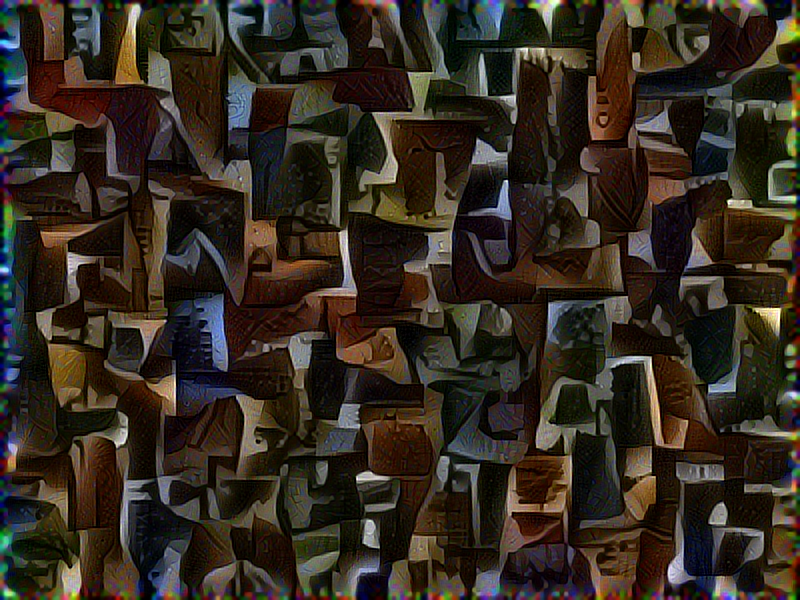

<ins class="pa-widget-gallery" style="width:100%;height:480px;" data-url="https://photos.app.goo.gl/5SeREKdmYuIzMSv12" data-uid="a90e0a139729a5c528a40248a28bb24d40e5e2e34fe08d8ff242a931a974be64" data-delay="2" data-repeat="true">
</ins>

# MindsEye - Java 8 Neural Networks
 
Welcome! This is MindsEye, a neural network library written in Java 8. Low-level computation is provided by CuDNN and other native libraries.

## Links

**Component Documentation** - [simiacryptus.github.io/NetworkZoo/](https://simiacryptus.github.io/NetworkZoo/layers/index.html) - Test-generated documentation reports detailing each neural network component type.

**JavaDocs** - [simiacryptus.github.io/MindsEye/apidocs/](https://simiacryptus.github.io/MindsEye/apidocs/index.html) - API documentation for the current release

**Project Site** - [simiacryptus.github.io/MindsEye/](https://simiacryptus.github.io/MindsEye/) - The current maven-published site

**Maven** - [mvnrepository.com/artifact/com.simiacryptus/mindseye](http://mvnrepository.com/artifact/com.simiacryptus/mindseye) - Dependency import information

**Blog Articles** - [http://simiacryptus.com](http://blog.simiacryptus.com/search/label/MindsEye) - Related articles from the author

## Features

* Java - Use Java 8+, Scala, or any other JVM language.

* Support for multiple GPUs and high performance math using native libraries including CuDNN, CUDA, and OpenCL.

* A highly modular optimization engine - It can be configured for many popular algorithms, or customized for optimization research. 

* A large and extensible component library with a focus on automated testing and documentation.

* Utilize server clusters with Apache Spark for data-parallel training.

* Built-in JSON serialization for all networks.

* Output Markdown or HTML Notebook-style reports for documentation and research.

* Directly regress input datasets - learning is not limited to network weights.

## Architecture Tour

### Foundation Types

A few central types form the basis for this entire library:

#### Tensor

The [Tensor](https://github.com/SimiaCryptus/MindsEye/blob/master/src/main/java/com/simiacryptus/mindseye/lang/Tensor.java) class provides facilities for efficiently using multidimensional arrays. It has a fairly simple API of get and set methods, as well as a variety of optimizations for index access, memory management, etc. These arrays are allocated as a single object, and they use a dense rectangular layout - this means all bounds are uniform (dimension 1 always has the same range, as does dimension 2, etc) and all values are stored in memory (no compression of sparseness)

Many components assume a specific "image data schema", which includes the following four dimensions: 

1. **Spacial dimension: X** - The first dimension, organizing rows of pixels into a spatial structure

2. **Spacial dimension: Y** - A second dimension with a local spatial structure

3. **Set dimension: Color Band** - This dimension organizes the color bands in a normal raster image, and represents an unstructured data vector.

4. **Sequence dimension: Batch Index** - This dimension allows many training examples to be stacked into a sequence of independent values.

#### NNLayer

The [NNLayer](https://github.com/SimiaCryptus/MindsEye/blob/master/src/main/java/com/simiacryptus/mindseye/lang/NNLayer.java) class defines the fundamental unit of our neural networks: a single differentiable multivariate operation which may contain state. Its methods and the related classes define the core capabilities:

* eval() - The eval method performs the primary ("forward") calculation. 

* getJson() - Serializes the component.

* fromJson() - Static method to deserialize a generic NNLayer component.

A [NNResult](https://github.com/SimiaCryptus/MindsEye/blob/master/src/main/java/com/simiacryptus/mindseye/lang/NNResult.java) provides both the result data and a callback method to evaluate the gradient using a given DeltaSet. NNResult is also used as the input to the central eval method, which enables chaining these differentiable operations together. By chaining them together, we can form larger NNLayer components; they are composable.

A [DeltaSet](https://github.com/SimiaCryptus/MindsEye/blob/master/src/main/java/com/simiacryptus/mindseye/lang/DeltaSet.java) provides a buffer of pending deltas to apply to various double arrays. It keeps references to the layerType and specific double[] data location, and accumulates values in an identically sized buffer collection. This gives us a convenient interface for working with and applying delta vectors.

### Component Library

There is a large and ever-changing library of components available. Each class has documentation generated for it by its test cases, the documentation reports are stored in the [reports directory](reports/com/).

#### JSON Serialization

All components support serialization to/from json. Any network can be read via the [NNLayer::fromJson](https://github.com/SimiaCryptus/MindsEye/blob/master/src/main/java/com/simiacryptus/mindseye/lang/NNLayer.java#L87) method, and captured via its [getJson](https://github.com/SimiaCryptus/MindsEye/blob/master/src/main/java/com/simiacryptus/mindseye/layers/NNLayer.java#L115) method. JSON is intended to be the primary mechanism for serialization, though Kryo is sometimes used for cloning. Each component test report contains a JSON representation.

### Networks

In order for components to be useful, we need to be able to combine them into networks. The NNLayer/NNResult structures provide foundational support, which is then wrapped in more convenient network creation APIs outlined in this section. Each of these networks is itself also a NNLayer, and can thus be nested themselves into larger multi-level networks.

#### Generic DAGs

The [base API](https://github.com/SimiaCryptus/MindsEye/blob/master/src/main/java/com/simiacryptus/mindseye/network/DAGNetwork.java) to create networks supports arbitrary directed acyclic graphs (DAGs) and provides the most general structure with the most powerful and complex methods. Specialized networks will wrap a generic DAG with additional data and constraints to provide more convenient construction methods.

#### Pipelines

The simplest and most common network is a [pipeline](https://github.com/SimiaCryptus/MindsEye/blob/master/src/main/java/com/simiacryptus/mindseye/network/PipelineNetwork.java), which is a single sequential chain of components. This simple structure also simplifies the creation API with a single, simple add() method.

#### Supervised Networks

Supervised learning means that the ideal, desired output is given along with an input. [This type](https://github.com/SimiaCryptus/MindsEye/blob/master/src/main/java/com/simiacryptus/mindseye/network/SupervisedNetwork.java) of network has two multivariate inputs and a single univariate output. The [most common](https://github.com/SimiaCryptus/MindsEye/blob/master/src/main/java/com/simiacryptus/mindseye/network/SimpleLossNetwork.java) simply combines a loss component and a training component to provide a network.

#### Composite Components

Several other networks act primarily as components themselves, intended for use in a larger network. For example, regularization layers such as [Normalization Layer](https://github.com/SimiaCryptus/MindsEye/blob/master/src/main/java/com/simiacryptus/mindseye/layers/java/NormalizationMetaLayer.java) use a meta layerType to aggregate some signal statistic, such as the average value, and then uses that value in an operation to remove the related component. For example, it might subtract the average value so that the result has a zero mean.

### Optimization

Particular attention has been paid during the development of this library on the optimization components. We have identified commonalities in the typical optimization algorithms and captured them as individual components. First, we will review this structure, then review how major optimization algorithms are formed using them.

First we need to combine our network with training data and an execution method. This produces a [Trainable](https://github.com/SimiaCryptus/MindsEye/blob/master/src/main/java/com/simiacryptus/mindseye/opt/trainable/Trainable.java) object, a self-contained optimization problem that hides virtually all details of the network or data set, so we can give it to a generic optimizer. This object controls data sampling behavior, providing approximations with controlled randomization.

The **Iterator** defines the api for using the optimization process; It moderates the interaction between the other components. Two main types are the [IterativeTrainer](https://github.com/SimiaCryptus/MindsEye/blob/master/src/main/java/com/simiacryptus/mindseye/opt/IterativeTrainer.java), which will synchronously search in a single loop using a single starting point and a single in-memory model, and the ValidatingTrainer which adds a second “validation” trainable to guide convergence conditions and sampling behavior. 

The Iterator calls the [Orienter](https://github.com/SimiaCryptus/MindsEye/blob/master/src/main/java/com/simiacryptus/mindseye/opt/orient/OrientationStrategy.java) and [Stepper](https://github.com/SimiaCryptus/MindsEye/blob/master/src/main/java/com/simiacryptus/mindseye/opt/line/LineSearchStrategy.java) in a loop, passing the Monitor object around to provide debugging callbacks. The Orienter will determine the direction a given step should take, and the Stepper both determines the size of the step and performs the step, updating the model.

The Orienter is a strategy to determine the search direction. The simplest example for a differentiable function is "steepest descent" which blindly modifies the weights in the direction of the gradient. More advanced methods include the quasi-newton L-BFGS algorithm.

The Stepper searches along the given univariate function, also known as a "line search". On each step, it measures the fitness and derivative, and will iteratively attempt to find an approximate (or exact) minimum along that line. Our default implementation uses an adaptive step size window that is determined by what are known as the [Armijo and Wolfe](https://github.com/SimiaCryptus/MindsEye/blob/master/src/main/java/com/simiacryptus/mindseye/opt/line/ArmijoWolfeSearch.java) line search constraints, and takes a single “acceptable” step. These constraints basically ensure that the step size is not too large or small, respectively, by comparing both the value and gradient over the step. Other alternatives include the QudadraticSearch, which uses a quadratic model (linear derivative) to estimate the minimum - this method converges quickly on the absolute minimum of the line search, and is used in conjugate gradient descent - and StaticRateSearch which uses a static step size, attempting smaller steps only if a non-improving step is found.

Finally, the [Monitor](https://github.com/SimiaCryptus/MindsEye/blob/master/src/main/java/com/simiacryptus/mindseye/opt/TrainingMonitor.java) provides a way for the executing application to monitor the progress of the task, capturing logging and taking network snapshots, for example. It may also determine auxiliary stopping conditions.

#### Standard Methods

##### Stochastic Gradient Descent

The "gradient descent" part of SGD is defined by the simplest orientations strategy, which simply moves along the [raw gradient](https://github.com/SimiaCryptus/MindsEye/blob/master/src/main/java/com/simiacryptus/mindseye/opt/orient/GradientDescent.java). The stochastic part is implemented in a trainable component ([SampledArrayTrainable](https://github.com/SimiaCryptus/MindsEye/blob/master/src/main/java/com/simiacryptus/mindseye/eval/SampledArrayTrainable.java)) that uses a random subset of the training data for evaluation.

##### L1 and L2 normalization

Normalization factors could be implemented as part of the network itself, summing its own weights into the output. However, we can also encapsulate the trainable object to modify the optimized function. We have two such components, [one](https://github.com/SimiaCryptus/MindsEye/blob/master/src/main/java/com/simiacryptus/mindseye/opt/trainable/ConstL12Normalizer.java) uses constant factors and [the other ](https://github.com/SimiaCryptus/MindsEye/blob/master/src/main/java/com/simiacryptus/mindseye/eval/L12Normalizer.java)allows you to specify constants for each layerType.

##### Momentum

[Momentum](https://github.com/SimiaCryptus/MindsEye/blob/master/src/main/java/com/simiacryptus/mindseye/opt/orient/MomentumStrategy.java) can be added to the orientations strategy by wrapping an underlying strategy such as Gradient Descent. Momentum will keep a delta vector in its memory, using it to accumulate new movement and modifying the returned vector (orientated line search).

##### L-BFGS

[L-BFGS](https://github.com/SimiaCryptus/MindsEye/blob/master/src/main/java/com/simiacryptus/mindseye/opt/orient/LBFGS.java) uses previously sampled points (along with their gradients) to estimate something known as the inverse Hessian. The Hessian is to a gradient as a second derivative is to a first, and knowing it can allow us to adapt our step since instead of a linear local model we now have a quadratic local model, which has a known minimum. This makes a more informed selection of both our step direction and our step size (since the orientated step is not necessarily a unit vector). It is implemented as an orientations strategy.

##### OWL-QN

In the case of [OWL-QN](https://github.com/SimiaCryptus/MindsEye/blob/master/src/main/java/com/simiacryptus/mindseye/opt/orient/OwlQn.java), the Orientation strategy passes a special "line search problem" to the stepper that isn’t a simple straight line. Instead, the line is constrained to the current “orthant”, and will follow the orthant boundaries where some weight values are zero. This “trust region” approach is very effective in finding a sparse model where many weights are zero.

OWL-QN is also implemented as an orientations strategy which wraps another "base" strategy. This new strategy will then wrap the line search object returned by the base strategy, and this new line search object will implement the orthant.

A very [similar strategy](https://github.com/SimiaCryptus/MindsEye/blob/master/src/main/java/com/simiacryptus/mindseye/opt/orient/TrustRegionStrategy.java) is used in a more general fashion to support arbitrary per-layerType trust regions, as discussed below.

#### Trust Regions

[Trust Regions](https://github.com/SimiaCryptus/MindsEye/blob/master/src/main/java/com/simiacryptus/mindseye/opt/region/TrustRegion.java) let us bound where each step takes us, controlling the search while minimally interfering with the overall optimization. They can cause the search to proceed with a different pattern, as in OWL-QN where we can promote sparse values. This can also be used to specify that a particular layerType should not change at all, which is effectively a point-sized trust region. They can also enforce arbitrary constraints on the weights, such as "no weights are negative" in a particular bias layerType.

Trust regions work by remapping a proposed point (i.e. Set of parameters) onto its nearest point within the trust region, which is a multidimensional volume determined by the point at the start of each step. The result is visualized by an otherwise uninterrupted line search being projected onto the surface of a volume when the line leaves the volume. 

For a valid trust region function, we have some requirements:

* The renormalized point, if it is different from the proposed point, must be on the volume’s boundary

* The vector from the normalized to the proposed point is perpendicular to the volume surface

* Every point in space must be reachable from some walk of points, each step of which falls within the respective trust region

* The point used to define the volume is within the volume

Many different trust regions are provided, including:

* [SingleOrthant](https://github.com/SimiaCryptus/MindsEye/blob/master/src/main/java/com/simiacryptus/mindseye/opt/region/SingleOrthant.java) - Enforces the constraint used in OWL-QN

* [StaticConstraint](https://github.com/SimiaCryptus/MindsEye/blob/master/src/main/java/com/simiacryptus/mindseye/opt/region/StaticConstraint.java) - Prevents changes to the weights

* [LinearSumConstraint](https://github.com/SimiaCryptus/MindsEye/blob/master/src/main/java/com/simiacryptus/mindseye/opt/region/LinearSumConstraint.java) - The sum of the absolute value of weights cannot increase (simplified explanation)

* [MeanVarianceGradient](https://github.com/SimiaCryptus/MindsEye/blob/master/src/main/java/com/simiacryptus/mindseye/opt/region/MeanVarianceGradient.java) - Allows only a regular offset and scaling factor to be applied equally to the weights. The preserves randomness or configuration, depending.

* [CompoundRegion](https://github.com/SimiaCryptus/MindsEye/blob/master/src/main/java/com/simiacryptus/mindseye/opt/region/CompoundRegion.java) - Allows multiple trust regions to be combined by intersection.

### Spark Execution

An [implementation](https://github.com/SimiaCryptus/MindsEye/blob/master/src/main/java/com/simiacryptus/mindseye/eval/SparkTrainable.java) of a Trainer is provided for data-parallel training using Spark. This allows an RDD of Tensors to be evaluated against the network across a cluster, performing a separate Spark operation for each training step. It is of use if a single step of training takes several minutes on a single machine.
