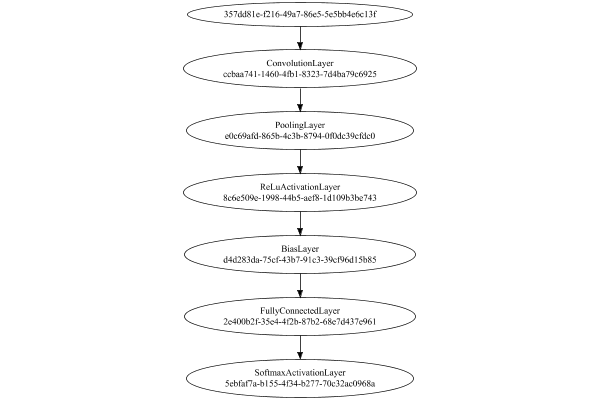
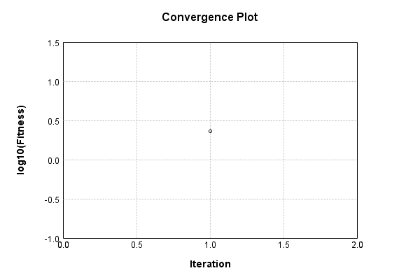
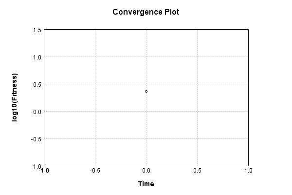

# CIFAR10 Classification


The image-to-vector network is a single layer convolutional:

Code from [CifarTests.java:63](../../../../../../../../src/test/java/com/simiacryptus/mindseye/labs/matrix/CifarTests.java#L63) executed in 0.00 seconds: 
```java
    PipelineNetwork network = new PipelineNetwork();
    network.add(new ConvolutionLayer(3, 3, 3, 5).setWeights(i -> 1e-8 * (Math.random() - 0.5)));
    network.add(new PoolingLayer().setMode(PoolingLayer.PoolingMode.Max));
    network.add(new ReLuActivationLayer());
    network.add(new BiasLayer(16, 16, 5));
    network.add(new FullyConnectedLayer(new int[]{16, 16, 5}, new int[]{features})
      .setWeights(() -> 0.001 * (Math.random() - 0.45)));
    network.add(new SoftmaxActivationLayer());
    return network;
```

Returns: 

```
    PipelineNetwork/09084c3c-106e-4fcf-96bb-b19d12c806bf
```


### Network Diagram
Code from [ClassifyProblem.java:80](../../../../../../../../src/main/java/com/simiacryptus/mindseye/test/ClassifyProblem.java#L80) executed in 0.32 seconds: 
```java
    return Graphviz.fromGraph(TestUtil.toGraph(network))
      .height(400).width(600).render(Format.PNG).toImage();
```

Returns: 




### Training
Adding performance wrappers

Code from [TestUtil.java:269](../../../../../../../../src/main/java/com/simiacryptus/mindseye/test/TestUtil.java#L269) executed in 0.00 seconds: 
```java
    network.visitNodes(node -> {
      if (!(node.getLayer() instanceof MonitoringWrapperLayer)) {
        node.setLayer(new MonitoringWrapperLayer(node.getLayer()).shouldRecordSignalMetrics(false));
      }
      else {
        ((MonitoringWrapperLayer) node.getLayer()).shouldRecordSignalMetrics(false);
      }
    });
```

Optimized via the Orthantwise Quasi-Newton search method:

Code from [TextbookOptimizers.java:105](../../../../../../../../src/test/java/com/simiacryptus/mindseye/labs/matrix/TextbookOptimizers.java#L105) executed in 0.00 seconds: 
```java
    ValidatingTrainer trainer = new ValidatingTrainer(trainingSubject, validationSubject)
      .setMinTrainingSize(Integer.MAX_VALUE)
      .setMonitor(monitor);
    trainer.getRegimen().get(0)
      .setOrientation(new OwlQn())
      .setLineSearchFactory(name -> new ArmijoWolfeSearch()
        .setAlpha(name.contains("OWL") ? 1.0 : 1e-6));
    return trainer;
```

Returns: 

```
    com.simiacryptus.mindseye.opt.ValidatingTrainer@3090e0fd
```


Code from [ClassifyProblem.java:91](../../../../../../../../src/main/java/com/simiacryptus/mindseye/test/ClassifyProblem.java#L91) executed in 43.67 seconds: 
```java
    trainer.setTimeout(timeoutMinutes, TimeUnit.MINUTES).setMaxIterations(10000).run();
```
Logging: 
```
    Epoch parameters: 4999, 1
    Phase 0: TrainingPhase{trainingSubject=PerformanceWrapper{inner=SampledArrayTrainable{inner=ArrayTrainable{inner=com.simiacryptus.mindseye.eval.GpuTrainable@63a7d8a3}}}, orientation=com.simiacryptus.mindseye.opt.orient.OwlQn@5d289bcd}
    resetAndMeasure; trainingSize=4999
    LBFGS Accumulation History: 1 points
    Constructing line search parameters: OWL/QN
    th(0)=2.3025850930066643;dx=-0.7621107232676744
    New Minimum: 2.3025850930066643 > 2.3025850929940455
    Armijo: th(2.154434690031884)=2.3025850929940455; dx=0.0 delta=1.261879489788953E-11
    Armijo: th(1.077217345015942)=2.3025850929940455; dx=0.0 delta=1.261879489788953E-11
    Armijo: th(0.3590724483386473)=2.3025850929940455; dx=0.0 delta=1.261879489788953E-11
    Armijo: th(0.08976811208466183)=2.3025850929940455; dx=0.0 delta=1.261879489788953E-11
    Armijo: th(0.017953622416932366)=2.3025850929940455; dx=0.0 delta=1.261879489788953E-11
    Armijo: th(0.002992270402822061)=2.3025850929940455; dx=0.0 delta=1.261879489788953E-11
    Armijo: th(4.2
```
...[skipping 1136 bytes](etc/3.txt)...
```
    7451943557E-5)=2.3025850929940455; dx=0.0 delta=0.0
    Armijo: th(6.395487259717785E-6)=2.3025850929940455; dx=0.0 delta=0.0
    Armijo: th(2.131829086572595E-6)=2.3025850929940455; dx=0.0 delta=0.0
    Armijo: th(5.329572716431488E-7)=2.3025850929940455; dx=0.0 delta=0.0
    Armijo: th(1.0659145432862975E-7)=2.3025850929940455; dx=0.0 delta=0.0
    Armijo: th(1.776524238810496E-8)=2.3025850929940455; dx=0.0 delta=0.0
    Armijo: th(2.53789176972928E-9)=2.3025850929940455; dx=0.0 delta=0.0
    END: th(3.1723647121616E-10)=2.3025850929940455; dx=0.0 delta=0.0
    Overall network state change: {FullyConnectedLayer=1.0, BiasLayer=0.0, ConvolutionLayer=0.0}
    Iteration 2 failed, aborting. Error: 2.3025850929940455 (4999 in 15.604 seconds; 0.018 in orientation, 1.979 in gc, 15.586 in line search; 17.291 eval time)
    Epoch 2 result with 1 iterations, 4999/2147483647 samples: {validation *= 2^0.00000; training *= 2^0.000; Overtraining = NaN}, {itr*=Infinity, len*=NaN} 1 since improvement; 2.8601 validation time
    Training 2 runPhase halted
    
```

Code from [ClassifyProblem.java:95](../../../../../../../../src/main/java/com/simiacryptus/mindseye/test/ClassifyProblem.java#L95) executed in 0.01 seconds: 
```java
    return TestUtil.plot(history);
```

Returns: 




Code from [ClassifyProblem.java:98](../../../../../../../../src/main/java/com/simiacryptus/mindseye/test/ClassifyProblem.java#L98) executed in 0.01 seconds: 
```java
    return TestUtil.plotTime(history);
```

Returns: 




Per-layer Performance Metrics:

Code from [TestUtil.java:234](../../../../../../../../src/main/java/com/simiacryptus/mindseye/test/TestUtil.java#L234) executed in 0.00 seconds: 
```java
    Map<NNLayer, MonitoringWrapperLayer> metrics = new HashMap<>();
    network.visitNodes(node -> {
      if ((node.getLayer() instanceof MonitoringWrapperLayer)) {
        MonitoringWrapperLayer layer = node.getLayer();
        metrics.put(layer.getInner(), layer);
      }
    });
    System.out.println("Forward Performance: \n\t" + metrics.entrySet().stream().map(e -> {
      PercentileStatistics performance = e.getValue().getForwardPerformance();
      return String.format("%s -> %.6fs +- %.6fs (%s)", e.getKey(), performance.getMean(), performance.getStdDev(), performance.getCount());
    }).reduce((a, b) -> a + "\n\t" + b));
    System.out.println("Backward Performance: \n\t" + metrics.entrySet().stream().map(e -> {
      PercentileStatistics performance = e.getValue().getBackwardPerformance();
      return String.format("%s -> %.6fs +- %.6fs (%s)", e.getKey(), performance.getMean(), performance.getStdDev(), performance.getCount());
    }).reduce((a, b) -> a + "\n\t" + b));
```
Logging: 
```
    Forward Performance: 
    	Optional[PipelineNetwork/09084c3c-106e-4fcf-96bb-b19d12c806bf -> 0.651439s +- 0.211630s (48.0)
    	EntropyLossLayer/8614b055-4ac5-48b7-9d0b-b0b43eb1c971 -> 0.002977s +- 0.005592s (48.0)]
    Backward Performance: 
    	Optional[PipelineNetwork/09084c3c-106e-4fcf-96bb-b19d12c806bf -> 0.000204s +- 0.000071s (48.0)
    	EntropyLossLayer/8614b055-4ac5-48b7-9d0b-b0b43eb1c971 -> 0.000000s +- 0.000000s (48.0)]
    
```

Removing performance wrappers

Code from [TestUtil.java:252](../../../../../../../../src/main/java/com/simiacryptus/mindseye/test/TestUtil.java#L252) executed in 0.00 seconds: 
```java
    network.visitNodes(node -> {
      if (node.getLayer() instanceof MonitoringWrapperLayer) {
        node.setLayer(node.<MonitoringWrapperLayer>getLayer().getInner());
      }
    });
```

Saved model as [classification_model0.json](etc/classification_model0.json)

### Validation
If we run our model against the entire validation dataset, we get this accuracy:

Code from [ClassifyProblem.java:108](../../../../../../../../src/main/java/com/simiacryptus/mindseye/test/ClassifyProblem.java#L108) executed in 20.22 seconds: 
```java
    return data.validationData().mapToDouble(labeledObject ->
      predict(network, labeledObject)[0] == parse(labeledObject.label) ? 1 : 0)
      .average().getAsDouble() * 100;
```

Returns: 

```
    10.05100510051005
```


Let's examine some incorrectly predicted results in more detail:

Code from [ClassifyProblem.java:115](../../../../../../../../src/main/java/com/simiacryptus/mindseye/test/ClassifyProblem.java#L115) executed in 0.26 seconds: 
```java
    try {
      TableOutput table = new TableOutput();
      data.validationData().map(labeledObject -> {
        return toRow(log, labeledObject, GpuController.call(ctx -> network.eval(ctx, labeledObject.data)).getData().get(0).getData());
      }).filter(x -> null != x).limit(10).forEach(table::putRow);
      return table;
    } catch (IOException e) {
      throw new RuntimeException(e);
    }
```

Returns: 

Image | Prediction
----- | ----------
![[6]](etc/classification_test.37.png) | 0 (10.0%), 1 (10.0%), 2 (10.0%)
![[9]](etc/classification_test.38.png) | 0 (10.0%), 1 (10.0%), 2 (10.0%)
![[9]](etc/classification_test.39.png) | 0 (10.0%), 1 (10.0%), 2 (10.0%)
![[4]](etc/classification_test.40.png) | 0 (10.0%), 1 (10.0%), 2 (10.0%)
![[1]](etc/classification_test.41.png) | 0 (10.0%), 1 (10.0%), 2 (10.0%)
![[1]](etc/classification_test.42.png) | 0 (10.0%), 1 (10.0%), 2 (10.0%)
![[2]](etc/classification_test.43.png) | 0 (10.0%), 1 (10.0%), 2 (10.0%)
![[7]](etc/classification_test.44.png) | 0 (10.0%), 1 (10.0%), 2 (10.0%)
![[8]](etc/classification_test.45.png) | 0 (10.0%), 1 (10.0%), 2 (10.0%)
![[3]](etc/classification_test.46.png) | 0 (10.0%), 1 (10.0%), 2 (10.0%)


