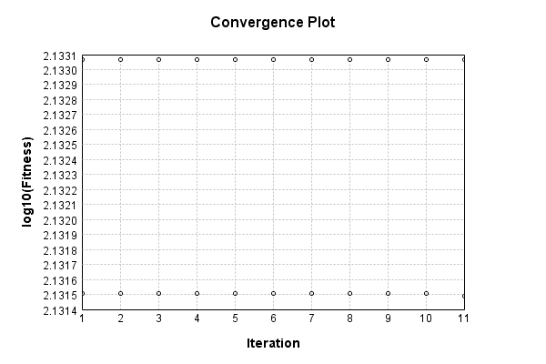
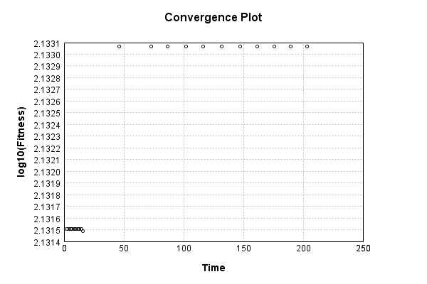

# CIFAR10 Image-to-Vector Encoding


The vector-to-image network uses a fully connected layer then a single convolutional layer:

Code from [CifarTests.java:94](../../../../../../../../src/test/java/com/simiacryptus/mindseye/labs/matrix/CifarTests.java#L94) executed in 0.08 seconds: 
```java
    PipelineNetwork network = new PipelineNetwork();
    network.add(new FullyConnectedLayer(new int[]{features}, new int[]{32, 32, 5})
      .setWeights(() -> 0.25 * (Math.random() - 0.5)));
    network.add(new ReLuActivationLayer());
    network.add(new ConvolutionLayer(3, 3, 5, 3)
      .setWeights(i -> 1e-8 * (Math.random() - 0.5)));
    network.add(new BiasLayer(32, 32, 3));
    network.add(new ReLuActivationLayer());
    return network;
```

Returns: 

```
    PipelineNetwork/dea978b0-e5cc-48d7-a290-8f271429b492
```


### Network Diagram
Code from [EncodingProblem.java:91](../../../../../../../../src/main/java/com/simiacryptus/mindseye/test/EncodingProblem.java#L91) executed in 2.13 seconds: 
```java
    return Graphviz.fromGraph(TestUtil.toGraph(imageNetwork))
      .height(400).width(600).render(Format.PNG).toImage();
```

Returns: 


### Training
We start by training with a very small population to improve initial convergence performance:

Adding performance wrappers

Code from [TestUtil.java:269](../../../../../../../../src/main/java/com/simiacryptus/mindseye/test/TestUtil.java#L269) executed in 0.00 seconds: 
```java
    network.visitNodes(node -> {
      if (!(node.getLayer() instanceof MonitoringWrapperLayer)) {
        node.setLayer(new MonitoringWrapperLayer(node.getLayer()).shouldRecordSignalMetrics(false));
      }
      else {
        ((MonitoringWrapperLayer) node.getLayer()).shouldRecordSignalMetrics(false);
      }
    });
```

Optimized via the Orthantwise Quasi-Newton search method:

Code from [TextbookOptimizers.java:105](../../../../../../../../src/test/java/com/simiacryptus/mindseye/labs/matrix/TextbookOptimizers.java#L105) executed in 0.01 seconds: 
```java
    ValidatingTrainer trainer = new ValidatingTrainer(trainingSubject, validationSubject)
      .setMinTrainingSize(Integer.MAX_VALUE)
      .setMonitor(monitor);
    trainer.getRegimen().get(0)
      .setOrientation(new OwlQn())
      .setLineSearchFactory(name -> new ArmijoWolfeSearch()
        .setAlpha(name.contains("OWL") ? 1.0 : 1e-6));
    return trainer;
```

Returns: 

```
    com.simiacryptus.mindseye.opt.ValidatingTrainer@5e81e5ac
```


Code from [EncodingProblem.java:113](../../../../../../../../src/main/java/com/simiacryptus/mindseye/test/EncodingProblem.java#L113) executed in 25.37 seconds: 
```java
    preTrainer.setTimeout(timeoutMinutes / 2, TimeUnit.MINUTES).setMaxIterations(batchSize).run();
```
Logging: 
```
    Found 2 devices
    Device 0 - GeForce GTX 1080 Ti
    Device 1 - GeForce GTX 1060 6GB
    Found 2 devices; using devices [0, 1]
    Epoch parameters: 15000, 1
    Phase 0: TrainingPhase{trainingSubject=PerformanceWrapper{inner=SampledArrayTrainable{inner=ArrayTrainable{inner=com.simiacryptus.mindseye.eval.GpuTrainable@30990c1b}}}, orientation=com.simiacryptus.mindseye.opt.orient.OwlQn@2453f95d}
    resetAndMeasure; trainingSize=15000
    LBFGS Accumulation History: 1 points
    Constructing line search parameters: OWL/QN
    th(0)=135.36545791442748;dx=-9.091177932818703E-4
    New Minimum: 135.36545791442748 > 135.36545759496522
    END: th(2.154434690031884)=135.36545759496522; dx=-2.966264646971707E-7 delta=3.1946225931278605E-7
    Overall network state change: {FullyConnectedLayer=1.0, BiasLayer=0.0, ConvolutionLayer=1.0, PlaceholderLayer=9.9961e-01 +- 5.6839e-05 [9.9956e-01 - 9.9988e-01] (1000#)}
    Iteration 1 complete. Error: 135.36545759496522 (15000 in 1.877 seconds; 0.236 in orientation, 0.265 in gc, 1.613 in line search; 2.474 eval t
```
...[skipping 6886 bytes](etc/1.txt)...
```
    73e-01 - 6.3712e-01] (1000#)}
    Iteration 11 complete. Error: 135.36011437711284 (15000 in 1.605 seconds; 0.046 in orientation, 0.205 in gc, 1.556 in line search; 1.542 eval time)
    Orientation vanished. Popping history element from 135.36531028064974, 135.36508224995228, 135.36429996035886, 135.36011437711284
    LBFGS Accumulation History: 3 points
    th(0)=135.36011437711284;dx=-0.003790343678222378
    MAX ALPHA: th(0)=135.36011437711284;th'(0)=-0.003790343678222378;
    Overall network state change: {FullyConnectedLayer=1.0, BiasLayer=0.0, ConvolutionLayer=1.0, PlaceholderLayer=1.0000e+00 +- 0.0000e+00 [1.0000e+00 - 1.0000e+00] (1000#)}
    Iteration 12 failed, aborting. Error: 135.36011437711284 (15000 in 1.722 seconds; 0.066 in orientation, 0.169 in gc, 1.654 in line search; 1.633 eval time)
    Epoch 2 result with 11 iterations, 15000/2147483647 samples: {validation *= 2^-0.00006; training *= 2^-0.000; Overtraining = 1.00}, {itr*=95.06, len*=0.71} 0 since improvement; 0.6572 validation time
    Training 2 runPhase halted
    
```

Per-layer Performance Metrics:

Code from [TestUtil.java:234](../../../../../../../../src/main/java/com/simiacryptus/mindseye/test/TestUtil.java#L234) executed in 0.00 seconds: 
```java
    Map<NNLayer, MonitoringWrapperLayer> metrics = new HashMap<>();
    network.visitNodes(node -> {
      if ((node.getLayer() instanceof MonitoringWrapperLayer)) {
        MonitoringWrapperLayer layer = node.getLayer();
        metrics.put(layer.getInner(), layer);
      }
    });
    System.out.println("Forward Performance: \n\t" + metrics.entrySet().stream().map(e -> {
      PercentileStatistics performance = e.getValue().getForwardPerformance();
      return String.format("%s -> %.6fs +- %.6fs (%s)", e.getKey(), performance.getMean(), performance.getStdDev(), performance.getCount());
    }).reduce((a, b) -> a + "\n\t" + b));
    System.out.println("Backward Performance: \n\t" + metrics.entrySet().stream().map(e -> {
      PercentileStatistics performance = e.getValue().getBackwardPerformance();
      return String.format("%s -> %.6fs +- %.6fs (%s)", e.getKey(), performance.getMean(), performance.getStdDev(), performance.getCount());
    }).reduce((a, b) -> a + "\n\t" + b));
```
Logging: 
```
    Forward Performance: 
    	Optional[EntropyLossLayer/f0cbcae5-ce2f-4707-9508-c03d1d267c55 -> 0.000731s +- 0.000843s (58.0)
    	SoftmaxActivationLayer/ce104741-803d-4a2b-a6f6-a3f4c017e077 -> 0.001959s +- 0.002045s (58.0)
    	LinearActivationLayer/88a93555-2638-4de9-a48c-238cdc7c5937 -> 0.000961s +- 0.003893s (58.0)
    	NthPowerActivationLayer/b0c4ad9d-bdbb-4b29-9e94-476040f5d91c -> 0.001349s +- 0.004383s (58.0)
    	SumInputsLayer/bb8235a8-e295-417b-bb27-5dc619356ae7 -> 0.000747s +- 0.001439s (58.0)
    	MeanSqLossLayer/05380122-44c3-4fbc-a0a4-bbc1bb2ee1a2 -> 0.015008s +- 0.017401s (58.0)
    	PipelineNetwork/dea978b0-e5cc-48d7-a290-8f271429b492 -> 0.221251s +- 0.079288s (58.0)]
    Backward Performance: 
    	Optional[EntropyLossLayer/f0cbcae5-ce2f-4707-9508-c03d1d267c55 -> 0.000002s +- 0.000002s (52.0)
    	SoftmaxActivationLayer/ce104741-803d-4a2b-a6f6-a3f4c017e077 -> 0.000001s +- 0.000001s (52.0)
    	LinearActivationLayer/88a93555-2638-4de9-a48c-238cdc7c5937 -> 0.000001s +- 0.000000s (52.0)
    	NthPowerActivationLayer/b0c4ad9d-bdbb-4b29-9e94-476040f5d91c -> 0.000001s +- 0.000002s (58.0)
    	SumInputsLayer/bb8235a8-e295-417b-bb27-5dc619356ae7 -> 0.000000s +- 0.000000s (58.0)
    	MeanSqLossLayer/05380122-44c3-4fbc-a0a4-bbc1bb2ee1a2 -> 0.000026s +- 0.000031s (58.0)
    	PipelineNetwork/dea978b0-e5cc-48d7-a290-8f271429b492 -> 0.000532s +- 0.000135s (58.0)]
    
```

Removing performance wrappers

Code from [TestUtil.java:252](../../../../../../../../src/main/java/com/simiacryptus/mindseye/test/TestUtil.java#L252) executed in 0.00 seconds: 
```java
    network.visitNodes(node -> {
      if (node.getLayer() instanceof MonitoringWrapperLayer) {
        node.setLayer(node.<MonitoringWrapperLayer>getLayer().getInner());
      }
    });
```

Then our main training phase:

Adding performance wrappers

Code from [TestUtil.java:269](../../../../../../../../src/main/java/com/simiacryptus/mindseye/test/TestUtil.java#L269) executed in 0.00 seconds: 
```java
    network.visitNodes(node -> {
      if (!(node.getLayer() instanceof MonitoringWrapperLayer)) {
        node.setLayer(new MonitoringWrapperLayer(node.getLayer()).shouldRecordSignalMetrics(false));
      }
      else {
        ((MonitoringWrapperLayer) node.getLayer()).shouldRecordSignalMetrics(false);
      }
    });
```

Optimized via the Orthantwise Quasi-Newton search method:

Code from [TextbookOptimizers.java:105](../../../../../../../../src/test/java/com/simiacryptus/mindseye/labs/matrix/TextbookOptimizers.java#L105) executed in 0.00 seconds: 
```java
    ValidatingTrainer trainer = new ValidatingTrainer(trainingSubject, validationSubject)
      .setMinTrainingSize(Integer.MAX_VALUE)
      .setMonitor(monitor);
    trainer.getRegimen().get(0)
      .setOrientation(new OwlQn())
      .setLineSearchFactory(name -> new ArmijoWolfeSearch()
        .setAlpha(name.contains("OWL") ? 1.0 : 1e-6));
    return trainer;
```

Returns: 

```
    com.simiacryptus.mindseye.opt.ValidatingTrainer@3e813240
```


Code from [EncodingProblem.java:123](../../../../../../../../src/main/java/com/simiacryptus/mindseye/test/EncodingProblem.java#L123) executed in 204.77 seconds: 
```java
    mainTrainer.setTimeout(timeoutMinutes, TimeUnit.MINUTES).setMaxIterations(batchSize).run();
```
Logging: 
```
    Epoch parameters: 15000, 1
    Phase 0: TrainingPhase{trainingSubject=PerformanceWrapper{inner=SampledArrayTrainable{inner=ArrayTrainable{inner=com.simiacryptus.mindseye.eval.GpuTrainable@7eb03525}}}, orientation=com.simiacryptus.mindseye.opt.orient.OwlQn@d0dac13}
    resetAndMeasure; trainingSize=15000
    LBFGS Accumulation History: 1 points
    Constructing line search parameters: OWL/QN
    th(0)=135.85187201297776;dx=-0.001039525165185287
    New Minimum: 135.85187201297776 > 135.85187193380864
    END: th(2.154434690031884)=135.85187193380864; dx=-7.349573577905641E-8 delta=7.916912636574125E-8
    Overall network state change: {FullyConnectedLayer=1.0, BiasLayer=0.0, ConvolutionLayer=1.0, PlaceholderLayer=9.9996e-01 +- 5.4606e-06 [9.9995e-01 - 1.0000e+00] (9999#)}
    Iteration 1 complete. Error: 135.85187193380864 (15000 in 13.005 seconds; 0.188 in orientation, 1.935 in gc, 12.798 in line search; 19.334 eval time)
    Epoch 1 result with 2 iterations, 15000/2147483647 samples: {validation *= 2^-0.00000; training *= 2^-0.000; Overt
```
...[skipping 6764 bytes](etc/2.txt)...
```
    - 9.9118e-01] (9999#)}
    Iteration 11 complete. Error: 135.85150333930125 (15000 in 13.494 seconds; 0.571 in orientation, 2.086 in gc, 12.904 in line search; 12.741 eval time)
    Orientation vanished. Popping history element from 135.8518397852057, 135.8518013161024, 135.85171395499114, 135.85150333930125
    LBFGS Accumulation History: 3 points
    th(0)=135.85150333930125;dx=-0.0011464532566211115
    MAX ALPHA: th(0)=135.85150333930125;th'(0)=-0.0011464532566211115;
    Overall network state change: {FullyConnectedLayer=1.0, BiasLayer=0.0, ConvolutionLayer=1.0, PlaceholderLayer=1.0000e+00 +- 0.0000e+00 [1.0000e+00 - 1.0000e+00] (9999#)}
    Iteration 12 failed, aborting. Error: 135.85150333930125 (15000 in 13.815 seconds; 0.643 in orientation, 2.281 in gc, 13.148 in line search; 13.015 eval time)
    Epoch 2 result with 11 iterations, 15000/2147483647 samples: {validation *= 2^-0.00000; training *= 2^-0.000; Overtraining = 1.00}, {itr*=362.57, len*=0.71} 0 since improvement; 6.1334 validation time
    Training 2 runPhase halted
    
```

Per-layer Performance Metrics:

Code from [TestUtil.java:234](../../../../../../../../src/main/java/com/simiacryptus/mindseye/test/TestUtil.java#L234) executed in 0.00 seconds: 
```java
    Map<NNLayer, MonitoringWrapperLayer> metrics = new HashMap<>();
    network.visitNodes(node -> {
      if ((node.getLayer() instanceof MonitoringWrapperLayer)) {
        MonitoringWrapperLayer layer = node.getLayer();
        metrics.put(layer.getInner(), layer);
      }
    });
    System.out.println("Forward Performance: \n\t" + metrics.entrySet().stream().map(e -> {
      PercentileStatistics performance = e.getValue().getForwardPerformance();
      return String.format("%s -> %.6fs +- %.6fs (%s)", e.getKey(), performance.getMean(), performance.getStdDev(), performance.getCount());
    }).reduce((a, b) -> a + "\n\t" + b));
    System.out.println("Backward Performance: \n\t" + metrics.entrySet().stream().map(e -> {
      PercentileStatistics performance = e.getValue().getBackwardPerformance();
      return String.format("%s -> %.6fs +- %.6fs (%s)", e.getKey(), performance.getMean(), performance.getStdDev(), performance.getCount());
    }).reduce((a, b) -> a + "\n\t" + b));
```
Logging: 
```
    Forward Performance: 
    	Optional[EntropyLossLayer/f0cbcae5-ce2f-4707-9508-c03d1d267c55 -> 0.009255s +- 0.013634s (58.0)
    	SoftmaxActivationLayer/ce104741-803d-4a2b-a6f6-a3f4c017e077 -> 0.015720s +- 0.010025s (58.0)
    	LinearActivationLayer/88a93555-2638-4de9-a48c-238cdc7c5937 -> 0.008770s +- 0.020038s (58.0)
    	NthPowerActivationLayer/b0c4ad9d-bdbb-4b29-9e94-476040f5d91c -> 0.006717s +- 0.005885s (58.0)
    	SumInputsLayer/bb8235a8-e295-417b-bb27-5dc619356ae7 -> 0.004274s +- 0.004168s (58.0)
    	MeanSqLossLayer/05380122-44c3-4fbc-a0a4-bbc1bb2ee1a2 -> 0.137792s +- 0.056853s (58.0)
    	PipelineNetwork/dea978b0-e5cc-48d7-a290-8f271429b492 -> 2.007744s +- 0.379411s (58.0)]
    Backward Performance: 
    	Optional[EntropyLossLayer/f0cbcae5-ce2f-4707-9508-c03d1d267c55 -> 0.000002s +- 0.000002s (52.0)
    	SoftmaxActivationLayer/ce104741-803d-4a2b-a6f6-a3f4c017e077 -> 0.000001s +- 0.000001s (52.0)
    	LinearActivationLayer/88a93555-2638-4de9-a48c-238cdc7c5937 -> 0.000001s +- 0.000001s (52.0)
    	NthPowerActivationLayer/b0c4ad9d-bdbb-4b29-9e94-476040f5d91c -> 0.000001s +- 0.000002s (58.0)
    	SumInputsLayer/bb8235a8-e295-417b-bb27-5dc619356ae7 -> 0.000000s +- 0.000001s (58.0)
    	MeanSqLossLayer/05380122-44c3-4fbc-a0a4-bbc1bb2ee1a2 -> 0.000031s +- 0.000007s (58.0)
    	PipelineNetwork/dea978b0-e5cc-48d7-a290-8f271429b492 -> 0.000476s +- 0.000077s (58.0)]
    
```

Removing performance wrappers

Code from [TestUtil.java:252](../../../../../../../../src/main/java/com/simiacryptus/mindseye/test/TestUtil.java#L252) executed in 0.00 seconds: 
```java
    network.visitNodes(node -> {
      if (node.getLayer() instanceof MonitoringWrapperLayer) {
        node.setLayer(node.<MonitoringWrapperLayer>getLayer().getInner());
      }
    });
```

Code from [EncodingProblem.java:129](../../../../../../../../src/main/java/com/simiacryptus/mindseye/test/EncodingProblem.java#L129) executed in 0.11 seconds: 
```java
    return TestUtil.plot(history);
```

Returns: 




Code from [EncodingProblem.java:132](../../../../../../../../src/main/java/com/simiacryptus/mindseye/test/EncodingProblem.java#L132) executed in 0.02 seconds: 
```java
    return TestUtil.plotTime(history);
```

Returns: 




Saved model as [encoding_model0.json](etc/encoding_model0.json)

### Results
Code from [EncodingProblem.java:142](../../../../../../../../src/main/java/com/simiacryptus/mindseye/test/EncodingProblem.java#L142) executed in 0.11 seconds: 
```java
    TableOutput table = new TableOutput();
    Arrays.stream(trainingData).map(tensorArray -> {
      try {
        Tensor predictionSignal = GpuController.call(ctx -> testNetwork.eval(ctx, tensorArray)).getData().get(0);
        LinkedHashMap<String, Object> row = new LinkedHashMap<String, Object>();
        row.put("Source", log.image(tensorArray[1].toImage(), ""));
        row.put("Echo", log.image(predictionSignal.toImage(), ""));
        return row;
      } catch (IOException e) {
        throw new RuntimeException(e);
      }
    }).filter(x -> null != x).limit(10).forEach(table::putRow);
    return table;
```

Returns: 

Source | Echo
------ | ----
  |  
  |  
  |  
 | 
 | 
 | 
 | 
 | 
 | 
 | 


Learned Model Statistics:

Code from [EncodingProblem.java:159](../../../../../../../../src/main/java/com/simiacryptus/mindseye/test/EncodingProblem.java#L159) executed in 0.01 seconds: 
```java
    ScalarStatistics scalarStatistics = new ScalarStatistics();
    trainingNetwork.state().stream().flatMapToDouble(x -> Arrays.stream(x))
      .forEach(v -> scalarStatistics.add(v));
    return scalarStatistics.getMetrics();
```

Returns: 

```
    {meanExponent=-1.3374140576584088, negative=25669, min=-0.12499903805019641, max=1.0, mean=-7.130105965707018E-5, count=54411.0, positive=25535, stdDev=0.07045329195953505, zeros=3207}
```


Learned Representation Statistics:

Code from [EncodingProblem.java:167](../../../../../../../../src/main/java/com/simiacryptus/mindseye/test/EncodingProblem.java#L167) executed in 0.01 seconds: 
```java
    ScalarStatistics scalarStatistics = new ScalarStatistics();
    Arrays.stream(trainingData)
      .flatMapToDouble(row -> Arrays.stream(row[0].getData()))
      .forEach(v -> scalarStatistics.add(v));
    return scalarStatistics.getMetrics();
```

Returns: 

```
    {meanExponent=-1.6032785098759998, negative=49347, min=-0.260808144834795, max=0.3789906270057131, mean=7.470472373453482E-5, count=99990.0, positive=49720, stdDev=0.05121655104189623, zeros=923}
```


Some rendered unit vectors:


