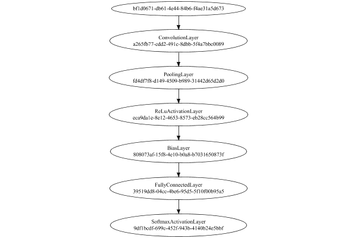
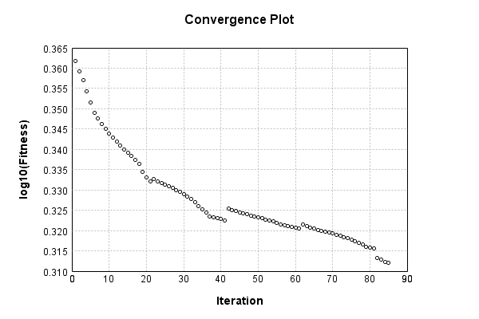
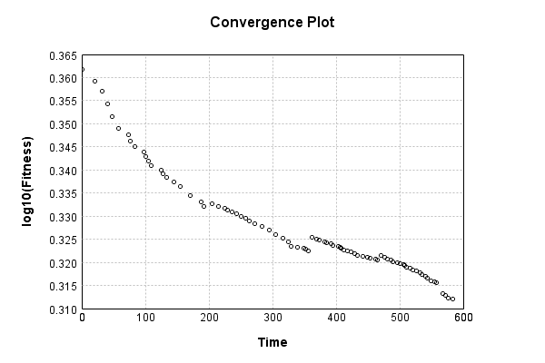

# CIFAR10 Classification


The image-to-vector network is a single layer convolutional:

Code from [CifarTests.java:63](../../../../../../../../src/test/java/com/simiacryptus/mindseye/labs/matrix/CifarTests.java#L63) executed in 0.00 seconds: 
```java
    PipelineNetwork network = new PipelineNetwork();
    network.add(new ConvolutionLayer(3, 3, 3, 5).setWeights(i -> 1e-8 * (Math.random() - 0.5)));
    network.add(new PoolingLayer().setMode(PoolingLayer.PoolingMode.Max));
    network.add(new ReLuActivationLayer());
    network.add(new BiasLayer(16, 16, 5));
    network.add(new FullyConnectedLayer(new int[]{16, 16, 5}, new int[]{features})
      .setWeights(() -> 0.001 * (Math.random() - 0.45)));
    network.add(new SoftmaxActivationLayer());
    return network;
```

Returns: 

```
    PipelineNetwork/133c58cc-d653-4ef6-83f1-6aae2e5e4aee
```


### Network Diagram
Code from [ClassifyProblem.java:80](../../../../../../../../src/main/java/com/simiacryptus/mindseye/test/ClassifyProblem.java#L80) executed in 0.23 seconds: 
```java
    return Graphviz.fromGraph(TestUtil.toGraph(network))
      .height(400).width(600).render(Format.PNG).toImage();
```

Returns: 




### Training
Adding performance wrappers

Code from [TestUtil.java:269](../../../../../../../../src/main/java/com/simiacryptus/mindseye/test/TestUtil.java#L269) executed in 0.00 seconds: 
```java
    network.visitNodes(node -> {
      if (!(node.getLayer() instanceof MonitoringWrapperLayer)) {
        node.setLayer(new MonitoringWrapperLayer(node.getLayer()).shouldRecordSignalMetrics(false));
      }
      else {
        ((MonitoringWrapperLayer) node.getLayer()).shouldRecordSignalMetrics(false);
      }
    });
```

Optimized via the Quadratic Quasi-Newton method:

Code from [OptimizerComparison.java:46](../../../../../../../../src/test/java/com/simiacryptus/mindseye/labs/matrix/OptimizerComparison.java#L46) executed in 0.00 seconds: 
```java
    ValidatingTrainer trainer = new ValidatingTrainer(trainingSubject, validationSubject)
      .setMonitor(monitor);
    trainer.getRegimen().get(0)
      .setOrientation(new com.simiacryptus.mindseye.opt.orient.QQN())
      .setLineSearchFactory(name -> new QuadraticSearch()
        .setCurrentRate(name.contains("QQN") ? 1.0 : 1e-6)
        .setRelativeTolerance(2e-1));
    return trainer;
```

Returns: 

```
    com.simiacryptus.mindseye.opt.ValidatingTrainer@803b3ba
```


Code from [ClassifyProblem.java:91](../../../../../../../../src/main/java/com/simiacryptus/mindseye/test/ClassifyProblem.java#L91) executed in 608.51 seconds: 
```java
    trainer.setTimeout(timeoutMinutes, TimeUnit.MINUTES).setMaxIterations(10000).run();
```
Logging: 
```
    Epoch parameters: 4999, 1
    Phase 0: TrainingPhase{trainingSubject=PerformanceWrapper{inner=SampledArrayTrainable{inner=ArrayTrainable{inner=com.simiacryptus.mindseye.eval.GpuTrainable@74e728cb}}}, orientation=com.simiacryptus.mindseye.opt.orient.QQN@59c6c38f}
    resetAndMeasure; trainingSize=4999
    LBFGS Accumulation History: 1 points
    Constructing line search parameters: GD
    F(0.0) = LineSearchPoint{point=PointSample{avg=2.3025850929940455}, derivative=-0.21982251429681776}
    New Minimum: 2.3025850929940455 > 2.302585000343859
    F(1.0E-6) = LineSearchPoint{point=PointSample{avg=2.302585000343859}, derivative=-0.18537681354184893}, delta = -9.265018663384694E-8
    New Minimum: 2.302585000343859 > 2.302584444248403
    F(7.0E-6) = LineSearchPoint{point=PointSample{avg=2.302584444248403}, derivative=-0.18535480840225607}, delta = -6.487456425396942E-7
    New Minimum: 2.302584444248403 > 2.3025805532925485
    F(4.9E-5) = LineSearchPoint{point=PointSample{avg=2.3025805532925485}, derivative=-0.18521247422261475}, delta = -4.53
```
...[skipping 133891 bytes](etc/6.txt)...
```
    83278905}, delta = -4.6675482362967813E-4
    F(5.692539296596087E-5) = LineSearchPoint{point=PointSample{avg=2.0516346664655805}, derivative=51.77081675562364}, delta = -0.0010736000886812924
    2.0516346664655805 <= 2.0527082665542618
    New Minimum: 2.0515441619553028 > 2.0514251769074785
    F(4.03879340685513E-5) = LineSearchPoint{point=PointSample{avg=2.0514251769074785}, derivative=1.1521880462097727}, delta = -0.001283089646783253
    Right bracket at 4.03879340685513E-5
    Converged to right
    Overall network state change: {FullyConnectedLayer=0.9978618796118693, BiasLayer=0.9990055596018482, ConvolutionLayer=0.9976222361567405}
    Iteration 85 complete. Error: 2.0514251769074785 (2291 in 6.545 seconds; 0.004 in orientation, 0.310 in gc, 6.541 in line search; 6.492 eval time)
    Training timeout
    Epoch 6 result with 5 iterations, 2291/2147483647 samples: {validation *= 2^-0.00235; training *= 2^-0.006; Overtraining = 2.49}, {itr*=14.79, len*=1.12} 0 since improvement; 2.9200 validation time
    Training 6 runPhase halted
    
```

Code from [ClassifyProblem.java:95](../../../../../../../../src/main/java/com/simiacryptus/mindseye/test/ClassifyProblem.java#L95) executed in 0.01 seconds: 
```java
    return TestUtil.plot(history);
```

Returns: 




Code from [ClassifyProblem.java:98](../../../../../../../../src/main/java/com/simiacryptus/mindseye/test/ClassifyProblem.java#L98) executed in 0.01 seconds: 
```java
    return TestUtil.plotTime(history);
```

Returns: 




Per-layer Performance Metrics:

Code from [TestUtil.java:234](../../../../../../../../src/main/java/com/simiacryptus/mindseye/test/TestUtil.java#L234) executed in 0.00 seconds: 
```java
    Map<NNLayer, MonitoringWrapperLayer> metrics = new HashMap<>();
    network.visitNodes(node -> {
      if ((node.getLayer() instanceof MonitoringWrapperLayer)) {
        MonitoringWrapperLayer layer = node.getLayer();
        metrics.put(layer.getInner(), layer);
      }
    });
    System.out.println("Forward Performance: \n\t" + metrics.entrySet().stream().map(e -> {
      PercentileStatistics performance = e.getValue().getForwardPerformance();
      return String.format("%s -> %.6fs +- %.6fs (%s)", e.getKey(), performance.getMean(), performance.getStdDev(), performance.getCount());
    }).reduce((a, b) -> a + "\n\t" + b));
    System.out.println("Backward Performance: \n\t" + metrics.entrySet().stream().map(e -> {
      PercentileStatistics performance = e.getValue().getBackwardPerformance();
      return String.format("%s -> %.6fs +- %.6fs (%s)", e.getKey(), performance.getMean(), performance.getStdDev(), performance.getCount());
    }).reduce((a, b) -> a + "\n\t" + b));
```
Logging: 
```
    Forward Performance: 
    	Optional[PipelineNetwork/133c58cc-d653-4ef6-83f1-6aae2e5e4aee -> 0.389313s +- 0.170686s (1086.0)
    	EntropyLossLayer/6702dbce-9241-42f0-9807-7594fcfd57c9 -> 0.001572s +- 0.005046s (1086.0)]
    Backward Performance: 
    	Optional[PipelineNetwork/133c58cc-d653-4ef6-83f1-6aae2e5e4aee -> 0.000187s +- 0.000060s (1086.0)
    	EntropyLossLayer/6702dbce-9241-42f0-9807-7594fcfd57c9 -> 0.000001s +- 0.000004s (1086.0)]
    
```

Removing performance wrappers

Code from [TestUtil.java:252](../../../../../../../../src/main/java/com/simiacryptus/mindseye/test/TestUtil.java#L252) executed in 0.00 seconds: 
```java
    network.visitNodes(node -> {
      if (node.getLayer() instanceof MonitoringWrapperLayer) {
        node.setLayer(node.<MonitoringWrapperLayer>getLayer().getInner());
      }
    });
```

Saved model as [classification_model1.json](etc/classification_model1.json)

### Validation
If we run our model against the entire validation dataset, we get this accuracy:

Code from [ClassifyProblem.java:108](../../../../../../../../src/main/java/com/simiacryptus/mindseye/test/ClassifyProblem.java#L108) executed in 18.91 seconds: 
```java
    return data.validationData().mapToDouble(labeledObject ->
      predict(network, labeledObject)[0] == parse(labeledObject.label) ? 1 : 0)
      .average().getAsDouble() * 100;
```

Returns: 

```
    28.04280428042804
```


Let's examine some incorrectly predicted results in more detail:

Code from [ClassifyProblem.java:115](../../../../../../../../src/main/java/com/simiacryptus/mindseye/test/ClassifyProblem.java#L115) executed in 0.06 seconds: 
```java
    try {
      TableOutput table = new TableOutput();
      data.validationData().map(labeledObject -> {
        return toRow(log, labeledObject, GpuController.call(ctx -> network.eval(ctx, labeledObject.data)).getData().get(0).getData());
      }).filter(x -> null != x).limit(10).forEach(table::putRow);
      return table;
    } catch (IOException e) {
      throw new RuntimeException(e);
    }
```

Returns: 

Image | Prediction
----- | ----------
![[9]](etc/classification_test.83.png) | 1 (24.4%), 8 (18.7%), 5 (9.3%) 
![[4]](etc/classification_test.84.png) | 6 (16.6%), 5 (15.8%), 3 (12.8%)
![[1]](etc/classification_test.85.png) | 8 (21.4%), 9 (18.0%), 1 (11.8%)
![[2]](etc/classification_test.86.png) | 1 (16.3%), 2 (12.0%), 0 (12.0%)
![[8]](etc/classification_test.87.png) | 3 (15.5%), 5 (14.9%), 0 (12.0%)
![[3]](etc/classification_test.88.png) | 9 (37.3%), 0 (11.7%), 8 (10.9%)
![[4]](etc/classification_test.89.png) | 5 (14.1%), 4 (11.6%), 3 (11.4%)
![[7]](etc/classification_test.90.png) | 0 (25.5%), 9 (14.0%), 7 (12.9%)
![[7]](etc/classification_test.91.png) | 9 (30.3%), 0 (19.9%), 8 (13.2%)
![[2]](etc/classification_test.92.png) | 5 (21.1%), 6 (19.2%), 3 (18.2%)


