# CIFAR10 Image-to-Vector Encoding


The vector-to-image network uses a fully connected layer then a single convolutional layer:

Code from [CifarTests.java:94](../../../../../../../../src/test/java/com/simiacryptus/mindseye/labs/matrix/CifarTests.java#L94) executed in 0.01 seconds: 
```java
    PipelineNetwork network = new PipelineNetwork();
    network.add(new FullyConnectedLayer(new int[]{features}, new int[]{32, 32, 5})
      .setWeights(() -> 0.25 * (Math.random() - 0.5)));
    network.add(new ReLuActivationLayer());
    network.add(new ConvolutionLayer(3, 3, 5, 3)
      .setWeights(i -> 1e-8 * (Math.random() - 0.5)));
    network.add(new BiasLayer(32, 32, 3));
    network.add(new ReLuActivationLayer());
    return network;
```

Returns: 

```
    PipelineNetwork/1c95bd7b-8ec8-4dfc-84c2-69da4b582815
```


### Network Diagram
Code from [EncodingProblem.java:91](../../../../../../../../src/main/java/com/simiacryptus/mindseye/test/EncodingProblem.java#L91) executed in 0.20 seconds: 
```java
    return Graphviz.fromGraph(TestUtil.toGraph(imageNetwork))
      .height(400).width(600).render(Format.PNG).toImage();
```

Returns: 

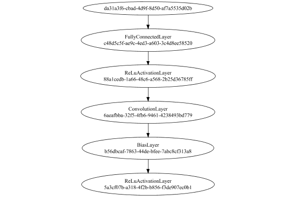


### Training
We start by training with a very small population to improve initial convergence performance:

Adding performance wrappers

Code from [TestUtil.java:269](../../../../../../../../src/main/java/com/simiacryptus/mindseye/test/TestUtil.java#L269) executed in 0.00 seconds: 
```java
    network.visitNodes(node -> {
      if (!(node.getLayer() instanceof MonitoringWrapperLayer)) {
        node.setLayer(new MonitoringWrapperLayer(node.getLayer()).shouldRecordSignalMetrics(false));
      }
      else {
        ((MonitoringWrapperLayer) node.getLayer()).shouldRecordSignalMetrics(false);
      }
    });
```

Optimized via the Quadratic Quasi-Newton method:

Code from [OptimizerComparison.java:46](../../../../../../../../src/test/java/com/simiacryptus/mindseye/labs/matrix/OptimizerComparison.java#L46) executed in 0.00 seconds: 
```java
    ValidatingTrainer trainer = new ValidatingTrainer(trainingSubject, validationSubject)
      .setMonitor(monitor);
    trainer.getRegimen().get(0)
      .setOrientation(new com.simiacryptus.mindseye.opt.orient.QQN())
      .setLineSearchFactory(name -> new QuadraticSearch()
        .setCurrentRate(name.contains("QQN") ? 1.0 : 1e-6)
        .setRelativeTolerance(2e-1));
    return trainer;
```

Returns: 

```
    com.simiacryptus.mindseye.opt.ValidatingTrainer@31bfb813
```


Code from [EncodingProblem.java:113](../../../../../../../../src/main/java/com/simiacryptus/mindseye/test/EncodingProblem.java#L113) executed in 302.44 seconds: 
```java
    preTrainer.setTimeout(timeoutMinutes / 2, TimeUnit.MINUTES).setMaxIterations(batchSize).run();
```
Logging: 
```
    Epoch parameters: 15000, 1
    Phase 0: TrainingPhase{trainingSubject=PerformanceWrapper{inner=SampledArrayTrainable{inner=ArrayTrainable{inner=com.simiacryptus.mindseye.eval.GpuTrainable@6c5c4ae1}}}, orientation=com.simiacryptus.mindseye.opt.orient.QQN@5490742}
    resetAndMeasure; trainingSize=15000
    LBFGS Accumulation History: 1 points
    Constructing line search parameters: GD
    F(0.0) = LineSearchPoint{point=PointSample{avg=135.36544990768357}, derivative=-9.042170774208681E-4}
    New Minimum: 135.36544990768357 > 135.3654499071551
    F(1.0E-6) = LineSearchPoint{point=PointSample{avg=135.3654499071551}, derivative=-0.001007219610154033}, delta = -5.284732651489321E-10
    New Minimum: 135.3654499071551 > 135.36544990397869
    F(7.0E-6) = LineSearchPoint{point=PointSample{avg=135.36544990397869}, derivative=-9.965713119238534E-4}, delta = -3.704883511090884E-9
    New Minimum: 135.36544990397869 > 135.3654498817438
    F(4.9E-5) = LineSearchPoint{point=PointSample{avg=135.3654498817438}, derivative=-9.847319970925725E-4}, delta 
```
...[skipping 99339 bytes](etc/4.txt)...
```
    ineSearchPoint{point=PointSample{avg=55.692652816504335}, derivative=0.17341338815746304}, delta = -0.03779718611654914
    55.692652816504335 <= 55.730450002620884
    New Minimum: 55.692652816504335 > 55.6838671273901
    F(0.46245808599847027) = LineSearchPoint{point=PointSample{avg=55.6838671273901}, derivative=0.01141517099202349}, delta = -0.04658287523078286
    Right bracket at 0.46245808599847027
    Converged to right
    Overall network state change: {FullyConnectedLayer=0.9992975443360339, ConvolutionLayer=0.9999997077283462, BiasLayer=1.0000002228931686, PlaceholderLayer=9.9965e-01 +- 9.3537e-04 [9.9480e-01 - 1.0037e+00] (1000#)}
    Iteration 61 complete. Error: 55.6838671273901 (1873 in 2.893 seconds; 0.072 in orientation, 0.457 in gc, 2.818 in line search; 2.768 eval time)
    Training timeout
    Epoch 7 result with 7 iterations, 1873/2147483647 samples: {validation *= 2^-0.00728; training *= 2^-0.007; Overtraining = 1.00}, {itr*=8.40, len*=0.71} 0 since improvement; 0.6883 validation time
    Training 7 runPhase halted
    
```

Per-layer Performance Metrics:

Code from [TestUtil.java:234](../../../../../../../../src/main/java/com/simiacryptus/mindseye/test/TestUtil.java#L234) executed in 0.00 seconds: 
```java
    Map<NNLayer, MonitoringWrapperLayer> metrics = new HashMap<>();
    network.visitNodes(node -> {
      if ((node.getLayer() instanceof MonitoringWrapperLayer)) {
        MonitoringWrapperLayer layer = node.getLayer();
        metrics.put(layer.getInner(), layer);
      }
    });
    System.out.println("Forward Performance: \n\t" + metrics.entrySet().stream().map(e -> {
      PercentileStatistics performance = e.getValue().getForwardPerformance();
      return String.format("%s -> %.6fs +- %.6fs (%s)", e.getKey(), performance.getMean(), performance.getStdDev(), performance.getCount());
    }).reduce((a, b) -> a + "\n\t" + b));
    System.out.println("Backward Performance: \n\t" + metrics.entrySet().stream().map(e -> {
      PercentileStatistics performance = e.getValue().getBackwardPerformance();
      return String.format("%s -> %.6fs +- %.6fs (%s)", e.getKey(), performance.getMean(), performance.getStdDev(), performance.getCount());
    }).reduce((a, b) -> a + "\n\t" + b));
```
Logging: 
```
    Forward Performance: 
    	Optional[NthPowerActivationLayer/19f83210-1e9e-4171-b378-a29747d60d88 -> 0.000906s +- 0.002294s (828.0)
    	LinearActivationLayer/2eb1dba2-0362-4217-a721-45989ae05337 -> 0.000470s +- 0.002249s (828.0)
    	SoftmaxActivationLayer/c274264f-d266-40b2-b5ab-50d28aa4a9cb -> 0.001633s +- 0.004997s (828.0)
    	EntropyLossLayer/52635f17-144a-420d-8436-dd1bb4a57fa1 -> 0.000734s +- 0.002026s (828.0)
    	MeanSqLossLayer/b16ee580-53cd-49ac-a9a1-9475ed539ee4 -> 0.013698s +- 0.015529s (828.0)
    	SumInputsLayer/2ee1bd02-340d-4c64-8ccf-f3cabf5605b7 -> 0.000589s +- 0.001700s (828.0)
    	PipelineNetwork/1c95bd7b-8ec8-4dfc-84c2-69da4b582815 -> 0.206585s +- 0.067220s (828.0)]
    Backward Performance: 
    	Optional[NthPowerActivationLayer/19f83210-1e9e-4171-b378-a29747d60d88 -> 0.000001s +- 0.000002s (828.0)
    	LinearActivationLayer/2eb1dba2-0362-4217-a721-45989ae05337 -> 0.000001s +- 0.000003s (812.0)
    	SoftmaxActivationLayer/c274264f-d266-40b2-b5ab-50d28aa4a9cb -> 0.000001s +- 0.000003s (812.0)
    	EntropyLossLayer/52635f17-144a-420d-8436-dd1bb4a57fa1 -> 0.000002s +- 0.000006s (812.0)
    	MeanSqLossLayer/b16ee580-53cd-49ac-a9a1-9475ed539ee4 -> 0.000026s +- 0.000024s (828.0)
    	SumInputsLayer/2ee1bd02-340d-4c64-8ccf-f3cabf5605b7 -> 0.000000s +- 0.000000s (828.0)
    	PipelineNetwork/1c95bd7b-8ec8-4dfc-84c2-69da4b582815 -> 0.000527s +- 0.000087s (828.0)]
    
```

Removing performance wrappers

Code from [TestUtil.java:252](../../../../../../../../src/main/java/com/simiacryptus/mindseye/test/TestUtil.java#L252) executed in 0.00 seconds: 
```java
    network.visitNodes(node -> {
      if (node.getLayer() instanceof MonitoringWrapperLayer) {
        node.setLayer(node.<MonitoringWrapperLayer>getLayer().getInner());
      }
    });
```

Then our main training phase:

Adding performance wrappers

Code from [TestUtil.java:269](../../../../../../../../src/main/java/com/simiacryptus/mindseye/test/TestUtil.java#L269) executed in 0.00 seconds: 
```java
    network.visitNodes(node -> {
      if (!(node.getLayer() instanceof MonitoringWrapperLayer)) {
        node.setLayer(new MonitoringWrapperLayer(node.getLayer()).shouldRecordSignalMetrics(false));
      }
      else {
        ((MonitoringWrapperLayer) node.getLayer()).shouldRecordSignalMetrics(false);
      }
    });
```

Optimized via the Quadratic Quasi-Newton method:

Code from [OptimizerComparison.java:46](../../../../../../../../src/test/java/com/simiacryptus/mindseye/labs/matrix/OptimizerComparison.java#L46) executed in 0.00 seconds: 
```java
    ValidatingTrainer trainer = new ValidatingTrainer(trainingSubject, validationSubject)
      .setMonitor(monitor);
    trainer.getRegimen().get(0)
      .setOrientation(new com.simiacryptus.mindseye.opt.orient.QQN())
      .setLineSearchFactory(name -> new QuadraticSearch()
        .setCurrentRate(name.contains("QQN") ? 1.0 : 1e-6)
        .setRelativeTolerance(2e-1));
    return trainer;
```

Returns: 

```
    com.simiacryptus.mindseye.opt.ValidatingTrainer@1ce66a0a
```


Code from [EncodingProblem.java:123](../../../../../../../../src/main/java/com/simiacryptus/mindseye/test/EncodingProblem.java#L123) executed in 639.76 seconds: 
```java
    mainTrainer.setTimeout(timeoutMinutes, TimeUnit.MINUTES).setMaxIterations(batchSize).run();
```
Logging: 
```
    Epoch parameters: 15000, 1
    Phase 0: TrainingPhase{trainingSubject=PerformanceWrapper{inner=SampledArrayTrainable{inner=ArrayTrainable{inner=com.simiacryptus.mindseye.eval.GpuTrainable@40cfe132}}}, orientation=com.simiacryptus.mindseye.opt.orient.QQN@fb41890}
    resetAndMeasure; trainingSize=15000
    LBFGS Accumulation History: 1 points
    Constructing line search parameters: GD
    F(0.0) = LineSearchPoint{point=PointSample{avg=102.74504290405488}, derivative=-2.6107537161620833}
    New Minimum: 102.74504290405488 > 102.7450415986992
    F(1.0E-6) = LineSearchPoint{point=PointSample{avg=102.7450415986992}, derivative=-2.610765889352873}, delta = -1.305355681324727E-6
    New Minimum: 102.7450415986992 > 102.74503376656386
    F(7.0E-6) = LineSearchPoint{point=PointSample{avg=102.74503376656386}, derivative=-2.6107498294877916}, delta = -9.137491019828303E-6
    New Minimum: 102.74503376656386 > 102.74497894155394
    F(4.9E-5) = LineSearchPoint{point=PointSample{avg=102.74497894155394}, derivative=-2.6107644278272044}, delta = -6.396
```
...[skipping 19723 bytes](etc/5.txt)...
```
    ineSearchPoint{point=PointSample{avg=58.862829927985146}, derivative=0.07197035888761419}, delta = -0.29070853482832604
    58.862829927985146 <= 59.15353846281347
    New Minimum: 58.862829927985146 > 58.84306260665608
    F(4.344224804746334) = LineSearchPoint{point=PointSample{avg=58.84306260665608}, derivative=8.518305476279312E-5}, delta = -0.3104758561573888
    Right bracket at 4.344224804746334
    Converged to right
    Overall network state change: {FullyConnectedLayer=0.997686260719227, ConvolutionLayer=0.9999971660088013, BiasLayer=1.0000010168813889, PlaceholderLayer=9.9784e-01 +- 1.3786e-02 [9.2129e-01 - 1.1775e+00] (9999#)}
    Iteration 12 complete. Error: 58.84306260665608 (5302 in 49.787 seconds; 1.010 in orientation, 7.663 in gc, 48.754 in line search; 47.863 eval time)
    Training timeout
    Epoch 4 result with 6 iterations, 5302/2147483647 samples: {validation *= 2^-0.04553; training *= 2^-0.046; Overtraining = 1.00}, {itr*=3.36, len*=0.71} 0 since improvement; 6.0971 validation time
    Training 4 runPhase halted
    
```

Per-layer Performance Metrics:

Code from [TestUtil.java:234](../../../../../../../../src/main/java/com/simiacryptus/mindseye/test/TestUtil.java#L234) executed in 0.00 seconds: 
```java
    Map<NNLayer, MonitoringWrapperLayer> metrics = new HashMap<>();
    network.visitNodes(node -> {
      if ((node.getLayer() instanceof MonitoringWrapperLayer)) {
        MonitoringWrapperLayer layer = node.getLayer();
        metrics.put(layer.getInner(), layer);
      }
    });
    System.out.println("Forward Performance: \n\t" + metrics.entrySet().stream().map(e -> {
      PercentileStatistics performance = e.getValue().getForwardPerformance();
      return String.format("%s -> %.6fs +- %.6fs (%s)", e.getKey(), performance.getMean(), performance.getStdDev(), performance.getCount());
    }).reduce((a, b) -> a + "\n\t" + b));
    System.out.println("Backward Performance: \n\t" + metrics.entrySet().stream().map(e -> {
      PercentileStatistics performance = e.getValue().getBackwardPerformance();
      return String.format("%s -> %.6fs +- %.6fs (%s)", e.getKey(), performance.getMean(), performance.getStdDev(), performance.getCount());
    }).reduce((a, b) -> a + "\n\t" + b));
```
Logging: 
```
    Forward Performance: 
    	Optional[NthPowerActivationLayer/19f83210-1e9e-4171-b378-a29747d60d88 -> 0.005835s +- 0.005127s (186.0)
    	LinearActivationLayer/2eb1dba2-0362-4217-a721-45989ae05337 -> 0.008832s +- 0.020974s (186.0)
    	SoftmaxActivationLayer/c274264f-d266-40b2-b5ab-50d28aa4a9cb -> 0.014675s +- 0.006676s (186.0)
    	EntropyLossLayer/52635f17-144a-420d-8436-dd1bb4a57fa1 -> 0.009393s +- 0.016093s (186.0)
    	MeanSqLossLayer/b16ee580-53cd-49ac-a9a1-9475ed539ee4 -> 0.123968s +- 0.056395s (186.0)
    	SumInputsLayer/2ee1bd02-340d-4c64-8ccf-f3cabf5605b7 -> 0.003864s +- 0.004279s (186.0)
    	PipelineNetwork/1c95bd7b-8ec8-4dfc-84c2-69da4b582815 -> 1.997443s +- 0.306540s (186.0)]
    Backward Performance: 
    	Optional[NthPowerActivationLayer/19f83210-1e9e-4171-b378-a29747d60d88 -> 0.000001s +- 0.000002s (186.0)
    	LinearActivationLayer/2eb1dba2-0362-4217-a721-45989ae05337 -> 0.000001s +- 0.000001s (176.0)
    	SoftmaxActivationLayer/c274264f-d266-40b2-b5ab-50d28aa4a9cb -> 0.000001s +- 0.000001s (176.0)
    	EntropyLossLayer/52635f17-144a-420d-8436-dd1bb4a57fa1 -> 0.000002s +- 0.000002s (176.0)
    	MeanSqLossLayer/b16ee580-53cd-49ac-a9a1-9475ed539ee4 -> 0.000030s +- 0.000012s (186.0)
    	SumInputsLayer/2ee1bd02-340d-4c64-8ccf-f3cabf5605b7 -> 0.000000s +- 0.000000s (186.0)
    	PipelineNetwork/1c95bd7b-8ec8-4dfc-84c2-69da4b582815 -> 0.000468s +- 0.000066s (186.0)]
    
```

Removing performance wrappers

Code from [TestUtil.java:252](../../../../../../../../src/main/java/com/simiacryptus/mindseye/test/TestUtil.java#L252) executed in 0.00 seconds: 
```java
    network.visitNodes(node -> {
      if (node.getLayer() instanceof MonitoringWrapperLayer) {
        node.setLayer(node.<MonitoringWrapperLayer>getLayer().getInner());
      }
    });
```

Code from [EncodingProblem.java:129](../../../../../../../../src/main/java/com/simiacryptus/mindseye/test/EncodingProblem.java#L129) executed in 0.01 seconds: 
```java
    return TestUtil.plot(history);
```

Returns: 

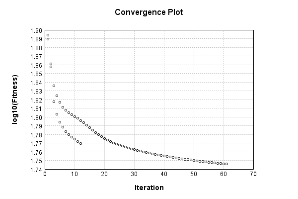


Code from [EncodingProblem.java:132](../../../../../../../../src/main/java/com/simiacryptus/mindseye/test/EncodingProblem.java#L132) executed in 0.01 seconds: 
```java
    return TestUtil.plotTime(history);
```

Returns: 

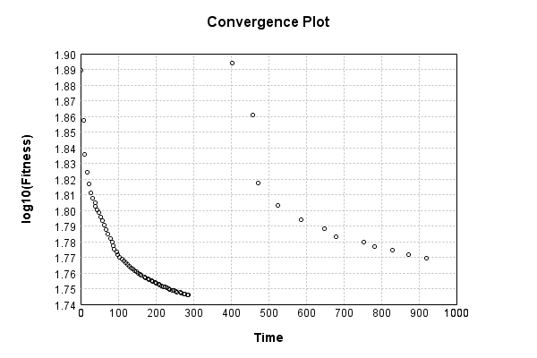


Saved model as [encoding_model1.json](etc/encoding_model1.json)

### Results
Code from [EncodingProblem.java:142](../../../../../../../../src/main/java/com/simiacryptus/mindseye/test/EncodingProblem.java#L142) executed in 0.08 seconds: 
```java
    TableOutput table = new TableOutput();
    Arrays.stream(trainingData).map(tensorArray -> {
      try {
        Tensor predictionSignal = GpuController.call(ctx -> testNetwork.eval(ctx, tensorArray)).getData().get(0);
        LinkedHashMap<String, Object> row = new LinkedHashMap<String, Object>();
        row.put("Source", log.image(tensorArray[1].toImage(), ""));
        row.put("Echo", log.image(predictionSignal.toImage(), ""));
        return row;
      } catch (IOException e) {
        throw new RuntimeException(e);
      }
    }).filter(x -> null != x).limit(10).forEach(table::putRow);
    return table;
```

Returns: 

Source | Echo
------ | ----
 | 
 | 
 | 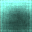
 | 
 | 
 | 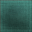
 | 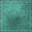
 | 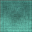
 | 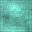
 | 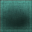


Learned Model Statistics:

Code from [EncodingProblem.java:159](../../../../../../../../src/main/java/com/simiacryptus/mindseye/test/EncodingProblem.java#L159) executed in 0.00 seconds: 
```java
    ScalarStatistics scalarStatistics = new ScalarStatistics();
    trainingNetwork.state().stream().flatMapToDouble(x -> Arrays.stream(x))
      .forEach(v -> scalarStatistics.add(v));
    return scalarStatistics.getMetrics();
```

Returns: 

```
    {meanExponent=-0.9736628637356557, negative=26023, min=-0.7470954808554378, max=89.56794217634722, mean=1.572306836575767, count=54411.0, positive=28387, stdDev=6.897792925546189, zeros=1}
```


Learned Representation Statistics:

Code from [EncodingProblem.java:167](../../../../../../../../src/main/java/com/simiacryptus/mindseye/test/EncodingProblem.java#L167) executed in 0.01 seconds: 
```java
    ScalarStatistics scalarStatistics = new ScalarStatistics();
    Arrays.stream(trainingData)
      .flatMapToDouble(row -> Arrays.stream(row[0].getData()))
      .forEach(v -> scalarStatistics.add(v));
    return scalarStatistics.getMetrics();
```

Returns: 

```
    {meanExponent=-1.0531803052122177, negative=49973, min=-0.84257553942803, max=0.8353044650499979, mean=0.002169373204728605, count=99990.0, positive=50017, stdDev=0.1651788540474282, zeros=0}
```


Some rendered unit vectors:

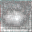

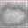

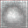

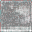
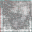

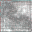
