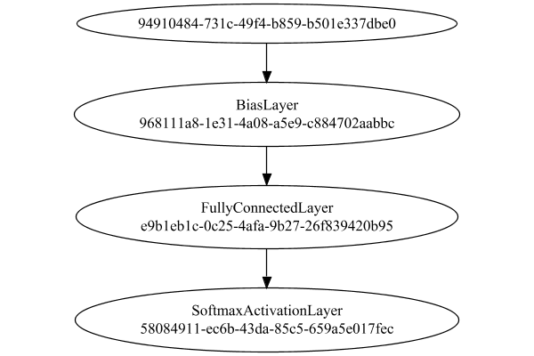
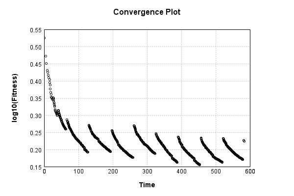

# CIFAR10 Classification


The image-to-vector network is a single layer, fully connected:

Code from [CifarTests.java:49](../../../../../../../../src/test/java/com/simiacryptus/mindseye/labs/matrix/CifarTests.java#L49) executed in 0.01 seconds: 
```java
    PipelineNetwork network = new PipelineNetwork();
    network.add(new BiasLayer(32, 32, 3));
    network.add(new FullyConnectedLayer(new int[]{32, 32, 3}, new int[]{features})
      .setWeights(() -> 0.001 * (Math.random() - 0.45)));
    network.add(new SoftmaxActivationLayer());
    return network;
```

Returns: 

```
    PipelineNetwork/9e32c1b9-55d1-46a7-b8f7-62ed25a39413
```


### Network Diagram
Code from [ClassifyProblem.java:80](../../../../../../../../src/main/java/com/simiacryptus/mindseye/test/ClassifyProblem.java#L80) executed in 0.18 seconds: 
```java
    return Graphviz.fromGraph(TestUtil.toGraph(network))
      .height(400).width(600).render(Format.PNG).toImage();
```

Returns: 




### Training
Adding performance wrappers

Code from [TestUtil.java:269](../../../../../../../../src/main/java/com/simiacryptus/mindseye/test/TestUtil.java#L269) executed in 0.00 seconds: 
```java
    network.visitNodes(node -> {
      if (!(node.getLayer() instanceof MonitoringWrapperLayer)) {
        node.setLayer(new MonitoringWrapperLayer(node.getLayer()).shouldRecordSignalMetrics(false));
      }
      else {
        ((MonitoringWrapperLayer) node.getLayer()).shouldRecordSignalMetrics(false);
      }
    });
```

Optimized via the Stochastic Gradient Descent method with momentum and adaptve learning rate:

Code from [TextbookOptimizers.java:58](../../../../../../../../src/test/java/com/simiacryptus/mindseye/labs/matrix/TextbookOptimizers.java#L58) executed in 0.00 seconds: 
```java
    double carryOver = 0.5;
    ValidatingTrainer trainer = new ValidatingTrainer(trainingSubject, validationSubject)
      .setMaxEpochIterations(100)
      .setMonitor(monitor);
    trainer.getRegimen().get(0)
      .setOrientation(new MomentumStrategy(new GradientDescent()).setCarryOver(carryOver))
      .setLineSearchFactory(name -> new ArmijoWolfeSearch());
    return trainer;
```

Returns: 

```
    com.simiacryptus.mindseye.opt.ValidatingTrainer@1610e228
```


Code from [ClassifyProblem.java:91](../../../../../../../../src/main/java/com/simiacryptus/mindseye/test/ClassifyProblem.java#L91) executed in 601.93 seconds: 
```java
    trainer.setTimeout(timeoutMinutes, TimeUnit.MINUTES).setMaxIterations(10000).run();
```
Logging: 
```
    Epoch parameters: 4999, 1
    Phase 0: TrainingPhase{trainingSubject=PerformanceWrapper{inner=SampledArrayTrainable{inner=ArrayTrainable{inner=com.simiacryptus.mindseye.eval.GpuTrainable@68037140}}}, orientation=com.simiacryptus.mindseye.opt.orient.MomentumStrategy@7913cfca}
    resetAndMeasure; trainingSize=4999
    Constructing line search parameters: 
    th(0)=4.328181948442657;dx=-4.840338042565758E7
    Armijo: th(2.154434690031884)=24.773389731855293; dx=0.0 delta=-20.445207783412634
    Armijo: th(1.077217345015942)=24.773389731855293; dx=0.0 delta=-20.445207783412634
    Armijo: th(0.3590724483386473)=24.773389731855293; dx=0.0 delta=-20.445207783412634
    Armijo: th(0.08976811208466183)=24.773389731855293; dx=0.0 delta=-20.445207783412634
    Armijo: th(0.017953622416932366)=24.773389731855293; dx=0.0 delta=-20.445207783412634
    Armijo: th(0.002992270402822061)=24.773389731855293; dx=3.431614855281105E-303 delta=-20.445207783412634
    Armijo: th(4.2746720040315154E-4)=24.773389731855293; dx=1.4556545119007456E-31 delta=-20.4452
```
...[skipping 507683 bytes](etc/9.txt)...
```
    -7)=1.681923671821623; dx=-1274.406427576907 delta=0.001528591514093014
    Overall network state change: {FullyConnectedLayer=0.9999994804676416, BiasLayer=0.9995020211484251}
    Iteration 871 complete. Error: 1.681923671821623 (1141 in 0.632 seconds; 0.001 in orientation, 0.060 in gc, 0.630 in line search; 0.627 eval time)
    th(0)=1.681923671821623;dx=-62687.22005735355
    New Minimum: 1.681923671821623 > 1.6754288020897892
    END: th(2.4791385892158934E-7)=1.6754288020897892; dx=-43849.056860751596 delta=0.0064948697318338855
    Overall network state change: {FullyConnectedLayer=1.0000070432372776, BiasLayer=0.9992163763014695}
    Iteration 872 complete. Error: 1.6754288020897892 (1141 in 0.475 seconds; 0.001 in orientation, 0.073 in gc, 0.473 in line search; 0.471 eval time)
    Training timeout
    Epoch 15 result with 4 iterations, 1141/2147483647 samples: {validation *= 2^-0.00363; training *= 2^-0.012; Overtraining = 3.26}, {itr*=11.91, len*=1.28} 0 since improvement; 1.7932 validation time
    Training 15 runPhase halted
    
```

Code from [ClassifyProblem.java:95](../../../../../../../../src/main/java/com/simiacryptus/mindseye/test/ClassifyProblem.java#L95) executed in 0.01 seconds: 
```java
    return TestUtil.plot(history);
```

Returns: 


Code from [ClassifyProblem.java:98](../../../../../../../../src/main/java/com/simiacryptus/mindseye/test/ClassifyProblem.java#L98) executed in 0.01 seconds: 
```java
    return TestUtil.plotTime(history);
```

Returns: 




Per-layer Performance Metrics:

Code from [TestUtil.java:234](../../../../../../../../src/main/java/com/simiacryptus/mindseye/test/TestUtil.java#L234) executed in 0.00 seconds: 
```java
    Map<NNLayer, MonitoringWrapperLayer> metrics = new HashMap<>();
    network.visitNodes(node -> {
      if ((node.getLayer() instanceof MonitoringWrapperLayer)) {
        MonitoringWrapperLayer layer = node.getLayer();
        metrics.put(layer.getInner(), layer);
      }
    });
    System.out.println("Forward Performance: \n\t" + metrics.entrySet().stream().map(e -> {
      PercentileStatistics performance = e.getValue().getForwardPerformance();
      return String.format("%s -> %.6fs +- %.6fs (%s)", e.getKey(), performance.getMean(), performance.getStdDev(), performance.getCount());
    }).reduce((a, b) -> a + "\n\t" + b));
    System.out.println("Backward Performance: \n\t" + metrics.entrySet().stream().map(e -> {
      PercentileStatistics performance = e.getValue().getBackwardPerformance();
      return String.format("%s -> %.6fs +- %.6fs (%s)", e.getKey(), performance.getMean(), performance.getStdDev(), performance.getCount());
    }).reduce((a, b) -> a + "\n\t" + b));
```
Logging: 
```
    Forward Performance: 
    	Optional[EntropyLossLayer/3d4af72f-97ff-4c63-b2b1-67406d62a17f -> 0.000553s +- 0.000741s (5318.0)
    	PipelineNetwork/9e32c1b9-55d1-46a7-b8f7-62ed25a39413 -> 0.066426s +- 0.049805s (5318.0)]
    Backward Performance: 
    	Optional[EntropyLossLayer/3d4af72f-97ff-4c63-b2b1-67406d62a17f -> 0.000000s +- 0.000001s (5318.0)
    	PipelineNetwork/9e32c1b9-55d1-46a7-b8f7-62ed25a39413 -> 0.000154s +- 0.000053s (5318.0)]
    
```

Removing performance wrappers

Code from [TestUtil.java:252](../../../../../../../../src/main/java/com/simiacryptus/mindseye/test/TestUtil.java#L252) executed in 0.00 seconds: 
```java
    network.visitNodes(node -> {
      if (node.getLayer() instanceof MonitoringWrapperLayer) {
        node.setLayer(node.<MonitoringWrapperLayer>getLayer().getInner());
      }
    });
```

Saved model as [classification_model2.json](etc/classification_model2.json)

### Validation
If we run our model against the entire validation dataset, we get this accuracy:

Code from [ClassifyProblem.java:108](../../../../../../../../src/main/java/com/simiacryptus/mindseye/test/ClassifyProblem.java#L108) executed in 1.25 seconds: 
```java
    return data.validationData().mapToDouble(labeledObject ->
      predict(network, labeledObject)[0] == parse(labeledObject.label) ? 1 : 0)
      .average().getAsDouble() * 100;
```

Returns: 

```
    41.384138413841384
```


Let's examine some incorrectly predicted results in more detail:

Code from [ClassifyProblem.java:115](../../../../../../../../src/main/java/com/simiacryptus/mindseye/test/ClassifyProblem.java#L115) executed in 0.20 seconds: 
```java
    try {
      TableOutput table = new TableOutput();
      data.validationData().map(labeledObject -> {
        return toRow(log, labeledObject, GpuController.call(ctx -> network.eval(ctx, labeledObject.data)).getData().get(0).getData());
      }).filter(x -> null != x).limit(10).forEach(table::putRow);
      return table;
    } catch (IOException e) {
      throw new RuntimeException(e);
    }
```

Returns: 

Image | Prediction
----- | ----------
![[6]](etc/classification_test.129.png) | 3 (35.2%), 6 (34.6%), 4 (9.9%) 
![[9]](etc/classification_test.130.png) | 1 (93.0%), 8 (4.0%), 3 (0.9%)  
![[4]](etc/classification_test.131.png) | 6 (36.7%), 5 (18.8%), 3 (17.3%)
![[1]](etc/classification_test.132.png) | 8 (32.3%), 1 (23.4%), 9 (20.2%)
![[1]](etc/classification_test.133.png) | 7 (27.3%), 9 (24.2%), 5 (21.6%)
![[2]](etc/classification_test.134.png) | 4 (51.4%), 2 (33.4%), 6 (8.2%) 
![[3]](etc/classification_test.135.png) | 9 (36.1%), 7 (26.1%), 0 (13.9%)
![[7]](etc/classification_test.136.png) | 9 (37.7%), 0 (22.6%), 7 (14.4%)
![[7]](etc/classification_test.137.png) | 0 (34.0%), 7 (29.3%), 9 (13.1%)
![[2]](etc/classification_test.138.png) | 3 (38.1%), 1 (32.1%), 5 (14.1%)


