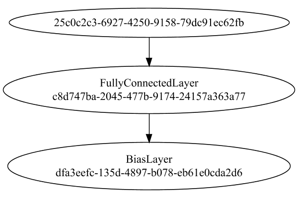
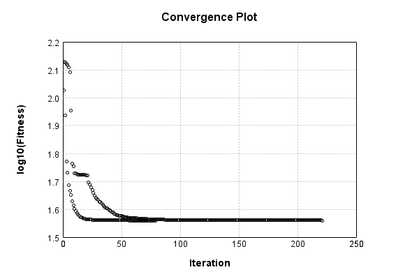
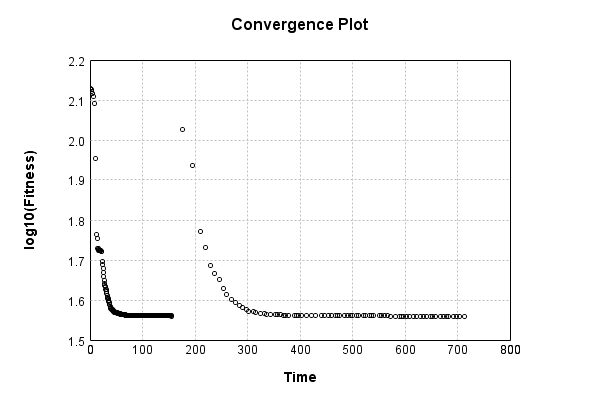

# CIFAR10 Image-to-Vector Encoding


The vector-to-image network is a single fully connected layer:

Code from [CifarTests.java:81](../../../../../../../../src/test/java/com/simiacryptus/mindseye/labs/matrix/CifarTests.java#L81) executed in 0.01 seconds: 
```java
    PipelineNetwork network = new PipelineNetwork();
    network.add(new FullyConnectedLayer(new int[]{features}, new int[]{32, 32, 3})
      .setWeights(() -> 0.25 * (Math.random() - 0.5)));
    network.add(new BiasLayer(32, 32, 3));
    return network;
```

Returns: 

```
    PipelineNetwork/622bb957-8ce9-4555-adad-3bb629d308e8
```


### Network Diagram
Code from [EncodingProblem.java:91](../../../../../../../../src/main/java/com/simiacryptus/mindseye/test/EncodingProblem.java#L91) executed in 0.13 seconds: 
```java
    return Graphviz.fromGraph(TestUtil.toGraph(imageNetwork))
      .height(400).width(600).render(Format.PNG).toImage();
```

Returns: 




### Training
We start by training with a very small population to improve initial convergence performance:

Adding performance wrappers

Code from [TestUtil.java:269](../../../../../../../../src/main/java/com/simiacryptus/mindseye/test/TestUtil.java#L269) executed in 0.00 seconds: 
```java
    network.visitNodes(node -> {
      if (!(node.getLayer() instanceof MonitoringWrapperLayer)) {
        node.setLayer(new MonitoringWrapperLayer(node.getLayer()).shouldRecordSignalMetrics(false));
      }
      else {
        ((MonitoringWrapperLayer) node.getLayer()).shouldRecordSignalMetrics(false);
      }
    });
```

Optimized via the Stochastic Gradient Descent method with momentum and adaptve learning rate:

Code from [TextbookOptimizers.java:58](../../../../../../../../src/test/java/com/simiacryptus/mindseye/labs/matrix/TextbookOptimizers.java#L58) executed in 0.00 seconds: 
```java
    double carryOver = 0.5;
    ValidatingTrainer trainer = new ValidatingTrainer(trainingSubject, validationSubject)
      .setMaxEpochIterations(100)
      .setMonitor(monitor);
    trainer.getRegimen().get(0)
      .setOrientation(new MomentumStrategy(new GradientDescent()).setCarryOver(carryOver))
      .setLineSearchFactory(name -> new ArmijoWolfeSearch());
    return trainer;
```

Returns: 

```
    com.simiacryptus.mindseye.opt.ValidatingTrainer@66c157a5
```


Code from [EncodingProblem.java:113](../../../../../../../../src/main/java/com/simiacryptus/mindseye/test/EncodingProblem.java#L113) executed in 158.54 seconds: 
```java
    preTrainer.setTimeout(timeoutMinutes / 2, TimeUnit.MINUTES).setMaxIterations(batchSize).run();
```
Logging: 
```
    Epoch parameters: 15000, 1
    Phase 0: TrainingPhase{trainingSubject=PerformanceWrapper{inner=SampledArrayTrainable{inner=ArrayTrainable{inner=com.simiacryptus.mindseye.eval.GpuTrainable@5b0f58a6}}}, orientation=com.simiacryptus.mindseye.opt.orient.MomentumStrategy@371f401d}
    resetAndMeasure; trainingSize=15000
    Constructing line search parameters: 
    th(0)=135.36545122684123;dx=-9.304926332904442E-4
    New Minimum: 135.36545122684123 > 135.3643876600495
    WOLFE (weak): th(2.154434690031884)=135.3643876600495; dx=-9.642401019398182E-4 delta=0.0010635667917426872
    New Minimum: 135.3643876600495 > 135.36332409523908
    WOLFE (weak): th(4.308869380063768)=135.36332409523908; dx=-9.245572772883919E-4 delta=0.0021271316021511666
    New Minimum: 135.36332409523908 > 135.35906985581158
    WOLFE (weak): th(12.926608140191302)=135.35906985581158; dx=-9.092934160788764E-4 delta=0.006381371029647198
    New Minimum: 135.35906985581158 > 135.33992617079912
    WOLFE (weak): th(51.70643256076521)=135.33992617079912; dx=-9.227939491221033E-
```
...[skipping 152397 bytes](etc/7.txt)...
```
    4489316938E-6 delta=0.005714103652373126
    Overall network state change: {FullyConnectedLayer=1.0007362015495798, BiasLayer=0.9996728214107276, PlaceholderLayer=9.9449e-01 +- 3.3367e-03 [9.8477e-01 - 1.0076e+00] (1000#)}
    Iteration 221 complete. Error: 36.304523507755206 (1873 in 0.989 seconds; 0.008 in orientation, 0.117 in gc, 0.979 in line search; 0.955 eval time)
    th(0)=36.304523507755206;dx=-2.1712105674172014E-5
    MAX ALPHA: th(0)=36.304523507755206;th'(0)=-2.1712105674172014E-5;
    Overall network state change: {FullyConnectedLayer=1.0, BiasLayer=1.0, PlaceholderLayer=1.0000e+00 +- 0.0000e+00 [1.0000e+00 - 1.0000e+00] (1000#)}
    Iteration 222 failed, aborting. Error: 36.304523507755206 (1873 in 0.443 seconds; 0.008 in orientation, 0.072 in gc, 0.433 in line search; 0.428 eval time)
    Epoch 7 result with 96 iterations, 1873/2147483647 samples: {validation *= 2^-0.00300; training *= 2^-0.003; Overtraining = 1.00}, {itr*=13.09, len*=0.71} 0 since improvement; 0.2020 validation time
    Training 7 runPhase halted
    
```

Per-layer Performance Metrics:

Code from [TestUtil.java:234](../../../../../../../../src/main/java/com/simiacryptus/mindseye/test/TestUtil.java#L234) executed in 0.00 seconds: 
```java
    Map<NNLayer, MonitoringWrapperLayer> metrics = new HashMap<>();
    network.visitNodes(node -> {
      if ((node.getLayer() instanceof MonitoringWrapperLayer)) {
        MonitoringWrapperLayer layer = node.getLayer();
        metrics.put(layer.getInner(), layer);
      }
    });
    System.out.println("Forward Performance: \n\t" + metrics.entrySet().stream().map(e -> {
      PercentileStatistics performance = e.getValue().getForwardPerformance();
      return String.format("%s -> %.6fs +- %.6fs (%s)", e.getKey(), performance.getMean(), performance.getStdDev(), performance.getCount());
    }).reduce((a, b) -> a + "\n\t" + b));
    System.out.println("Backward Performance: \n\t" + metrics.entrySet().stream().map(e -> {
      PercentileStatistics performance = e.getValue().getBackwardPerformance();
      return String.format("%s -> %.6fs +- %.6fs (%s)", e.getKey(), performance.getMean(), performance.getStdDev(), performance.getCount());
    }).reduce((a, b) -> a + "\n\t" + b));
```
Logging: 
```
    Forward Performance: 
    	Optional[PipelineNetwork/622bb957-8ce9-4555-adad-3bb629d308e8 -> 0.029337s +- 0.018444s (1446.0)
    	NthPowerActivationLayer/b22faa31-600c-4402-ba36-ffef261ac213 -> 0.000502s +- 0.000186s (1446.0)
    	EntropyLossLayer/7faba526-a945-4323-a9a0-e12335e692cf -> 0.000682s +- 0.002184s (1446.0)
    	SoftmaxActivationLayer/c74d0c65-e699-4149-8f66-8e678e07981d -> 0.001474s +- 0.003382s (1446.0)
    	LinearActivationLayer/b6f8b21f-eeeb-43b5-a4b8-4e9e9ca0c22a -> 0.000600s +- 0.004589s (1446.0)
    	MeanSqLossLayer/33181530-917a-43b5-9a56-0d46b6fc8a67 -> 0.008174s +- 0.012607s (1446.0)
    	SumInputsLayer/17b3db0b-18cc-47c0-bb64-93949340adda -> 0.000366s +- 0.001818s (1446.0)]
    Backward Performance: 
    	Optional[PipelineNetwork/622bb957-8ce9-4555-adad-3bb629d308e8 -> 0.000213s +- 0.000079s (1446.0)
    	NthPowerActivationLayer/b22faa31-600c-4402-ba36-ffef261ac213 -> 0.000001s +- 0.000006s (1446.0)
    	EntropyLossLayer/7faba526-a945-4323-a9a0-e12335e692cf -> 0.000002s +- 0.000007s (1430.0)
    	SoftmaxActivationLayer/c74d0c65-e699-4149-8f66-8e678e07981d -> 0.000001s +- 0.000000s (1430.0)
    	LinearActivationLayer/b6f8b21f-eeeb-43b5-a4b8-4e9e9ca0c22a -> 0.000000s +- 0.000000s (1430.0)
    	MeanSqLossLayer/33181530-917a-43b5-9a56-0d46b6fc8a67 -> 0.000018s +- 0.000029s (1446.0)
    	SumInputsLayer/17b3db0b-18cc-47c0-bb64-93949340adda -> 0.000000s +- 0.000000s (1446.0)]
    
```

Removing performance wrappers

Code from [TestUtil.java:252](../../../../../../../../src/main/java/com/simiacryptus/mindseye/test/TestUtil.java#L252) executed in 0.00 seconds: 
```java
    network.visitNodes(node -> {
      if (node.getLayer() instanceof MonitoringWrapperLayer) {
        node.setLayer(node.<MonitoringWrapperLayer>getLayer().getInner());
      }
    });
```

Then our main training phase:

Adding performance wrappers

Code from [TestUtil.java:269](../../../../../../../../src/main/java/com/simiacryptus/mindseye/test/TestUtil.java#L269) executed in 0.00 seconds: 
```java
    network.visitNodes(node -> {
      if (!(node.getLayer() instanceof MonitoringWrapperLayer)) {
        node.setLayer(new MonitoringWrapperLayer(node.getLayer()).shouldRecordSignalMetrics(false));
      }
      else {
        ((MonitoringWrapperLayer) node.getLayer()).shouldRecordSignalMetrics(false);
      }
    });
```

Optimized via the Stochastic Gradient Descent method with momentum and adaptve learning rate:

Code from [TextbookOptimizers.java:58](../../../../../../../../src/test/java/com/simiacryptus/mindseye/labs/matrix/TextbookOptimizers.java#L58) executed in 0.00 seconds: 
```java
    double carryOver = 0.5;
    ValidatingTrainer trainer = new ValidatingTrainer(trainingSubject, validationSubject)
      .setMaxEpochIterations(100)
      .setMonitor(monitor);
    trainer.getRegimen().get(0)
      .setOrientation(new MomentumStrategy(new GradientDescent()).setCarryOver(carryOver))
      .setLineSearchFactory(name -> new ArmijoWolfeSearch());
    return trainer;
```

Returns: 

```
    com.simiacryptus.mindseye.opt.ValidatingTrainer@5a4f4bd5
```


Code from [EncodingProblem.java:123](../../../../../../../../src/main/java/com/simiacryptus/mindseye/test/EncodingProblem.java#L123) executed in 562.37 seconds: 
```java
    mainTrainer.setTimeout(timeoutMinutes, TimeUnit.MINUTES).setMaxIterations(batchSize).run();
```
Logging: 
```
    Epoch parameters: 15000, 1
    Phase 0: TrainingPhase{trainingSubject=PerformanceWrapper{inner=SampledArrayTrainable{inner=ArrayTrainable{inner=com.simiacryptus.mindseye.eval.GpuTrainable@7f5299ab}}}, orientation=com.simiacryptus.mindseye.opt.orient.MomentumStrategy@5f636477}
    resetAndMeasure; trainingSize=15000
    Constructing line search parameters: 
    th(0)=117.29182910338736;dx=-0.013952987395708973
    New Minimum: 117.29182910338736 > 117.27675487303267
    WOLFE (weak): th(2.154434690031884)=117.27675487303267; dx=-0.013932776803616837 delta=0.015074230354684914
    New Minimum: 117.27675487303267 > 117.26168058663528
    WOLFE (weak): th(4.308869380063768)=117.26168058663528; dx=-0.013935352201342248 delta=0.03014851675207808
    New Minimum: 117.26168058663528 > 117.2013828781671
    WOLFE (weak): th(12.926608140191302)=117.2013828781671; dx=-0.013939224710773876 delta=0.09044622522026202
    New Minimum: 117.2013828781671 > 116.93003186495318
    WOLFE (weak): th(51.70643256076521)=116.93003186495318; dx=-0.013942850479204433 de
```
...[skipping 55184 bytes](etc/8.txt)...
```
    x=-2.327543670677266E-6 delta=0.006642312966292252
    Overall network state change: {FullyConnectedLayer=0.999477635451053, BiasLayer=1.000341709690726, PlaceholderLayer=9.9622e-01 +- 1.8341e-03 [9.9156e-01 - 1.0033e+00] (9999#)}
    Iteration 79 complete. Error: 36.27139927521209 (1873 in 8.856 seconds; 0.100 in orientation, 1.884 in gc, 8.739 in line search; 8.487 eval time)
    th(0)=36.27139927521209;dx=-7.851923361140767E-6
    MAX ALPHA: th(0)=36.27139927521209;th'(0)=-7.851923361140767E-6;
    Overall network state change: {FullyConnectedLayer=1.0, BiasLayer=1.0, PlaceholderLayer=1.0000e+00 +- 0.0000e+00 [1.0000e+00 - 1.0000e+00] (9999#)}
    Iteration 80 failed, aborting. Error: 36.27139927521209 (1873 in 3.819 seconds; 0.082 in orientation, 0.426 in gc, 3.712 in line search; 3.635 eval time)
    Epoch 7 result with 46 iterations, 1873/2147483647 samples: {validation *= 2^-0.00376; training *= 2^-0.004; Overtraining = 1.00}, {itr*=11.69, len*=0.71} 0 since improvement; 2.2554 validation time
    Training 7 runPhase halted
    
```

Per-layer Performance Metrics:

Code from [TestUtil.java:234](../../../../../../../../src/main/java/com/simiacryptus/mindseye/test/TestUtil.java#L234) executed in 0.00 seconds: 
```java
    Map<NNLayer, MonitoringWrapperLayer> metrics = new HashMap<>();
    network.visitNodes(node -> {
      if ((node.getLayer() instanceof MonitoringWrapperLayer)) {
        MonitoringWrapperLayer layer = node.getLayer();
        metrics.put(layer.getInner(), layer);
      }
    });
    System.out.println("Forward Performance: \n\t" + metrics.entrySet().stream().map(e -> {
      PercentileStatistics performance = e.getValue().getForwardPerformance();
      return String.format("%s -> %.6fs +- %.6fs (%s)", e.getKey(), performance.getMean(), performance.getStdDev(), performance.getCount());
    }).reduce((a, b) -> a + "\n\t" + b));
    System.out.println("Backward Performance: \n\t" + metrics.entrySet().stream().map(e -> {
      PercentileStatistics performance = e.getValue().getBackwardPerformance();
      return String.format("%s -> %.6fs +- %.6fs (%s)", e.getKey(), performance.getMean(), performance.getStdDev(), performance.getCount());
    }).reduce((a, b) -> a + "\n\t" + b));
```
Logging: 
```
    Forward Performance: 
    	Optional[PipelineNetwork/622bb957-8ce9-4555-adad-3bb629d308e8 -> 0.297296s +- 0.096381s (534.0)
    	NthPowerActivationLayer/b22faa31-600c-4402-ba36-ffef261ac213 -> 0.003922s +- 0.000478s (534.0)
    	EntropyLossLayer/7faba526-a945-4323-a9a0-e12335e692cf -> 0.010975s +- 0.029175s (534.0)
    	SoftmaxActivationLayer/c74d0c65-e699-4149-8f66-8e678e07981d -> 0.014923s +- 0.014900s (534.0)
    	LinearActivationLayer/b6f8b21f-eeeb-43b5-a4b8-4e9e9ca0c22a -> 0.008674s +- 0.030793s (534.0)
    	MeanSqLossLayer/33181530-917a-43b5-9a56-0d46b6fc8a67 -> 0.074414s +- 0.052412s (534.0)
    	SumInputsLayer/17b3db0b-18cc-47c0-bb64-93949340adda -> 0.002906s +- 0.010098s (534.0)]
    Backward Performance: 
    	Optional[PipelineNetwork/622bb957-8ce9-4555-adad-3bb629d308e8 -> 0.000208s +- 0.000032s (534.0)
    	NthPowerActivationLayer/b22faa31-600c-4402-ba36-ffef261ac213 -> 0.000001s +- 0.000002s (534.0)
    	EntropyLossLayer/7faba526-a945-4323-a9a0-e12335e692cf -> 0.000002s +- 0.000004s (518.0)
    	SoftmaxActivationLayer/c74d0c65-e699-4149-8f66-8e678e07981d -> 0.000001s +- 0.000002s (518.0)
    	LinearActivationLayer/b6f8b21f-eeeb-43b5-a4b8-4e9e9ca0c22a -> 0.000001s +- 0.000002s (518.0)
    	MeanSqLossLayer/33181530-917a-43b5-9a56-0d46b6fc8a67 -> 0.000023s +- 0.000017s (534.0)
    	SumInputsLayer/17b3db0b-18cc-47c0-bb64-93949340adda -> 0.000000s +- 0.000001s (534.0)]
    
```

Removing performance wrappers

Code from [TestUtil.java:252](../../../../../../../../src/main/java/com/simiacryptus/mindseye/test/TestUtil.java#L252) executed in 0.00 seconds: 
```java
    network.visitNodes(node -> {
      if (node.getLayer() instanceof MonitoringWrapperLayer) {
        node.setLayer(node.<MonitoringWrapperLayer>getLayer().getInner());
      }
    });
```

Code from [EncodingProblem.java:129](../../../../../../../../src/main/java/com/simiacryptus/mindseye/test/EncodingProblem.java#L129) executed in 0.01 seconds: 
```java
    return TestUtil.plot(history);
```

Returns: 




Code from [EncodingProblem.java:132](../../../../../../../../src/main/java/com/simiacryptus/mindseye/test/EncodingProblem.java#L132) executed in 0.01 seconds: 
```java
    return TestUtil.plotTime(history);
```

Returns: 




Saved model as [encoding_model2.json](etc/encoding_model2.json)

### Results
Code from [EncodingProblem.java:142](../../../../../../../../src/main/java/com/simiacryptus/mindseye/test/EncodingProblem.java#L142) executed in 0.07 seconds: 
```java
    TableOutput table = new TableOutput();
    Arrays.stream(trainingData).map(tensorArray -> {
      try {
        Tensor predictionSignal = GpuController.call(ctx -> testNetwork.eval(ctx, tensorArray)).getData().get(0);
        LinkedHashMap<String, Object> row = new LinkedHashMap<String, Object>();
        row.put("Source", log.image(tensorArray[1].toImage(), ""));
        row.put("Echo", log.image(predictionSignal.toImage(), ""));
        return row;
      } catch (IOException e) {
        throw new RuntimeException(e);
      }
    }).filter(x -> null != x).limit(10).forEach(table::putRow);
    return table;
```

Returns: 

Source | Echo
------ | ----
  |  
  |  
 | 
 | 
 | 
 | 
 | 
 | 
 | 
 | 


Learned Model Statistics:

Code from [EncodingProblem.java:159](../../../../../../../../src/main/java/com/simiacryptus/mindseye/test/EncodingProblem.java#L159) executed in 0.00 seconds: 
```java
    ScalarStatistics scalarStatistics = new ScalarStatistics();
    trainingNetwork.state().stream().flatMapToDouble(x -> Arrays.stream(x))
      .forEach(v -> scalarStatistics.add(v));
    return scalarStatistics.getMetrics();
```

Returns: 

```
    {meanExponent=0.5480468230988249, negative=15350, min=-15.236248196054168, max=20.210184557902142, mean=0.7965899458106503, count=33794.0, positive=18443, stdDev=6.745757022902724, zeros=1}
```


Learned Representation Statistics:

Code from [EncodingProblem.java:167](../../../../../../../../src/main/java/com/simiacryptus/mindseye/test/EncodingProblem.java#L167) executed in 0.01 seconds: 
```java
    ScalarStatistics scalarStatistics = new ScalarStatistics();
    Arrays.stream(trainingData)
      .flatMapToDouble(row -> Arrays.stream(row[0].getData()))
      .forEach(v -> scalarStatistics.add(v));
    return scalarStatistics.getMetrics();
```

Returns: 

```
    {meanExponent=0.32369685637946843, negative=59862, min=-17.799304858813407, max=18.91124036433191, mean=-0.41473567092460295, count=99990.0, positive=40128, stdDev=4.4596169521676305, zeros=0}
```


Some rendered unit vectors:


