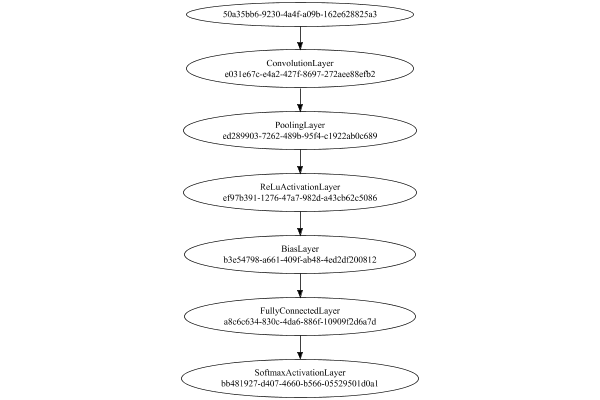

# MNIST Digit Classification


The image-to-vector network is a single layer convolutional:

Code from [MnistTests.java:62](../../../../../../../../src/test/java/com/simiacryptus/mindseye/labs/matrix/MnistTests.java#L62) executed in 0.00 seconds: 
```java
    PipelineNetwork network = new PipelineNetwork();
    network.add(new ConvolutionLayer(3, 3, 1, 5).setWeights(i -> 1e-8 * (Math.random() - 0.5)));
    network.add(new PoolingLayer().setMode(PoolingLayer.PoolingMode.Max));
    network.add(new ReLuActivationLayer());
    network.add(new BiasLayer(14, 14, 5));
    network.add(new FullyConnectedLayer(new int[]{14, 14, 5}, new int[]{features})
      .setWeights(() -> 0.001 * (Math.random() - 0.45)));
    network.add(new SoftmaxActivationLayer());
    return network;
```

Returns: 

```
    PipelineNetwork/ea97844f-8454-4cb4-8ada-39d77372c732
```


### Network Diagram
Code from [ClassifyProblem.java:80](../../../../../../../../src/main/java/com/simiacryptus/mindseye/test/ClassifyProblem.java#L80) executed in 0.22 seconds: 
```java
    return Graphviz.fromGraph(TestUtil.toGraph(network))
      .height(400).width(600).render(Format.PNG).toImage();
```

Returns: 




### Training
Adding performance wrappers

Code from [TestUtil.java:269](../../../../../../../../src/main/java/com/simiacryptus/mindseye/test/TestUtil.java#L269) executed in 0.00 seconds: 
```java
    network.visitNodes(node -> {
      if (!(node.getLayer() instanceof MonitoringWrapperLayer)) {
        node.setLayer(new MonitoringWrapperLayer(node.getLayer()).shouldRecordSignalMetrics(false));
      }
      else {
        ((MonitoringWrapperLayer) node.getLayer()).shouldRecordSignalMetrics(false);
      }
    });
```

Optimized via the Orthantwise Quasi-Newton search method:

Code from [TextbookOptimizers.java:105](../../../../../../../../src/test/java/com/simiacryptus/mindseye/labs/matrix/TextbookOptimizers.java#L105) executed in 0.00 seconds: 
```java
    ValidatingTrainer trainer = new ValidatingTrainer(trainingSubject, validationSubject)
      .setMinTrainingSize(Integer.MAX_VALUE)
      .setMonitor(monitor);
    trainer.getRegimen().get(0)
      .setOrientation(new OwlQn())
      .setLineSearchFactory(name -> new ArmijoWolfeSearch()
        .setAlpha(name.contains("OWL") ? 1.0 : 1e-6));
    return trainer;
```

Returns: 

```
    com.simiacryptus.mindseye.opt.ValidatingTrainer@1b66ece4
```


Code from [ClassifyProblem.java:91](../../../../../../../../src/main/java/com/simiacryptus/mindseye/test/ClassifyProblem.java#L91) executed in 168.10 seconds: 
```java
    trainer.setTimeout(timeoutMinutes, TimeUnit.MINUTES).setMaxIterations(10000).run();
```
Logging: 
```
    Epoch parameters: 30000, 1
    Phase 0: TrainingPhase{trainingSubject=PerformanceWrapper{inner=SampledArrayTrainable{inner=ArrayTrainable{inner=com.simiacryptus.mindseye.eval.GpuTrainable@5e1dc313}}}, orientation=com.simiacryptus.mindseye.opt.orient.OwlQn@22078869}
    resetAndMeasure; trainingSize=30000
    LBFGS Accumulation History: 1 points
    Constructing line search parameters: OWL/QN
    th(0)=2.3025850929940455;dx=-1.2619511742963332
    Armijo: th(2.154434690031884)=2.3025850929940455; dx=0.0 delta=0.0
    Armijo: th(1.077217345015942)=2.3025850929940455; dx=0.0 delta=0.0
    Armijo: th(0.3590724483386473)=2.3025850929940455; dx=0.0 delta=0.0
    Armijo: th(0.08976811208466183)=2.3025850929940455; dx=0.0 delta=0.0
    Armijo: th(0.017953622416932366)=2.3025850929940455; dx=0.0 delta=0.0
    Armijo: th(0.002992270402822061)=2.3025850929940455; dx=0.0 delta=0.0
    Armijo: th(4.2746720040315154E-4)=2.3025850929940455; dx=0.0 delta=0.0
    Armijo: th(5.343340005039394E-5)=2.3025850929940455; dx=0.0 delta=0.0
    Armijo: th(5.9370444500437714E-6)=2.3025850929940455; dx=0.0 delta=0.0
    Armijo: th(5.937044450043771E-7)=2.3025850929940455; dx=0.0 delta=0.0
    Armijo: th(5.397313136403428E-8)=2.3025850929940455; dx=0.0 delta=0.0
    Armijo: th(4.4977609470028565E-9)=2.3025850929940455; dx=0.0 delta=0.0
    Armijo: th(3.4598161130791205E-10)=2.3025850929940455; dx=0.0 delta=0.0
    END: th(2.4712972236279432E-11)=2.3025850929940455; dx=0.0 delta=0.0
    Overall network state change: {FullyConnectedLayer=1.0, ConvolutionLayer=1.0, BiasLayer=0.0}
    Iteration 1 failed, aborting. Error: 2.3025850929940455 (30000 in 126.872 seconds; 0.001 in orientation, 10.966 in gc, 126.871 in line search; 136.009 eval time)
    Epoch 1 result with 1 iterations, 30000/2147483647 samples: {validation *= 2^0.00000; training *= 2^0.000; Overtraining = NaN}, {itr*=Infinity, len*=NaN} 0 since improvement; 32.0424 validation time
    Training 1 runPhase halted
    
```

Per-layer Performance Metrics:

Code from [TestUtil.java:234](../../../../../../../../src/main/java/com/simiacryptus/mindseye/test/TestUtil.java#L234) executed in 0.00 seconds: 
```java
    Map<NNLayer, MonitoringWrapperLayer> metrics = new HashMap<>();
    network.visitNodes(node -> {
      if ((node.getLayer() instanceof MonitoringWrapperLayer)) {
        MonitoringWrapperLayer layer = node.getLayer();
        metrics.put(layer.getInner(), layer);
      }
    });
    System.out.println("Forward Performance: \n\t" + metrics.entrySet().stream().map(e -> {
      PercentileStatistics performance = e.getValue().getForwardPerformance();
      return String.format("%s -> %.6fs +- %.6fs (%s)", e.getKey(), performance.getMean(), performance.getStdDev(), performance.getCount());
    }).reduce((a, b) -> a + "\n\t" + b));
    System.out.println("Backward Performance: \n\t" + metrics.entrySet().stream().map(e -> {
      PercentileStatistics performance = e.getValue().getBackwardPerformance();
      return String.format("%s -> %.6fs +- %.6fs (%s)", e.getKey(), performance.getMean(), performance.getStdDev(), performance.getCount());
    }).reduce((a, b) -> a + "\n\t" + b));
```
Logging: 
```
    Forward Performance: 
    	Optional[PipelineNetwork/ea97844f-8454-4cb4-8ada-39d77372c732 -> 0.790686s +- 0.139968s (120.0)
    	EntropyLossLayer/20ee5af0-e159-439f-a4b7-bf73fa103587 -> 0.004127s +- 0.000608s (120.0)]
    Backward Performance: 
    	Optional[PipelineNetwork/ea97844f-8454-4cb4-8ada-39d77372c732 -> 0.000223s +- 0.000057s (120.0)
    	EntropyLossLayer/20ee5af0-e159-439f-a4b7-bf73fa103587 -> 0.000000s +- 0.000000s (120.0)]
    
```

Removing performance wrappers

Code from [TestUtil.java:252](../../../../../../../../src/main/java/com/simiacryptus/mindseye/test/TestUtil.java#L252) executed in 0.00 seconds: 
```java
    network.visitNodes(node -> {
      if (node.getLayer() instanceof MonitoringWrapperLayer) {
        node.setLayer(node.<MonitoringWrapperLayer>getLayer().getInner());
      }
    });
```

Saved model as [classification_model3.json](etc/classification_model3.json)

### Validation
If we run our model against the entire validation dataset, we get this accuracy:

Code from [ClassifyProblem.java:108](../../../../../../../../src/main/java/com/simiacryptus/mindseye/test/ClassifyProblem.java#L108) executed in 32.58 seconds: 
```java
    return data.validationData().mapToDouble(labeledObject ->
      predict(network, labeledObject)[0] == parse(labeledObject.label) ? 1 : 0)
      .average().getAsDouble() * 100;
```

Returns: 

```
    9.80294088226468
```


Let's examine some incorrectly predicted results in more detail:

Code from [ClassifyProblem.java:115](../../../../../../../../src/main/java/com/simiacryptus/mindseye/test/ClassifyProblem.java#L115) executed in 0.07 seconds: 
```java
    try {
      TableOutput table = new TableOutput();
      data.validationData().map(labeledObject -> {
        return toRow(log, labeledObject, GpuController.call(ctx -> network.eval(ctx, labeledObject.data)).getData().get(0).getData());
      }).filter(x -> null != x).limit(10).forEach(table::putRow);
      return table;
    } catch (IOException e) {
      throw new RuntimeException(e);
    }
```

Returns: 

Image | Prediction
----- | ----------
![[7]](etc/classification_test.183.png) | 0 (10.0%), 1 (10.0%), 2 (10.0%)
![[2]](etc/classification_test.184.png) | 0 (10.0%), 1 (10.0%), 2 (10.0%)
![[1]](etc/classification_test.185.png) | 0 (10.0%), 1 (10.0%), 2 (10.0%)
![[4]](etc/classification_test.186.png) | 0 (10.0%), 1 (10.0%), 2 (10.0%)
![[1]](etc/classification_test.187.png) | 0 (10.0%), 1 (10.0%), 2 (10.0%)
![[4]](etc/classification_test.188.png) | 0 (10.0%), 1 (10.0%), 2 (10.0%)
![[9]](etc/classification_test.189.png) | 0 (10.0%), 1 (10.0%), 2 (10.0%)
![[5]](etc/classification_test.190.png) | 0 (10.0%), 1 (10.0%), 2 (10.0%)
![[9]](etc/classification_test.191.png) | 0 (10.0%), 1 (10.0%), 2 (10.0%)
![[6]](etc/classification_test.192.png) | 0 (10.0%), 1 (10.0%), 2 (10.0%)


