# MNIST Image-to-Vector Encoding


The vector-to-image network uses a fully connected layer then a single convolutional layer:

Code from [MnistTests.java:92](../../../../../../../../src/test/java/com/simiacryptus/mindseye/labs/matrix/MnistTests.java#L92) executed in 0.02 seconds: 
```java
    PipelineNetwork network = new PipelineNetwork();
    network.add(new FullyConnectedLayer(new int[]{features}, new int[]{28, 28, 5})
      .setWeights(() -> 0.25 * (Math.random() - 0.5)));
    network.add(new ReLuActivationLayer());
    network.add(new ConvolutionLayer(3, 3, 5, 1)
      .setWeights(i -> 1e-8 * (Math.random() - 0.5)));
    network.add(new BiasLayer(28, 28, 1));
    network.add(new ReLuActivationLayer());
    return network;
```

Returns: 

```
    PipelineNetwork/e5bb3e11-04e8-4899-92ab-6016c52e1d4e
```


### Network Diagram
Code from [EncodingProblem.java:91](../../../../../../../../src/main/java/com/simiacryptus/mindseye/test/EncodingProblem.java#L91) executed in 0.17 seconds: 
```java
    return Graphviz.fromGraph(TestUtil.toGraph(imageNetwork))
      .height(400).width(600).render(Format.PNG).toImage();
```

Returns: 

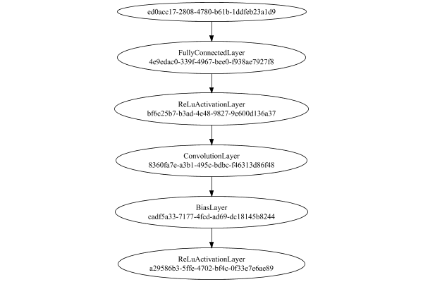


### Training
We start by training with a very small population to improve initial convergence performance:

Adding performance wrappers

Code from [TestUtil.java:269](../../../../../../../../src/main/java/com/simiacryptus/mindseye/test/TestUtil.java#L269) executed in 0.00 seconds: 
```java
    network.visitNodes(node -> {
      if (!(node.getLayer() instanceof MonitoringWrapperLayer)) {
        node.setLayer(new MonitoringWrapperLayer(node.getLayer()).shouldRecordSignalMetrics(false));
      }
      else {
        ((MonitoringWrapperLayer) node.getLayer()).shouldRecordSignalMetrics(false);
      }
    });
```

Optimized via the Orthantwise Quasi-Newton search method:

Code from [TextbookOptimizers.java:105](../../../../../../../../src/test/java/com/simiacryptus/mindseye/labs/matrix/TextbookOptimizers.java#L105) executed in 0.00 seconds: 
```java
    ValidatingTrainer trainer = new ValidatingTrainer(trainingSubject, validationSubject)
      .setMinTrainingSize(Integer.MAX_VALUE)
      .setMonitor(monitor);
    trainer.getRegimen().get(0)
      .setOrientation(new OwlQn())
      .setLineSearchFactory(name -> new ArmijoWolfeSearch()
        .setAlpha(name.contains("OWL") ? 1.0 : 1e-6));
    return trainer;
```

Returns: 

```
    com.simiacryptus.mindseye.opt.ValidatingTrainer@37ed62b0
```


Code from [EncodingProblem.java:113](../../../../../../../../src/main/java/com/simiacryptus/mindseye/test/EncodingProblem.java#L113) executed in 301.50 seconds: 
```java
    preTrainer.setTimeout(timeoutMinutes / 2, TimeUnit.MINUTES).setMaxIterations(batchSize).run();
```
Logging: 
```
    Epoch parameters: 15000, 1
    Phase 0: TrainingPhase{trainingSubject=PerformanceWrapper{inner=SampledArrayTrainable{inner=ArrayTrainable{inner=com.simiacryptus.mindseye.eval.GpuTrainable@1090d7a2}}}, orientation=com.simiacryptus.mindseye.opt.orient.OwlQn@26c16f64}
    resetAndMeasure; trainingSize=15000
    LBFGS Accumulation History: 1 points
    Constructing line search parameters: OWL/QN
    th(0)=86.1613999966595;dx=-0.0019353677855612158
    New Minimum: 86.1613999966595 > 86.16139098698713
    END: th(2.154434690031884)=86.16139098698713; dx=-8.365527054443543E-6 delta=9.009672368165411E-6
    Overall network state change: {FullyConnectedLayer=0.9999999999999653, BiasLayer=0.0, ConvolutionLayer=3.7441388542247456E-7, PlaceholderLayer=9.9980e-01 +- 1.5232e-05 [9.9978e-01 - 9.9991e-01] (1000#)}
    Iteration 1 complete. Error: 86.16139098698713 (15000 in 1.248 seconds; 0.028 in orientation, 0.139 in gc, 1.216 in line search; 1.931 eval time)
    Epoch 1 result with 2 iterations, 15000/2147483647 samples: {validation *= 2^-0.00000; tr
```
...[skipping 138334 bytes](etc/10.txt)...
```
    tion, 0.159 in gc, 1.668 in line search; 1.640 eval time)
    Orientation vanished. Popping history element from 43.847470579698935, 43.84600625760574, 43.84504477744787, 43.84368905558498
    LBFGS Accumulation History: 3 points
    th(0)=43.84368905558498;dx=-0.721163733375579
    New Minimum: 43.84368905558498 > 43.84250100187041
    END: th(7.0019379369097186)=43.84250100187041; dx=-3.0194309357426785E-4 delta=0.0011880537145714243
    Overall network state change: {FullyConnectedLayer=0.999893480255347, BiasLayer=0.0, ConvolutionLayer=0.9998644058359214, PlaceholderLayer=9.9912e-01 +- 4.2878e-04 [9.9658e-01 - 1.0008e+00] (1000#)}
    Iteration 171 complete. Error: 43.84250100187041 (15000 in 1.277 seconds; 0.104 in orientation, 0.172 in gc, 1.169 in line search; 1.151 eval time)
    Training timeout
    Epoch 10 result with 14 iterations, 15000/2147483647 samples: {validation *= 2^-0.00081; training *= 2^-0.001; Overtraining = 1.00}, {itr*=25.16, len*=0.71} 0 since improvement; 0.4836 validation time
    Training 10 runPhase halted
    
```

Per-layer Performance Metrics:

Code from [TestUtil.java:234](../../../../../../../../src/main/java/com/simiacryptus/mindseye/test/TestUtil.java#L234) executed in 0.00 seconds: 
```java
    Map<NNLayer, MonitoringWrapperLayer> metrics = new HashMap<>();
    network.visitNodes(node -> {
      if ((node.getLayer() instanceof MonitoringWrapperLayer)) {
        MonitoringWrapperLayer layer = node.getLayer();
        metrics.put(layer.getInner(), layer);
      }
    });
    System.out.println("Forward Performance: \n\t" + metrics.entrySet().stream().map(e -> {
      PercentileStatistics performance = e.getValue().getForwardPerformance();
      return String.format("%s -> %.6fs +- %.6fs (%s)", e.getKey(), performance.getMean(), performance.getStdDev(), performance.getCount());
    }).reduce((a, b) -> a + "\n\t" + b));
    System.out.println("Backward Performance: \n\t" + metrics.entrySet().stream().map(e -> {
      PercentileStatistics performance = e.getValue().getBackwardPerformance();
      return String.format("%s -> %.6fs +- %.6fs (%s)", e.getKey(), performance.getMean(), performance.getStdDev(), performance.getCount());
    }).reduce((a, b) -> a + "\n\t" + b));
```
Logging: 
```
    Forward Performance: 
    	Optional[LinearActivationLayer/8f066885-ec6f-44ad-8de1-a40f8d3940b7 -> 0.000497s +- 0.002713s (1014.0)
    	MeanSqLossLayer/7295350b-7db8-4671-9194-22964328b0fe -> 0.004887s +- 0.008008s (1014.0)
    	EntropyLossLayer/e8a6ac12-b6ad-4f56-9132-1782f85cca47 -> 0.001002s +- 0.002623s (1014.0)
    	PipelineNetwork/e5bb3e11-04e8-4899-92ab-6016c52e1d4e -> 0.088578s +- 0.017777s (1014.0)
    	SoftmaxActivationLayer/0477b5bd-b11c-4f2e-8127-31ecd3683ae1 -> 0.001890s +- 0.003303s (1014.0)
    	NthPowerActivationLayer/ff9323c7-b5a2-4457-a9d7-2f0b2a4068c6 -> 0.000972s +- 0.002322s (1014.0)
    	SumInputsLayer/422d7d5f-6825-455a-b593-81536f7aa32b -> 0.000605s +- 0.001590s (1014.0)]
    Backward Performance: 
    	Optional[LinearActivationLayer/8f066885-ec6f-44ad-8de1-a40f8d3940b7 -> 0.000001s +- 0.000001s (992.0)
    	MeanSqLossLayer/7295350b-7db8-4671-9194-22964328b0fe -> 0.000006s +- 0.000011s (1014.0)
    	EntropyLossLayer/e8a6ac12-b6ad-4f56-9132-1782f85cca47 -> 0.000003s +- 0.000008s (992.0)
    	PipelineNetwork/e5bb3e11-04e8-4899-92ab-6016c52e1d4e -> 0.000614s +- 0.000120s (1014.0)
    	SoftmaxActivationLayer/0477b5bd-b11c-4f2e-8127-31ecd3683ae1 -> 0.000001s +- 0.000003s (992.0)
    	NthPowerActivationLayer/ff9323c7-b5a2-4457-a9d7-2f0b2a4068c6 -> 0.000001s +- 0.000001s (1014.0)
    	SumInputsLayer/422d7d5f-6825-455a-b593-81536f7aa32b -> 0.000000s +- 0.000000s (1014.0)]
    
```

Removing performance wrappers

Code from [TestUtil.java:252](../../../../../../../../src/main/java/com/simiacryptus/mindseye/test/TestUtil.java#L252) executed in 0.00 seconds: 
```java
    network.visitNodes(node -> {
      if (node.getLayer() instanceof MonitoringWrapperLayer) {
        node.setLayer(node.<MonitoringWrapperLayer>getLayer().getInner());
      }
    });
```

Then our main training phase:

Adding performance wrappers

Code from [TestUtil.java:269](../../../../../../../../src/main/java/com/simiacryptus/mindseye/test/TestUtil.java#L269) executed in 0.00 seconds: 
```java
    network.visitNodes(node -> {
      if (!(node.getLayer() instanceof MonitoringWrapperLayer)) {
        node.setLayer(new MonitoringWrapperLayer(node.getLayer()).shouldRecordSignalMetrics(false));
      }
      else {
        ((MonitoringWrapperLayer) node.getLayer()).shouldRecordSignalMetrics(false);
      }
    });
```

Optimized via the Orthantwise Quasi-Newton search method:

Code from [TextbookOptimizers.java:105](../../../../../../../../src/test/java/com/simiacryptus/mindseye/labs/matrix/TextbookOptimizers.java#L105) executed in 0.00 seconds: 
```java
    ValidatingTrainer trainer = new ValidatingTrainer(trainingSubject, validationSubject)
      .setMinTrainingSize(Integer.MAX_VALUE)
      .setMonitor(monitor);
    trainer.getRegimen().get(0)
      .setOrientation(new OwlQn())
      .setLineSearchFactory(name -> new ArmijoWolfeSearch()
        .setAlpha(name.contains("OWL") ? 1.0 : 1e-6));
    return trainer;
```

Returns: 

```
    com.simiacryptus.mindseye.opt.ValidatingTrainer@3da2b195
```


Code from [EncodingProblem.java:123](../../../../../../../../src/main/java/com/simiacryptus/mindseye/test/EncodingProblem.java#L123) executed in 648.59 seconds: 
```java
    mainTrainer.setTimeout(timeoutMinutes, TimeUnit.MINUTES).setMaxIterations(batchSize).run();
```
Logging: 
```
    Epoch parameters: 15000, 1
    Phase 0: TrainingPhase{trainingSubject=PerformanceWrapper{inner=SampledArrayTrainable{inner=ArrayTrainable{inner=com.simiacryptus.mindseye.eval.GpuTrainable@737a881d}}}, orientation=com.simiacryptus.mindseye.opt.orient.OwlQn@9527bb7}
    resetAndMeasure; trainingSize=15000
    LBFGS Accumulation History: 1 points
    Constructing line search parameters: OWL/QN
    th(0)=85.21900667672287;dx=-0.49627277054671687
    New Minimum: 85.21900667672287 > 84.95839037622176
    WOLFE (weak): th(2.154434690031884)=84.95839037622176; dx=-0.503744106642424 delta=0.2606163005011126
    New Minimum: 84.95839037622176 > 84.67827156341615
    WOLFE (weak): th(4.308869380063768)=84.67827156341615; dx=-0.5351041183066222 delta=0.5407351133067237
    New Minimum: 84.67827156341615 > 83.4390632419971
    WOLFE (weak): th(12.926608140191302)=83.4390632419971; dx=-0.6045724435086037 delta=1.7799434347257659
    New Minimum: 83.4390632419971 > 77.1974018601672
    WOLFE (weak): th(51.70643256076521)=77.1974018601672; dx=-0.6502555142298067
```
...[skipping 14200 bytes](etc/11.txt)...
```
    71365;dx=-11.986502140151625
    Armijo: th(24.112654320987673)=65.68791541019303; dx=3.0279835715350174 delta=-9.74865579147938
    New Minimum: 55.93925961871365 > 55.3381601908675
    WOLF (strong): th(12.056327160493836)=55.3381601908675; dx=3.334733372747098 delta=0.601099427846151
    New Minimum: 55.3381601908675 > 52.18312490428814
    END: th(4.018775720164612)=52.18312490428814; dx=-1.4866973257653173 delta=3.7561347144255066
    Overall network state change: {FullyConnectedLayer=1.028168254424498, BiasLayer=0.0, ConvolutionLayer=1.0359744558382957, PlaceholderLayer=1.0116e+00 +- 5.9186e-02 [8.0063e-01 - 1.1043e+00] (15000#)}
    Iteration 18 complete. Error: 52.18312490428814 (15000 in 31.536 seconds; 0.338 in orientation, 4.078 in gc, 31.159 in line search; 30.757 eval time)
    Training timeout
    Epoch 4 result with 4 iterations, 15000/2147483647 samples: {validation *= 2^-0.09020; training *= 2^-0.386; Overtraining = 4.28}, {itr*=2.39, len*=1.46} 0 since improvement; 27.4151 validation time
    Training 4 runPhase halted
    
```

Per-layer Performance Metrics:

Code from [TestUtil.java:234](../../../../../../../../src/main/java/com/simiacryptus/mindseye/test/TestUtil.java#L234) executed in 0.00 seconds: 
```java
    Map<NNLayer, MonitoringWrapperLayer> metrics = new HashMap<>();
    network.visitNodes(node -> {
      if ((node.getLayer() instanceof MonitoringWrapperLayer)) {
        MonitoringWrapperLayer layer = node.getLayer();
        metrics.put(layer.getInner(), layer);
      }
    });
    System.out.println("Forward Performance: \n\t" + metrics.entrySet().stream().map(e -> {
      PercentileStatistics performance = e.getValue().getForwardPerformance();
      return String.format("%s -> %.6fs +- %.6fs (%s)", e.getKey(), performance.getMean(), performance.getStdDev(), performance.getCount());
    }).reduce((a, b) -> a + "\n\t" + b));
    System.out.println("Backward Performance: \n\t" + metrics.entrySet().stream().map(e -> {
      PercentileStatistics performance = e.getValue().getBackwardPerformance();
      return String.format("%s -> %.6fs +- %.6fs (%s)", e.getKey(), performance.getMean(), performance.getStdDev(), performance.getCount());
    }).reduce((a, b) -> a + "\n\t" + b));
```
Logging: 
```
    Forward Performance: 
    	Optional[LinearActivationLayer/8f066885-ec6f-44ad-8de1-a40f8d3940b7 -> 0.002375s +- 0.007603s (312.0)
    	MeanSqLossLayer/7295350b-7db8-4671-9194-22964328b0fe -> 0.045331s +- 0.071103s (312.0)
    	EntropyLossLayer/e8a6ac12-b6ad-4f56-9132-1782f85cca47 -> 0.008219s +- 0.007118s (312.0)
    	PipelineNetwork/e5bb3e11-04e8-4899-92ab-6016c52e1d4e -> 0.741565s +- 0.201075s (312.0)
    	SoftmaxActivationLayer/0477b5bd-b11c-4f2e-8127-31ecd3683ae1 -> 0.015804s +- 0.006635s (312.0)
    	NthPowerActivationLayer/ff9323c7-b5a2-4457-a9d7-2f0b2a4068c6 -> 0.007488s +- 0.026637s (312.0)
    	SumInputsLayer/422d7d5f-6825-455a-b593-81536f7aa32b -> 0.004465s +- 0.016049s (312.0)]
    Backward Performance: 
    	Optional[LinearActivationLayer/8f066885-ec6f-44ad-8de1-a40f8d3940b7 -> 0.000001s +- 0.000003s (252.0)
    	MeanSqLossLayer/7295350b-7db8-4671-9194-22964328b0fe -> 0.000006s +- 0.000008s (312.0)
    	EntropyLossLayer/e8a6ac12-b6ad-4f56-9132-1782f85cca47 -> 0.000004s +- 0.000008s (252.0)
    	PipelineNetwork/e5bb3e11-04e8-4899-92ab-6016c52e1d4e -> 0.000555s +- 0.000065s (312.0)
    	SoftmaxActivationLayer/0477b5bd-b11c-4f2e-8127-31ecd3683ae1 -> 0.000002s +- 0.000005s (252.0)
    	NthPowerActivationLayer/ff9323c7-b5a2-4457-a9d7-2f0b2a4068c6 -> 0.000001s +- 0.000002s (312.0)
    	SumInputsLayer/422d7d5f-6825-455a-b593-81536f7aa32b -> 0.000000s +- 0.000000s (312.0)]
    
```

Removing performance wrappers

Code from [TestUtil.java:252](../../../../../../../../src/main/java/com/simiacryptus/mindseye/test/TestUtil.java#L252) executed in 0.00 seconds: 
```java
    network.visitNodes(node -> {
      if (node.getLayer() instanceof MonitoringWrapperLayer) {
        node.setLayer(node.<MonitoringWrapperLayer>getLayer().getInner());
      }
    });
```

Code from [EncodingProblem.java:129](../../../../../../../../src/main/java/com/simiacryptus/mindseye/test/EncodingProblem.java#L129) executed in 0.01 seconds: 
```java
    return TestUtil.plot(history);
```

Returns: 

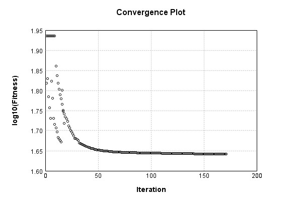


Code from [EncodingProblem.java:132](../../../../../../../../src/main/java/com/simiacryptus/mindseye/test/EncodingProblem.java#L132) executed in 0.01 seconds: 
```java
    return TestUtil.plotTime(history);
```

Returns: 

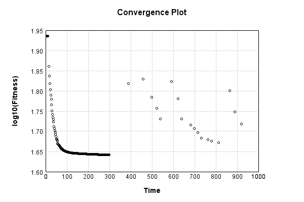


Saved model as [encoding_model3.json](etc/encoding_model3.json)

### Results
Code from [EncodingProblem.java:142](../../../../../../../../src/main/java/com/simiacryptus/mindseye/test/EncodingProblem.java#L142) executed in 0.26 seconds: 
```java
    TableOutput table = new TableOutput();
    Arrays.stream(trainingData).map(tensorArray -> {
      try {
        Tensor predictionSignal = GpuController.call(ctx -> testNetwork.eval(ctx, tensorArray)).getData().get(0);
        LinkedHashMap<String, Object> row = new LinkedHashMap<String, Object>();
        row.put("Source", log.image(tensorArray[1].toImage(), ""));
        row.put("Echo", log.image(predictionSignal.toImage(), ""));
        return row;
      } catch (IOException e) {
        throw new RuntimeException(e);
      }
    }).filter(x -> null != x).limit(10).forEach(table::putRow);
    return table;
```

Returns: 

Source | Echo
------ | ----
 | 
 | 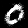
 | 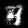
 | 
 | 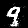
 | 
 | 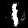
 | 
 | 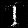
 | 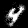


Learned Model Statistics:

Code from [EncodingProblem.java:159](../../../../../../../../src/main/java/com/simiacryptus/mindseye/test/EncodingProblem.java#L159) executed in 0.00 seconds: 
```java
    ScalarStatistics scalarStatistics = new ScalarStatistics();
    trainingNetwork.state().stream().flatMapToDouble(x -> Arrays.stream(x))
      .forEach(v -> scalarStatistics.add(v));
    return scalarStatistics.getMetrics();
```

Returns: 

```
    {meanExponent=-1.2662699405317652, negative=35505, min=-5.06234981960932, max=90.96368511645812, mean=0.023759739456048604, count=79233.0, positive=35939, stdDev=0.4819934563132414, zeros=7789}
```


Learned Representation Statistics:

Code from [EncodingProblem.java:167](../../../../../../../../src/main/java/com/simiacryptus/mindseye/test/EncodingProblem.java#L167) executed in 0.06 seconds: 
```java
    ScalarStatistics scalarStatistics = new ScalarStatistics();
    Arrays.stream(trainingData)
      .flatMapToDouble(row -> Arrays.stream(row[0].getData()))
      .forEach(v -> scalarStatistics.add(v));
    return scalarStatistics.getMetrics();
```

Returns: 

```
    {meanExponent=-1.2650574631812979, negative=319454, min=-2.8096274205006053, max=2.716107808041936, mean=0.06453504727157323, count=1200000.0, positive=739594, stdDev=0.14165884016671884, zeros=140952}
```


Some rendered unit vectors:


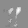

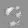
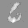


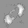


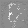


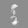


