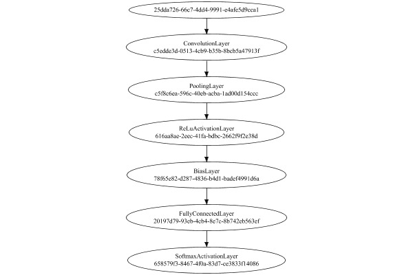
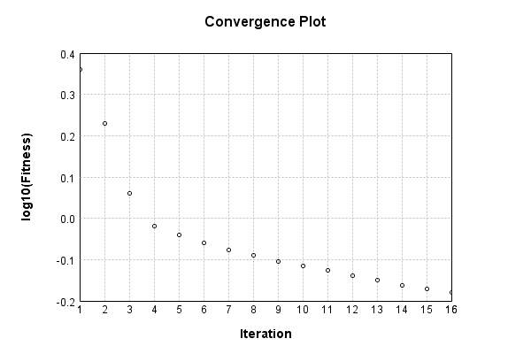
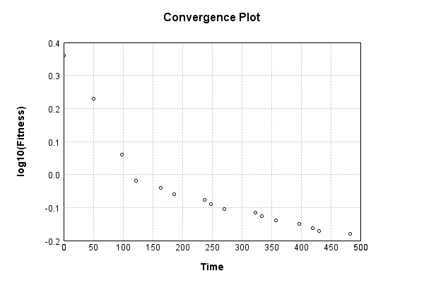

# MNIST Digit Classification


The image-to-vector network is a single layer convolutional:

Code from [MnistTests.java:62](../../../../../../../../src/test/java/com/simiacryptus/mindseye/labs/matrix/MnistTests.java#L62) executed in 0.00 seconds: 
```java
    PipelineNetwork network = new PipelineNetwork();
    network.add(new ConvolutionLayer(3, 3, 1, 5).setWeights(i -> 1e-8 * (Math.random() - 0.5)));
    network.add(new PoolingLayer().setMode(PoolingLayer.PoolingMode.Max));
    network.add(new ReLuActivationLayer());
    network.add(new BiasLayer(14, 14, 5));
    network.add(new FullyConnectedLayer(new int[]{14, 14, 5}, new int[]{features})
      .setWeights(() -> 0.001 * (Math.random() - 0.45)));
    network.add(new SoftmaxActivationLayer());
    return network;
```

Returns: 

```
    PipelineNetwork/2a8d27ea-2e4e-4df7-841b-0d27296f35c4
```


### Network Diagram
Code from [ClassifyProblem.java:80](../../../../../../../../src/main/java/com/simiacryptus/mindseye/test/ClassifyProblem.java#L80) executed in 0.17 seconds: 
```java
    return Graphviz.fromGraph(TestUtil.toGraph(network))
      .height(400).width(600).render(Format.PNG).toImage();
```

Returns: 




### Training
Adding performance wrappers

Code from [TestUtil.java:269](../../../../../../../../src/main/java/com/simiacryptus/mindseye/test/TestUtil.java#L269) executed in 0.00 seconds: 
```java
    network.visitNodes(node -> {
      if (!(node.getLayer() instanceof MonitoringWrapperLayer)) {
        node.setLayer(new MonitoringWrapperLayer(node.getLayer()).shouldRecordSignalMetrics(false));
      }
      else {
        ((MonitoringWrapperLayer) node.getLayer()).shouldRecordSignalMetrics(false);
      }
    });
```

Optimized via the Quadratic Quasi-Newton method:

Code from [OptimizerComparison.java:46](../../../../../../../../src/test/java/com/simiacryptus/mindseye/labs/matrix/OptimizerComparison.java#L46) executed in 0.00 seconds: 
```java
    ValidatingTrainer trainer = new ValidatingTrainer(trainingSubject, validationSubject)
      .setMonitor(monitor);
    trainer.getRegimen().get(0)
      .setOrientation(new com.simiacryptus.mindseye.opt.orient.QQN())
      .setLineSearchFactory(name -> new QuadraticSearch()
        .setCurrentRate(name.contains("QQN") ? 1.0 : 1e-6)
        .setRelativeTolerance(2e-1));
    return trainer;
```

Returns: 

```
    com.simiacryptus.mindseye.opt.ValidatingTrainer@343bcd58
```


Code from [ClassifyProblem.java:91](../../../../../../../../src/main/java/com/simiacryptus/mindseye/test/ClassifyProblem.java#L91) executed in 638.38 seconds: 
```java
    trainer.setTimeout(timeoutMinutes, TimeUnit.MINUTES).setMaxIterations(10000).run();
```
Logging: 
```
    Epoch parameters: 30000, 1
    Phase 0: TrainingPhase{trainingSubject=PerformanceWrapper{inner=SampledArrayTrainable{inner=ArrayTrainable{inner=com.simiacryptus.mindseye.eval.GpuTrainable@fec6e57}}}, orientation=com.simiacryptus.mindseye.opt.orient.QQN@7f49e222}
    resetAndMeasure; trainingSize=30000
    LBFGS Accumulation History: 1 points
    Constructing line search parameters: GD
    F(0.0) = LineSearchPoint{point=PointSample{avg=2.3025850929940455}, derivative=-1.4172611667433668}
    New Minimum: 2.3025850929940455 > 2.3025850053907395
    F(1.0E-6) = LineSearchPoint{point=PointSample{avg=2.3025850053907395}, derivative=-0.5257613859417309}, delta = -8.760330594270727E-8
    New Minimum: 2.3025850053907395 > 2.302584479645629
    F(7.0E-6) = LineSearchPoint{point=PointSample{avg=2.302584479645629}, derivative=-0.5257360286777862}, delta = -6.133484165005143E-7
    New Minimum: 2.302584479645629 > 2.302580799860293
    F(4.9E-5) = LineSearchPoint{point=PointSample{avg=2.302580799860293}, derivative=-0.5256310067847646}, delta = -4.2931
```
...[skipping 22007 bytes](etc/14.txt)...
```
    , delta = -0.0052634990137180315
    F(3.728019893780085E-5) = LineSearchPoint{point=PointSample{avg=0.6647471407309312}, derivative=3849.8854313996803}, delta = -0.009222799257156633
    0.6647471407309312 <= 0.6739699399880879
    New Minimum: 0.6612707497213475 > 0.6605177272426054
    F(2.3606036996309276E-5) = LineSearchPoint{point=PointSample{avg=0.6605177272426054}, derivative=-118.62310045136084}, delta = -0.013452212745482472
    Left bracket at 2.3606036996309276E-5
    Converged to left
    Overall network state change: {FullyConnectedLayer=0.9831544626504986, ConvolutionLayer=0.9991496613867337, BiasLayer=0.9999834254141481}
    Iteration 16 complete. Error: 0.6605177272426054 (20253 in 52.039 seconds; 0.002 in orientation, 4.763 in gc, 52.036 in line search; 52.030 eval time)
    Training timeout
    Epoch 2 result with 16 iterations, 20253/2147483647 samples: {validation *= 2^-1.78352; training *= 2^-1.796; Overtraining = 1.01}, {itr*=0.54, len*=0.71} 0 since improvement; 15.7379 validation time
    Training 2 runPhase halted
    
```

Code from [ClassifyProblem.java:95](../../../../../../../../src/main/java/com/simiacryptus/mindseye/test/ClassifyProblem.java#L95) executed in 0.01 seconds: 
```java
    return TestUtil.plot(history);
```

Returns: 




Code from [ClassifyProblem.java:98](../../../../../../../../src/main/java/com/simiacryptus/mindseye/test/ClassifyProblem.java#L98) executed in 0.01 seconds: 
```java
    return TestUtil.plotTime(history);
```

Returns: 




Per-layer Performance Metrics:

Code from [TestUtil.java:234](../../../../../../../../src/main/java/com/simiacryptus/mindseye/test/TestUtil.java#L234) executed in 0.00 seconds: 
```java
    Map<NNLayer, MonitoringWrapperLayer> metrics = new HashMap<>();
    network.visitNodes(node -> {
      if ((node.getLayer() instanceof MonitoringWrapperLayer)) {
        MonitoringWrapperLayer layer = node.getLayer();
        metrics.put(layer.getInner(), layer);
      }
    });
    System.out.println("Forward Performance: \n\t" + metrics.entrySet().stream().map(e -> {
      PercentileStatistics performance = e.getValue().getForwardPerformance();
      return String.format("%s -> %.6fs +- %.6fs (%s)", e.getKey(), performance.getMean(), performance.getStdDev(), performance.getCount());
    }).reduce((a, b) -> a + "\n\t" + b));
    System.out.println("Backward Performance: \n\t" + metrics.entrySet().stream().map(e -> {
      PercentileStatistics performance = e.getValue().getBackwardPerformance();
      return String.format("%s -> %.6fs +- %.6fs (%s)", e.getKey(), performance.getMean(), performance.getStdDev(), performance.getCount());
    }).reduce((a, b) -> a + "\n\t" + b));
```
Logging: 
```
    Forward Performance: 
    	Optional[EntropyLossLayer/40f3ce6c-5a7c-429a-a951-1670220e6b55 -> 0.003078s +- 0.000622s (606.0)
    	PipelineNetwork/2a8d27ea-2e4e-4df7-841b-0d27296f35c4 -> 0.594958s +- 0.154889s (606.0)]
    Backward Performance: 
    	Optional[EntropyLossLayer/40f3ce6c-5a7c-429a-a951-1670220e6b55 -> 0.000000s +- 0.000000s (606.0)
    	PipelineNetwork/2a8d27ea-2e4e-4df7-841b-0d27296f35c4 -> 0.000231s +- 0.000075s (606.0)]
    
```

Removing performance wrappers

Code from [TestUtil.java:252](../../../../../../../../src/main/java/com/simiacryptus/mindseye/test/TestUtil.java#L252) executed in 0.00 seconds: 
```java
    network.visitNodes(node -> {
      if (node.getLayer() instanceof MonitoringWrapperLayer) {
        node.setLayer(node.<MonitoringWrapperLayer>getLayer().getInner());
      }
    });
```

Saved model as [classification_model4.json](etc/classification_model4.json)

### Validation
If we run our model against the entire validation dataset, we get this accuracy:

Code from [ClassifyProblem.java:108](../../../../../../../../src/main/java/com/simiacryptus/mindseye/test/ClassifyProblem.java#L108) executed in 32.85 seconds: 
```java
    return data.validationData().mapToDouble(labeledObject ->
      predict(network, labeledObject)[0] == parse(labeledObject.label) ? 1 : 0)
      .average().getAsDouble() * 100;
```

Returns: 

```
    84.89999999999999
```


Let's examine some incorrectly predicted results in more detail:

Code from [ClassifyProblem.java:115](../../../../../../../../src/main/java/com/simiacryptus/mindseye/test/ClassifyProblem.java#L115) executed in 0.19 seconds: 
```java
    try {
      TableOutput table = new TableOutput();
      data.validationData().map(labeledObject -> {
        return toRow(log, labeledObject, GpuController.call(ctx -> network.eval(ctx, labeledObject.data)).getData().get(0).getData());
      }).filter(x -> null != x).limit(10).forEach(table::putRow);
      return table;
    } catch (IOException e) {
      throw new RuntimeException(e);
    }
```

Returns: 

Image | Prediction
----- | ----------
![[5]](etc/classification_test.239.png) | 4 (18.6%), 6 (18.4%), 5 (17.3%)
![[9]](etc/classification_test.240.png) | 7 (40.8%), 9 (33.9%), 4 (14.8%)
![[5]](etc/classification_test.241.png) | 3 (32.4%), 5 (28.4%), 8 (11.7%)
![[3]](etc/classification_test.242.png) | 6 (29.6%), 3 (26.6%), 2 (14.3%)
![[6]](etc/classification_test.243.png) | 4 (40.0%), 6 (30.6%), 7 (7.6%) 
![[4]](etc/classification_test.244.png) | 0 (38.9%), 6 (36.3%), 4 (9.7%) 
![[2]](etc/classification_test.245.png) | 3 (26.1%), 2 (25.9%), 8 (16.9%)
![[1]](etc/classification_test.246.png) | 3 (35.2%), 5 (14.5%), 8 (12.1%)
![[5]](etc/classification_test.247.png) | 3 (28.1%), 5 (22.8%), 0 (12.2%)
![[6]](etc/classification_test.248.png) | 2 (47.2%), 6 (22.5%), 4 (10.6%)


