# MNIST Image-to-Vector Encoding


The vector-to-image network uses a fully connected layer then a single convolutional layer:

Code from [MnistTests.java:92](../../../../../../../../src/test/java/com/simiacryptus/mindseye/labs/matrix/MnistTests.java#L92) executed in 0.01 seconds: 
```java
    PipelineNetwork network = new PipelineNetwork();
    network.add(new FullyConnectedLayer(new int[]{features}, new int[]{28, 28, 5})
      .setWeights(() -> 0.25 * (Math.random() - 0.5)));
    network.add(new ReLuActivationLayer());
    network.add(new ConvolutionLayer(3, 3, 5, 1)
      .setWeights(i -> 1e-8 * (Math.random() - 0.5)));
    network.add(new BiasLayer(28, 28, 1));
    network.add(new ReLuActivationLayer());
    return network;
```

Returns: 

```
    PipelineNetwork/7e8f5a3a-22d4-496a-b51d-882867976db1
```


### Network Diagram
Code from [EncodingProblem.java:91](../../../../../../../../src/main/java/com/simiacryptus/mindseye/test/EncodingProblem.java#L91) executed in 0.18 seconds: 
```java
    return Graphviz.fromGraph(TestUtil.toGraph(imageNetwork))
      .height(400).width(600).render(Format.PNG).toImage();
```

Returns: 

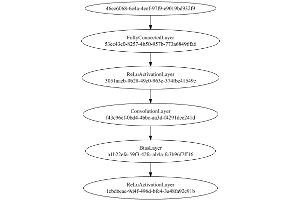


### Training
We start by training with a very small population to improve initial convergence performance:

Adding performance wrappers

Code from [TestUtil.java:269](../../../../../../../../src/main/java/com/simiacryptus/mindseye/test/TestUtil.java#L269) executed in 0.00 seconds: 
```java
    network.visitNodes(node -> {
      if (!(node.getLayer() instanceof MonitoringWrapperLayer)) {
        node.setLayer(new MonitoringWrapperLayer(node.getLayer()).shouldRecordSignalMetrics(false));
      }
      else {
        ((MonitoringWrapperLayer) node.getLayer()).shouldRecordSignalMetrics(false);
      }
    });
```

Optimized via the Quadratic Quasi-Newton method:

Code from [OptimizerComparison.java:46](../../../../../../../../src/test/java/com/simiacryptus/mindseye/labs/matrix/OptimizerComparison.java#L46) executed in 0.00 seconds: 
```java
    ValidatingTrainer trainer = new ValidatingTrainer(trainingSubject, validationSubject)
      .setMonitor(monitor);
    trainer.getRegimen().get(0)
      .setOrientation(new com.simiacryptus.mindseye.opt.orient.QQN())
      .setLineSearchFactory(name -> new QuadraticSearch()
        .setCurrentRate(name.contains("QQN") ? 1.0 : 1e-6)
        .setRelativeTolerance(2e-1));
    return trainer;
```

Returns: 

```
    com.simiacryptus.mindseye.opt.ValidatingTrainer@45d3429f
```


Code from [EncodingProblem.java:113](../../../../../../../../src/main/java/com/simiacryptus/mindseye/test/EncodingProblem.java#L113) executed in 300.49 seconds: 
```java
    preTrainer.setTimeout(timeoutMinutes / 2, TimeUnit.MINUTES).setMaxIterations(batchSize).run();
```
Logging: 
```
    Epoch parameters: 15000, 1
    Phase 0: TrainingPhase{trainingSubject=PerformanceWrapper{inner=SampledArrayTrainable{inner=ArrayTrainable{inner=com.simiacryptus.mindseye.eval.GpuTrainable@67ee0d18}}}, orientation=com.simiacryptus.mindseye.opt.orient.QQN@7686badf}
    resetAndMeasure; trainingSize=15000
    LBFGS Accumulation History: 1 points
    Constructing line search parameters: GD
    F(0.0) = LineSearchPoint{point=PointSample{avg=86.16139595884238}, derivative=-0.0019526634627608486}
    New Minimum: 86.16139595884238 > 86.16139595775556
    F(1.0E-6) = LineSearchPoint{point=PointSample{avg=86.16139595775556}, derivative=-0.0019272256271116361}, delta = -1.0868177469092188E-9
    New Minimum: 86.16139595775556 > 86.16139595123481
    F(7.0E-6) = LineSearchPoint{point=PointSample{avg=86.16139595123481}, derivative=-0.0020251555281893007}, delta = -7.607567908962665E-9
    New Minimum: 86.16139595123481 > 86.16139590558952
    F(4.9E-5) = LineSearchPoint{point=PointSample{avg=86.16139590558952}, derivative=-0.0019492514565239024}, delta 
```
...[skipping 131519 bytes](etc/12.txt)...
```
    yer=1.0000115295509373, ConvolutionLayer=0.9999624518389126, PlaceholderLayer=9.9711e-01 +- 8.7625e-04 [9.9034e-01 - 1.0002e+00] (1000#)}
    Iteration 87 complete. Error: 38.07181481502491 (1324 in 2.490 seconds; 0.047 in orientation, 0.358 in gc, 2.439 in line search; 2.349 eval time)
    Epoch 8 result with 21 iterations, 1324/2147483647 samples: {validation *= 2^-0.02554; training *= 2^-0.026; Overtraining = 1.00}, {itr*=4.49, len*=0.71} 0 since improvement; 0.4594 validation time
    Epoch parameters: 936, 20
    Phase 0: TrainingPhase{trainingSubject=PerformanceWrapper{inner=SampledArrayTrainable{inner=ArrayTrainable{inner=com.simiacryptus.mindseye.eval.GpuTrainable@67ee0d18}}}, orientation=com.simiacryptus.mindseye.opt.orient.QQN@7686badf}
    resetAndMeasure; trainingSize=936
    Training timeout
    Epoch 9 result with 1 iterations, 936/2147483647 samples: {validation *= 2^0.00000; training *= 2^0.000; Overtraining = NaN}, {itr*=Infinity, len*=NaN} 1 since improvement; 0.4435 validation time
    Training 9 runPhase halted
    
```

Per-layer Performance Metrics:

Code from [TestUtil.java:234](../../../../../../../../src/main/java/com/simiacryptus/mindseye/test/TestUtil.java#L234) executed in 0.00 seconds: 
```java
    Map<NNLayer, MonitoringWrapperLayer> metrics = new HashMap<>();
    network.visitNodes(node -> {
      if ((node.getLayer() instanceof MonitoringWrapperLayer)) {
        MonitoringWrapperLayer layer = node.getLayer();
        metrics.put(layer.getInner(), layer);
      }
    });
    System.out.println("Forward Performance: \n\t" + metrics.entrySet().stream().map(e -> {
      PercentileStatistics performance = e.getValue().getForwardPerformance();
      return String.format("%s -> %.6fs +- %.6fs (%s)", e.getKey(), performance.getMean(), performance.getStdDev(), performance.getCount());
    }).reduce((a, b) -> a + "\n\t" + b));
    System.out.println("Backward Performance: \n\t" + metrics.entrySet().stream().map(e -> {
      PercentileStatistics performance = e.getValue().getBackwardPerformance();
      return String.format("%s -> %.6fs +- %.6fs (%s)", e.getKey(), performance.getMean(), performance.getStdDev(), performance.getCount());
    }).reduce((a, b) -> a + "\n\t" + b));
```
Logging: 
```
    Forward Performance: 
    	Optional[MeanSqLossLayer/7907747e-4984-4d16-a8d5-fe6fd9cf333f -> 0.005135s +- 0.008289s (1016.0)
    	NthPowerActivationLayer/0636dd6c-3d1a-4e94-9a35-b71910581cc4 -> 0.000928s +- 0.002323s (1016.0)
    	PipelineNetwork/7e8f5a3a-22d4-496a-b51d-882867976db1 -> 0.090013s +- 0.018206s (1016.0)
    	EntropyLossLayer/63cf6fa9-3647-460b-b9d7-377544bcf1ed -> 0.000880s +- 0.001567s (1016.0)
    	SoftmaxActivationLayer/c734e6f5-cb75-4a15-91d2-730af189b68b -> 0.001767s +- 0.002057s (1016.0)
    	LinearActivationLayer/dcec6b21-343f-4404-9ac8-5aab53bb1f20 -> 0.000448s +- 0.002053s (1016.0)
    	SumInputsLayer/f81f5856-519c-4329-b8a4-30478c9c727c -> 0.000723s +- 0.003467s (1016.0)]
    Backward Performance: 
    	Optional[MeanSqLossLayer/7907747e-4984-4d16-a8d5-fe6fd9cf333f -> 0.000006s +- 0.000009s (1016.0)
    	NthPowerActivationLayer/0636dd6c-3d1a-4e94-9a35-b71910581cc4 -> 0.000001s +- 0.000005s (1016.0)
    	PipelineNetwork/7e8f5a3a-22d4-496a-b51d-882867976db1 -> 0.000609s +- 0.000118s (1016.0)
    	EntropyLossLayer/63cf6fa9-3647-460b-b9d7-377544bcf1ed -> 0.000003s +- 0.000006s (996.0)
    	SoftmaxActivationLayer/c734e6f5-cb75-4a15-91d2-730af189b68b -> 0.000002s +- 0.000005s (996.0)
    	LinearActivationLayer/dcec6b21-343f-4404-9ac8-5aab53bb1f20 -> 0.000001s +- 0.000001s (996.0)
    	SumInputsLayer/f81f5856-519c-4329-b8a4-30478c9c727c -> 0.000000s +- 0.000000s (1016.0)]
    
```

Removing performance wrappers

Code from [TestUtil.java:252](../../../../../../../../src/main/java/com/simiacryptus/mindseye/test/TestUtil.java#L252) executed in 0.00 seconds: 
```java
    network.visitNodes(node -> {
      if (node.getLayer() instanceof MonitoringWrapperLayer) {
        node.setLayer(node.<MonitoringWrapperLayer>getLayer().getInner());
      }
    });
```

Then our main training phase:

Adding performance wrappers

Code from [TestUtil.java:269](../../../../../../../../src/main/java/com/simiacryptus/mindseye/test/TestUtil.java#L269) executed in 0.00 seconds: 
```java
    network.visitNodes(node -> {
      if (!(node.getLayer() instanceof MonitoringWrapperLayer)) {
        node.setLayer(new MonitoringWrapperLayer(node.getLayer()).shouldRecordSignalMetrics(false));
      }
      else {
        ((MonitoringWrapperLayer) node.getLayer()).shouldRecordSignalMetrics(false);
      }
    });
```

Optimized via the Quadratic Quasi-Newton method:

Code from [OptimizerComparison.java:46](../../../../../../../../src/test/java/com/simiacryptus/mindseye/labs/matrix/OptimizerComparison.java#L46) executed in 0.00 seconds: 
```java
    ValidatingTrainer trainer = new ValidatingTrainer(trainingSubject, validationSubject)
      .setMonitor(monitor);
    trainer.getRegimen().get(0)
      .setOrientation(new com.simiacryptus.mindseye.opt.orient.QQN())
      .setLineSearchFactory(name -> new QuadraticSearch()
        .setCurrentRate(name.contains("QQN") ? 1.0 : 1e-6)
        .setRelativeTolerance(2e-1));
    return trainer;
```

Returns: 

```
    com.simiacryptus.mindseye.opt.ValidatingTrainer@1ef0d418
```


Code from [EncodingProblem.java:123](../../../../../../../../src/main/java/com/simiacryptus/mindseye/test/EncodingProblem.java#L123) executed in 641.87 seconds: 
```java
    mainTrainer.setTimeout(timeoutMinutes, TimeUnit.MINUTES).setMaxIterations(batchSize).run();
```
Logging: 
```
    Epoch parameters: 15000, 1
    Phase 0: TrainingPhase{trainingSubject=PerformanceWrapper{inner=SampledArrayTrainable{inner=ArrayTrainable{inner=com.simiacryptus.mindseye.eval.GpuTrainable@7e2eafbf}}}, orientation=com.simiacryptus.mindseye.opt.orient.QQN@265b6902}
    resetAndMeasure; trainingSize=15000
    LBFGS Accumulation History: 1 points
    Constructing line search parameters: GD
    F(0.0) = LineSearchPoint{point=PointSample{avg=72.49226459748354}, derivative=-7.35977491534931}
    New Minimum: 72.49226459748354 > 72.4922627574845
    F(1.0E-6) = LineSearchPoint{point=PointSample{avg=72.4922627574845}, derivative=-7.359777740582036}, delta = -1.8399990437956149E-6
    New Minimum: 72.4922627574845 > 72.49225171749023
    F(7.0E-6) = LineSearchPoint{point=PointSample{avg=72.49225171749023}, derivative=-7.359816865691191}, delta = -1.2879993306569304E-5
    New Minimum: 72.49225171749023 > 72.49217443758447
    F(4.9E-5) = LineSearchPoint{point=PointSample{avg=72.49217443758447}, derivative=-7.359780679374159}, delta = -9.01598990736829
```
...[skipping 15630 bytes](etc/13.txt)...
```
    5457584107956
    LBFGS Accumulation History: 3 points
    F(0.0) = LineSearchPoint{point=PointSample{avg=45.55457584107956}, derivative=-2.8391300226313416}
    New Minimum: 45.55457584107956 > 44.844036483118785
    F(2.6010374193133337) = LineSearchPoint{point=PointSample{avg=44.844036483118785}, derivative=0.5431935119616949}, delta = -0.7105393579607764
    44.844036483118785 <= 45.55457584107956
    Converged to right
    Overall network state change: {FullyConnectedLayer=1.003035257974496, BiasLayer=1.0001417612637284, ConvolutionLayer=1.000131653380635, PlaceholderLayer=1.0028e+00 +- 3.8755e-02 [8.0306e-01 - 1.2027e+00] (15000#)}
    Iteration 12 complete. Error: 44.844036483118785 (15000 in 17.477 seconds; 0.947 in orientation, 2.093 in gc, 16.493 in line search; 16.121 eval time)
    Training timeout
    Epoch 3 result with 6 iterations, 15000/2147483647 samples: {validation *= 2^-0.11382; training *= 2^-0.511; Overtraining = 4.49}, {itr*=2.13, len*=1.50} 0 since improvement; 28.3242 validation time
    Training 3 runPhase halted
    
```

Per-layer Performance Metrics:

Code from [TestUtil.java:234](../../../../../../../../src/main/java/com/simiacryptus/mindseye/test/TestUtil.java#L234) executed in 0.00 seconds: 
```java
    Map<NNLayer, MonitoringWrapperLayer> metrics = new HashMap<>();
    network.visitNodes(node -> {
      if ((node.getLayer() instanceof MonitoringWrapperLayer)) {
        MonitoringWrapperLayer layer = node.getLayer();
        metrics.put(layer.getInner(), layer);
      }
    });
    System.out.println("Forward Performance: \n\t" + metrics.entrySet().stream().map(e -> {
      PercentileStatistics performance = e.getValue().getForwardPerformance();
      return String.format("%s -> %.6fs +- %.6fs (%s)", e.getKey(), performance.getMean(), performance.getStdDev(), performance.getCount());
    }).reduce((a, b) -> a + "\n\t" + b));
    System.out.println("Backward Performance: \n\t" + metrics.entrySet().stream().map(e -> {
      PercentileStatistics performance = e.getValue().getBackwardPerformance();
      return String.format("%s -> %.6fs +- %.6fs (%s)", e.getKey(), performance.getMean(), performance.getStdDev(), performance.getCount());
    }).reduce((a, b) -> a + "\n\t" + b));
```
Logging: 
```
    Forward Performance: 
    	Optional[MeanSqLossLayer/7907747e-4984-4d16-a8d5-fe6fd9cf333f -> 0.042903s +- 0.072737s (304.0)
    	NthPowerActivationLayer/0636dd6c-3d1a-4e94-9a35-b71910581cc4 -> 0.005544s +- 0.013018s (304.0)
    	PipelineNetwork/7e8f5a3a-22d4-496a-b51d-882867976db1 -> 0.746234s +- 0.193261s (304.0)
    	EntropyLossLayer/63cf6fa9-3647-460b-b9d7-377544bcf1ed -> 0.008255s +- 0.008274s (304.0)
    	SoftmaxActivationLayer/c734e6f5-cb75-4a15-91d2-730af189b68b -> 0.017008s +- 0.013322s (304.0)
    	LinearActivationLayer/dcec6b21-343f-4404-9ac8-5aab53bb1f20 -> 0.001761s +- 0.001086s (304.0)
    	SumInputsLayer/f81f5856-519c-4329-b8a4-30478c9c727c -> 0.003237s +- 0.011507s (304.0)]
    Backward Performance: 
    	Optional[MeanSqLossLayer/7907747e-4984-4d16-a8d5-fe6fd9cf333f -> 0.000005s +- 0.000008s (304.0)
    	NthPowerActivationLayer/0636dd6c-3d1a-4e94-9a35-b71910581cc4 -> 0.000001s +- 0.000002s (304.0)
    	PipelineNetwork/7e8f5a3a-22d4-496a-b51d-882867976db1 -> 0.000568s +- 0.000071s (304.0)
    	EntropyLossLayer/63cf6fa9-3647-460b-b9d7-377544bcf1ed -> 0.000003s +- 0.000006s (256.0)
    	SoftmaxActivationLayer/c734e6f5-cb75-4a15-91d2-730af189b68b -> 0.000002s +- 0.000005s (256.0)
    	LinearActivationLayer/dcec6b21-343f-4404-9ac8-5aab53bb1f20 -> 0.000001s +- 0.000000s (256.0)
    	SumInputsLayer/f81f5856-519c-4329-b8a4-30478c9c727c -> 0.000000s +- 0.000003s (304.0)]
    
```

Removing performance wrappers

Code from [TestUtil.java:252](../../../../../../../../src/main/java/com/simiacryptus/mindseye/test/TestUtil.java#L252) executed in 0.00 seconds: 
```java
    network.visitNodes(node -> {
      if (node.getLayer() instanceof MonitoringWrapperLayer) {
        node.setLayer(node.<MonitoringWrapperLayer>getLayer().getInner());
      }
    });
```

Code from [EncodingProblem.java:129](../../../../../../../../src/main/java/com/simiacryptus/mindseye/test/EncodingProblem.java#L129) executed in 0.01 seconds: 
```java
    return TestUtil.plot(history);
```

Returns: 

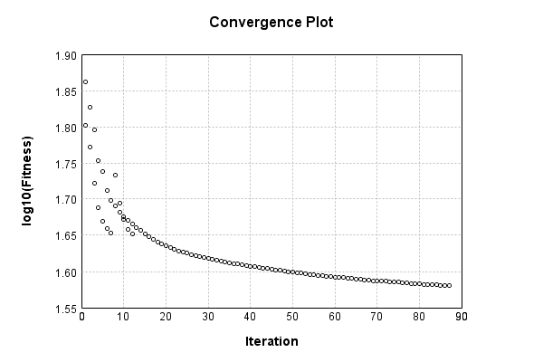


Code from [EncodingProblem.java:132](../../../../../../../../src/main/java/com/simiacryptus/mindseye/test/EncodingProblem.java#L132) executed in 0.01 seconds: 
```java
    return TestUtil.plotTime(history);
```

Returns: 

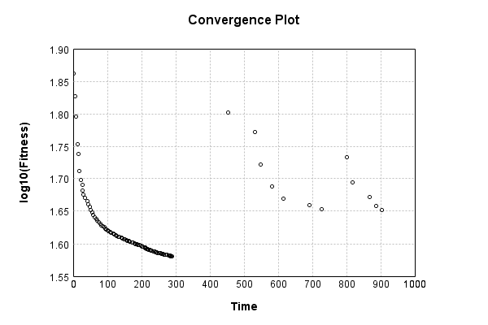


Saved model as [encoding_model4.json](etc/encoding_model4.json)

### Results
Code from [EncodingProblem.java:142](../../../../../../../../src/main/java/com/simiacryptus/mindseye/test/EncodingProblem.java#L142) executed in 0.12 seconds: 
```java
    TableOutput table = new TableOutput();
    Arrays.stream(trainingData).map(tensorArray -> {
      try {
        Tensor predictionSignal = GpuController.call(ctx -> testNetwork.eval(ctx, tensorArray)).getData().get(0);
        LinkedHashMap<String, Object> row = new LinkedHashMap<String, Object>();
        row.put("Source", log.image(tensorArray[1].toImage(), ""));
        row.put("Echo", log.image(predictionSignal.toImage(), ""));
        return row;
      } catch (IOException e) {
        throw new RuntimeException(e);
      }
    }).filter(x -> null != x).limit(10).forEach(table::putRow);
    return table;
```

Returns: 

Source | Echo
------ | ----
 | 
 | 
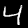 | 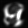
 | 
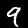 | 
 | 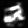
 | 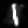
 | 
 | 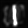
 | 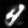


Learned Model Statistics:

Code from [EncodingProblem.java:159](../../../../../../../../src/main/java/com/simiacryptus/mindseye/test/EncodingProblem.java#L159) executed in 0.00 seconds: 
```java
    ScalarStatistics scalarStatistics = new ScalarStatistics();
    trainingNetwork.state().stream().flatMapToDouble(x -> Arrays.stream(x))
      .forEach(v -> scalarStatistics.add(v));
    return scalarStatistics.getMetrics();
```

Returns: 

```
    {meanExponent=-1.667072635196202, negative=35441, min=-1.3122877613904906, max=54.887946563542116, mean=0.13941130613203095, count=79233.0, positive=43791, stdDev=2.1817659316962166, zeros=1}
```


Learned Representation Statistics:

Code from [EncodingProblem.java:167](../../../../../../../../src/main/java/com/simiacryptus/mindseye/test/EncodingProblem.java#L167) executed in 0.06 seconds: 
```java
    ScalarStatistics scalarStatistics = new ScalarStatistics();
    Arrays.stream(trainingData)
      .flatMapToDouble(row -> Arrays.stream(row[0].getData()))
      .forEach(v -> scalarStatistics.add(v));
    return scalarStatistics.getMetrics();
```

Returns: 

```
    {meanExponent=-1.5704213003315055, negative=607990, min=-0.8541804887580909, max=0.8829709595925955, mean=-0.0018652493852738348, count=1200000.0, positive=592010, stdDev=0.0600502243145769, zeros=0}
```


Some rendered unit vectors:


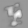


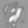
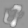


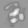


