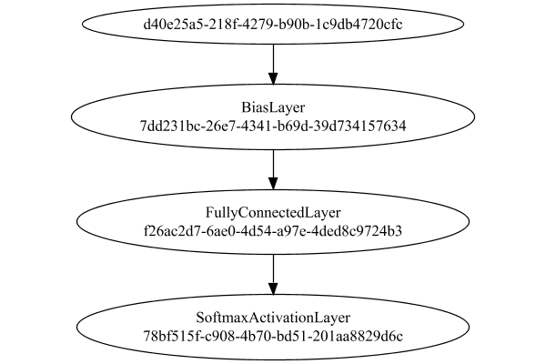
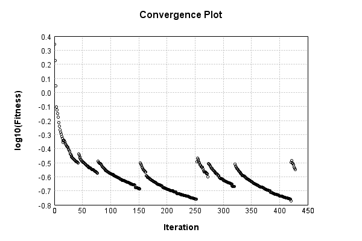
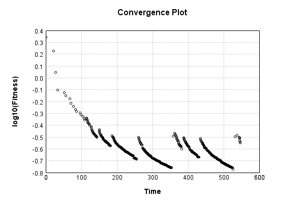

# MNIST Digit Classification


The image-to-vector network is a single layer, fully connected:

Code from [MnistTests.java:48](../../../../../../../../src/test/java/com/simiacryptus/mindseye/labs/matrix/MnistTests.java#L48) executed in 0.00 seconds: 
```java
    PipelineNetwork network = new PipelineNetwork();
    network.add(new BiasLayer(28, 28, 1));
    network.add(new FullyConnectedLayer(new int[]{28, 28, 1}, new int[]{features})
      .setWeights(() -> 0.001 * (Math.random() - 0.45)));
    network.add(new SoftmaxActivationLayer());
    return network;
```

Returns: 

```
    PipelineNetwork/0d170a1a-73c8-47d7-b083-ce107ade134d
```


### Network Diagram
Code from [ClassifyProblem.java:80](../../../../../../../../src/main/java/com/simiacryptus/mindseye/test/ClassifyProblem.java#L80) executed in 0.15 seconds: 
```java
    return Graphviz.fromGraph(TestUtil.toGraph(network))
      .height(400).width(600).render(Format.PNG).toImage();
```

Returns: 




### Training
Adding performance wrappers

Code from [TestUtil.java:269](../../../../../../../../src/main/java/com/simiacryptus/mindseye/test/TestUtil.java#L269) executed in 0.00 seconds: 
```java
    network.visitNodes(node -> {
      if (!(node.getLayer() instanceof MonitoringWrapperLayer)) {
        node.setLayer(new MonitoringWrapperLayer(node.getLayer()).shouldRecordSignalMetrics(false));
      }
      else {
        ((MonitoringWrapperLayer) node.getLayer()).shouldRecordSignalMetrics(false);
      }
    });
```

Optimized via the Stochastic Gradient Descent method with momentum and adaptve learning rate:

Code from [TextbookOptimizers.java:58](../../../../../../../../src/test/java/com/simiacryptus/mindseye/labs/matrix/TextbookOptimizers.java#L58) executed in 0.00 seconds: 
```java
    double carryOver = 0.5;
    ValidatingTrainer trainer = new ValidatingTrainer(trainingSubject, validationSubject)
      .setMaxEpochIterations(100)
      .setMonitor(monitor);
    trainer.getRegimen().get(0)
      .setOrientation(new MomentumStrategy(new GradientDescent()).setCarryOver(carryOver))
      .setLineSearchFactory(name -> new ArmijoWolfeSearch());
    return trainer;
```

Returns: 

```
    com.simiacryptus.mindseye.opt.ValidatingTrainer@6162705c
```


Code from [ClassifyProblem.java:91](../../../../../../../../src/main/java/com/simiacryptus/mindseye/test/ClassifyProblem.java#L91) executed in 604.52 seconds: 
```java
    trainer.setTimeout(timeoutMinutes, TimeUnit.MINUTES).setMaxIterations(10000).run();
```
Logging: 
```
    Epoch parameters: 30000, 1
    Phase 0: TrainingPhase{trainingSubject=PerformanceWrapper{inner=SampledArrayTrainable{inner=ArrayTrainable{inner=com.simiacryptus.mindseye.eval.GpuTrainable@415bc37f}}}, orientation=com.simiacryptus.mindseye.opt.orient.MomentumStrategy@4775c718}
    resetAndMeasure; trainingSize=30000
    Constructing line search parameters: 
    th(0)=2.5401691772147683;dx=-4410519.870229399
    Armijo: th(2.154434690031884)=17.133075159950092; dx=1.6931018471265606E-15 delta=-14.592905982735324
    Armijo: th(1.077217345015942)=17.133075159983033; dx=2.3299505000280927E-5 delta=-14.592905982768265
    Armijo: th(0.3590724483386473)=17.132195074027223; dx=0.016140664181624624 delta=-14.592025896812455
    Armijo: th(0.08976811208466183)=17.130983008529313; dx=0.04284535923573324 delta=-14.590813831314545
    Armijo: th(0.017953622416932366)=17.125068979599426; dx=2.6427862522463608 delta=-14.584899802384658
    Armijo: th(0.002992270402822061)=17.08899762743635; dx=102.3442486056342 delta=-14.548828450221581
    Armijo: th(4.2
```
...[skipping 257275 bytes](etc/17.txt)...
```
    entation, 0.107 in gc, 0.660 in line search; 0.659 eval time)
    th(0)=0.2865545701509601;dx=-1446.6583860176036
    Armijo: th(5.402773117078654E-5)=0.30875925710836005; dx=3250.459926545488 delta=-0.022204686957399966
    New Minimum: 0.2865545701509601 > 0.28200802124269575
    WOLF (strong): th(2.701386558539327E-5)=0.28200802124269575; dx=812.8178375222234 delta=0.004546548908264336
    New Minimum: 0.28200802124269575 > 0.28166934262027915
    END: th(9.004621861797756E-6)=0.28166934262027915; dx=-693.5943641960705 delta=0.004885227530680936
    Overall network state change: {FullyConnectedLayer=1.0001299338034622, BiasLayer=0.9988303149542138}
    Iteration 428 complete. Error: 0.28166934262027915 (3845 in 0.916 seconds; 0.000 in orientation, 0.185 in gc, 0.915 in line search; 0.914 eval time)
    Epoch 17 result with 7 iterations, 3845/2147483647 samples: {validation *= 2^-0.04558; training *= 2^-0.168; Overtraining = 3.68}, {itr*=3.36, len*=1.36} 0 since improvement; 3.9836 validation time
    Training timeout
    Training halted
    
```

Code from [ClassifyProblem.java:95](../../../../../../../../src/main/java/com/simiacryptus/mindseye/test/ClassifyProblem.java#L95) executed in 0.01 seconds: 
```java
    return TestUtil.plot(history);
```

Returns: 




Code from [ClassifyProblem.java:98](../../../../../../../../src/main/java/com/simiacryptus/mindseye/test/ClassifyProblem.java#L98) executed in 0.01 seconds: 
```java
    return TestUtil.plotTime(history);
```

Returns: 




Per-layer Performance Metrics:

Code from [TestUtil.java:234](../../../../../../../../src/main/java/com/simiacryptus/mindseye/test/TestUtil.java#L234) executed in 0.00 seconds: 
```java
    Map<NNLayer, MonitoringWrapperLayer> metrics = new HashMap<>();
    network.visitNodes(node -> {
      if ((node.getLayer() instanceof MonitoringWrapperLayer)) {
        MonitoringWrapperLayer layer = node.getLayer();
        metrics.put(layer.getInner(), layer);
      }
    });
    System.out.println("Forward Performance: \n\t" + metrics.entrySet().stream().map(e -> {
      PercentileStatistics performance = e.getValue().getForwardPerformance();
      return String.format("%s -> %.6fs +- %.6fs (%s)", e.getKey(), performance.getMean(), performance.getStdDev(), performance.getCount());
    }).reduce((a, b) -> a + "\n\t" + b));
    System.out.println("Backward Performance: \n\t" + metrics.entrySet().stream().map(e -> {
      PercentileStatistics performance = e.getValue().getBackwardPerformance();
      return String.format("%s -> %.6fs +- %.6fs (%s)", e.getKey(), performance.getMean(), performance.getStdDev(), performance.getCount());
    }).reduce((a, b) -> a + "\n\t" + b));
```
Logging: 
```
    Forward Performance: 
    	Optional[PipelineNetwork/0d170a1a-73c8-47d7-b083-ce107ade134d -> 0.088421s +- 0.056256s (2982.0)
    	EntropyLossLayer/fee4eb80-59bc-48c1-90c5-85c1bdff5c09 -> 0.002696s +- 0.005494s (2982.0)]
    Backward Performance: 
    	Optional[PipelineNetwork/0d170a1a-73c8-47d7-b083-ce107ade134d -> 0.000070s +- 0.000054s (2982.0)
    	EntropyLossLayer/fee4eb80-59bc-48c1-90c5-85c1bdff5c09 -> 0.000000s +- 0.000001s (2982.0)]
    
```

Removing performance wrappers

Code from [TestUtil.java:252](../../../../../../../../src/main/java/com/simiacryptus/mindseye/test/TestUtil.java#L252) executed in 0.00 seconds: 
```java
    network.visitNodes(node -> {
      if (node.getLayer() instanceof MonitoringWrapperLayer) {
        node.setLayer(node.<MonitoringWrapperLayer>getLayer().getInner());
      }
    });
```

Saved model as [classification_model5.json](etc/classification_model5.json)

### Validation
If we run our model against the entire validation dataset, we get this accuracy:

Code from [ClassifyProblem.java:108](../../../../../../../../src/main/java/com/simiacryptus/mindseye/test/ClassifyProblem.java#L108) executed in 0.57 seconds: 
```java
    return data.validationData().mapToDouble(labeledObject ->
      predict(network, labeledObject)[0] == parse(labeledObject.label) ? 1 : 0)
      .average().getAsDouble() * 100;
```

Returns: 

```
    91.45
```


Let's examine some incorrectly predicted results in more detail:

Code from [ClassifyProblem.java:115](../../../../../../../../src/main/java/com/simiacryptus/mindseye/test/ClassifyProblem.java#L115) executed in 0.04 seconds: 
```java
    try {
      TableOutput table = new TableOutput();
      data.validationData().map(labeledObject -> {
        return toRow(log, labeledObject, GpuController.call(ctx -> network.eval(ctx, labeledObject.data)).getData().get(0).getData());
      }).filter(x -> null != x).limit(10).forEach(table::putRow);
      return table;
    } catch (IOException e) {
      throw new RuntimeException(e);
    }
```

Returns: 

Image | Prediction
----- | ----------
![[5]](etc/classification_test.295.png) | 6 (99.3%), 5 (0.6%), 0 (0.1%)  
![[4]](etc/classification_test.296.png) | 6 (69.7%), 4 (18.3%), 5 (6.3%) 
![[3]](etc/classification_test.297.png) | 2 (87.0%), 3 (12.2%), 8 (0.7%) 
![[6]](etc/classification_test.298.png) | 3 (61.5%), 7 (28.5%), 2 (4.4%) 
![[9]](etc/classification_test.299.png) | 8 (47.8%), 9 (26.7%), 4 (19.1%)
![[4]](etc/classification_test.300.png) | 8 (41.3%), 4 (20.4%), 9 (19.6%)
![[4]](etc/classification_test.301.png) | 8 (64.5%), 4 (29.6%), 9 (4.2%) 
![[2]](etc/classification_test.302.png) | 9 (82.1%), 4 (12.2%), 1 (2.1%) 
![[9]](etc/classification_test.303.png) | 8 (54.9%), 9 (34.9%), 2 (5.9%) 
![[9]](etc/classification_test.304.png) | 3 (80.6%), 9 (10.0%), 4 (7.1%) 


