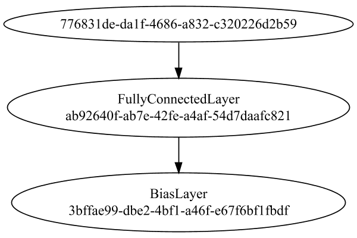
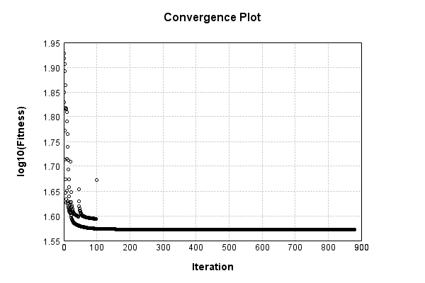
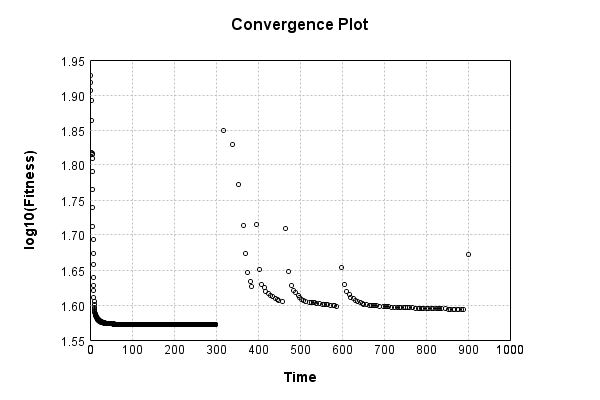
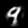

# MNIST Image-to-Vector Encoding


The vector-to-image network is a single fully connected layer:

Code from [MnistTests.java:79](../../../../../../../../src/test/java/com/simiacryptus/mindseye/labs/matrix/MnistTests.java#L79) executed in 0.00 seconds: 
```java
    PipelineNetwork network = new PipelineNetwork();
    network.add(new FullyConnectedLayer(new int[]{features}, new int[]{28, 28, 1})
      .setWeights(() -> 0.25 * (Math.random() - 0.5)));
    network.add(new BiasLayer(28, 28, 1));
    return network;
```

Returns: 

```
    PipelineNetwork/f4cb3d8a-aba5-4aec-9c16-851a49dd977c
```


### Network Diagram
Code from [EncodingProblem.java:91](../../../../../../../../src/main/java/com/simiacryptus/mindseye/test/EncodingProblem.java#L91) executed in 0.14 seconds: 
```java
    return Graphviz.fromGraph(TestUtil.toGraph(imageNetwork))
      .height(400).width(600).render(Format.PNG).toImage();
```

Returns: 




### Training
We start by training with a very small population to improve initial convergence performance:

Adding performance wrappers

Code from [TestUtil.java:269](../../../../../../../../src/main/java/com/simiacryptus/mindseye/test/TestUtil.java#L269) executed in 0.00 seconds: 
```java
    network.visitNodes(node -> {
      if (!(node.getLayer() instanceof MonitoringWrapperLayer)) {
        node.setLayer(new MonitoringWrapperLayer(node.getLayer()).shouldRecordSignalMetrics(false));
      }
      else {
        ((MonitoringWrapperLayer) node.getLayer()).shouldRecordSignalMetrics(false);
      }
    });
```

Optimized via the Stochastic Gradient Descent method with momentum and adaptve learning rate:

Code from [TextbookOptimizers.java:58](../../../../../../../../src/test/java/com/simiacryptus/mindseye/labs/matrix/TextbookOptimizers.java#L58) executed in 0.00 seconds: 
```java
    double carryOver = 0.5;
    ValidatingTrainer trainer = new ValidatingTrainer(trainingSubject, validationSubject)
      .setMaxEpochIterations(100)
      .setMonitor(monitor);
    trainer.getRegimen().get(0)
      .setOrientation(new MomentumStrategy(new GradientDescent()).setCarryOver(carryOver))
      .setLineSearchFactory(name -> new ArmijoWolfeSearch());
    return trainer;
```

Returns: 

```
    com.simiacryptus.mindseye.opt.ValidatingTrainer@65d15baa
```


Code from [EncodingProblem.java:113](../../../../../../../../src/main/java/com/simiacryptus/mindseye/test/EncodingProblem.java#L113) executed in 300.07 seconds: 
```java
    preTrainer.setTimeout(timeoutMinutes / 2, TimeUnit.MINUTES).setMaxIterations(batchSize).run();
```
Logging: 
```
    Epoch parameters: 15000, 1
    Phase 0: TrainingPhase{trainingSubject=PerformanceWrapper{inner=SampledArrayTrainable{inner=ArrayTrainable{inner=com.simiacryptus.mindseye.eval.GpuTrainable@160a8a0f}}}, orientation=com.simiacryptus.mindseye.opt.orient.MomentumStrategy@79699f6f}
    resetAndMeasure; trainingSize=15000
    Constructing line search parameters: 
    th(0)=86.16139829776051;dx=-0.0016633020916768195
    New Minimum: 86.16139829776051 > 86.15933656099216
    WOLFE (weak): th(2.154434690031884)=86.15933656099216; dx=-0.0016663875365532503 delta=0.0020617367683541943
    New Minimum: 86.15933656099216 > 86.1572749037783
    WOLFE (weak): th(4.308869380063768)=86.1572749037783; dx=-0.001763397195936104 delta=0.004123393982212065
    New Minimum: 86.1572749037783 > 86.14902907059023
    WOLFE (weak): th(12.926608140191302)=86.14902907059023; dx=-0.0016693854802053154 delta=0.012369227170282215
    New Minimum: 86.14902907059023 > 86.11193858474746
    WOLFE (weak): th(51.70643256076521)=86.11193858474746; dx=-0.0017196148757675533 delta=0.
```
...[skipping 584346 bytes](etc/15.txt)...
```
    ayer=0.9999856366631382, PlaceholderLayer=9.9994e-01 +- 1.5699e-05 [9.9989e-01 - 9.9998e-01] (1000#)}
    Iteration 879 complete. Error: 37.27905429725165 (164 in 0.245 seconds; 0.008 in orientation, 0.000 in gc, 0.235 in line search; 0.222 eval time)
    th(0)=37.27905429725165;dx=-7.47909206013968E-7
    New Minimum: 37.27905429725165 > 37.27900963523102
    END: th(144.31561555543593)=37.27900963523102; dx=-4.166527517869361E-7 delta=4.466202062758384E-5
    Overall network state change: {FullyConnectedLayer=1.0000236031440324, BiasLayer=0.9999925197673096, PlaceholderLayer=9.9987e-01 +- 3.3587e-05 [9.9976e-01 - 9.9997e-01] (1000#)}
    Iteration 880 complete. Error: 37.27900963523102 (164 in 0.279 seconds; 0.008 in orientation, 0.113 in gc, 0.269 in line search; 0.260 eval time)
    Training timeout
    Epoch 14 result with 39 iterations, 164/2147483647 samples: {validation *= 2^-0.00006; training *= 2^-0.000; Overtraining = 1.00}, {itr*=94.04, len*=0.71} 0 since improvement; 0.0576 validation time
    Training 14 runPhase halted
    
```

Per-layer Performance Metrics:

Code from [TestUtil.java:234](../../../../../../../../src/main/java/com/simiacryptus/mindseye/test/TestUtil.java#L234) executed in 0.00 seconds: 
```java
    Map<NNLayer, MonitoringWrapperLayer> metrics = new HashMap<>();
    network.visitNodes(node -> {
      if ((node.getLayer() instanceof MonitoringWrapperLayer)) {
        MonitoringWrapperLayer layer = node.getLayer();
        metrics.put(layer.getInner(), layer);
      }
    });
    System.out.println("Forward Performance: \n\t" + metrics.entrySet().stream().map(e -> {
      PercentileStatistics performance = e.getValue().getForwardPerformance();
      return String.format("%s -> %.6fs +- %.6fs (%s)", e.getKey(), performance.getMean(), performance.getStdDev(), performance.getCount());
    }).reduce((a, b) -> a + "\n\t" + b));
    System.out.println("Backward Performance: \n\t" + metrics.entrySet().stream().map(e -> {
      PercentileStatistics performance = e.getValue().getBackwardPerformance();
      return String.format("%s -> %.6fs +- %.6fs (%s)", e.getKey(), performance.getMean(), performance.getStdDev(), performance.getCount());
    }).reduce((a, b) -> a + "\n\t" + b));
```
Logging: 
```
    Forward Performance: 
    	Optional[LinearActivationLayer/f6da4525-77b7-4edf-b80e-78c1aa0196d9 -> 0.000576s +- 0.004991s (5434.0)
    	PipelineNetwork/f4cb3d8a-aba5-4aec-9c16-851a49dd977c -> 0.007751s +- 0.011217s (5434.0)
    	NthPowerActivationLayer/a10abf32-9b9a-43ba-bea5-7a5c84731fe7 -> 0.000564s +- 0.002501s (5434.0)
    	MeanSqLossLayer/d172afdc-809d-4130-a6aa-bb46fd283cc0 -> 0.003173s +- 0.009636s (5434.0)
    	EntropyLossLayer/73c05065-c778-4134-8db7-d98a2219ae15 -> 0.001274s +- 0.006480s (5434.0)
    	SumInputsLayer/3bc7c2aa-15c5-4eb0-a3f8-11d4610e21b2 -> 0.000446s +- 0.003780s (5434.0)
    	SoftmaxActivationLayer/84d32e29-bf07-4d31-a50e-4cfdf5ce394a -> 0.002115s +- 0.006641s (5434.0)]
    Backward Performance: 
    	Optional[LinearActivationLayer/f6da4525-77b7-4edf-b80e-78c1aa0196d9 -> 0.000001s +- 0.000007s (5404.0)
    	PipelineNetwork/f4cb3d8a-aba5-4aec-9c16-851a49dd977c -> 0.000094s +- 0.000078s (5434.0)
    	NthPowerActivationLayer/a10abf32-9b9a-43ba-bea5-7a5c84731fe7 -> 0.000002s +- 0.000014s (5434.0)
    	MeanSqLossLayer/d172afdc-809d-4130-a6aa-bb46fd283cc0 -> 0.000009s +- 0.000032s (5434.0)
    	EntropyLossLayer/73c05065-c778-4134-8db7-d98a2219ae15 -> 0.000004s +- 0.000019s (5404.0)
    	SumInputsLayer/3bc7c2aa-15c5-4eb0-a3f8-11d4610e21b2 -> 0.000000s +- 0.000003s (5434.0)
    	SoftmaxActivationLayer/84d32e29-bf07-4d31-a50e-4cfdf5ce394a -> 0.000002s +- 0.000015s (5404.0)]
    
```

Removing performance wrappers

Code from [TestUtil.java:252](../../../../../../../../src/main/java/com/simiacryptus/mindseye/test/TestUtil.java#L252) executed in 0.00 seconds: 
```java
    network.visitNodes(node -> {
      if (node.getLayer() instanceof MonitoringWrapperLayer) {
        node.setLayer(node.<MonitoringWrapperLayer>getLayer().getInner());
      }
    });
```

Then our main training phase:

Adding performance wrappers

Code from [TestUtil.java:269](../../../../../../../../src/main/java/com/simiacryptus/mindseye/test/TestUtil.java#L269) executed in 0.00 seconds: 
```java
    network.visitNodes(node -> {
      if (!(node.getLayer() instanceof MonitoringWrapperLayer)) {
        node.setLayer(new MonitoringWrapperLayer(node.getLayer()).shouldRecordSignalMetrics(false));
      }
      else {
        ((MonitoringWrapperLayer) node.getLayer()).shouldRecordSignalMetrics(false);
      }
    });
```

Optimized via the Stochastic Gradient Descent method with momentum and adaptve learning rate:

Code from [TextbookOptimizers.java:58](../../../../../../../../src/test/java/com/simiacryptus/mindseye/labs/matrix/TextbookOptimizers.java#L58) executed in 0.00 seconds: 
```java
    double carryOver = 0.5;
    ValidatingTrainer trainer = new ValidatingTrainer(trainingSubject, validationSubject)
      .setMaxEpochIterations(100)
      .setMonitor(monitor);
    trainer.getRegimen().get(0)
      .setOrientation(new MomentumStrategy(new GradientDescent()).setCarryOver(carryOver))
      .setLineSearchFactory(name -> new ArmijoWolfeSearch());
    return trainer;
```

Returns: 

```
    com.simiacryptus.mindseye.opt.ValidatingTrainer@2ebf9a3a
```


Code from [EncodingProblem.java:123](../../../../../../../../src/main/java/com/simiacryptus/mindseye/test/EncodingProblem.java#L123) executed in 607.16 seconds: 
```java
    mainTrainer.setTimeout(timeoutMinutes, TimeUnit.MINUTES).setMaxIterations(batchSize).run();
```
Logging: 
```
    Epoch parameters: 15000, 1
    Phase 0: TrainingPhase{trainingSubject=PerformanceWrapper{inner=SampledArrayTrainable{inner=ArrayTrainable{inner=com.simiacryptus.mindseye.eval.GpuTrainable@8f4b168}}}, orientation=com.simiacryptus.mindseye.opt.orient.MomentumStrategy@2c16edc6}
    resetAndMeasure; trainingSize=15000
    Constructing line search parameters: 
    th(0)=75.55731817563262;dx=-0.012238349276112895
    New Minimum: 75.55731817563262 > 75.55045708014512
    WOLFE (weak): th(2.154434690031884)=75.55045708014512; dx=-0.01230779480949157 delta=0.00686109548749414
    New Minimum: 75.55045708014512 > 75.54359647561014
    WOLFE (weak): th(4.308869380063768)=75.54359647561014; dx=-0.012332003093012245 delta=0.013721700022472305
    New Minimum: 75.54359647561014 > 75.51615897129535
    WOLFE (weak): th(12.926608140191302)=75.51615897129535; dx=-0.012256269798668154 delta=0.04115920433726217
    New Minimum: 75.51615897129535 > 75.39278782264623
    WOLFE (weak): th(51.70643256076521)=75.39278782264623; dx=-0.012233021590366433 delta=0.164530
```
...[skipping 67692 bytes](etc/16.txt)...
```
    ubject=PerformanceWrapper{inner=SampledArrayTrainable{inner=ArrayTrainable{inner=com.simiacryptus.mindseye.eval.GpuTrainable@8f4b168}}}, orientation=com.simiacryptus.mindseye.opt.orient.MomentumStrategy@2c16edc6}
    resetAndMeasure; trainingSize=15000
    th(0)=49.99577862630312;dx=-0.009989678650389765
    New Minimum: 49.99577862630312 > 46.98283601162416
    END: th(1535.5365249603735)=46.98283601162416; dx=-0.005441361170352534 delta=3.0129426146789626
    Overall network state change: {FullyConnectedLayer=0.9603810000368488, BiasLayer=0.9926867362153742, PlaceholderLayer=7.2341e-01 +- 3.8708e-01 [3.7517e-02 - 1.0701e+00] (15000#)}
    Iteration 99 complete. Error: 46.98283601162416 (15000 in 3.697 seconds; 0.191 in orientation, 0.885 in gc, 3.468 in line search; 4.577 eval time)
    Training timeout
    Epoch 6 result with 2 iterations, 15000/2147483647 samples: {validation *= 2^-0.02741; training *= 2^-0.090; Overtraining = 3.27}, {itr*=4.33, len*=1.28} 0 since improvement; 4.4845 validation time
    Training 6 runPhase halted
    
```

Per-layer Performance Metrics:

Code from [TestUtil.java:234](../../../../../../../../src/main/java/com/simiacryptus/mindseye/test/TestUtil.java#L234) executed in 0.00 seconds: 
```java
    Map<NNLayer, MonitoringWrapperLayer> metrics = new HashMap<>();
    network.visitNodes(node -> {
      if ((node.getLayer() instanceof MonitoringWrapperLayer)) {
        MonitoringWrapperLayer layer = node.getLayer();
        metrics.put(layer.getInner(), layer);
      }
    });
    System.out.println("Forward Performance: \n\t" + metrics.entrySet().stream().map(e -> {
      PercentileStatistics performance = e.getValue().getForwardPerformance();
      return String.format("%s -> %.6fs +- %.6fs (%s)", e.getKey(), performance.getMean(), performance.getStdDev(), performance.getCount());
    }).reduce((a, b) -> a + "\n\t" + b));
    System.out.println("Backward Performance: \n\t" + metrics.entrySet().stream().map(e -> {
      PercentileStatistics performance = e.getValue().getBackwardPerformance();
      return String.format("%s -> %.6fs +- %.6fs (%s)", e.getKey(), performance.getMean(), performance.getStdDev(), performance.getCount());
    }).reduce((a, b) -> a + "\n\t" + b));
```
Logging: 
```
    Forward Performance: 
    	Optional[LinearActivationLayer/f6da4525-77b7-4edf-b80e-78c1aa0196d9 -> 0.002456s +- 0.006673s (1348.0)
    	PipelineNetwork/f4cb3d8a-aba5-4aec-9c16-851a49dd977c -> 0.062645s +- 0.074760s (1348.0)
    	NthPowerActivationLayer/a10abf32-9b9a-43ba-bea5-7a5c84731fe7 -> 0.003608s +- 0.005381s (1348.0)
    	MeanSqLossLayer/d172afdc-809d-4130-a6aa-bb46fd283cc0 -> 0.027815s +- 0.066487s (1348.0)
    	EntropyLossLayer/73c05065-c778-4134-8db7-d98a2219ae15 -> 0.011284s +- 0.034456s (1348.0)
    	SumInputsLayer/3bc7c2aa-15c5-4eb0-a3f8-11d4610e21b2 -> 0.004249s +- 0.068155s (1348.0)
    	SoftmaxActivationLayer/84d32e29-bf07-4d31-a50e-4cfdf5ce394a -> 0.017193s +- 0.024813s (1348.0)]
    Backward Performance: 
    	Optional[LinearActivationLayer/f6da4525-77b7-4edf-b80e-78c1aa0196d9 -> 0.000001s +- 0.000003s (1264.0)
    	PipelineNetwork/f4cb3d8a-aba5-4aec-9c16-851a49dd977c -> 0.000093s +- 0.000040s (1348.0)
    	NthPowerActivationLayer/a10abf32-9b9a-43ba-bea5-7a5c84731fe7 -> 0.000001s +- 0.000003s (1348.0)
    	MeanSqLossLayer/d172afdc-809d-4130-a6aa-bb46fd283cc0 -> 0.000007s +- 0.000020s (1348.0)
    	EntropyLossLayer/73c05065-c778-4134-8db7-d98a2219ae15 -> 0.000004s +- 0.000010s (1264.0)
    	SumInputsLayer/3bc7c2aa-15c5-4eb0-a3f8-11d4610e21b2 -> 0.000000s +- 0.000001s (1348.0)
    	SoftmaxActivationLayer/84d32e29-bf07-4d31-a50e-4cfdf5ce394a -> 0.000002s +- 0.000006s (1264.0)]
    
```

Removing performance wrappers

Code from [TestUtil.java:252](../../../../../../../../src/main/java/com/simiacryptus/mindseye/test/TestUtil.java#L252) executed in 0.00 seconds: 
```java
    network.visitNodes(node -> {
      if (node.getLayer() instanceof MonitoringWrapperLayer) {
        node.setLayer(node.<MonitoringWrapperLayer>getLayer().getInner());
      }
    });
```

Code from [EncodingProblem.java:129](../../../../../../../../src/main/java/com/simiacryptus/mindseye/test/EncodingProblem.java#L129) executed in 0.01 seconds: 
```java
    return TestUtil.plot(history);
```

Returns: 




Code from [EncodingProblem.java:132](../../../../../../../../src/main/java/com/simiacryptus/mindseye/test/EncodingProblem.java#L132) executed in 0.01 seconds: 
```java
    return TestUtil.plotTime(history);
```

Returns: 




Saved model as [encoding_model5.json](etc/encoding_model5.json)

### Results
Code from [EncodingProblem.java:142](../../../../../../../../src/main/java/com/simiacryptus/mindseye/test/EncodingProblem.java#L142) executed in 0.06 seconds: 
```java
    TableOutput table = new TableOutput();
    Arrays.stream(trainingData).map(tensorArray -> {
      try {
        Tensor predictionSignal = GpuController.call(ctx -> testNetwork.eval(ctx, tensorArray)).getData().get(0);
        LinkedHashMap<String, Object> row = new LinkedHashMap<String, Object>();
        row.put("Source", log.image(tensorArray[1].toImage(), ""));
        row.put("Echo", log.image(predictionSignal.toImage(), ""));
        return row;
      } catch (IOException e) {
        throw new RuntimeException(e);
      }
    }).filter(x -> null != x).limit(10).forEach(table::putRow);
    return table;
```

Returns: 

Source | Echo
------ | ----
 | 
 | 
 | 
 | 
 | 
 | 
 | 
 | 
 | 
 | 


Learned Model Statistics:

Code from [EncodingProblem.java:159](../../../../../../../../src/main/java/com/simiacryptus/mindseye/test/EncodingProblem.java#L159) executed in 0.00 seconds: 
```java
    ScalarStatistics scalarStatistics = new ScalarStatistics();
    trainingNetwork.state().stream().flatMapToDouble(x -> Arrays.stream(x))
      .forEach(v -> scalarStatistics.add(v));
    return scalarStatistics.getMetrics();
```

Returns: 

```
    {meanExponent=-1.3618363738847903, negative=7988, min=-34.49309722657553, max=109.44489839919623, mean=0.8979733427651087, count=16466.0, positive=8477, stdDev=10.42849204102738, zeros=1}
```


Learned Representation Statistics:

Code from [EncodingProblem.java:167](../../../../../../../../src/main/java/com/simiacryptus/mindseye/test/EncodingProblem.java#L167) executed in 0.06 seconds: 
```java
    ScalarStatistics scalarStatistics = new ScalarStatistics();
    Arrays.stream(trainingData)
      .flatMapToDouble(row -> Arrays.stream(row[0].getData()))
      .forEach(v -> scalarStatistics.add(v));
    return scalarStatistics.getMetrics();
```

Returns: 

```
    {meanExponent=-0.3600094467688401, negative=645687, min=-29.33876605109432, max=42.556223407153716, mean=-0.08535568772287744, count=1200000.0, positive=554313, stdDev=2.0889327179156676, zeros=0}
```


Some rendered unit vectors:


