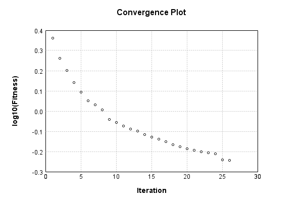
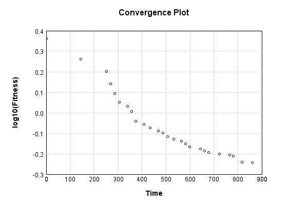
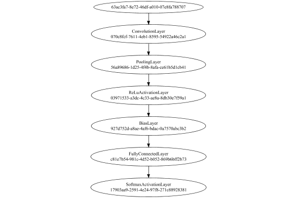
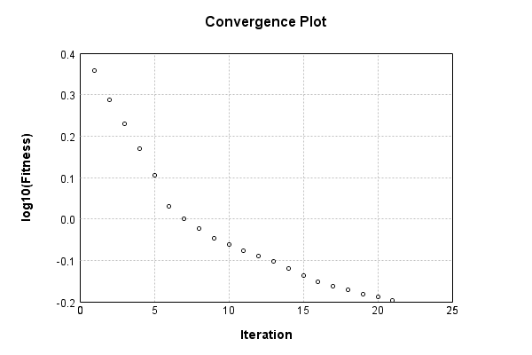
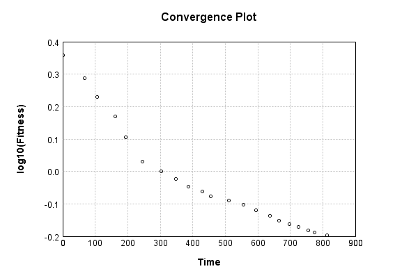
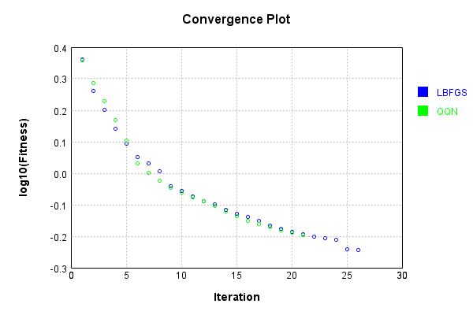
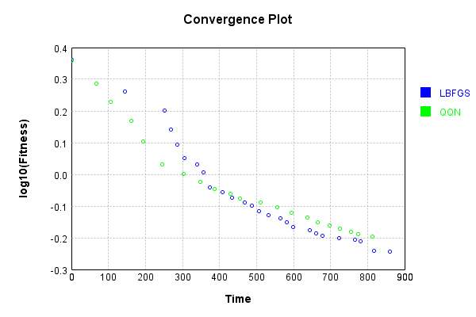

# QQN-LBFGS Comparison
## L-BFGS
The image-to-vector network is a single layer convolutional:

Code from [MnistTests.java:62](../../../../../../../../src/test/java/com/simiacryptus/mindseye/labs/matrix/MnistTests.java#L62) executed in 0.00 seconds: 
```java
    PipelineNetwork network = new PipelineNetwork();
    network.add(new ConvolutionLayer(3, 3, 1, 5).setWeights(i -> 1e-8 * (Math.random() - 0.5)));
    network.add(new PoolingLayer().setMode(PoolingLayer.PoolingMode.Max));
    network.add(new ReLuActivationLayer());
    network.add(new BiasLayer(14, 14, 5));
    network.add(new FullyConnectedLayer(new int[]{14, 14, 5}, new int[]{features})
      .setWeights(() -> 0.001 * (Math.random() - 0.45)));
    network.add(new SoftmaxActivationLayer());
    return network;
```

Returns: 

```
    PipelineNetwork/79d73b81-fbf8-4332-8846-276d23c67c6b
```


### Network Diagram
Code from [ClassifyProblem.java:80](../../../../../../../../src/main/java/com/simiacryptus/mindseye/test/ClassifyProblem.java#L80) executed in 0.20 seconds: 
```java
    return Graphviz.fromGraph(TestUtil.toGraph(network))
      .height(400).width(600).render(Format.PNG).toImage();
```

Returns: 


### Training
Adding performance wrappers

Code from [TestUtil.java:269](../../../../../../../../src/main/java/com/simiacryptus/mindseye/test/TestUtil.java#L269) executed in 0.00 seconds: 
```java
    network.visitNodes(node -> {
      if (!(node.getLayer() instanceof MonitoringWrapperLayer)) {
        node.setLayer(new MonitoringWrapperLayer(node.getLayer()).shouldRecordSignalMetrics(false));
      }
      else {
        ((MonitoringWrapperLayer) node.getLayer()).shouldRecordSignalMetrics(false);
      }
    });
```

Optimized via the Limited-Memory BFGS method:

Code from [TextbookOptimizers.java:89](../../../../../../../../src/test/java/com/simiacryptus/mindseye/labs/matrix/TextbookOptimizers.java#L89) executed in 0.00 seconds: 
```java
    ValidatingTrainer trainer = new ValidatingTrainer(trainingSubject, validationSubject)
      .setMinTrainingSize(Integer.MAX_VALUE)
      .setMonitor(monitor);
    trainer.getRegimen().get(0)
      .setOrientation(new com.simiacryptus.mindseye.opt.orient.LBFGS())
      .setLineSearchFactory(name -> new ArmijoWolfeSearch()
        .setAlpha(name.contains("LBFGS") ? 1.0 : 1e-6));
    return trainer;
```

Returns: 

```
    com.simiacryptus.mindseye.opt.ValidatingTrainer@cd934f7
```


Code from [ClassifyProblem.java:91](../../../../../../../../src/main/java/com/simiacryptus/mindseye/test/ClassifyProblem.java#L91) executed in 920.35 seconds: 
```java
    trainer.setTimeout(timeoutMinutes, TimeUnit.MINUTES).setMaxIterations(10000).run();
```
Logging: 
```
    Epoch parameters: 30000, 1
    Phase 0: TrainingPhase{trainingSubject=PerformanceWrapper{inner=SampledArrayTrainable{inner=ArrayTrainable{inner=com.simiacryptus.mindseye.eval.GpuTrainable@4852843e}}}, orientation=com.simiacryptus.mindseye.opt.orient.LBFGS@1fb16303}
    resetAndMeasure; trainingSize=30000
    LBFGS Accumulation History: 1 points
    Constructing line search parameters: GD
    th(0)=2.3025850930088425;dx=-1.5408781803545153
    New Minimum: 2.3025850930088425 > 2.302584858695545
    END: th(2.1544346900318835E-6)=2.302584858695545; dx=-0.6524913967755098 delta=2.3431329765344344E-7
    Overall network state change: {FullyConnectedLayer=1.0000000000002272, ConvolutionLayer=2.3266928910435842E-4, BiasLayer=0.0}
    Iteration 1 complete. Error: 2.302584858695545 (30000 in 16.508 seconds; 0.001 in orientation, 1.678 in gc, 16.507 in line search; 24.732 eval time)
    Epoch 1 result with 2 iterations, 30000/2147483647 samples: {validation *= 2^-0.00000; training *= 2^-0.000; Overtraining = 1.01}, {itr*=1880.75, len*=0.71} 0 sinc
```
...[skipping 23859 bytes](etc/18.txt)...
```
    000433570862428; dx=999794.4766790408 delta=-0.4258240681628125
    Armijo: th(2.5907645149319743E-6)=0.6661984660727915; dx=526258.8486460585 delta=-0.09158896337317612
    New Minimum: 0.5746095026996154 > 0.5721074032885793
    WOLF (strong): th(8.635881716439915E-7)=0.5721074032885793; dx=108567.69593693488 delta=0.002502099411036074
    New Minimum: 0.5721074032885793 > 0.5704372159964995
    END: th(2.1589704291099787E-7)=0.5704372159964995; dx=-81991.81713784716 delta=0.004172286703115868
    Overall network state change: {FullyConnectedLayer=0.9994718780822431, ConvolutionLayer=0.9999996324136583, BiasLayer=0.9999999520819634}
    Iteration 26 complete. Error: 0.5704372159964995 (30000 in 43.458 seconds; 0.003 in orientation, 4.308 in gc, 43.455 in line search; 43.451 eval time)
    Training timeout
    Epoch 3 result with 6 iterations, 30000/2147483647 samples: {validation *= 2^-0.18597; training *= 2^-0.186; Overtraining = 1.00}, {itr*=1.66, len*=0.71} 0 since improvement; 17.6670 validation time
    Training 3 runPhase halted
    
```

Code from [ClassifyProblem.java:95](../../../../../../../../src/main/java/com/simiacryptus/mindseye/test/ClassifyProblem.java#L95) executed in 0.00 seconds: 
```java
    return TestUtil.plot(history);
```

Returns: 




Code from [ClassifyProblem.java:98](../../../../../../../../src/main/java/com/simiacryptus/mindseye/test/ClassifyProblem.java#L98) executed in 0.00 seconds: 
```java
    return TestUtil.plotTime(history);
```

Returns: 




Per-layer Performance Metrics:

Code from [TestUtil.java:234](../../../../../../../../src/main/java/com/simiacryptus/mindseye/test/TestUtil.java#L234) executed in 0.00 seconds: 
```java
    Map<NNLayer, MonitoringWrapperLayer> metrics = new HashMap<>();
    network.visitNodes(node -> {
      if ((node.getLayer() instanceof MonitoringWrapperLayer)) {
        MonitoringWrapperLayer layer = node.getLayer();
        metrics.put(layer.getInner(), layer);
      }
    });
    System.out.println("Forward Performance: \n\t" + metrics.entrySet().stream().map(e -> {
      PercentileStatistics performance = e.getValue().getForwardPerformance();
      return String.format("%s -> %.6fs +- %.6fs (%s)", e.getKey(), performance.getMean(), performance.getStdDev(), performance.getCount());
    }).reduce((a, b) -> a + "\n\t" + b));
    System.out.println("Backward Performance: \n\t" + metrics.entrySet().stream().map(e -> {
      PercentileStatistics performance = e.getValue().getBackwardPerformance();
      return String.format("%s -> %.6fs +- %.6fs (%s)", e.getKey(), performance.getMean(), performance.getStdDev(), performance.getCount());
    }).reduce((a, b) -> a + "\n\t" + b));
```
Logging: 
```
    Forward Performance: 
    	Optional[EntropyLossLayer/da1b2906-3fda-4991-98db-39f85f88e98d -> 0.004366s +- 0.007120s (636.0)
    	PipelineNetwork/79d73b81-fbf8-4332-8846-276d23c67c6b -> 0.807954s +- 0.138597s (636.0)]
    Backward Performance: 
    	Optional[EntropyLossLayer/da1b2906-3fda-4991-98db-39f85f88e98d -> 0.000000s +- 0.000001s (636.0)
    	PipelineNetwork/79d73b81-fbf8-4332-8846-276d23c67c6b -> 0.000233s +- 0.000067s (636.0)]
    
```

Removing performance wrappers

Code from [TestUtil.java:252](../../../../../../../../src/main/java/com/simiacryptus/mindseye/test/TestUtil.java#L252) executed in 0.00 seconds: 
```java
    network.visitNodes(node -> {
      if (node.getLayer() instanceof MonitoringWrapperLayer) {
        node.setLayer(node.<MonitoringWrapperLayer>getLayer().getInner());
      }
    });
```

Saved model as [classification_model6.json](etc/classification_model6.json)

### Validation
If we run our model against the entire validation dataset, we get this accuracy:

Code from [ClassifyProblem.java:108](../../../../../../../../src/main/java/com/simiacryptus/mindseye/test/ClassifyProblem.java#L108) executed in 31.22 seconds: 
```java
    return data.validationData().mapToDouble(labeledObject ->
      predict(network, labeledObject)[0] == parse(labeledObject.label) ? 1 : 0)
      .average().getAsDouble() * 100;
```

Returns: 

```
    86.25
```


Let's examine some incorrectly predicted results in more detail:

Code from [ClassifyProblem.java:115](../../../../../../../../src/main/java/com/simiacryptus/mindseye/test/ClassifyProblem.java#L115) executed in 0.43 seconds: 
```java
    try {
      TableOutput table = new TableOutput();
      data.validationData().map(labeledObject -> {
        return toRow(log, labeledObject, GpuController.call(ctx -> network.eval(ctx, labeledObject.data)).getData().get(0).getData());
      }).filter(x -> null != x).limit(10).forEach(table::putRow);
      return table;
    } catch (IOException e) {
      throw new RuntimeException(e);
    }
```

Returns: 

Image | Prediction
----- | ----------
![[5]](etc/classification.308.png) | 2 (30.4%), 9 (17.6%), 0 (14.6%)
![[3]](etc/classification.309.png) | 5 (31.3%), 3 (31.1%), 6 (14.4%)
![[6]](etc/classification.310.png) | 4 (44.9%), 6 (34.3%), 2 (7.0%) 
![[4]](etc/classification.311.png) | 0 (47.0%), 6 (26.1%), 4 (8.8%) 
![[2]](etc/classification.312.png) | 3 (43.2%), 2 (26.7%), 8 (9.5%) 
![[1]](etc/classification.313.png) | 3 (43.3%), 5 (22.4%), 8 (6.4%) 
![[6]](etc/classification.314.png) | 2 (61.7%), 6 (16.8%), 8 (6.4%) 
![[5]](etc/classification.315.png) | 8 (26.3%), 5 (20.5%), 0 (11.6%)
![[3]](etc/classification.316.png) | 2 (50.4%), 3 (31.2%), 9 (6.4%) 
![[9]](etc/classification.317.png) | 7 (38.9%), 8 (27.6%), 9 (13.6%)


## QQN
The image-to-vector network is a single layer convolutional:

Code from [MnistTests.java:62](../../../../../../../../src/test/java/com/simiacryptus/mindseye/labs/matrix/MnistTests.java#L62) executed in 0.00 seconds: 
```java
    PipelineNetwork network = new PipelineNetwork();
    network.add(new ConvolutionLayer(3, 3, 1, 5).setWeights(i -> 1e-8 * (Math.random() - 0.5)));
    network.add(new PoolingLayer().setMode(PoolingLayer.PoolingMode.Max));
    network.add(new ReLuActivationLayer());
    network.add(new BiasLayer(14, 14, 5));
    network.add(new FullyConnectedLayer(new int[]{14, 14, 5}, new int[]{features})
      .setWeights(() -> 0.001 * (Math.random() - 0.45)));
    network.add(new SoftmaxActivationLayer());
    return network;
```

Returns: 

```
    PipelineNetwork/9a173f61-da1f-4f48-adca-cf60ebd403d1
```


### Network Diagram
Code from [ClassifyProblem.java:80](../../../../../../../../src/main/java/com/simiacryptus/mindseye/test/ClassifyProblem.java#L80) executed in 0.14 seconds: 
```java
    return Graphviz.fromGraph(TestUtil.toGraph(network))
      .height(400).width(600).render(Format.PNG).toImage();
```

Returns: 




### Training
Adding performance wrappers

Code from [TestUtil.java:269](../../../../../../../../src/main/java/com/simiacryptus/mindseye/test/TestUtil.java#L269) executed in 0.00 seconds: 
```java
    network.visitNodes(node -> {
      if (!(node.getLayer() instanceof MonitoringWrapperLayer)) {
        node.setLayer(new MonitoringWrapperLayer(node.getLayer()).shouldRecordSignalMetrics(false));
      }
      else {
        ((MonitoringWrapperLayer) node.getLayer()).shouldRecordSignalMetrics(false);
      }
    });
```

Optimized via the Quadratic Quasi-Newton method:

Code from [OptimizerComparison.java:46](../../../../../../../../src/test/java/com/simiacryptus/mindseye/labs/matrix/OptimizerComparison.java#L46) executed in 0.00 seconds: 
```java
    ValidatingTrainer trainer = new ValidatingTrainer(trainingSubject, validationSubject)
      .setMonitor(monitor);
    trainer.getRegimen().get(0)
      .setOrientation(new com.simiacryptus.mindseye.opt.orient.QQN())
      .setLineSearchFactory(name -> new QuadraticSearch()
        .setCurrentRate(name.contains("QQN") ? 1.0 : 1e-6)
        .setRelativeTolerance(2e-1));
    return trainer;
```

Returns: 

```
    com.simiacryptus.mindseye.opt.ValidatingTrainer@5d21e217
```


Code from [ClassifyProblem.java:91](../../../../../../../../src/main/java/com/simiacryptus/mindseye/test/ClassifyProblem.java#L91) executed in 936.80 seconds: 
```java
    trainer.setTimeout(timeoutMinutes, TimeUnit.MINUTES).setMaxIterations(10000).run();
```
Logging: 
```
    Epoch parameters: 30000, 1
    Phase 0: TrainingPhase{trainingSubject=PerformanceWrapper{inner=SampledArrayTrainable{inner=ArrayTrainable{inner=com.simiacryptus.mindseye.eval.GpuTrainable@5d9db234}}}, orientation=com.simiacryptus.mindseye.opt.orient.QQN@1526273c}
    resetAndMeasure; trainingSize=30000
    LBFGS Accumulation History: 1 points
    Constructing line search parameters: GD
    F(0.0) = LineSearchPoint{point=PointSample{avg=2.3025850929940455}, derivative=-2.8485104566067436}
    New Minimum: 2.3025850929940455 > 2.3025849609272413
    F(1.0E-6) = LineSearchPoint{point=PointSample{avg=2.3025849609272413}, derivative=-0.7921234857740331}, delta = -1.3206680415933647E-7
    New Minimum: 2.3025849609272413 > 2.302584168802651
    F(7.0E-6) = LineSearchPoint{point=PointSample{avg=2.302584168802651}, derivative=-0.7921206333515487}, delta = -9.241913945245983E-7
    New Minimum: 2.302584168802651 > 2.302578624189149
    F(4.9E-5) = LineSearchPoint{point=PointSample{avg=2.302578624189149}, derivative=-0.7920541223037417}, delta = -6.46
```
...[skipping 33775 bytes](etc/19.txt)...
```
    371357192}, delta = -0.0052142764362832494
    F(3.817882766033949E-6) = LineSearchPoint{point=PointSample{avg=0.6467615862150892}, derivative=43666.619670145774}, delta = -3.0092522621216755E-4
    0.6467615862150892 <= 0.6470625114413013
    New Minimum: 0.6363746875405072 > 0.6363707816163666
    F(1.9280170402775096E-6) = LineSearchPoint{point=PointSample{avg=0.6363707816163666}, derivative=252.86673227693126}, delta = -0.010691729824934715
    Right bracket at 1.9280170402775096E-6
    Converged to right
    Overall network state change: {FullyConnectedLayer=0.9964224982932777, BiasLayer=1.0000001224656319, ConvolutionLayer=0.9999980376843401}
    Iteration 21 complete. Error: 0.6363707816163666 (15617 in 39.765 seconds; 0.003 in orientation, 3.761 in gc, 39.761 in line search; 39.755 eval time)
    Epoch 3 result with 8 iterations, 15617/2147483647 samples: {validation *= 2^-0.24173; training *= 2^-0.249; Overtraining = 1.03}, {itr*=1.46, len*=0.72} 0 since improvement; 17.5885 validation time
    Training timeout
    Training halted
    
```

Code from [ClassifyProblem.java:95](../../../../../../../../src/main/java/com/simiacryptus/mindseye/test/ClassifyProblem.java#L95) executed in 0.01 seconds: 
```java
    return TestUtil.plot(history);
```

Returns: 




Code from [ClassifyProblem.java:98](../../../../../../../../src/main/java/com/simiacryptus/mindseye/test/ClassifyProblem.java#L98) executed in 0.01 seconds: 
```java
    return TestUtil.plotTime(history);
```

Returns: 




Per-layer Performance Metrics:

Code from [TestUtil.java:234](../../../../../../../../src/main/java/com/simiacryptus/mindseye/test/TestUtil.java#L234) executed in 0.00 seconds: 
```java
    Map<NNLayer, MonitoringWrapperLayer> metrics = new HashMap<>();
    network.visitNodes(node -> {
      if ((node.getLayer() instanceof MonitoringWrapperLayer)) {
        MonitoringWrapperLayer layer = node.getLayer();
        metrics.put(layer.getInner(), layer);
      }
    });
    System.out.println("Forward Performance: \n\t" + metrics.entrySet().stream().map(e -> {
      PercentileStatistics performance = e.getValue().getForwardPerformance();
      return String.format("%s -> %.6fs +- %.6fs (%s)", e.getKey(), performance.getMean(), performance.getStdDev(), performance.getCount());
    }).reduce((a, b) -> a + "\n\t" + b));
    System.out.println("Backward Performance: \n\t" + metrics.entrySet().stream().map(e -> {
      PercentileStatistics performance = e.getValue().getBackwardPerformance();
      return String.format("%s -> %.6fs +- %.6fs (%s)", e.getKey(), performance.getMean(), performance.getStdDev(), performance.getCount());
    }).reduce((a, b) -> a + "\n\t" + b));
```
Logging: 
```
    Forward Performance: 
    	Optional[PipelineNetwork/9a173f61-da1f-4f48-adca-cf60ebd403d1 -> 0.634754s +- 0.146913s (834.0)
    	EntropyLossLayer/cc8a5e6b-334d-4827-9229-394c1551e8f1 -> 0.003395s +- 0.004918s (834.0)]
    Backward Performance: 
    	Optional[PipelineNetwork/9a173f61-da1f-4f48-adca-cf60ebd403d1 -> 0.000232s +- 0.000065s (834.0)
    	EntropyLossLayer/cc8a5e6b-334d-4827-9229-394c1551e8f1 -> 0.000001s +- 0.000002s (834.0)]
    
```

Removing performance wrappers

Code from [TestUtil.java:252](../../../../../../../../src/main/java/com/simiacryptus/mindseye/test/TestUtil.java#L252) executed in 0.00 seconds: 
```java
    network.visitNodes(node -> {
      if (node.getLayer() instanceof MonitoringWrapperLayer) {
        node.setLayer(node.<MonitoringWrapperLayer>getLayer().getInner());
      }
    });
```

Saved model as [classification_model7.json](etc/classification_model7.json)

### Validation
If we run our model against the entire validation dataset, we get this accuracy:

Code from [ClassifyProblem.java:108](../../../../../../../../src/main/java/com/simiacryptus/mindseye/test/ClassifyProblem.java#L108) executed in 34.54 seconds: 
```java
    return data.validationData().mapToDouble(labeledObject ->
      predict(network, labeledObject)[0] == parse(labeledObject.label) ? 1 : 0)
      .average().getAsDouble() * 100;
```

Returns: 

```
    85.89
```


Let's examine some incorrectly predicted results in more detail:

Code from [ClassifyProblem.java:115](../../../../../../../../src/main/java/com/simiacryptus/mindseye/test/ClassifyProblem.java#L115) executed in 0.29 seconds: 
```java
    try {
      TableOutput table = new TableOutput();
      data.validationData().map(labeledObject -> {
        return toRow(log, labeledObject, GpuController.call(ctx -> network.eval(ctx, labeledObject.data)).getData().get(0).getData());
      }).filter(x -> null != x).limit(10).forEach(table::putRow);
      return table;
    } catch (IOException e) {
      throw new RuntimeException(e);
    }
```

Returns: 

Image | Prediction
----- | ----------
![[5]](etc/classification.321.png) | 2 (22.3%), 5 (21.7%), 4 (17.9%)
![[3]](etc/classification.322.png) | 6 (28.3%), 3 (26.0%), 5 (20.3%)
![[6]](etc/classification.323.png) | 4 (40.1%), 6 (27.1%), 2 (8.4%) 
![[4]](etc/classification.324.png) | 0 (42.6%), 6 (33.0%), 4 (8.5%) 
![[1]](etc/classification.325.png) | 3 (32.1%), 5 (17.5%), 1 (12.3%)
![[6]](etc/classification.326.png) | 2 (39.2%), 6 (30.2%), 4 (12.0%)
![[3]](etc/classification.327.png) | 2 (48.2%), 3 (20.2%), 9 (7.9%) 
![[4]](etc/classification.328.png) | 9 (33.7%), 4 (18.9%), 5 (11.9%)
![[6]](etc/classification.329.png) | 2 (25.2%), 7 (17.4%), 6 (14.4%)
![[9]](etc/classification.330.png) | 8 (25.4%), 7 (21.4%), 1 (17.9%)


## Comparison
Code from [OptimizerComparison.java:158](../../../../../../../../src/test/java/com/simiacryptus/mindseye/labs/matrix/OptimizerComparison.java#L158) executed in 0.01 seconds: 
```java
    return TestUtil.compare(lbfgs, qqn);
```

Returns: 




Code from [OptimizerComparison.java:161](../../../../../../../../src/test/java/com/simiacryptus/mindseye/labs/matrix/OptimizerComparison.java#L161) executed in 0.01 seconds: 
```java
    return TestUtil.compareTime(lbfgs, qqn);
```

Returns: 




