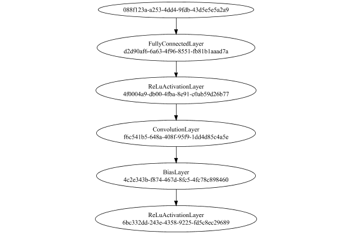
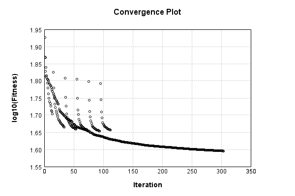
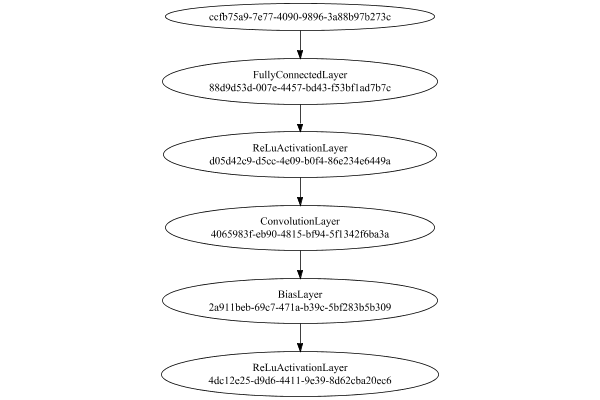
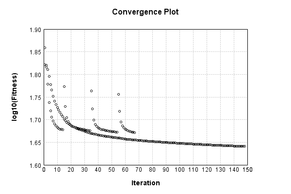
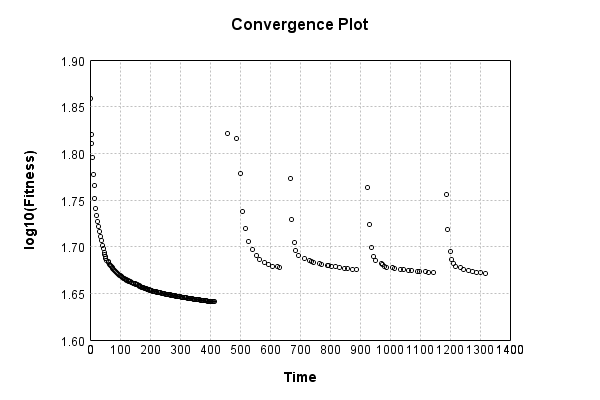
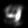
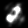
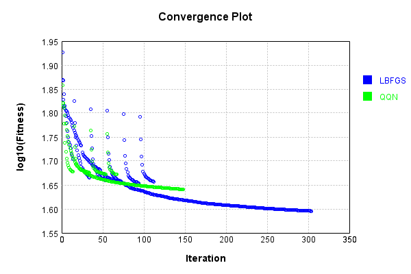
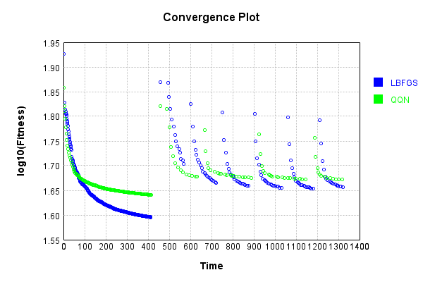

# QQN-LBFGS Comparison
## L-BFGS
The vector-to-image network uses a fully connected layer then a single convolutional layer:

Code from [MnistTests.java:92](../../../../../../../../src/test/java/com/simiacryptus/mindseye/labs/matrix/MnistTests.java#L92) executed in 0.01 seconds: 
```java
    PipelineNetwork network = new PipelineNetwork();
    network.add(new FullyConnectedLayer(new int[]{features}, new int[]{28, 28, 5})
      .setWeights(() -> 0.25 * (Math.random() - 0.5)));
    network.add(new ReLuActivationLayer());
    network.add(new ConvolutionLayer(3, 3, 5, 1)
      .setWeights(i -> 1e-8 * (Math.random() - 0.5)));
    network.add(new BiasLayer(28, 28, 1));
    network.add(new ReLuActivationLayer());
    return network;
```

Returns: 

```
    PipelineNetwork/40432c94-d285-46e5-bcb4-1bac017968a7
```


### Network Diagram
Code from [EncodingProblem.java:91](../../../../../../../../src/main/java/com/simiacryptus/mindseye/test/EncodingProblem.java#L91) executed in 0.20 seconds: 
```java
    return Graphviz.fromGraph(TestUtil.toGraph(imageNetwork))
      .height(400).width(600).render(Format.PNG).toImage();
```

Returns: 




### Training
We start by training with a very small population to improve initial convergence performance:

Adding performance wrappers

Code from [TestUtil.java:269](../../../../../../../../src/main/java/com/simiacryptus/mindseye/test/TestUtil.java#L269) executed in 0.00 seconds: 
```java
    network.visitNodes(node -> {
      if (!(node.getLayer() instanceof MonitoringWrapperLayer)) {
        node.setLayer(new MonitoringWrapperLayer(node.getLayer()).shouldRecordSignalMetrics(false));
      }
      else {
        ((MonitoringWrapperLayer) node.getLayer()).shouldRecordSignalMetrics(false);
      }
    });
```

Optimized via the Limited-Memory BFGS method:

Code from [TextbookOptimizers.java:89](../../../../../../../../src/test/java/com/simiacryptus/mindseye/labs/matrix/TextbookOptimizers.java#L89) executed in 0.00 seconds: 
```java
    ValidatingTrainer trainer = new ValidatingTrainer(trainingSubject, validationSubject)
      .setMinTrainingSize(Integer.MAX_VALUE)
      .setMonitor(monitor);
    trainer.getRegimen().get(0)
      .setOrientation(new com.simiacryptus.mindseye.opt.orient.LBFGS())
      .setLineSearchFactory(name -> new ArmijoWolfeSearch()
        .setAlpha(name.contains("LBFGS") ? 1.0 : 1e-6));
    return trainer;
```

Returns: 

```
    com.simiacryptus.mindseye.opt.ValidatingTrainer@7c562b3
```


Code from [EncodingProblem.java:113](../../../../../../../../src/main/java/com/simiacryptus/mindseye/test/EncodingProblem.java#L113) executed in 420.88 seconds: 
```java
    preTrainer.setTimeout(timeoutMinutes / 2, TimeUnit.MINUTES).setMaxIterations(batchSize).run();
```
Logging: 
```
    Epoch parameters: 5000, 1
    Phase 0: TrainingPhase{trainingSubject=PerformanceWrapper{inner=SampledArrayTrainable{inner=ArrayTrainable{inner=com.simiacryptus.mindseye.eval.GpuTrainable@4224fd2a}}}, orientation=com.simiacryptus.mindseye.opt.orient.LBFGS@5f92615c}
    resetAndMeasure; trainingSize=5000
    LBFGS Accumulation History: 1 points
    Constructing line search parameters: GD
    th(0)=85.46826951004729;dx=-0.0017707986257153477
    New Minimum: 85.46826951004729 > 85.46826950797045
    WOLFE (weak): th(2.1544346900318835E-6)=85.46826950797045; dx=-0.0016766714015752225 delta=2.076845362353197E-9
    New Minimum: 85.46826950797045 > 85.46826950589362
    WOLFE (weak): th(4.308869380063767E-6)=85.46826950589362; dx=-0.0016311677412477212 delta=4.1536765138516785E-9
    New Minimum: 85.46826950589362 > 85.46826949758626
    WOLFE (weak): th(1.2926608140191301E-5)=85.46826949758626; dx=-0.001712590120890507 delta=1.2461029541555035E-8
    New Minimum: 85.46826949758626 > 85.46826946020319
    WOLFE (weak): th(5.1706432560765204E-5)=85.46826
```
...[skipping 268140 bytes](etc/20.txt)...
```
    c, 0.797 in line search; 0.780 eval time)
    Orientation vanished. Popping history element from 39.432378773260496, 39.43222966266418, 39.42238257397973, 39.41906019279147
    LBFGS Accumulation History: 3 points
    th(0)=39.41906019279147;dx=-0.01555361138955566
    New Minimum: 39.41906019279147 > 39.413326154609976
    END: th(0.8281332693275404)=39.413326154609976; dx=-0.012824998852762663 delta=0.005734038181493872
    Overall network state change: {FullyConnectedLayer=0.9995861893751946, ConvolutionLayer=0.9994759872046873, BiasLayer=1.0000583389174091, PlaceholderLayer=9.9979e-01 +- 2.4612e-04 [9.9816e-01 - 1.0009e+00] (1000#)}
    Iteration 304 complete. Error: 39.413326154609976 (5000 in 0.834 seconds; 0.036 in orientation, 0.097 in gc, 0.796 in line search; 0.779 eval time)
    Training timeout
    Epoch 18 result with 4 iterations, 5000/2147483647 samples: {validation *= 2^-0.00070; training *= 2^-0.001; Overtraining = 1.00}, {itr*=27.17, len*=0.71} 0 since improvement; 0.3142 validation time
    Training 18 runPhase halted
    
```

Per-layer Performance Metrics:

Code from [TestUtil.java:234](../../../../../../../../src/main/java/com/simiacryptus/mindseye/test/TestUtil.java#L234) executed in 0.00 seconds: 
```java
    Map<NNLayer, MonitoringWrapperLayer> metrics = new HashMap<>();
    network.visitNodes(node -> {
      if ((node.getLayer() instanceof MonitoringWrapperLayer)) {
        MonitoringWrapperLayer layer = node.getLayer();
        metrics.put(layer.getInner(), layer);
      }
    });
    System.out.println("Forward Performance: \n\t" + metrics.entrySet().stream().map(e -> {
      PercentileStatistics performance = e.getValue().getForwardPerformance();
      return String.format("%s -> %.6fs +- %.6fs (%s)", e.getKey(), performance.getMean(), performance.getStdDev(), performance.getCount());
    }).reduce((a, b) -> a + "\n\t" + b));
    System.out.println("Backward Performance: \n\t" + metrics.entrySet().stream().map(e -> {
      PercentileStatistics performance = e.getValue().getBackwardPerformance();
      return String.format("%s -> %.6fs +- %.6fs (%s)", e.getKey(), performance.getMean(), performance.getStdDev(), performance.getCount());
    }).reduce((a, b) -> a + "\n\t" + b));
```
Logging: 
```
    Forward Performance: 
    	Optional[PipelineNetwork/40432c94-d285-46e5-bcb4-1bac017968a7 -> 0.099472s +- 0.031675s (1908.0)
    	MeanSqLossLayer/50bec588-c6f4-4764-afee-348bdfab18cc -> 0.004650s +- 0.010099s (1908.0)
    	SoftmaxActivationLayer/3dd6458f-c05c-4bd5-9739-582b55c1a215 -> 0.001407s +- 0.003051s (1908.0)
    	SumInputsLayer/2ae54a44-4faa-4d10-a0e1-449e5293ae5d -> 0.000526s +- 0.003071s (1908.0)
    	EntropyLossLayer/722ca850-92da-4694-bf94-b0312d1fb015 -> 0.000680s +- 0.002103s (1908.0)
    	LinearActivationLayer/ce613add-64d9-4d03-aeb5-3be493b40afe -> 0.000344s +- 0.000264s (1908.0)
    	NthPowerActivationLayer/6bd33614-d0f3-48f9-9462-5c62088f4abc -> 0.000901s +- 0.004525s (1908.0)]
    Backward Performance: 
    	Optional[PipelineNetwork/40432c94-d285-46e5-bcb4-1bac017968a7 -> 0.000357s +- 0.000098s (1908.0)
    	MeanSqLossLayer/50bec588-c6f4-4764-afee-348bdfab18cc -> 0.000008s +- 0.000022s (1908.0)
    	SoftmaxActivationLayer/3dd6458f-c05c-4bd5-9739-582b55c1a215 -> 0.000001s +- 0.000006s (1870.0)
    	SumInputsLayer/2ae54a44-4faa-4d10-a0e1-449e5293ae5d -> 0.000000s +- 0.000004s (1908.0)
    	EntropyLossLayer/722ca850-92da-4694-bf94-b0312d1fb015 -> 0.000002s +- 0.000010s (1870.0)
    	LinearActivationLayer/ce613add-64d9-4d03-aeb5-3be493b40afe -> 0.000001s +- 0.000008s (1870.0)
    	NthPowerActivationLayer/6bd33614-d0f3-48f9-9462-5c62088f4abc -> 0.000002s +- 0.000016s (1908.0)]
    
```

Removing performance wrappers

Code from [TestUtil.java:252](../../../../../../../../src/main/java/com/simiacryptus/mindseye/test/TestUtil.java#L252) executed in 0.00 seconds: 
```java
    network.visitNodes(node -> {
      if (node.getLayer() instanceof MonitoringWrapperLayer) {
        node.setLayer(node.<MonitoringWrapperLayer>getLayer().getInner());
      }
    });
```

Then our main training phase:

Adding performance wrappers

Code from [TestUtil.java:269](../../../../../../../../src/main/java/com/simiacryptus/mindseye/test/TestUtil.java#L269) executed in 0.00 seconds: 
```java
    network.visitNodes(node -> {
      if (!(node.getLayer() instanceof MonitoringWrapperLayer)) {
        node.setLayer(new MonitoringWrapperLayer(node.getLayer()).shouldRecordSignalMetrics(false));
      }
      else {
        ((MonitoringWrapperLayer) node.getLayer()).shouldRecordSignalMetrics(false);
      }
    });
```

Optimized via the Limited-Memory BFGS method:

Code from [TextbookOptimizers.java:89](../../../../../../../../src/test/java/com/simiacryptus/mindseye/labs/matrix/TextbookOptimizers.java#L89) executed in 0.00 seconds: 
```java
    ValidatingTrainer trainer = new ValidatingTrainer(trainingSubject, validationSubject)
      .setMinTrainingSize(Integer.MAX_VALUE)
      .setMonitor(monitor);
    trainer.getRegimen().get(0)
      .setOrientation(new com.simiacryptus.mindseye.opt.orient.LBFGS())
      .setLineSearchFactory(name -> new ArmijoWolfeSearch()
        .setAlpha(name.contains("LBFGS") ? 1.0 : 1e-6));
    return trainer;
```

Returns: 

```
    com.simiacryptus.mindseye.opt.ValidatingTrainer@3e6edaa9
```


Code from [EncodingProblem.java:123](../../../../../../../../src/main/java/com/simiacryptus/mindseye/test/EncodingProblem.java#L123) executed in 929.16 seconds: 
```java
    mainTrainer.setTimeout(timeoutMinutes, TimeUnit.MINUTES).setMaxIterations(batchSize).run();
```
Logging: 
```
    Epoch parameters: 5000, 1
    Phase 0: TrainingPhase{trainingSubject=PerformanceWrapper{inner=SampledArrayTrainable{inner=ArrayTrainable{inner=com.simiacryptus.mindseye.eval.GpuTrainable@909ace}}}, orientation=com.simiacryptus.mindseye.opt.orient.LBFGS@3f7b1c3a}
    resetAndMeasure; trainingSize=5000
    LBFGS Accumulation History: 1 points
    Constructing line search parameters: GD
    th(0)=81.5022087756603;dx=-2.5212009691268005
    New Minimum: 81.5022087756603 > 81.50220605953879
    WOLFE (weak): th(2.1544346900318835E-6)=81.50220605953879; dx=-2.5212393040995384 delta=2.716121514367842E-6
    New Minimum: 81.50220605953879 > 81.50220334341294
    WOLFE (weak): th(4.308869380063767E-6)=81.50220334341294; dx=-2.5212188139075633 delta=5.432247363046372E-6
    New Minimum: 81.50220334341294 > 81.50219247890276
    WOLFE (weak): th(1.2926608140191301E-5)=81.50219247890276; dx=-2.5213028125869843 delta=1.6296757550549046E-5
    New Minimum: 81.50219247890276 > 81.50214358814577
    WOLFE (weak): th(5.1706432560765204E-5)=81.50214358814577; dx=-2
```
...[skipping 100278 bytes](etc/21.txt)...
```
    ts
    th(0)=45.423400728631194;dx=-0.07721957873577782
    Armijo: th(6.700663223466281)=45.42610530221778; dx=0.0560411315495653 delta=-0.002704573586584047
    New Minimum: 45.423400728631194 > 45.36789532474447
    WOLF (strong): th(3.3503316117331403)=45.36789532474447; dx=0.007486626369648507 delta=0.05550540388672687
    END: th(1.1167772039110468)=45.38856778583572; dx=-0.04727445679187847 delta=0.03483294279547522
    Overall network state change: {FullyConnectedLayer=0.9986804586662845, ConvolutionLayer=0.9984684134666433, BiasLayer=1.0001286498011352, PlaceholderLayer=9.8885e-01 +- 1.3764e-02 [8.1957e-01 - 1.2250e+00] (5000#)}
    Iteration 112 complete. Error: 45.36789532474447 (5000 in 8.384 seconds; 0.173 in orientation, 1.394 in gc, 8.202 in line search; 7.949 eval time)
    Training timeout
    Epoch 7 result with 19 iterations, 5000/2147483647 samples: {validation *= 2^-0.03923; training *= 2^-0.614; Overtraining = 15.66}, {itr*=3.62, len*=2.80} 0 since improvement; 22.3045 validation time
    Training 7 runPhase halted
    
```

Per-layer Performance Metrics:

Code from [TestUtil.java:234](../../../../../../../../src/main/java/com/simiacryptus/mindseye/test/TestUtil.java#L234) executed in 0.00 seconds: 
```java
    Map<NNLayer, MonitoringWrapperLayer> metrics = new HashMap<>();
    network.visitNodes(node -> {
      if ((node.getLayer() instanceof MonitoringWrapperLayer)) {
        MonitoringWrapperLayer layer = node.getLayer();
        metrics.put(layer.getInner(), layer);
      }
    });
    System.out.println("Forward Performance: \n\t" + metrics.entrySet().stream().map(e -> {
      PercentileStatistics performance = e.getValue().getForwardPerformance();
      return String.format("%s -> %.6fs +- %.6fs (%s)", e.getKey(), performance.getMean(), performance.getStdDev(), performance.getCount());
    }).reduce((a, b) -> a + "\n\t" + b));
    System.out.println("Backward Performance: \n\t" + metrics.entrySet().stream().map(e -> {
      PercentileStatistics performance = e.getValue().getBackwardPerformance();
      return String.format("%s -> %.6fs +- %.6fs (%s)", e.getKey(), performance.getMean(), performance.getStdDev(), performance.getCount());
    }).reduce((a, b) -> a + "\n\t" + b));
```
Logging: 
```
    Forward Performance: 
    	Optional[PipelineNetwork/40432c94-d285-46e5-bcb4-1bac017968a7 -> 0.564862s +- 0.219016s (800.0)
    	MeanSqLossLayer/50bec588-c6f4-4764-afee-348bdfab18cc -> 0.026003s +- 0.050504s (800.0)
    	SoftmaxActivationLayer/3dd6458f-c05c-4bd5-9739-582b55c1a215 -> 0.009177s +- 0.009284s (800.0)
    	SumInputsLayer/2ae54a44-4faa-4d10-a0e1-449e5293ae5d -> 0.002191s +- 0.007710s (800.0)
    	EntropyLossLayer/722ca850-92da-4694-bf94-b0312d1fb015 -> 0.005103s +- 0.007531s (800.0)
    	LinearActivationLayer/ce613add-64d9-4d03-aeb5-3be493b40afe -> 0.001481s +- 0.001108s (800.0)
    	NthPowerActivationLayer/6bd33614-d0f3-48f9-9462-5c62088f4abc -> 0.003614s +- 0.009770s (800.0)]
    Backward Performance: 
    	Optional[PipelineNetwork/40432c94-d285-46e5-bcb4-1bac017968a7 -> 0.000346s +- 0.000054s (800.0)
    	MeanSqLossLayer/50bec588-c6f4-4764-afee-348bdfab18cc -> 0.000006s +- 0.000011s (800.0)
    	SoftmaxActivationLayer/3dd6458f-c05c-4bd5-9739-582b55c1a215 -> 0.000001s +- 0.000004s (704.0)
    	SumInputsLayer/2ae54a44-4faa-4d10-a0e1-449e5293ae5d -> 0.000000s +- 0.000000s (800.0)
    	EntropyLossLayer/722ca850-92da-4694-bf94-b0312d1fb015 -> 0.000003s +- 0.000008s (704.0)
    	LinearActivationLayer/ce613add-64d9-4d03-aeb5-3be493b40afe -> 0.000001s +- 0.000002s (704.0)
    	NthPowerActivationLayer/6bd33614-d0f3-48f9-9462-5c62088f4abc -> 0.000001s +- 0.000003s (800.0)]
    
```

Removing performance wrappers

Code from [TestUtil.java:252](../../../../../../../../src/main/java/com/simiacryptus/mindseye/test/TestUtil.java#L252) executed in 0.00 seconds: 
```java
    network.visitNodes(node -> {
      if (node.getLayer() instanceof MonitoringWrapperLayer) {
        node.setLayer(node.<MonitoringWrapperLayer>getLayer().getInner());
      }
    });
```

Code from [EncodingProblem.java:129](../../../../../../../../src/main/java/com/simiacryptus/mindseye/test/EncodingProblem.java#L129) executed in 0.00 seconds: 
```java
    return TestUtil.plot(history);
```

Returns: 




Code from [EncodingProblem.java:132](../../../../../../../../src/main/java/com/simiacryptus/mindseye/test/EncodingProblem.java#L132) executed in 0.01 seconds: 
```java
    return TestUtil.plotTime(history);
```

Returns: 


Saved model as [encoding_model6.json](etc/encoding_model6.json)

### Results
Code from [EncodingProblem.java:142](../../../../../../../../src/main/java/com/simiacryptus/mindseye/test/EncodingProblem.java#L142) executed in 0.44 seconds: 
```java
    TableOutput table = new TableOutput();
    Arrays.stream(trainingData).map(tensorArray -> {
      try {
        Tensor predictionSignal = GpuController.call(ctx -> testNetwork.eval(ctx, tensorArray)).getData().get(0);
        LinkedHashMap<String, Object> row = new LinkedHashMap<String, Object>();
        row.put("Source", log.image(tensorArray[1].toImage(), ""));
        row.put("Echo", log.image(predictionSignal.toImage(), ""));
        return row;
      } catch (IOException e) {
        throw new RuntimeException(e);
      }
    }).filter(x -> null != x).limit(10).forEach(table::putRow);
    return table;
```

Returns: 

Source | Echo
------ | ----
 | 
 | 
 | 
 | 
 | 
 | 
 | 
 | 
 | 
 | 


Learned Model Statistics:

Code from [EncodingProblem.java:159](../../../../../../../../src/main/java/com/simiacryptus/mindseye/test/EncodingProblem.java#L159) executed in 0.00 seconds: 
```java
    ScalarStatistics scalarStatistics = new ScalarStatistics();
    trainingNetwork.state().stream().flatMapToDouble(x -> Arrays.stream(x))
      .forEach(v -> scalarStatistics.add(v));
    return scalarStatistics.getMetrics();
```

Returns: 

```
    {meanExponent=-1.9206258590052403, negative=16193, min=-2.928209218934057, max=26.33112675434129, mean=0.1297293240862413, count=40033.0, positive=23839, stdDev=0.7662393560736604, zeros=1}
```


Learned Representation Statistics:

Code from [EncodingProblem.java:167](../../../../../../../../src/main/java/com/simiacryptus/mindseye/test/EncodingProblem.java#L167) executed in 0.03 seconds: 
```java
    ScalarStatistics scalarStatistics = new ScalarStatistics();
    Arrays.stream(trainingData)
      .flatMapToDouble(row -> Arrays.stream(row[0].getData()))
      .forEach(v -> scalarStatistics.add(v));
    return scalarStatistics.getMetrics();
```

Returns: 

```
    {meanExponent=-1.4213762240196088, negative=299645, min=-4.501449322976317, max=4.491832929291946, mean=-0.0041437535064993425, count=600000.0, positive=300355, stdDev=0.1849419744544439, zeros=0}
```


Some rendered unit vectors:


## QQN
The vector-to-image network uses a fully connected layer then a single convolutional layer:

Code from [MnistTests.java:92](../../../../../../../../src/test/java/com/simiacryptus/mindseye/labs/matrix/MnistTests.java#L92) executed in 0.01 seconds: 
```java
    PipelineNetwork network = new PipelineNetwork();
    network.add(new FullyConnectedLayer(new int[]{features}, new int[]{28, 28, 5})
      .setWeights(() -> 0.25 * (Math.random() - 0.5)));
    network.add(new ReLuActivationLayer());
    network.add(new ConvolutionLayer(3, 3, 5, 1)
      .setWeights(i -> 1e-8 * (Math.random() - 0.5)));
    network.add(new BiasLayer(28, 28, 1));
    network.add(new ReLuActivationLayer());
    return network;
```

Returns: 

```
    PipelineNetwork/15ad5d6d-4936-404e-b061-9184d3f3c612
```


### Network Diagram
Code from [EncodingProblem.java:91](../../../../../../../../src/main/java/com/simiacryptus/mindseye/test/EncodingProblem.java#L91) executed in 0.16 seconds: 
```java
    return Graphviz.fromGraph(TestUtil.toGraph(imageNetwork))
      .height(400).width(600).render(Format.PNG).toImage();
```

Returns: 




### Training
We start by training with a very small population to improve initial convergence performance:

Adding performance wrappers

Code from [TestUtil.java:269](../../../../../../../../src/main/java/com/simiacryptus/mindseye/test/TestUtil.java#L269) executed in 0.00 seconds: 
```java
    network.visitNodes(node -> {
      if (!(node.getLayer() instanceof MonitoringWrapperLayer)) {
        node.setLayer(new MonitoringWrapperLayer(node.getLayer()).shouldRecordSignalMetrics(false));
      }
      else {
        ((MonitoringWrapperLayer) node.getLayer()).shouldRecordSignalMetrics(false);
      }
    });
```

Optimized via the Quadratic Quasi-Newton method:

Code from [OptimizerComparison.java:46](../../../../../../../../src/test/java/com/simiacryptus/mindseye/labs/matrix/OptimizerComparison.java#L46) executed in 0.00 seconds: 
```java
    ValidatingTrainer trainer = new ValidatingTrainer(trainingSubject, validationSubject)
      .setMonitor(monitor);
    trainer.getRegimen().get(0)
      .setOrientation(new com.simiacryptus.mindseye.opt.orient.QQN())
      .setLineSearchFactory(name -> new QuadraticSearch()
        .setCurrentRate(name.contains("QQN") ? 1.0 : 1e-6)
        .setRelativeTolerance(2e-1));
    return trainer;
```

Returns: 

```
    com.simiacryptus.mindseye.opt.ValidatingTrainer@1e0ccc1a
```


Code from [EncodingProblem.java:113](../../../../../../../../src/main/java/com/simiacryptus/mindseye/test/EncodingProblem.java#L113) executed in 421.13 seconds: 
```java
    preTrainer.setTimeout(timeoutMinutes / 2, TimeUnit.MINUTES).setMaxIterations(batchSize).run();
```
Logging: 
```
    Epoch parameters: 5000, 1
    Phase 0: TrainingPhase{trainingSubject=PerformanceWrapper{inner=SampledArrayTrainable{inner=ArrayTrainable{inner=com.simiacryptus.mindseye.eval.GpuTrainable@33fff848}}}, orientation=com.simiacryptus.mindseye.opt.orient.QQN@2f2dc11d}
    resetAndMeasure; trainingSize=5000
    LBFGS Accumulation History: 1 points
    Constructing line search parameters: GD
    F(0.0) = LineSearchPoint{point=PointSample{avg=85.46826875776733}, derivative=-0.0018986900287304973}
    New Minimum: 85.46826875776733 > 85.46826875673949
    F(1.0E-6) = LineSearchPoint{point=PointSample{avg=85.46826875673949}, derivative=-0.0019613160356200007}, delta = -1.0278426998411305E-9
    New Minimum: 85.46826875673949 > 85.46826875057252
    F(7.0E-6) = LineSearchPoint{point=PointSample{avg=85.46826875057252}, derivative=-0.0018396723946551622}, delta = -7.1948136337596225E-9
    New Minimum: 85.46826875057252 > 85.46826870740361
    F(4.9E-5) = LineSearchPoint{point=PointSample{avg=85.46826870740361}, derivative=-0.0019217425020014597}, delta =
```
...[skipping 242139 bytes](etc/22.txt)...
```
    eSearchPoint{point=PointSample{avg=43.73408156540812}, derivative=0.028939901458996616}, delta = -0.01074924860445492
    43.73408156540812 <= 43.74483081401257
    New Minimum: 43.73408156540812 > 43.73279915423466
    F(0.5392930944925063) = LineSearchPoint{point=PointSample{avg=43.73279915423466}, derivative=0.002474283397218217}, delta = -0.012031659777910875
    Right bracket at 0.5392930944925063
    Converged to right
    Overall network state change: {FullyConnectedLayer=0.9990860777026372, BiasLayer=1.0000129076228534, ConvolutionLayer=0.9999667535368797, PlaceholderLayer=9.9886e-01 +- 3.4239e-03 [9.0109e-01 - 1.0048e+00] (1000#)}
    Iteration 148 complete. Error: 43.73279915423466 (154 in 1.721 seconds; 0.072 in orientation, 0.176 in gc, 1.646 in line search; 1.612 eval time)
    Training timeout
    Epoch 11 result with 17 iterations, 154/2147483647 samples: {validation *= 2^-0.00657; training *= 2^-0.007; Overtraining = 1.00}, {itr*=8.85, len*=0.71} 0 since improvement; 0.4023 validation time
    Training 11 runPhase halted
    
```

Per-layer Performance Metrics:

Code from [TestUtil.java:234](../../../../../../../../src/main/java/com/simiacryptus/mindseye/test/TestUtil.java#L234) executed in 0.00 seconds: 
```java
    Map<NNLayer, MonitoringWrapperLayer> metrics = new HashMap<>();
    network.visitNodes(node -> {
      if ((node.getLayer() instanceof MonitoringWrapperLayer)) {
        MonitoringWrapperLayer layer = node.getLayer();
        metrics.put(layer.getInner(), layer);
      }
    });
    System.out.println("Forward Performance: \n\t" + metrics.entrySet().stream().map(e -> {
      PercentileStatistics performance = e.getValue().getForwardPerformance();
      return String.format("%s -> %.6fs +- %.6fs (%s)", e.getKey(), performance.getMean(), performance.getStdDev(), performance.getCount());
    }).reduce((a, b) -> a + "\n\t" + b));
    System.out.println("Backward Performance: \n\t" + metrics.entrySet().stream().map(e -> {
      PercentileStatistics performance = e.getValue().getBackwardPerformance();
      return String.format("%s -> %.6fs +- %.6fs (%s)", e.getKey(), performance.getMean(), performance.getStdDev(), performance.getCount());
    }).reduce((a, b) -> a + "\n\t" + b));
```
Logging: 
```
    Forward Performance: 
    	Optional[NthPowerActivationLayer/23393245-59cd-4836-87db-0fad6c13d732 -> 0.000799s +- 0.002841s (1930.0)
    	SumInputsLayer/a5a222db-b169-4e2d-9517-b84df4916995 -> 0.000606s +- 0.003609s (1930.0)
    	SoftmaxActivationLayer/4b8e554c-ad9c-481d-8d26-d2200ac5d816 -> 0.001351s +- 0.002734s (1930.0)
    	MeanSqLossLayer/57e272f4-17d5-432e-bc9a-1a84b701db7a -> 0.005445s +- 0.013449s (1930.0)
    	PipelineNetwork/15ad5d6d-4936-404e-b061-9184d3f3c612 -> 0.098228s +- 0.030274s (1930.0)
    	EntropyLossLayer/2dfe4f63-0d30-4778-84b4-ade220cadbd4 -> 0.000753s +- 0.003620s (1930.0)
    	LinearActivationLayer/906c5840-7ac4-4003-96c4-9b56a0dcd96b -> 0.000531s +- 0.004499s (1930.0)]
    Backward Performance: 
    	Optional[NthPowerActivationLayer/23393245-59cd-4836-87db-0fad6c13d732 -> 0.000002s +- 0.000012s (1930.0)
    	SumInputsLayer/a5a222db-b169-4e2d-9517-b84df4916995 -> 0.000000s +- 0.000000s (1930.0)
    	SoftmaxActivationLayer/4b8e554c-ad9c-481d-8d26-d2200ac5d816 -> 0.000001s +- 0.000008s (1906.0)
    	MeanSqLossLayer/57e272f4-17d5-432e-bc9a-1a84b701db7a -> 0.000008s +- 0.000022s (1930.0)
    	PipelineNetwork/15ad5d6d-4936-404e-b061-9184d3f3c612 -> 0.000354s +- 0.000095s (1930.0)
    	EntropyLossLayer/2dfe4f63-0d30-4778-84b4-ade220cadbd4 -> 0.000003s +- 0.000013s (1906.0)
    	LinearActivationLayer/906c5840-7ac4-4003-96c4-9b56a0dcd96b -> 0.000001s +- 0.000007s (1906.0)]
    
```

Removing performance wrappers

Code from [TestUtil.java:252](../../../../../../../../src/main/java/com/simiacryptus/mindseye/test/TestUtil.java#L252) executed in 0.00 seconds: 
```java
    network.visitNodes(node -> {
      if (node.getLayer() instanceof MonitoringWrapperLayer) {
        node.setLayer(node.<MonitoringWrapperLayer>getLayer().getInner());
      }
    });
```

Then our main training phase:

Adding performance wrappers

Code from [TestUtil.java:269](../../../../../../../../src/main/java/com/simiacryptus/mindseye/test/TestUtil.java#L269) executed in 0.00 seconds: 
```java
    network.visitNodes(node -> {
      if (!(node.getLayer() instanceof MonitoringWrapperLayer)) {
        node.setLayer(new MonitoringWrapperLayer(node.getLayer()).shouldRecordSignalMetrics(false));
      }
      else {
        ((MonitoringWrapperLayer) node.getLayer()).shouldRecordSignalMetrics(false);
      }
    });
```

Optimized via the Quadratic Quasi-Newton method:

Code from [OptimizerComparison.java:46](../../../../../../../../src/test/java/com/simiacryptus/mindseye/labs/matrix/OptimizerComparison.java#L46) executed in 0.00 seconds: 
```java
    ValidatingTrainer trainer = new ValidatingTrainer(trainingSubject, validationSubject)
      .setMonitor(monitor);
    trainer.getRegimen().get(0)
      .setOrientation(new com.simiacryptus.mindseye.opt.orient.QQN())
      .setLineSearchFactory(name -> new QuadraticSearch()
        .setCurrentRate(name.contains("QQN") ? 1.0 : 1e-6)
        .setRelativeTolerance(2e-1));
    return trainer;
```

Returns: 

```
    com.simiacryptus.mindseye.opt.ValidatingTrainer@4391bcef
```


Code from [EncodingProblem.java:123](../../../../../../../../src/main/java/com/simiacryptus/mindseye/test/EncodingProblem.java#L123) executed in 924.84 seconds: 
```java
    mainTrainer.setTimeout(timeoutMinutes, TimeUnit.MINUTES).setMaxIterations(batchSize).run();
```
Logging: 
```
    Epoch parameters: 5000, 1
    Phase 0: TrainingPhase{trainingSubject=PerformanceWrapper{inner=SampledArrayTrainable{inner=ArrayTrainable{inner=com.simiacryptus.mindseye.eval.GpuTrainable@5269eb33}}}, orientation=com.simiacryptus.mindseye.opt.orient.QQN@72d1be1f}
    resetAndMeasure; trainingSize=5000
    LBFGS Accumulation History: 1 points
    Constructing line search parameters: GD
    F(0.0) = LineSearchPoint{point=PointSample{avg=72.65617130850802}, derivative=-3.9521485293588463}
    New Minimum: 72.65617130850802 > 72.6561693323977
    F(1.0E-6) = LineSearchPoint{point=PointSample{avg=72.6561693323977}, derivative=-3.9521328865189944}, delta = -1.9761103260407253E-6
    New Minimum: 72.6561693323977 > 72.6561574757385
    F(7.0E-6) = LineSearchPoint{point=PointSample{avg=72.6561574757385}, derivative=-3.9521576754119927}, delta = -1.3832769525379263E-5
    New Minimum: 72.6561574757385 > 72.65607447867075
    F(4.9E-5) = LineSearchPoint{point=PointSample{avg=72.65607447867075}, derivative=-3.9521776269073183}, delta = -9.68298372754361
```
...[skipping 99942 bytes](etc/23.txt)...
```
    eSearchPoint{point=PointSample{avg=46.96397656371792}, derivative=0.03221266415866926}, delta = -0.03652590229529551
    46.96397656371792 <= 47.00050246601322
    New Minimum: 46.95903932380478 > 46.94088979277961
    F(4.515613965987777) = LineSearchPoint{point=PointSample{avg=46.94088979277961}, derivative=0.003133328921909639}, delta = -0.05961267323360886
    Right bracket at 4.515613965987777
    Converged to right
    Overall network state change: {FullyConnectedLayer=0.9959184216965892, BiasLayer=1.0000924961676119, ConvolutionLayer=0.9997332881776113, PlaceholderLayer=9.8662e-01 +- 1.5105e-02 [7.9291e-01 - 1.1615e+00] (5000#)}
    Iteration 67 complete. Error: 46.94088979277961 (5000 in 14.599 seconds; 0.555 in orientation, 2.126 in gc, 14.036 in line search; 13.637 eval time)
    Training timeout
    Epoch 5 result with 14 iterations, 5000/2147483647 samples: {validation *= 2^-0.03346; training *= 2^-0.491; Overtraining = 14.68}, {itr*=3.92, len*=2.71} 0 since improvement; 21.8476 validation time
    Training 5 runPhase halted
    
```

Per-layer Performance Metrics:

Code from [TestUtil.java:234](../../../../../../../../src/main/java/com/simiacryptus/mindseye/test/TestUtil.java#L234) executed in 0.00 seconds: 
```java
    Map<NNLayer, MonitoringWrapperLayer> metrics = new HashMap<>();
    network.visitNodes(node -> {
      if ((node.getLayer() instanceof MonitoringWrapperLayer)) {
        MonitoringWrapperLayer layer = node.getLayer();
        metrics.put(layer.getInner(), layer);
      }
    });
    System.out.println("Forward Performance: \n\t" + metrics.entrySet().stream().map(e -> {
      PercentileStatistics performance = e.getValue().getForwardPerformance();
      return String.format("%s -> %.6fs +- %.6fs (%s)", e.getKey(), performance.getMean(), performance.getStdDev(), performance.getCount());
    }).reduce((a, b) -> a + "\n\t" + b));
    System.out.println("Backward Performance: \n\t" + metrics.entrySet().stream().map(e -> {
      PercentileStatistics performance = e.getValue().getBackwardPerformance();
      return String.format("%s -> %.6fs +- %.6fs (%s)", e.getKey(), performance.getMean(), performance.getStdDev(), performance.getCount());
    }).reduce((a, b) -> a + "\n\t" + b));
```
Logging: 
```
    Forward Performance: 
    	Optional[NthPowerActivationLayer/23393245-59cd-4836-87db-0fad6c13d732 -> 0.003707s +- 0.010218s (818.0)
    	SumInputsLayer/a5a222db-b169-4e2d-9517-b84df4916995 -> 0.001943s +- 0.004937s (818.0)
    	SoftmaxActivationLayer/4b8e554c-ad9c-481d-8d26-d2200ac5d816 -> 0.008779s +- 0.011147s (818.0)
    	MeanSqLossLayer/57e272f4-17d5-432e-bc9a-1a84b701db7a -> 0.023652s +- 0.044127s (818.0)
    	PipelineNetwork/15ad5d6d-4936-404e-b061-9184d3f3c612 -> 0.554961s +- 0.212982s (818.0)
    	EntropyLossLayer/2dfe4f63-0d30-4778-84b4-ade220cadbd4 -> 0.004897s +- 0.008992s (818.0)
    	LinearActivationLayer/906c5840-7ac4-4003-96c4-9b56a0dcd96b -> 0.001662s +- 0.004491s (818.0)]
    Backward Performance: 
    	Optional[NthPowerActivationLayer/23393245-59cd-4836-87db-0fad6c13d732 -> 0.000001s +- 0.000004s (818.0)
    	SumInputsLayer/a5a222db-b169-4e2d-9517-b84df4916995 -> 0.000000s +- 0.000000s (818.0)
    	SoftmaxActivationLayer/4b8e554c-ad9c-481d-8d26-d2200ac5d816 -> 0.000001s +- 0.000004s (746.0)
    	MeanSqLossLayer/57e272f4-17d5-432e-bc9a-1a84b701db7a -> 0.000006s +- 0.000010s (818.0)
    	PipelineNetwork/15ad5d6d-4936-404e-b061-9184d3f3c612 -> 0.000346s +- 0.000056s (818.0)
    	EntropyLossLayer/2dfe4f63-0d30-4778-84b4-ade220cadbd4 -> 0.000002s +- 0.000006s (746.0)
    	LinearActivationLayer/906c5840-7ac4-4003-96c4-9b56a0dcd96b -> 0.000001s +- 0.000004s (746.0)]
    
```

Removing performance wrappers

Code from [TestUtil.java:252](../../../../../../../../src/main/java/com/simiacryptus/mindseye/test/TestUtil.java#L252) executed in 0.00 seconds: 
```java
    network.visitNodes(node -> {
      if (node.getLayer() instanceof MonitoringWrapperLayer) {
        node.setLayer(node.<MonitoringWrapperLayer>getLayer().getInner());
      }
    });
```

Code from [EncodingProblem.java:129](../../../../../../../../src/main/java/com/simiacryptus/mindseye/test/EncodingProblem.java#L129) executed in 0.00 seconds: 
```java
    return TestUtil.plot(history);
```

Returns: 




Code from [EncodingProblem.java:132](../../../../../../../../src/main/java/com/simiacryptus/mindseye/test/EncodingProblem.java#L132) executed in 0.01 seconds: 
```java
    return TestUtil.plotTime(history);
```

Returns: 




Saved model as [encoding_model7.json](etc/encoding_model7.json)

### Results
Code from [EncodingProblem.java:142](../../../../../../../../src/main/java/com/simiacryptus/mindseye/test/EncodingProblem.java#L142) executed in 0.08 seconds: 
```java
    TableOutput table = new TableOutput();
    Arrays.stream(trainingData).map(tensorArray -> {
      try {
        Tensor predictionSignal = GpuController.call(ctx -> testNetwork.eval(ctx, tensorArray)).getData().get(0);
        LinkedHashMap<String, Object> row = new LinkedHashMap<String, Object>();
        row.put("Source", log.image(tensorArray[1].toImage(), ""));
        row.put("Echo", log.image(predictionSignal.toImage(), ""));
        return row;
      } catch (IOException e) {
        throw new RuntimeException(e);
      }
    }).filter(x -> null != x).limit(10).forEach(table::putRow);
    return table;
```

Returns: 

Source | Echo
------ | ----
 | 
 | 
 | 
 | 
 | 
 | 
 | 
 | 
 | 
 | 


Learned Model Statistics:

Code from [EncodingProblem.java:159](../../../../../../../../src/main/java/com/simiacryptus/mindseye/test/EncodingProblem.java#L159) executed in 0.00 seconds: 
```java
    ScalarStatistics scalarStatistics = new ScalarStatistics();
    trainingNetwork.state().stream().flatMapToDouble(x -> Arrays.stream(x))
      .forEach(v -> scalarStatistics.add(v));
    return scalarStatistics.getMetrics();
```

Returns: 

```
    {meanExponent=-2.001332460946906, negative=18829, min=-1.5618055443603593, max=56.00698292764297, mean=0.2615398200259092, count=40033.0, positive=21203, stdDev=3.0072399055072334, zeros=1}
```


Learned Representation Statistics:

Code from [EncodingProblem.java:167](../../../../../../../../src/main/java/com/simiacryptus/mindseye/test/EncodingProblem.java#L167) executed in 0.03 seconds: 
```java
    ScalarStatistics scalarStatistics = new ScalarStatistics();
    Arrays.stream(trainingData)
      .flatMapToDouble(row -> Arrays.stream(row[0].getData()))
      .forEach(v -> scalarStatistics.add(v));
    return scalarStatistics.getMetrics();
```

Returns: 

```
    {meanExponent=-1.539825230358167, negative=298102, min=-1.206220256370275, max=1.5142868113110322, mean=0.0016310515575511245, count=600000.0, positive=301898, stdDev=0.08580221714597053, zeros=0}
```


Some rendered unit vectors:


## Comparison
Code from [OptimizerComparison.java:158](../../../../../../../../src/test/java/com/simiacryptus/mindseye/labs/matrix/OptimizerComparison.java#L158) executed in 0.00 seconds: 
```java
    return TestUtil.compare(lbfgs, qqn);
```

Returns: 




Code from [OptimizerComparison.java:161](../../../../../../../../src/test/java/com/simiacryptus/mindseye/labs/matrix/OptimizerComparison.java#L161) executed in 0.00 seconds: 
```java
    return TestUtil.compareTime(lbfgs, qqn);
```

Returns: 




