# Textbook Optimizer Comparison
## GD
The image-to-vector network is a single layer, fully connected:

Code from [MnistTests.java:48](../../../../../../../../src/test/java/com/simiacryptus/mindseye/labs/matrix/MnistTests.java#L48) executed in 0.00 seconds: 
```java
    PipelineNetwork network = new PipelineNetwork();
    network.add(new BiasLayer(28, 28, 1));
    network.add(new FullyConnectedLayer(new int[]{28, 28, 1}, new int[]{features})
      .setWeights(() -> 0.001 * (Math.random() - 0.45)));
    network.add(new SoftmaxActivationLayer());
    return network;
```

Returns: 

```
    PipelineNetwork/2c1675cd-1e30-4c41-989a-70dc5bd18084
```


### Network Diagram
Code from [ClassifyProblem.java:80](../../../../../../../../src/main/java/com/simiacryptus/mindseye/test/ClassifyProblem.java#L80) executed in 0.09 seconds: 
```java
    return Graphviz.fromGraph(TestUtil.toGraph(network))
      .height(400).width(600).render(Format.PNG).toImage();
```

Returns: 

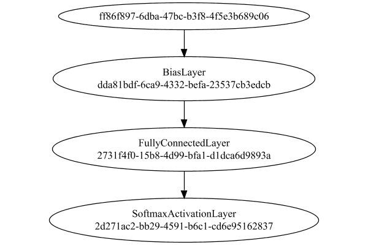


### Training
Adding performance wrappers

Code from [TestUtil.java:269](../../../../../../../../src/main/java/com/simiacryptus/mindseye/test/TestUtil.java#L269) executed in 0.00 seconds: 
```java
    network.visitNodes(node -> {
      if (!(node.getLayer() instanceof MonitoringWrapperLayer)) {
        node.setLayer(new MonitoringWrapperLayer(node.getLayer()).shouldRecordSignalMetrics(false));
      }
      else {
        ((MonitoringWrapperLayer) node.getLayer()).shouldRecordSignalMetrics(false);
      }
    });
```

Optimized via the Stochastic Gradient Descent method:

Code from [TextbookOptimizers.java:41](../../../../../../../../src/test/java/com/simiacryptus/mindseye/labs/matrix/TextbookOptimizers.java#L41) executed in 0.00 seconds: 
```java
    double rate = 0.05;
    ValidatingTrainer trainer = new ValidatingTrainer(trainingSubject, validationSubject)
      .setMinTrainingSize(Integer.MAX_VALUE)
      .setMaxEpochIterations(100)
      .setMonitor(monitor);
    trainer.getRegimen().get(0)
      .setOrientation(new GradientDescent())
      .setLineSearchFactory(name -> new StaticLearningRate().setRate(rate));
    return trainer;
```

Returns: 

```
    com.simiacryptus.mindseye.opt.ValidatingTrainer@29722766
```


Code from [ClassifyProblem.java:91](../../../../../../../../src/main/java/com/simiacryptus/mindseye/test/ClassifyProblem.java#L91) executed in 929.81 seconds: 
```java
    trainer.setTimeout(timeoutMinutes, TimeUnit.MINUTES).setMaxIterations(10000).run();
```
Logging: 
```
    Epoch parameters: 30000, 1
    Phase 0: TrainingPhase{trainingSubject=PerformanceWrapper{inner=SampledArrayTrainable{inner=ArrayTrainable{inner=com.simiacryptus.mindseye.eval.GpuTrainable@1457b7f5}}}, orientation=com.simiacryptus.mindseye.opt.orient.GradientDescent@afaf990}
    resetAndMeasure; trainingSize=30000
    Constructing line search parameters: GD
    Non-decreasing runStep. 99.25309297086902 > 14.93342353153621 at 0.05
    Non-decreasing runStep. 99.20368065513478 > 14.93342353153621 at 0.025
    Non-decreasing runStep. 99.11274093928937 > 14.93342353153621 at 0.0125
    Non-decreasing runStep. 98.90056522525305 > 14.93342353153621 at 0.00625
    Non-decreasing runStep. 98.46576413012698 > 14.93342353153621 at 0.003125
    Non-decreasing runStep. 97.5953737409113 > 14.93342353153621 at 0.0015625
    Non-decreasing runStep. 95.81876219199135 > 14.93342353153621 at 7.8125E-4
    Non-decreasing runStep. 92.64856798201072 > 14.93342353153621 at 3.90625E-4
    Non-decreasing runStep. 86.98146176929868 > 14.93342353153621 at 1.953125E-4
    No
```
...[skipping 34936 bytes](etc/24.txt)...
```
    tep. 120.68981082279261 > 3.0902122933144645 at 9.765625E-5
    Non-decreasing runStep. 71.45941978894152 > 3.0902122933144645 at 4.8828125E-5
    Non-decreasing runStep. 29.042374603683133 > 3.0902122933144645 at 2.44140625E-5
    Non-decreasing runStep. 10.637351350513606 > 3.0902122933144645 at 1.220703125E-5
    Non-decreasing runStep. 4.679000745081318 > 3.0902122933144645 at 6.103515625E-6
    Non-decreasing runStep. 3.243731115103115 > 3.0902122933144645 at 3.0517578125E-6
    New Minimum: 0.5150353822190774 > 0.5015523727369204
    Overall network state change: {FullyConnectedLayer=0.9970747443015294, BiasLayer=0.9722122605364275}
    Iteration 23 complete. Error: 0.5015523727369204 (30000 in 37.968 seconds; 0.000 in orientation, 6.484 in gc, 37.967 in line search; 37.882 eval time)
    Training timeout
    Epoch 7 result with 9 iterations, 30000/2147483647 samples: {validation *= 2^-0.18151; training *= 2^-0.185; Overtraining = 1.02}, {itr*=1.68, len*=0.71} 0 since improvement; 4.4251 validation time
    Training 7 runPhase halted
    
```

Code from [ClassifyProblem.java:95](../../../../../../../../src/main/java/com/simiacryptus/mindseye/test/ClassifyProblem.java#L95) executed in 0.00 seconds: 
```java
    return TestUtil.plot(history);
```

Returns: 

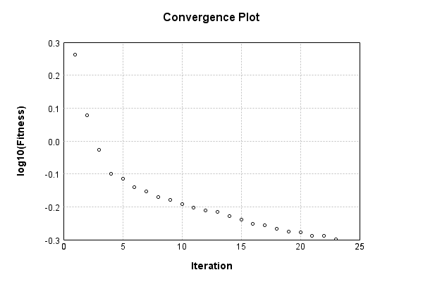


Code from [ClassifyProblem.java:98](../../../../../../../../src/main/java/com/simiacryptus/mindseye/test/ClassifyProblem.java#L98) executed in 0.00 seconds: 
```java
    return TestUtil.plotTime(history);
```

Returns: 

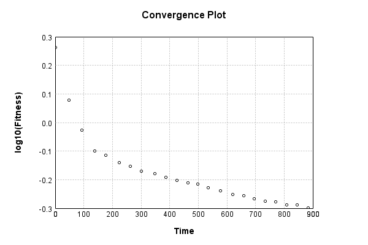


Per-layer Performance Metrics:

Code from [TestUtil.java:234](../../../../../../../../src/main/java/com/simiacryptus/mindseye/test/TestUtil.java#L234) executed in 0.00 seconds: 
```java
    Map<NNLayer, MonitoringWrapperLayer> metrics = new HashMap<>();
    network.visitNodes(node -> {
      if ((node.getLayer() instanceof MonitoringWrapperLayer)) {
        MonitoringWrapperLayer layer = node.getLayer();
        metrics.put(layer.getInner(), layer);
      }
    });
    System.out.println("Forward Performance: \n\t" + metrics.entrySet().stream().map(e -> {
      PercentileStatistics performance = e.getValue().getForwardPerformance();
      return String.format("%s -> %.6fs +- %.6fs (%s)", e.getKey(), performance.getMean(), performance.getStdDev(), performance.getCount());
    }).reduce((a, b) -> a + "\n\t" + b));
    System.out.println("Backward Performance: \n\t" + metrics.entrySet().stream().map(e -> {
      PercentileStatistics performance = e.getValue().getBackwardPerformance();
      return String.format("%s -> %.6fs +- %.6fs (%s)", e.getKey(), performance.getMean(), performance.getStdDev(), performance.getCount());
    }).reduce((a, b) -> a + "\n\t" + b));
```
Logging: 
```
    Forward Performance: 
    	Optional[EntropyLossLayer/0be69ff6-71b6-4eae-967f-e7d76c3f5299 -> 0.004328s +- 0.004156s (2448.0)
    	PipelineNetwork/2c1675cd-1e30-4c41-989a-70dc5bd18084 -> 0.166738s +- 0.050412s (2448.0)]
    Backward Performance: 
    	Optional[EntropyLossLayer/0be69ff6-71b6-4eae-967f-e7d76c3f5299 -> 0.000000s +- 0.000000s (2448.0)
    	PipelineNetwork/2c1675cd-1e30-4c41-989a-70dc5bd18084 -> 0.000073s +- 0.000038s (2448.0)]
    
```

Removing performance wrappers

Code from [TestUtil.java:252](../../../../../../../../src/main/java/com/simiacryptus/mindseye/test/TestUtil.java#L252) executed in 0.00 seconds: 
```java
    network.visitNodes(node -> {
      if (node.getLayer() instanceof MonitoringWrapperLayer) {
        node.setLayer(node.<MonitoringWrapperLayer>getLayer().getInner());
      }
    });
```

Saved model as [classification_model8.json](etc/classification_model8.json)

### Validation
If we run our model against the entire validation dataset, we get this accuracy:

Code from [ClassifyProblem.java:108](../../../../../../../../src/main/java/com/simiacryptus/mindseye/test/ClassifyProblem.java#L108) executed in 0.60 seconds: 
```java
    return data.validationData().mapToDouble(labeledObject ->
      predict(network, labeledObject)[0] == parse(labeledObject.label) ? 1 : 0)
      .average().getAsDouble() * 100;
```

Returns: 

```
    87.32
```


Let's examine some incorrectly predicted results in more detail:

Code from [ClassifyProblem.java:115](../../../../../../../../src/main/java/com/simiacryptus/mindseye/test/ClassifyProblem.java#L115) executed in 0.04 seconds: 
```java
    try {
      TableOutput table = new TableOutput();
      data.validationData().map(labeledObject -> {
        return toRow(log, labeledObject, GpuController.call(ctx -> network.eval(ctx, labeledObject.data)).getData().get(0).getData());
      }).filter(x -> null != x).limit(10).forEach(table::putRow);
      return table;
    } catch (IOException e) {
      throw new RuntimeException(e);
    }
```

Returns: 

Image | Prediction
----- | ----------
![[5]](etc/classification.404.png) | 2 (30.3%), 6 (28.3%), 4 (20.0%)
![[4]](etc/classification.405.png) | 0 (42.2%), 6 (31.5%), 2 (10.6%)
![[1]](etc/classification.406.png) | 3 (40.3%), 1 (14.1%), 2 (11.6%)
![[8]](etc/classification.407.png) | 2 (41.7%), 8 (34.7%), 0 (6.2%) 
![[9]](etc/classification.408.png) | 4 (32.4%), 9 (28.1%), 5 (11.4%)
![[3]](etc/classification.409.png) | 2 (62.0%), 3 (18.8%), 9 (6.1%) 
![[4]](etc/classification.410.png) | 9 (25.9%), 3 (20.6%), 4 (17.6%)
![[6]](etc/classification.411.png) | 2 (36.0%), 6 (30.1%), 4 (10.1%)
![[9]](etc/classification.412.png) | 7 (31.8%), 9 (30.2%), 8 (21.9%)
![[2]](etc/classification.413.png) | 7 (77.9%), 2 (11.7%), 9 (5.6%) 


## SGD
The image-to-vector network is a single layer, fully connected:

Code from [MnistTests.java:48](../../../../../../../../src/test/java/com/simiacryptus/mindseye/labs/matrix/MnistTests.java#L48) executed in 0.00 seconds: 
```java
    PipelineNetwork network = new PipelineNetwork();
    network.add(new BiasLayer(28, 28, 1));
    network.add(new FullyConnectedLayer(new int[]{28, 28, 1}, new int[]{features})
      .setWeights(() -> 0.001 * (Math.random() - 0.45)));
    network.add(new SoftmaxActivationLayer());
    return network;
```

Returns: 

```
    PipelineNetwork/2dce3deb-3ccd-453f-97f3-d89bc4ed6fb4
```


### Network Diagram
Code from [ClassifyProblem.java:80](../../../../../../../../src/main/java/com/simiacryptus/mindseye/test/ClassifyProblem.java#L80) executed in 0.12 seconds: 
```java
    return Graphviz.fromGraph(TestUtil.toGraph(network))
      .height(400).width(600).render(Format.PNG).toImage();
```

Returns: 

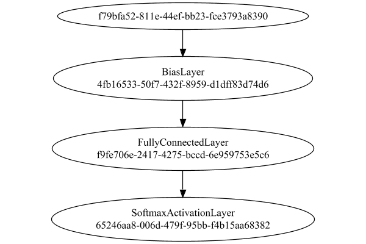


### Training
Adding performance wrappers

Code from [TestUtil.java:269](../../../../../../../../src/main/java/com/simiacryptus/mindseye/test/TestUtil.java#L269) executed in 0.00 seconds: 
```java
    network.visitNodes(node -> {
      if (!(node.getLayer() instanceof MonitoringWrapperLayer)) {
        node.setLayer(new MonitoringWrapperLayer(node.getLayer()).shouldRecordSignalMetrics(false));
      }
      else {
        ((MonitoringWrapperLayer) node.getLayer()).shouldRecordSignalMetrics(false);
      }
    });
```

Optimized via the Stochastic Gradient Descent method with momentum and adaptve learning rate:

Code from [TextbookOptimizers.java:58](../../../../../../../../src/test/java/com/simiacryptus/mindseye/labs/matrix/TextbookOptimizers.java#L58) executed in 0.00 seconds: 
```java
    double carryOver = 0.5;
    ValidatingTrainer trainer = new ValidatingTrainer(trainingSubject, validationSubject)
      .setMaxEpochIterations(100)
      .setMonitor(monitor);
    trainer.getRegimen().get(0)
      .setOrientation(new MomentumStrategy(new GradientDescent()).setCarryOver(carryOver))
      .setLineSearchFactory(name -> new ArmijoWolfeSearch());
    return trainer;
```

Returns: 

```
    com.simiacryptus.mindseye.opt.ValidatingTrainer@368a7019
```


Code from [ClassifyProblem.java:91](../../../../../../../../src/main/java/com/simiacryptus/mindseye/test/ClassifyProblem.java#L91) executed in 904.56 seconds: 
```java
    trainer.setTimeout(timeoutMinutes, TimeUnit.MINUTES).setMaxIterations(10000).run();
```
Logging: 
```
    Epoch parameters: 30000, 1
    Phase 0: TrainingPhase{trainingSubject=PerformanceWrapper{inner=SampledArrayTrainable{inner=ArrayTrainable{inner=com.simiacryptus.mindseye.eval.GpuTrainable@56ab4d44}}}, orientation=com.simiacryptus.mindseye.opt.orient.MomentumStrategy@659cb3a1}
    resetAndMeasure; trainingSize=30000
    Constructing line search parameters: 
    th(0)=2.5152083696356047;dx=-3459656.652155103
    Armijo: th(2.154434690031884)=19.378556142637887; dx=1.675770670105857E-7 delta=-16.863347773002282
    Armijo: th(1.077217345015942)=19.378285802762196; dx=0.008439277356126686 delta=-16.86307743312659
    Armijo: th(0.3590724483386473)=19.376893193524623; dx=0.046519233182210434 delta=-16.861684823889018
    Armijo: th(0.08976811208466183)=19.372043939115716; dx=0.37790277820215695 delta=-16.85683556948011
    Armijo: th(0.017953622416932366)=19.35542812309064; dx=8.072022574525228 delta=-16.840219753455035
    Armijo: th(0.002992270402822061)=19.274767047838957; dx=188.31764637815112 delta=-16.75955867820335
    Armijo: th(4.2746720
```
...[skipping 448369 bytes](etc/25.txt)...
```
    .2635032857769557; dx=-154.94427913645538 delta=0.009545408874289674
    Overall network state change: {FullyConnectedLayer=1.0002339947417707, BiasLayer=0.9986872309611182}
    Iteration 755 complete. Error: 0.2635032857769557 (2923 in 0.651 seconds; 0.001 in orientation, 0.000 in gc, 0.650 in line search; 0.649 eval time)
    th(0)=0.2635032857769557;dx=-984.3102118018417
    New Minimum: 0.2635032857769557 > 0.2516076422054898
    END: th(4.2212086622517944E-5)=0.2516076422054898; dx=-153.19299502969926 delta=0.011895643571465886
    Overall network state change: {FullyConnectedLayer=1.0002916569563738, BiasLayer=0.9951366484697897}
    Iteration 756 complete. Error: 0.2516076422054898 (2923 in 0.662 seconds; 0.000 in orientation, 0.155 in gc, 0.661 in line search; 0.661 eval time)
    Training timeout
    Epoch 27 result with 6 iterations, 2923/2147483647 samples: {validation *= 2^-0.01737; training *= 2^-0.218; Overtraining = 12.54}, {itr*=5.44, len*=2.50} 97 since improvement; 4.3300 validation time
    Training 27 runPhase halted
    
```

Code from [ClassifyProblem.java:95](../../../../../../../../src/main/java/com/simiacryptus/mindseye/test/ClassifyProblem.java#L95) executed in 0.00 seconds: 
```java
    return TestUtil.plot(history);
```

Returns: 

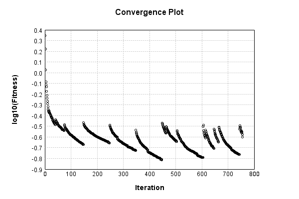


Code from [ClassifyProblem.java:98](../../../../../../../../src/main/java/com/simiacryptus/mindseye/test/ClassifyProblem.java#L98) executed in 0.00 seconds: 
```java
    return TestUtil.plotTime(history);
```

Returns: 

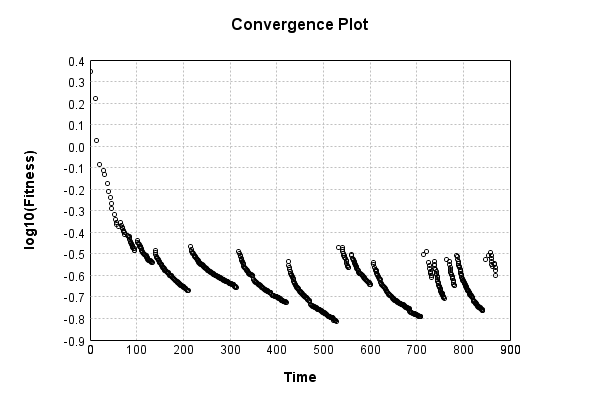


Per-layer Performance Metrics:

Code from [TestUtil.java:234](../../../../../../../../src/main/java/com/simiacryptus/mindseye/test/TestUtil.java#L234) executed in 0.00 seconds: 
```java
    Map<NNLayer, MonitoringWrapperLayer> metrics = new HashMap<>();
    network.visitNodes(node -> {
      if ((node.getLayer() instanceof MonitoringWrapperLayer)) {
        MonitoringWrapperLayer layer = node.getLayer();
        metrics.put(layer.getInner(), layer);
      }
    });
    System.out.println("Forward Performance: \n\t" + metrics.entrySet().stream().map(e -> {
      PercentileStatistics performance = e.getValue().getForwardPerformance();
      return String.format("%s -> %.6fs +- %.6fs (%s)", e.getKey(), performance.getMean(), performance.getStdDev(), performance.getCount());
    }).reduce((a, b) -> a + "\n\t" + b));
    System.out.println("Backward Performance: \n\t" + metrics.entrySet().stream().map(e -> {
      PercentileStatistics performance = e.getValue().getBackwardPerformance();
      return String.format("%s -> %.6fs +- %.6fs (%s)", e.getKey(), performance.getMean(), performance.getStdDev(), performance.getCount());
    }).reduce((a, b) -> a + "\n\t" + b));
```
Logging: 
```
    Forward Performance: 
    	Optional[PipelineNetwork/2dce3deb-3ccd-453f-97f3-d89bc4ed6fb4 -> 0.091181s +- 0.048564s (5028.0)
    	EntropyLossLayer/cb7da209-dd45-4f8c-9701-225ef9fe4ae3 -> 0.002187s +- 0.003872s (5028.0)]
    Backward Performance: 
    	Optional[PipelineNetwork/2dce3deb-3ccd-453f-97f3-d89bc4ed6fb4 -> 0.000060s +- 0.000035s (5028.0)
    	EntropyLossLayer/cb7da209-dd45-4f8c-9701-225ef9fe4ae3 -> 0.000000s +- 0.000001s (5028.0)]
    
```

Removing performance wrappers

Code from [TestUtil.java:252](../../../../../../../../src/main/java/com/simiacryptus/mindseye/test/TestUtil.java#L252) executed in 0.00 seconds: 
```java
    network.visitNodes(node -> {
      if (node.getLayer() instanceof MonitoringWrapperLayer) {
        node.setLayer(node.<MonitoringWrapperLayer>getLayer().getInner());
      }
    });
```

Saved model as [classification_model9.json](etc/classification_model9.json)

### Validation
If we run our model against the entire validation dataset, we get this accuracy:

Code from [ClassifyProblem.java:108](../../../../../../../../src/main/java/com/simiacryptus/mindseye/test/ClassifyProblem.java#L108) executed in 0.59 seconds: 
```java
    return data.validationData().mapToDouble(labeledObject ->
      predict(network, labeledObject)[0] == parse(labeledObject.label) ? 1 : 0)
      .average().getAsDouble() * 100;
```

Returns: 

```
    91.14999999999999
```


Let's examine some incorrectly predicted results in more detail:

Code from [ClassifyProblem.java:115](../../../../../../../../src/main/java/com/simiacryptus/mindseye/test/ClassifyProblem.java#L115) executed in 0.04 seconds: 
```java
    try {
      TableOutput table = new TableOutput();
      data.validationData().map(labeledObject -> {
        return toRow(log, labeledObject, GpuController.call(ctx -> network.eval(ctx, labeledObject.data)).getData().get(0).getData());
      }).filter(x -> null != x).limit(10).forEach(table::putRow);
      return table;
    } catch (IOException e) {
      throw new RuntimeException(e);
    }
```

Returns: 

Image | Prediction
----- | ----------
![[5]](etc/classification.417.png) | 6 (99.9%), 5 (0.0%), 4 (0.0%)  
![[4]](etc/classification.418.png) | 0 (81.5%), 6 (15.3%), 5 (2.2%) 
![[2]](etc/classification.419.png) | 3 (51.7%), 2 (45.3%), 8 (2.6%) 
![[3]](etc/classification.420.png) | 2 (76.3%), 3 (20.7%), 8 (3.0%) 
![[6]](etc/classification.421.png) | 4 (31.3%), 6 (27.9%), 7 (19.9%)
![[7]](etc/classification.422.png) | 9 (63.6%), 7 (35.3%), 4 (0.4%) 
![[2]](etc/classification.423.png) | 9 (96.7%), 4 (2.4%), 6 (0.3%)  
![[9]](etc/classification.424.png) | 3 (51.8%), 4 (32.6%), 9 (11.7%)
![[5]](etc/classification.425.png) | 7 (63.5%), 5 (14.3%), 0 (9.5%) 
![[8]](etc/classification.426.png) | 7 (93.2%), 9 (3.3%), 8 (2.4%)  


## CGD
The image-to-vector network is a single layer, fully connected:

Code from [MnistTests.java:48](../../../../../../../../src/test/java/com/simiacryptus/mindseye/labs/matrix/MnistTests.java#L48) executed in 0.00 seconds: 
```java
    PipelineNetwork network = new PipelineNetwork();
    network.add(new BiasLayer(28, 28, 1));
    network.add(new FullyConnectedLayer(new int[]{28, 28, 1}, new int[]{features})
      .setWeights(() -> 0.001 * (Math.random() - 0.45)));
    network.add(new SoftmaxActivationLayer());
    return network;
```

Returns: 

```
    PipelineNetwork/19772b32-2249-4f82-8872-a94ce8564951
```


### Network Diagram
Code from [ClassifyProblem.java:80](../../../../../../../../src/main/java/com/simiacryptus/mindseye/test/ClassifyProblem.java#L80) executed in 0.10 seconds: 
```java
    return Graphviz.fromGraph(TestUtil.toGraph(network))
      .height(400).width(600).render(Format.PNG).toImage();
```

Returns: 

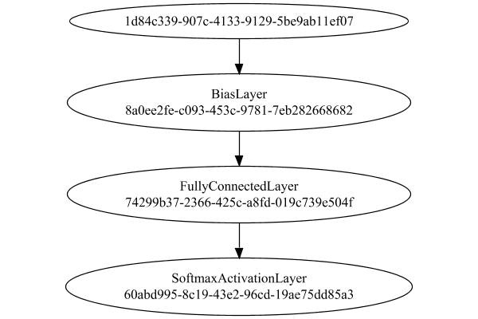


### Training
Adding performance wrappers

Code from [TestUtil.java:269](../../../../../../../../src/main/java/com/simiacryptus/mindseye/test/TestUtil.java#L269) executed in 0.00 seconds: 
```java
    network.visitNodes(node -> {
      if (!(node.getLayer() instanceof MonitoringWrapperLayer)) {
        node.setLayer(new MonitoringWrapperLayer(node.getLayer()).shouldRecordSignalMetrics(false));
      }
      else {
        ((MonitoringWrapperLayer) node.getLayer()).shouldRecordSignalMetrics(false);
      }
    });
```

Optimized via the Conjugate Gradient Descent method:

Code from [TextbookOptimizers.java:74](../../../../../../../../src/test/java/com/simiacryptus/mindseye/labs/matrix/TextbookOptimizers.java#L74) executed in 0.00 seconds: 
```java
    ValidatingTrainer trainer = new ValidatingTrainer(trainingSubject, validationSubject)
      .setMinTrainingSize(Integer.MAX_VALUE)
      .setMonitor(monitor);
    trainer.getRegimen().get(0)
      .setOrientation(new GradientDescent())
      .setLineSearchFactory(name -> new QuadraticSearch().setRelativeTolerance(1e-5));
    return trainer;
```

Returns: 

```
    com.simiacryptus.mindseye.opt.ValidatingTrainer@58b42cab
```


Code from [ClassifyProblem.java:91](../../../../../../../../src/main/java/com/simiacryptus/mindseye/test/ClassifyProblem.java#L91) executed in 913.75 seconds: 
```java
    trainer.setTimeout(timeoutMinutes, TimeUnit.MINUTES).setMaxIterations(10000).run();
```
Logging: 
```
    Epoch parameters: 30000, 1
    Phase 0: TrainingPhase{trainingSubject=PerformanceWrapper{inner=SampledArrayTrainable{inner=ArrayTrainable{inner=com.simiacryptus.mindseye.eval.GpuTrainable@76de1039}}}, orientation=com.simiacryptus.mindseye.opt.orient.GradientDescent@fc3f506}
    resetAndMeasure; trainingSize=30000
    Constructing line search parameters: GD
    F(0.0) = LineSearchPoint{point=PointSample{avg=2.3993829706746888}, derivative=-3180222.743127955}
    New Minimum: 2.3993829706746888 > 2.3993299352923385
    F(1.0E-10) = LineSearchPoint{point=PointSample{avg=2.3993299352923385}, derivative=-3180050.0607935204}, delta = -5.303538235024163E-5
    New Minimum: 2.3993299352923385 > 2.399011783445316
    F(7.000000000000001E-10) = LineSearchPoint{point=PointSample{avg=2.399011783445316}, derivative=-3179014.037508885}, delta = -3.711872293727936E-4
    New Minimum: 2.399011783445316 > 2.3967876210513794
    F(4.900000000000001E-9) = LineSearchPoint{point=PointSample{avg=2.3967876210513794}, derivative=-3171765.2791188713}, delta = -0.
```
...[skipping 59410 bytes](etc/26.txt)...
```
    151520142194887E-6
    New Minimum: 0.5061721553744202 > 0.5061719682097631
    F(1.8075615526852483E-6) = LineSearchPoint{point=PointSample{avg=0.5061719682097631}, derivative=4.11175504930836}, delta = -0.00602363311929377
    Right bracket at 1.8075615526852483E-6
    New Minimum: 0.5061719682097631 > 0.5061719662790533
    F(1.8073778605749552E-6) = LineSearchPoint{point=PointSample{avg=0.5061719662790533}, derivative=0.09951609970983061}, delta = -0.006023635050003584
    Right bracket at 1.8073778605749552E-6
    Converged to right
    Overall network state change: {FullyConnectedLayer=0.9962724785753341, BiasLayer=0.9596607644466666}
    Iteration 29 complete. Error: 0.5061719662790533 (30000 in 17.173 seconds; 0.000 in orientation, 2.923 in gc, 17.172 in line search; 17.169 eval time)
    Training timeout
    Epoch 7 result with 11 iterations, 30000/2147483647 samples: {validation *= 2^-0.21488; training *= 2^-0.217; Overtraining = 1.01}, {itr*=1.55, len*=0.71} 0 since improvement; 4.1926 validation time
    Training 7 runPhase halted
    
```

Code from [ClassifyProblem.java:95](../../../../../../../../src/main/java/com/simiacryptus/mindseye/test/ClassifyProblem.java#L95) executed in 0.00 seconds: 
```java
    return TestUtil.plot(history);
```

Returns: 

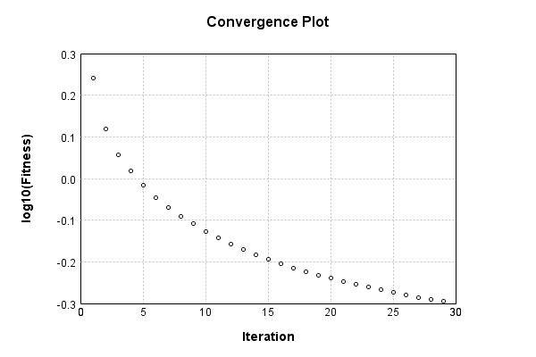


Code from [ClassifyProblem.java:98](../../../../../../../../src/main/java/com/simiacryptus/mindseye/test/ClassifyProblem.java#L98) executed in 0.00 seconds: 
```java
    return TestUtil.plotTime(history);
```

Returns: 

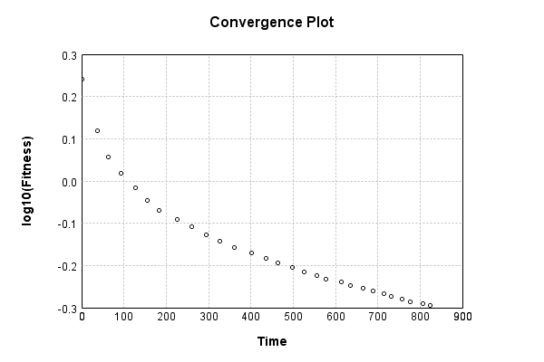


Per-layer Performance Metrics:

Code from [TestUtil.java:234](../../../../../../../../src/main/java/com/simiacryptus/mindseye/test/TestUtil.java#L234) executed in 0.00 seconds: 
```java
    Map<NNLayer, MonitoringWrapperLayer> metrics = new HashMap<>();
    network.visitNodes(node -> {
      if ((node.getLayer() instanceof MonitoringWrapperLayer)) {
        MonitoringWrapperLayer layer = node.getLayer();
        metrics.put(layer.getInner(), layer);
      }
    });
    System.out.println("Forward Performance: \n\t" + metrics.entrySet().stream().map(e -> {
      PercentileStatistics performance = e.getValue().getForwardPerformance();
      return String.format("%s -> %.6fs +- %.6fs (%s)", e.getKey(), performance.getMean(), performance.getStdDev(), performance.getCount());
    }).reduce((a, b) -> a + "\n\t" + b));
    System.out.println("Backward Performance: \n\t" + metrics.entrySet().stream().map(e -> {
      PercentileStatistics performance = e.getValue().getBackwardPerformance();
      return String.format("%s -> %.6fs +- %.6fs (%s)", e.getKey(), performance.getMean(), performance.getStdDev(), performance.getCount());
    }).reduce((a, b) -> a + "\n\t" + b));
```
Logging: 
```
    Forward Performance: 
    	Optional[EntropyLossLayer/879d54b4-1e0b-493c-82b6-2b8c4615a641 -> 0.004037s +- 0.003956s (2400.0)
    	PipelineNetwork/19772b32-2249-4f82-8872-a94ce8564951 -> 0.167172s +- 0.050922s (2400.0)]
    Backward Performance: 
    	Optional[EntropyLossLayer/879d54b4-1e0b-493c-82b6-2b8c4615a641 -> 0.000000s +- 0.000001s (2400.0)
    	PipelineNetwork/19772b32-2249-4f82-8872-a94ce8564951 -> 0.000074s +- 0.000038s (2400.0)]
    
```

Removing performance wrappers

Code from [TestUtil.java:252](../../../../../../../../src/main/java/com/simiacryptus/mindseye/test/TestUtil.java#L252) executed in 0.00 seconds: 
```java
    network.visitNodes(node -> {
      if (node.getLayer() instanceof MonitoringWrapperLayer) {
        node.setLayer(node.<MonitoringWrapperLayer>getLayer().getInner());
      }
    });
```

Saved model as [classification_model10.json](etc/classification_model10.json)

### Validation
If we run our model against the entire validation dataset, we get this accuracy:

Code from [ClassifyProblem.java:108](../../../../../../../../src/main/java/com/simiacryptus/mindseye/test/ClassifyProblem.java#L108) executed in 0.60 seconds: 
```java
    return data.validationData().mapToDouble(labeledObject ->
      predict(network, labeledObject)[0] == parse(labeledObject.label) ? 1 : 0)
      .average().getAsDouble() * 100;
```

Returns: 

```
    87.41
```


Let's examine some incorrectly predicted results in more detail:

Code from [ClassifyProblem.java:115](../../../../../../../../src/main/java/com/simiacryptus/mindseye/test/ClassifyProblem.java#L115) executed in 0.03 seconds: 
```java
    try {
      TableOutput table = new TableOutput();
      data.validationData().map(labeledObject -> {
        return toRow(log, labeledObject, GpuController.call(ctx -> network.eval(ctx, labeledObject.data)).getData().get(0).getData());
      }).filter(x -> null != x).limit(10).forEach(table::putRow);
      return table;
    } catch (IOException e) {
      throw new RuntimeException(e);
    }
```

Returns: 

Image | Prediction
----- | ----------
![[5]](etc/classification.430.png) | 2 (34.5%), 6 (32.2%), 0 (8.8%) 
![[4]](etc/classification.431.png) | 6 (38.2%), 0 (36.6%), 2 (8.5%) 
![[2]](etc/classification.432.png) | 3 (32.5%), 2 (26.8%), 6 (10.6%)
![[1]](etc/classification.433.png) | 3 (47.8%), 1 (12.9%), 5 (10.6%)
![[6]](etc/classification.434.png) | 2 (43.6%), 6 (37.5%), 4 (8.8%) 
![[8]](etc/classification.435.png) | 2 (37.3%), 8 (29.0%), 5 (10.6%)
![[3]](etc/classification.436.png) | 2 (46.8%), 3 (29.5%), 9 (6.3%) 
![[6]](etc/classification.437.png) | 2 (34.1%), 6 (29.2%), 4 (11.3%)
![[9]](etc/classification.438.png) | 7 (38.8%), 9 (24.6%), 8 (18.5%)
![[2]](etc/classification.439.png) | 7 (77.4%), 2 (12.1%), 9 (5.6%) 


## L-BFGS
The image-to-vector network is a single layer, fully connected:

Code from [MnistTests.java:48](../../../../../../../../src/test/java/com/simiacryptus/mindseye/labs/matrix/MnistTests.java#L48) executed in 0.00 seconds: 
```java
    PipelineNetwork network = new PipelineNetwork();
    network.add(new BiasLayer(28, 28, 1));
    network.add(new FullyConnectedLayer(new int[]{28, 28, 1}, new int[]{features})
      .setWeights(() -> 0.001 * (Math.random() - 0.45)));
    network.add(new SoftmaxActivationLayer());
    return network;
```

Returns: 

```
    PipelineNetwork/59a47dc9-1614-4995-a531-1a709bac1683
```


### Network Diagram
Code from [ClassifyProblem.java:80](../../../../../../../../src/main/java/com/simiacryptus/mindseye/test/ClassifyProblem.java#L80) executed in 0.13 seconds: 
```java
    return Graphviz.fromGraph(TestUtil.toGraph(network))
      .height(400).width(600).render(Format.PNG).toImage();
```

Returns: 

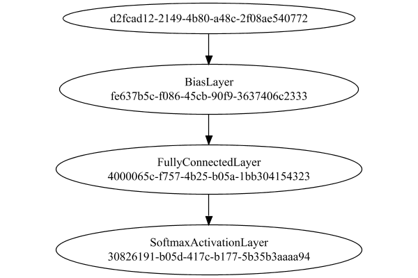


### Training
Adding performance wrappers

Code from [TestUtil.java:269](../../../../../../../../src/main/java/com/simiacryptus/mindseye/test/TestUtil.java#L269) executed in 0.00 seconds: 
```java
    network.visitNodes(node -> {
      if (!(node.getLayer() instanceof MonitoringWrapperLayer)) {
        node.setLayer(new MonitoringWrapperLayer(node.getLayer()).shouldRecordSignalMetrics(false));
      }
      else {
        ((MonitoringWrapperLayer) node.getLayer()).shouldRecordSignalMetrics(false);
      }
    });
```

Optimized via the Limited-Memory BFGS method:

Code from [TextbookOptimizers.java:89](../../../../../../../../src/test/java/com/simiacryptus/mindseye/labs/matrix/TextbookOptimizers.java#L89) executed in 0.00 seconds: 
```java
    ValidatingTrainer trainer = new ValidatingTrainer(trainingSubject, validationSubject)
      .setMinTrainingSize(Integer.MAX_VALUE)
      .setMonitor(monitor);
    trainer.getRegimen().get(0)
      .setOrientation(new com.simiacryptus.mindseye.opt.orient.LBFGS())
      .setLineSearchFactory(name -> new ArmijoWolfeSearch()
        .setAlpha(name.contains("LBFGS") ? 1.0 : 1e-6));
    return trainer;
```

Returns: 

```
    com.simiacryptus.mindseye.opt.ValidatingTrainer@29ebeb11
```


Code from [ClassifyProblem.java:91](../../../../../../../../src/main/java/com/simiacryptus/mindseye/test/ClassifyProblem.java#L91) executed in 908.20 seconds: 
```java
    trainer.setTimeout(timeoutMinutes, TimeUnit.MINUTES).setMaxIterations(10000).run();
```
Logging: 
```
    Epoch parameters: 30000, 1
    Phase 0: TrainingPhase{trainingSubject=PerformanceWrapper{inner=SampledArrayTrainable{inner=ArrayTrainable{inner=com.simiacryptus.mindseye.eval.GpuTrainable@417e5bcb}}}, orientation=com.simiacryptus.mindseye.opt.orient.LBFGS@1366041c}
    resetAndMeasure; trainingSize=30000
    LBFGS Accumulation History: 1 points
    Constructing line search parameters: GD
    th(0)=2.443634951623656;dx=-3147737.4805916953
    New Minimum: 2.443634951623656 > 1.771874121609293
    END: th(2.1544346900318835E-6)=1.771874121609293; dx=-590870.9057420495 delta=0.6717608300143632
    Overall network state change: {FullyConnectedLayer=0.9947951093516614, BiasLayer=0.0}
    Iteration 1 complete. Error: 1.771874121609293 (30000 in 4.350 seconds; 0.001 in orientation, 0.756 in gc, 4.349 in line search; 7.034 eval time)
    Epoch 1 result with 2 iterations, 30000/2147483647 samples: {validation *= 2^-0.46242; training *= 2^-0.464; Overtraining = 1.00}, {itr*=1.05, len*=0.71} 0 since improvement; 9.4053 validation time
    Epoch paramet
```
...[skipping 93594 bytes](etc/27.txt)...
```
    eration 113 complete. Error: 0.3091987545189642 (30000 in 10.053 seconds; 0.002 in orientation, 1.576 in gc, 10.051 in line search; 10.048 eval time)
    Orientation vanished. Popping history element from 0.3102128531620621, 0.30991895901332084, 0.3095430818683451, 0.3091987545189642
    LBFGS Accumulation History: 3 points
    th(0)=0.3091987545189642;dx=-1717.5613650790408
    New Minimum: 0.3091987545189642 > 0.3088740815734166
    END: th(2.167037156937985E-6)=0.3088740815734166; dx=-92.51132142601296 delta=3.246729455476105E-4
    Overall network state change: {FullyConnectedLayer=0.9994447407104885, BiasLayer=0.9955030351988244}
    Iteration 114 complete. Error: 0.3088740815734166 (30000 in 4.515 seconds; 0.001 in orientation, 0.748 in gc, 4.514 in line search; 4.512 eval time)
    Training timeout
    Epoch 12 result with 19 iterations, 30000/2147483647 samples: {validation *= 2^-0.02912; training *= 2^-0.044; Overtraining = 1.50}, {itr*=4.20, len*=0.86} 0 since improvement; 4.1996 validation time
    Training 12 runPhase halted
    
```

Code from [ClassifyProblem.java:95](../../../../../../../../src/main/java/com/simiacryptus/mindseye/test/ClassifyProblem.java#L95) executed in 0.01 seconds: 
```java
    return TestUtil.plot(history);
```

Returns: 

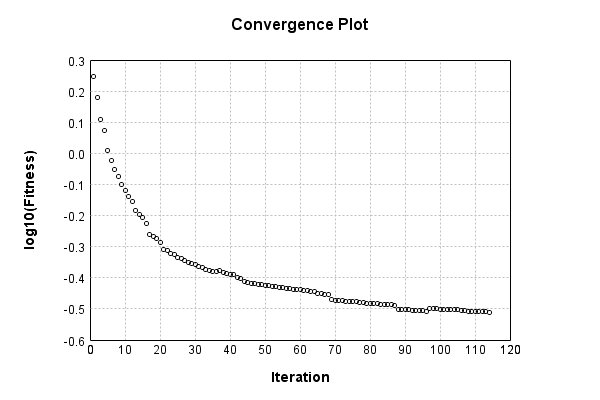


Code from [ClassifyProblem.java:98](../../../../../../../../src/main/java/com/simiacryptus/mindseye/test/ClassifyProblem.java#L98) executed in 0.00 seconds: 
```java
    return TestUtil.plotTime(history);
```

Returns: 

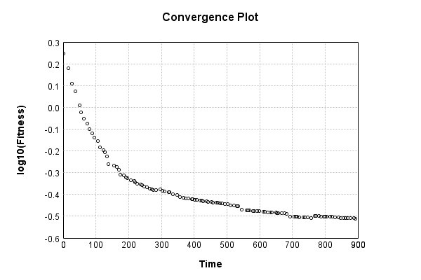


Per-layer Performance Metrics:

Code from [TestUtil.java:234](../../../../../../../../src/main/java/com/simiacryptus/mindseye/test/TestUtil.java#L234) executed in 0.00 seconds: 
```java
    Map<NNLayer, MonitoringWrapperLayer> metrics = new HashMap<>();
    network.visitNodes(node -> {
      if ((node.getLayer() instanceof MonitoringWrapperLayer)) {
        MonitoringWrapperLayer layer = node.getLayer();
        metrics.put(layer.getInner(), layer);
      }
    });
    System.out.println("Forward Performance: \n\t" + metrics.entrySet().stream().map(e -> {
      PercentileStatistics performance = e.getValue().getForwardPerformance();
      return String.format("%s -> %.6fs +- %.6fs (%s)", e.getKey(), performance.getMean(), performance.getStdDev(), performance.getCount());
    }).reduce((a, b) -> a + "\n\t" + b));
    System.out.println("Backward Performance: \n\t" + metrics.entrySet().stream().map(e -> {
      PercentileStatistics performance = e.getValue().getBackwardPerformance();
      return String.format("%s -> %.6fs +- %.6fs (%s)", e.getKey(), performance.getMean(), performance.getStdDev(), performance.getCount());
    }).reduce((a, b) -> a + "\n\t" + b));
```
Logging: 
```
    Forward Performance: 
    	Optional[PipelineNetwork/59a47dc9-1614-4995-a531-1a709bac1683 -> 0.165711s +- 0.048968s (2400.0)
    	EntropyLossLayer/6b3b8099-f5d5-4b74-86fd-427287623685 -> 0.004055s +- 0.004048s (2400.0)]
    Backward Performance: 
    	Optional[PipelineNetwork/59a47dc9-1614-4995-a531-1a709bac1683 -> 0.000073s +- 0.000036s (2400.0)
    	EntropyLossLayer/6b3b8099-f5d5-4b74-86fd-427287623685 -> 0.000000s +- 0.000001s (2400.0)]
    
```

Removing performance wrappers

Code from [TestUtil.java:252](../../../../../../../../src/main/java/com/simiacryptus/mindseye/test/TestUtil.java#L252) executed in 0.00 seconds: 
```java
    network.visitNodes(node -> {
      if (node.getLayer() instanceof MonitoringWrapperLayer) {
        node.setLayer(node.<MonitoringWrapperLayer>getLayer().getInner());
      }
    });
```

Saved model as [classification_model11.json](etc/classification_model11.json)

### Validation
If we run our model against the entire validation dataset, we get this accuracy:

Code from [ClassifyProblem.java:108](../../../../../../../../src/main/java/com/simiacryptus/mindseye/test/ClassifyProblem.java#L108) executed in 0.60 seconds: 
```java
    return data.validationData().mapToDouble(labeledObject ->
      predict(network, labeledObject)[0] == parse(labeledObject.label) ? 1 : 0)
      .average().getAsDouble() * 100;
```

Returns: 

```
    91.53
```


Let's examine some incorrectly predicted results in more detail:

Code from [ClassifyProblem.java:115](../../../../../../../../src/main/java/com/simiacryptus/mindseye/test/ClassifyProblem.java#L115) executed in 0.04 seconds: 
```java
    try {
      TableOutput table = new TableOutput();
      data.validationData().map(labeledObject -> {
        return toRow(log, labeledObject, GpuController.call(ctx -> network.eval(ctx, labeledObject.data)).getData().get(0).getData());
      }).filter(x -> null != x).limit(10).forEach(table::putRow);
      return table;
    } catch (IOException e) {
      throw new RuntimeException(e);
    }
```

Returns: 

Image | Prediction
----- | ----------
![[5]](etc/classification.443.png) | 6 (96.5%), 2 (1.1%), 4 (1.0%)  
![[4]](etc/classification.444.png) | 6 (42.7%), 0 (38.0%), 5 (9.9%) 
![[3]](etc/classification.445.png) | 2 (54.4%), 3 (39.7%), 8 (4.6%) 
![[2]](etc/classification.446.png) | 7 (73.3%), 2 (16.4%), 9 (8.1%) 
![[9]](etc/classification.447.png) | 4 (40.7%), 9 (27.1%), 8 (16.2%)
![[7]](etc/classification.448.png) | 4 (62.8%), 9 (25.4%), 7 (10.4%)
![[2]](etc/classification.449.png) | 9 (70.8%), 8 (8.2%), 1 (6.8%)  
![[9]](etc/classification.450.png) | 4 (36.0%), 3 (32.4%), 9 (21.0%)
![[3]](etc/classification.451.png) | 8 (36.1%), 3 (23.4%), 5 (16.4%)
![[5]](etc/classification.452.png) | 7 (41.2%), 5 (34.7%), 0 (9.6%) 


## OWL-QN
The image-to-vector network is a single layer, fully connected:

Code from [MnistTests.java:48](../../../../../../../../src/test/java/com/simiacryptus/mindseye/labs/matrix/MnistTests.java#L48) executed in 0.00 seconds: 
```java
    PipelineNetwork network = new PipelineNetwork();
    network.add(new BiasLayer(28, 28, 1));
    network.add(new FullyConnectedLayer(new int[]{28, 28, 1}, new int[]{features})
      .setWeights(() -> 0.001 * (Math.random() - 0.45)));
    network.add(new SoftmaxActivationLayer());
    return network;
```

Returns: 

```
    PipelineNetwork/f0770f56-cda0-4f72-bf07-f8887adad57a
```


### Network Diagram
Code from [ClassifyProblem.java:80](../../../../../../../../src/main/java/com/simiacryptus/mindseye/test/ClassifyProblem.java#L80) executed in 0.34 seconds: 
```java
    return Graphviz.fromGraph(TestUtil.toGraph(network))
      .height(400).width(600).render(Format.PNG).toImage();
```

Returns: 

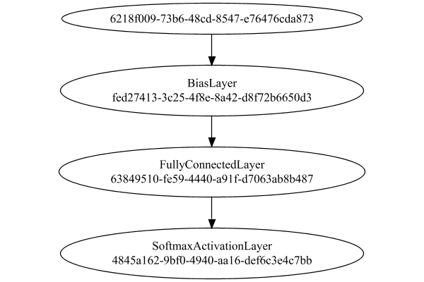


### Training
Adding performance wrappers

Code from [TestUtil.java:269](../../../../../../../../src/main/java/com/simiacryptus/mindseye/test/TestUtil.java#L269) executed in 0.00 seconds: 
```java
    network.visitNodes(node -> {
      if (!(node.getLayer() instanceof MonitoringWrapperLayer)) {
        node.setLayer(new MonitoringWrapperLayer(node.getLayer()).shouldRecordSignalMetrics(false));
      }
      else {
        ((MonitoringWrapperLayer) node.getLayer()).shouldRecordSignalMetrics(false);
      }
    });
```

Optimized via the Orthantwise Quasi-Newton search method:

Code from [TextbookOptimizers.java:105](../../../../../../../../src/test/java/com/simiacryptus/mindseye/labs/matrix/TextbookOptimizers.java#L105) executed in 0.00 seconds: 
```java
    ValidatingTrainer trainer = new ValidatingTrainer(trainingSubject, validationSubject)
      .setMinTrainingSize(Integer.MAX_VALUE)
      .setMonitor(monitor);
    trainer.getRegimen().get(0)
      .setOrientation(new OwlQn())
      .setLineSearchFactory(name -> new ArmijoWolfeSearch()
        .setAlpha(name.contains("OWL") ? 1.0 : 1e-6));
    return trainer;
```

Returns: 

```
    com.simiacryptus.mindseye.opt.ValidatingTrainer@638220db
```


Code from [ClassifyProblem.java:91](../../../../../../../../src/main/java/com/simiacryptus/mindseye/test/ClassifyProblem.java#L91) executed in 908.33 seconds: 
```java
    trainer.setTimeout(timeoutMinutes, TimeUnit.MINUTES).setMaxIterations(10000).run();
```
Logging: 
```
    Epoch parameters: 30000, 1
    Phase 0: TrainingPhase{trainingSubject=PerformanceWrapper{inner=SampledArrayTrainable{inner=ArrayTrainable{inner=com.simiacryptus.mindseye.eval.GpuTrainable@76de501b}}}, orientation=com.simiacryptus.mindseye.opt.orient.OwlQn@74ed1847}
    resetAndMeasure; trainingSize=30000
    LBFGS Accumulation History: 1 points
    Constructing line search parameters: OWL/QN
    th(0)=2.42864212334371;dx=-3687676.5272650653
    Armijo: th(2.154434690031884)=20.82089544488936; dx=-6.312626190050309E-14 delta=-18.39225332154565
    Armijo: th(1.077217345015942)=20.82089544499046; dx=-6.484968183765027E-9 delta=-18.39225332164675
    Armijo: th(0.3590724483386473)=20.820895662492823; dx=4.784786779609567E-5 delta=-18.392253539149113
    Armijo: th(0.08976811208466183)=20.820232024937507; dx=0.08057219316029017 delta=-18.391589901593797
    Armijo: th(0.017953622416932366)=20.814694579557642; dx=2.588872600886251 delta=-18.386052456213932
    Armijo: th(0.002992270402822061)=20.783451947818136; dx=74.93646184498132 delta=-18.354
```
...[skipping 88667 bytes](etc/28.txt)...
```
    r=0.0}
    Iteration 124 complete. Error: 0.34553995822013545 (30000 in 8.079 seconds; 0.001 in orientation, 1.479 in gc, 8.078 in line search; 8.077 eval time)
    Orientation vanished. Popping history element from 0.34743500367151947, 0.34690167976126657, 0.34592738681212437, 0.34553995822013545
    LBFGS Accumulation History: 3 points
    th(0)=0.34553995822013545;dx=-1409.1612650910038
    New Minimum: 0.34553995822013545 > 0.34494526386496144
    END: th(6.344265073485693E-6)=0.34494526386496144; dx=-281.24416041111414 delta=5.94694355174008E-4
    Overall network state change: {FullyConnectedLayer=0.9979793421985595, BiasLayer=0.0}
    Iteration 125 complete. Error: 0.34494526386496144 (30000 in 6.136 seconds; 0.001 in orientation, 0.792 in gc, 6.134 in line search; 6.123 eval time)
    Training timeout
    Epoch 12 result with 5 iterations, 30000/2147483647 samples: {validation *= 2^-0.00753; training *= 2^-0.010; Overtraining = 1.38}, {itr*=8.27, len*=0.83} 0 since improvement; 4.0366 validation time
    Training 12 runPhase halted
    
```

Code from [ClassifyProblem.java:95](../../../../../../../../src/main/java/com/simiacryptus/mindseye/test/ClassifyProblem.java#L95) executed in 0.00 seconds: 
```java
    return TestUtil.plot(history);
```

Returns: 

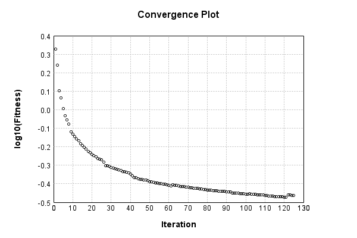


Code from [ClassifyProblem.java:98](../../../../../../../../src/main/java/com/simiacryptus/mindseye/test/ClassifyProblem.java#L98) executed in 0.00 seconds: 
```java
    return TestUtil.plotTime(history);
```

Returns: 

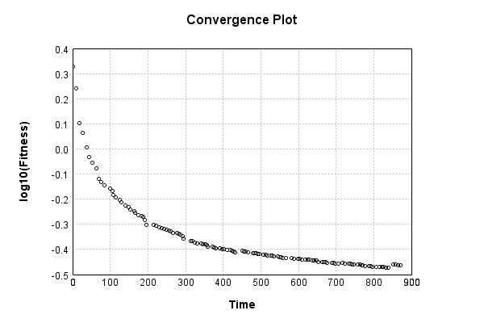


Per-layer Performance Metrics:

Code from [TestUtil.java:234](../../../../../../../../src/main/java/com/simiacryptus/mindseye/test/TestUtil.java#L234) executed in 0.00 seconds: 
```java
    Map<NNLayer, MonitoringWrapperLayer> metrics = new HashMap<>();
    network.visitNodes(node -> {
      if ((node.getLayer() instanceof MonitoringWrapperLayer)) {
        MonitoringWrapperLayer layer = node.getLayer();
        metrics.put(layer.getInner(), layer);
      }
    });
    System.out.println("Forward Performance: \n\t" + metrics.entrySet().stream().map(e -> {
      PercentileStatistics performance = e.getValue().getForwardPerformance();
      return String.format("%s -> %.6fs +- %.6fs (%s)", e.getKey(), performance.getMean(), performance.getStdDev(), performance.getCount());
    }).reduce((a, b) -> a + "\n\t" + b));
    System.out.println("Backward Performance: \n\t" + metrics.entrySet().stream().map(e -> {
      PercentileStatistics performance = e.getValue().getBackwardPerformance();
      return String.format("%s -> %.6fs +- %.6fs (%s)", e.getKey(), performance.getMean(), performance.getStdDev(), performance.getCount());
    }).reduce((a, b) -> a + "\n\t" + b));
```
Logging: 
```
    Forward Performance: 
    	Optional[EntropyLossLayer/b102acfa-792c-462d-b7b2-b2dcee9fa501 -> 0.003981s +- 0.002220s (2382.0)
    	PipelineNetwork/f0770f56-cda0-4f72-bf07-f8887adad57a -> 0.165727s +- 0.050858s (2382.0)]
    Backward Performance: 
    	Optional[EntropyLossLayer/b102acfa-792c-462d-b7b2-b2dcee9fa501 -> 0.000000s +- 0.000001s (2382.0)
    	PipelineNetwork/f0770f56-cda0-4f72-bf07-f8887adad57a -> 0.000075s +- 0.000043s (2382.0)]
    
```

Removing performance wrappers

Code from [TestUtil.java:252](../../../../../../../../src/main/java/com/simiacryptus/mindseye/test/TestUtil.java#L252) executed in 0.00 seconds: 
```java
    network.visitNodes(node -> {
      if (node.getLayer() instanceof MonitoringWrapperLayer) {
        node.setLayer(node.<MonitoringWrapperLayer>getLayer().getInner());
      }
    });
```

Saved model as [classification_model12.json](etc/classification_model12.json)

### Validation
If we run our model against the entire validation dataset, we get this accuracy:

Code from [ClassifyProblem.java:108](../../../../../../../../src/main/java/com/simiacryptus/mindseye/test/ClassifyProblem.java#L108) executed in 0.72 seconds: 
```java
    return data.validationData().mapToDouble(labeledObject ->
      predict(network, labeledObject)[0] == parse(labeledObject.label) ? 1 : 0)
      .average().getAsDouble() * 100;
```

Returns: 

```
    91.07
```


Let's examine some incorrectly predicted results in more detail:

Code from [ClassifyProblem.java:115](../../../../../../../../src/main/java/com/simiacryptus/mindseye/test/ClassifyProblem.java#L115) executed in 0.04 seconds: 
```java
    try {
      TableOutput table = new TableOutput();
      data.validationData().map(labeledObject -> {
        return toRow(log, labeledObject, GpuController.call(ctx -> network.eval(ctx, labeledObject.data)).getData().get(0).getData());
      }).filter(x -> null != x).limit(10).forEach(table::putRow);
      return table;
    } catch (IOException e) {
      throw new RuntimeException(e);
    }
```

Returns: 

Image | Prediction
----- | ----------
![[5]](etc/classification.456.png) | 6 (90.8%), 2 (3.7%), 4 (2.6%)  
![[4]](etc/classification.457.png) | 0 (53.2%), 6 (31.5%), 5 (8.6%) 
![[1]](etc/classification.458.png) | 3 (58.5%), 1 (31.0%), 5 (3.1%) 
![[3]](etc/classification.459.png) | 2 (47.2%), 3 (43.1%), 9 (4.4%) 
![[2]](etc/classification.460.png) | 7 (70.2%), 2 (14.9%), 9 (12.8%)
![[9]](etc/classification.461.png) | 4 (42.1%), 9 (30.7%), 8 (11.5%)
![[7]](etc/classification.462.png) | 1 (55.0%), 7 (24.6%), 9 (7.4%) 
![[7]](etc/classification.463.png) | 4 (67.7%), 9 (25.5%), 7 (4.8%) 
![[0]](etc/classification.464.png) | 3 (43.1%), 0 (39.6%), 2 (16.0%)
![[2]](etc/classification.465.png) | 9 (61.5%), 8 (12.7%), 4 (9.0%) 


## Comparison
Code from [OptimizerComparison.java:194](../../../../../../../../src/test/java/com/simiacryptus/mindseye/labs/matrix/OptimizerComparison.java#L194) executed in 0.00 seconds: 
```java
    return TestUtil.compare(gd, sgd, cgd, lbfgs, owlqn);
```

Returns: 

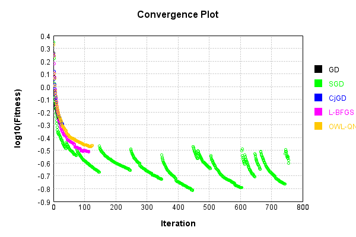


Code from [OptimizerComparison.java:197](../../../../../../../../src/test/java/com/simiacryptus/mindseye/labs/matrix/OptimizerComparison.java#L197) executed in 0.00 seconds: 
```java
    return TestUtil.compareTime(gd, sgd, cgd, lbfgs, owlqn);
```

Returns: 

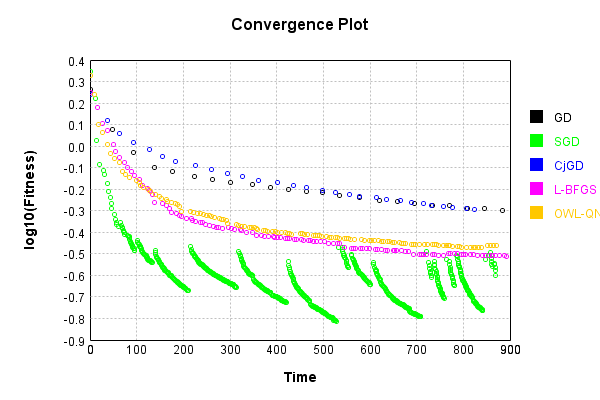


