# Textbook Optimizer Comparison
## GD
The vector-to-image network is a single fully connected layer:

Code from [MnistTests.java:79](../../../../../../../../src/test/java/com/simiacryptus/mindseye/labs/matrix/MnistTests.java#L79) executed in 0.00 seconds: 
```java
    PipelineNetwork network = new PipelineNetwork();
    network.add(new FullyConnectedLayer(new int[]{features}, new int[]{28, 28, 1})
      .setWeights(() -> 0.25 * (Math.random() - 0.5)));
    network.add(new BiasLayer(28, 28, 1));
    return network;
```

Returns: 

```
    PipelineNetwork/075ff2fb-21e1-4c2c-9a22-1026c703ef42
```


### Network Diagram
Code from [EncodingProblem.java:91](../../../../../../../../src/main/java/com/simiacryptus/mindseye/test/EncodingProblem.java#L91) executed in 0.09 seconds: 
```java
    return Graphviz.fromGraph(TestUtil.toGraph(imageNetwork))
      .height(400).width(600).render(Format.PNG).toImage();
```

Returns: 

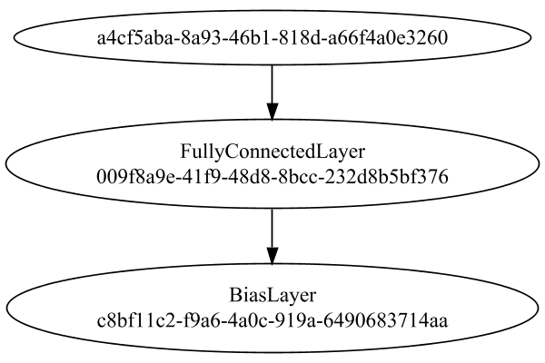


### Training
We start by training with a very small population to improve initial convergence performance:

Adding performance wrappers

Code from [TestUtil.java:269](../../../../../../../../src/main/java/com/simiacryptus/mindseye/test/TestUtil.java#L269) executed in 0.00 seconds: 
```java
    network.visitNodes(node -> {
      if (!(node.getLayer() instanceof MonitoringWrapperLayer)) {
        node.setLayer(new MonitoringWrapperLayer(node.getLayer()).shouldRecordSignalMetrics(false));
      }
      else {
        ((MonitoringWrapperLayer) node.getLayer()).shouldRecordSignalMetrics(false);
      }
    });
```

Optimized via the Stochastic Gradient Descent method:

Code from [TextbookOptimizers.java:41](../../../../../../../../src/test/java/com/simiacryptus/mindseye/labs/matrix/TextbookOptimizers.java#L41) executed in 0.00 seconds: 
```java
    double rate = 0.05;
    ValidatingTrainer trainer = new ValidatingTrainer(trainingSubject, validationSubject)
      .setMinTrainingSize(Integer.MAX_VALUE)
      .setMaxEpochIterations(100)
      .setMonitor(monitor);
    trainer.getRegimen().get(0)
      .setOrientation(new GradientDescent())
      .setLineSearchFactory(name -> new StaticLearningRate().setRate(rate));
    return trainer;
```

Returns: 

```
    com.simiacryptus.mindseye.opt.ValidatingTrainer@1e1185fe
```


Code from [EncodingProblem.java:113](../../../../../../../../src/main/java/com/simiacryptus/mindseye/test/EncodingProblem.java#L113) executed in 420.08 seconds: 
```java
    preTrainer.setTimeout(timeoutMinutes / 2, TimeUnit.MINUTES).setMaxIterations(batchSize).run();
```
Logging: 
```
    Epoch parameters: 5000, 1
    Phase 0: TrainingPhase{trainingSubject=PerformanceWrapper{inner=SampledArrayTrainable{inner=ArrayTrainable{inner=com.simiacryptus.mindseye.eval.GpuTrainable@2bb4cba4}}}, orientation=com.simiacryptus.mindseye.opt.orient.GradientDescent@39188559}
    resetAndMeasure; trainingSize=5000
    Constructing line search parameters: GD
    New Minimum: 85.46826659932495 > 85.46822057011514
    Overall network state change: {FullyConnectedLayer=0.9999999700149014, BiasLayer=0.0, PlaceholderLayer=9.9999e-01 +- 3.2037e-06 [9.9998e-01 - 1.0000e+00] (1000#)}
    Iteration 1 complete. Error: 85.46822057011514 (5000 in 0.142 seconds; 0.004 in orientation, 0.000 in gc, 0.136 in line search; 0.221 eval time)
    Epoch 1 result with 2 iterations, 5000/2147483647 samples: {validation *= 2^-0.00000; training *= 2^-0.000; Overtraining = 1.00}, {itr*=813.81, len*=0.71} 0 since improvement; 0.0934 validation time
    Epoch parameters: 5000, 100
    Phase 0: TrainingPhase{trainingSubject=PerformanceWrapper{inner=SampledArrayTrainab
```
...[skipping 831366 bytes](etc/29.txt)...
```
    39 eval time)
    New Minimum: 85.37259790407651 > 85.37255297854915
    Overall network state change: {FullyConnectedLayer=0.9999999242754843, BiasLayer=0.9995302047946671, PlaceholderLayer=9.9999e-01 +- 3.2195e-06 [9.9998e-01 - 1.0000e+00] (1000#)}
    Iteration 2168 complete. Error: 85.37255297854915 (5000 in 0.126 seconds; 0.004 in orientation, 0.000 in gc, 0.120 in line search; 0.113 eval time)
    New Minimum: 85.37255297854915 > 85.37250869997486
    Overall network state change: {FullyConnectedLayer=0.9999999242531187, BiasLayer=0.9995371675348022, PlaceholderLayer=9.9999e-01 +- 3.2195e-06 [9.9998e-01 - 1.0000e+00] (1000#)}
    Iteration 2169 complete. Error: 85.37250869997486 (5000 in 0.133 seconds; 0.004 in orientation, 0.000 in gc, 0.127 in line search; 0.119 eval time)
    Training timeout
    Epoch 23 result with 69 iterations, 5000/2147483647 samples: {validation *= 2^-0.00005; training *= 2^-0.000; Overtraining = 1.00}, {itr*=100.71, len*=0.71} 0 since improvement; 0.0513 validation time
    Training 23 runPhase halted
    
```

Per-layer Performance Metrics:

Code from [TestUtil.java:234](../../../../../../../../src/main/java/com/simiacryptus/mindseye/test/TestUtil.java#L234) executed in 0.00 seconds: 
```java
    Map<NNLayer, MonitoringWrapperLayer> metrics = new HashMap<>();
    network.visitNodes(node -> {
      if ((node.getLayer() instanceof MonitoringWrapperLayer)) {
        MonitoringWrapperLayer layer = node.getLayer();
        metrics.put(layer.getInner(), layer);
      }
    });
    System.out.println("Forward Performance: \n\t" + metrics.entrySet().stream().map(e -> {
      PercentileStatistics performance = e.getValue().getForwardPerformance();
      return String.format("%s -> %.6fs +- %.6fs (%s)", e.getKey(), performance.getMean(), performance.getStdDev(), performance.getCount());
    }).reduce((a, b) -> a + "\n\t" + b));
    System.out.println("Backward Performance: \n\t" + metrics.entrySet().stream().map(e -> {
      PercentileStatistics performance = e.getValue().getBackwardPerformance();
      return String.format("%s -> %.6fs +- %.6fs (%s)", e.getKey(), performance.getMean(), performance.getStdDev(), performance.getCount());
    }).reduce((a, b) -> a + "\n\t" + b));
```
Logging: 
```
    Forward Performance: 
    	Optional[MeanSqLossLayer/d00c58a5-a269-48f9-bdea-f650008d4ffe -> 0.003641s +- 0.014346s (8770.0)
    	NthPowerActivationLayer/d0377bd7-5807-4c45-af2d-3ab4d72211f8 -> 0.000605s +- 0.003573s (8770.0)
    	EntropyLossLayer/51b9fa9f-ca5f-4650-a8ea-2e247e985adc -> 0.000807s +- 0.005493s (8770.0)
    	LinearActivationLayer/44a63f72-ab8a-4747-80c8-3afd10f84f67 -> 0.000682s +- 0.007416s (8770.0)
    	SoftmaxActivationLayer/00b88b9d-209f-461a-8613-1aea142488aa -> 0.001496s +- 0.004312s (8770.0)
    	SumInputsLayer/4a4ccf33-53bc-486f-9f3e-dd38bdb33bf0 -> 0.000450s +- 0.004353s (8770.0)
    	PipelineNetwork/075ff2fb-21e1-4c2c-9a22-1026c703ef42 -> 0.009547s +- 0.018747s (8770.0)]
    Backward Performance: 
    	Optional[MeanSqLossLayer/d00c58a5-a269-48f9-bdea-f650008d4ffe -> 0.000011s +- 0.000048s (8770.0)
    	NthPowerActivationLayer/d0377bd7-5807-4c45-af2d-3ab4d72211f8 -> 0.000002s +- 0.000017s (8770.0)
    	EntropyLossLayer/51b9fa9f-ca5f-4650-a8ea-2e247e985adc -> 0.000004s +- 0.000028s (8722.0)
    	LinearActivationLayer/44a63f72-ab8a-4747-80c8-3afd10f84f67 -> 0.000001s +- 0.000014s (8722.0)
    	SoftmaxActivationLayer/00b88b9d-209f-461a-8613-1aea142488aa -> 0.000002s +- 0.000019s (8722.0)
    	SumInputsLayer/4a4ccf33-53bc-486f-9f3e-dd38bdb33bf0 -> 0.000000s +- 0.000004s (8770.0)
    	PipelineNetwork/075ff2fb-21e1-4c2c-9a22-1026c703ef42 -> 0.000065s +- 0.000096s (8770.0)]
    
```

Removing performance wrappers

Code from [TestUtil.java:252](../../../../../../../../src/main/java/com/simiacryptus/mindseye/test/TestUtil.java#L252) executed in 0.00 seconds: 
```java
    network.visitNodes(node -> {
      if (node.getLayer() instanceof MonitoringWrapperLayer) {
        node.setLayer(node.<MonitoringWrapperLayer>getLayer().getInner());
      }
    });
```

Then our main training phase:

Adding performance wrappers

Code from [TestUtil.java:269](../../../../../../../../src/main/java/com/simiacryptus/mindseye/test/TestUtil.java#L269) executed in 0.00 seconds: 
```java
    network.visitNodes(node -> {
      if (!(node.getLayer() instanceof MonitoringWrapperLayer)) {
        node.setLayer(new MonitoringWrapperLayer(node.getLayer()).shouldRecordSignalMetrics(false));
      }
      else {
        ((MonitoringWrapperLayer) node.getLayer()).shouldRecordSignalMetrics(false);
      }
    });
```

Optimized via the Stochastic Gradient Descent method:

Code from [TextbookOptimizers.java:41](../../../../../../../../src/test/java/com/simiacryptus/mindseye/labs/matrix/TextbookOptimizers.java#L41) executed in 0.00 seconds: 
```java
    double rate = 0.05;
    ValidatingTrainer trainer = new ValidatingTrainer(trainingSubject, validationSubject)
      .setMinTrainingSize(Integer.MAX_VALUE)
      .setMaxEpochIterations(100)
      .setMonitor(monitor);
    trainer.getRegimen().get(0)
      .setOrientation(new GradientDescent())
      .setLineSearchFactory(name -> new StaticLearningRate().setRate(rate));
    return trainer;
```

Returns: 

```
    com.simiacryptus.mindseye.opt.ValidatingTrainer@6deddcfc
```


Code from [EncodingProblem.java:123](../../../../../../../../src/main/java/com/simiacryptus/mindseye/test/EncodingProblem.java#L123) executed in 904.85 seconds: 
```java
    mainTrainer.setTimeout(timeoutMinutes, TimeUnit.MINUTES).setMaxIterations(batchSize).run();
```
Logging: 
```
    Epoch parameters: 5000, 1
    Phase 0: TrainingPhase{trainingSubject=PerformanceWrapper{inner=SampledArrayTrainable{inner=ArrayTrainable{inner=com.simiacryptus.mindseye.eval.GpuTrainable@3a08688e}}}, orientation=com.simiacryptus.mindseye.opt.orient.GradientDescent@37f6986d}
    resetAndMeasure; trainingSize=5000
    Constructing line search parameters: GD
    New Minimum: 86.3380993356953 > 86.33805635751048
    Overall network state change: {FullyConnectedLayer=0.9999999967303438, BiasLayer=0.9995548244146322, PlaceholderLayer=1.0000e+00 +- 6.4704e-07 [1.0000e+00 - 1.0000e+00] (5000#)}
    Iteration 1 complete. Error: 86.33805635751048 (5000 in 1.120 seconds; 0.102 in orientation, 0.391 in gc, 1.002 in line search; 1.358 eval time)
    Epoch 1 result with 2 iterations, 5000/2147483647 samples: {validation *= 2^-0.00000; training *= 2^-0.000; Overtraining = 1.00}, {itr*=846.93, len*=0.71} 0 since improvement; 8.7375 validation time
    Epoch parameters: 5000, 100
    Phase 0: TrainingPhase{trainingSubject=PerformanceWrapper{inner=Sampl
```
...[skipping 337379 bytes](etc/30.txt)...
```
     0.705 eval time)
    New Minimum: 86.08392469965628 > 86.08387999193705
    Overall network state change: {FullyConnectedLayer=0.9999999940126875, BiasLayer=0.9996657975557905, PlaceholderLayer=1.0000e+00 +- 6.4334e-07 [1.0000e+00 - 1.0000e+00] (5000#)}
    Iteration 883 complete. Error: 86.08387999193705 (5000 in 1.039 seconds; 0.023 in orientation, 0.368 in gc, 1.008 in line search; 0.967 eval time)
    New Minimum: 86.08387999193705 > 86.08383735982068
    Overall network state change: {FullyConnectedLayer=0.9999999940087231, BiasLayer=0.999681361738439, PlaceholderLayer=1.0000e+00 +- 6.4334e-07 [1.0000e+00 - 1.0000e+00] (5000#)}
    Iteration 884 complete. Error: 86.08383735982068 (5000 in 1.040 seconds; 0.023 in orientation, 0.337 in gc, 1.002 in line search; 0.744 eval time)
    Training timeout
    Epoch 10 result with 84 iterations, 5000/2147483647 samples: {validation *= 2^-0.00006; training *= 2^-0.000; Overtraining = 1.00}, {itr*=92.37, len*=0.71} 0 since improvement; 4.0097 validation time
    Training 10 runPhase halted
    
```

Per-layer Performance Metrics:

Code from [TestUtil.java:234](../../../../../../../../src/main/java/com/simiacryptus/mindseye/test/TestUtil.java#L234) executed in 0.00 seconds: 
```java
    Map<NNLayer, MonitoringWrapperLayer> metrics = new HashMap<>();
    network.visitNodes(node -> {
      if ((node.getLayer() instanceof MonitoringWrapperLayer)) {
        MonitoringWrapperLayer layer = node.getLayer();
        metrics.put(layer.getInner(), layer);
      }
    });
    System.out.println("Forward Performance: \n\t" + metrics.entrySet().stream().map(e -> {
      PercentileStatistics performance = e.getValue().getForwardPerformance();
      return String.format("%s -> %.6fs +- %.6fs (%s)", e.getKey(), performance.getMean(), performance.getStdDev(), performance.getCount());
    }).reduce((a, b) -> a + "\n\t" + b));
    System.out.println("Backward Performance: \n\t" + metrics.entrySet().stream().map(e -> {
      PercentileStatistics performance = e.getValue().getBackwardPerformance();
      return String.format("%s -> %.6fs +- %.6fs (%s)", e.getKey(), performance.getMean(), performance.getStdDev(), performance.getCount());
    }).reduce((a, b) -> a + "\n\t" + b));
```
Logging: 
```
    Forward Performance: 
    	Optional[MeanSqLossLayer/d00c58a5-a269-48f9-bdea-f650008d4ffe -> 0.020593s +- 0.037869s (3688.0)
    	NthPowerActivationLayer/d0377bd7-5807-4c45-af2d-3ab4d72211f8 -> 0.003901s +- 0.015703s (3688.0)
    	EntropyLossLayer/51b9fa9f-ca5f-4650-a8ea-2e247e985adc -> 0.006071s +- 0.016250s (3688.0)
    	LinearActivationLayer/44a63f72-ab8a-4747-80c8-3afd10f84f67 -> 0.002421s +- 0.012183s (3688.0)
    	SoftmaxActivationLayer/00b88b9d-209f-461a-8613-1aea142488aa -> 0.010360s +- 0.021296s (3688.0)
    	SumInputsLayer/4a4ccf33-53bc-486f-9f3e-dd38bdb33bf0 -> 0.002740s +- 0.014137s (3688.0)
    	PipelineNetwork/075ff2fb-21e1-4c2c-9a22-1026c703ef42 -> 0.048121s +- 0.041793s (3688.0)]
    Backward Performance: 
    	Optional[MeanSqLossLayer/d00c58a5-a269-48f9-bdea-f650008d4ffe -> 0.000007s +- 0.000016s (3688.0)
    	NthPowerActivationLayer/d0377bd7-5807-4c45-af2d-3ab4d72211f8 -> 0.000001s +- 0.000005s (3688.0)
    	EntropyLossLayer/51b9fa9f-ca5f-4650-a8ea-2e247e985adc -> 0.000004s +- 0.000013s (3556.0)
    	LinearActivationLayer/44a63f72-ab8a-4747-80c8-3afd10f84f67 -> 0.000002s +- 0.000008s (3556.0)
    	SoftmaxActivationLayer/00b88b9d-209f-461a-8613-1aea142488aa -> 0.000002s +- 0.000007s (3556.0)
    	SumInputsLayer/4a4ccf33-53bc-486f-9f3e-dd38bdb33bf0 -> 0.000000s +- 0.000002s (3688.0)
    	PipelineNetwork/075ff2fb-21e1-4c2c-9a22-1026c703ef42 -> 0.000065s +- 0.000039s (3688.0)]
    
```

Removing performance wrappers

Code from [TestUtil.java:252](../../../../../../../../src/main/java/com/simiacryptus/mindseye/test/TestUtil.java#L252) executed in 0.00 seconds: 
```java
    network.visitNodes(node -> {
      if (node.getLayer() instanceof MonitoringWrapperLayer) {
        node.setLayer(node.<MonitoringWrapperLayer>getLayer().getInner());
      }
    });
```

Code from [EncodingProblem.java:129](../../../../../../../../src/main/java/com/simiacryptus/mindseye/test/EncodingProblem.java#L129) executed in 0.01 seconds: 
```java
    return TestUtil.plot(history);
```

Returns: 

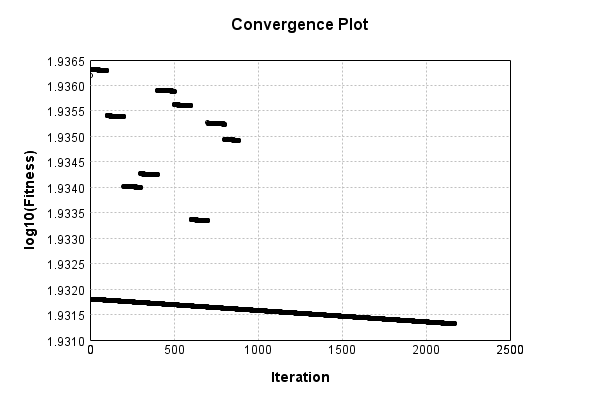


Code from [EncodingProblem.java:132](../../../../../../../../src/main/java/com/simiacryptus/mindseye/test/EncodingProblem.java#L132) executed in 0.00 seconds: 
```java
    return TestUtil.plotTime(history);
```

Returns: 

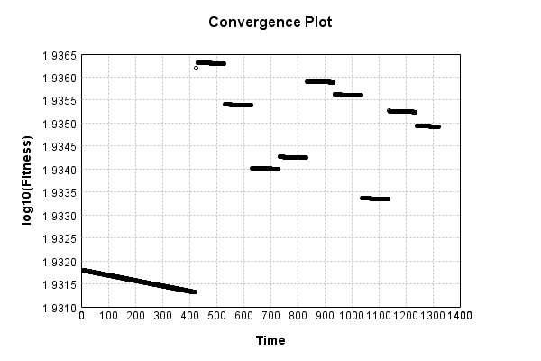


Saved model as [encoding_model8.json](etc/encoding_model8.json)

### Results
Code from [EncodingProblem.java:142](../../../../../../../../src/main/java/com/simiacryptus/mindseye/test/EncodingProblem.java#L142) executed in 0.06 seconds: 
```java
    TableOutput table = new TableOutput();
    Arrays.stream(trainingData).map(tensorArray -> {
      try {
        Tensor predictionSignal = GpuController.call(ctx -> testNetwork.eval(ctx, tensorArray)).getData().get(0);
        LinkedHashMap<String, Object> row = new LinkedHashMap<String, Object>();
        row.put("Source", log.image(tensorArray[1].toImage(), ""));
        row.put("Echo", log.image(predictionSignal.toImage(), ""));
        return row;
      } catch (IOException e) {
        throw new RuntimeException(e);
      }
    }).filter(x -> null != x).limit(10).forEach(table::putRow);
    return table;
```

Returns: 

Source | Echo
------ | ----
 | 
 | 
 | 
 | 
 | 
 | 
 | 
 | 
 | 
 | 


Learned Model Statistics:

Code from [EncodingProblem.java:159](../../../../../../../../src/main/java/com/simiacryptus/mindseye/test/EncodingProblem.java#L159) executed in 0.00 seconds: 
```java
    ScalarStatistics scalarStatistics = new ScalarStatistics();
    trainingNetwork.state().stream().flatMapToDouble(x -> Arrays.stream(x))
      .forEach(v -> scalarStatistics.add(v));
    return scalarStatistics.getMetrics();
```

Returns: 

```
    {meanExponent=-1.425327969165597, negative=3988, min=-0.12546717753368275, max=1.0, mean=0.011966918220409635, count=8626.0, positive=4637, stdDev=0.09357970827403428, zeros=1}
```


Learned Representation Statistics:

Code from [EncodingProblem.java:167](../../../../../../../../src/main/java/com/simiacryptus/mindseye/test/EncodingProblem.java#L167) executed in 0.03 seconds: 
```java
    ScalarStatistics scalarStatistics = new ScalarStatistics();
    Arrays.stream(trainingData)
      .flatMapToDouble(row -> Arrays.stream(row[0].getData()))
      .forEach(v -> scalarStatistics.add(v));
    return scalarStatistics.getMetrics();
```

Returns: 

```
    {meanExponent=-1.7349882150921818, negative=299685, min=-0.05242138520160671, max=0.0521776014119818, mean=3.9593284270324896E-5, count=600000.0, positive=300315, stdDev=0.02887897345803831, zeros=0}
```


Some rendered unit vectors:


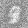


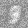


## SGD
The vector-to-image network is a single fully connected layer:

Code from [MnistTests.java:79](../../../../../../../../src/test/java/com/simiacryptus/mindseye/labs/matrix/MnistTests.java#L79) executed in 0.00 seconds: 
```java
    PipelineNetwork network = new PipelineNetwork();
    network.add(new FullyConnectedLayer(new int[]{features}, new int[]{28, 28, 1})
      .setWeights(() -> 0.25 * (Math.random() - 0.5)));
    network.add(new BiasLayer(28, 28, 1));
    return network;
```

Returns: 

```
    PipelineNetwork/be3fa524-d299-46da-a137-99c8f915d707
```


### Network Diagram
Code from [EncodingProblem.java:91](../../../../../../../../src/main/java/com/simiacryptus/mindseye/test/EncodingProblem.java#L91) executed in 0.09 seconds: 
```java
    return Graphviz.fromGraph(TestUtil.toGraph(imageNetwork))
      .height(400).width(600).render(Format.PNG).toImage();
```

Returns: 

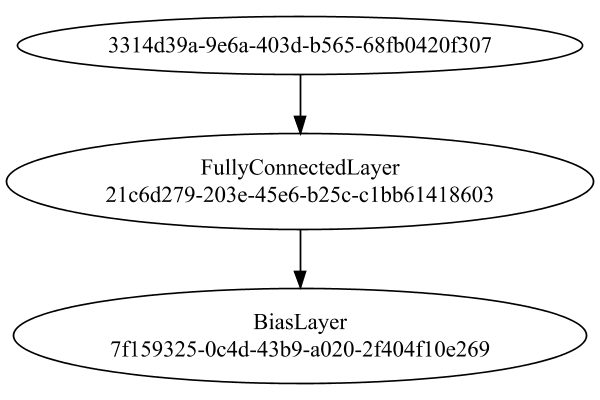


### Training
We start by training with a very small population to improve initial convergence performance:

Adding performance wrappers

Code from [TestUtil.java:269](../../../../../../../../src/main/java/com/simiacryptus/mindseye/test/TestUtil.java#L269) executed in 0.00 seconds: 
```java
    network.visitNodes(node -> {
      if (!(node.getLayer() instanceof MonitoringWrapperLayer)) {
        node.setLayer(new MonitoringWrapperLayer(node.getLayer()).shouldRecordSignalMetrics(false));
      }
      else {
        ((MonitoringWrapperLayer) node.getLayer()).shouldRecordSignalMetrics(false);
      }
    });
```

Optimized via the Stochastic Gradient Descent method with momentum and adaptve learning rate:

Code from [TextbookOptimizers.java:58](../../../../../../../../src/test/java/com/simiacryptus/mindseye/labs/matrix/TextbookOptimizers.java#L58) executed in 0.00 seconds: 
```java
    double carryOver = 0.5;
    ValidatingTrainer trainer = new ValidatingTrainer(trainingSubject, validationSubject)
      .setMaxEpochIterations(100)
      .setMonitor(monitor);
    trainer.getRegimen().get(0)
      .setOrientation(new MomentumStrategy(new GradientDescent()).setCarryOver(carryOver))
      .setLineSearchFactory(name -> new ArmijoWolfeSearch());
    return trainer;
```

Returns: 

```
    com.simiacryptus.mindseye.opt.ValidatingTrainer@49fc62fc
```


Code from [EncodingProblem.java:113](../../../../../../../../src/main/java/com/simiacryptus/mindseye/test/EncodingProblem.java#L113) executed in 420.39 seconds: 
```java
    preTrainer.setTimeout(timeoutMinutes / 2, TimeUnit.MINUTES).setMaxIterations(batchSize).run();
```
Logging: 
```
    Epoch parameters: 5000, 1
    Phase 0: TrainingPhase{trainingSubject=PerformanceWrapper{inner=SampledArrayTrainable{inner=ArrayTrainable{inner=com.simiacryptus.mindseye.eval.GpuTrainable@1a309961}}}, orientation=com.simiacryptus.mindseye.opt.orient.MomentumStrategy@3071f359}
    resetAndMeasure; trainingSize=5000
    Constructing line search parameters: 
    th(0)=85.46827315024593;dx=-0.0014773818416204182
    New Minimum: 85.46827315024593 > 85.46639122192988
    WOLFE (weak): th(2.154434690031884)=85.46639122192988; dx=-0.0016035037903281894 delta=0.0018819283160524947
    New Minimum: 85.46639122192988 > 85.46450935965356
    WOLFE (weak): th(4.308869380063768)=85.46450935965356; dx=-0.001461641518443232 delta=0.003763790592373084
    New Minimum: 85.46450935965356 > 85.45698257103896
    WOLFE (weak): th(12.926608140191302)=85.45698257103896; dx=-0.0015881910960676236 delta=0.011290579206971074
    New Minimum: 85.45698257103896 > 85.42312510707819
    WOLFE (weak): th(51.70643256076521)=85.42312510707819; dx=-0.0015211928295741737 delta=0
```
...[skipping 936635 bytes](etc/31.txt)...
```
    .371 in line search; 0.362 eval time)
    th(0)=45.07782933457986;dx=-1.5588578710452068E-6
    Armijo: th(380.74584433161505)=45.07819547131609; dx=5.294614116513234E-6 delta=-3.661367362326473E-4
    Armijo: th(190.37292216580752)=45.07784972398734; dx=1.9770675180809715E-6 delta=-2.038940748150253E-5
    New Minimum: 45.07782933457986 > 45.07779999103249
    END: th(63.45764072193584)=45.07779999103249; dx=-3.103852502924638E-7 delta=2.9343547367943756E-5
    Overall network state change: {FullyConnectedLayer=1.0000189404401867, BiasLayer=0.9999639383927224, PlaceholderLayer=9.9996e-01 +- 9.8465e-06 [9.9994e-01 - 1.0000e+00] (1000#)}
    Iteration 1406 complete. Error: 45.07779999103249 (100 in 0.254 seconds; 0.008 in orientation, 0.000 in gc, 0.245 in line search; 0.234 eval time)
    Training timeout
    Epoch 19 result with 24 iterations, 100/2147483647 samples: {validation *= 2^-0.00002; training *= 2^-0.000; Overtraining = 1.00}, {itr*=170.75, len*=0.71} 0 since improvement; 0.2255 validation time
    Training 19 runPhase halted
    
```

Per-layer Performance Metrics:

Code from [TestUtil.java:234](../../../../../../../../src/main/java/com/simiacryptus/mindseye/test/TestUtil.java#L234) executed in 0.00 seconds: 
```java
    Map<NNLayer, MonitoringWrapperLayer> metrics = new HashMap<>();
    network.visitNodes(node -> {
      if ((node.getLayer() instanceof MonitoringWrapperLayer)) {
        MonitoringWrapperLayer layer = node.getLayer();
        metrics.put(layer.getInner(), layer);
      }
    });
    System.out.println("Forward Performance: \n\t" + metrics.entrySet().stream().map(e -> {
      PercentileStatistics performance = e.getValue().getForwardPerformance();
      return String.format("%s -> %.6fs +- %.6fs (%s)", e.getKey(), performance.getMean(), performance.getStdDev(), performance.getCount());
    }).reduce((a, b) -> a + "\n\t" + b));
    System.out.println("Backward Performance: \n\t" + metrics.entrySet().stream().map(e -> {
      PercentileStatistics performance = e.getValue().getBackwardPerformance();
      return String.format("%s -> %.6fs +- %.6fs (%s)", e.getKey(), performance.getMean(), performance.getStdDev(), performance.getCount());
    }).reduce((a, b) -> a + "\n\t" + b));
```
Logging: 
```
    Forward Performance: 
    	Optional[NthPowerActivationLayer/063b4a11-00d7-4baf-bd2a-3ac054ed4815 -> 0.000662s +- 0.004979s (8696.0)
    	SumInputsLayer/a6edd989-5b4a-4e0a-b822-5046b04d7cce -> 0.000413s +- 0.003032s (8696.0)
    	MeanSqLossLayer/46b2aa44-350d-49c4-9a8a-74c12985fe75 -> 0.003556s +- 0.013781s (8696.0)
    	PipelineNetwork/be3fa524-d299-46da-a137-99c8f915d707 -> 0.009558s +- 0.018815s (8696.0)
    	SoftmaxActivationLayer/78dfd277-46ff-4b7d-b791-cf33471c09a9 -> 0.001495s +- 0.004488s (8696.0)
    	LinearActivationLayer/6a6b33db-e3fd-4c6c-944b-b3fc1730dcdb -> 0.000840s +- 0.009561s (8696.0)
    	EntropyLossLayer/8b2e3288-fe4a-43f0-a8f2-39d4942a844e -> 0.000805s +- 0.005196s (8696.0)]
    Backward Performance: 
    	Optional[NthPowerActivationLayer/063b4a11-00d7-4baf-bd2a-3ac054ed4815 -> 0.000002s +- 0.000024s (8696.0)
    	SumInputsLayer/a6edd989-5b4a-4e0a-b822-5046b04d7cce -> 0.000000s +- 0.000000s (8696.0)
    	MeanSqLossLayer/46b2aa44-350d-49c4-9a8a-74c12985fe75 -> 0.000011s +- 0.000051s (8696.0)
    	PipelineNetwork/be3fa524-d299-46da-a137-99c8f915d707 -> 0.000067s +- 0.000100s (8696.0)
    	SoftmaxActivationLayer/78dfd277-46ff-4b7d-b791-cf33471c09a9 -> 0.000002s +- 0.000018s (8656.0)
    	LinearActivationLayer/6a6b33db-e3fd-4c6c-944b-b3fc1730dcdb -> 0.000001s +- 0.000012s (8656.0)
    	EntropyLossLayer/8b2e3288-fe4a-43f0-a8f2-39d4942a844e -> 0.000003s +- 0.000023s (8656.0)]
    
```

Removing performance wrappers

Code from [TestUtil.java:252](../../../../../../../../src/main/java/com/simiacryptus/mindseye/test/TestUtil.java#L252) executed in 0.00 seconds: 
```java
    network.visitNodes(node -> {
      if (node.getLayer() instanceof MonitoringWrapperLayer) {
        node.setLayer(node.<MonitoringWrapperLayer>getLayer().getInner());
      }
    });
```

Then our main training phase:

Adding performance wrappers

Code from [TestUtil.java:269](../../../../../../../../src/main/java/com/simiacryptus/mindseye/test/TestUtil.java#L269) executed in 0.00 seconds: 
```java
    network.visitNodes(node -> {
      if (!(node.getLayer() instanceof MonitoringWrapperLayer)) {
        node.setLayer(new MonitoringWrapperLayer(node.getLayer()).shouldRecordSignalMetrics(false));
      }
      else {
        ((MonitoringWrapperLayer) node.getLayer()).shouldRecordSignalMetrics(false);
      }
    });
```

Optimized via the Stochastic Gradient Descent method with momentum and adaptve learning rate:

Code from [TextbookOptimizers.java:58](../../../../../../../../src/test/java/com/simiacryptus/mindseye/labs/matrix/TextbookOptimizers.java#L58) executed in 0.00 seconds: 
```java
    double carryOver = 0.5;
    ValidatingTrainer trainer = new ValidatingTrainer(trainingSubject, validationSubject)
      .setMaxEpochIterations(100)
      .setMonitor(monitor);
    trainer.getRegimen().get(0)
      .setOrientation(new MomentumStrategy(new GradientDescent()).setCarryOver(carryOver))
      .setLineSearchFactory(name -> new ArmijoWolfeSearch());
    return trainer;
```

Returns: 

```
    com.simiacryptus.mindseye.opt.ValidatingTrainer@2372fdd0
```


Code from [EncodingProblem.java:123](../../../../../../../../src/main/java/com/simiacryptus/mindseye/test/EncodingProblem.java#L123) executed in 145.88 seconds: 
```java
    mainTrainer.setTimeout(timeoutMinutes, TimeUnit.MINUTES).setMaxIterations(batchSize).run();
```
Logging: 
```
    Epoch parameters: 5000, 1
    Phase 0: TrainingPhase{trainingSubject=PerformanceWrapper{inner=SampledArrayTrainable{inner=ArrayTrainable{inner=com.simiacryptus.mindseye.eval.GpuTrainable@5d6914c3}}}, orientation=com.simiacryptus.mindseye.opt.orient.MomentumStrategy@1761fa6f}
    resetAndMeasure; trainingSize=5000
    Constructing line search parameters: 
    th(0)=75.46184782583092;dx=-0.00765409600915812
    New Minimum: 75.46184782583092 > 75.45346069522377
    WOLFE (weak): th(2.154434690031884)=75.45346069522377; dx=-0.007658069810761854 delta=0.008387130607147242
    New Minimum: 75.45346069522377 > 75.44507454470804
    WOLFE (weak): th(4.308869380063768)=75.44507454470804; dx=-0.007676847766970549 delta=0.016773281122880235
    New Minimum: 75.44507454470804 > 75.41153977670824
    WOLFE (weak): th(12.926608140191302)=75.41153977670824; dx=-0.007666140143343804 delta=0.050308049122676834
    New Minimum: 75.41153977670824 > 75.26083054831858
    WOLFE (weak): th(51.70643256076521)=75.26083054831858; dx=-0.007634286914677198 delta=0.20101
```
...[skipping 55286 bytes](etc/32.txt)...
```
    5; dx=-5.29386284966125E-6 delta=0.016494205990341015
    Overall network state change: {FullyConnectedLayer=1.0026680431049717, BiasLayer=1.001203209656685, PlaceholderLayer=9.8651e-01 +- 4.4788e-03 [8.9095e-01 - 1.0055e+00] (5000#)}
    Iteration 84 complete. Error: 46.9424054861465 (5000 in 1.370 seconds; 0.041 in orientation, 0.619 in gc, 1.318 in line search; 1.272 eval time)
    th(0)=46.9424054861465;dx=-2.759365506434051E-5
    MAX ALPHA: th(0)=46.9424054861465;th'(0)=-2.759365506434051E-5;
    Overall network state change: {FullyConnectedLayer=1.0, BiasLayer=1.0, PlaceholderLayer=1.0000e+00 +- 0.0000e+00 [1.0000e+00 - 1.0000e+00] (5000#)}
    Iteration 85 failed, aborting. Error: 46.9424054861465 (5000 in 0.959 seconds; 0.045 in orientation, 0.179 in gc, 0.907 in line search; 0.878 eval time)
    Epoch 4 result with 48 iterations, 5000/2147483647 samples: {validation *= 2^-0.04339; training *= 2^-0.521; Overtraining = 12.01}, {itr*=3.44, len*=2.45} 0 since improvement; 4.3218 validation time
    Training 4 runPhase halted
    
```

Per-layer Performance Metrics:

Code from [TestUtil.java:234](../../../../../../../../src/main/java/com/simiacryptus/mindseye/test/TestUtil.java#L234) executed in 0.00 seconds: 
```java
    Map<NNLayer, MonitoringWrapperLayer> metrics = new HashMap<>();
    network.visitNodes(node -> {
      if ((node.getLayer() instanceof MonitoringWrapperLayer)) {
        MonitoringWrapperLayer layer = node.getLayer();
        metrics.put(layer.getInner(), layer);
      }
    });
    System.out.println("Forward Performance: \n\t" + metrics.entrySet().stream().map(e -> {
      PercentileStatistics performance = e.getValue().getForwardPerformance();
      return String.format("%s -> %.6fs +- %.6fs (%s)", e.getKey(), performance.getMean(), performance.getStdDev(), performance.getCount());
    }).reduce((a, b) -> a + "\n\t" + b));
    System.out.println("Backward Performance: \n\t" + metrics.entrySet().stream().map(e -> {
      PercentileStatistics performance = e.getValue().getBackwardPerformance();
      return String.format("%s -> %.6fs +- %.6fs (%s)", e.getKey(), performance.getMean(), performance.getStdDev(), performance.getCount());
    }).reduce((a, b) -> a + "\n\t" + b));
```
Logging: 
```
    Forward Performance: 
    	Optional[NthPowerActivationLayer/063b4a11-00d7-4baf-bd2a-3ac054ed4815 -> 0.003565s +- 0.013094s (580.0)
    	SumInputsLayer/a6edd989-5b4a-4e0a-b822-5046b04d7cce -> 0.003461s +- 0.018252s (580.0)
    	MeanSqLossLayer/46b2aa44-350d-49c4-9a8a-74c12985fe75 -> 0.026207s +- 0.047158s (580.0)
    	PipelineNetwork/be3fa524-d299-46da-a137-99c8f915d707 -> 0.049257s +- 0.040044s (580.0)
    	SoftmaxActivationLayer/78dfd277-46ff-4b7d-b791-cf33471c09a9 -> 0.009835s +- 0.013501s (580.0)
    	LinearActivationLayer/6a6b33db-e3fd-4c6c-944b-b3fc1730dcdb -> 0.002424s +- 0.011105s (580.0)
    	EntropyLossLayer/8b2e3288-fe4a-43f0-a8f2-39d4942a844e -> 0.006128s +- 0.016140s (580.0)]
    Backward Performance: 
    	Optional[NthPowerActivationLayer/063b4a11-00d7-4baf-bd2a-3ac054ed4815 -> 0.000001s +- 0.000005s (580.0)
    	SumInputsLayer/a6edd989-5b4a-4e0a-b822-5046b04d7cce -> 0.000000s +- 0.000000s (580.0)
    	MeanSqLossLayer/46b2aa44-350d-49c4-9a8a-74c12985fe75 -> 0.000007s +- 0.000015s (580.0)
    	PipelineNetwork/be3fa524-d299-46da-a137-99c8f915d707 -> 0.000064s +- 0.000038s (580.0)
    	SoftmaxActivationLayer/78dfd277-46ff-4b7d-b791-cf33471c09a9 -> 0.000002s +- 0.000007s (520.0)
    	LinearActivationLayer/6a6b33db-e3fd-4c6c-944b-b3fc1730dcdb -> 0.000001s +- 0.000007s (520.0)
    	EntropyLossLayer/8b2e3288-fe4a-43f0-a8f2-39d4942a844e -> 0.000004s +- 0.000011s (520.0)]
    
```

Removing performance wrappers

Code from [TestUtil.java:252](../../../../../../../../src/main/java/com/simiacryptus/mindseye/test/TestUtil.java#L252) executed in 0.00 seconds: 
```java
    network.visitNodes(node -> {
      if (node.getLayer() instanceof MonitoringWrapperLayer) {
        node.setLayer(node.<MonitoringWrapperLayer>getLayer().getInner());
      }
    });
```

Code from [EncodingProblem.java:129](../../../../../../../../src/main/java/com/simiacryptus/mindseye/test/EncodingProblem.java#L129) executed in 0.01 seconds: 
```java
    return TestUtil.plot(history);
```

Returns: 

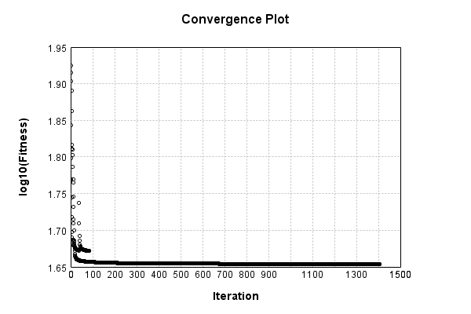


Code from [EncodingProblem.java:132](../../../../../../../../src/main/java/com/simiacryptus/mindseye/test/EncodingProblem.java#L132) executed in 0.00 seconds: 
```java
    return TestUtil.plotTime(history);
```

Returns: 

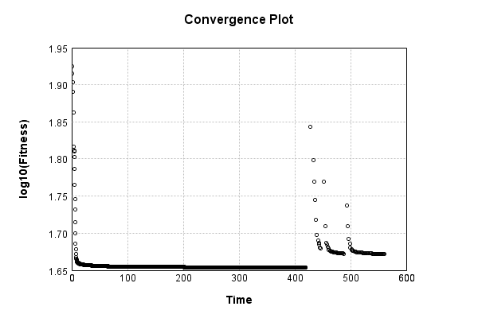


Saved model as [encoding_model9.json](etc/encoding_model9.json)

### Results
Code from [EncodingProblem.java:142](../../../../../../../../src/main/java/com/simiacryptus/mindseye/test/EncodingProblem.java#L142) executed in 0.07 seconds: 
```java
    TableOutput table = new TableOutput();
    Arrays.stream(trainingData).map(tensorArray -> {
      try {
        Tensor predictionSignal = GpuController.call(ctx -> testNetwork.eval(ctx, tensorArray)).getData().get(0);
        LinkedHashMap<String, Object> row = new LinkedHashMap<String, Object>();
        row.put("Source", log.image(tensorArray[1].toImage(), ""));
        row.put("Echo", log.image(predictionSignal.toImage(), ""));
        return row;
      } catch (IOException e) {
        throw new RuntimeException(e);
      }
    }).filter(x -> null != x).limit(10).forEach(table::putRow);
    return table;
```

Returns: 

Source | Echo
------ | ----
 | 
 | 
 | 
 | 
 | 
 | 
 | 
 | 
 | 
 | 


Learned Model Statistics:

Code from [EncodingProblem.java:159](../../../../../../../../src/main/java/com/simiacryptus/mindseye/test/EncodingProblem.java#L159) executed in 0.00 seconds: 
```java
    ScalarStatistics scalarStatistics = new ScalarStatistics();
    trainingNetwork.state().stream().flatMapToDouble(x -> Arrays.stream(x))
      .forEach(v -> scalarStatistics.add(v));
    return scalarStatistics.getMetrics();
```

Returns: 

```
    {meanExponent=-1.2111298996267443, negative=4436, min=-26.5222876225597, max=112.95953005766249, mean=1.557648176132854, count=8626.0, positive=4189, stdDev=11.256197676510753, zeros=1}
```


Learned Representation Statistics:

Code from [EncodingProblem.java:167](../../../../../../../../src/main/java/com/simiacryptus/mindseye/test/EncodingProblem.java#L167) executed in 0.03 seconds: 
```java
    ScalarStatistics scalarStatistics = new ScalarStatistics();
    Arrays.stream(trainingData)
      .flatMapToDouble(row -> Arrays.stream(row[0].getData()))
      .forEach(v -> scalarStatistics.add(v));
    return scalarStatistics.getMetrics();
```

Returns: 

```
    {meanExponent=-1.176737285005823, negative=298768, min=-30.801586839951206, max=39.944054727949585, mean=0.033408559363720794, count=600000.0, positive=301232, stdDev=1.9370494390890631, zeros=0}
```


Some rendered unit vectors:


## CGD
The vector-to-image network is a single fully connected layer:

Code from [MnistTests.java:79](../../../../../../../../src/test/java/com/simiacryptus/mindseye/labs/matrix/MnistTests.java#L79) executed in 0.00 seconds: 
```java
    PipelineNetwork network = new PipelineNetwork();
    network.add(new FullyConnectedLayer(new int[]{features}, new int[]{28, 28, 1})
      .setWeights(() -> 0.25 * (Math.random() - 0.5)));
    network.add(new BiasLayer(28, 28, 1));
    return network;
```

Returns: 

```
    PipelineNetwork/48973a92-54d7-4d15-acb3-e813873a6521
```


### Network Diagram
Code from [EncodingProblem.java:91](../../../../../../../../src/main/java/com/simiacryptus/mindseye/test/EncodingProblem.java#L91) executed in 0.11 seconds: 
```java
    return Graphviz.fromGraph(TestUtil.toGraph(imageNetwork))
      .height(400).width(600).render(Format.PNG).toImage();
```

Returns: 

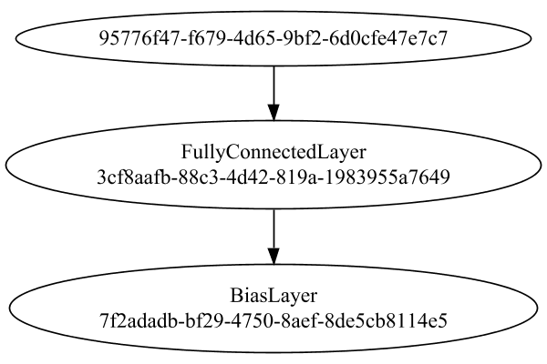


### Training
We start by training with a very small population to improve initial convergence performance:

Adding performance wrappers

Code from [TestUtil.java:269](../../../../../../../../src/main/java/com/simiacryptus/mindseye/test/TestUtil.java#L269) executed in 0.00 seconds: 
```java
    network.visitNodes(node -> {
      if (!(node.getLayer() instanceof MonitoringWrapperLayer)) {
        node.setLayer(new MonitoringWrapperLayer(node.getLayer()).shouldRecordSignalMetrics(false));
      }
      else {
        ((MonitoringWrapperLayer) node.getLayer()).shouldRecordSignalMetrics(false);
      }
    });
```

Optimized via the Conjugate Gradient Descent method:

Code from [TextbookOptimizers.java:74](../../../../../../../../src/test/java/com/simiacryptus/mindseye/labs/matrix/TextbookOptimizers.java#L74) executed in 0.00 seconds: 
```java
    ValidatingTrainer trainer = new ValidatingTrainer(trainingSubject, validationSubject)
      .setMinTrainingSize(Integer.MAX_VALUE)
      .setMonitor(monitor);
    trainer.getRegimen().get(0)
      .setOrientation(new GradientDescent())
      .setLineSearchFactory(name -> new QuadraticSearch().setRelativeTolerance(1e-5));
    return trainer;
```

Returns: 

```
    com.simiacryptus.mindseye.opt.ValidatingTrainer@68073ee0
```


Code from [EncodingProblem.java:113](../../../../../../../../src/main/java/com/simiacryptus/mindseye/test/EncodingProblem.java#L113) executed in 421.62 seconds: 
```java
    preTrainer.setTimeout(timeoutMinutes / 2, TimeUnit.MINUTES).setMaxIterations(batchSize).run();
```
Logging: 
```
    Epoch parameters: 5000, 1
    Phase 0: TrainingPhase{trainingSubject=PerformanceWrapper{inner=SampledArrayTrainable{inner=ArrayTrainable{inner=com.simiacryptus.mindseye.eval.GpuTrainable@cecf0c8}}}, orientation=com.simiacryptus.mindseye.opt.orient.GradientDescent@5dcd2f8b}
    resetAndMeasure; trainingSize=5000
    Constructing line search parameters: GD
    F(0.0) = LineSearchPoint{point=PointSample{avg=85.46826376420461}, derivative=-0.0015548628952272887}
    New Minimum: 85.46826376420461 > 85.46826376420452
    F(1.0E-10) = LineSearchPoint{point=PointSample{avg=85.46826376420452}, derivative=-0.0015354176170819555}, delta = -8.526512829121202E-14
    New Minimum: 85.46826376420452 > 85.46826376420398
    F(7.000000000000001E-10) = LineSearchPoint{point=PointSample{avg=85.46826376420398}, derivative=-0.0015692685354003347}, delta = -6.252776074688882E-13
    New Minimum: 85.46826376420398 > 85.46826376420023
    F(4.900000000000001E-9) = LineSearchPoint{point=PointSample{avg=85.46826376420023}, derivative=-0.0015221608424402437}, delt
```
...[skipping 687636 bytes](etc/33.txt)...
```
    94004456E-8}, delta = -2.131568576047016E-4
    Left bracket at 460.027329065821
    F(460.119199661562) = LineSearchPoint{point=PointSample{avg=45.23984288606984}, derivative=-6.208486734276605E-9}, delta = -2.131585759883592E-4
    Left bracket at 460.119199661562
    F(460.12477161122774) = LineSearchPoint{point=PointSample{avg=45.239842885966155}, derivative=1.815167690289538E-9}, delta = -2.131586796707552E-4
    45.239842885966155 > 45.239842885748104
    Overall network state change: {FullyConnectedLayer=1.0004386968643326, BiasLayer=1.0000115509455647, PlaceholderLayer=9.9936e-01 +- 1.1497e-04 [9.9897e-01 - 9.9990e-01] (1000#)}
    Iteration 354 complete. Error: 45.239842885748104 (5000 in 1.686 seconds; 0.004 in orientation, 0.567 in gc, 1.681 in line search; 1.642 eval time)
    Training timeout
    Epoch 21 result with 20 iterations, 5000/2147483647 samples: {validation *= 2^-0.00013; training *= 2^-0.000; Overtraining = 1.00}, {itr*=62.30, len*=0.71} 0 since improvement; 0.0447 validation time
    Training 21 runPhase halted
    
```

Per-layer Performance Metrics:

Code from [TestUtil.java:234](../../../../../../../../src/main/java/com/simiacryptus/mindseye/test/TestUtil.java#L234) executed in 0.00 seconds: 
```java
    Map<NNLayer, MonitoringWrapperLayer> metrics = new HashMap<>();
    network.visitNodes(node -> {
      if ((node.getLayer() instanceof MonitoringWrapperLayer)) {
        MonitoringWrapperLayer layer = node.getLayer();
        metrics.put(layer.getInner(), layer);
      }
    });
    System.out.println("Forward Performance: \n\t" + metrics.entrySet().stream().map(e -> {
      PercentileStatistics performance = e.getValue().getForwardPerformance();
      return String.format("%s -> %.6fs +- %.6fs (%s)", e.getKey(), performance.getMean(), performance.getStdDev(), performance.getCount());
    }).reduce((a, b) -> a + "\n\t" + b));
    System.out.println("Backward Performance: \n\t" + metrics.entrySet().stream().map(e -> {
      PercentileStatistics performance = e.getValue().getBackwardPerformance();
      return String.format("%s -> %.6fs +- %.6fs (%s)", e.getKey(), performance.getMean(), performance.getStdDev(), performance.getCount());
    }).reduce((a, b) -> a + "\n\t" + b));
```
Logging: 
```
    Forward Performance: 
    	Optional[SoftmaxActivationLayer/8709a83f-06bf-4200-b2ff-1f2eaf66e40d -> 0.001462s +- 0.003815s (9302.0)
    	EntropyLossLayer/57d71749-e868-4abb-b57e-057095aab8bd -> 0.000746s +- 0.003710s (9302.0)
    	LinearActivationLayer/8f5ff53d-61ad-4ff9-ab71-f0f98d135119 -> 0.000659s +- 0.007216s (9302.0)
    	MeanSqLossLayer/ee2e850d-ee91-454d-8494-141b97feaf48 -> 0.003437s +- 0.012780s (9302.0)
    	PipelineNetwork/48973a92-54d7-4d15-acb3-e813873a6521 -> 0.009870s +- 0.020275s (9302.0)
    	NthPowerActivationLayer/5e163231-f989-490e-b877-9acbbf432ac2 -> 0.000618s +- 0.003621s (9302.0)
    	SumInputsLayer/0b5419c2-26ba-45d0-b937-2d377f810162 -> 0.000435s +- 0.003666s (9302.0)]
    Backward Performance: 
    	Optional[SoftmaxActivationLayer/8709a83f-06bf-4200-b2ff-1f2eaf66e40d -> 0.000001s +- 0.000013s (9258.0)
    	EntropyLossLayer/57d71749-e868-4abb-b57e-057095aab8bd -> 0.000003s +- 0.000019s (9258.0)
    	LinearActivationLayer/8f5ff53d-61ad-4ff9-ab71-f0f98d135119 -> 0.000001s +- 0.000008s (9258.0)
    	MeanSqLossLayer/ee2e850d-ee91-454d-8494-141b97feaf48 -> 0.000008s +- 0.000034s (9302.0)
    	PipelineNetwork/48973a92-54d7-4d15-acb3-e813873a6521 -> 0.000061s +- 0.000084s (9302.0)
    	NthPowerActivationLayer/5e163231-f989-490e-b877-9acbbf432ac2 -> 0.000002s +- 0.000013s (9302.0)
    	SumInputsLayer/0b5419c2-26ba-45d0-b937-2d377f810162 -> 0.000000s +- 0.000000s (9302.0)]
    
```

Removing performance wrappers

Code from [TestUtil.java:252](../../../../../../../../src/main/java/com/simiacryptus/mindseye/test/TestUtil.java#L252) executed in 0.00 seconds: 
```java
    network.visitNodes(node -> {
      if (node.getLayer() instanceof MonitoringWrapperLayer) {
        node.setLayer(node.<MonitoringWrapperLayer>getLayer().getInner());
      }
    });
```

Then our main training phase:

Adding performance wrappers

Code from [TestUtil.java:269](../../../../../../../../src/main/java/com/simiacryptus/mindseye/test/TestUtil.java#L269) executed in 0.00 seconds: 
```java
    network.visitNodes(node -> {
      if (!(node.getLayer() instanceof MonitoringWrapperLayer)) {
        node.setLayer(new MonitoringWrapperLayer(node.getLayer()).shouldRecordSignalMetrics(false));
      }
      else {
        ((MonitoringWrapperLayer) node.getLayer()).shouldRecordSignalMetrics(false);
      }
    });
```

Optimized via the Conjugate Gradient Descent method:

Code from [TextbookOptimizers.java:74](../../../../../../../../src/test/java/com/simiacryptus/mindseye/labs/matrix/TextbookOptimizers.java#L74) executed in 0.00 seconds: 
```java
    ValidatingTrainer trainer = new ValidatingTrainer(trainingSubject, validationSubject)
      .setMinTrainingSize(Integer.MAX_VALUE)
      .setMonitor(monitor);
    trainer.getRegimen().get(0)
      .setOrientation(new GradientDescent())
      .setLineSearchFactory(name -> new QuadraticSearch().setRelativeTolerance(1e-5));
    return trainer;
```

Returns: 

```
    com.simiacryptus.mindseye.opt.ValidatingTrainer@75297418
```


Code from [EncodingProblem.java:123](../../../../../../../../src/main/java/com/simiacryptus/mindseye/test/EncodingProblem.java#L123) executed in 905.90 seconds: 
```java
    mainTrainer.setTimeout(timeoutMinutes, TimeUnit.MINUTES).setMaxIterations(batchSize).run();
```
Logging: 
```
    Epoch parameters: 5000, 1
    Phase 0: TrainingPhase{trainingSubject=PerformanceWrapper{inner=SampledArrayTrainable{inner=ArrayTrainable{inner=com.simiacryptus.mindseye.eval.GpuTrainable@10b4cc93}}}, orientation=com.simiacryptus.mindseye.opt.orient.GradientDescent@6b6ad253}
    resetAndMeasure; trainingSize=5000
    Constructing line search parameters: GD
    F(0.0) = LineSearchPoint{point=PointSample{avg=67.526328937301}, derivative=-0.00251979642884055}
    New Minimum: 67.526328937301 > 67.52632893730086
    F(1.0E-10) = LineSearchPoint{point=PointSample{avg=67.52632893730086}, derivative=-0.0025202236413022962}, delta = -1.4210854715202004E-13
    New Minimum: 67.52632893730086 > 67.52632893730011
    F(7.000000000000001E-10) = LineSearchPoint{point=PointSample{avg=67.52632893730011}, derivative=-0.0025199642970656147}, delta = -8.952838470577262E-13
    New Minimum: 67.52632893730011 > 67.5263289372948
    F(4.900000000000001E-9) = LineSearchPoint{point=PointSample{avg=67.5263289372948}, derivative=-0.002519838975551866}, delta = -6.
```
...[skipping 291172 bytes](etc/34.txt)...
```
    
    F(2238.8822932537814) = LineSearchPoint{point=PointSample{avg=47.210317293996624}, derivative=1.1078200093610917E-5}, delta = -0.005873860599493241
    47.210317293996624 <= 47.21619115459612
    New Minimum: 47.20872285643297 > 47.208206454961775
    F(1478.5876603526376) = LineSearchPoint{point=PointSample{avg=47.208206454961775}, derivative=2.0522356858772093E-10}, delta = -0.007984699634342007
    Right bracket at 1478.5876603526376
    Converged to right
    Overall network state change: {FullyConnectedLayer=1.004127837446746, BiasLayer=1.0000243645458717, PlaceholderLayer=9.9666e-01 +- 3.4012e-03 [9.8250e-01 - 1.0145e+00] (5000#)}
    Iteration 145 complete. Error: 47.208206454961775 (5000 in 4.146 seconds; 0.022 in orientation, 1.287 in gc, 4.117 in line search; 4.007 eval time)
    Training timeout
    Epoch 9 result with 14 iterations, 5000/2147483647 samples: {validation *= 2^-0.02126; training *= 2^-0.295; Overtraining = 13.87}, {itr*=4.92, len*=2.63} 0 since improvement; 4.0857 validation time
    Training 9 runPhase halted
    
```

Per-layer Performance Metrics:

Code from [TestUtil.java:234](../../../../../../../../src/main/java/com/simiacryptus/mindseye/test/TestUtil.java#L234) executed in 0.00 seconds: 
```java
    Map<NNLayer, MonitoringWrapperLayer> metrics = new HashMap<>();
    network.visitNodes(node -> {
      if ((node.getLayer() instanceof MonitoringWrapperLayer)) {
        MonitoringWrapperLayer layer = node.getLayer();
        metrics.put(layer.getInner(), layer);
      }
    });
    System.out.println("Forward Performance: \n\t" + metrics.entrySet().stream().map(e -> {
      PercentileStatistics performance = e.getValue().getForwardPerformance();
      return String.format("%s -> %.6fs +- %.6fs (%s)", e.getKey(), performance.getMean(), performance.getStdDev(), performance.getCount());
    }).reduce((a, b) -> a + "\n\t" + b));
    System.out.println("Backward Performance: \n\t" + metrics.entrySet().stream().map(e -> {
      PercentileStatistics performance = e.getValue().getBackwardPerformance();
      return String.format("%s -> %.6fs +- %.6fs (%s)", e.getKey(), performance.getMean(), performance.getStdDev(), performance.getCount());
    }).reduce((a, b) -> a + "\n\t" + b));
```
Logging: 
```
    Forward Performance: 
    	Optional[SoftmaxActivationLayer/8709a83f-06bf-4200-b2ff-1f2eaf66e40d -> 0.009651s +- 0.018226s (3932.0)
    	EntropyLossLayer/57d71749-e868-4abb-b57e-057095aab8bd -> 0.007289s +- 0.024094s (3932.0)
    	LinearActivationLayer/8f5ff53d-61ad-4ff9-ab71-f0f98d135119 -> 0.002239s +- 0.009355s (3932.0)
    	MeanSqLossLayer/ee2e850d-ee91-454d-8494-141b97feaf48 -> 0.019739s +- 0.035469s (3932.0)
    	PipelineNetwork/48973a92-54d7-4d15-acb3-e813873a6521 -> 0.046238s +- 0.036447s (3932.0)
    	NthPowerActivationLayer/5e163231-f989-490e-b877-9acbbf432ac2 -> 0.003838s +- 0.015936s (3932.0)
    	SumInputsLayer/0b5419c2-26ba-45d0-b937-2d377f810162 -> 0.002819s +- 0.015230s (3932.0)]
    Backward Performance: 
    	Optional[SoftmaxActivationLayer/8709a83f-06bf-4200-b2ff-1f2eaf66e40d -> 0.000002s +- 0.000009s (3812.0)
    	EntropyLossLayer/57d71749-e868-4abb-b57e-057095aab8bd -> 0.000004s +- 0.000013s (3812.0)
    	LinearActivationLayer/8f5ff53d-61ad-4ff9-ab71-f0f98d135119 -> 0.000001s +- 0.000007s (3812.0)
    	MeanSqLossLayer/ee2e850d-ee91-454d-8494-141b97feaf48 -> 0.000008s +- 0.000017s (3932.0)
    	PipelineNetwork/48973a92-54d7-4d15-acb3-e813873a6521 -> 0.000063s +- 0.000037s (3932.0)
    	NthPowerActivationLayer/5e163231-f989-490e-b877-9acbbf432ac2 -> 0.000001s +- 0.000008s (3932.0)
    	SumInputsLayer/0b5419c2-26ba-45d0-b937-2d377f810162 -> 0.000000s +- 0.000002s (3932.0)]
    
```

Removing performance wrappers

Code from [TestUtil.java:252](../../../../../../../../src/main/java/com/simiacryptus/mindseye/test/TestUtil.java#L252) executed in 0.00 seconds: 
```java
    network.visitNodes(node -> {
      if (node.getLayer() instanceof MonitoringWrapperLayer) {
        node.setLayer(node.<MonitoringWrapperLayer>getLayer().getInner());
      }
    });
```

Code from [EncodingProblem.java:129](../../../../../../../../src/main/java/com/simiacryptus/mindseye/test/EncodingProblem.java#L129) executed in 0.00 seconds: 
```java
    return TestUtil.plot(history);
```

Returns: 

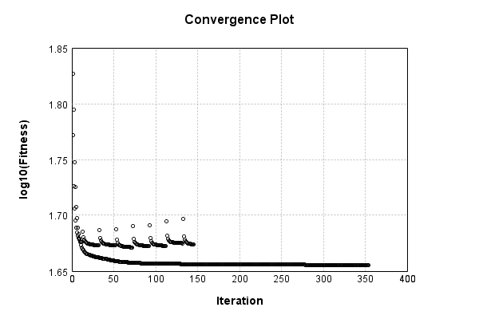


Code from [EncodingProblem.java:132](../../../../../../../../src/main/java/com/simiacryptus/mindseye/test/EncodingProblem.java#L132) executed in 0.00 seconds: 
```java
    return TestUtil.plotTime(history);
```

Returns: 

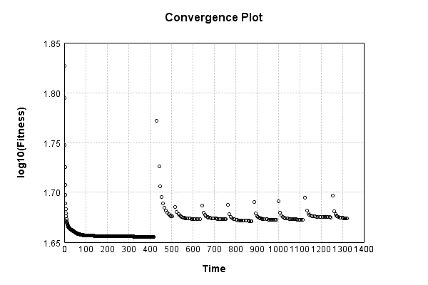


Saved model as [encoding_model10.json](etc/encoding_model10.json)

### Results
Code from [EncodingProblem.java:142](../../../../../../../../src/main/java/com/simiacryptus/mindseye/test/EncodingProblem.java#L142) executed in 0.07 seconds: 
```java
    TableOutput table = new TableOutput();
    Arrays.stream(trainingData).map(tensorArray -> {
      try {
        Tensor predictionSignal = GpuController.call(ctx -> testNetwork.eval(ctx, tensorArray)).getData().get(0);
        LinkedHashMap<String, Object> row = new LinkedHashMap<String, Object>();
        row.put("Source", log.image(tensorArray[1].toImage(), ""));
        row.put("Echo", log.image(predictionSignal.toImage(), ""));
        return row;
      } catch (IOException e) {
        throw new RuntimeException(e);
      }
    }).filter(x -> null != x).limit(10).forEach(table::putRow);
    return table;
```

Returns: 

Source | Echo
------ | ----
 | 
 | 
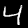 | 
 | 
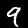 | 
 | 
 | 
 | 
 | 
 | 


Learned Model Statistics:

Code from [EncodingProblem.java:159](../../../../../../../../src/main/java/com/simiacryptus/mindseye/test/EncodingProblem.java#L159) executed in 0.00 seconds: 
```java
    ScalarStatistics scalarStatistics = new ScalarStatistics();
    trainingNetwork.state().stream().flatMapToDouble(x -> Arrays.stream(x))
      .forEach(v -> scalarStatistics.add(v));
    return scalarStatistics.getMetrics();
```

Returns: 

```
    {meanExponent=-1.798290145848151, negative=4438, min=-18.882144489810713, max=139.07619130741216, mean=2.9346198771229703, count=8626.0, positive=4187, stdDev=16.405509316310262, zeros=1}
```


Learned Representation Statistics:

Code from [EncodingProblem.java:167](../../../../../../../../src/main/java/com/simiacryptus/mindseye/test/EncodingProblem.java#L167) executed in 0.03 seconds: 
```java
    ScalarStatistics scalarStatistics = new ScalarStatistics();
    Arrays.stream(trainingData)
      .flatMapToDouble(row -> Arrays.stream(row[0].getData()))
      .forEach(v -> scalarStatistics.add(v));
    return scalarStatistics.getMetrics();
```

Returns: 

```
    {meanExponent=-0.6558042368256675, negative=306760, min=-22.541852265760987, max=24.723688106488936, mean=-0.015646913687592478, count=600000.0, positive=293240, stdDev=2.5464064716660446, zeros=0}
```


Some rendered unit vectors:


## L-BFGS
The vector-to-image network is a single fully connected layer:

Code from [MnistTests.java:79](../../../../../../../../src/test/java/com/simiacryptus/mindseye/labs/matrix/MnistTests.java#L79) executed in 0.00 seconds: 
```java
    PipelineNetwork network = new PipelineNetwork();
    network.add(new FullyConnectedLayer(new int[]{features}, new int[]{28, 28, 1})
      .setWeights(() -> 0.25 * (Math.random() - 0.5)));
    network.add(new BiasLayer(28, 28, 1));
    return network;
```

Returns: 

```
    PipelineNetwork/1966d3ad-2384-4aa0-bdea-cd9c3b69f474
```


### Network Diagram
Code from [EncodingProblem.java:91](../../../../../../../../src/main/java/com/simiacryptus/mindseye/test/EncodingProblem.java#L91) executed in 0.09 seconds: 
```java
    return Graphviz.fromGraph(TestUtil.toGraph(imageNetwork))
      .height(400).width(600).render(Format.PNG).toImage();
```

Returns: 

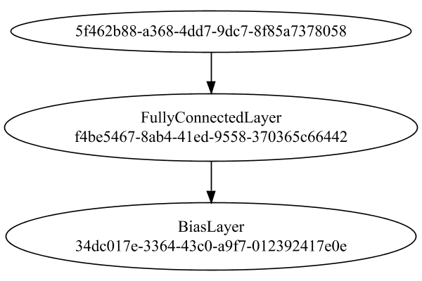


### Training
We start by training with a very small population to improve initial convergence performance:

Adding performance wrappers

Code from [TestUtil.java:269](../../../../../../../../src/main/java/com/simiacryptus/mindseye/test/TestUtil.java#L269) executed in 0.00 seconds: 
```java
    network.visitNodes(node -> {
      if (!(node.getLayer() instanceof MonitoringWrapperLayer)) {
        node.setLayer(new MonitoringWrapperLayer(node.getLayer()).shouldRecordSignalMetrics(false));
      }
      else {
        ((MonitoringWrapperLayer) node.getLayer()).shouldRecordSignalMetrics(false);
      }
    });
```

Optimized via the Limited-Memory BFGS method:

Code from [TextbookOptimizers.java:89](../../../../../../../../src/test/java/com/simiacryptus/mindseye/labs/matrix/TextbookOptimizers.java#L89) executed in 0.00 seconds: 
```java
    ValidatingTrainer trainer = new ValidatingTrainer(trainingSubject, validationSubject)
      .setMinTrainingSize(Integer.MAX_VALUE)
      .setMonitor(monitor);
    trainer.getRegimen().get(0)
      .setOrientation(new com.simiacryptus.mindseye.opt.orient.LBFGS())
      .setLineSearchFactory(name -> new ArmijoWolfeSearch()
        .setAlpha(name.contains("LBFGS") ? 1.0 : 1e-6));
    return trainer;
```

Returns: 

```
    com.simiacryptus.mindseye.opt.ValidatingTrainer@5c9ecbe9
```


Code from [EncodingProblem.java:113](../../../../../../../../src/main/java/com/simiacryptus/mindseye/test/EncodingProblem.java#L113) executed in 63.71 seconds: 
```java
    preTrainer.setTimeout(timeoutMinutes / 2, TimeUnit.MINUTES).setMaxIterations(batchSize).run();
```
Logging: 
```
    Epoch parameters: 5000, 1
    Phase 0: TrainingPhase{trainingSubject=PerformanceWrapper{inner=SampledArrayTrainable{inner=ArrayTrainable{inner=com.simiacryptus.mindseye.eval.GpuTrainable@126b46af}}}, orientation=com.simiacryptus.mindseye.opt.orient.LBFGS@38000688}
    resetAndMeasure; trainingSize=5000
    LBFGS Accumulation History: 1 points
    Constructing line search parameters: GD
    th(0)=85.46826334532479;dx=-0.0015240908945054346
    New Minimum: 85.46826334532479 > 85.46826334339528
    WOLFE (weak): th(2.1544346900318835E-6)=85.46826334339528; dx=-0.0016168608722028645 delta=1.9295072206659825E-9
    New Minimum: 85.46826334339528 > 85.46826334146577
    WOLFE (weak): th(4.308869380063767E-6)=85.46826334146577; dx=-0.0016077823277268917 delta=3.859014441331965E-9
    New Minimum: 85.46826334146577 > 85.46826333374773
    WOLFE (weak): th(1.2926608140191301E-5)=85.46826333374773; dx=-0.0015240331456546144 delta=1.157705753485061E-8
    New Minimum: 85.46826333374773 > 85.46826329901654
    WOLFE (weak): th(5.1706432560765204E-5)=85.46826
```
...[skipping 149043 bytes](etc/35.txt)...
```
    , 45.37430990975422, 45.373899737865855, 45.37233776015742
    Orientation vanished. Popping history element from 45.37555973253037, 45.37505461968735, 45.3747279260634, 45.37430990975422, 45.373899737865855
    Orientation vanished. Popping history element from 45.37555973253037, 45.37505461968735, 45.3747279260634, 45.37430990975422
    LBFGS Accumulation History: 3 points
    th(0)=45.366887861596595;dx=-7.049636312825576E-5
    MAX ALPHA: th(0)=45.366887861596595;th'(0)=-7.049636312825576E-5;
    Overall network state change: {FullyConnectedLayer=1.0, BiasLayer=1.0, PlaceholderLayer=1.0000e+00 +- 0.0000e+00 [1.0000e+00 - 1.0000e+00] (1000#)}
    Iteration 152 failed, aborting. Error: 45.366887861596595 (5000 in 0.228 seconds; 0.103 in orientation, 0.000 in gc, 0.123 in line search; 0.111 eval time)
    Epoch 10 result with 14 iterations, 5000/2147483647 samples: {validation *= 2^-0.00057; training *= 2^-0.001; Overtraining = 1.00}, {itr*=29.99, len*=0.71} 0 since improvement; 0.0499 validation time
    Training 10 runPhase halted
    
```

Per-layer Performance Metrics:

Code from [TestUtil.java:234](../../../../../../../../src/main/java/com/simiacryptus/mindseye/test/TestUtil.java#L234) executed in 0.00 seconds: 
```java
    Map<NNLayer, MonitoringWrapperLayer> metrics = new HashMap<>();
    network.visitNodes(node -> {
      if ((node.getLayer() instanceof MonitoringWrapperLayer)) {
        MonitoringWrapperLayer layer = node.getLayer();
        metrics.put(layer.getInner(), layer);
      }
    });
    System.out.println("Forward Performance: \n\t" + metrics.entrySet().stream().map(e -> {
      PercentileStatistics performance = e.getValue().getForwardPerformance();
      return String.format("%s -> %.6fs +- %.6fs (%s)", e.getKey(), performance.getMean(), performance.getStdDev(), performance.getCount());
    }).reduce((a, b) -> a + "\n\t" + b));
    System.out.println("Backward Performance: \n\t" + metrics.entrySet().stream().map(e -> {
      PercentileStatistics performance = e.getValue().getBackwardPerformance();
      return String.format("%s -> %.6fs +- %.6fs (%s)", e.getKey(), performance.getMean(), performance.getStdDev(), performance.getCount());
    }).reduce((a, b) -> a + "\n\t" + b));
```
Logging: 
```
    Forward Performance: 
    	Optional[MeanSqLossLayer/e3ead585-6d34-4ebb-b0aa-1f4090394553 -> 0.003984s +- 0.016345s (1118.0)
    	EntropyLossLayer/85690e35-9539-48bc-9283-0da6b2ff85a2 -> 0.000911s +- 0.007187s (1118.0)
    	SoftmaxActivationLayer/7b0903ef-6187-4096-85a2-2355301a84d8 -> 0.001677s +- 0.007118s (1118.0)
    	PipelineNetwork/1966d3ad-2384-4aa0-bdea-cd9c3b69f474 -> 0.009256s +- 0.017611s (1118.0)
    	LinearActivationLayer/e0a4de79-cdbd-4f60-9342-4ea648ee6b6e -> 0.000592s +- 0.006802s (1118.0)
    	NthPowerActivationLayer/e7bfe0c5-f549-4db1-9763-1fabdaec4473 -> 0.000530s +- 0.000239s (1118.0)
    	SumInputsLayer/6ec1109d-f1a0-46e7-9e8e-5ffd389baff8 -> 0.000706s +- 0.008359s (1118.0)]
    Backward Performance: 
    	Optional[MeanSqLossLayer/e3ead585-6d34-4ebb-b0aa-1f4090394553 -> 0.000008s +- 0.000037s (1118.0)
    	EntropyLossLayer/85690e35-9539-48bc-9283-0da6b2ff85a2 -> 0.000004s +- 0.000033s (1096.0)
    	SoftmaxActivationLayer/7b0903ef-6187-4096-85a2-2355301a84d8 -> 0.000002s +- 0.000016s (1096.0)
    	PipelineNetwork/1966d3ad-2384-4aa0-bdea-cd9c3b69f474 -> 0.000067s +- 0.000098s (1118.0)
    	LinearActivationLayer/e0a4de79-cdbd-4f60-9342-4ea648ee6b6e -> 0.000001s +- 0.000000s (1096.0)
    	NthPowerActivationLayer/e7bfe0c5-f549-4db1-9763-1fabdaec4473 -> 0.000003s +- 0.000029s (1118.0)
    	SumInputsLayer/6ec1109d-f1a0-46e7-9e8e-5ffd389baff8 -> 0.000000s +- 0.000000s (1118.0)]
    
```

Removing performance wrappers

Code from [TestUtil.java:252](../../../../../../../../src/main/java/com/simiacryptus/mindseye/test/TestUtil.java#L252) executed in 0.00 seconds: 
```java
    network.visitNodes(node -> {
      if (node.getLayer() instanceof MonitoringWrapperLayer) {
        node.setLayer(node.<MonitoringWrapperLayer>getLayer().getInner());
      }
    });
```

Then our main training phase:

Adding performance wrappers

Code from [TestUtil.java:269](../../../../../../../../src/main/java/com/simiacryptus/mindseye/test/TestUtil.java#L269) executed in 0.00 seconds: 
```java
    network.visitNodes(node -> {
      if (!(node.getLayer() instanceof MonitoringWrapperLayer)) {
        node.setLayer(new MonitoringWrapperLayer(node.getLayer()).shouldRecordSignalMetrics(false));
      }
      else {
        ((MonitoringWrapperLayer) node.getLayer()).shouldRecordSignalMetrics(false);
      }
    });
```

Optimized via the Limited-Memory BFGS method:

Code from [TextbookOptimizers.java:89](../../../../../../../../src/test/java/com/simiacryptus/mindseye/labs/matrix/TextbookOptimizers.java#L89) executed in 0.00 seconds: 
```java
    ValidatingTrainer trainer = new ValidatingTrainer(trainingSubject, validationSubject)
      .setMinTrainingSize(Integer.MAX_VALUE)
      .setMonitor(monitor);
    trainer.getRegimen().get(0)
      .setOrientation(new com.simiacryptus.mindseye.opt.orient.LBFGS())
      .setLineSearchFactory(name -> new ArmijoWolfeSearch()
        .setAlpha(name.contains("LBFGS") ? 1.0 : 1e-6));
    return trainer;
```

Returns: 

```
    com.simiacryptus.mindseye.opt.ValidatingTrainer@3357ac84
```


Code from [EncodingProblem.java:123](../../../../../../../../src/main/java/com/simiacryptus/mindseye/test/EncodingProblem.java#L123) executed in 81.78 seconds: 
```java
    mainTrainer.setTimeout(timeoutMinutes, TimeUnit.MINUTES).setMaxIterations(batchSize).run();
```
Logging: 
```
    Epoch parameters: 5000, 1
    Phase 0: TrainingPhase{trainingSubject=PerformanceWrapper{inner=SampledArrayTrainable{inner=ArrayTrainable{inner=com.simiacryptus.mindseye.eval.GpuTrainable@308aac82}}}, orientation=com.simiacryptus.mindseye.opt.orient.LBFGS@64552a93}
    resetAndMeasure; trainingSize=5000
    LBFGS Accumulation History: 1 points
    Constructing line search parameters: GD
    th(0)=79.39874342918597;dx=-0.011824698434235307
    New Minimum: 79.39874342918597 > 79.39874341624656
    WOLFE (weak): th(2.1544346900318835E-6)=79.39874341624656; dx=-0.01187464564530794 delta=1.293940954383288E-8
    New Minimum: 79.39874341624656 > 79.39874340330715
    WOLFE (weak): th(4.308869380063767E-6)=79.39874340330715; dx=-0.011814621581335635 delta=2.587881908766576E-8
    New Minimum: 79.39874340330715 > 79.39874335154954
    WOLFE (weak): th(1.2926608140191301E-5)=79.39874335154954; dx=-0.011815372913624509 delta=7.763642884128785E-8
    New Minimum: 79.39874335154954 > 79.39874311864025
    WOLFE (weak): th(5.1706432560765204E-5)=79.39874311864
```
...[skipping 29756 bytes](etc/36.txt)...
```
    , 47.39945597007626, 47.38694612699375, 47.341670995719895
    Orientation vanished. Popping history element from 47.43993610393251, 47.420768178637005, 47.41240241084165, 47.39945597007626, 47.38694612699375
    Orientation vanished. Popping history element from 47.43993610393251, 47.420768178637005, 47.41240241084165, 47.39945597007626
    LBFGS Accumulation History: 3 points
    th(0)=47.341670995719895;dx=-5.918629615750144E-5
    MAX ALPHA: th(0)=47.341670995719895;th'(0)=-5.918629615750144E-5;
    Overall network state change: {FullyConnectedLayer=1.0, BiasLayer=1.0, PlaceholderLayer=1.0000e+00 +- 0.0000e+00 [1.0000e+00 - 1.0000e+00] (5000#)}
    Iteration 31 failed, aborting. Error: 47.341670995719895 (5000 in 1.543 seconds; 0.451 in orientation, 0.431 in gc, 1.084 in line search; 1.027 eval time)
    Epoch 3 result with 20 iterations, 5000/2147483647 samples: {validation *= 2^-0.05451; training *= 2^-0.638; Overtraining = 11.70}, {itr*=3.07, len*=2.42} 0 since improvement; 4.0863 validation time
    Training 3 runPhase halted
    
```

Per-layer Performance Metrics:

Code from [TestUtil.java:234](../../../../../../../../src/main/java/com/simiacryptus/mindseye/test/TestUtil.java#L234) executed in 0.00 seconds: 
```java
    Map<NNLayer, MonitoringWrapperLayer> metrics = new HashMap<>();
    network.visitNodes(node -> {
      if ((node.getLayer() instanceof MonitoringWrapperLayer)) {
        MonitoringWrapperLayer layer = node.getLayer();
        metrics.put(layer.getInner(), layer);
      }
    });
    System.out.println("Forward Performance: \n\t" + metrics.entrySet().stream().map(e -> {
      PercentileStatistics performance = e.getValue().getForwardPerformance();
      return String.format("%s -> %.6fs +- %.6fs (%s)", e.getKey(), performance.getMean(), performance.getStdDev(), performance.getCount());
    }).reduce((a, b) -> a + "\n\t" + b));
    System.out.println("Backward Performance: \n\t" + metrics.entrySet().stream().map(e -> {
      PercentileStatistics performance = e.getValue().getBackwardPerformance();
      return String.format("%s -> %.6fs +- %.6fs (%s)", e.getKey(), performance.getMean(), performance.getStdDev(), performance.getCount());
    }).reduce((a, b) -> a + "\n\t" + b));
```
Logging: 
```
    Forward Performance: 
    	Optional[MeanSqLossLayer/e3ead585-6d34-4ebb-b0aa-1f4090394553 -> 0.019536s +- 0.026885s (280.0)
    	EntropyLossLayer/85690e35-9539-48bc-9283-0da6b2ff85a2 -> 0.008722s +- 0.028646s (280.0)
    	SoftmaxActivationLayer/7b0903ef-6187-4096-85a2-2355301a84d8 -> 0.011567s +- 0.019476s (280.0)
    	PipelineNetwork/1966d3ad-2384-4aa0-bdea-cd9c3b69f474 -> 0.051231s +- 0.039860s (280.0)
    	LinearActivationLayer/e0a4de79-cdbd-4f60-9342-4ea648ee6b6e -> 0.004749s +- 0.026171s (280.0)
    	NthPowerActivationLayer/e7bfe0c5-f549-4db1-9763-1fabdaec4473 -> 0.004281s +- 0.017563s (280.0)
    	SumInputsLayer/6ec1109d-f1a0-46e7-9e8e-5ffd389baff8 -> 0.005314s +- 0.025999s (280.0)]
    Backward Performance: 
    	Optional[MeanSqLossLayer/e3ead585-6d34-4ebb-b0aa-1f4090394553 -> 0.000009s +- 0.000018s (280.0)
    	EntropyLossLayer/85690e35-9539-48bc-9283-0da6b2ff85a2 -> 0.000004s +- 0.000012s (232.0)
    	SoftmaxActivationLayer/7b0903ef-6187-4096-85a2-2355301a84d8 -> 0.000002s +- 0.000011s (232.0)
    	PipelineNetwork/1966d3ad-2384-4aa0-bdea-cd9c3b69f474 -> 0.000067s +- 0.000039s (280.0)
    	LinearActivationLayer/e0a4de79-cdbd-4f60-9342-4ea648ee6b6e -> 0.000002s +- 0.000013s (232.0)
    	NthPowerActivationLayer/e7bfe0c5-f549-4db1-9763-1fabdaec4473 -> 0.000001s +- 0.000002s (280.0)
    	SumInputsLayer/6ec1109d-f1a0-46e7-9e8e-5ffd389baff8 -> 0.000000s +- 0.000001s (280.0)]
    
```

Removing performance wrappers

Code from [TestUtil.java:252](../../../../../../../../src/main/java/com/simiacryptus/mindseye/test/TestUtil.java#L252) executed in 0.00 seconds: 
```java
    network.visitNodes(node -> {
      if (node.getLayer() instanceof MonitoringWrapperLayer) {
        node.setLayer(node.<MonitoringWrapperLayer>getLayer().getInner());
      }
    });
```

Code from [EncodingProblem.java:129](../../../../../../../../src/main/java/com/simiacryptus/mindseye/test/EncodingProblem.java#L129) executed in 0.00 seconds: 
```java
    return TestUtil.plot(history);
```

Returns: 

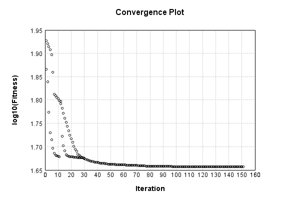


Code from [EncodingProblem.java:132](../../../../../../../../src/main/java/com/simiacryptus/mindseye/test/EncodingProblem.java#L132) executed in 0.00 seconds: 
```java
    return TestUtil.plotTime(history);
```

Returns: 

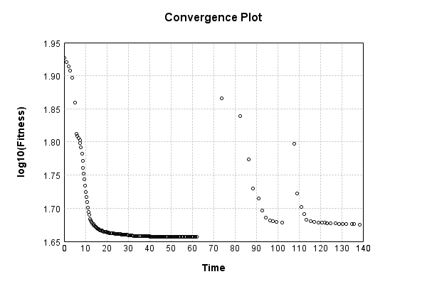


Saved model as [encoding_model11.json](etc/encoding_model11.json)

### Results
Code from [EncodingProblem.java:142](../../../../../../../../src/main/java/com/simiacryptus/mindseye/test/EncodingProblem.java#L142) executed in 0.06 seconds: 
```java
    TableOutput table = new TableOutput();
    Arrays.stream(trainingData).map(tensorArray -> {
      try {
        Tensor predictionSignal = GpuController.call(ctx -> testNetwork.eval(ctx, tensorArray)).getData().get(0);
        LinkedHashMap<String, Object> row = new LinkedHashMap<String, Object>();
        row.put("Source", log.image(tensorArray[1].toImage(), ""));
        row.put("Echo", log.image(predictionSignal.toImage(), ""));
        return row;
      } catch (IOException e) {
        throw new RuntimeException(e);
      }
    }).filter(x -> null != x).limit(10).forEach(table::putRow);
    return table;
```

Returns: 

Source | Echo
------ | ----
 | 
 | 
 | 
 | 
 | 
 | 
 | 
 | 
 | 
 | 


Learned Model Statistics:

Code from [EncodingProblem.java:159](../../../../../../../../src/main/java/com/simiacryptus/mindseye/test/EncodingProblem.java#L159) executed in 0.00 seconds: 
```java
    ScalarStatistics scalarStatistics = new ScalarStatistics();
    trainingNetwork.state().stream().flatMapToDouble(x -> Arrays.stream(x))
      .forEach(v -> scalarStatistics.add(v));
    return scalarStatistics.getMetrics();
```

Returns: 

```
    {meanExponent=-0.6235434275867643, negative=4258, min=-37.48576555223176, max=58.44014585588184, mean=1.0924938523896843, count=8626.0, positive=4367, stdDev=8.717585267952574, zeros=1}
```


Learned Representation Statistics:

Code from [EncodingProblem.java:167](../../../../../../../../src/main/java/com/simiacryptus/mindseye/test/EncodingProblem.java#L167) executed in 0.03 seconds: 
```java
    ScalarStatistics scalarStatistics = new ScalarStatistics();
    Arrays.stream(trainingData)
      .flatMapToDouble(row -> Arrays.stream(row[0].getData()))
      .forEach(v -> scalarStatistics.add(v));
    return scalarStatistics.getMetrics();
```

Returns: 

```
    {meanExponent=-1.3355137641717885, negative=295037, min=-13.985277411366303, max=24.509254183463387, mean=0.04206202999167608, count=600000.0, positive=304963, stdDev=1.1848576109993993, zeros=0}
```


Some rendered unit vectors:


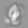


## OWL-QN
The vector-to-image network is a single fully connected layer:

Code from [MnistTests.java:79](../../../../../../../../src/test/java/com/simiacryptus/mindseye/labs/matrix/MnistTests.java#L79) executed in 0.00 seconds: 
```java
    PipelineNetwork network = new PipelineNetwork();
    network.add(new FullyConnectedLayer(new int[]{features}, new int[]{28, 28, 1})
      .setWeights(() -> 0.25 * (Math.random() - 0.5)));
    network.add(new BiasLayer(28, 28, 1));
    return network;
```

Returns: 

```
    PipelineNetwork/198dbc77-697d-40ba-a5ad-e08f7fb90027
```


### Network Diagram
Code from [EncodingProblem.java:91](../../../../../../../../src/main/java/com/simiacryptus/mindseye/test/EncodingProblem.java#L91) executed in 0.09 seconds: 
```java
    return Graphviz.fromGraph(TestUtil.toGraph(imageNetwork))
      .height(400).width(600).render(Format.PNG).toImage();
```

Returns: 

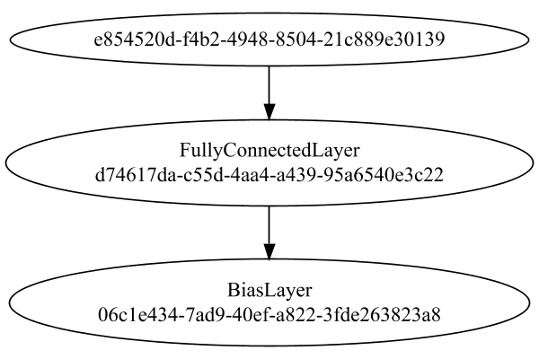


### Training
We start by training with a very small population to improve initial convergence performance:

Adding performance wrappers

Code from [TestUtil.java:269](../../../../../../../../src/main/java/com/simiacryptus/mindseye/test/TestUtil.java#L269) executed in 0.00 seconds: 
```java
    network.visitNodes(node -> {
      if (!(node.getLayer() instanceof MonitoringWrapperLayer)) {
        node.setLayer(new MonitoringWrapperLayer(node.getLayer()).shouldRecordSignalMetrics(false));
      }
      else {
        ((MonitoringWrapperLayer) node.getLayer()).shouldRecordSignalMetrics(false);
      }
    });
```

Optimized via the Orthantwise Quasi-Newton search method:

Code from [TextbookOptimizers.java:105](../../../../../../../../src/test/java/com/simiacryptus/mindseye/labs/matrix/TextbookOptimizers.java#L105) executed in 0.00 seconds: 
```java
    ValidatingTrainer trainer = new ValidatingTrainer(trainingSubject, validationSubject)
      .setMinTrainingSize(Integer.MAX_VALUE)
      .setMonitor(monitor);
    trainer.getRegimen().get(0)
      .setOrientation(new OwlQn())
      .setLineSearchFactory(name -> new ArmijoWolfeSearch()
        .setAlpha(name.contains("OWL") ? 1.0 : 1e-6));
    return trainer;
```

Returns: 

```
    com.simiacryptus.mindseye.opt.ValidatingTrainer@dd296b9
```


Code from [EncodingProblem.java:113](../../../../../../../../src/main/java/com/simiacryptus/mindseye/test/EncodingProblem.java#L113) executed in 3.01 seconds: 
```java
    preTrainer.setTimeout(timeoutMinutes / 2, TimeUnit.MINUTES).setMaxIterations(batchSize).run();
```
Logging: 
```
    Epoch parameters: 5000, 1
    Phase 0: TrainingPhase{trainingSubject=PerformanceWrapper{inner=SampledArrayTrainable{inner=ArrayTrainable{inner=com.simiacryptus.mindseye.eval.GpuTrainable@19dd3e3c}}}, orientation=com.simiacryptus.mindseye.opt.orient.OwlQn@a314e0}
    resetAndMeasure; trainingSize=5000
    LBFGS Accumulation History: 1 points
    Constructing line search parameters: OWL/QN
    th(0)=85.46827813127487;dx=-0.0015666100649952552
    New Minimum: 85.46827813127487 > 85.46827742445069
    END: th(2.154434690031884)=85.46827742445069; dx=-6.564531336725783E-7 delta=7.068241814067733E-7
    Overall network state change: {FullyConnectedLayer=1.0000002404085564, BiasLayer=0.0, PlaceholderLayer=9.9961e-01 +- 1.4767e-04 [9.9916e-01 - 1.0002e+00] (1000#)}
    Iteration 1 complete. Error: 85.46827742445069 (5000 in 0.136 seconds; 0.013 in orientation, 0.000 in gc, 0.121 in line search; 0.172 eval time)
    Epoch 1 result with 2 iterations, 5000/2147483647 samples: {validation *= 2^-0.00000; training *= 2^-0.000; Overtraining = 1.00}, {i
```
...[skipping 6534 bytes](etc/37.txt)...
```
    yer=2.3739e-01 +- 3.3932e-02 [1.3988e-01 - 4.3583e-01] (1000#)}
    Iteration 11 complete. Error: 84.98211104453871 (5000 in 0.381 seconds; 0.036 in orientation, 0.192 in gc, 0.342 in line search; 0.333 eval time)
    Orientation vanished. Popping history element from 85.46792271278973, 85.46697730070635, 85.45630755319527, 84.98211104453871
    LBFGS Accumulation History: 3 points
    th(0)=84.98211104453871;dx=-0.004415982464687424
    MAX ALPHA: th(0)=84.98211104453871;th'(0)=-0.004415982464687424;
    Overall network state change: {FullyConnectedLayer=1.0, BiasLayer=0.0, PlaceholderLayer=1.0000e+00 +- 0.0000e+00 [1.0000e+00 - 1.0000e+00] (1000#)}
    Iteration 12 failed, aborting. Error: 84.98211104453871 (5000 in 0.155 seconds; 0.036 in orientation, 0.000 in gc, 0.117 in line search; 0.109 eval time)
    Epoch 2 result with 11 iterations, 5000/2147483647 samples: {validation *= 2^-0.00823; training *= 2^-0.008; Overtraining = 1.00}, {itr*=7.91, len*=0.71} 0 since improvement; 0.0456 validation time
    Training 2 runPhase halted
    
```

Per-layer Performance Metrics:

Code from [TestUtil.java:234](../../../../../../../../src/main/java/com/simiacryptus/mindseye/test/TestUtil.java#L234) executed in 0.00 seconds: 
```java
    Map<NNLayer, MonitoringWrapperLayer> metrics = new HashMap<>();
    network.visitNodes(node -> {
      if ((node.getLayer() instanceof MonitoringWrapperLayer)) {
        MonitoringWrapperLayer layer = node.getLayer();
        metrics.put(layer.getInner(), layer);
      }
    });
    System.out.println("Forward Performance: \n\t" + metrics.entrySet().stream().map(e -> {
      PercentileStatistics performance = e.getValue().getForwardPerformance();
      return String.format("%s -> %.6fs +- %.6fs (%s)", e.getKey(), performance.getMean(), performance.getStdDev(), performance.getCount());
    }).reduce((a, b) -> a + "\n\t" + b));
    System.out.println("Backward Performance: \n\t" + metrics.entrySet().stream().map(e -> {
      PercentileStatistics performance = e.getValue().getBackwardPerformance();
      return String.format("%s -> %.6fs +- %.6fs (%s)", e.getKey(), performance.getMean(), performance.getStdDev(), performance.getCount());
    }).reduce((a, b) -> a + "\n\t" + b));
```
Logging: 
```
    Forward Performance: 
    	Optional[PipelineNetwork/198dbc77-697d-40ba-a5ad-e08f7fb90027 -> 0.007756s +- 0.001276s (58.0)
    	SumInputsLayer/9bdcda93-b9ec-4772-b9f5-ae1aec33dfee -> 0.000355s +- 0.000143s (58.0)
    	NthPowerActivationLayer/711387c9-9fab-4391-adca-9931001495cb -> 0.000543s +- 0.000165s (58.0)
    	MeanSqLossLayer/1b13d622-cbf1-42ad-8599-0a6ac5aab253 -> 0.003052s +- 0.003179s (58.0)
    	SoftmaxActivationLayer/f8c0faaa-c35f-496a-8c32-ed81d30d6e58 -> 0.001446s +- 0.000388s (58.0)
    	LinearActivationLayer/2487fefe-7866-460f-88a3-aca759726ccb -> 0.000360s +- 0.000366s (58.0)
    	EntropyLossLayer/74ff3dcd-0831-47c0-829d-c0d0261e336e -> 0.000617s +- 0.000387s (58.0)]
    Backward Performance: 
    	Optional[PipelineNetwork/198dbc77-697d-40ba-a5ad-e08f7fb90027 -> 0.000069s +- 0.000106s (58.0)
    	SumInputsLayer/9bdcda93-b9ec-4772-b9f5-ae1aec33dfee -> 0.000000s +- 0.000000s (58.0)
    	NthPowerActivationLayer/711387c9-9fab-4391-adca-9931001495cb -> 0.000001s +- 0.000000s (58.0)
    	MeanSqLossLayer/1b13d622-cbf1-42ad-8599-0a6ac5aab253 -> 0.000005s +- 0.000002s (58.0)
    	SoftmaxActivationLayer/f8c0faaa-c35f-496a-8c32-ed81d30d6e58 -> 0.000001s +- 0.000000s (52.0)
    	LinearActivationLayer/2487fefe-7866-460f-88a3-aca759726ccb -> 0.000001s +- 0.000000s (52.0)
    	EntropyLossLayer/74ff3dcd-0831-47c0-829d-c0d0261e336e -> 0.000010s +- 0.000058s (52.0)]
    
```

Removing performance wrappers

Code from [TestUtil.java:252](../../../../../../../../src/main/java/com/simiacryptus/mindseye/test/TestUtil.java#L252) executed in 0.00 seconds: 
```java
    network.visitNodes(node -> {
      if (node.getLayer() instanceof MonitoringWrapperLayer) {
        node.setLayer(node.<MonitoringWrapperLayer>getLayer().getInner());
      }
    });
```

Then our main training phase:

Adding performance wrappers

Code from [TestUtil.java:269](../../../../../../../../src/main/java/com/simiacryptus/mindseye/test/TestUtil.java#L269) executed in 0.00 seconds: 
```java
    network.visitNodes(node -> {
      if (!(node.getLayer() instanceof MonitoringWrapperLayer)) {
        node.setLayer(new MonitoringWrapperLayer(node.getLayer()).shouldRecordSignalMetrics(false));
      }
      else {
        ((MonitoringWrapperLayer) node.getLayer()).shouldRecordSignalMetrics(false);
      }
    });
```

Optimized via the Orthantwise Quasi-Newton search method:

Code from [TextbookOptimizers.java:105](../../../../../../../../src/test/java/com/simiacryptus/mindseye/labs/matrix/TextbookOptimizers.java#L105) executed in 0.00 seconds: 
```java
    ValidatingTrainer trainer = new ValidatingTrainer(trainingSubject, validationSubject)
      .setMinTrainingSize(Integer.MAX_VALUE)
      .setMonitor(monitor);
    trainer.getRegimen().get(0)
      .setOrientation(new OwlQn())
      .setLineSearchFactory(name -> new ArmijoWolfeSearch()
        .setAlpha(name.contains("OWL") ? 1.0 : 1e-6));
    return trainer;
```

Returns: 

```
    com.simiacryptus.mindseye.opt.ValidatingTrainer@153093e4
```


Code from [EncodingProblem.java:123](../../../../../../../../src/main/java/com/simiacryptus/mindseye/test/EncodingProblem.java#L123) executed in 26.57 seconds: 
```java
    mainTrainer.setTimeout(timeoutMinutes, TimeUnit.MINUTES).setMaxIterations(batchSize).run();
```
Logging: 
```
    Epoch parameters: 5000, 1
    Phase 0: TrainingPhase{trainingSubject=PerformanceWrapper{inner=SampledArrayTrainable{inner=ArrayTrainable{inner=com.simiacryptus.mindseye.eval.GpuTrainable@7358f179}}}, orientation=com.simiacryptus.mindseye.opt.orient.OwlQn@36ce17c5}
    resetAndMeasure; trainingSize=5000
    LBFGS Accumulation History: 1 points
    Constructing line search parameters: OWL/QN
    th(0)=86.51237354384409;dx=-0.0016873664549087502
    New Minimum: 86.51237354384409 > 86.51211648042079
    END: th(2.154434690031884)=86.51211648042079; dx=-2.3860683476049105E-4 delta=2.57063423305226E-4
    Overall network state change: {FullyConnectedLayer=0.9999458095225618, BiasLayer=0.0, PlaceholderLayer=9.9989e-01 +- 1.7061e-03 [9.9317e-01 - 1.0060e+00] (5000#)}
    Iteration 1 complete. Error: 86.51211648042079 (5000 in 0.871 seconds; 0.064 in orientation, 0.157 in gc, 0.798 in line search; 1.197 eval time)
    Epoch 1 result with 2 iterations, 5000/2147483647 samples: {validation *= 2^-0.00000; training *= 2^-0.000; Overtraining = 11.73},
```
...[skipping 6535 bytes](etc/38.txt)...
```
    derLayer=2.6324e-01 +- 2.0672e-02 [2.3355e-01 - 4.5822e-01] (5000#)}
    Iteration 11 complete. Error: 66.4566270264694 (5000 in 1.281 seconds; 0.416 in orientation, 0.417 in gc, 0.858 in line search; 0.808 eval time)
    Orientation vanished. Popping history element from 85.82784879093282, 85.6082105428635, 84.10252468328267, 66.4566270264694
    LBFGS Accumulation History: 3 points
    th(0)=66.4566270264694;dx=-0.007414985197656649
    MAX ALPHA: th(0)=66.4566270264694;th'(0)=-0.007414985197656649;
    Overall network state change: {FullyConnectedLayer=1.0, BiasLayer=0.0, PlaceholderLayer=1.0000e+00 +- 0.0000e+00 [1.0000e+00 - 1.0000e+00] (5000#)}
    Iteration 12 failed, aborting. Error: 66.4566270264694 (5000 in 1.195 seconds; 0.188 in orientation, 0.355 in gc, 1.001 in line search; 0.960 eval time)
    Epoch 2 result with 11 iterations, 5000/2147483647 samples: {validation *= 2^-0.02855; training *= 2^-0.371; Overtraining = 12.99}, {itr*=4.25, len*=2.55} 0 since improvement; 3.7646 validation time
    Training 2 runPhase halted
    
```

Per-layer Performance Metrics:

Code from [TestUtil.java:234](../../../../../../../../src/main/java/com/simiacryptus/mindseye/test/TestUtil.java#L234) executed in 0.00 seconds: 
```java
    Map<NNLayer, MonitoringWrapperLayer> metrics = new HashMap<>();
    network.visitNodes(node -> {
      if ((node.getLayer() instanceof MonitoringWrapperLayer)) {
        MonitoringWrapperLayer layer = node.getLayer();
        metrics.put(layer.getInner(), layer);
      }
    });
    System.out.println("Forward Performance: \n\t" + metrics.entrySet().stream().map(e -> {
      PercentileStatistics performance = e.getValue().getForwardPerformance();
      return String.format("%s -> %.6fs +- %.6fs (%s)", e.getKey(), performance.getMean(), performance.getStdDev(), performance.getCount());
    }).reduce((a, b) -> a + "\n\t" + b));
    System.out.println("Backward Performance: \n\t" + metrics.entrySet().stream().map(e -> {
      PercentileStatistics performance = e.getValue().getBackwardPerformance();
      return String.format("%s -> %.6fs +- %.6fs (%s)", e.getKey(), performance.getMean(), performance.getStdDev(), performance.getCount());
    }).reduce((a, b) -> a + "\n\t" + b));
```
Logging: 
```
    Forward Performance: 
    	Optional[PipelineNetwork/198dbc77-697d-40ba-a5ad-e08f7fb90027 -> 0.055424s +- 0.019680s (88.0)
    	SumInputsLayer/9bdcda93-b9ec-4772-b9f5-ae1aec33dfee -> 0.004219s +- 0.015629s (88.0)
    	NthPowerActivationLayer/711387c9-9fab-4391-adca-9931001495cb -> 0.004100s +- 0.002728s (88.0)
    	MeanSqLossLayer/1b13d622-cbf1-42ad-8599-0a6ac5aab253 -> 0.029217s +- 0.040776s (88.0)
    	SoftmaxActivationLayer/f8c0faaa-c35f-496a-8c32-ed81d30d6e58 -> 0.021567s +- 0.046399s (88.0)
    	LinearActivationLayer/2487fefe-7866-460f-88a3-aca759726ccb -> 0.001783s +- 0.001380s (88.0)
    	EntropyLossLayer/74ff3dcd-0831-47c0-829d-c0d0261e336e -> 0.004356s +- 0.002387s (88.0)]
    Backward Performance: 
    	Optional[PipelineNetwork/198dbc77-697d-40ba-a5ad-e08f7fb90027 -> 0.000059s +- 0.000035s (88.0)
    	SumInputsLayer/9bdcda93-b9ec-4772-b9f5-ae1aec33dfee -> 0.000000s +- 0.000000s (88.0)
    	NthPowerActivationLayer/711387c9-9fab-4391-adca-9931001495cb -> 0.000003s +- 0.000011s (88.0)
    	MeanSqLossLayer/1b13d622-cbf1-42ad-8599-0a6ac5aab253 -> 0.000007s +- 0.000013s (88.0)
    	SoftmaxActivationLayer/f8c0faaa-c35f-496a-8c32-ed81d30d6e58 -> 0.000001s +- 0.000000s (52.0)
    	LinearActivationLayer/2487fefe-7866-460f-88a3-aca759726ccb -> 0.000002s +- 0.000006s (52.0)
    	EntropyLossLayer/74ff3dcd-0831-47c0-829d-c0d0261e336e -> 0.000002s +- 0.000001s (52.0)]
    
```

Removing performance wrappers

Code from [TestUtil.java:252](../../../../../../../../src/main/java/com/simiacryptus/mindseye/test/TestUtil.java#L252) executed in 0.00 seconds: 
```java
    network.visitNodes(node -> {
      if (node.getLayer() instanceof MonitoringWrapperLayer) {
        node.setLayer(node.<MonitoringWrapperLayer>getLayer().getInner());
      }
    });
```

Code from [EncodingProblem.java:129](../../../../../../../../src/main/java/com/simiacryptus/mindseye/test/EncodingProblem.java#L129) executed in 0.00 seconds: 
```java
    return TestUtil.plot(history);
```

Returns: 

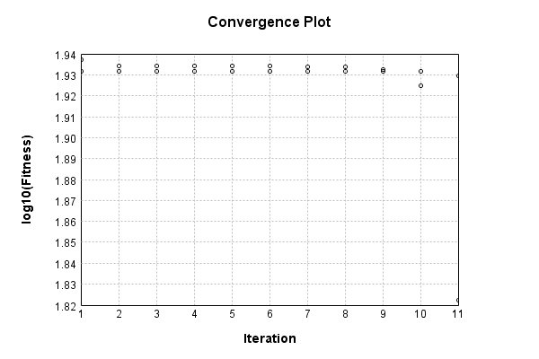


Code from [EncodingProblem.java:132](../../../../../../../../src/main/java/com/simiacryptus/mindseye/test/EncodingProblem.java#L132) executed in 0.00 seconds: 
```java
    return TestUtil.plotTime(history);
```

Returns: 

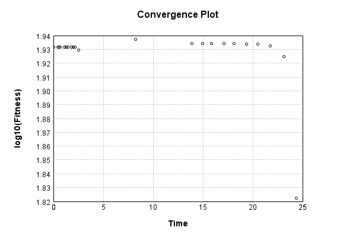


Saved model as [encoding_model12.json](etc/encoding_model12.json)

### Results
Code from [EncodingProblem.java:142](../../../../../../../../src/main/java/com/simiacryptus/mindseye/test/EncodingProblem.java#L142) executed in 0.07 seconds: 
```java
    TableOutput table = new TableOutput();
    Arrays.stream(trainingData).map(tensorArray -> {
      try {
        Tensor predictionSignal = GpuController.call(ctx -> testNetwork.eval(ctx, tensorArray)).getData().get(0);
        LinkedHashMap<String, Object> row = new LinkedHashMap<String, Object>();
        row.put("Source", log.image(tensorArray[1].toImage(), ""));
        row.put("Echo", log.image(predictionSignal.toImage(), ""));
        return row;
      } catch (IOException e) {
        throw new RuntimeException(e);
      }
    }).filter(x -> null != x).limit(10).forEach(table::putRow);
    return table;
```

Returns: 

Source | Echo
------ | ----
 | 
 | 
 | 
 | 
 | 
 | 
 | 
 | 
 | 
 | 


Learned Model Statistics:

Code from [EncodingProblem.java:159](../../../../../../../../src/main/java/com/simiacryptus/mindseye/test/EncodingProblem.java#L159) executed in 0.00 seconds: 
```java
    ScalarStatistics scalarStatistics = new ScalarStatistics();
    trainingNetwork.state().stream().flatMapToDouble(x -> Arrays.stream(x))
      .forEach(v -> scalarStatistics.add(v));
    return scalarStatistics.getMetrics();
```

Returns: 

```
    {meanExponent=-0.5910700390888008, negative=2660, min=-8.106205018337683, max=22.537903531901176, mean=0.8477595017433718, count=8626.0, positive=4083, stdDev=3.038941303865352, zeros=1883}
```


Learned Representation Statistics:

Code from [EncodingProblem.java:167](../../../../../../../../src/main/java/com/simiacryptus/mindseye/test/EncodingProblem.java#L167) executed in 0.03 seconds: 
```java
    ScalarStatistics scalarStatistics = new ScalarStatistics();
    Arrays.stream(trainingData)
      .flatMapToDouble(row -> Arrays.stream(row[0].getData()))
      .forEach(v -> scalarStatistics.add(v));
    return scalarStatistics.getMetrics();
```

Returns: 

```
    {meanExponent=-1.6190362456835288, negative=285628, min=-2.650705266476108, max=5.564341643435509, mean=0.051643414332735914, count=600000.0, positive=300469, stdDev=0.38856610277691694, zeros=13903}
```


Some rendered unit vectors:


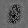
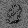
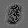

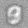


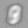
## Comparison
Code from [OptimizerComparison.java:194](../../../../../../../../src/test/java/com/simiacryptus/mindseye/labs/matrix/OptimizerComparison.java#L194) executed in 0.00 seconds: 
```java
    return TestUtil.compare(gd, sgd, cgd, lbfgs, owlqn);
```

Returns: 

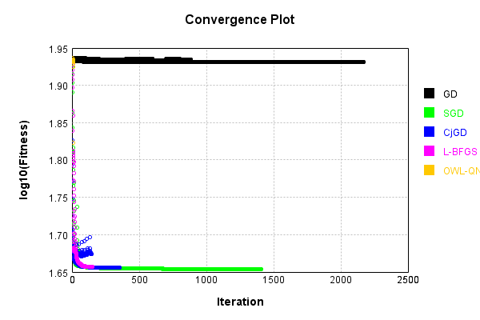


Code from [OptimizerComparison.java:197](../../../../../../../../src/test/java/com/simiacryptus/mindseye/labs/matrix/OptimizerComparison.java#L197) executed in 0.01 seconds: 
```java
    return TestUtil.compareTime(gd, sgd, cgd, lbfgs, owlqn);
```

Returns: 


