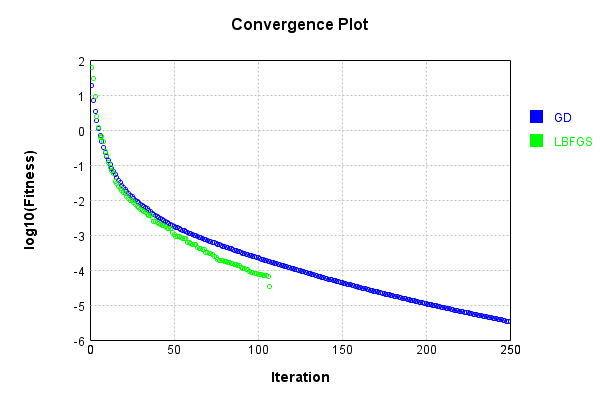
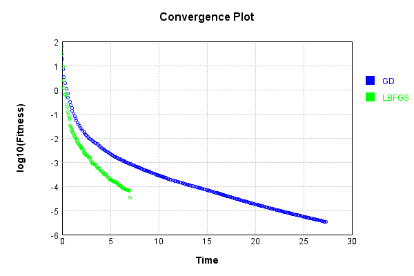
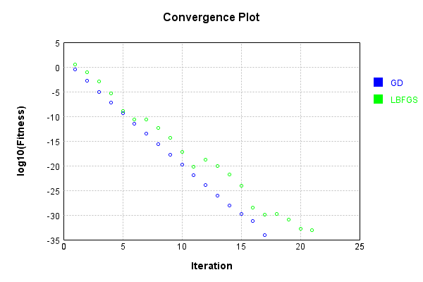
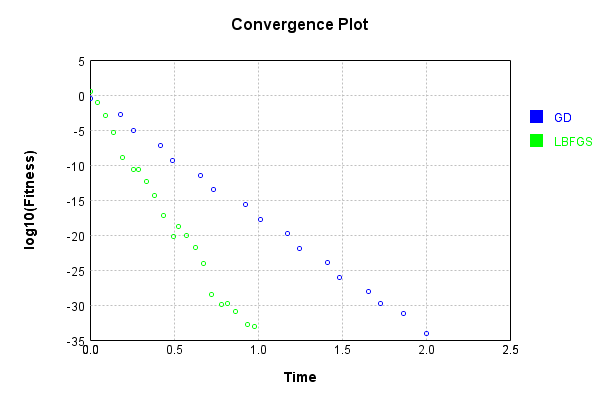
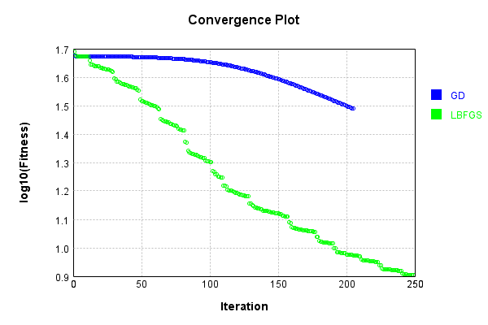
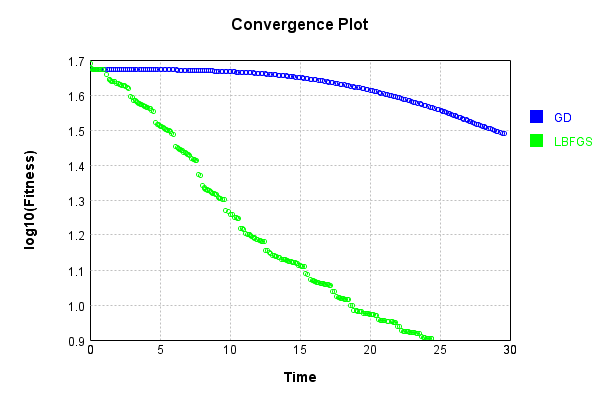

# ConvolutionLayer
## DownsizeTest
### Json Serialization
Code from [JsonTest.java:36](../../../../../../../../src/main/java/com/simiacryptus/mindseye/test/unit/JsonTest.java#L36) executed in 0.00 seconds: 
```java
    JsonObject json = layer.getJson();
    NNLayer echo = NNLayer.fromJson(json);
    if ((echo == null)) throw new AssertionError("Failed to deserialize");
    if ((layer == echo)) throw new AssertionError("Serialization did not copy");
    if ((!layer.equals(echo))) throw new AssertionError("Serialization not equal");
    return new GsonBuilder().setPrettyPrinting().create().toJson(json);
```

Returns: 

```
    {
      "class": "com.simiacryptus.mindseye.layers.aparapi.ConvolutionLayer",
      "id": "fff872cf-ef9b-4a42-8f70-47795b2bdfaf",
      "isFrozen": false,
      "name": "ConvolutionLayer/fff872cf-ef9b-4a42-8f70-47795b2bdfaf",
      "filter": [
        [
          [
            1.74,
            1.08,
            1.08
          ],
          [
            -1.568,
            -0.652,
            1.112
          ],
          [
            -0.844,
            0.204,
            1.992
          ]
        ],
        [
          [
            -0.6,
            -1.492,
            -0.316
          ],
          [
            -1.172,
            0.832,
            1.792
          ],
          [
            1.128,
            -0.148,
            1.576
          ]
        ],
        [
          [
            1.828,
            -1.932,
            -0.184
          ],
          [
            -0.236,
            -1.1,
            1.628
          ],
          [
            0.732,
            -0.684,
            1.436
          ]
        ],
        [
          [
            -1.224,
            -0.348,
            -1.276
          ],
          [
            -0.328,
            1.164,
            -0.056
          ],
          [
            1.204,
            1.432,
            0.136
          ]
        ],
        [
       
```
...[skipping 2394 bytes](etc/12.txt)...
```
    .168,
            1.228,
            -0.064
          ],
          [
            -0.432,
            1.824,
            1.72
          ],
          [
            1.152,
            1.312,
            1.308
          ]
        ],
        [
          [
            1.904,
            -0.48,
            -1.84
          ],
          [
            1.636,
            1.184,
            -1.592
          ],
          [
            0.148,
            -1.58,
            1.768
          ]
        ],
        [
          [
            0.12,
            -0.252,
            1.488
          ],
          [
            -0.296,
            0.656,
            -0.688
          ],
          [
            -1.232,
            -1.792,
            -1.264
          ]
        ],
        [
          [
            1.976,
            1.984,
            -0.996
          ],
          [
            0.068,
            -1.308,
            1.916
          ],
          [
            0.216,
            1.848,
            -0.464
          ]
        ],
        [
          [
            -1.588,
            0.56,
            1.928
          ],
          [
            1.004,
            0.44,
            -1.3
          ],
          [
            -0.696,
            0.976,
            -0.928
          ]
        ]
      ],
      "skip": [
        [
          0.0
        ]
      ],
      "simple": false
    }
```


### Example Input/Output Pair
Code from [ReferenceIO.java:68](../../../../../../../../src/main/java/com/simiacryptus/mindseye/test/unit/ReferenceIO.java#L68) executed in 0.02 seconds: 
```java
    SimpleEval eval = SimpleEval.run(layer, inputPrototype);
    return String.format("--------------------\nInput: \n[%s]\n--------------------\nOutput: \n%s\n--------------------\nDerivative: \n%s",
      Arrays.stream(inputPrototype).map(t -> t.prettyPrint()).reduce((a, b) -> a + ",\n" + b).get(),
      eval.getOutput().prettyPrint(),
      Arrays.stream(eval.getDerivative()).map(t -> t.prettyPrint()).reduce((a, b) -> a + ",\n" + b).get());
```

Returns: 

```
    --------------------
    Input: 
    [[
    	[ [ -0.532, 1.02, 1.368, -1.356, -1.724, 0.2, -1.732 ], [ 1.276, 1.768, -0.636, 0.868, 0.86, 0.408, 0.456 ], [ 1.54, 1.228, 0.784, -1.932, 0.744, -1.244, -0.884 ] ],
    	[ [ 0.016, 0.076, 1.8, 0.172, 0.376, 1.676, -0.248 ], [ -1.208, -0.936, 0.336, -0.836, 0.732, -0.004, -0.356 ], [ -0.356, -0.968, 1.164, 0.952, -1.368, -0.652, 0.648 ] ],
    	[ [ 1.172, 0.5, -0.548, -1.116, 0.716, 1.604, -0.3 ], [ 0.852, -0.66, -1.032, -1.42, -1.86, -0.16, 1.748 ], [ 0.704, 1.016, 0.408, 0.18, 1.84, -0.124, 0.192 ] ]
    ]]
    --------------------
    Output: 
    [
    	[ [ -0.06606399999999976, 0.17166400000000004, 4.794688 ] ]
    ]
    --------------------
    Derivative: 
    [
    	[ [ 2.968, -1.836, 2.028, -1.552, -2.3760000000000003, 1.2839999999999998, 0.508 ], [ 0.0, 0.0, 0.0, 0.0, 0.0, 0.0, 0.0 ], [ 0.0, 0.0, 0.0, 0.0, 0.0, 0.0, 0.0 ] ],
    	[ [ 0.0, 0.0, 0.0, 0.0, 0.0, 0.0, 0.0 ], [ 0.0, 0.0, 0.0, 0.0, 0.0, 0.0, 0.0 ], [ 0.0, 0.0, 0.0, 0.0, 0.0, 0.0, 0.0 ] ],
    	[ [ 0.0, 0.0, 0.0, 0.0, 0.0, 0.0, 0.0 ], [ 0.0, 0.0, 0.0, 0.0, 0.0, 0.0, 0.0 ], [ 0.0, 0.0, 0.0, 0.0, 0.0, 0.0, 0.0 ] ]
    ]
```


### Batch Execution
Code from [BatchingTester.java:66](../../../../../../../../src/main/java/com/simiacryptus/mindseye/test/unit/BatchingTester.java#L66) executed in 0.11 seconds: 
```java
    return test(reference, inputPrototype);
```

Returns: 

```
    ToleranceStatistics{absoluteTol=0.0000e+00 +- 0.0000e+00 [0.0000e+00 - 0.0000e+00] (660#), relativeTol=0.0000e+00 +- 0.0000e+00 [0.0000e+00 - 0.0000e+00] (100#)}
```


Code from [SingleDerivativeTester.java:77](../../../../../../../../src/main/java/com/simiacryptus/mindseye/test/unit/SingleDerivativeTester.java#L77) executed in 1.17 seconds: 
```java
    return test(component, inputPrototype);
```
Logging: 
```
    Inputs: [
    	[ [ -0.16, -1.88, -0.22, -1.672, -0.112, 0.196, 0.412 ], [ -1.648, 1.124, 1.496, -0.344, -1.06, 1.644, 1.82 ], [ 1.772, -1.82, -0.548, -0.252, -1.084, -1.648, 1.86 ] ],
    	[ [ -0.96, -0.864, -1.624, 1.704, 1.688, 1.676, 0.084 ], [ 1.624, 1.428, -1.952, 0.084, 0.432, -0.784, 1.256 ], [ -0.556, -0.936, -0.912, -0.352, 0.624, 1.304, -1.064 ] ],
    	[ [ 0.952, -1.392, -1.032, -1.752, -1.396, 1.768, 0.596 ], [ -0.66, 1.316, -0.724, -1.572, -1.932, 1.204, -1.324 ], [ 0.904, 0.48, 0.68, 0.4, -1.832, -0.616, 1.788 ] ]
    ]
    Inputs Statistics: {meanExponent=-0.06088244226838352, negative=34, min=1.788, max=1.788, mean=-0.06933333333333327, count=63.0, positive=29, stdDev=1.235596071049779, zeros=0}
    Output: [
    	[ [ 3.1486079999999994, 0.009824000000000055, 2.694224 ] ]
    ]
    Outputs Statistics: {meanExponent=-0.3597197837137677, negative=0, min=2.694224, max=2.694224, mean=1.9508853333333331, count=3.0, positive=3, stdDev=1.3850163728720164, zeros=0}
    Feedback for input 0
    Inputs Values: [
    	[ [ -0.16, -1.88, -0.22, -1.
```
...[skipping 2240 bytes](etc/13.txt)...
```
    0.01817989417989418, count=567.0, positive=6, stdDev=0.18633504959311092, zeros=546}
    Measured Gradient: [ [ -0.16000000000016001, 0.0, 0.0 ], [ 0.0, 0.0, 0.0 ], [ 0.0, 0.0, 0.0 ], [ 0.0, 0.0, 0.0 ], [ 0.0, 0.0, 0.0 ], [ 0.0, 0.0, 0.0 ], [ 0.0, 0.0, 0.0 ], [ 0.0, 0.0, 0.0 ], ... ]
    Measured Statistics: {meanExponent=-0.42852741487135787, negative=15, min=0.0, max=0.0, mean=-0.018179894179879894, count=567.0, positive=6, stdDev=0.18633504959298505, zeros=546}
    Gradient Error: [ [ -1.6001089342410069E-13, 0.0, 0.0 ], [ 0.0, 0.0, 0.0 ], [ 0.0, 0.0, 0.0 ], [ 0.0, 0.0, 0.0 ], [ 0.0, 0.0, 0.0 ], [ 0.0, 0.0, 0.0 ], [ 0.0, 0.0, 0.0 ], [ 0.0, 0.0, 0.0 ], ... ]
    Error Statistics: {meanExponent=-12.219373038242688, negative=8, min=0.0, max=0.0, mean=1.428484510769411E-14, count=567.0, positive=13, stdDev=2.9464781351704447E-13, zeros=546}
    Finite-Difference Derivative Accuracy:
    absoluteTol: 5.9285e-14 +- 3.4969e-13 [0.0000e+00 - 3.6958e-12] (756#)
    relativeTol: 1.4024e-12 +- 1.8750e-12 [4.0672e-14 - 8.7134e-12] (42#)
    
```

Returns: 

```
    ToleranceStatistics{absoluteTol=5.9285e-14 +- 3.4969e-13 [0.0000e+00 - 3.6958e-12] (756#), relativeTol=1.4024e-12 +- 1.8750e-12 [4.0672e-14 - 8.7134e-12] (42#)}
```


### Performance
Now we execute larger-scale runs to benchmark performance:

Code from [PerformanceTester.java:66](../../../../../../../../src/main/java/com/simiacryptus/mindseye/test/unit/PerformanceTester.java#L66) executed in 3.40 seconds: 
```java
    test(component, inputPrototype);
```
Logging: 
```
    100 batches
    Input Dimensions:
    	[100, 100, 3]
    Performance:
    	Evaluation performance: 0.248413s +- 0.026203s [0.213818s - 0.284031s]
    	Learning performance: 0.210096s +- 0.011724s [0.198022s - 0.231454s]
    
```

### Input Learning
In this test, we use a network to learn this target input, given it's pre-evaluated output:

Code from [LearningTester.java:127](../../../../../../../../src/main/java/com/simiacryptus/mindseye/test/unit/LearningTester.java#L127) executed in 0.01 seconds: 
```java
    return Arrays.stream(input_target).map(x -> x.prettyPrint()).reduce((a, b) -> a + "\n" + b).orElse("");
```

Returns: 

```
    [
    	[ [ -0.892, 0.536, -0.096 ], [ 1.384, 1.82, 1.088 ], [ -1.508, -0.46, 1.052 ], [ 1.308, 0.952, -0.98 ], [ 0.204, -1.324, -1.632 ], [ -0.844, 0.568, -0.376 ], [ -1.184, -1.176, 0.684 ], [ -0.32, 1.196, 0.472 ], ... ],
    	[ [ 1.928, 0.236, 1.392 ], [ 0.152, 0.88, -0.396 ], [ 0.38, -1.108, 1.076 ], [ 1.1, -1.808, 0.444 ], [ -0.404, 1.52, -1.036 ], [ 1.328, 0.656, -0.692 ], [ -0.444, -1.072, -1.968 ], [ 1.988, 0.152, 0.172 ], ... ],
    	[ [ -1.056, 0.7, -1.588 ], [ -0.908, -1.476, 0.412 ], [ -0.524, -1.936, -1.452 ], [ -0.632, 0.172, -0.4 ], [ -0.14, -1.232, 0.42 ], [ -0.216, 1.156, -0.088 ], [ 0.712, -0.784, -0.724 ], [ -1.052, -1.056, -1.104 ], ... ],
    	[ [ 0.412, -0.716, 1.78 ], [ -1.756, 1.728, 0.12 ], [ -1.664, 1.928, -0.52 ], [ 1.62, 0.128, -1.664 ], [ -0.564, 0.784, -1.6 ], [ 0.264, 1.6, -1.08 ], [ -0.808, 1.0, 1.544 ], [ 1.428, 1.748, 1.704 ], ... ],
    	[ [ 0.328, -0.116, 0.74 ], [ -0.932, -0.584, -0.536 ], [ -0.8, -0.072, 1.608 ], [ -0.62, -0.136, -0.568 ], [ -1.12, -1.012, 1.072 ], [ 0.908, -0.376, 0.092 ], [ 1.772, -0.832, 0.252 ], [ 1.212, -0.616, 0.228 ], ... ],
    	[ [ -1.088, 0.156, 1.904 ], [ -1.348, -0.2, -1.696 ], [ -0.516, -0.912, 0.996 ], [ 0.228, 1.504, -0.256 ], [ 1.012, -1.42, 0.416 ], [ 0.488, -1.608, 1.888 ], [ -1.436, -1.332, 1.9 ], [ -1.288, -0.616, 0.684 ], ... ],
    	[ [ -1.972, -1.788, 0.628 ], [ 1.664, -1.668, 0.152 ], [ -0.976, 0.824, 0.576 ], [ 1.752, -0.612, 0.492 ], [ 1.696, -1.24, -1.14 ], [ 0.244, 0.92, 1.74 ], [ -1.54, 0.372, 0.892 ], [ -1.236, -1.772, 1.276 ], ... ],
    	[ [ -0.172, -0.088, 0.968 ], [ 0.14, -1.148, 0.848 ], [ -1.636, 0.688, -0.824 ], [ 1.368, 0.292, -1.576 ], [ 0.904, 1.208, -1.004 ], [ -0.432, 0.124, -1.488 ], [ -1.732, -0.096, 0.364 ], [ 1.888, -0.168, -1.152 ], ... ],
    	...
    ]
```


First, we use a conjugate gradient descent method, which converges the fastest for purely linear functions.

Code from [LearningTester.java:300](../../../../../../../../src/main/java/com/simiacryptus/mindseye/test/unit/LearningTester.java#L300) executed in 27.63 seconds: 
```java
    return new IterativeTrainer(trainable)
      .setLineSearchFactory(label -> new QuadraticSearch())
      .setOrientation(new GradientDescent())
      .setMonitor(monitor)
      .setTimeout(30, TimeUnit.SECONDS)
      .setMaxIterations(250)
      .setTerminateThreshold(0)
      .run();
```
Logging: 
```
    Constructing line search parameters: GD
    F(0.0) = LineSearchPoint{point=PointSample{avg=93.18308431420554}, derivative=-0.6612661793122699}
    New Minimum: 93.18308431420554 > 93.18308431413948
    F(1.0E-10) = LineSearchPoint{point=PointSample{avg=93.18308431413948}, derivative=-0.6612661793119771}, delta = -6.606626357097412E-11
    New Minimum: 93.18308431413948 > 93.1830843137436
    F(7.000000000000001E-10) = LineSearchPoint{point=PointSample{avg=93.1830843137436}, derivative=-0.6612661793102202}, delta = -4.6193804337235633E-10
    New Minimum: 93.1830843137436 > 93.18308431096702
    F(4.900000000000001E-9) = LineSearchPoint{point=PointSample{avg=93.18308431096702}, derivative=-0.661266179297922}, delta = -3.2385258919021E-9
    New Minimum: 93.18308431096702 > 93.18308429152528
    F(3.430000000000001E-8) = LineSearchPoint{point=PointSample{avg=93.18308429152528}, derivative=-0.6612661792118344}, delta = -2.2680268330077524E-8
    New Minimum: 93.18308429152528 > 93.18308415543592
    F(2.4010000000000004E-7) = LineSearchPoint{po
```
...[skipping 287595 bytes](etc/14.txt)...
```
    6}, derivative=-1.7666033050415168E-10}, delta = -3.804533318712007E-8
    F(1242.3626283342278) = LineSearchPoint{point=PointSample{avg=3.4239898428892744E-6}, derivative=2.757789690756562E-10}, delta = 1.4729506384013539E-8
    F(95.56635602570984) = LineSearchPoint{point=PointSample{avg=3.3871113888205098E-6}, derivative=-2.1146335354874353E-10}, delta = -2.2148947684751137E-8
    New Minimum: 3.371215003318141E-6 > 3.3357046559427834E-6
    F(668.9644921799688) = LineSearchPoint{point=PointSample{avg=3.3357046559427834E-6}, derivative=3.2157807763450084E-11}, delta = -7.35556805624775E-8
    3.3357046559427834E-6 <= 3.409260336505261E-6
    New Minimum: 3.3357046559427834E-6 > 3.334487673979751E-6
    F(593.2763748791092) = LineSearchPoint{point=PointSample{avg=3.334487673979751E-6}, derivative=5.0689046325881335E-24}, delta = -7.477266252551009E-8
    Right bracket at 593.2763748791092
    Converged to right
    Iteration 250 complete. Error: 3.334487673979751E-6 Total: 249221055307601.0600; Orientation: 0.0008; Line Search: 0.0953
    
```

Returns: 

```
    3.334487673979751E-6
```


Training Converged

Next, we run the same optimization using L-BFGS, which is nearly ideal for purely second-order or quadratic functions.

Code from [LearningTester.java:324](../../../../../../../../src/main/java/com/simiacryptus/mindseye/test/unit/LearningTester.java#L324) executed in 7.21 seconds: 
```java
    return new IterativeTrainer(trainable)
      .setLineSearchFactory(label -> new ArmijoWolfeSearch())
      .setOrientation(new LBFGS())
      .setMonitor(monitor)
      .setTimeout(30, TimeUnit.SECONDS)
      .setMaxIterations(250)
      .setTerminateThreshold(0)
      .run();
```
Logging: 
```
    LBFGS Accumulation History: 1 points
    Constructing line search parameters: GD
    th(0)=93.18308431420554;dx=-0.6612661793122699
    New Minimum: 93.18308431420554 > 91.76522515312826
    WOLFE (weak): th(2.154434690031884)=91.76522515312826; dx=-0.654957670627039 delta=1.4178591610772884
    New Minimum: 91.76522515312826 > 90.36095726200381
    WOLFE (weak): th(4.308869380063768)=90.36095726200381; dx=-0.6486491619418081 delta=2.8221270522017363
    New Minimum: 90.36095726200381 > 84.87979839704438
    WOLFE (weak): th(12.926608140191302)=84.87979839704438; dx=-0.6234151272008844 delta=8.303285917161162
    New Minimum: 84.87979839704438 > 62.90565495558449
    END: th(51.70643256076521)=62.90565495558449; dx=-0.509861970866728 delta=30.277429358621056
    Iteration 1 complete. Error: 62.90565495558449 Total: 249221202213675.9400; Orientation: 0.0015; Line Search: 0.0758
    LBFGS Accumulation History: 1 points
    th(0)=62.90565495558449;dx=-0.39758118353890365
    New Minimum: 62.90565495558449 > 28.69504836545097
    END: th(111.39813200670669)
```
...[skipping 55190 bytes](etc/15.txt)...
```
    OLFE (weak): th(296.972049494193)=6.506647292669366E-5; dx=-5.249802420273837E-9 delta=1.5694312879439143E-6
    New Minimum: 6.506647292669366E-5 > 6.351781504626184E-5
    WOLFE (weak): th(593.944098988386)=6.351781504626184E-5; dx=-5.179851704210041E-9 delta=3.118089168375733E-6
    New Minimum: 6.351781504626184E-5 > 5.753091759966589E-5
    WOLFE (weak): th(1781.832296965158)=5.753091759966589E-5; dx=-4.900048839954869E-9 delta=9.104986614971687E-6
    New Minimum: 5.753091759966589E-5 > 3.470301377756522E-5
    END: th(7127.329187860632)=3.470301377756522E-5; dx=-3.640935950806601E-9 delta=3.1932890437072355E-5
    Iteration 107 complete. Error: 3.470301377756522E-5 Total: 249228239952501.8400; Orientation: 0.0015; Line Search: 0.0708
    LBFGS Accumulation History: 1 points
    th(0)=3.470301377756522E-5;dx=-2.6881273379364346E-9
    MAX ALPHA: th(0)=3.470301377756522E-5;th'(0)=-2.6881273379364346E-9;
    Iteration 108 failed, aborting. Error: 3.470301377756522E-5 Total: 249228280866279.7500; Orientation: 0.0014; Line Search: 0.0268
    
```

Returns: 

```
    3.470301377756522E-5
```


This training run resulted in the following regressed input:

Code from [LearningTester.java:154](../../../../../../../../src/main/java/com/simiacryptus/mindseye/test/unit/LearningTester.java#L154) executed in 0.01 seconds: 
```java
    return Arrays.stream(input_lbgfs).map(x -> x.prettyPrint()).reduce((a, b) -> a + "\n" + b).orElse("");
```

Returns: 

```
    [
    	[ [ -0.8920000745991956, 0.5359999995692893, -0.09600000924698675 ], [ 1.3840001329508032, 1.820000006260639, 1.0880000087585207 ], [ -1.5080001792568698, -0.46000001468449925, 1.051999989666605 ], [ 1.3080002222513634, 0.9520000185108249, -0.9799999886917705 ], [ 0.20399973748730763, -1.3240000252405701, -1.6320000117189084 ], [ -0.8439997033123593, 0.5680000284864939, -0.37599998765529596 ], [ -1.1840003280105988, -1.1760000339792562, 0.683999987865731 ], [ -0.31999964439729406, 1.1960000378710045, 0.4720000131996649 ], ... ],
    	[ [ 1.9280001373533393, 0.2360000108960513, 1.3920000476462393 ], [ 0.15199976184243733, 0.8799999633886032, -0.39600006953775435 ], [ 0.38000032729015665, -1.1079999432026875, 1.0760001031946753 ], [ 1.0999995907681857, -1.8080000694676277, 0.44399987252487555 ], [ -0.40399951355642283, 1.5200000867574175, -1.035999847892322 ], [ 1.3279994469553025, 0.6559999017129122, -0.6920001720374557 ], [ -0.44399938699191605, -1.0719998887564455, -1.9679998102579592 ], [ 1.9879993323330476,
```
...[skipping 2248 bytes](etc/16.txt)...
```
    997846800209 ], [ 1.664000612811329, -1.667999867457552, 0.15200035453551705 ], [ -0.9760008764119875, 0.8239998132487113, 0.5759994646313198 ], [ 1.7520011175356078, -0.6119997531468295, 0.4920006921574941 ], [ 1.6959986537055818, -1.2400003065656542, -1.1400008398712007 ], [ 0.2440015620677868, 0.9200003617752323, 1.740000984424183 ], [ -1.5400017475257635, 0.37199959707064867, 0.8919988969616931 ], [ -1.2359980664048695, -1.771999537379247, 1.2760012258736242 ], ... ],
    	[ [ -0.1719996070226798, -0.08799996621330906, 0.9680002361257745 ], [ 0.13999935005047182, -1.1480001412827805, 0.8479996109930787 ], [ -1.6359990641052529, 0.6880001987426557, -0.8239994074214507 ], [ 1.3679988076322847, 0.2919997351147449, -1.5760007607849782 ], [ 0.9040014393769924, 1.2080003266449146, -1.0039990681191722 ], [ -0.43200167417659646, 0.12399960946536122, -1.4880010882931476 ], [ -1.7319981275096663, -0.09599956916352684, 0.3640012247272493 ], [ 1.8879979220197847, -0.16800049982175233, -1.1520013626053698 ], ... ],
    	...
    ]
```


Code from [LearningTester.java:96](../../../../../../../../src/main/java/com/simiacryptus/mindseye/test/unit/LearningTester.java#L96) executed in 0.01 seconds: 
```java
    return TestUtil.compare(runs);
```

Returns: 




Code from [LearningTester.java:99](../../../../../../../../src/main/java/com/simiacryptus/mindseye/test/unit/LearningTester.java#L99) executed in 0.01 seconds: 
```java
    return TestUtil.compareTime(runs);
```

Returns: 




### Model Learning
In this test, attempt to train a network to emulate a randomized network given an example input/output. The target state is:

Code from [LearningTester.java:176](../../../../../../../../src/main/java/com/simiacryptus/mindseye/test/unit/LearningTester.java#L176) executed in 0.00 seconds: 
```java
    return network_target.state().stream().map(Arrays::toString).reduce((a, b) -> a + "\n" + b).orElse("");
```

Returns: 

```
    [1.128, -1.38, -0.632, -0.74, 1.968, 0.392, -1.056, -0.464, -0.032, -1.244, -0.928, -0.04, 1.404, 1.112, 0.932, -1.6, 1.308, 1.532, -0.268, -0.412, -1.552, 0.648, 0.06, -0.004, 0.74, -1.096, -0.844, -1.22, 0.616, -1.604, -1.932, -1.164, 0.948, -0.652, -1.944, 0.648, -1.524, -1.54, 0.656, -1.64, -0.928, 0.728, 1.484, -1.012, 0.128, 1.768, 1.464, -0.616, 0.94, -0.744, -1.084, -0.692, -0.528, -0.34, 0.088, -0.116, 1.224, 1.112, -0.9, 0.564, -1.96, -1.904, -1.852, 1.708, 0.572, 0.852, 1.928, 0.324, -1.68, -0.156, -0.232, -0.228, 0.816, -1.192, 0.372, 0.272, 1.996, 0.12, 1.72, 1.616, -0.524, 0.672, 1.752, 1.48, -1.632, -0.604, 1.368, 0.464, 1.684, -1.784, 0.58, 0.932, -0.696, -1.248, 1.052, 1.648, -0.592, -1.724, -1.664, -1.252, -1.084, 0.476, 0.72, -0.968, -1.492, -0.088, -0.86, 0.108, -0.18, 1.596, -1.688, 1.088, 1.244, 1.888, -0.06, -1.328, -1.312, 1.544, 0.888, 0.776, -1.188, 1.832, -0.2, 1.336, -1.956, -0.38, -1.912, 1.936, -0.616, -1.812, -0.488, 1.544, -0.128, -1.32, -2.0, 0.72, 1.548, 1.128, -0.144, -1.52, -0.232, -0.664, -1.784, 1.168, 0.66, 1.256, -1.66, 1.752, -1.708, 0.78, -0.096, 0.084, 0.16, -1.496, 0.472, -0.996, -0.308, 1.516, 1.66, 1.008, 0.604, 0.152, -0.516, -0.336, -0.928, -1.168, -0.204, -0.064, -0.348, 1.796, 1.584, -0.28, -0.312, 1.228, -0.004, 1.272, -0.552, 1.808, 0.168, 0.204, 1.892, -1.332, -0.996, -0.016, -1.684, 1.352, -0.496, 1.012, 1.768]
```


First, we use a conjugate gradient descent method, which converges the fastest for purely linear functions.

Code from [LearningTester.java:300](../../../../../../../../src/main/java/com/simiacryptus/mindseye/test/unit/LearningTester.java#L300) executed in 2.35 seconds: 
```java
    return new IterativeTrainer(trainable)
      .setLineSearchFactory(label -> new QuadraticSearch())
      .setOrientation(new GradientDescent())
      .setMonitor(monitor)
      .setTimeout(30, TimeUnit.SECONDS)
      .setMaxIterations(250)
      .setTerminateThreshold(0)
      .run();
```
Logging: 
```
    Constructing line search parameters: GD
    F(0.0) = LineSearchPoint{point=PointSample{avg=100.95859554871662}, derivative=-75.53941568381103}
    New Minimum: 100.95859554871662 > 100.95859554116058
    F(1.0E-10) = LineSearchPoint{point=PointSample{avg=100.95859554116058}, derivative=-75.53941568097719}, delta = -7.556039349765342E-9
    New Minimum: 100.95859554116058 > 100.95859549583906
    F(7.000000000000001E-10) = LineSearchPoint{point=PointSample{avg=100.95859549583906}, derivative=-75.5394156639742}, delta = -5.2877553002872446E-8
    New Minimum: 100.95859549583906 > 100.95859517857305
    F(4.900000000000001E-9) = LineSearchPoint{point=PointSample{avg=100.95859517857305}, derivative=-75.53941554495324}, delta = -3.7014356735198817E-7
    New Minimum: 100.95859517857305 > 100.9585929577141
    F(3.430000000000001E-8) = LineSearchPoint{point=PointSample{avg=100.9585929577141}, derivative=-75.5394147118065}, delta = -2.5910025129860514E-6
    New Minimum: 100.9585929577141 > 100.9585774117036
    F(2.4010000000000004E-7) = LineSearc
```
...[skipping 23134 bytes](etc/17.txt)...
```
    3
    F(0.42474663963795944) = LineSearchPoint{point=PointSample{avg=6.632187663498993E-32}, derivative=-2.0546700381507785E-33}, delta = -5.619539743722913E-34
    New Minimum: 2.7598082216113634E-34 > 8.360555051019976E-35
    F(2.9732264774657162) = LineSearchPoint{point=PointSample{avg=8.360555051019976E-35}, derivative=1.7064082981027486E-36}, delta = -6.680022505885202E-32
    8.360555051019976E-35 <= 6.688383060936222E-32
    Converged to right
    Iteration 17 complete. Error: 8.360555051019976E-35 Total: 249230751528036.3800; Orientation: 0.0001; Line Search: 0.1212
    Zero gradient: 6.398394965402882E-19
    F(0.0) = LineSearchPoint{point=PointSample{avg=8.360555051019976E-35}, derivative=-4.093945813329294E-37}
    New Minimum: 8.360555051019976E-35 > 0.0
    F(2.9732264774657162) = LineSearchPoint{point=PointSample{avg=0.0}, derivative=0.0}, delta = -8.360555051019976E-35
    0.0 <= 8.360555051019976E-35
    Converged to right
    Iteration 18 complete. Error: 0.0 Total: 249230792510779.2500; Orientation: 0.0002; Line Search: 0.0266
    
```

Returns: 

```
    0.0
```


Training Converged

Next, we run the same optimization using L-BFGS, which is nearly ideal for purely second-order or quadratic functions.

Code from [LearningTester.java:324](../../../../../../../../src/main/java/com/simiacryptus/mindseye/test/unit/LearningTester.java#L324) executed in 1.08 seconds: 
```java
    return new IterativeTrainer(trainable)
      .setLineSearchFactory(label -> new ArmijoWolfeSearch())
      .setOrientation(new LBFGS())
      .setMonitor(monitor)
      .setTimeout(30, TimeUnit.SECONDS)
      .setMaxIterations(250)
      .setTerminateThreshold(0)
      .run();
```
Logging: 
```
    LBFGS Accumulation History: 1 points
    Constructing line search parameters: GD
    th(0)=94.34250673400406;dx=-70.84565087072073
    New Minimum: 94.34250673400406 > 3.6081984367647375
    END: th(2.154434690031884)=3.6081984367647375; dx=-13.384619572887575 delta=90.73430829723932
    Iteration 1 complete. Error: 3.6081984367647375 Total: 249230860571882.2200; Orientation: 0.0001; Line Search: 0.0237
    LBFGS Accumulation History: 1 points
    th(0)=3.6081984367647375;dx=-2.650525933791591
    New Minimum: 3.6081984367647375 > 1.8193466386097958
    WOLF (strong): th(4.641588833612779)=1.8193466386097958; dx=1.8797330599374078 delta=1.7888517981549417
    New Minimum: 1.8193466386097958 > 0.08532259285398411
    END: th(2.3207944168063896)=0.08532259285398411; dx=-0.3853964369270917 delta=3.5228758439107533
    Iteration 2 complete. Error: 0.08532259285398411 Total: 249230906582213.1200; Orientation: 0.0001; Line Search: 0.0342
    LBFGS Accumulation History: 1 points
    th(0)=0.08532259285398411;dx=-0.06104007114344665
    New Minimum: 0.085322592
```
...[skipping 9551 bytes](etc/18.txt)...
```
    6E-34 delta=1.0954030238474227E-31
    Iteration 20 complete. Error: 1.4647930798544153E-33 Total: 249231796964420.2800; Orientation: 0.0001; Line Search: 0.0561
    LBFGS Accumulation History: 1 points
    th(0)=1.8845128795536165E-32;dx=-4.087685821649258E-34
    New Minimum: 1.8845128795536165E-32 > 8.035666815265427E-33
    WOLF (strong): th(3.7676022376543234)=8.035666815265427E-33; dx=1.4550227256578917E-34 delta=1.0809461980270738E-32
    New Minimum: 8.035666815265427E-33 > 7.97415439816856E-34
    END: th(1.8838011188271617)=7.97415439816856E-34; dx=-6.309394171620303E-36 delta=1.804771335571931E-32
    Iteration 21 complete. Error: 7.97415439816856E-34 Total: 249231843541288.2000; Orientation: 0.0001; Line Search: 0.0348
    LBFGS Accumulation History: 1 points
    th(0)=7.97415439816856E-34;dx=-5.1468102775286024E-36
    New Minimum: 7.97415439816856E-34 > 0.0
    END: th(4.058526479522112)=0.0; dx=0.0 delta=7.97415439816856E-34
    Iteration 22 complete. Error: 0.0 Total: 249231877958413.1600; Orientation: 0.0001; Line Search: 0.0232
    
```

Returns: 

```
    0.0
```


Training Converged

Code from [LearningTester.java:96](../../../../../../../../src/main/java/com/simiacryptus/mindseye/test/unit/LearningTester.java#L96) executed in 0.01 seconds: 
```java
    return TestUtil.compare(runs);
```

Returns: 




Code from [LearningTester.java:99](../../../../../../../../src/main/java/com/simiacryptus/mindseye/test/unit/LearningTester.java#L99) executed in 0.00 seconds: 
```java
    return TestUtil.compareTime(runs);
```

Returns: 




### Composite Learning
In this test, attempt to train a network to emulate a randomized network given an example input/output. The target state is:

Code from [LearningTester.java:219](../../../../../../../../src/main/java/com/simiacryptus/mindseye/test/unit/LearningTester.java#L219) executed in 0.00 seconds: 
```java
    return network_target.state().stream().map(Arrays::toString).reduce((a, b) -> a + "\n" + b).orElse("");
```

Returns: 

```
    [-0.088, 1.708, -1.632, 0.476, 0.464, -0.528, 0.604, -0.28, -0.616, 0.888, 1.72, 1.596, -0.032, 1.888, -1.6, -0.496, -0.156, 0.088, -0.116, -1.312, -0.524, 0.564, -1.328, -0.2, -1.724, 0.16, -1.66, -0.664, 0.932, 1.616, -0.968, -1.912, -0.268, -0.004, -0.844, 1.168, 1.256, -0.016, -1.492, 0.74, -1.252, 1.352, 1.768, 0.324, -1.96, 1.336, 0.672, 1.544, 1.796, -0.86, 0.66, 1.584, 1.464, -0.9, -0.604, -0.928, -1.604, -1.012, 1.112, 1.368, 0.648, -0.696, 1.244, -1.664, 0.78, -1.332, -0.144, -2.0, 1.516, 0.58, -0.996, -0.692, 0.616, 0.472, -1.684, -0.232, 1.928, 1.272, 1.996, -1.056, 1.128, 0.12, -0.552, -0.74, 0.372, 0.932, -0.516, 0.656, -0.744, 1.936, 1.48, 1.404, 0.852, 1.088, -1.904, -1.956, 0.72, 1.012, 1.484, -0.488, -0.592, -1.852, -1.932, 0.816, 1.752, -1.22, 0.728, 0.948, 1.684, 1.752, 1.66, -1.192, -0.04, -0.34, -1.54, 0.272, -1.944, 0.776, 0.06, -0.632, 1.968, -0.38, -1.552, -0.18, 1.532, -0.336, -0.928, -1.248, 0.084, 1.808, -1.096, -1.168, 1.548, 1.224, 1.008, -1.524, 0.572, -1.708, -1.496, 1.832, 0.152, -0.228, 0.108, -1.084, 1.648, 1.308, -1.38, -0.928, 0.72, -0.064, -0.616, 1.112, -0.348, -1.784, -0.652, 0.128, 1.128, -0.004, -0.096, -0.128, -0.204, 0.204, -0.312, -1.084, -0.412, 0.168, -1.68, -0.996, -1.188, 1.892, -0.464, 0.648, -1.64, -1.52, -1.812, 1.052, -1.784, 1.228, 1.544, -1.688, -1.164, -1.32, -0.06, 0.392, 0.94, -0.308, 1.768, -1.244, -0.232]
```


We simultaneously regress this target input:

Code from [LearningTester.java:223](../../../../../../../../src/main/java/com/simiacryptus/mindseye/test/unit/LearningTester.java#L223) executed in 0.01 seconds: 
```java
    return Arrays.stream(testInput).map(x -> x.prettyPrint()).reduce((a, b) -> a + "\n" + b).orElse("");
```

Returns: 

```
    [
    	[ [ -0.124, 1.456, -1.44 ], [ -0.012, -1.668, -1.632 ], [ 0.888, 0.632, -1.564 ], [ 0.988, 1.6, -1.548 ], [ -1.9, 0.66, -1.26 ], [ 0.224, -0.384, 0.056 ], [ -1.628, 1.732, -0.308 ], [ -1.012, -0.636, 0.324 ], ... ],
    	[ [ -1.212, -0.568, 0.396 ], [ -1.96, -1.864, -1.492 ], [ 0.604, 1.464, 1.132 ], [ -1.572, 0.752, -1.248 ], [ -0.888, -1.276, 1.38 ], [ 1.66, -0.344, 1.1 ], [ -1.244, -0.976, 1.432 ], [ -1.684, 1.032, -1.696 ], ... ],
    	[ [ -0.196, 1.968, 1.12 ], [ -1.584, -0.552, -1.116 ], [ 0.04, -0.776, -0.856 ], [ 0.264, -1.664, 0.312 ], [ -0.764, 0.964, -1.812 ], [ 0.068, 0.404, -0.464 ], [ -0.556, 1.14, -0.368 ], [ -1.996, -1.684, -0.924 ], ... ],
    	[ [ -0.844, -1.004, -0.608 ], [ -1.852, 1.832, 1.164 ], [ 0.596, -1.88, -1.916 ], [ 1.868, 1.572, 0.584 ], [ -1.408, -0.684, -0.56 ], [ 0.364, -2.0, -0.24 ], [ 1.864, -0.356, -0.728 ], [ 1.916, 1.508, 0.948 ], ... ],
    	[ [ -1.568, -0.584, -1.844 ], [ 1.292, 0.412, -1.036 ], [ 0.228, 1.404, -0.036 ], [ -0.628, -1.808, -0.452 ], [ -0.02, 0.644, -0.028 ], [ -0.352, 0.18, 1.832 ], [ 0.464, 0.784, -1.996 ], [ -0.368, -0.904, -1.744 ], ... ],
    	[ [ 0.388, -0.608, 0.468 ], [ 1.752, -0.148, -1.14 ], [ 1.188, 1.888, 1.112 ], [ 1.7, -1.084, -1.676 ], [ -0.716, -1.848, -0.632 ], [ -0.036, -1.508, 1.328 ], [ -0.836, -1.192, -0.848 ], [ 0.472, 1.676, 0.668 ], ... ],
    	[ [ -1.248, -0.988, 0.136 ], [ -1.784, -0.504, 1.488 ], [ 0.964, 0.652, 1.976 ], [ 1.112, 0.844, 0.716 ], [ -1.312, -1.424, 0.684 ], [ 0.892, 0.944, -0.292 ], [ -0.764, -0.36, 1.672 ], [ 0.74, 1.56, 0.252 ], ... ],
    	[ [ -1.84, 0.516, 1.42 ], [ 1.94, 1.284, 0.832 ], [ -0.216, -1.828, -1.16 ], [ 0.056, -0.928, -0.164 ], [ 0.328, -0.928, 1.576 ], [ -0.844, 1.788, 1.056 ], [ -0.612, -1.2, -0.396 ], [ -1.544, -1.652, 0.884 ], ... ],
    	...
    ]
```


Which produces the following output:

Code from [LearningTester.java:230](../../../../../../../../src/main/java/com/simiacryptus/mindseye/test/unit/LearningTester.java#L230) executed in 0.02 seconds: 
```java
    return Stream.of(targetOutput).map(x -> x.prettyPrint()).reduce((a, b) -> a + "\n" + b).orElse("");
```

Returns: 

```
    [
    	[ [ -1.0755519999999998, 2.981344, -2.1840159999999997, 4.806176, -0.416992, 1.3531199999999999, 2.880912 ], [ 1.4188959999999997, 3.2694399999999995, -1.0802879999999997, 0.5306560000000002, -1.8385759999999998, -3.2314559999999997, 3.0389439999999994 ], [ -3.8541119999999998, 9.686224, 0.33854399999999996, 0.7249760000000004, 3.9495679999999993, 1.954096, -5.024 ], [ -7.309856, 3.4355200000000004, -0.3545920000000001, 1.5454240000000004, 4.069008, 7.232352, -0.41415999999999975 ], [ -3.8388160000000005, 3.7302079999999997, 0.6592000000000002, 4.176192, -2.278528, -1.0584960000000003, 2.36504 ], [ -3.581776, 4.72616, 0.6632800000000003, 1.665232, -0.8077279999999998, -5.027056, -0.15534399999999984 ], [ -4.9050720000000005, 2.635824, 4.305344, 4.266448, -4.544352, -4.272624, -1.8522720000000001 ], [ -0.7352479999999999, -2.563504, -0.08561599999999979, 1.9810240000000003, -4.866496, -5.628495999999999, 4.989232 ], ... ],
    	[ [ 3.405328, -2.3793759999999997, -1.7995040000000002, 2.1252, -0.6676480000000004,
```
...[skipping 5849 bytes](etc/19.txt)...
```
    99999 ], ... ],
    	[ [ -4.870464, -5.171472, 4.5769280000000006, -3.0179039999999997, -2.194144, -4.583376, 0.5120640000000002 ], [ -9.942623999999997, -3.7371199999999996, 5.507024000000001, 7.5980159999999985, -4.204736, -0.6457280000000012, -0.25097600000000003 ], [ 3.979856, -4.307296000000001, 0.20771200000000045, 8.324495999999996, -13.615840000000002, 0.7067839999999992, -2.1037920000000008 ], [ 1.7623680000000008, 22.988239999999994, -3.4790400000000017, -4.956751999999999, 2.1313919999999986, 8.406463999999998, -3.62096 ], [ -5.656335999999999, -3.901088000000001, 11.50568, -11.350048000000003, 13.91304, -2.9949440000000003, 0.5900960000000016 ], [ 0.8453280000000002, -8.740736, -4.891808, 11.188943999999996, -1.9902079999999998, 10.435968000000003, 3.89104 ], [ 3.709584, -1.7969120000000005, 1.843168, -7.214447999999998, -5.996368, -9.578912000000003, 8.476111999999999 ], [ 1.626256, -3.8477920000000005, -2.4074240000000002, 5.020287999999999, -15.901584, 4.926752, -1.8908799999999972 ], ... ],
    	...
    ]
```


First, we use a conjugate gradient descent method, which converges the fastest for purely linear functions.

Code from [LearningTester.java:300](../../../../../../../../src/main/java/com/simiacryptus/mindseye/test/unit/LearningTester.java#L300) executed in 30.04 seconds: 
```java
    return new IterativeTrainer(trainable)
      .setLineSearchFactory(label -> new QuadraticSearch())
      .setOrientation(new GradientDescent())
      .setMonitor(monitor)
      .setTimeout(30, TimeUnit.SECONDS)
      .setMaxIterations(250)
      .setTerminateThreshold(0)
      .run();
```
Logging: 
```
    Constructing line search parameters: GD
    F(0.0) = LineSearchPoint{point=PointSample{avg=94.79764911604387}, derivative=-36.0309942392026}
    New Minimum: 94.79764911604387 > 94.79764911243862
    F(1.0E-10) = LineSearchPoint{point=PointSample{avg=94.79764911243862}, derivative=-36.030994237812024}, delta = -3.6052512086826027E-9
    New Minimum: 94.79764911243862 > 94.79764909082053
    F(7.000000000000001E-10) = LineSearchPoint{point=PointSample{avg=94.79764909082053}, derivative=-36.030994229468575}, delta = -2.522334341392707E-8
    New Minimum: 94.79764909082053 > 94.79764893949161
    F(4.900000000000001E-9) = LineSearchPoint{point=PointSample{avg=94.79764893949161}, derivative=-36.03099417106443}, delta = -1.7655226258739276E-7
    New Minimum: 94.79764893949161 > 94.7976478801799
    F(3.430000000000001E-8) = LineSearchPoint{point=PointSample{avg=94.7976478801799}, derivative=-36.030993762235404}, delta = -1.2358639764897816E-6
    New Minimum: 94.7976478801799 > 94.7976404650013
    F(2.4010000000000004E-7) = LineSearchPoint{poin
```
...[skipping 223572 bytes](etc/20.txt)...
```
    9432 > 30.86298373271596
    F(3.309408080656988) = LineSearchPoint{point=PointSample{avg=30.86298373271596}, derivative=-0.02156703529024136}, delta = -0.10703860425347145
    F(23.16585656459892) = LineSearchPoint{point=PointSample{avg=31.72066813009223}, derivative=0.10807545536513839}, delta = 0.7506457931227963
    F(1.7819889665076092) = LineSearchPoint{point=PointSample{avg=30.903523392899316}, derivative=-0.031515180732545896}, delta = -0.06649894407011558
    F(12.473922765553265) = LineSearchPoint{point=PointSample{avg=30.93901987941402}, derivative=0.03817964210820897}, delta = -0.031002457555413088
    30.93901987941402 <= 30.970022336969432
    New Minimum: 30.86298373271596 > 30.827285704066426
    F(6.615888360405177) = LineSearchPoint{point=PointSample{avg=30.827285704066426}, derivative=-2.3723653935929512E-5}, delta = -0.14273663290300576
    Left bracket at 6.615888360405177
    Converged to left
    Iteration 205 complete. Error: 30.827285704066426 Total: 249262090833821.0600; Orientation: 0.0008; Line Search: 0.1344
    
```

Returns: 

```
    30.827285704066426
```


This training run resulted in the following configuration:

Code from [LearningTester.java:245](../../../../../../../../src/main/java/com/simiacryptus/mindseye/test/unit/LearningTester.java#L245) executed in 0.01 seconds: 
```java
    return network_gd.state().stream().map(Arrays::toString).reduce((a, b) -> a + "\n" + b).orElse("");
```

Returns: 

```
    [-1.0755519999999998, 3.405328, -9.162192, 4.879488, -0.8523199999999997, 2.374576, 4.414016, -4.870464, 0.39548799999999956, 6.1282559999999995, -3.453504, 0.9008640000000004, 1.6077759999999992, -2.819776, 1.7304639999999993, 7.094048, -4.4534400000000005, 8.797808, -6.767999999999999, 5.6390400000000005, -3.193472, 2.0500960000000013, -2.0250239999999993, 1.46368, 2.129376, -1.0399679999999998, -2.68344, 1.873664, 1.8854399999999996, 5.314032, 6.075744000000001, 0.5675840000000001, -0.25342399999999976, 1.1577439999999999, 1.3460480000000004, -3.214512, -3.0588159999999998, -1.435535999999999, -2.179440000000001, -1.9893600000000002, -2.1135839999999995, -0.34486400000000034, 3.3236960000000004, -3.9079040000000003, -0.9766719999999997, -0.0028960000000002534, 3.355824, 0.7704800000000005, 3.043808, 1.4876319999999998, -2.9236639999999996, 11.192224000000001, 4.979072, -5.492336000000001, 8.199440000000001, 3.579824, -3.321392, 3.543456, -0.6428479999999999, 3.784576, -8.845536, 9.727104, -4.156096, -0.349
```
...[skipping 1180093 bytes](etc/21.txt)...
```
    5726704235, 0.8195041569566613, -0.3378158189266577, 0.3445956223480171, 0.5873450092405081, -1.076077568111045, 1.379299738748454, -0.48750504176260867, -0.057575350442163394, -0.1839602376512424, -0.061967270468396465, 0.48391641434343313, 0.24592334341296812, 0.5551831767222928, 1.2046449077113601, -0.9027066978669668, -0.7347068634030277, 0.19177774737595274, 0.5422022761450978, 0.49992750294416094, 0.6234903211623246, -0.07757330908695478, -1.5369898416344092, -0.9411579560526268, 0.20661211160584383, 0.2736948410701734, -0.39279973187570727, 1.861313991604022, -1.049605470610751, -1.2600755616152453, 0.28899491802652255, 1.579253128490233, -0.3841186576292674, 1.0781450654851925, -1.5547527106964436, -0.9081587120025241, 1.9901098599669766, -0.16175212789497587, -1.057242918019917, -0.3287130511295211, 0.703636631823657, 1.1479213983273482, -0.3033793534909205, 0.33192296860819714, 0.18968746157677197, -0.5108669389036795, -0.6109176058836209, 0.7337871437827297, 0.5022000856226879, -0.7656283465737428]
```


And regressed input:

Code from [LearningTester.java:249](../../../../../../../../src/main/java/com/simiacryptus/mindseye/test/unit/LearningTester.java#L249) executed in 0.01 seconds: 
```java
    return Arrays.stream(input_gd).map(x -> x.prettyPrint()).reduce((a, b) -> a + "\n" + b).orElse("");
```

Returns: 

```
    [
    	[ [ -0.1581627194993064, -0.5497453334558626, -1.6891549191596145 ], [ 0.6437103679969444, -0.7800745221973697, -0.27522990224486976 ], [ -1.6197372861490007, -0.9166592169954578, 0.31317514525446133 ], [ -1.5608897988749761, -2.0986535483904007, -1.919134841761124 ], [ -0.7009308719914122, 1.5794822980182759, -0.03080194783025994 ], [ 0.06645489156452208, -0.8574418225166086, 1.3128870389433338 ], [ -1.3591096786750376, -0.0320336784025772, -0.4384091637735909 ], [ 1.352068584086148, -2.0528727581774833, -0.5196011963641807 ], ... ],
    	[ [ 1.5282049881994288, -0.1497339749638535, 0.5957887742270357 ], [ 2.255197545616886, -0.9053474703772842, 1.1594690342651546 ], [ -2.0103115872298507, -0.8464244871743545, 1.4737446133891108 ], [ -0.16717274875732768, 0.4578373970221869, 1.3792037990465011 ], [ 1.7449567750194912, 0.3442266077111944, 2.2329719772771695 ], [ 1.8436726232819887, 0.9207602548717236, 0.30442933542866163 ], [ 0.7274580948457884, -0.13774273205466533, 0.47983752304261945 ], [ 0.4042513104420528
```
...[skipping 2254 bytes](etc/22.txt)...
```
    1267 ], [ -1.2529376881383765, -1.1031471469316052, -0.21484487779181177 ], [ -1.6350115283615907, -1.2460405729745705, -1.4122762856648097 ], [ -0.9791956908984495, -0.4280631248608231, -1.0268669245624327 ], [ -0.194604867729396, -0.32448939056879667, 1.3388597945840954 ], [ 0.22294418969102922, 0.34085189582242403, -2.8577340687013435 ], [ -0.9896946306471885, -1.1015196991802652, -0.953847690907871 ], [ -1.5503035753771082, 0.7888592479561735, 1.620268379750565 ], ... ],
    	[ [ -1.3109805550793596, 0.30716334553442165, 1.81352878635924 ], [ -1.1296724533544695, -0.45111936143852455, -0.39615036969148254 ], [ -0.9692065661306352, 0.8933257401306341, 0.40949916690907007 ], [ -0.403335223155008, -0.6680165811566259, -1.177816518563555 ], [ 0.06149357643875484, 1.1494412610537368, -1.602231405829583 ], [ 0.3560188812646457, 0.9479687390912881, -0.18297855316190134 ], [ 0.0042356983992542585, -0.4755456084644571, -1.3882988755554682 ], [ -1.2654620951637665, 0.555807553365333, 1.0506377278859147 ], ... ],
    	...
    ]
```


Which produces the following output:

Code from [LearningTester.java:256](../../../../../../../../src/main/java/com/simiacryptus/mindseye/test/unit/LearningTester.java#L256) executed in 0.00 seconds: 
```java
    return Stream.of(regressedOutput).map(x -> x.prettyPrint()).reduce((a, b) -> a + "\n" + b).orElse("");
```

Returns: 

```
    [ 30.827285704066426 ]
```


Next, we run the same optimization using L-BFGS, which is nearly ideal for purely second-order or quadratic functions.

Code from [LearningTester.java:324](../../../../../../../../src/main/java/com/simiacryptus/mindseye/test/unit/LearningTester.java#L324) executed in 24.53 seconds: 
```java
    return new IterativeTrainer(trainable)
      .setLineSearchFactory(label -> new ArmijoWolfeSearch())
      .setOrientation(new LBFGS())
      .setMonitor(monitor)
      .setTimeout(30, TimeUnit.SECONDS)
      .setMaxIterations(250)
      .setTerminateThreshold(0)
      .run();
```
Logging: 
```
    LBFGS Accumulation History: 1 points
    Constructing line search parameters: GD
    th(0)=94.79764911604387;dx=-36.0309942392026
    New Minimum: 94.79764911604387 > 48.99906351522325
    END: th(2.154434690031884)=48.99906351522325; dx=-6.689904726710642 delta=45.79858560082062
    Iteration 1 complete. Error: 48.99906351522325 Total: 249262227129009.8800; Orientation: 0.0016; Line Search: 0.0395
    LBFGS Accumulation History: 1 points
    th(0)=48.99906351522325;dx=-1.3031322794808913
    New Minimum: 48.99906351522325 > 48.053757164095586
    WOLF (strong): th(4.641588833612779)=48.053757164095586; dx=0.8944797446196704 delta=0.9453063511276625
    New Minimum: 48.053757164095586 > 47.251359946827904
    END: th(2.3207944168063896)=47.251359946827904; dx=-0.20332698562154247 delta=1.7477035683953446
    Iteration 2 complete. Error: 47.251359946827904 Total: 249262308688400.7800; Orientation: 0.0015; Line Search: 0.0626
    LBFGS Accumulation History: 1 points
    th(0)=47.251359946827904;dx=-0.03404936546373421
    New Minimum: 47.251359946827904 >
```
...[skipping 137736 bytes](etc/23.txt)...
```
    ientation: 0.0017; Line Search: 0.0630
    LBFGS Accumulation History: 1 points
    th(0)=8.014292167521697;dx=-0.0033482823116409758
    Armijo: th(17.999864425086713)=8.06788256364728; dx=0.00930490535423598 delta=-0.053590396125583695
    New Minimum: 8.014292167521697 > 8.012617952773915
    WOLF (strong): th(8.999932212543357)=8.012617952773915; dx=0.002976744220043556 delta=0.0016742147477817326
    New Minimum: 8.012617952773915 > 8.007409290079073
    END: th(2.9999774041811187)=8.007409290079073; dx=-0.0012402810151872072 delta=0.006882877442624391
    Iteration 249 complete. Error: 8.007409290079073 Total: 249286590546822.5000; Orientation: 0.0015; Line Search: 0.0774
    LBFGS Accumulation History: 1 points
    th(0)=8.007409290079073;dx=-0.002830810000827509
    New Minimum: 8.007409290079073 > 7.997516037035481
    END: th(6.463255388879604)=7.997516037035481; dx=-2.3030460715853913E-4 delta=0.009893253043591343
    Iteration 250 complete. Error: 7.997516037035481 Total: 249286650137799.4000; Orientation: 0.0017; Line Search: 0.0392
    
```

Returns: 

```
    7.997516037035481
```


This training run resulted in the following configuration:

Code from [LearningTester.java:266](../../../../../../../../src/main/java/com/simiacryptus/mindseye/test/unit/LearningTester.java#L266) executed in 0.01 seconds: 
```java
    return network_lbfgs.state().stream().map(Arrays::toString).reduce((a, b) -> a + "\n" + b).orElse("");
```

Returns: 

```
    [-1.0755519999999998, 3.405328, -9.162192, 4.879488, -0.8523199999999997, 2.374576, 4.414016, -4.870464, 0.39548799999999956, 6.1282559999999995, -3.453504, 0.9008640000000004, 1.6077759999999992, -2.819776, 1.7304639999999993, 7.094048, -4.4534400000000005, 8.797808, -6.767999999999999, 5.6390400000000005, -3.193472, 2.0500960000000013, -2.0250239999999993, 1.46368, 2.129376, -1.0399679999999998, -2.68344, 1.873664, 1.8854399999999996, 5.314032, 6.075744000000001, 0.5675840000000001, -0.25342399999999976, 1.1577439999999999, 1.3460480000000004, -3.214512, -3.0588159999999998, -1.435535999999999, -2.179440000000001, -1.9893600000000002, -2.1135839999999995, -0.34486400000000034, 3.3236960000000004, -3.9079040000000003, -0.9766719999999997, -0.0028960000000002534, 3.355824, 0.7704800000000005, 3.043808, 1.4876319999999998, -2.9236639999999996, 11.192224000000001, 4.979072, -5.492336000000001, 8.199440000000001, 3.579824, -3.321392, 3.543456, -0.6428479999999999, 3.784576, -8.845536, 9.727104, -4.156096, -0.349
```
...[skipping 1180058 bytes](etc/24.txt)...
```
    64, -1.752184166703056, 1.2605854077639256, -0.9014736825300499, 0.26632238932208163, 0.9736446268845641, -0.872186711672442, 1.208959886964869, 0.2696394529764506, 0.22850622774555807, 0.23381119100091516, 0.3067988608767961, 0.8739457908401719, 0.9920912192864297, 0.7816660680930279, 1.1497758214283855, -0.9501745953985727, -1.0413563331161275, 0.24665917633254933, 1.1305830506472343, 0.6322116484135766, 0.7117635767627418, -0.1059743036711377, -2.3169106755991282, -1.0875913655848437, 0.614284096826434, 0.9930342626401709, -0.15005571446408597, 2.126208721907731, -0.5653009322951723, -0.7701782069218787, 0.023290760962996815, 1.7249968761612398, -1.419378505029676, 0.5165211691737319, -1.5453842786206797, -0.5955643936123579, 1.9873302232129249, -0.34478466876890734, -0.9816398817321399, -0.20065374843064449, 1.342936571974898, 1.4050498235445754, 0.7093626226948431, 1.0025789040001625, 0.12015710262851398, -0.4995064087992426, -0.9959781595271138, 0.6316369611936107, 0.4506533983143947, -1.68233546263968]
```


And regressed input:

Code from [LearningTester.java:270](../../../../../../../../src/main/java/com/simiacryptus/mindseye/test/unit/LearningTester.java#L270) executed in 0.01 seconds: 
```java
    return Arrays.stream(input_lbgfs).map(x -> x.prettyPrint()).reduce((a, b) -> a + "\n" + b).orElse("");
```

Returns: 

```
    [
    	[ [ -0.8822677739889655, 0.4285441238482055, -1.1787848363215694 ], [ 0.25864121721817107, -1.4496395547116412, 1.379885693834836 ], [ -1.135359645529447, -0.10776892083420855, -0.6746176471777235 ], [ -1.5871954800403507, -0.787960868087219, -1.6239841229610654 ], [ -0.28578340046574074, -0.8944437535663646, 0.6100912693389606 ], [ -0.10058100612802692, -0.9627408970313187, 0.754158698189065 ], [ -1.183659043769926, -0.3231620090255778, 0.32292275609611126 ], [ 0.9207634349440785, -0.8960911867902954, 1.3439217182673466 ], ... ],
    	[ [ 0.1374728821445841, 0.3419674329988823, 0.16976223438853869 ], [ 1.910214752562115, 0.33808640747415614, 1.8587700306068282 ], [ -1.3081660497039564, -0.4029126718056828, -0.36626819699895025 ], [ -0.2934226082428536, 1.7932295924093435, 2.4120086825950144 ], [ 1.42586693504917, -1.271931605737169, 1.680974894915926 ], [ 0.7149888246781199, 1.5269652136847944, -0.6842926740583306 ], [ -0.2821993284866025, -0.2667484212983573, 1.4563227003006176 ], [ -0.5974833470816926, 0.98
```
...[skipping 2247 bytes](etc/25.txt)...
```
    649514896 ], [ -1.4334581277751093, -0.4898348061552424, -0.04255721457089422 ], [ -0.7483262643657156, -0.3171860156602407, -0.5254088164130268 ], [ -0.051037079548103687, 3.1949773181720396, -0.9798476514781824 ], [ 1.4671253312093708, -0.15552938808628408, 1.1529961203358696 ], [ 0.9680438717442931, 0.10582924370146372, -1.5510064325282829 ], [ -0.3821908163017715, -1.8581587770864891, 0.4250572152293241 ], [ -1.3299435796841335, 1.5880828326249987, 0.4883895665608479 ], ... ],
    	[ [ 0.7928131787674229, -1.0791907507116894, 0.6124779583533981 ], [ -0.9881453950638507, -0.1833491515415217, -1.9889758909042687 ], [ -1.1440799402889847, 0.21623942749749145, 1.4418821445717538 ], [ 0.5632237712252253, -0.06392628995224209, -0.6136859857391922 ], [ 0.940626250217302, -0.589148842139405, -1.1996498565242901 ], [ -1.120925042963584, 0.008358774295508548, -0.3461862297618797 ], [ 1.6144021243298623, -1.254841689516609, 0.522993823777325 ], [ 0.374994296095217, 0.9869585341282721, 1.7913099240606118 ], ... ],
    	...
    ]
```


Which produces the following output:

Code from [LearningTester.java:277](../../../../../../../../src/main/java/com/simiacryptus/mindseye/test/unit/LearningTester.java#L277) executed in 0.00 seconds: 
```java
    return Stream.of(regressedOutput).map(x -> x.prettyPrint()).reduce((a, b) -> a + "\n" + b).orElse("");
```

Returns: 

```
    [ 7.997516037035481 ]
```


Code from [LearningTester.java:96](../../../../../../../../src/main/java/com/simiacryptus/mindseye/test/unit/LearningTester.java#L96) executed in 0.01 seconds: 
```java
    return TestUtil.compare(runs);
```

Returns: 




Code from [LearningTester.java:99](../../../../../../../../src/main/java/com/simiacryptus/mindseye/test/unit/LearningTester.java#L99) executed in 0.00 seconds: 
```java
    return TestUtil.compareTime(runs);
```

Returns: 




