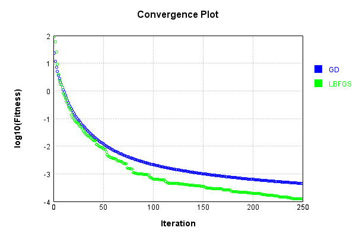
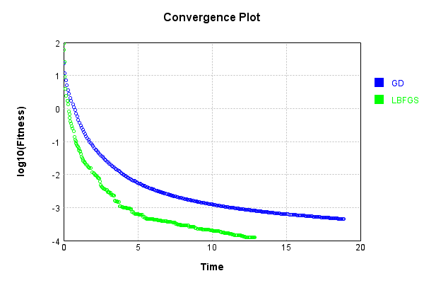
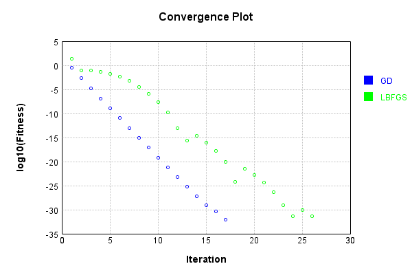
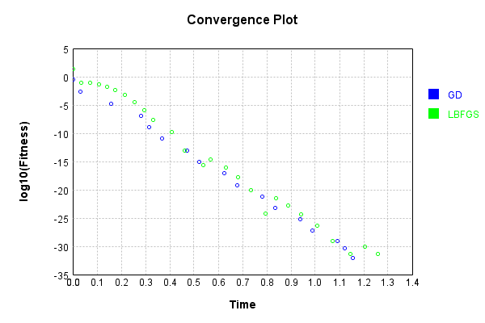
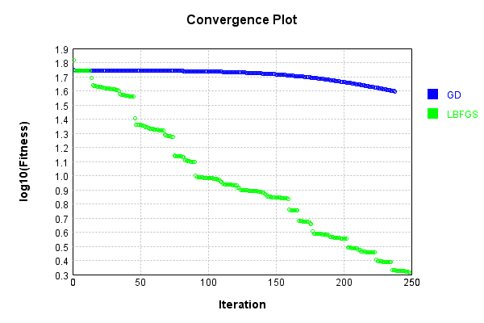
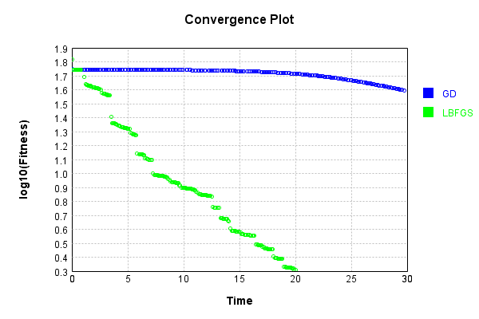

# ConvolutionLayer
## UpsizeTest
### Json Serialization
Code from [JsonTest.java:36](../../../../../../../../src/main/java/com/simiacryptus/mindseye/test/unit/JsonTest.java#L36) executed in 0.00 seconds: 
```java
    JsonObject json = layer.getJson();
    NNLayer echo = NNLayer.fromJson(json);
    if ((echo == null)) throw new AssertionError("Failed to deserialize");
    if ((layer == echo)) throw new AssertionError("Serialization did not copy");
    if ((!layer.equals(echo))) throw new AssertionError("Serialization not equal");
    return new GsonBuilder().setPrettyPrinting().create().toJson(json);
```

Returns: 

```
    {
      "class": "com.simiacryptus.mindseye.layers.aparapi.ConvolutionLayer",
      "id": "c9e73cbc-e47d-4b01-a84f-ba0871fedb3d",
      "isFrozen": false,
      "name": "ConvolutionLayer/c9e73cbc-e47d-4b01-a84f-ba0871fedb3d",
      "filter": [
        [
          [
            0.856,
            -0.068,
            -0.452
          ],
          [
            -0.756,
            -1.796,
            0.356
          ],
          [
            0.404,
            -0.432,
            0.944
          ]
        ],
        [
          [
            1.852,
            0.08,
            -0.688
          ],
          [
            -1.044,
            -1.316,
            1.596
          ],
          [
            -1.948,
            -0.752,
            -0.844
          ]
        ],
        [
          [
            0.98,
            0.9,
            0.388
          ],
          [
            0.94,
            -0.544,
            0.08
          ],
          [
            -0.604,
            0.78,
            0.324
          ]
        ],
        [
          [
            -0.412,
            -0.86,
            1.728
          ],
          [
            1.904,
            0.236,
            1.64
          ],
          [
            -0.98,
            1.052,
            0.428
          ]
        ],
        [
          [
            -1.768,
            1.052,
            -1.308
          ],
          [
            1.348,
            1.176,
            -1.888
          ],
          [
            -1.904,
            1.556,
            -0.896
          ]
        ],
        [
          [
            0.988,
            0.008,
            1.528
          ],
          [
            0.636,
            -1.796,
            -1.82
          ],
          [
            1.34,
            0.424,
            0.224
          ]
        ]
      ],
      "skip": [
        [
          0.0
        ]
      ],
      "simple": false
    }
```


### Example Input/Output Pair
Code from [ReferenceIO.java:68](../../../../../../../../src/main/java/com/simiacryptus/mindseye/test/unit/ReferenceIO.java#L68) executed in 0.01 seconds: 
```java
    SimpleEval eval = SimpleEval.run(layer, inputPrototype);
    return String.format("--------------------\nInput: \n[%s]\n--------------------\nOutput: \n%s\n--------------------\nDerivative: \n%s",
      Arrays.stream(inputPrototype).map(t -> t.prettyPrint()).reduce((a, b) -> a + ",\n" + b).get(),
      eval.getOutput().prettyPrint(),
      Arrays.stream(eval.getDerivative()).map(t -> t.prettyPrint()).reduce((a, b) -> a + ",\n" + b).get());
```

Returns: 

```
    --------------------
    Input: 
    [[
    	[ [ 1.524, 0.072 ], [ -0.8, -0.136 ], [ 1.048, -0.948 ] ],
    	[ [ -0.192, -0.58 ], [ 0.008, 0.128 ], [ -0.324, -1.368 ] ],
    	[ [ 0.412, 0.22 ], [ -0.672, 0.1 ], [ -1.548, 1.264 ] ]
    ]]
    --------------------
    Output: 
    [
    	[ [ 1.27488, 2.695152, 1.564656 ] ]
    ]
    --------------------
    Derivative: 
    [
    	[ [ 3.688, -1.1920000000000002 ], [ 0.0, 0.0 ], [ 0.0, 0.0 ] ],
    	[ [ 0.0, 0.0 ], [ 0.0, 0.0 ], [ 0.0, 0.0 ] ],
    	[ [ 0.0, 0.0 ], [ 0.0, 0.0 ], [ 0.0, 0.0 ] ]
    ]
```


### Batch Execution
Code from [BatchingTester.java:66](../../../../../../../../src/main/java/com/simiacryptus/mindseye/test/unit/BatchingTester.java#L66) executed in 0.10 seconds: 
```java
    return test(reference, inputPrototype);
```

Returns: 

```
    ToleranceStatistics{absoluteTol=0.0000e+00 +- 0.0000e+00 [0.0000e+00 - 0.0000e+00] (210#), relativeTol=0.0000e+00 +- 0.0000e+00 [0.0000e+00 - 0.0000e+00] (50#)}
```


Code from [SingleDerivativeTester.java:77](../../../../../../../../src/main/java/com/simiacryptus/mindseye/test/unit/SingleDerivativeTester.java#L77) executed in 0.39 seconds: 
```java
    return test(component, inputPrototype);
```
Logging: 
```
    Inputs: [
    	[ [ -0.556, -0.736 ], [ 1.612, 1.448 ], [ 0.388, 1.508 ] ],
    	[ [ 1.956, -1.784 ], [ -0.028, -1.428 ], [ -0.172, -1.524 ] ],
    	[ [ 1.764, -1.984 ], [ 1.596, 0.412 ], [ -1.932, 0.512 ] ]
    ]
    Inputs Statistics: {meanExponent=-0.07401499665110986, negative=9, min=0.512, max=0.512, mean=0.05844444444444447, count=18.0, positive=9, stdDev=1.3554336010714727, zeros=0}
    Output: [
    	[ [ -0.17270400000000005, 0.27153599999999983, -1.272048 ] ]
    ]
    Outputs Statistics: {meanExponent=-0.4081222293415607, negative=2, min=-1.272048, max=-1.272048, mean=-0.3910720000000001, count=3.0, positive=1, stdDev=0.6488072794659443, zeros=0}
    Feedback for input 0
    Inputs Values: [
    	[ [ -0.556, -0.736 ], [ 1.612, 1.448 ], [ 0.388, 1.508 ] ],
    	[ [ 1.956, -1.784 ], [ -0.028, -1.428 ], [ -0.172, -1.524 ] ],
    	[ [ 1.764, -1.984 ], [ 1.596, 0.412 ], [ -1.932, 0.512 ] ]
    ]
    Value Statistics: {meanExponent=-0.07401499665110986, negative=9, min=0.512, max=0.512, mean=0.05844444444444447, count=18.0, positive=9, stdDev=1.3554336010714727, 
```
...[skipping 1581 bytes](etc/26.txt)...
```
     mean=-0.023925925925925927, count=162.0, positive=0, stdDev=0.12322214986249531, zeros=156}
    Measured Gradient: [ [ -0.5559999999998899, 0.0, 0.0 ], [ 0.0, 0.0, 0.0 ], [ 0.0, 0.0, 0.0 ], [ 0.0, 0.0, 0.0 ], [ 0.0, 0.0, 0.0 ], [ 0.0, 0.0, 0.0 ], [ 0.0, 0.0, 0.0 ], [ 0.0, 0.0, 0.0 ], ... ]
    Measured Statistics: {meanExponent=-0.19402369704023614, negative=6, min=0.0, max=0.0, mean=-0.02392592592592347, count=162.0, positive=0, stdDev=0.12322214986247408, zeros=156}
    Gradient Error: [ [ 1.1013412404281553E-13, 0.0, 0.0 ], [ 0.0, 0.0, 0.0 ], [ 0.0, 0.0, 0.0 ], [ 0.0, 0.0, 0.0 ], [ 0.0, 0.0, 0.0 ], [ 0.0, 0.0, 0.0 ], [ 0.0, 0.0, 0.0 ], [ 0.0, 0.0, 0.0 ], ... ]
    Error Statistics: {meanExponent=-12.5803749627326, negative=3, min=0.0, max=0.0, mean=2.457567756978896E-15, count=162.0, positive=3, stdDev=9.741523666756871E-14, zeros=156}
    Finite-Difference Derivative Accuracy:
    absoluteTol: 1.9774e-14 +- 1.0493e-13 [0.0000e+00 - 1.0403e-12] (216#)
    relativeTol: 2.3296e-13 +- 1.9170e-13 [9.5316e-15 - 7.0671e-13] (12#)
    
```

Returns: 

```
    ToleranceStatistics{absoluteTol=1.9774e-14 +- 1.0493e-13 [0.0000e+00 - 1.0403e-12] (216#), relativeTol=2.3296e-13 +- 1.9170e-13 [9.5316e-15 - 7.0671e-13] (12#)}
```


### Performance
Now we execute larger-scale runs to benchmark performance:

Code from [PerformanceTester.java:66](../../../../../../../../src/main/java/com/simiacryptus/mindseye/test/unit/PerformanceTester.java#L66) executed in 2.31 seconds: 
```java
    test(component, inputPrototype);
```
Logging: 
```
    100 batches
    Input Dimensions:
    	[100, 100, 3]
    Performance:
    	Evaluation performance: 0.098074s +- 0.009132s [0.091171s - 0.114472s]
    	Learning performance: 0.268066s +- 0.017325s [0.252389s - 0.294881s]
    
```

### Input Learning
In this test, we use a network to learn this target input, given it's pre-evaluated output:

Code from [LearningTester.java:127](../../../../../../../../src/main/java/com/simiacryptus/mindseye/test/unit/LearningTester.java#L127) executed in 0.01 seconds: 
```java
    return Arrays.stream(input_target).map(x -> x.prettyPrint()).reduce((a, b) -> a + "\n" + b).orElse("");
```

Returns: 

```
    [
    	[ [ 1.096, -0.284, 1.228 ], [ -1.952, -1.436, 1.348 ], [ 1.912, 0.808, 1.168 ], [ 0.212, -0.796, 1.108 ], [ -0.128, -0.86, 1.948 ], [ -1.368, -1.832, -1.984 ], [ -0.96, 0.524, -1.88 ], [ -0.704, 1.68, 0.712 ], ... ],
    	[ [ -0.892, 1.048, -0.608 ], [ 0.568, -0.472, -0.116 ], [ -0.82, 0.644, -1.008 ], [ -0.932, 1.556, 0.476 ], [ -0.292, 0.712, -0.228 ], [ -0.536, -1.228, -0.252 ], [ -1.652, 1.376, 0.2 ], [ 1.384, -0.208, 0.804 ], ... ],
    	[ [ -1.748, -0.46, 0.02 ], [ -1.952, 0.924, -1.764 ], [ -1.06, -1.416, 0.924 ], [ 1.436, -1.46, -1.648 ], [ -1.56, 1.136, -0.984 ], [ 1.236, 0.704, 1.592 ], [ 1.048, 0.696, -1.152 ], [ -1.844, -0.364, -1.704 ], ... ],
    	[ [ 1.412, 2.0, 0.728 ], [ -0.272, -0.312, -1.404 ], [ 1.752, 0.896, -1.744 ], [ 0.076, -1.964, -0.976 ], [ -0.752, 0.116, 0.504 ], [ 1.252, -1.872, -1.388 ], [ 0.724, 1.96, -0.656 ], [ 0.436, 0.528, -0.228 ], ... ],
    	[ [ -0.096, 0.364, 0.388 ], [ 0.668, -1.436, 0.548 ], [ -1.052, 1.228, 0.44 ], [ -1.22, 0.904, -1.416 ], [ 0.592, 1.608, 0.86 ], [ 0.216, -0.188, 0.604 ], [ 1.768, 0.752, 0.656 ], [ -1.428, -1.22, 1.188 ], ... ],
    	[ [ 1.944, -0.936, 0.556 ], [ -0.372, 1.816, 0.636 ], [ 1.284, -0.424, 0.712 ], [ -1.644, -1.784, 1.084 ], [ 0.64, 1.404, 0.276 ], [ 0.144, -0.632, -1.092 ], [ -0.956, -0.312, -1.292 ], [ -0.436, 1.52, -1.516 ], ... ],
    	[ [ -1.512, -0.64, 1.58 ], [ 0.304, 1.952, 0.188 ], [ 1.804, -0.04, 0.628 ], [ 0.844, -0.952, 1.66 ], [ -0.36, -1.716, 1.196 ], [ 0.208, 1.796, -1.496 ], [ -1.76, -1.32, 0.988 ], [ 0.012, 0.42, 0.168 ], ... ],
    	[ [ 0.348, -0.992, -0.56 ], [ 1.968, -0.932, 0.144 ], [ 0.436, 1.072, 1.172 ], [ -1.744, -1.608, -1.296 ], [ -1.264, 1.228, -0.756 ], [ -1.224, -0.848, -0.052 ], [ -0.124, -0.884, 1.932 ], [ -1.96, -0.784, 1.916 ], ... ],
    	...
    ]
```


First, we use a conjugate gradient descent method, which converges the fastest for purely linear functions.

Code from [LearningTester.java:300](../../../../../../../../src/main/java/com/simiacryptus/mindseye/test/unit/LearningTester.java#L300) executed in 19.13 seconds: 
```java
    return new IterativeTrainer(trainable)
      .setLineSearchFactory(label -> new QuadraticSearch())
      .setOrientation(new GradientDescent())
      .setMonitor(monitor)
      .setTimeout(30, TimeUnit.SECONDS)
      .setMaxIterations(250)
      .setTerminateThreshold(0)
      .run();
```
Logging: 
```
    Constructing line search parameters: GD
    F(0.0) = LineSearchPoint{point=PointSample{avg=111.74651602183641}, derivative=-1.6998986953409019}
    New Minimum: 111.74651602183641 > 111.74651602166692
    F(1.0E-10) = LineSearchPoint{point=PointSample{avg=111.74651602166692}, derivative=-1.6998986953392645}, delta = -1.694928641882143E-10
    New Minimum: 111.74651602166692 > 111.74651602064665
    F(7.000000000000001E-10) = LineSearchPoint{point=PointSample{avg=111.74651602064665}, derivative=-1.6998986953294404}, delta = -1.1897611784661422E-9
    New Minimum: 111.74651602064665 > 111.74651601350672
    F(4.900000000000001E-9) = LineSearchPoint{point=PointSample{avg=111.74651601350672}, derivative=-1.6998986952606716}, delta = -8.329692491315654E-9
    New Minimum: 111.74651601350672 > 111.74651596353003
    F(3.430000000000001E-8) = LineSearchPoint{point=PointSample{avg=111.74651596353003}, derivative=-1.6998986947792896}, delta = -5.8306383721173916E-8
    New Minimum: 111.74651596353003 > 111.7465156136898
    F(2.4010000000000004E-7) =
```
...[skipping 286952 bytes](etc/27.txt)...
```
    int{point=PointSample{avg=4.49229906722184E-4}, derivative=-7.329945595184499E-8}
    F(252.6871669168375) = LineSearchPoint{point=PointSample{avg=4.6309197305937906E-4}, derivative=1.8301667274870323E-7}, delta = 1.386206633719508E-5
    New Minimum: 4.49229906722184E-4 > 4.479967711245776E-4
    F(19.43747437821827) = LineSearchPoint{point=PointSample{avg=4.479967711245776E-4}, derivative=-5.35828306671873E-8}, delta = -1.2331355976063921E-6
    F(136.06232064752788) = LineSearchPoint{point=PointSample{avg=4.486460269136606E-4}, derivative=6.471692104075853E-8}, delta = -5.838798085233622E-7
    4.486460269136606E-4 <= 4.49229906722184E-4
    New Minimum: 4.479967711245776E-4 > 4.4658153612309604E-4
    F(72.26167137791018) = LineSearchPoint{point=PointSample{avg=4.4658153612309604E-4}, derivative=-2.040965104870827E-22}, delta = -2.648370599087936E-6
    Left bracket at 72.26167137791018
    Converged to left
    Iteration 250 complete. Error: 4.4658153612309604E-4 Total: 249308804129839.2500; Orientation: 0.0008; Line Search: 0.0546
    
```

Returns: 

```
    4.4658153612309604E-4
```


This training run resulted in the following regressed input:

Code from [LearningTester.java:144](../../../../../../../../src/main/java/com/simiacryptus/mindseye/test/unit/LearningTester.java#L144) executed in 0.01 seconds: 
```java
    return Arrays.stream(input_gd).map(x -> x.prettyPrint()).reduce((a, b) -> a + "\n" + b).orElse("");
```

Returns: 

```
    [
    	[ [ 1.034501670010058, -0.30905052984469195, 1.1932774419472687 ], [ -1.821419271678079, -1.4635554404773063, 1.3626898036406963 ], [ 1.6818271107931164, 0.8212192169320198, 1.2195852056284626 ], [ 0.5707075158886932, -0.44838429061681184, 0.9542193086661335 ], [ 0.14893830953201606, -0.7412463555568534, 2.0667344115276616 ], [ -1.50316401727628, -2.117615652828665, -1.9866846475275841 ], [ -1.1024649372156683, 0.6722381408601624, -1.7411565439610046 ], [ -0.3936933935292406, 1.989272175326221, 0.4333223241856893 ], ... ],
    	[ [ -0.8504766521183429, 0.9385512433958645, -0.45758868941990494 ], [ 0.4440509881376363, -0.08647684148473325, -0.14671709726157622 ], [ -0.12124073608348172, 1.3537026441014925, -0.8449727657057666 ], [ -0.3042323332123693, 0.7845748365690626, 0.16269054052135243 ], [ -0.5542340070056502, 0.3115129851815615, 0.38794368471135504 ], [ -0.9971858138948156, -0.463661760068775, -0.5203074584175054 ], [ -0.8207580829013889, 1.5651959410852112, -0.03980419957695504 ], [ 1.5709642336866734, 
```
...[skipping 2231 bytes](etc/28.txt)...
```
    6580061 ], [ -0.21095647749378926, 1.547534471113862, -0.9095621545816915 ], [ 0.29341616322357944, 1.072989438179826, -0.7688687096613782 ], [ -0.6808632136130298, -0.29471545181659825, 0.424039615561137 ], [ 0.04918495506528877, -1.5821470220733016, -0.8425334828507993 ], [ -0.5352616146512549, 0.20053713562821707, -0.5617569936561047 ], [ -1.5636631713259437, -0.786019056647118, 0.8519521480080576 ], [ 0.1419805139123858, -0.1667383940149594, 0.08880078882581181 ], ... ],
    	[ [ 1.0697634201316708, -0.6571253134577509, 0.8339529705709612 ], [ 0.22074407703889917, 0.19636705048585235, -0.8942270954232979 ], [ -0.8332291895578285, 1.1153390942565145, 0.6804003404334784 ], [ -1.2277063288599868, -1.8943442318805608, -1.473885434852807 ], [ -1.7139789805560983, 0.6083018294173583, -0.6614088027493366 ], [ -0.3514936400218214, 0.16684989469441686, -1.0796115626194862 ], [ -0.22428551768791563, -1.9354357944009681, 1.7042449818032797 ], [ -2.411413001677042, -0.4454416886432884, 1.0818574343085279 ], ... ],
    	...
    ]
```


Next, we run the same optimization using L-BFGS, which is nearly ideal for purely second-order or quadratic functions.

Code from [LearningTester.java:324](../../../../../../../../src/main/java/com/simiacryptus/mindseye/test/unit/LearningTester.java#L324) executed in 12.96 seconds: 
```java
    return new IterativeTrainer(trainable)
      .setLineSearchFactory(label -> new ArmijoWolfeSearch())
      .setOrientation(new LBFGS())
      .setMonitor(monitor)
      .setTimeout(30, TimeUnit.SECONDS)
      .setMaxIterations(250)
      .setTerminateThreshold(0)
      .run();
```
Logging: 
```
    LBFGS Accumulation History: 1 points
    Constructing line search parameters: GD
    th(0)=111.74651602183641;dx=-1.6998986953409019
    New Minimum: 111.74651602183641 > 108.12219491725857
    WOLFE (weak): th(2.154434690031884)=108.12219491725857; dx=-1.664622978346639 delta=3.624321104577845
    New Minimum: 108.12219491725857 > 104.57387304108765
    WOLFE (weak): th(4.308869380063768)=104.57387304108765; dx=-1.6293472613523763 delta=7.172642980748762
    New Minimum: 104.57387304108765 > 91.1405778204896
    END: th(12.926608140191302)=91.1405778204896; dx=-1.488244393375325 delta=20.605938201346817
    Iteration 1 complete. Error: 91.1405778204896 Total: 249308914604847.1600; Orientation: 0.0015; Line Search: 0.0398
    LBFGS Accumulation History: 1 points
    th(0)=91.1405778204896;dx=-1.3068350468748637
    New Minimum: 91.1405778204896 > 59.42433288820561
    END: th(27.849533001676672)=59.42433288820561; dx=-0.9708508971138253 delta=31.716244932283985
    Iteration 2 complete. Error: 59.42433288820561 Total: 249308945366554.1000; Orientatio
```
...[skipping 141740 bytes](etc/29.txt)...
```
    ntation: 0.0015; Line Search: 0.0435
    LBFGS Accumulation History: 1 points
    th(0)=1.2492124172464966E-4;dx=-2.710343124614724E-9
    New Minimum: 1.2492124172464966E-4 > 1.2464418906344405E-4
    WOLF (strong): th(221.64965946830108)=1.2464418906344405E-4; dx=2.1042806162682354E-10 delta=2.770526612056075E-7
    END: th(110.82482973415054)=1.2470179190169478E-4; dx=-1.249957531494004E-9 delta=2.1944982295487767E-7
    Iteration 249 complete. Error: 1.2464418906344405E-4 Total: 249321735012308.3000; Orientation: 0.0016; Line Search: 0.0360
    LBFGS Accumulation History: 1 points
    th(0)=1.2470179190169478E-4;dx=-2.635664870758296E-9
    New Minimum: 1.2470179190169478E-4 > 1.24413158563875E-4
    WOLF (strong): th(238.76485769613092)=1.24413158563875E-4; dx=2.179444356391752E-10 delta=2.8863333781977817E-7
    END: th(119.38242884806546)=1.2447230753028947E-4; dx=-1.208860217559611E-9 delta=2.2948437140531738E-7
    Iteration 250 complete. Error: 1.24413158563875E-4 Total: 249321777594349.2500; Orientation: 0.0014; Line Search: 0.0325
    
```

Returns: 

```
    1.2447230753028947E-4
```


This training run resulted in the following regressed input:

Code from [LearningTester.java:154](../../../../../../../../src/main/java/com/simiacryptus/mindseye/test/unit/LearningTester.java#L154) executed in 0.01 seconds: 
```java
    return Arrays.stream(input_lbgfs).map(x -> x.prettyPrint()).reduce((a, b) -> a + "\n" + b).orElse("");
```

Returns: 

```
    [
    	[ [ 1.0501183769248037, -0.3162187735061728, 1.1895404844014972 ], [ -1.8879981122273668, -1.497569377159687, 1.3682226811174714 ], [ 1.684576251548891, 0.8110376578332581, 1.1964811271173943 ], [ 0.5547642675777346, -0.43360560543283744, 0.99234008765308 ], [ 0.20703196758711448, -0.7154124201360004, 2.05045987134031 ], [ -1.521053818616326, -2.132977605992456, -1.9664262622778865 ], [ -1.100704102278362, 0.6577159518086221, -1.7526954251528504 ], [ -0.3800996388438913, 2.01948508619937, 0.46909168915523775 ], ... ],
    	[ [ -0.8656695325512567, 0.932313582471173, -0.511812014130874 ], [ 0.37170497876221426, -0.11115065991640993, -0.08134464437579866 ], [ -0.2924974235483188, 1.3048238667816088, -0.9605710789834387 ], [ -0.1967263156208549, 0.8344634116241062, 0.16956999851498367 ], [ -0.5736850835667838, 0.26449940183854664, 0.36454633203001335 ], [ -0.9133510300998249, -0.39365789414438074, -0.46649514035220585 ], [ -0.9132258361109089, 1.5094811595082962, -0.07498793207459897 ], [ 1.6362877400154665, -1.2
```
...[skipping 2233 bytes](etc/30.txt)...
```
    71547493 ], [ 0.15670174175143212, 1.7191090096957038, -0.6545007182371054 ], [ 0.4546818508492308, 1.1393068332219267, -0.5520274374251286 ], [ -0.7520270565369264, -0.4533867641158286, 0.47836191485005325 ], [ 5.642400791580227E-4, -1.6672547179228356, -0.9054179059871295 ], [ -0.5345485075753887, 0.28109880083665467, -0.6331167681490208 ], [ -1.5815343988699215, -0.7613985696989899, 0.8406355695569997 ], [ 0.16675002685932744, -0.16933717917450544, 0.08966388867009967 ], ... ],
    	[ [ 1.103854194267209, -0.878652330979143, 0.7256638558077901 ], [ 0.57282780995754, 1.5842998677721536E-5, -0.9127603243566349 ], [ -0.8163065909273837, 1.11761722365046, 0.8412293688998539 ], [ -1.349232050509824, -1.7330976681754537, -1.5188075761803086 ], [ -1.7091654980810633, 0.6343137167784719, -0.6552230218018481 ], [ -0.3112236451349051, 0.11892429106924869, -1.0226605998612461 ], [ -0.22322300783105872, -1.958514162132381, 1.6887893942391141 ], [ -2.4306900084230003, -0.45329871522330734, 1.05931413246815 ], ... ],
    	...
    ]
```


Code from [LearningTester.java:96](../../../../../../../../src/main/java/com/simiacryptus/mindseye/test/unit/LearningTester.java#L96) executed in 0.01 seconds: 
```java
    return TestUtil.compare(runs);
```

Returns: 




Code from [LearningTester.java:99](../../../../../../../../src/main/java/com/simiacryptus/mindseye/test/unit/LearningTester.java#L99) executed in 0.00 seconds: 
```java
    return TestUtil.compareTime(runs);
```

Returns: 




### Model Learning
In this test, attempt to train a network to emulate a randomized network given an example input/output. The target state is:

Code from [LearningTester.java:176](../../../../../../../../src/main/java/com/simiacryptus/mindseye/test/unit/LearningTester.java#L176) executed in 0.00 seconds: 
```java
    return network_target.state().stream().map(Arrays::toString).reduce((a, b) -> a + "\n" + b).orElse("");
```

Returns: 

```
    [0.504, 0.988, -1.968, -1.508, -1.064, -0.208, 0.128, -1.56, 1.256, 0.796, 0.108, -1.824, -1.048, -1.048, 1.704, -1.14, 0.752, -0.824, -0.068, -1.24, 1.736, 0.664, 1.188, 1.936, -1.836, -0.616, 1.812, 1.92, -0.752, -1.564, -1.924, 0.424, 1.976, -0.988, -1.9, -0.092, 0.532, 0.916, 1.544, -1.828, -1.272, 0.804, -1.7, -1.188, 1.236, -0.532, 1.656, 0.792, 0.672, -1.848, 0.02, -0.756, 0.716, -1.228]
```


First, we use a conjugate gradient descent method, which converges the fastest for purely linear functions.

Code from [LearningTester.java:300](../../../../../../../../src/main/java/com/simiacryptus/mindseye/test/unit/LearningTester.java#L300) executed in 1.45 seconds: 
```java
    return new IterativeTrainer(trainable)
      .setLineSearchFactory(label -> new QuadraticSearch())
      .setOrientation(new GradientDescent())
      .setMonitor(monitor)
      .setTimeout(30, TimeUnit.SECONDS)
      .setMaxIterations(250)
      .setTerminateThreshold(0)
      .run();
```
Logging: 
```
    Constructing line search parameters: GD
    F(0.0) = LineSearchPoint{point=PointSample{avg=98.83651336220545}, derivative=-257.70797671411816}
    New Minimum: 98.83651336220545 > 98.83651333643517
    F(1.0E-10) = LineSearchPoint{point=PointSample{avg=98.83651333643517}, derivative=-257.70797668040075}, delta = -2.5770276579351048E-8
    New Minimum: 98.83651333643517 > 98.8365131818104
    F(7.000000000000001E-10) = LineSearchPoint{point=PointSample{avg=98.8365131818104}, derivative=-257.7079764780961}, delta = -1.8039504823263997E-7
    New Minimum: 98.8365131818104 > 98.83651209943658
    F(4.900000000000001E-9) = LineSearchPoint{point=PointSample{avg=98.83651209943658}, derivative=-257.7079750619634}, delta = -1.2627688761313038E-6
    New Minimum: 98.83651209943658 > 98.83650452282278
    F(3.430000000000001E-8) = LineSearchPoint{point=PointSample{avg=98.83650452282278}, derivative=-257.7079651490348}, delta = -8.839382672931606E-6
    New Minimum: 98.83650452282278 > 98.83645148653058
    F(2.4010000000000004E-7) = LineSearchPoint{poi
```
...[skipping 19229 bytes](etc/31.txt)...
```
    int=PointSample{avg=8.138317380159941E-33}, derivative=8.400119769165947E-34}, delta = -4.313224989813911E-31
    8.138317380159941E-33 <= 4.39460816361551E-31
    Converged to right
    Iteration 17 complete. Error: 8.138317380159941E-33 Total: 249323340955302.7000; Orientation: 0.0001; Line Search: 0.0209
    Zero gradient: 2.368002366421021E-17
    F(0.0) = LineSearchPoint{point=PointSample{avg=8.138317380159941E-33}, derivative=-5.607435207375555E-34}
    New Minimum: 8.138317380159941E-33 > 3.37604249232041E-33
    F(0.7760883283552923) = LineSearchPoint{point=PointSample{avg=3.37604249232041E-33}, derivative=1.155779558071766E-34}, delta = -4.762274887839531E-33
    3.37604249232041E-33 <= 8.138317380159941E-33
    New Minimum: 3.37604249232041E-33 > 0.0
    F(0.6434610118676118) = LineSearchPoint{point=PointSample{avg=0.0}, derivative=0.0}, delta = -8.138317380159941E-33
    Right bracket at 0.6434610118676118
    Converged to right
    Iteration 18 complete. Error: 0.0 Total: 249323393512727.6600; Orientation: 0.0001; Line Search: 0.0418
    
```

Returns: 

```
    0.0
```


Training Converged

Next, we run the same optimization using L-BFGS, which is nearly ideal for purely second-order or quadratic functions.

Code from [LearningTester.java:324](../../../../../../../../src/main/java/com/simiacryptus/mindseye/test/unit/LearningTester.java#L324) executed in 1.42 seconds: 
```java
    return new IterativeTrainer(trainable)
      .setLineSearchFactory(label -> new ArmijoWolfeSearch())
      .setOrientation(new LBFGS())
      .setMonitor(monitor)
      .setTimeout(30, TimeUnit.SECONDS)
      .setMaxIterations(250)
      .setTerminateThreshold(0)
      .run();
```
Logging: 
```
    LBFGS Accumulation History: 1 points
    Constructing line search parameters: GD
    th(0)=121.36972961995386;dx=-316.2875945079035
    Armijo: th(2.154434690031884)=399.22722291118026; dx=574.227642147145 delta=-277.85749329122643
    New Minimum: 121.36972961995386 > 20.478861534119464
    WOLF (strong): th(1.077217345015942)=20.478861534119464; dx=128.97002381962076 delta=100.8908680858344
    END: th(0.3590724483386473)=34.4461925399091; dx=-167.86838839872874 delta=86.92353708004475
    Iteration 1 complete. Error: 20.478861534119464 Total: 249323513084529.6000; Orientation: 0.0001; Line Search: 0.0621
    LBFGS Accumulation History: 1 points
    th(0)=34.4461925399091;dx=-89.30375610122385
    New Minimum: 34.4461925399091 > 0.09973212971722553
    WOLF (strong): th(0.7735981389354633)=0.09973212971722553; dx=0.5071091561949439 delta=34.346460410191874
    END: th(0.3867990694677316)=8.588272557397827; dx=-44.39832347251445 delta=25.85791998251127
    Iteration 2 complete. Error: 0.09973212971722553 Total: 249323548110653.5000; Orientation: 
```
...[skipping 12077 bytes](etc/32.txt)...
```
    entation: 0.0004; Line Search: 0.0373
    LBFGS Accumulation History: 1 points
    th(0)=7.969409136071731E-31;dx=-5.1228575877628915E-31
    New Minimum: 7.969409136071731E-31 > 7.603953608641251E-31
    WOLF (strong): th(1.3662234746711588)=7.603953608641251E-31; dx=4.868620708580785E-31 delta=3.654555274304802E-32
    New Minimum: 7.603953608641251E-31 > 4.0645865115364436E-32
    END: th(0.6831117373355794)=4.0645865115364436E-32; dx=-8.590819871060613E-33 delta=7.562950484918087E-31
    Iteration 26 complete. Error: 4.0645865115364436E-32 Total: 249324770318847.2800; Orientation: 0.0002; Line Search: 0.0396
    LBFGS Accumulation History: 1 points
    th(0)=4.0645865115364436E-32;dx=-3.716944645194646E-33
    Armijo: th(1.4717196240837207)=4.3056927267317436E-32; dx=3.0212458001744013E-33 delta=-2.4110621519530002E-33
    New Minimum: 4.0645865115364436E-32 > 0.0
    END: th(0.7358598120418604)=0.0; dx=0.0 delta=4.0645865115364436E-32
    Iteration 27 complete. Error: 0.0 Total: 249324821634906.2200; Orientation: 0.0001; Line Search: 0.0389
    
```

Returns: 

```
    0.0
```


Training Converged

Code from [LearningTester.java:96](../../../../../../../../src/main/java/com/simiacryptus/mindseye/test/unit/LearningTester.java#L96) executed in 0.01 seconds: 
```java
    return TestUtil.compare(runs);
```

Returns: 




Code from [LearningTester.java:99](../../../../../../../../src/main/java/com/simiacryptus/mindseye/test/unit/LearningTester.java#L99) executed in 0.01 seconds: 
```java
    return TestUtil.compareTime(runs);
```

Returns: 




### Composite Learning
In this test, attempt to train a network to emulate a randomized network given an example input/output. The target state is:

Code from [LearningTester.java:219](../../../../../../../../src/main/java/com/simiacryptus/mindseye/test/unit/LearningTester.java#L219) executed in 0.00 seconds: 
```java
    return network_target.state().stream().map(Arrays::toString).reduce((a, b) -> a + "\n" + b).orElse("");
```

Returns: 

```
    [-1.272, 0.424, 1.256, -0.756, 0.108, -1.828, -1.24, -0.988, 1.812, -1.564, -1.924, -1.848, 0.988, 1.736, -1.228, -0.092, -1.824, 0.02, 1.544, -1.048, -0.824, -1.508, 1.976, 0.796, 1.188, -0.532, 0.752, 0.804, 0.128, -1.56, 0.672, -0.068, 1.92, 0.916, -1.7, 1.236, 1.704, -1.9, -1.968, 0.664, 0.792, -0.752, 0.532, -1.188, -1.14, 1.936, -1.048, 0.504, 1.656, 0.716, -1.836, -0.616, -0.208, -1.064]
```


We simultaneously regress this target input:

Code from [LearningTester.java:223](../../../../../../../../src/main/java/com/simiacryptus/mindseye/test/unit/LearningTester.java#L223) executed in 0.01 seconds: 
```java
    return Arrays.stream(testInput).map(x -> x.prettyPrint()).reduce((a, b) -> a + "\n" + b).orElse("");
```

Returns: 

```
    [
    	[ [ -0.356, 0.756, -0.132 ], [ -0.872, -1.12, -1.084 ], [ 0.412, 1.944, 0.504 ], [ 1.516, -1.588, 0.192 ], [ 0.12, -1.004, 1.748 ], [ -0.088, 0.528, 0.824 ], [ 1.292, -1.94, -0.204 ], [ -0.736, -0.408, -1.308 ], ... ],
    	[ [ 1.544, -0.5, -1.468 ], [ 0.544, -0.276, -1.308 ], [ -0.744, 0.316, -1.22 ], [ -1.196, -0.632, -0.936 ], [ 0.024, -1.34, 1.596 ], [ 1.716, 0.304, -1.32 ], [ 1.136, -0.624, -1.852 ], [ 0.796, 0.096, 0.208 ], ... ],
    	[ [ 0.704, -1.932, 1.712 ], [ 1.78, -0.772, -0.268 ], [ 1.584, 1.432, -1.304 ], [ -1.912, 1.62, -0.464 ], [ 0.148, -1.24, -1.144 ], [ 1.064, -0.376, 1.512 ], [ 1.096, 0.972, -1.16 ], [ -0.584, 1.948, 1.668 ], ... ],
    	[ [ 1.772, 1.844, -0.036 ], [ 1.86, -0.352, -1.524 ], [ 0.924, 1.428, -0.168 ], [ 0.752, -1.676, 1.812 ], [ 1.364, 1.052, 0.4 ], [ -0.02, 0.908, -0.02 ], [ -0.412, -0.28, -0.208 ], [ 1.744, 1.42, 1.304 ], ... ],
    	[ [ 1.36, 0.388, -0.82 ], [ -1.152, -1.12, 1.892 ], [ 1.164, 1.228, 1.764 ], [ -0.888, 1.872, 1.48 ], [ 0.404, -0.932, -1.668 ], [ 0.18, -0.088, -0.068 ], [ -0.084, 0.744, 0.516 ], [ 1.652, -0.976, 0.972 ], ... ],
    	[ [ 1.724, -0.096, 0.052 ], [ 0.904, -0.62, -0.176 ], [ 0.876, -1.608, 1.42 ], [ -0.36, -1.548, -0.06 ], [ 1.532, -0.312, 0.216 ], [ 1.328, 0.464, 1.132 ], [ 0.648, 0.872, -0.888 ], [ 0.584, 0.08, 1.58 ], ... ],
    	[ [ -0.08, -0.04, 0.86 ], [ -0.576, -0.72, -0.216 ], [ -0.028, 1.416, 0.004 ], [ -1.64, -0.704, 1.26 ], [ 1.604, 0.624, -0.884 ], [ 1.02, -0.724, 0.144 ], [ 1.688, -0.412, -0.312 ], [ -1.056, -1.208, -1.568 ], ... ],
    	[ [ -1.564, 0.008, 1.416 ], [ -0.048, 0.116, 1.264 ], [ 0.088, -0.752, 0.332 ], [ -1.792, -1.668, 1.544 ], [ 1.2, 1.14, 1.544 ], [ -1.616, 0.048, -1.964 ], [ 1.984, 0.92, 1.652 ], [ -1.308, -0.948, -1.1 ], ... ],
    	...
    ]
```


Which produces the following output:

Code from [LearningTester.java:230](../../../../../../../../src/main/java/com/simiacryptus/mindseye/test/unit/LearningTester.java#L230) executed in 0.01 seconds: 
```java
    return Stream.of(targetOutput).map(x -> x.prettyPrint()).reduce((a, b) -> a + "\n" + b).orElse("");
```

Returns: 

```
    [
    	[ [ 1.395168, 0.9090560000000001 ], [ -3.4257920000000004, -1.697584 ], [ 6.234048, -0.7083680000000001 ], [ -7.7873920000000005, -1.0059680000000006 ], [ 4.718591999999999, 4.5701920000000005 ], [ 1.251008, 2.7836159999999994 ], [ -5.580576, -4.350448 ], [ 1.0654719999999998, -2.090064 ], ... ],
    	[ [ -5.9298720000000005, -4.738816 ], [ -0.5204639999999994, -2.94008 ], [ -10.677408000000003, -6.348272 ], [ 5.500496, -1.147216 ], [ -4.575488, -3.547167999999999 ], [ -4.289935999999999, -2.3250399999999996 ], [ -5.975168000000001, -9.357568 ], [ -6.553952, 1.8596800000000004 ], ... ],
    	[ [ 2.196304, -1.4241440000000003 ], [ 3.9391680000000004, 5.204319999999999 ], [ -4.494048000000002, -6.389056 ], [ 1.3911680000000004, 5.64544 ], [ -13.043200000000002, -7.725792 ], [ 6.688783999999998, -4.4951039999999995 ], [ 0.8734880000000009, 0.3165760000000014 ], [ -2.9262720000000004, -4.09608 ], ... ],
    	[ [ 4.842528000000001, -7.567680000000001 ], [ -8.594975999999999, -5.270351999999998 ], [ 2.302447999999999, 5.545
```
...[skipping 539 bytes](etc/33.txt)...
```
    3 ], ... ],
    	[ [ 0.2524959999999998, -10.549904 ], [ -2.295359999999999, -0.9161280000000006 ], [ -6.407968000000001, -9.305871999999999 ], [ 0.18163199999999965, 13.282384 ], [ 2.3842560000000006, -19.953776 ], [ -10.364960000000002, -7.548655999999999 ], [ -0.3206399999999989, 5.887359999999999 ], [ 0.6913920000000005, -6.0300319999999985 ], ... ],
    	[ [ 5.240432, -5.157680000000001 ], [ -4.458175999999999, 8.034528 ], [ 0.9544479999999992, -11.673680000000003 ], [ -13.083984000000001, 1.2770719999999993 ], [ 5.578000000000001, -3.8659039999999982 ], [ -5.828576, 1.0941440000000004 ], [ -3.3651680000000024, -1.655712 ], [ -9.094800000000001, -8.601743999999998 ], ... ],
    	[ [ 4.930736, 1.4314399999999996 ], [ 4.744416, 1.9535519999999997 ], [ -0.7758399999999994, -0.0480480000000008 ], [ 4.5128319999999995, 3.5552639999999993 ], [ 7.325696000000003, -13.677103999999998 ], [ -5.5359039999999995, -2.5537439999999996 ], [ 3.140688, -15.260512000000002 ], [ -1.1235199999999994, 12.963040000000001 ], ... ],
    	...
    ]
```


First, we use a conjugate gradient descent method, which converges the fastest for purely linear functions.

Code from [LearningTester.java:300](../../../../../../../../src/main/java/com/simiacryptus/mindseye/test/unit/LearningTester.java#L300) executed in 30.11 seconds: 
```java
    return new IterativeTrainer(trainable)
      .setLineSearchFactory(label -> new QuadraticSearch())
      .setOrientation(new GradientDescent())
      .setMonitor(monitor)
      .setTimeout(30, TimeUnit.SECONDS)
      .setMaxIterations(250)
      .setTerminateThreshold(0)
      .run();
```
Logging: 
```
    Constructing line search parameters: GD
    F(0.0) = LineSearchPoint{point=PointSample{avg=111.33860561949294}, derivative=-146.92534436604578}
    New Minimum: 111.33860561949294 > 111.3386056047993
    F(1.0E-10) = LineSearchPoint{point=PointSample{avg=111.3386056047993}, derivative=-146.92534434643355}, delta = -1.4693640082441561E-8
    New Minimum: 111.3386056047993 > 111.33860551664505
    F(7.000000000000001E-10) = LineSearchPoint{point=PointSample{avg=111.33860551664505}, derivative=-146.92534422876028}, delta = -1.0284789198067301E-7
    New Minimum: 111.33860551664505 > 111.338604899558
    F(4.900000000000001E-9) = LineSearchPoint{point=PointSample{avg=111.338604899558}, derivative=-146.92534340504744}, delta = -7.199349312259073E-7
    New Minimum: 111.338604899558 > 111.33860057995251
    F(3.430000000000001E-8) = LineSearchPoint{point=PointSample{avg=111.33860057995251}, derivative=-146.92533763905774}, delta = -5.0395404258551935E-6
    New Minimum: 111.33860057995251 > 111.33857034272263
    F(2.4010000000000004E-7) = LineSea
```
...[skipping 263557 bytes](etc/34.txt)...
```
    5366}, delta = 3.10078128614807
    F(0.635537999324847) = LineSearchPoint{point=PointSample{avg=39.47112342170183}, derivative=-0.13468902038239963}, delta = -0.11476843003584491
    F(4.448765995273929) = LineSearchPoint{point=PointSample{avg=40.01310104415648}, derivative=0.4202444492853781}, delta = 0.4272091924188004
    F(0.3422127688672253) = LineSearchPoint{point=PointSample{avg=39.516846913416664}, derivative=-0.17706360904249124}, delta = -0.06904493832101366
    F(2.395489382070577) = LineSearchPoint{point=PointSample{avg=39.45837920207481}, derivative=0.12047145204490117}, delta = -0.12751264966286868
    39.45837920207481 <= 39.58589185173768
    New Minimum: 39.41921076979907 > 39.40843428898854
    F(1.5636289686043663) = LineSearchPoint{point=PointSample{avg=39.40843428898854}, derivative=-3.311619008863065E-4}, delta = -0.17745756274914015
    Left bracket at 1.5636289686043663
    Converged to left
    Iteration 238 complete. Error: 39.40843428898854 Total: 249355182486197.9700; Orientation: 0.0008; Line Search: 0.1519
    
```

Returns: 

```
    39.40843428898854
```


This training run resulted in the following configuration:

Code from [LearningTester.java:245](../../../../../../../../src/main/java/com/simiacryptus/mindseye/test/unit/LearningTester.java#L245) executed in 0.00 seconds: 
```java
    return network_gd.state().stream().map(Arrays::toString).reduce((a, b) -> a + "\n" + b).orElse("");
```

Returns: 

```
    [-0.255794607201741, 0.4754419994829348, -0.4469558550109647, -0.7034827112670985, -0.2001769200315945, 0.6947146852496103, 0.6012880009765227, -0.7948207671669469, -0.21697524984494143, -0.5222761522376217, 0.696615153778028, -0.2790183941156373, -0.6184812769052028, -0.9237928234107192, 0.6086211180221003, 0.8275315669834983, -0.4692119301373462, -0.2138732868427432, -0.47414271743392944, 0.18280098938713918, 0.86518240712567, -0.10826913755141625, -0.443972036842397, 0.5254838583774311, 0.260919963288006, 0.3933309350749422, 0.1715765717701001, -0.5728403258370941, -0.18577318973858994, 1.4595604900843493, 0.11252047736611354, -1.0953307874196234, 0.37392405590010913, 0.005836440503931138, 0.37771197169445997, 0.2451087981411067, 0.5695874445351867, 0.5311810763483753, -1.40939151201437, -0.3432786211717258, -0.8725718332131904, 1.4459155613936572, 0.9363613547755344, 0.7378605156264754, -1.541257980688879, 0.8158181105860512, 0.7140679794940358, -0.2554622605561563, -0.28557440796731137, -1.24604787982219
```
...[skipping 336057 bytes](etc/35.txt)...
```
    99996, 1.7322559999999998, -0.21847999999999854, 10.065743999999999, 0.012288000000000248, 2.8730879999999988, 6.975712, 9.803840000000001, -10.709888000000001, 4.11016, -5.680656, -0.030079999999999614, -9.042928, 1.956160000000001, -0.28003199999999995, 5.574976000000001, -2.787823999999998, -15.218495999999995, -3.900240000000002, 10.191728000000001, -11.243120000000001, 7.38704, 14.468096000000003, 5.7872639999999995, 8.447007999999999, 2.390976000000001, 3.381904, 4.924112, -8.906112, 13.247519999999998, -0.13470400000000143, 2.7844, 15.905039999999994, -8.945504000000001, -1.470288, 13.717951999999999, -7.263952, -2.1736480000000005, 4.799536, -13.225455999999998, -1.2727200000000003, 11.941584000000002, 10.005408000000001, -4.344256, -0.8246079999999999, 2.3080160000000003, -4.816240000000002, 9.548624000000004, 1.5378719999999997, 10.68224, -7.534080000000001, 1.5130400000000008, -11.793872000000002, 2.397632, -2.5863359999999975, -6.6799680000000015, -0.763632, 1.4008320000000003, 2.2125440000000003]
```


And regressed input:

Code from [LearningTester.java:249](../../../../../../../../src/main/java/com/simiacryptus/mindseye/test/unit/LearningTester.java#L249) executed in 0.01 seconds: 
```java
    return Arrays.stream(input_gd).map(x -> x.prettyPrint()).reduce((a, b) -> a + "\n" + b).orElse("");
```

Returns: 

```
    [
    	[ [ 0.7346154528892946, -0.14711457843340794, -0.9425531533816512 ], [ -1.2967881971544524, 0.6786330606283754, -1.027016651502625 ], [ -1.0890386393194542, -1.5643804159323351, 1.269956836169234 ], [ -1.7191601816356834, -1.0251017859555474, -0.16836829753767854 ], [ -0.975077564870938, -1.196811188797723, 0.24816884560564173 ], [ -1.0565190279303367, -0.9238488802891405, 1.7402036337052011 ], [ 0.7554019132844766, 1.0337571151071132, -1.4490057809740613 ], [ 2.087233271081889, -1.0330572556832505, -0.7335161669881739 ], ... ],
    	[ [ -1.4538493545533764, 1.5293033100180047, -1.9584141693295454 ], [ 0.6992014541455687, 0.9011017488283672, -0.04151187881941261 ], [ -0.684649204192707, 1.8517957688576334, -1.7482695646734503 ], [ 0.8656595573904685, 1.2237889945754905, 1.9061377995798625 ], [ -0.8237600199292884, -1.0074907177509704, -0.8553933157270177 ], [ -0.6552882420101863, 0.7057312781682608, 0.6978191010692123 ], [ 0.39421525804932045, 0.11247938068910755, 1.2744467019141215 ], [ 0.1297468196601077, 1.
```
...[skipping 2219 bytes](etc/36.txt)...
```
    779625, -0.45662083700031464 ], [ 1.1537971644165694, -1.9685369244088549, 0.3780470540432888 ], [ -2.0052860919796376, 1.6499202460586144, 0.24703902267289635 ], [ 1.552283660654907, 1.987552738041292, -1.2423576540343284 ], [ -1.11136567616671, -1.7307264040080401, 1.5387088059733034 ], [ 1.2690600988601541, 1.2028492967957052, 1.0355166531818774 ], [ -0.72047278618538, 0.6956338404126481, -1.0352905334774174 ], [ 0.2369730522404526, 1.0184539596573505, 1.6385697119671292 ], ... ],
    	[ [ -0.3455098674845305, 0.8901719456161772, -0.3086625939413423 ], [ 0.352609129606334, 0.43292839895846275, -1.5100507606465496 ], [ -0.4418561087525236, -1.1994434353751546, -0.838087512436224 ], [ 1.2050745271458618, 0.016561931524168093, 0.6375072783373805 ], [ -1.246992170425331, 1.318483105475898, 0.2768465401785419 ], [ 1.98324756702466, 2.104116511992912, 0.5177528284935368 ], [ 0.7556784681622722, 1.5831414419223844, -0.8508763985797857 ], [ -1.1006316701290857, -0.27529298718455475, 1.8723620029099286 ], ... ],
    	...
    ]
```


Which produces the following output:

Code from [LearningTester.java:256](../../../../../../../../src/main/java/com/simiacryptus/mindseye/test/unit/LearningTester.java#L256) executed in 0.00 seconds: 
```java
    return Stream.of(regressedOutput).map(x -> x.prettyPrint()).reduce((a, b) -> a + "\n" + b).orElse("");
```

Returns: 

```
    [ 39.40843428898854 ]
```


Next, we run the same optimization using L-BFGS, which is nearly ideal for purely second-order or quadratic functions.

Code from [LearningTester.java:324](../../../../../../../../src/main/java/com/simiacryptus/mindseye/test/unit/LearningTester.java#L324) executed in 20.13 seconds: 
```java
    return new IterativeTrainer(trainable)
      .setLineSearchFactory(label -> new ArmijoWolfeSearch())
      .setOrientation(new LBFGS())
      .setMonitor(monitor)
      .setTimeout(30, TimeUnit.SECONDS)
      .setMaxIterations(250)
      .setTerminateThreshold(0)
      .run();
```
Logging: 
```
    LBFGS Accumulation History: 1 points
    Constructing line search parameters: GD
    th(0)=111.33860561949294;dx=-146.92534436604578
    Armijo: th(2.154434690031884)=237.91436375953478; dx=258.9139111457326 delta=-126.57575814004184
    New Minimum: 111.33860561949294 > 65.34238799920121
    WOLF (strong): th(1.077217345015942)=65.34238799920121; dx=60.12975214341147 delta=45.99621762029173
    END: th(0.3590724483386473)=71.16869085768205; dx=-76.97399276935646 delta=40.16991476181089
    Iteration 1 complete. Error: 65.34238799920121 Total: 249355302088492.7800; Orientation: 0.0015; Line Search: 0.0600
    LBFGS Accumulation History: 1 points
    th(0)=71.16869085768205;dx=-40.48501366750749
    New Minimum: 71.16869085768205 > 55.638362579441264
    WOLF (strong): th(0.7735981389354633)=55.638362579441264; dx=0.2781841123301053 delta=15.530328278240788
    END: th(0.3867990694677316)=59.46174249973129; dx=-20.06146280240873 delta=11.706948357950765
    Iteration 2 complete. Error: 55.638362579441264 Total: 249355361188736.7000; Orientation: 0.
```
...[skipping 141643 bytes](etc/37.txt)...
```
    Minimum: 2.0845776879481446 > 2.047452414809644
    END: th(22.822803192212376)=2.047452414809644; dx=-0.0020166639090865458 delta=0.050657557808734044
    Iteration 249 complete. Error: 2.047452414809644 Total: 249375221031214.8800; Orientation: 0.0015; Line Search: 0.0780
    LBFGS Accumulation History: 1 points
    th(0)=2.047452414809644;dx=-0.021526239466783215
    Armijo: th(49.17023892107276)=55.84135137048684; dx=2.20341709488765 delta=-53.7938989556772
    Armijo: th(24.58511946053638)=15.269418328973455; dx=1.0955778525868005 delta=-13.22196591416381
    Armijo: th(8.195039820178794)=3.4017940355486602; dx=0.35187970668777035 delta=-1.3543416207390164
    Armijo: th(2.0487599550446984)=2.0990889771353154; dx=0.07192298929521822 delta=-0.0516365623256716
    New Minimum: 2.047452414809644 > 2.042462254907841
    END: th(0.40975199100893966)=2.042462254907841; dx=-0.002831172732469858 delta=0.004990159901802738
    Iteration 250 complete. Error: 2.042462254907841 Total: 249375325415093.7800; Orientation: 0.0015; Line Search: 0.0894
    
```

Returns: 

```
    2.042462254907841
```


This training run resulted in the following configuration:

Code from [LearningTester.java:266](../../../../../../../../src/main/java/com/simiacryptus/mindseye/test/unit/LearningTester.java#L266) executed in 0.00 seconds: 
```java
    return network_lbfgs.state().stream().map(Arrays::toString).reduce((a, b) -> a + "\n" + b).orElse("");
```

Returns: 

```
    [-0.9996782152504092, 0.2604663549424672, 0.18573123998667235, -0.8790738415801956, -0.23413292361110757, 0.4741913661121041, 0.11486497095162523, -1.646814421589417, -0.30474734474068055, -1.0692805937466907, 0.4260867673721292, -0.8440665352550151, -1.1675207401125391, -1.894867977550146, 0.10583331024198588, 0.8812956757735377, -0.31391557375854395, -0.2570718439528488, -0.666838725508332, -0.32574823075054055, 1.4298006856785122, -0.09879967322725704, 0.9370802637745538, 0.8850068368613688, 0.6051363867908423, -0.020094734440406388, 0.20209921254531518, -0.5088506825429604, -0.1486196095070941, 3.188640872935654, 0.06912090132927569, -2.2126830456927715, 0.8518917689602323, -0.5168982508004528, 0.547370975966826, 0.7457252816761747, 0.8620920568897784, 0.569512673837577, -2.2610987967728287, -0.1231547122688777, -1.0414380916373691, 1.5015548559517002, 1.632364834536596, 0.9941158722394053, -2.1585388536402603, 1.30078160810124, 0.06865979068710763, -0.04045267617563083, -0.28834689862722296, -1.650366774
```
...[skipping 336062 bytes](etc/38.txt)...
```
    99996, 1.7322559999999998, -0.21847999999999854, 10.065743999999999, 0.012288000000000248, 2.8730879999999988, 6.975712, 9.803840000000001, -10.709888000000001, 4.11016, -5.680656, -0.030079999999999614, -9.042928, 1.956160000000001, -0.28003199999999995, 5.574976000000001, -2.787823999999998, -15.218495999999995, -3.900240000000002, 10.191728000000001, -11.243120000000001, 7.38704, 14.468096000000003, 5.7872639999999995, 8.447007999999999, 2.390976000000001, 3.381904, 4.924112, -8.906112, 13.247519999999998, -0.13470400000000143, 2.7844, 15.905039999999994, -8.945504000000001, -1.470288, 13.717951999999999, -7.263952, -2.1736480000000005, 4.799536, -13.225455999999998, -1.2727200000000003, 11.941584000000002, 10.005408000000001, -4.344256, -0.8246079999999999, 2.3080160000000003, -4.816240000000002, 9.548624000000004, 1.5378719999999997, 10.68224, -7.534080000000001, 1.5130400000000008, -11.793872000000002, 2.397632, -2.5863359999999975, -6.6799680000000015, -0.763632, 1.4008320000000003, 2.2125440000000003]
```


And regressed input:

Code from [LearningTester.java:270](../../../../../../../../src/main/java/com/simiacryptus/mindseye/test/unit/LearningTester.java#L270) executed in 0.01 seconds: 
```java
    return Arrays.stream(input_lbgfs).map(x -> x.prettyPrint()).reduce((a, b) -> a + "\n" + b).orElse("");
```

Returns: 

```
    [
    	[ [ 0.868228556421709, 0.7670026719352666, -0.44290912368671753 ], [ -0.35831683828575345, 0.8640651305234397, -0.7807059954763493 ], [ 0.6034215927890416, 0.07794017444038957, 0.6639490921517864 ], [ 0.6714277867572704, -0.07139632518688169, -0.828700939240236 ], [ -0.792599909903437, -0.7734188666360031, 1.0260326966242452 ], [ 1.7613719753772341, -0.4674670815107405, 1.1876996995524332 ], [ 1.2746673546126248, 0.4575116265592339, -1.4863216407970519 ], [ 0.4064477778106201, -0.522977187268197, -0.27134783499274695 ], ... ],
    	[ [ 0.31809850176494203, -1.584339319236365, -2.4113574929428134 ], [ 1.7642042621481877, 1.1510072828198747, 0.8905037501907189 ], [ -0.3222116835407329, 0.8147395362141313, -1.367243070541062 ], [ -0.2928113926365508, 0.5534176687023872, 0.7656796215663366 ], [ 0.9738174115079705, 1.035101407288637, -1.5889494467181973 ], [ 1.9245277182026366, -1.0592643193574671, 0.3129470252904818 ], [ 0.883667262936785, 0.7386681960292376, -1.7739462779103958 ], [ -0.6955303515963567, -0.843617
```
...[skipping 2208 bytes](etc/39.txt)...
```
    448247, 0.658103306781695 ], [ 0.7807863215322575, -1.8287275014602637, 1.7376640712384788 ], [ -2.4592772100785196, 0.8190119274027524, 0.4887896043198371 ], [ 1.5348540105626807, 2.5040720475481435, 0.7004930452356904 ], [ -1.0390294950362324, -1.435321372903856, 1.3989469179617622 ], [ 1.6929653540796747, 1.8936975686972068, -1.2792080940948267 ], [ -0.2491610860599042, -2.3291303135913335, -0.8197406185897871 ], [ 2.1953004481953085, 4.018863677332096, 0.9457545330576717 ], ... ],
    	[ [ -1.8281964581554377, 1.7325007919671083, 0.18471211208440574 ], [ 1.8532454496091995, 1.3729288292487485, -0.727806052311011 ], [ -0.8983280344561914, -1.005794490801501, -0.38267094418113007 ], [ 0.5235762300925938, 1.994630666967383, 1.213126597444712 ], [ -1.4500698529421565, -0.9227479293066793, 0.9075294794403552 ], [ 2.185446171433811, 1.4752847227429502, 1.1557011704185665 ], [ -1.2707564932991127, 2.104812773912476, -0.6043519841182469 ], [ 0.3027263559267927, 1.0343870631329817, 0.44880073888052735 ], ... ],
    	...
    ]
```


Which produces the following output:

Code from [LearningTester.java:277](../../../../../../../../src/main/java/com/simiacryptus/mindseye/test/unit/LearningTester.java#L277) executed in 0.00 seconds: 
```java
    return Stream.of(regressedOutput).map(x -> x.prettyPrint()).reduce((a, b) -> a + "\n" + b).orElse("");
```

Returns: 

```
    [ 2.042462254907841 ]
```


Code from [LearningTester.java:96](../../../../../../../../src/main/java/com/simiacryptus/mindseye/test/unit/LearningTester.java#L96) executed in 0.01 seconds: 
```java
    return TestUtil.compare(runs);
```

Returns: 




Code from [LearningTester.java:99](../../../../../../../../src/main/java/com/simiacryptus/mindseye/test/unit/LearningTester.java#L99) executed in 0.00 seconds: 
```java
    return TestUtil.compareTime(runs);
```

Returns: 




