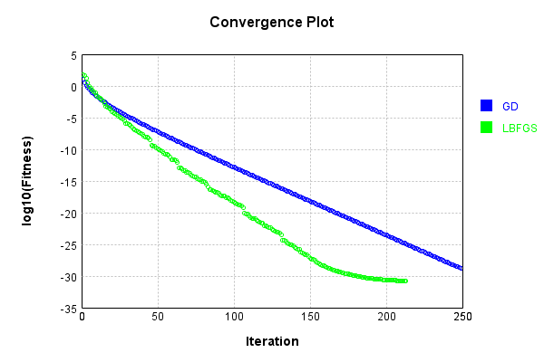
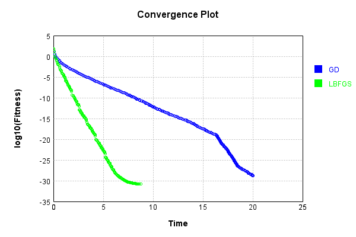
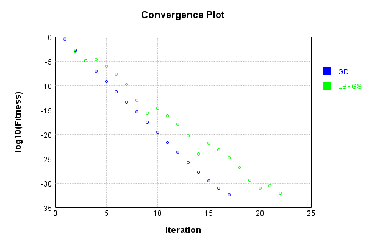
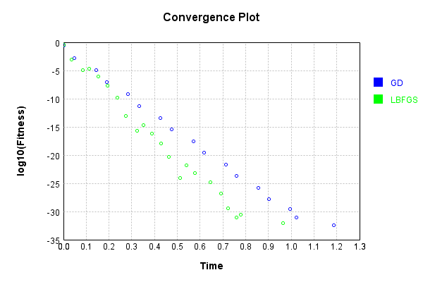

# ConvolutionLayer
## ConvolutionLayerTest
### Batch Execution
Code from [BatchingTester.java:66](../../../../../../../src/main/java/com/simiacryptus/mindseye/test/unit/BatchingTester.java#L66) executed in 2.72 seconds: 
```java
    return test(reference, inputPrototype);
```
Logging: 
```
    Found 2 devices
    Device 0 - GeForce GTX 1080 Ti
    Device 1 - GeForce GTX 1060 6GB
    Found 2 devices; using devices [0, 1]
    
```

Returns: 

```
    ToleranceStatistics{absoluteTol=0.0000e+00 +- 0.0000e+00 [0.0000e+00 - 0.0000e+00] (360#), relativeTol=0.0000e+00 +- 0.0000e+00 [0.0000e+00 - 0.0000e+00] (360#)}
```


Code from [SingleDerivativeTester.java:77](../../../../../../../src/main/java/com/simiacryptus/mindseye/test/unit/SingleDerivativeTester.java#L77) executed in 0.57 seconds: 
```java
    return test(component, inputPrototype);
```
Logging: 
```
    Inputs: [
    	[ [ 0.556, -1.436 ], [ -0.132, 1.788 ], [ -1.404, 1.66 ] ],
    	[ [ -1.048, -1.708 ], [ -0.828, 1.824 ], [ -0.4, -0.964 ] ],
    	[ [ -0.852, -1.452 ], [ -0.096, 0.288 ], [ -1.072, -1.52 ] ]
    ]
    Inputs Statistics: {meanExponent=-0.08851135982067823, negative=13, min=-1.52, max=-1.52, mean=-0.37755555555555553, count=18.0, positive=5, stdDev=1.1365132947466134, zeros=0}
    Output: [
    	[ [ -0.03464000000000023, 0.6275679999999999 ], [ -1.410544, 1.73856 ], [ -8.050048, 2.145648 ] ],
    	[ [ -3.69632, 2.67352 ], [ 7.690448, 5.797008000000001 ], [ 2.4359679999999995, -0.5535520000000002 ] ],
    	[ [ 0.016639999999999933, 4.654336000000001 ], [ 8.630288, 0.8711840000000002 ], [ -4.058768, -2.906592 ] ]
    ]
    Outputs Statistics: {meanExponent=0.19860750103411293, negative=7, min=-2.906592, max=-2.906592, mean=0.9205946666666668, count=18.0, positive=11, stdDev=4.090533881058233, zeros=0}
    Feedback for input 0
    Inputs Values: [
    	[ [ 0.556, -1.436 ], [ -0.132, 1.788 ], [ -1.404, 1.66 ] ],
    	[ [ -1.048, -1.708 ], [ -0.828, 1.82
```
...[skipping 6384 bytes](etc/1.txt)...
```
    E-12, ... ], [ 4.4497738826976274E-13, 9.50350909079134E-13, -7.494005416219807E-14, -6.016187548141261E-12, 5.056066676445425E-12, -2.760541795154836E-12, 6.256328788367682E-12, -2.620459405022757E-12, ... ], [ 0.0, 4.4497738826976274E-13, 9.50350909079134E-13, 0.0, 2.8655966488599915E-12, 5.056066676445425E-12, 0.0, -2.62545540863357E-12, ... ], [ 0.0, 0.0, 0.0, 9.50350909079134E-13, -7.494005416219807E-14, 0.0, 5.056066676445425E-12, 6.121242401846416E-12, ... ], [ 0.0, 0.0, 0.0, -3.9959147102308634E-12, 9.50350909079134E-13, -8.95672425116345E-12, 2.8655966488599915E-12, 5.056066676445425E-12, ... ], ... ]
    Error Statistics: {meanExponent=-11.846372839530515, negative=89, min=-8.404388296412435E-13, max=-8.404388296412435E-13, mean=4.6476711368370616E-14, count=648.0, positive=107, stdDev=1.6779971918500303E-12, zeros=452}
    Finite-Difference Derivative Accuracy:
    absoluteTol: 8.7047e-13 +- 1.6823e-12 [0.0000e+00 - 9.4819e-12] (972#)
    relativeTol: 2.4636e-12 +- 4.6372e-12 [2.1475e-14 - 3.1881e-11] (392#)
    
```

Returns: 

```
    ToleranceStatistics{absoluteTol=8.7047e-13 +- 1.6823e-12 [0.0000e+00 - 9.4819e-12] (972#), relativeTol=2.4636e-12 +- 4.6372e-12 [2.1475e-14 - 3.1881e-11] (392#)}
```


### Json Serialization
Code from [JsonTest.java:36](../../../../../../../src/main/java/com/simiacryptus/mindseye/test/unit/JsonTest.java#L36) executed in 0.02 seconds: 
```java
    JsonObject json = layer.getJson();
    NNLayer echo = NNLayer.fromJson(json);
    if ((echo == null)) throw new AssertionError("Failed to deserialize");
    if ((layer == echo)) throw new AssertionError("Serialization did not copy");
    if ((!layer.equals(echo))) throw new AssertionError("Serialization not equal");
    return new GsonBuilder().setPrettyPrinting().create().toJson(json);
```

Returns: 

```
    {
      "class": "com.simiacryptus.mindseye.layers.aparapi.ConvolutionLayer",
      "id": "9174fc1e-bd22-4d16-9bd4-96f6299def47",
      "isFrozen": false,
      "name": "ConvolutionLayer/9174fc1e-bd22-4d16-9bd4-96f6299def47",
      "filter": [
        [
          [
            0.408,
            -0.044,
            -0.252
          ],
          [
            -1.2,
            1.856,
            -1.792
          ],
          [
            1.144,
            -1.58,
            1.668
          ]
        ],
        [
          [
            -0.028,
            -1.088,
            -1.568
          ],
          [
            0.356,
            -0.584,
            -0.884
          ],
          [
            0.076,
            0.38,
            0.984
          ]
        ],
        [
          [
            -0.912,
            -0.896,
            0.32
          ],
          [
            0.26,
            -1.196,
            1.496
          ],
          [
            0.316,
            -1.972,
            -0.748
          ]
        ],
        [
          [
            1.16,
            0.548,
            1.744
          ],
          [
            0.892,
            0.288,
            0.64
          ],
          [
            0.292,
            0.8,
            -1.212
          ]
        ]
      ],
      "skip": [
        [
          0.0
        ]
      ],
      "simple": true
    }
```


### Example Input/Output Pair
Code from [ReferenceIO.java:68](../../../../../../../src/main/java/com/simiacryptus/mindseye/test/unit/ReferenceIO.java#L68) executed in 0.01 seconds: 
```java
    SimpleEval eval = SimpleEval.run(layer, inputPrototype);
    return String.format("--------------------\nInput: \n[%s]\n--------------------\nOutput: \n%s\n--------------------\nDerivative: \n%s",
      Arrays.stream(inputPrototype).map(t -> t.prettyPrint()).reduce((a, b) -> a + ",\n" + b).get(),
      eval.getOutput().prettyPrint(),
      Arrays.stream(eval.getDerivative()).map(t -> t.prettyPrint()).reduce((a, b) -> a + ",\n" + b).get());
```

Returns: 

```
    --------------------
    Input: 
    [[
    	[ [ -1.696, -0.612 ], [ 0.356, -0.648 ], [ -0.608, -0.344 ] ],
    	[ [ 0.076, -1.804 ], [ 1.544, 1.344 ], [ -0.652, -0.828 ] ],
    	[ [ -0.228, 0.064 ], [ 0.724, 1.18 ], [ 1.264, 0.792 ] ]
    ]]
    --------------------
    Output: 
    [
    	[ [ -3.006896, 0.005471999999999768 ], [ 4.159904, -0.7703199999999996 ], [ 2.756512, -0.588016 ] ],
    	[ [ 2.36256, -0.763584 ], [ 0.5216480000000002, -0.7814559999999999 ], [ -3.766032000000001, 4.813248 ] ],
    	[ [ -4.382832, -1.2882880000000005 ], [ 0.020527999999999543, 0.2751680000000006 ], [ -0.5723519999999993, 0.6458560000000003 ] ]
    ]
    --------------------
    Derivative: 
    [
    	[ [ 0.04799999999999993, -1.904 ], [ -2.904000000000001, -0.1880000000000004 ], [ -4.356, 2.944 ] ],
    	[ [ 0.42399999999999993, -0.1439999999999999 ], [ -2.1480000000000006, 1.82 ], [ -4.82, 4.343999999999999 ] ],
    	[ [ 0.448, -0.3199999999999996 ], [ -0.3040000000000005, -0.42000000000000015 ], [ -0.32400000000000007, 0.14400000000000018 ] ]
    ]
```


### Input Learning
In this test, we use a network to learn this target input, given it's pre-evaluated output:

Code from [LearningTester.java:127](../../../../../../../src/main/java/com/simiacryptus/mindseye/test/unit/LearningTester.java#L127) executed in 0.03 seconds: 
```java
    return Arrays.stream(input_target).map(x -> x.prettyPrint()).reduce((a, b) -> a + "\n" + b).orElse("");
```

Returns: 

```
    [
    	[ [ -0.884, -0.172, 0.684 ], [ 0.748, -1.668, 1.408 ], [ 1.664, 0.736, -0.824 ], [ 1.792, 1.228, -0.404 ], [ -1.196, 0.84, 0.552 ], [ 0.548, -0.096, -0.48 ], [ -1.564, -1.96, -1.348 ], [ -1.428, -0.384, 1.476 ], ... ],
    	[ [ -1.352, -1.876, 0.42 ], [ -1.428, 0.32, -0.936 ], [ 0.692, -0.236, -0.704 ], [ -1.148, -1.324, -0.504 ], [ -0.712, 1.712, 0.9 ], [ 1.228, -1.968, -1.452 ], [ -1.192, -1.048, 1.368 ], [ -0.064, 0.1, 0.372 ], ... ],
    	[ [ 0.356, 0.784, 1.764 ], [ 0.94, -0.472, -0.36 ], [ 0.472, -1.52, 0.116 ], [ 1.892, 0.452, -1.196 ], [ 1.956, -1.012, -1.228 ], [ 1.272, -0.176, 1.868 ], [ 1.3, 0.42, -0.768 ], [ -0.704, 0.752, -1.188 ], ... ],
    	[ [ -0.072, 0.032, 0.38 ], [ 0.284, 1.364, -0.764 ], [ -0.184, 1.292, 1.26 ], [ 1.084, -1.452, -0.624 ], [ 1.796, 1.204, 1.896 ], [ -1.44, -0.116, 1.468 ], [ -1.224, -1.46, 0.788 ], [ -0.756, -1.756, 0.16 ], ... ],
    	[ [ 0.076, -1.052, 0.62 ], [ 1.028, 0.62, 1.156 ], [ -0.36, 0.804, 1.544 ], [ 1.288, -1.724, 0.972 ], [ -1.452, -1.136, 1.436 ], [ -0.448, -1.76, 0.164 ], [ 0.484, -1.808, 1.436 ], [ -1.4, -1.792, 0.052 ], ... ],
    	[ [ -0.848, -0.296, -1.828 ], [ -1.44, 0.564, -0.808 ], [ 1.34, 1.096, 0.212 ], [ -1.968, 1.252, -0.564 ], [ 1.548, 1.836, 1.116 ], [ -0.108, -0.5, 1.44 ], [ -0.324, 0.064, 0.46 ], [ -1.384, -1.704, 0.128 ], ... ],
    	[ [ -0.412, 0.272, 1.644 ], [ 1.272, -1.432, -0.628 ], [ -0.892, 1.956, -1.392 ], [ -0.58, 1.488, 0.88 ], [ -0.936, -1.296, -1.948 ], [ 0.768, -0.668, -1.996 ], [ -0.236, 1.872, 0.592 ], [ -1.98, -0.376, -0.22 ], ... ],
    	[ [ 1.796, 1.972, -1.504 ], [ -1.66, -0.668, -1.1 ], [ -1.196, 1.276, -0.108 ], [ 1.904, 0.48, 0.772 ], [ -1.68, -0.304, 1.696 ], [ 0.24, -1.728, 0.652 ], [ -0.992, -0.944, -0.516 ], [ -0.596, 0.056, -1.816 ], ... ],
    	...
    ]
```


First, we use a conjugate gradient descent method, which converges the fastest for purely linear functions.

Code from [LearningTester.java:225](../../../../../../../src/main/java/com/simiacryptus/mindseye/test/unit/LearningTester.java#L225) executed in 17.82 seconds: 
```java
    return new IterativeTrainer(trainable)
      .setLineSearchFactory(label -> new QuadraticSearch())
      .setOrientation(new GradientDescent())
      .setMonitor(monitor)
      .setTimeout(30, TimeUnit.SECONDS)
      .setMaxIterations(250)
      .setTerminateThreshold(0)
      .run();
```
Logging: 
```
    Constructing line search parameters: GD
    F(0.0) = LineSearchPoint{point=PointSample{avg=77.41096063492122}, derivative=-1.1901139738001525}
    New Minimum: 77.41096063492122 > 77.41096063480211
    F(1.0E-10) = LineSearchPoint{point=PointSample{avg=77.41096063480211}, derivative=-1.190113973799069}, delta = -1.191153842228232E-10
    New Minimum: 77.41096063480211 > 77.4109606340884
    F(7.000000000000001E-10) = LineSearchPoint{point=PointSample{avg=77.4109606340884}, derivative=-1.1901139737925681}, delta = -8.328271405844134E-10
    New Minimum: 77.4109606340884 > 77.4109606290897
    F(4.900000000000001E-9) = LineSearchPoint{point=PointSample{avg=77.4109606290897}, derivative=-1.190113973747062}, delta = -5.831523708366149E-9
    New Minimum: 77.4109606290897 > 77.41096059410046
    F(3.430000000000001E-8) = LineSearchPoint{point=PointSample{avg=77.41096059410046}, derivative=-1.1901139734285195}, delta = -4.082076543454605E-8
    New Minimum: 77.41096059410046 > 77.41096034917489
    F(2.4010000000000004E-7) = LineSearchPoint{point=
```
...[skipping 289792 bytes](etc/2.txt)...
```
    SearchPoint{point=PointSample{avg=8.75666792824258E-14}, derivative=-5.51557313263353E-17}, delta = -5.7929305590414984E-15
    F(520.4391079328507) = LineSearchPoint{point=PointSample{avg=1.2388098179413687E-13}, derivative=2.1796704054625296E-16}, delta = 3.052137195266958E-14
    F(40.0337775332962) = LineSearchPoint{point=PointSample{avg=8.981979583483959E-14}, derivative=-7.616517533205242E-17}, delta = -3.539814006627705E-15
    F(280.23644273307343) = LineSearchPoint{point=PointSample{avg=8.918755327555563E-14}, derivative=7.090093262649533E-17}, delta = -4.172056565911665E-15
    8.918755327555563E-14 <= 9.33596098414673E-14
    New Minimum: 8.529499686574172E-14 > 8.508230787510896E-14
    F(164.43414659714034) = LineSearchPoint{point=PointSample{avg=8.508230787510896E-14}, derivative=-6.3245465707948704E-27}, delta = -8.277301966358336E-15
    Left bracket at 164.43414659714034
    Converged to left
    Iteration 250 complete. Error: 8.508230787510896E-14 Total: 239351565861100.5300; Orientation: 0.0009; Line Search: 0.0780
    
```

Returns: 

```
    8.508230787510896E-14
```


Training Converged

Next, we run the same optimization using L-BFGS, which is nearly ideal for purely second-order or quadratic functions.

Code from [LearningTester.java:249](../../../../../../../src/main/java/com/simiacryptus/mindseye/test/unit/LearningTester.java#L249) executed in 10.19 seconds: 
```java
    return new IterativeTrainer(trainable)
      .setLineSearchFactory(label -> new ArmijoWolfeSearch())
      .setOrientation(new LBFGS())
      .setMonitor(monitor)
      .setTimeout(30, TimeUnit.SECONDS)
      .setMaxIterations(250)
      .setTerminateThreshold(0)
      .run();
```
Logging: 
```
    LBFGS Accumulation History: 1 points
    Constructing line search parameters: GD
    th(0)=77.41096063492122;dx=-1.1901139738001525
    New Minimum: 77.41096063492122 > 74.87208310042955
    WOLFE (weak): th(2.154434690031884)=74.87208310042955; dx=-1.1667711490015042 delta=2.538877534491675
    New Minimum: 74.87208310042955 > 72.38349615744693
    WOLFE (weak): th(4.308869380063768)=72.38349615744693; dx=-1.1434283242028562 delta=5.027464477474297
    New Minimum: 72.38349615744693 > 62.932054300612656
    END: th(12.926608140191302)=62.932054300612656; dx=-1.050057025008264 delta=14.478906334308569
    Iteration 1 complete. Error: 62.932054300612656 Total: 239351656752108.4000; Orientation: 0.0084; Line Search: 0.0446
    LBFGS Accumulation History: 1 points
    th(0)=62.932054300612656;dx=-0.9281766616130892
    New Minimum: 62.932054300612656 > 40.26886204099064
    END: th(27.849533001676672)=40.26886204099064; dx=-0.6993689247533115 delta=22.663192259622015
    Iteration 2 complete. Error: 40.26886204099064 Total: 239351687594179.3400; Orienta
```
...[skipping 126666 bytes](etc/3.txt)...
```
    22902648163E-23
    New Minimum: 2.5839120116812993E-20 > 1.6020305186747073E-20
    END: th(728.1007669606904)=1.6020305186747073E-20; dx=-1.1393797088426616E-23 delta=9.81881493006592E-21
    Iteration 249 complete. Error: 1.6020305186747073E-20 Total: 239361708898869.3000; Orientation: 0.0015; Line Search: 0.0181
    LBFGS Accumulation History: 1 points
    th(0)=1.6020305186747073E-20;dx=-1.5548324529512622E-23
    Armijo: th(1568.645550178932)=9.259027308398844E-20; dx=1.131739026204782E-22 delta=-7.656996789724138E-20
    Armijo: th(784.322775089466)=2.906534635143183E-20; dx=4.881279078510459E-23 delta=-1.304504116468476E-20
    New Minimum: 1.6020305186747073E-20 > 1.475977443149627E-20
    WOLF (strong): th(261.440925029822)=1.475977443149627E-20; dx=5.905374427989943E-24 delta=1.2605307552508036E-21
    END: th(65.3602312574555)=1.517934165527276E-20; dx=-1.0184899271993458E-23 delta=8.409635314743114E-22
    Iteration 250 complete. Error: 1.475977443149627E-20 Total: 239361766006543.2800; Orientation: 0.0015; Line Search: 0.0480
    
```

Returns: 

```
    1.517934165527276E-20
```


Training Converged

Code from [LearningTester.java:95](../../../../../../../src/main/java/com/simiacryptus/mindseye/test/unit/LearningTester.java#L95) executed in 0.12 seconds: 
```java
    return TestUtil.compare(runs);
```

Returns: 




Code from [LearningTester.java:98](../../../../../../../src/main/java/com/simiacryptus/mindseye/test/unit/LearningTester.java#L98) executed in 0.01 seconds: 
```java
    return TestUtil.compareTime(runs);
```

Returns: 




### Model Learning
In this test, attempt to train a network to emulate a randomized network given an example input/output. The target state is:

Code from [LearningTester.java:176](../../../../../../../src/main/java/com/simiacryptus/mindseye/test/unit/LearningTester.java#L176) executed in 0.00 seconds: 
```java
    return network_target.state().stream().map(Arrays::toString).reduce((a, b) -> a + "\n" + b).orElse("");
```

Returns: 

```
    [0.984, 0.26, 0.356, -1.972, 1.496, 0.32, 0.316, -0.044, -0.896, -0.748, 1.744, 0.38, -0.584, 0.892, 0.8, -1.792, -1.568, -0.028, -1.196, -0.912, 0.288, 0.076, -1.2, -0.252, 0.408, 0.292, -1.212, 0.548, 0.64, 1.144, 1.668, 1.856, 1.16, -1.58, -1.088, -0.884]
```


First, we use a conjugate gradient descent method, which converges the fastest for purely linear functions.

Code from [LearningTester.java:225](../../../../../../../src/main/java/com/simiacryptus/mindseye/test/unit/LearningTester.java#L225) executed in 1.28 seconds: 
```java
    return new IterativeTrainer(trainable)
      .setLineSearchFactory(label -> new QuadraticSearch())
      .setOrientation(new GradientDescent())
      .setMonitor(monitor)
      .setTimeout(30, TimeUnit.SECONDS)
      .setMaxIterations(250)
      .setTerminateThreshold(0)
      .run();
```
Logging: 
```
    Constructing line search parameters: GD
    F(0.0) = LineSearchPoint{point=PointSample{avg=83.55550405868462}, derivative=-453.67425994636505}
    New Minimum: 83.55550405868462 > 83.55550401331708
    F(1.0E-10) = LineSearchPoint{point=PointSample{avg=83.55550401331708}, derivative=-453.67425982300074}, delta = -4.536754261152964E-8
    New Minimum: 83.55550401331708 > 83.55550374111243
    F(7.000000000000001E-10) = LineSearchPoint{point=PointSample{avg=83.55550374111243}, derivative=-453.6742590828152}, delta = -3.1757218721395475E-7
    New Minimum: 83.55550374111243 > 83.5555018356807
    F(4.900000000000001E-9) = LineSearchPoint{point=PointSample{avg=83.5555018356807}, derivative=-453.6742539015161}, delta = -2.223003917833921E-6
    New Minimum: 83.5555018356807 > 83.55548849765862
    F(3.430000000000001E-8) = LineSearchPoint{point=PointSample{avg=83.55548849765862}, derivative=-453.6742176324226}, delta = -1.5561026003751977E-5
    New Minimum: 83.55548849765862 > 83.55539513153056
    F(2.4010000000000004E-7) = LineSearchPoint{poin
```
...[skipping 17575 bytes](etc/4.txt)...
```
    0.0870
    Zero gradient: 1.4132283941813791E-15
    F(0.0) = LineSearchPoint{point=PointSample{avg=1.2270997351743952E-30}, derivative=-1.9972144941204793E-30}
    New Minimum: 1.2270997351743952E-30 > 8.534488918359822E-33
    F(0.38202082749180544) = LineSearchPoint{point=PointSample{avg=8.534488918359822E-33}, derivative=9.635381840502984E-34}, delta = -1.2185652462560353E-30
    8.534488918359822E-33 <= 1.2270997351743952E-30
    Converged to right
    Iteration 15 complete. Error: 8.534488918359822E-33 Total: 239363591823189.4400; Orientation: 0.0001; Line Search: 0.0195
    Zero gradient: 2.5589726681151678E-17
    F(0.0) = LineSearchPoint{point=PointSample{avg=8.534488918359822E-33}, derivative=-6.54834111616046E-34}
    New Minimum: 8.534488918359822E-33 > 0.0
    F(0.38202082749180544) = LineSearchPoint{point=PointSample{avg=0.0}, derivative=0.0}, delta = -8.534488918359822E-33
    0.0 <= 8.534488918359822E-33
    Converged to right
    Iteration 16 complete. Error: 0.0 Total: 239363619924623.4000; Orientation: 0.0001; Line Search: 0.0188
    
```

Returns: 

```
    0.0
```


Training Converged

Next, we run the same optimization using L-BFGS, which is nearly ideal for purely second-order or quadratic functions.

Code from [LearningTester.java:249](../../../../../../../src/main/java/com/simiacryptus/mindseye/test/unit/LearningTester.java#L249) executed in 1.02 seconds: 
```java
    return new IterativeTrainer(trainable)
      .setLineSearchFactory(label -> new ArmijoWolfeSearch())
      .setOrientation(new LBFGS())
      .setMonitor(monitor)
      .setTimeout(30, TimeUnit.SECONDS)
      .setMaxIterations(250)
      .setTerminateThreshold(0)
      .run();
```
Logging: 
```
    LBFGS Accumulation History: 1 points
    Constructing line search parameters: GD
    th(0)=47.25502568833788;dx=-252.58131700239838
    Armijo: th(2.154434690031884)=1073.7556826829896; dx=1205.500114442909 delta=-1026.5006569946518
    Armijo: th(1.077217345015942)=167.83770208602388; dx=476.45939872025536 delta=-120.582676397686
    New Minimum: 47.25502568833788 > 0.1897729098689373
    END: th(0.3590724483386473)=0.1897729098689373; dx=-9.567745094847101 delta=47.065252778468945
    Iteration 1 complete. Error: 0.1897729098689373 Total: 239363685030502.3800; Orientation: 0.0001; Line Search: 0.0396
    LBFGS Accumulation History: 1 points
    th(0)=0.1897729098689373;dx=-0.9627534323631844
    New Minimum: 0.1897729098689373 > 0.17651667170051405
    WOLF (strong): th(0.7735981389354633)=0.17651667170051405; dx=0.9284817931199316 delta=0.013256238168423251
    New Minimum: 0.17651667170051405 > 2.627844443593601E-4
    END: th(0.3867990694677316)=2.627844443593601E-4; dx=-0.0171358196216262 delta=0.18951012542457793
    Iteration 2 complete. Erro
```
...[skipping 10233 bytes](etc/5.txt)...
```
    rientation: 0.0001; Line Search: 0.0329
    LBFGS Accumulation History: 1 points
    th(0)=3.0974192035195487E-32;dx=-3.462219736854004E-33
    New Minimum: 3.0974192035195487E-32 > 2.5757233001839343E-32
    WOLF (strong): th(0.676421079920352)=2.5757233001839343E-32; dx=3.0700236625863866E-33 delta=5.216959033356143E-33
    New Minimum: 2.5757233001839343E-32 > 3.141885074075561E-33
    END: th(0.338210539960176)=3.141885074075561E-33; dx=-4.076951652978763E-34 delta=2.7832306961119924E-32
    Iteration 22 complete. Error: 3.141885074075561E-33 Total: 239364572790337.4700; Orientation: 0.0001; Line Search: 0.0300
    LBFGS Accumulation History: 1 points
    th(0)=3.141885074075561E-33;dx=-1.4022731569566252E-34
    Armijo: th(0.7286525198246179)=3.776671583745594E-33; dx=1.2086571603596044E-34 delta=-6.347865096700328E-34
    New Minimum: 3.141885074075561E-33 > 0.0
    END: th(0.36432625991230894)=0.0; dx=0.0 delta=3.141885074075561E-33
    Iteration 23 complete. Error: 0.0 Total: 239364645195651.4400; Orientation: 0.0001; Line Search: 0.0624
    
```

Returns: 

```
    0.0
```


Training Converged

Code from [LearningTester.java:95](../../../../../../../src/main/java/com/simiacryptus/mindseye/test/unit/LearningTester.java#L95) executed in 0.01 seconds: 
```java
    return TestUtil.compare(runs);
```

Returns: 




Code from [LearningTester.java:98](../../../../../../../src/main/java/com/simiacryptus/mindseye/test/unit/LearningTester.java#L98) executed in 0.01 seconds: 
```java
    return TestUtil.compareTime(runs);
```

Returns: 




### Performance
Now we execute larger-scale runs to benchmark performance:

Code from [PerformanceTester.java:66](../../../../../../../src/main/java/com/simiacryptus/mindseye/test/unit/PerformanceTester.java#L66) executed in 1.94 seconds: 
```java
    test(component, inputPrototype);
```
Logging: 
```
    100 batches
    Input Dimensions:
    	[100, 100, 3]
    Performance:
    	Evaluation performance: 0.078128s +- 0.002848s [0.075407s - 0.083196s]
    	Learning performance: 0.232939s +- 0.014352s [0.223792s - 0.261227s]
    
```

