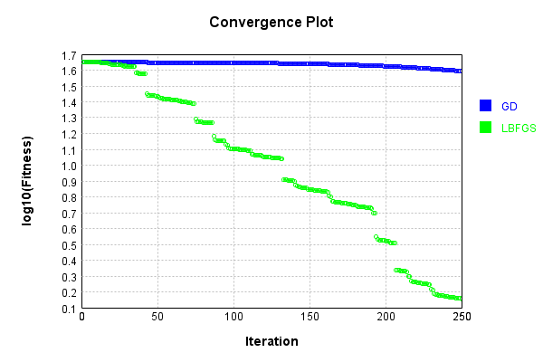
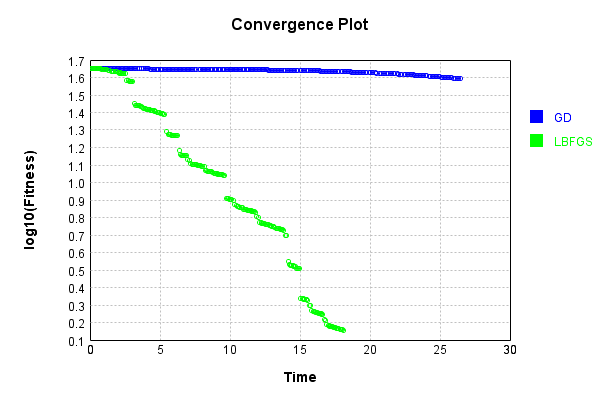

# ConvolutionLayer
## ConvolutionLayerTest
### Json Serialization
Code from [JsonTest.java:36](../../../../../../../src/main/java/com/simiacryptus/mindseye/test/unit/JsonTest.java#L36) executed in 0.04 seconds: 
```java
    JsonObject json = layer.getJson();
    NNLayer echo = NNLayer.fromJson(json);
    if ((echo == null)) throw new AssertionError("Failed to deserialize");
    if ((layer == echo)) throw new AssertionError("Serialization did not copy");
    if ((!layer.equals(echo))) throw new AssertionError("Serialization not equal");
    return new GsonBuilder().setPrettyPrinting().create().toJson(json);
```

Returns: 

```
    {
      "class": "com.simiacryptus.mindseye.layers.aparapi.ConvolutionLayer",
      "id": "fba792d9-fb2b-49c6-a981-f442197c4e29",
      "isFrozen": false,
      "name": "ConvolutionLayer/fba792d9-fb2b-49c6-a981-f442197c4e29",
      "filter": [
        [
          [
            -0.948,
            -1.336,
            -0.632
          ],
          [
            0.692,
            0.656,
            -0.324
          ],
          [
            1.196,
            -1.492,
            1.124
          ]
        ],
        [
          [
            1.284,
            0.008,
            -1.488
          ],
          [
            -0.644,
            0.204,
            -1.084
          ],
          [
            -0.7,
            0.588,
            -0.868
          ]
        ],
        [
          [
            -0.176,
            0.644,
            -1.084
          ],
          [
            1.524,
            1.792,
            -0.236
          ],
          [
            0.152,
            1.756,
            -0.26
          ]
        ],
        [
          [
            1.708,
            0.316,
            0.328
          ],
          [
            -1.592,
            0.468,
            0.648
          ],
          [
            -1.024,
            -0.832,
            -0.108
          ]
        ]
      ],
      "skip": [
        [
          0.0
        ]
      ],
      "simple": true
    }
```


### Example Input/Output Pair
Code from [ReferenceIO.java:68](../../../../../../../src/main/java/com/simiacryptus/mindseye/test/unit/ReferenceIO.java#L68) executed in 2.71 seconds: 
```java
    SimpleEval eval = SimpleEval.run(layer, inputPrototype);
    return String.format("--------------------\nInput: \n[%s]\n--------------------\nOutput: \n%s\n--------------------\nDerivative: \n%s",
      Arrays.stream(inputPrototype).map(t -> t.prettyPrint()).reduce((a, b) -> a + ",\n" + b).get(),
      eval.getOutput().prettyPrint(),
      Arrays.stream(eval.getDerivative()).map(t -> t.prettyPrint()).reduce((a, b) -> a + ",\n" + b).get());
```
Logging: 
```
    Found 2 devices
    Device 0 - GeForce GTX 1080 Ti
    Device 1 - GeForce GTX 1060 6GB
    Found 2 devices; using devices [0, 1]
    
```

Returns: 

```
    --------------------
    Input: 
    [[
    	[ [ -0.432, -0.32 ], [ 0.928, -1.604 ], [ -1.692, -0.608 ] ],
    	[ [ 1.72, 1.24 ], [ 1.556, 0.688 ], [ -0.16, 1.084 ] ],
    	[ [ -0.356, 1.92 ], [ -0.604, -1.72 ], [ -0.948, -0.06 ] ]
    ]]
    --------------------
    Output: 
    [
    	[ [ -1.6457920000000001, -0.6460800000000002 ], [ 4.017744, -3.6798880000000005 ], [ -2.89384, -2.1659199999999994 ] ],
    	[ [ 6.637424, -7.025664 ], [ 1.916688, 1.7334399999999996 ], [ 1.1446720000000001, 4.515168 ] ],
    	[ [ 0.32726399999999983, -2.87304 ], [ 1.5225279999999997, -5.035616 ], [ -1.4824799999999998, 0.3053760000000001 ] ]
    ]
    --------------------
    Derivative: 
    [
    	[ [ -1.196, 3.228 ], [ -4.644, 3.432 ], [ -3.9959999999999996, 2.8760000000000003 ] ],
    	[ [ -0.6520000000000004, 2.2880000000000007 ], [ -3.764, 4.024000000000002 ], [ -3.612, 4.340000000000001 ] ],
    	[ [ 0.49999999999999956, 2.2440000000000007 ], [ -0.49199999999999966, 4.736000000000001 ], [ -0.08399999999999982, 4.683999999999999 ] ]
    ]
```


### Batch Execution
Code from [BatchingTester.java:66](../../../../../../../src/main/java/com/simiacryptus/mindseye/test/unit/BatchingTester.java#L66) executed in 0.11 seconds: 
```java
    return test(reference, inputPrototype);
```

Returns: 

```
    ToleranceStatistics{absoluteTol=0.0000e+00 +- 0.0000e+00 [0.0000e+00 - 0.0000e+00] (360#), relativeTol=0.0000e+00 +- 0.0000e+00 [0.0000e+00 - 0.0000e+00] (360#)}
```


Code from [SingleDerivativeTester.java:77](../../../../../../../src/main/java/com/simiacryptus/mindseye/test/unit/SingleDerivativeTester.java#L77) executed in 0.59 seconds: 
```java
    return test(component, inputPrototype);
```
Logging: 
```
    Inputs: [
    	[ [ -1.86, -1.664 ], [ 1.212, 0.652 ], [ 0.316, -0.268 ] ],
    	[ [ -1.196, -1.352 ], [ 1.116, 1.136 ], [ -1.432, -1.564 ] ],
    	[ [ 0.784, 0.788 ], [ -0.516, -0.388 ], [ 0.64, 0.928 ] ]
    ]
    Inputs Statistics: {meanExponent=-0.06420999000497786, negative=9, min=0.928, max=0.928, mean=-0.14822222222222223, count=18.0, positive=9, stdDev=1.0830241382123567, zeros=0}
    Output: [
    	[ [ -9.547376, 5.353376 ], [ 3.7222399999999998, -4.054576000000001 ], [ -2.8034239999999997, 1.5768640000000003 ] ],
    	[ [ -2.1432640000000007, -4.245087999999999 ], [ 0.30931199999999925, 3.021088 ], [ -1.077664, -4.082688 ] ],
    	[ [ 1.1357440000000003, -0.46564800000000023 ], [ -0.09926400000000003, 2.145248 ], [ 3.963456000000001, 0.03171200000000008 ] ]
    ]
    Outputs Statistics: {meanExponent=0.18092232447963977, negative=9, min=0.03171200000000008, max=0.03171200000000008, mean=-0.4033306666666665, count=18.0, positive=9, stdDev=3.566967116711027, zeros=0}
    Feedback for input 0
    Inputs Values: [
    	[ [ -1.86, -1.664 ], [ 1.212, 0.652
```
...[skipping 6430 bytes](etc/1.txt)...
```
    6605029231687E-12, 3.355760114231998E-12, -1.88049575911009E-12, -2.8956836928273333E-12, -1.2154721673596214E-12, 7.052136652418994E-13, -2.015443367753278E-12, -1.2101430968414206E-12, ... ], [ 0.0, -2.4151791677695655E-12, -1.085131984268628E-12, 0.0, 1.5452084056732929E-12, -1.2154721673596214E-12, 0.0, -2.015443367753278E-12, ... ], [ 0.0, 0.0, 0.0, 3.355760114231998E-12, 3.3995029014022293E-13, 0.0, -5.6563642658602475E-12, 7.052136652418994E-13, ... ], [ 0.0, 0.0, 0.0, -2.4151791677695655E-12, 3.355760114231998E-12, 3.3995029014022293E-13, -2.8956836928273333E-12, -1.2154721673596214E-12, ... ], ... ]
    Error Statistics: {meanExponent=-11.938344887129436, negative=107, min=-1.5765166949677223E-14, max=-1.5765166949677223E-14, mean=-9.255319418959241E-14, count=648.0, positive=89, stdDev=1.5810127759872113E-12, zeros=452}
    Finite-Difference Derivative Accuracy:
    absoluteTol: 8.2939e-13 +- 1.5882e-12 [0.0000e+00 - 1.1742e-11] (972#)
    relativeTol: 3.7740e-12 +- 2.4604e-11 [5.7534e-15 - 2.9193e-10] (392#)
    
```

Returns: 

```
    ToleranceStatistics{absoluteTol=8.2939e-13 +- 1.5882e-12 [0.0000e+00 - 1.1742e-11] (972#), relativeTol=3.7740e-12 +- 2.4604e-11 [5.7534e-15 - 2.9193e-10] (392#)}
```


### Performance
Now we execute larger-scale runs to benchmark performance:

Code from [PerformanceTester.java:66](../../../../../../../src/main/java/com/simiacryptus/mindseye/test/unit/PerformanceTester.java#L66) executed in 1.86 seconds: 
```java
    test(component, inputPrototype);
```
Logging: 
```
    100 batches
    Input Dimensions:
    	[100, 100, 3]
    Performance:
    	Evaluation performance: 0.058913s +- 0.009499s [0.048198s - 0.073375s]
    	Learning performance: 0.249758s +- 0.026259s [0.227528s - 0.288203s]
    
```

### Input Learning
In this test, we use a network to learn this target input, given it's pre-evaluated output:

Code from [LearningTester.java:127](../../../../../../../src/main/java/com/simiacryptus/mindseye/test/unit/LearningTester.java#L127) executed in 0.03 seconds: 
```java
    return Arrays.stream(input_target).map(x -> x.prettyPrint()).reduce((a, b) -> a + "\n" + b).orElse("");
```

Returns: 

```
    [
    	[ [ -0.208, -1.4, 1.536 ], [ 1.932, -0.252, -1.06 ], [ 1.256, 1.476, -0.5 ], [ -1.984, 1.152, 1.02 ], [ 1.548, -0.668, -1.828 ], [ -0.412, 0.396, -1.216 ], [ 0.584, 0.656, -0.128 ], [ -1.896, 0.452, -0.612 ], ... ],
    	[ [ 0.648, 1.468, 0.18 ], [ -0.744, -0.436, -1.004 ], [ -0.26, -1.552, 1.8 ], [ -0.34, 0.828, 1.844 ], [ 1.404, 0.28, -0.352 ], [ 1.008, 1.76, 0.58 ], [ -0.304, -0.304, -1.664 ], [ 0.72, -1.068, 1.348 ], ... ],
    	[ [ -0.908, 1.588, 1.668 ], [ -0.716, 1.516, 0.132 ], [ -1.444, -0.476, 1.612 ], [ -0.888, -0.312, 0.14 ], [ 1.528, 1.692, 0.912 ], [ 0.972, 1.068, 1.16 ], [ -1.504, -1.664, -1.768 ], [ -1.448, -0.568, 1.912 ], ... ],
    	[ [ -1.1, -0.04, -0.42 ], [ -1.744, 0.756, 0.8 ], [ 0.86, 1.208, -0.544 ], [ -0.564, 0.688, -0.736 ], [ 1.228, 0.592, -0.636 ], [ -0.1, 1.848, -0.576 ], [ -1.744, 1.712, 0.072 ], [ 0.132, -1.62, -1.688 ], ... ],
    	[ [ 1.144, 1.964, -1.052 ], [ 0.024, -0.112, 1.644 ], [ 0.728, -1.656, 1.868 ], [ 0.092, -0.964, 1.768 ], [ 0.468, -0.664, 0.992 ], [ -0.5, 1.836, 0.408 ], [ 0.248, 0.632, -0.1 ], [ -0.86, 0.432, -0.084 ], ... ],
    	[ [ -0.54, -0.084, -1.724 ], [ 1.348, -1.536, 1.732 ], [ 1.096, 1.008, 1.4 ], [ -0.992, -1.288, -1.196 ], [ -1.344, -1.464, -0.196 ], [ -0.528, 1.872, -1.152 ], [ 1.944, 0.872, -0.808 ], [ -1.92, -0.376, -0.54 ], ... ],
    	[ [ 0.028, 0.516, 1.364 ], [ -1.32, -1.488, 0.232 ], [ 1.192, -0.112, 0.724 ], [ -1.24, -0.656, 1.956 ], [ -0.772, -0.444, 1.812 ], [ -1.88, -1.672, -0.832 ], [ 0.676, 0.344, -0.228 ], [ -1.596, 0.88, 0.788 ], ... ],
    	[ [ -0.932, -1.2, -0.664 ], [ 1.452, -0.376, 0.516 ], [ 1.772, -1.308, 0.776 ], [ 1.512, -1.048, -1.848 ], [ 1.896, 0.268, 1.692 ], [ 0.96, 0.76, 1.036 ], [ 0.384, 0.164, -1.748 ], [ 0.584, -0.108, 1.884 ], ... ],
    	...
    ]
```


First, we use a conjugate gradient descent method, which converges the fastest for purely linear functions.

Code from [LearningTester.java:300](../../../../../../../src/main/java/com/simiacryptus/mindseye/test/unit/LearningTester.java#L300) executed in 20.31 seconds: 
```java
    return new IterativeTrainer(trainable)
      .setLineSearchFactory(label -> new QuadraticSearch())
      .setOrientation(new GradientDescent())
      .setMonitor(monitor)
      .setTimeout(30, TimeUnit.SECONDS)
      .setMaxIterations(250)
      .setTerminateThreshold(0)
      .run();
```
Logging: 
```
    Constructing line search parameters: GD
    F(0.0) = LineSearchPoint{point=PointSample{avg=83.77228499273873}, derivative=-1.2673982481651636}
    New Minimum: 83.77228499273873 > 83.77228499261244
    F(1.0E-10) = LineSearchPoint{point=PointSample{avg=83.77228499261244}, derivative=-1.2673982481640682}, delta = -1.262918658540002E-10
    New Minimum: 83.77228499261244 > 83.77228499185203
    F(7.000000000000001E-10) = LineSearchPoint{point=PointSample{avg=83.77228499185203}, derivative=-1.2673982481574961}, delta = -8.867004908097442E-10
    New Minimum: 83.77228499185203 > 83.77228498652909
    F(4.900000000000001E-9) = LineSearchPoint{point=PointSample{avg=83.77228498652909}, derivative=-1.2673982481114916}, delta = -6.2096461306282436E-9
    New Minimum: 83.77228498652909 > 83.7722849492673
    F(3.430000000000001E-8) = LineSearchPoint{point=PointSample{avg=83.7722849492673}, derivative=-1.267398247789461}, delta = -4.3471430899444385E-8
    New Minimum: 83.7722849492673 > 83.77228468843686
    F(2.4010000000000004E-7) = LineSearchPoint{
```
...[skipping 323193 bytes](etc/2.txt)...
```
    193879E-34}, delta = -4.468465852348394E-30
    1.8261509312683788E-29 > 1.8220255399534473E-29
    Iteration 249 complete. Error: 1.8220255399534473E-29 Total: 249130910070734.1200; Orientation: 0.0009; Line Search: 0.0348
    Zero gradient: 2.503202128118024E-16
    F(0.0) = LineSearchPoint{point=PointSample{avg=1.8261509312683788E-29}, derivative=-6.266020894214606E-32}
    New Minimum: 1.8261509312683788E-29 > 1.473311872343013E-29
    F(132.37493599229356) = LineSearchPoint{point=PointSample{avg=1.473311872343013E-29}, derivative=4.0997336003092586E-33}, delta = -3.528390589253657E-30
    1.473311872343013E-29 <= 1.8261509312683788E-29
    New Minimum: 1.473311872343013E-29 > 1.468681214532977E-29
    F(124.24578021027251) = LineSearchPoint{point=PointSample{avg=1.468681214532977E-29}, derivative=5.571787352683467E-34}, delta = -3.5746971673540175E-30
    Right bracket at 124.24578021027251
    Converged to right
    Iteration 250 complete. Error: 1.468681214532977E-29 Total: 249130953719734.1000; Orientation: 0.0009; Line Search: 0.0353
    
```

Returns: 

```
    1.468681214532977E-29
```


Training Converged

Next, we run the same optimization using L-BFGS, which is nearly ideal for purely second-order or quadratic functions.

Code from [LearningTester.java:324](../../../../../../../src/main/java/com/simiacryptus/mindseye/test/unit/LearningTester.java#L324) executed in 9.10 seconds: 
```java
    return new IterativeTrainer(trainable)
      .setLineSearchFactory(label -> new ArmijoWolfeSearch())
      .setOrientation(new LBFGS())
      .setMonitor(monitor)
      .setTimeout(30, TimeUnit.SECONDS)
      .setMaxIterations(250)
      .setTerminateThreshold(0)
      .run();
```
Logging: 
```
    LBFGS Accumulation History: 1 points
    Constructing line search parameters: GD
    th(0)=83.77228499273873;dx=-1.2673982481651636
    New Minimum: 83.77228499273873 > 81.0671788932868
    WOLFE (weak): th(2.154434690031884)=81.0671788932868; dx=-1.2437998048257726 delta=2.705106099451939
    New Minimum: 81.0671788932868 > 78.41291409879597
    WOLFE (weak): th(4.308869380063768)=78.41291409879597; dx=-1.2202013614863816 delta=5.359370893942767
    New Minimum: 78.41291409879597 > 68.30426797044359
    END: th(12.926608140191302)=68.30426797044359; dx=-1.125807588128818 delta=15.468017022295143
    Iteration 1 complete. Error: 68.30426797044359 Total: 249131042629002.0300; Orientation: 0.0072; Line Search: 0.0448
    LBFGS Accumulation History: 1 points
    th(0)=68.30426797044359;dx=-1.001605558917553
    New Minimum: 68.30426797044359 > 43.68318229365611
    END: th(27.849533001676672)=43.68318229365611; dx=-0.766545144026371 delta=24.62108567678748
    Iteration 2 complete. Error: 43.68318229365611 Total: 249131074300074.9700; Orientation: 0.001
```
...[skipping 107013 bytes](etc/3.txt)...
```
    -1.559421192912551E-33 delta=0.0
    Armijo: th(2.420846552553547E-7)=1.7249141656798643E-31; dx=-1.559421192912551E-33 delta=0.0
    WOLFE (weak): th(1.5332028166172465E-7)=1.7249141656798643E-31; dx=-1.559421192912551E-33 delta=0.0
    Armijo: th(1.9770246845853968E-7)=1.7249141656798643E-31; dx=-1.559421192912551E-33 delta=0.0
    Armijo: th(1.7551137506013217E-7)=1.7249141656798643E-31; dx=-1.559421192912551E-33 delta=0.0
    WOLFE (weak): th(1.644158283609284E-7)=1.7249141656798643E-31; dx=-1.559421192912551E-33 delta=0.0
    WOLFE (weak): th(1.6996360171053029E-7)=1.7249141656798643E-31; dx=-1.559421192912551E-33 delta=0.0
    WOLFE (weak): th(1.727374883853312E-7)=1.7249141656798643E-31; dx=-1.559421192912551E-33 delta=0.0
    WOLFE (weak): th(1.741244317227317E-7)=1.7249141656798643E-31; dx=-1.559421192912551E-33 delta=0.0
    mu /= nu: th(0)=1.7249141656798643E-31;th'(0)=-1.559421192912551E-33;
    Iteration 214 failed, aborting. Error: 1.7249141656798643E-31 Total: 249140065947350.2000; Orientation: 0.0014; Line Search: 0.2443
    
```

Returns: 

```
    1.7249141656798643E-31
```


Training Converged

Code from [LearningTester.java:96](../../../../../../../src/main/java/com/simiacryptus/mindseye/test/unit/LearningTester.java#L96) executed in 0.13 seconds: 
```java
    return TestUtil.compare(runs);
```

Returns: 


Code from [LearningTester.java:99](../../../../../../../src/main/java/com/simiacryptus/mindseye/test/unit/LearningTester.java#L99) executed in 0.01 seconds: 
```java
    return TestUtil.compareTime(runs);
```

Returns: 


### Model Learning
In this test, attempt to train a network to emulate a randomized network given an example input/output. The target state is:

Code from [LearningTester.java:176](../../../../../../../src/main/java/com/simiacryptus/mindseye/test/unit/LearningTester.java#L176) executed in 0.00 seconds: 
```java
    return network_target.state().stream().map(Arrays::toString).reduce((a, b) -> a + "\n" + b).orElse("");
```

Returns: 

```
    [0.992, -0.704, -1.312, 1.112, -1.612, -0.236, -1.648, 0.896, 0.464, 0.132, 1.176, 1.76, 1.036, 1.46, -1.44, 0.168, -1.564, -1.996, 1.204, 1.4, 0.04, -0.564, 0.404, -0.356, 0.824, -0.896, -0.136, 1.7, -0.208, -1.476, -0.196, -0.904, 1.876, -0.136, 1.496, 1.068]
```


First, we use a conjugate gradient descent method, which converges the fastest for purely linear functions.

Code from [LearningTester.java:300](../../../../../../../src/main/java/com/simiacryptus/mindseye/test/unit/LearningTester.java#L300) executed in 1.41 seconds: 
```java
    return new IterativeTrainer(trainable)
      .setLineSearchFactory(label -> new QuadraticSearch())
      .setOrientation(new GradientDescent())
      .setMonitor(monitor)
      .setTimeout(30, TimeUnit.SECONDS)
      .setMaxIterations(250)
      .setTerminateThreshold(0)
      .run();
```
Logging: 
```
    Constructing line search parameters: GD
    F(0.0) = LineSearchPoint{point=PointSample{avg=59.923232465943244}, derivative=-310.77798578694467}
    New Minimum: 59.923232465943244 > 59.92323243486553
    F(1.0E-10) = LineSearchPoint{point=PointSample{avg=59.92323243486553}, derivative=-310.7779857060205}, delta = -3.1077711071247904E-8
    New Minimum: 59.92323243486553 > 59.92323224839914
    F(7.000000000000001E-10) = LineSearchPoint{point=PointSample{avg=59.92323224839914}, derivative=-310.7779852204755}, delta = -2.1754410539642777E-7
    New Minimum: 59.92323224839914 > 59.92323094313142
    F(4.900000000000001E-9) = LineSearchPoint{point=PointSample{avg=59.92323094313142}, derivative=-310.77798182166043}, delta = -1.5228118215304676E-6
    New Minimum: 59.92323094313142 > 59.92322180625878
    F(3.430000000000001E-8) = LineSearchPoint{point=PointSample{avg=59.92322180625878}, derivative=-310.7779580299548}, delta = -1.0659684463121266E-5
    New Minimum: 59.92322180625878 > 59.92315784817225
    F(2.4010000000000004E-7) = LineSearchPoi
```
...[skipping 20894 bytes](etc/4.txt)...
```
    2433288934043E-32}, derivative=-1.345072768966375E-32}, delta = 0.0
    F(0.8486665631992876) = LineSearchPoint{point=PointSample{avg=9.27698706813525E-32}, derivative=1.5309666918192825E-32}, delta = 1.945537792012066E-33
    Loops = 12
    F(0.3969063358330314) = LineSearchPoint{point=PointSample{avg=3.262756437385304E-33}, derivative=-1.34300409945038E-34}, delta = -8.756157645195513E-32
    Left bracket at 0.3969063358330314
    Converged to left
    Iteration 17 complete. Error: 3.262756437385304E-33 Total: 249142083778446.0600; Orientation: 0.0001; Line Search: 0.1524
    Zero gradient: 1.4617464095637527E-17
    F(0.0) = LineSearchPoint{point=PointSample{avg=3.262756437385304E-33}, derivative=-2.136702565872522E-34}
    New Minimum: 3.262756437385304E-33 > 0.0
    F(0.3969063358330314) = LineSearchPoint{point=PointSample{avg=0.0}, derivative=0.0}, delta = -3.262756437385304E-33
    0.0 <= 3.262756437385304E-33
    Converged to right
    Iteration 18 complete. Error: 0.0 Total: 249142111607154.9000; Orientation: 0.0001; Line Search: 0.0187
    
```

Returns: 

```
    0.0
```


Training Converged

Next, we run the same optimization using L-BFGS, which is nearly ideal for purely second-order or quadratic functions.

Code from [LearningTester.java:324](../../../../../../../src/main/java/com/simiacryptus/mindseye/test/unit/LearningTester.java#L324) executed in 1.12 seconds: 
```java
    return new IterativeTrainer(trainable)
      .setLineSearchFactory(label -> new ArmijoWolfeSearch())
      .setOrientation(new LBFGS())
      .setMonitor(monitor)
      .setTimeout(30, TimeUnit.SECONDS)
      .setMaxIterations(250)
      .setTerminateThreshold(0)
      .run();
```
Logging: 
```
    LBFGS Accumulation History: 1 points
    Constructing line search parameters: GD
    th(0)=88.61083617923764;dx=-470.6062909555192
    Armijo: th(2.154434690031884)=1983.0376117349963; dx=2229.2363244588582 delta=-1894.4267755557587
    Armijo: th(1.077217345015942)=308.7449004227276; dx=879.3150167516695 delta=-220.13406424348995
    New Minimum: 88.61083617923764 > 0.41567458609076186
    END: th(0.3590724483386473)=0.41567458609076186; dx=-20.632521719789697 delta=88.19516159314688
    Iteration 1 complete. Error: 0.41567458609076186 Total: 249142173677728.8800; Orientation: 0.0001; Line Search: 0.0371
    LBFGS Accumulation History: 1 points
    th(0)=0.41567458609076186;dx=-2.0968003396441874
    New Minimum: 0.41567458609076186 > 0.37872901567474876
    WOLF (strong): th(0.7735981389354633)=0.37872901567474876; dx=2.001284157387459 delta=0.036945570416013096
    New Minimum: 0.37872901567474876 > 9.179833697609643E-4
    END: th(0.3867990694677316)=9.179833697609643E-4; dx=-0.047758091128363676 delta=0.4147566027210009
    Iteration 2 complete.
```
...[skipping 13182 bytes](etc/5.txt)...
```
    40296274E-9)=9.115349389587012E-33; dx=-6.780205710017852E-34 delta=0.0
    Armijo: th(8.01915869611851E-9)=9.115349389587012E-33; dx=-6.780205710017852E-34 delta=0.0
    WOLFE (weak): th(5.011974185074068E-9)=9.115349389587012E-33; dx=-6.780205710017852E-34 delta=0.0
    Armijo: th(6.515566440596288E-9)=9.115349389587012E-33; dx=-6.780205710017852E-34 delta=0.0
    Armijo: th(5.763770312835179E-9)=9.115349389587012E-33; dx=-6.780205710017852E-34 delta=0.0
    Armijo: th(5.387872248954624E-9)=9.115349389587012E-33; dx=-6.780205710017852E-34 delta=0.0
    Armijo: th(5.1999232170143464E-9)=9.115349389587012E-33; dx=-6.780205710017852E-34 delta=0.0
    Armijo: th(5.105948701044208E-9)=9.115349389587012E-33; dx=-6.780205710017852E-34 delta=0.0
    Armijo: th(5.058961443059138E-9)=9.115349389587012E-33; dx=-6.780205710017852E-34 delta=0.0
    mu /= nu: th(0)=9.115349389587012E-33;th'(0)=-6.780205710017852E-34;
    Iteration 23 failed, aborting. Error: 9.115349389587012E-33 Total: 249143237563042.8800; Orientation: 0.0001; Line Search: 0.0911
    
```

Returns: 

```
    9.115349389587012E-33
```


Training Converged

Code from [LearningTester.java:96](../../../../../../../src/main/java/com/simiacryptus/mindseye/test/unit/LearningTester.java#L96) executed in 0.01 seconds: 
```java
    return TestUtil.compare(runs);
```

Returns: 


Code from [LearningTester.java:99](../../../../../../../src/main/java/com/simiacryptus/mindseye/test/unit/LearningTester.java#L99) executed in 0.01 seconds: 
```java
    return TestUtil.compareTime(runs);
```

Returns: 


### Composite Learning
In this test, attempt to train a network to emulate a randomized network given an example input/output. The target state is:

Code from [LearningTester.java:219](../../../../../../../src/main/java/com/simiacryptus/mindseye/test/unit/LearningTester.java#L219) executed in 0.00 seconds: 
```java
    return network_target.state().stream().map(Arrays::toString).reduce((a, b) -> a + "\n" + b).orElse("");
```

Returns: 

```
    [1.46, -0.236, 0.168, 1.036, -0.196, -1.612, -0.704, -1.476, 1.4, 1.176, 0.992, 1.76, -0.896, -1.312, -0.564, 0.824, 1.876, 1.7, -0.356, 1.112, -1.564, -1.648, 0.404, 1.068, 0.464, 0.896, 0.132, -0.904, 0.04, -0.136, 1.496, -1.44, -0.136, -0.208, 1.204, -1.996]
```


We simultaneously regress this target input:

Code from [LearningTester.java:223](../../../../../../../src/main/java/com/simiacryptus/mindseye/test/unit/LearningTester.java#L223) executed in 0.01 seconds: 
```java
    return Arrays.stream(testInput).map(x -> x.prettyPrint()).reduce((a, b) -> a + "\n" + b).orElse("");
```

Returns: 

```
    [
    	[ [ 1.1, -0.34, 0.164 ], [ 0.412, 0.236, 1.688 ], [ 0.676, 0.356, 0.436 ], [ -1.168, -0.8, -1.292 ], [ -1.848, -1.552, -1.564 ], [ 0.78, -0.48, -1.212 ], [ 0.016, 0.908, 0.732 ], [ 1.96, -1.288, 1.872 ], ... ],
    	[ [ -0.124, 1.916, -0.752 ], [ -1.92, 0.872, -0.632 ], [ 1.732, 1.784, -1.928 ], [ -0.104, -0.812, 0.952 ], [ 1.016, -0.4, -0.136 ], [ 0.556, -1.14, -0.048 ], [ 1.604, -1.284, -0.448 ], [ -0.816, 1.176, 0.492 ], ... ],
    	[ [ -0.88, 1.488, -1.296 ], [ 0.012, 1.228, -1.736 ], [ 0.608, -1.54, -1.868 ], [ -1.236, 1.112, 1.444 ], [ -0.492, -1.5, 0.98 ], [ -0.508, 1.388, -0.604 ], [ -0.24, 0.06, -1.512 ], [ -0.936, -0.248, 1.476 ], ... ],
    	[ [ -1.916, -1.264, 1.968 ], [ -0.88, 0.728, -0.424 ], [ 1.544, -0.688, -0.904 ], [ 0.632, -1.256, -1.572 ], [ 1.952, -0.68, -0.424 ], [ -1.476, 0.336, 0.008 ], [ 0.12, 0.836, 0.388 ], [ 1.74, -1.98, 0.272 ], ... ],
    	[ [ 0.696, 0.308, 0.58 ], [ -1.704, -1.696, -0.3 ], [ 1.176, -0.06, 1.364 ], [ -0.768, 0.632, 1.192 ], [ -1.492, 0.812, 1.356 ], [ -1.572, -0.068, -1.356 ], [ -1.232, -1.844, -1.424 ], [ -0.924, 1.948, 1.84 ], ... ],
    	[ [ 1.192, 0.464, 0.856 ], [ -0.14, -1.968, 0.408 ], [ 1.136, 0.868, -0.288 ], [ -1.16, -0.472, 0.524 ], [ -1.164, 1.324, 1.04 ], [ 0.504, 1.528, -1.62 ], [ -1.396, -1.776, -1.1 ], [ -0.024, 1.172, 0.892 ], ... ],
    	[ [ 0.92, 0.608, 1.872 ], [ -1.98, -0.708, 0.624 ], [ -0.304, -1.524, -0.488 ], [ -1.712, -1.692, -0.1 ], [ 0.632, 0.276, -0.368 ], [ 0.992, -0.748, 0.068 ], [ 0.504, 0.828, 1.268 ], [ 1.26, -1.124, 1.684 ], ... ],
    	[ [ 1.216, 1.744, 1.964 ], [ -1.532, 1.788, 1.38 ], [ 0.844, 1.524, -0.776 ], [ -1.424, 1.316, 0.664 ], [ -0.824, 0.08, 0.568 ], [ -0.176, -1.18, -1.46 ], [ -0.368, 0.4, 0.948 ], [ 0.328, 0.912, 1.268 ], ... ],
    	...
    ]
```


Which produces the following output:

Code from [LearningTester.java:230](../../../../../../../src/main/java/com/simiacryptus/mindseye/test/unit/LearningTester.java#L230) executed in 0.01 seconds: 
```java
    return Stream.of(targetOutput).map(x -> x.prettyPrint()).reduce((a, b) -> a + "\n" + b).orElse("");
```

Returns: 

```
    [
    	[ [ 0.15203200000000006 ], [ 3.7568479999999993 ], [ 2.67352 ], [ -2.5569440000000005 ], [ -0.2067039999999996 ], [ 1.6728640000000008 ], [ -1.4810879999999993 ], [ -2.3674719999999985 ], ... ],
    	[ [ -3.769136 ], [ 6.104031999999999 ], [ 5.789823999999999 ], [ -8.338688000000001 ], [ 1.419776 ], [ -11.363216 ], [ -3.1855200000000004 ], [ -11.996672000000002 ], ... ],
    	[ [ -6.875136 ], [ 10.346975999999998 ], [ -0.47030400000000017 ], [ 4.647855999999999 ], [ 3.0524159999999996 ], [ -8.564671999999998 ], [ 1.614096000000001 ], [ -0.6185600000000001 ], ... ],
    	[ [ 2.4746560000000004 ], [ -0.4697439999999994 ], [ -3.4791680000000005 ], [ -13.735647999999994 ], [ -2.1160159999999997 ], [ -5.185647999999999 ], [ 0.6157119999999996 ], [ -2.1239679999999996 ], ... ],
    	[ [ 2.5242720000000003 ], [ 3.8020320000000014 ], [ -4.060111999999998 ], [ -1.8533439999999997 ], [ -2.7109440000000005 ], [ 6.752543999999999 ], [ 5.033296 ], [ -5.462096 ], ... ],
    	[ [ -12.062607999999996 ], [ 2.0555840000000005 ], [ -12.302736 ], [ 6.450559999999999 ], [ 6.41472 ], [ 1.5454719999999988 ], [ 0.7215839999999993 ], [ -6.724703999999998 ], ... ],
    	[ [ -9.322032 ], [ 6.886848 ], [ -2.1195039999999996 ], [ 0.8564799999999998 ], [ 2.3273920000000006 ], [ 1.682495999999999 ], [ 0.0832320000000007 ], [ 1.976432 ], ... ],
    	[ [ -2.113664 ], [ 6.514863999999999 ], [ 2.604272 ], [ -1.466352 ], [ -6.467856 ], [ 2.446463999999998 ], [ -8.43632 ], [ 1.5081280000000001 ], ... ],
    	...
    ]
```


First, we use a conjugate gradient descent method, which converges the fastest for purely linear functions.

Code from [LearningTester.java:300](../../../../../../../src/main/java/com/simiacryptus/mindseye/test/unit/LearningTester.java#L300) executed in 26.77 seconds: 
```java
    return new IterativeTrainer(trainable)
      .setLineSearchFactory(label -> new QuadraticSearch())
      .setOrientation(new GradientDescent())
      .setMonitor(monitor)
      .setTimeout(30, TimeUnit.SECONDS)
      .setMaxIterations(250)
      .setTerminateThreshold(0)
      .run();
```
Logging: 
```
    Constructing line search parameters: GD
    F(0.0) = LineSearchPoint{point=PointSample{avg=91.86345958005933}, derivative=-250.07618231378027}
    New Minimum: 91.86345958005933 > 91.86345955505169
    F(1.0E-10) = LineSearchPoint{point=PointSample{avg=91.86345955505169}, derivative=-250.07618224689654}, delta = -2.5007636850205017E-8
    New Minimum: 91.86345955505169 > 91.86345940500587
    F(7.000000000000001E-10) = LineSearchPoint{point=PointSample{avg=91.86345940500587}, derivative=-250.07618184559448}, delta = -1.7505345795143512E-7
    New Minimum: 91.86345940500587 > 91.86345835468632
    F(4.900000000000001E-9) = LineSearchPoint{point=PointSample{avg=91.86345835468632}, derivative=-250.0761790364798}, delta = -1.2253730119482498E-6
    New Minimum: 91.86345835468632 > 91.86345100244677
    F(3.430000000000001E-8) = LineSearchPoint{point=PointSample{avg=91.86345100244677}, derivative=-250.0761593726772}, delta = -8.577612561566639E-6
    New Minimum: 91.86345100244677 > 91.86339953678775
    F(2.4010000000000004E-7) = LineSearchPoint
```
...[skipping 255053 bytes](etc/6.txt)...
```
    eSearchPoint{point=PointSample{avg=39.20713288846243}, derivative=-0.11026698371766447}, delta = -0.038641171806098384
    F(2.035794691334605) = LineSearchPoint{point=PointSample{avg=39.2513954129899}, derivative=0.16103213773574715}, delta = 0.005621352721369988
    F(0.15659959164112347) = LineSearchPoint{point=PointSample{avg=39.223333910608936}, derivative=-0.13112799974408326}, delta = -0.02244014965959451
    New Minimum: 39.18447452538469 > 39.16873656201959
    F(1.0961971414878642) = LineSearchPoint{point=PointSample{avg=39.16873656201959}, derivative=0.014923051993082678}, delta = -0.07703749824894146
    39.16873656201959 <= 39.24577406026853
    New Minimum: 39.16873656201959 > 39.168020346366625
    F(1.0001888831978996) = LineSearchPoint{point=PointSample{avg=39.168020346366625}, derivative=-3.075344559039239E-6}, delta = -0.077753713901906
    Left bracket at 1.0001888831978996
    Converged to left
    Iteration 250 complete. Error: 39.168020346366625 Total: 249170176500981.9700; Orientation: 0.0009; Line Search: 0.1328
    
```

Returns: 

```
    39.168020346366625
```


This training run resulted in the following configuration:

Code from [LearningTester.java:245](../../../../../../../src/main/java/com/simiacryptus/mindseye/test/unit/LearningTester.java#L245) executed in 0.00 seconds: 
```java
    return network_gd.state().stream().map(Arrays::toString).reduce((a, b) -> a + "\n" + b).orElse("");
```

Returns: 

```
    [0.15203200000000006, -3.769136, -6.875136, 2.4746560000000004, 2.5242720000000003, -12.062607999999996, -9.322032, -2.113664, -0.6735039999999997, -2.545296, 8.389424, -4.772368000000001, 4.1872, 4.757008, 8.880080000000001, 6.34904, 4.2887520000000015, 0.19513599999999953, -13.130912, -3.6177919999999992, -3.3796480000000013, -4.25024, -5.232512000000001, 1.608352, -1.4715840000000002, 3.2474559999999992, 0.3322719999999998, 1.498688, 4.895968, 3.5294559999999997, -1.0042240000000007, 6.549023999999999, 7.791264000000002, -2.7612639999999997, -3.9247199999999998, -1.1642720000000006, 1.1331520000000006, -5.25832, -11.917008, -1.935776, -3.4756639999999996, -4.588368000000002, 0.9777759999999994, 4.1088640000000005, -3.7569439999999994, -6.223824, -1.5727680000000002, 3.083472, 7.812784000000001, 2.3599840000000003, -5.408080000000001, -3.364703999999999, 5.039808, 7.643264, -6.531519999999999, -1.677568, 5.408192, 4.096528, -1.5719199999999995, -1.0437279999999998, 4.884016, -4.344544, 3.8443680000000007, -
```
...[skipping 174706 bytes](etc/7.txt)...
```
     3.4985599999999986, 2.0827679999999997, -0.679312, 0.2699199999999992, -4.010927999999999, -6.789263999999999, 4.092079999999999, -8.114047999999999, 0.9412800000000001, -1.0367039999999992, -1.5792799999999996, -7.5439359999999995, 1.0101119999999995, -2.429855999999999, -0.8375839999999994, 9.235488, 1.440495999999999, 1.0631359999999994, 3.881888, 1.9864160000000002, 2.025152]
    [-0.07397213152493827, 0.025303881793483522, -0.06004214508198874, 0.009429276931244637, 0.13640482341796006, -0.1275243200309464, -0.43309989670415483, -0.18732989951490656, -0.01533068184695427, 0.0011483616685561485, -0.08300242330150638, 0.1887299744797367, 0.0072693727257030286, 0.12182701299346646, -0.17111220680715922, -0.27983458884005236, 0.12332418221021695, 0.4376274736782883, 0.42880185458046133, 0.6345642226204001, 0.6399305424600872, -0.1008563268511495, -0.6582768412112221, -0.877920948028591, 0.15809399054152565, 0.4842231909672947, 1.0491589353121071, 1.176, -0.136, 0.04, 1.204, -1.44, -0.208, -0.564, -1.476, 1.068]
```


And regressed input:

Code from [LearningTester.java:249](../../../../../../../src/main/java/com/simiacryptus/mindseye/test/unit/LearningTester.java#L249) executed in 0.01 seconds: 
```java
    return Arrays.stream(input_gd).map(x -> x.prettyPrint()).reduce((a, b) -> a + "\n" + b).orElse("");
```

Returns: 

```
    [
    	[ [ 1.568639161108342, 1.6769752410132968, -0.2524580865761597 ], [ 1.4129319227286379, -0.28142242575892296, -1.369458530524469 ], [ -1.9707940689922863, -0.5923849798095281, -2.040391284007452 ], [ -1.2080974367454849, -0.9612605546824057, 1.463904485150546 ], [ -0.9331131410144505, -1.7057527487638204, -0.4693421957135304 ], [ -0.05910242836447953, 1.525424843099566, -0.3999432339548375 ], [ -1.2672597293026047, 0.22237207313001278, 0.8133997244710743 ], [ 0.0599744204608912, -0.8052973317578441, 0.4168374700883448 ], ... ],
    	[ [ 1.0928877638831442, 1.5350846711478554, 0.3242388494024342 ], [ 0.5820684491591511, 1.6217425910101548, -1.421220402645505 ], [ 1.4803281699373172, 1.9484315827124612, 0.58466626263076 ], [ -0.5443857459861939, -0.3264799880861032, -0.7283281498045416 ], [ -0.8525399065956684, -1.8116304507448584, 1.2332939499593256 ], [ -1.3924407552654197, 1.4656865900532392, 0.5307434113864278 ], [ -0.9179388788307056, -0.3868821848171851, -1.5677740212968716 ], [ 0.2845269460935732, 0.75282
```
...[skipping 2205 bytes](etc/8.txt)...
```
    1.0068348723369351 ], [ 0.9869994226509016, 1.2440133732073346, -0.4746542698327519 ], [ -0.5566300350463457, -1.7219395267340873, -1.478673285078464 ], [ 1.8842742530147674, -0.8411189260155005, -1.4871209424259069 ], [ 0.6459028003693521, -0.7660904767747235, -1.3023196567491853 ], [ -1.7436835710634573, 1.3286227643703523, 1.34888116269647 ], [ 1.21279059350852, 0.36317379944112105, 0.783653301140835 ], [ -0.2717293768113307, -0.07367452068153466, -0.44154271898499015 ], ... ],
    	[ [ 0.9350337089768616, 1.3685251616886485, 1.2015700339110702 ], [ 1.5438568292797419, 0.6314494808774943, -1.8195688392867582 ], [ -0.8869932007088291, 1.9490913610996519, 0.5443788798443104 ], [ 0.7815141714446259, -0.3761328024593316, 0.632267498790477 ], [ -0.8204047655011126, -0.1825093280231465, 0.8454371472663612 ], [ -1.3448451932328322, -2.010524657987932, -1.9661248962406446 ], [ 1.767650369909061, 1.9086943620204877, 1.0380001466920494 ], [ -0.28254027244357166, -0.8196357607412059, -0.26967769562330685 ], ... ],
    	...
    ]
```


Which produces the following output:

Code from [LearningTester.java:256](../../../../../../../src/main/java/com/simiacryptus/mindseye/test/unit/LearningTester.java#L256) executed in 0.00 seconds: 
```java
    return Stream.of(regressedOutput).map(x -> x.prettyPrint()).reduce((a, b) -> a + "\n" + b).orElse("");
```

Returns: 

```
    [ 39.168020346366625 ]
```


Next, we run the same optimization using L-BFGS, which is nearly ideal for purely second-order or quadratic functions.

Code from [LearningTester.java:324](../../../../../../../src/main/java/com/simiacryptus/mindseye/test/unit/LearningTester.java#L324) executed in 18.30 seconds: 
```java
    return new IterativeTrainer(trainable)
      .setLineSearchFactory(label -> new ArmijoWolfeSearch())
      .setOrientation(new LBFGS())
      .setMonitor(monitor)
      .setTimeout(30, TimeUnit.SECONDS)
      .setMaxIterations(250)
      .setTerminateThreshold(0)
      .run();
```
Logging: 
```
    LBFGS Accumulation History: 1 points
    Constructing line search parameters: GD
    th(0)=91.86345958005933;dx=-250.07618231378027
    Armijo: th(2.154434690031884)=1042.3989633616277; dx=1103.8394323636803 delta=-950.5355037815684
    Armijo: th(1.077217345015942)=202.5927790983929; dx=448.3584345332783 delta=-110.72931951833357
    New Minimum: 91.86345958005933 > 44.88950470929108
    END: th(0.3590724483386473)=44.88950470929108; dx=-12.386240889086345 delta=46.973954870768246
    Iteration 1 complete. Error: 44.88950470929108 Total: 249170362410338.7800; Orientation: 0.0044; Line Search: 0.0878
    LBFGS Accumulation History: 1 points
    th(0)=44.88950470929108;dx=-1.3741580618857887
    New Minimum: 44.88950470929108 > 44.85117376972292
    WOLF (strong): th(0.7735981389354633)=44.85117376972292; dx=1.2749224837417552 delta=0.03833093956816214
    New Minimum: 44.85117376972292 > 44.61417378747258
    END: th(0.3867990694677316)=44.61417378747258; dx=-0.04951446078015178 delta=0.27533092181850094
    Iteration 2 complete. Error: 44.6141737874
```
...[skipping 138238 bytes](etc/9.txt)...
```
    7; dx=0.025060840074296806 delta=-0.030574663283820414
    New Minimum: 1.4414773706106163 > 1.4404104092111487
    WOLF (strong): th(1.9145154944061837)=1.4404104092111487; dx=0.007989285862544172 delta=0.001066961399467603
    New Minimum: 1.4404104092111487 > 1.4374843617452746
    END: th(0.6381718314687279)=1.4374843617452746; dx=-0.003406162948424279 delta=0.003993008865341707
    Iteration 249 complete. Error: 1.4374843617452746 Total: 249188427053108.6600; Orientation: 0.0015; Line Search: 0.0648
    LBFGS Accumulation History: 1 points
    th(0)=1.4374843617452746;dx=-0.009643487220414563
    New Minimum: 1.4374843617452746 > 1.4343959153383647
    WOLF (strong): th(1.3748995319174084)=1.4343959153383647; dx=0.005150077541341973 delta=0.0030884464069098616
    New Minimum: 1.4343959153383647 > 1.433397680452064
    END: th(0.6874497659587042)=1.433397680452064; dx=-0.0022461080410222023 delta=0.004086681293210548
    Iteration 250 complete. Error: 1.433397680452064 Total: 249188500455562.5600; Orientation: 0.0014; Line Search: 0.0573
    
```

Returns: 

```
    1.433397680452064
```


This training run resulted in the following configuration:

Code from [LearningTester.java:266](../../../../../../../src/main/java/com/simiacryptus/mindseye/test/unit/LearningTester.java#L266) executed in 0.00 seconds: 
```java
    return network_lbfgs.state().stream().map(Arrays::toString).reduce((a, b) -> a + "\n" + b).orElse("");
```

Returns: 

```
    [0.15203200000000006, -3.769136, -6.875136, 2.4746560000000004, 2.5242720000000003, -12.062607999999996, -9.322032, -2.113664, -0.6735039999999997, -2.545296, 8.389424, -4.772368000000001, 4.1872, 4.757008, 8.880080000000001, 6.34904, 4.2887520000000015, 0.19513599999999953, -13.130912, -3.6177919999999992, -3.3796480000000013, -4.25024, -5.232512000000001, 1.608352, -1.4715840000000002, 3.2474559999999992, 0.3322719999999998, 1.498688, 4.895968, 3.5294559999999997, -1.0042240000000007, 6.549023999999999, 7.791264000000002, -2.7612639999999997, -3.9247199999999998, -1.1642720000000006, 1.1331520000000006, -5.25832, -11.917008, -1.935776, -3.4756639999999996, -4.588368000000002, 0.9777759999999994, 4.1088640000000005, -3.7569439999999994, -6.223824, -1.5727680000000002, 3.083472, 7.812784000000001, 2.3599840000000003, -5.408080000000001, -3.364703999999999, 5.039808, 7.643264, -6.531519999999999, -1.677568, 5.408192, 4.096528, -1.5719199999999995, -1.0437279999999998, 4.884016, -4.344544, 3.8443680000000007, -
```
...[skipping 174687 bytes](etc/10.txt)...
```
    11.663295999999999, 3.4985599999999986, 2.0827679999999997, -0.679312, 0.2699199999999992, -4.010927999999999, -6.789263999999999, 4.092079999999999, -8.114047999999999, 0.9412800000000001, -1.0367039999999992, -1.5792799999999996, -7.5439359999999995, 1.0101119999999995, -2.429855999999999, -0.8375839999999994, 9.235488, 1.440495999999999, 1.0631359999999994, 3.881888, 1.9864160000000002, 2.025152]
    [-0.12998009504375088, 0.18286487015438, -0.4701314417245511, -0.31337044152921467, 0.39295344929176024, -0.5373351323635832, -1.3335305914859505, -0.42748327951976545, 0.13121841720373992, -0.03283587440164616, -0.7247391304115488, 0.6365110123936566, -0.41742634417900953, 0.47875911407430616, -0.22159782329568464, -1.2798896195225393, 0.5551330037909161, 1.6947163045664944, 1.187209243677702, 0.79125236077861, 1.4355292034476577, 0.3708617967150303, -1.4343039321657334, -1.9373360624216536, 0.139699821431216, 0.43778899465360177, 2.87452690690157, 1.176, -0.136, 0.04, 1.204, -1.44, -0.208, -0.564, -1.476, 1.068]
```


And regressed input:

Code from [LearningTester.java:270](../../../../../../../src/main/java/com/simiacryptus/mindseye/test/unit/LearningTester.java#L270) executed in 0.01 seconds: 
```java
    return Arrays.stream(input_lbgfs).map(x -> x.prettyPrint()).reduce((a, b) -> a + "\n" + b).orElse("");
```

Returns: 

```
    [
    	[ [ 1.2104236038022733, 2.130218270778487, -0.40523514665068217 ], [ 1.3924055432474962, 0.49042814843188937, -1.187023128678933 ], [ -2.021212622527021, -0.6964818960761316, -1.9942184743235882 ], [ -1.045949660918502, -1.3012977707617703, 0.9825745095438196 ], [ -0.9961148556683045, -3.0103310439452877, -1.4244071483966807 ], [ 0.2926934937937713, 0.9179670092985577, -0.7901637874267643 ], [ -1.0527012862633824, -0.300628423254825, 0.6959971194691851 ], [ 0.4842034696522244, 0.2736939522872188, 1.8419210975690081 ], ... ],
    	[ [ 0.5895914861884131, 1.0393403818739273, 1.1478698026270344 ], [ 0.2703784018890378, 0.8417363665665605, -1.2817287700888276 ], [ 1.0891406024426415, 1.4071258755256113, 0.7546436192730981 ], [ -0.208157745839478, -0.2752623217670877, -0.0016149388885527507 ], [ -0.4185263973831697, -2.4622575721437423, 0.4053863218917589 ], [ -0.9207588818159035, 1.0168670235808381, 0.3146688758307183 ], [ -0.8429433818025875, -0.010651712116872112, -0.999035723015959 ], [ 0.18966171909230112, 1.2
```
...[skipping 2218 bytes](etc/11.txt)...
```
    .2981984435574253 ], [ 1.0727827688832408, 1.8799043242126945, -1.2223199021117477 ], [ -0.842824546962186, -1.596184684662226, -1.2880563850849673 ], [ 0.9373502264171185, -1.9041205488275352, -1.7227673521582059 ], [ 0.5757118462639522, -0.4072928613526991, -0.44721447179701346 ], [ -1.7591444333389537, 0.27382254980730486, 0.08028030996887744 ], [ 1.5222402865412203, 0.5523232753247344, 1.789028541159574 ], [ -0.20480260388914337, 0.02028222104335204, 0.19006797327943728 ], ... ],
    	[ [ 0.5048373712079045, 1.7509430539061306, 1.0654465236765782 ], [ 1.0704969805760318, 1.0475757663404408, -1.8594884020003575 ], [ -0.7468639638253641, 2.0301568491393227, 0.419542675081088 ], [ 0.7966968871032286, -0.24519758241265568, 1.8234768975261038 ], [ -0.9360676029081765, -0.4429848366493453, 0.8409366211962702 ], [ -1.288318742079993, -1.42667534471639, -1.1998608852510895 ], [ 1.3425908007892862, 1.6197785897347483, 1.4543709816936303 ], [ -0.6025755339914409, 0.1428169231866257, 0.37836867015820863 ], ... ],
    	...
    ]
```


Which produces the following output:

Code from [LearningTester.java:277](../../../../../../../src/main/java/com/simiacryptus/mindseye/test/unit/LearningTester.java#L277) executed in 0.00 seconds: 
```java
    return Stream.of(regressedOutput).map(x -> x.prettyPrint()).reduce((a, b) -> a + "\n" + b).orElse("");
```

Returns: 

```
    [ 1.433397680452064 ]
```


Code from [LearningTester.java:96](../../../../../../../src/main/java/com/simiacryptus/mindseye/test/unit/LearningTester.java#L96) executed in 0.01 seconds: 
```java
    return TestUtil.compare(runs);
```

Returns: 




Code from [LearningTester.java:99](../../../../../../../src/main/java/com/simiacryptus/mindseye/test/unit/LearningTester.java#L99) executed in 0.01 seconds: 
```java
    return TestUtil.compareTime(runs);
```

Returns: 




