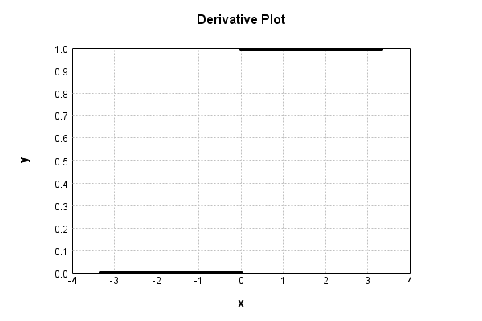

# ActivationLayer
## ReLu_Double
### Json Serialization
Code from [StandardLayerTests.java:69](../../../../../../../../src/main/java/com/simiacryptus/mindseye/test/StandardLayerTests.java#L69) executed in 0.00 seconds: 
```java
    JsonObject json = layer.getJson();
    NNLayer echo = NNLayer.fromJson(json);
    if ((echo == null)) throw new AssertionError("Failed to deserialize");
    if ((layer == echo)) throw new AssertionError("Serialization did not copy");
    if ((!layer.equals(echo))) throw new AssertionError("Serialization not equal");
    return new GsonBuilder().setPrettyPrinting().create().toJson(json);
```

Returns: 

```
    {
      "class": "com.simiacryptus.mindseye.layers.cudnn.ActivationLayer",
      "id": "ed798a35-fb49-4048-a73c-f9928e05c2d2",
      "isFrozen": false,
      "name": "ActivationLayer/ed798a35-fb49-4048-a73c-f9928e05c2d2",
      "mode": 1
    }
```


### Example Input/Output Pair
Code from [StandardLayerTests.java:153](../../../../../../../../src/main/java/com/simiacryptus/mindseye/test/StandardLayerTests.java#L153) executed in 0.01 seconds: 
```java
    SimpleEval eval = SimpleEval.run(layer, inputPrototype);
    return String.format("--------------------\nInput: \n[%s]\n--------------------\nOutput: \n%s\n--------------------\nDerivative: \n%s",
      Arrays.stream(inputPrototype).map(t -> t.prettyPrint()).reduce((a, b) -> a + ",\n" + b).get(),
      eval.getOutput().prettyPrint(),
      Arrays.stream(eval.getDerivative()).map(t -> t.prettyPrint()).reduce((a, b) -> a + ",\n" + b).get());
```

Returns: 

```
    --------------------
    Input: 
    [[
    	[ [ 0.784 ] ]
    ]]
    --------------------
    Output: 
    [
    	[ [ 0.784 ] ]
    ]
    --------------------
    Derivative: 
    [
    	[ [ 1.0 ] ]
    ]
```


[GPU Log](etc/cuda.log)

### Reference Implementation
Code from [StandardLayerTests.java:93](../../../../../../../../src/main/java/com/simiacryptus/mindseye/test/StandardLayerTests.java#L93) executed in 0.01 seconds: 
```java
    System.out.println(new GsonBuilder().setPrettyPrinting().create().toJson(referenceLayer.getJson()));
    getEquivalencyTester().test(referenceLayer, layer, inputPrototype);
```
Logging: 
```
    {
      "class": "com.simiacryptus.mindseye.layers.java.ReLuActivationLayer",
      "id": "38bb1073-4d8d-45ab-95d0-6637c9d8b339",
      "isFrozen": true,
      "name": "ReLuActivationLayer/38bb1073-4d8d-45ab-95d0-6637c9d8b339",
      "weights": [
        1.0
      ]
    }
    Inputs: [
    	[ [ 0.532 ] ]
    ]
    Error: [
    	[ [ 0.0 ] ]
    ]
    Accuracy:
    absoluteTol: 0.0000e+00 +- 0.0000e+00 [0.0000e+00 - 0.0000e+00] (1#)
    relativeTol: 0.0000e+00 +- 0.0000e+00 [0.0000e+00 - 0.0000e+00] (1#)
    
```

### Batch Execution
Code from [StandardLayerTests.java:102](../../../../../../../../src/main/java/com/simiacryptus/mindseye/test/StandardLayerTests.java#L102) executed in 0.01 seconds: 
```java
    return getBatchingTester().test(layer, inputPrototype);
```

Returns: 

```
    ToleranceStatistics{absoluteTol=0.0000e+00 +- 0.0000e+00 [0.0000e+00 - 0.0000e+00] (20#), relativeTol=0.0000e+00 +- 0.0000e+00 [0.0000e+00 - 0.0000e+00] (6#)}
```


### Differential Validation
Code from [StandardLayerTests.java:110](../../../../../../../../src/main/java/com/simiacryptus/mindseye/test/StandardLayerTests.java#L110) executed in 0.00 seconds: 
```java
    return getDerivativeTester().test(layer, inputPrototype);
```
Logging: 
```
    Inputs: [
    	[ [ -0.58 ] ]
    ]
    Inputs Statistics: {meanExponent=-0.23657200643706275, negative=1, min=-0.58, max=-0.58, mean=-0.58, count=1.0, positive=0, stdDev=0.0, zeros=0}
    Output: [
    	[ [ 0.0 ] ]
    ]
    Outputs Statistics: {meanExponent=NaN, negative=0, min=0.0, max=0.0, mean=0.0, count=1.0, positive=0, stdDev=0.0, zeros=1}
    Feedback for input 0
    Inputs Values: [
    	[ [ -0.58 ] ]
    ]
    Value Statistics: {meanExponent=-0.23657200643706275, negative=1, min=-0.58, max=-0.58, mean=-0.58, count=1.0, positive=0, stdDev=0.0, zeros=0}
    Implemented Feedback: [ [ 0.0 ] ]
    Implemented Statistics: {meanExponent=NaN, negative=0, min=0.0, max=0.0, mean=0.0, count=1.0, positive=0, stdDev=0.0, zeros=1}
    Measured Feedback: [ [ 0.0 ] ]
    Measured Statistics: {meanExponent=NaN, negative=0, min=0.0, max=0.0, mean=0.0, count=1.0, positive=0, stdDev=0.0, zeros=1}
    Feedback Error: [ [ 0.0 ] ]
    Error Statistics: {meanExponent=NaN, negative=0, min=0.0, max=0.0, mean=0.0, count=1.0, positive=0, stdDev=0.0, zeros=1}
    Finite-Difference Derivative Accuracy:
    absoluteTol: 0.0000e+00 +- 0.0000e+00 [0.0000e+00 - 0.0000e+00] (1#)
    relativeTol: 0.0000e+00 +- 0.0000e+00 [Infinity - -Infinity] (0#)
    
```

Returns: 

```
    ToleranceStatistics{absoluteTol=0.0000e+00 +- 0.0000e+00 [0.0000e+00 - 0.0000e+00] (1#), relativeTol=0.0000e+00 +- 0.0000e+00 [Infinity - -Infinity] (0#)}
```


### Performance
Code from [StandardLayerTests.java:120](../../../../../../../../src/main/java/com/simiacryptus/mindseye/test/StandardLayerTests.java#L120) executed in 0.01 seconds: 
```java
    getPerformanceTester().test(layer, permPrototype);
```
Logging: 
```
    Evaluation performance: 0.000314s +- 0.000053s [0.000262s - 0.000417s]
    Learning performance: 0.000368s +- 0.000019s [0.000341s - 0.000395s]
    
```

### Function Plots
Code from [ActivationLayerTest.java:83](../../../../../../../../src/test/java/com/simiacryptus/mindseye/layers/cudnn/ActivationLayerTest.java#L83) executed in 0.12 seconds: 
```java
    return ActivationLayerTestBase.plot("Value Plot", plotData, x -> new double[]{x[0], x[1]});
```

Returns: 


Code from [ActivationLayerTest.java:87](../../../../../../../../src/test/java/com/simiacryptus/mindseye/layers/cudnn/ActivationLayerTest.java#L87) executed in 0.01 seconds: 
```java
    return ActivationLayerTestBase.plot("Derivative Plot", plotData, x -> new double[]{x[0], x[2]});
```

Returns: 




