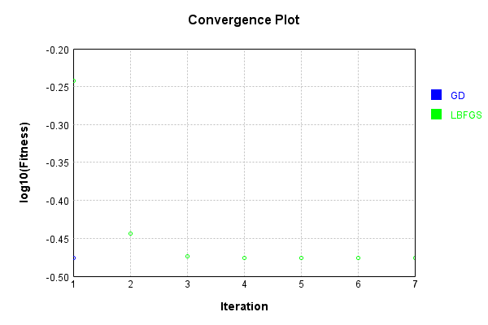
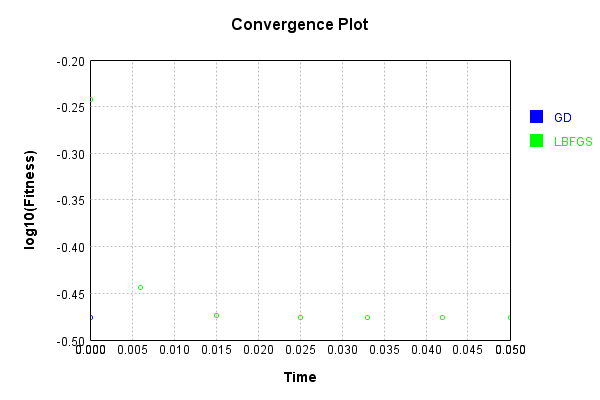
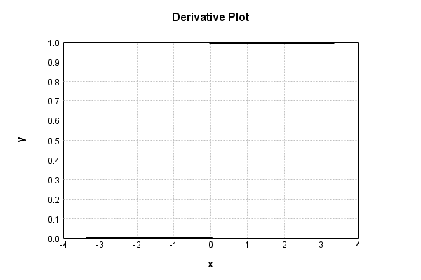

# ActivationLayer
## ReLu_Double
### Json Serialization
Code from [JsonTest.java:36](../../../../../../../../src/main/java/com/simiacryptus/mindseye/test/unit/JsonTest.java#L36) executed in 0.00 seconds: 
```java
    JsonObject json = layer.getJson();
    NNLayer echo = NNLayer.fromJson(json);
    if ((echo == null)) throw new AssertionError("Failed to deserialize");
    if ((layer == echo)) throw new AssertionError("Serialization did not copy");
    if ((!layer.equals(echo))) throw new AssertionError("Serialization not equal");
    return new GsonBuilder().setPrettyPrinting().create().toJson(json);
```

Returns: 

```
    {
      "class": "com.simiacryptus.mindseye.layers.cudnn.ActivationLayer",
      "id": "111dd5fe-d37a-4343-b4c8-f2dd0760b45e",
      "isFrozen": false,
      "name": "ActivationLayer/111dd5fe-d37a-4343-b4c8-f2dd0760b45e",
      "mode": 1,
      "precision": "Double"
    }
```


### Example Input/Output Pair
Code from [ReferenceIO.java:68](../../../../../../../../src/main/java/com/simiacryptus/mindseye/test/unit/ReferenceIO.java#L68) executed in 0.01 seconds: 
```java
    SimpleEval eval = SimpleEval.run(layer, inputPrototype);
    return String.format("--------------------\nInput: \n[%s]\n--------------------\nOutput: \n%s\n--------------------\nDerivative: \n%s",
      Arrays.stream(inputPrototype).map(t -> t.prettyPrint()).reduce((a, b) -> a + ",\n" + b).get(),
      eval.getOutput().prettyPrint(),
      Arrays.stream(eval.getDerivative()).map(t -> t.prettyPrint()).reduce((a, b) -> a + ",\n" + b).get());
```

Returns: 

```
    --------------------
    Input: 
    [[
    	[ [ 0.444 ] ]
    ]]
    --------------------
    Output: 
    [
    	[ [ 0.444 ] ]
    ]
    --------------------
    Derivative: 
    [
    	[ [ 1.0 ] ]
    ]
```


[GPU Log](etc/cuda.log)

### Batch Execution
Code from [BatchingTester.java:66](../../../../../../../../src/main/java/com/simiacryptus/mindseye/test/unit/BatchingTester.java#L66) executed in 0.01 seconds: 
```java
    return test(reference, inputPrototype);
```

Returns: 

```
    ToleranceStatistics{absoluteTol=0.0000e+00 +- 0.0000e+00 [0.0000e+00 - 0.0000e+00] (20#), relativeTol=0.0000e+00 +- 0.0000e+00 [0.0000e+00 - 0.0000e+00] (16#)}
```


Code from [SingleDerivativeTester.java:77](../../../../../../../../src/main/java/com/simiacryptus/mindseye/test/unit/SingleDerivativeTester.java#L77) executed in 0.00 seconds: 
```java
    return test(component, inputPrototype);
```
Logging: 
```
    Inputs: [
    	[ [ -0.828 ] ]
    ]
    Inputs Statistics: {meanExponent=-0.08196966321511988, negative=1, min=-0.828, max=-0.828, mean=-0.828, count=1.0, positive=0, stdDev=0.0, zeros=0}
    Output: [
    	[ [ 0.0 ] ]
    ]
    Outputs Statistics: {meanExponent=NaN, negative=0, min=0.0, max=0.0, mean=0.0, count=1.0, positive=0, stdDev=0.0, zeros=1}
    Feedback for input 0
    Inputs Values: [
    	[ [ -0.828 ] ]
    ]
    Value Statistics: {meanExponent=-0.08196966321511988, negative=1, min=-0.828, max=-0.828, mean=-0.828, count=1.0, positive=0, stdDev=0.0, zeros=0}
    Implemented Feedback: [ [ 0.0 ] ]
    Implemented Statistics: {meanExponent=NaN, negative=0, min=0.0, max=0.0, mean=0.0, count=1.0, positive=0, stdDev=0.0, zeros=1}
    Measured Feedback: [ [ 0.0 ] ]
    Measured Statistics: {meanExponent=NaN, negative=0, min=0.0, max=0.0, mean=0.0, count=1.0, positive=0, stdDev=0.0, zeros=1}
    Feedback Error: [ [ 0.0 ] ]
    Error Statistics: {meanExponent=NaN, negative=0, min=0.0, max=0.0, mean=0.0, count=1.0, positive=0, stdDev=0.0, zeros=1}
    Finite-Difference Derivative Accuracy:
    absoluteTol: 0.0000e+00 +- 0.0000e+00 [0.0000e+00 - 0.0000e+00] (1#)
    relativeTol: 0.0000e+00 +- 0.0000e+00 [Infinity - -Infinity] (0#)
    
```

Returns: 

```
    ToleranceStatistics{absoluteTol=0.0000e+00 +- 0.0000e+00 [0.0000e+00 - 0.0000e+00] (1#), relativeTol=0.0000e+00 +- 0.0000e+00 [Infinity - -Infinity] (0#)}
```


### Reference Implementation
Code from [EquivalencyTester.java:61](../../../../../../../../src/main/java/com/simiacryptus/mindseye/test/unit/EquivalencyTester.java#L61) executed in 0.00 seconds: 
```java
    System.out.println(new GsonBuilder().setPrettyPrinting().create().toJson(this.reference.getJson()));
```
Logging: 
```
    {
      "class": "com.simiacryptus.mindseye.layers.java.ReLuActivationLayer",
      "id": "44070850-d41e-426a-8180-4c70190a5aaa",
      "isFrozen": true,
      "name": "ReLuActivationLayer/44070850-d41e-426a-8180-4c70190a5aaa",
      "weights": [
        1.0
      ]
    }
    
```

Code from [EquivalencyTester.java:64](../../../../../../../../src/main/java/com/simiacryptus/mindseye/test/unit/EquivalencyTester.java#L64) executed in 0.00 seconds: 
```java
    return test(subject, inputPrototype);
```
Logging: 
```
    Inputs: [
    	[ [ 0.196 ] ]
    ]
    Error: [
    	[ [ 0.0 ] ]
    ]
    Accuracy:
    absoluteTol: 0.0000e+00 +- 0.0000e+00 [0.0000e+00 - 0.0000e+00] (1#)
    relativeTol: 0.0000e+00 +- 0.0000e+00 [0.0000e+00 - 0.0000e+00] (1#)
    
```

Returns: 

```
    ToleranceStatistics{absoluteTol=0.0000e+00 +- 0.0000e+00 [0.0000e+00 - 0.0000e+00] (1#), relativeTol=0.0000e+00 +- 0.0000e+00 [0.0000e+00 - 0.0000e+00] (1#)}
```


### Performance
Now we execute larger-scale runs to benchmark performance:

Code from [PerformanceTester.java:66](../../../../../../../../src/main/java/com/simiacryptus/mindseye/test/unit/PerformanceTester.java#L66) executed in 0.24 seconds: 
```java
    test(component, inputPrototype);
```
Logging: 
```
    100 batches
    Input Dimensions:
    	[100, 100, 1]
    Performance:
    	Evaluation performance: 0.007568s +- 0.001207s [0.005517s - 0.008850s]
    	Learning performance: 0.031615s +- 0.011723s [0.025236s - 0.055049s]
    
```

### Input Learning
In this test, we use a network to learn this target input, given it's pre-evaluated output:

Code from [LearningTester.java:127](../../../../../../../../src/main/java/com/simiacryptus/mindseye/test/unit/LearningTester.java#L127) executed in 0.00 seconds: 
```java
    return Arrays.stream(input_target).map(x -> x.prettyPrint()).reduce((a, b) -> a + "\n" + b).orElse("");
```

Returns: 

```
    [
    	[ [ -1.876 ], [ -0.652 ], [ 1.588 ], [ -0.16 ], [ -1.976 ], [ 0.856 ], [ -1.364 ], [ 0.86 ], ... ],
    	[ [ 1.084 ], [ 0.972 ], [ -0.408 ], [ -0.536 ], [ -0.212 ], [ -0.816 ], [ -1.496 ], [ 0.832 ], ... ],
    	[ [ -0.88 ], [ 0.148 ], [ 0.532 ], [ -0.824 ], [ 1.3 ], [ 0.684 ], [ 1.08 ], [ 0.372 ], ... ],
    	[ [ 1.1 ], [ 0.64 ], [ -0.716 ], [ 0.62 ], [ 1.4 ], [ 0.628 ], [ 1.056 ], [ -1.848 ], ... ],
    	[ [ -1.656 ], [ 0.576 ], [ -0.324 ], [ 1.42 ], [ -1.348 ], [ -1.452 ], [ -1.852 ], [ -0.64 ], ... ],
    	[ [ 0.472 ], [ -0.768 ], [ -1.312 ], [ 0.964 ], [ -1.272 ], [ -1.884 ], [ -0.276 ], [ 0.632 ], ... ],
    	[ [ -1.328 ], [ 0.316 ], [ 1.936 ], [ 1.592 ], [ -1.756 ], [ -0.404 ], [ 0.972 ], [ 1.636 ], ... ],
    	[ [ -0.012 ], [ 1.292 ], [ 0.696 ], [ 1.78 ], [ 1.384 ], [ -1.436 ], [ 0.028 ], [ -0.064 ], ... ],
    	...
    ]
```


First, we use a conjugate gradient descent method, which converges the fastest for purely linear functions.

Code from [LearningTester.java:300](../../../../../../../../src/main/java/com/simiacryptus/mindseye/test/unit/LearningTester.java#L300) executed in 0.11 seconds: 
```java
    return new IterativeTrainer(trainable)
      .setLineSearchFactory(label -> new QuadraticSearch())
      .setOrientation(new GradientDescent())
      .setMonitor(monitor)
      .setTimeout(30, TimeUnit.SECONDS)
      .setMaxIterations(250)
      .setTerminateThreshold(0)
      .run();
```
Logging: 
```
    Constructing line search parameters: GD
    F(0.0) = LineSearchPoint{point=PointSample{avg=0.8341933183999964}, derivative=-2.0006439296000003E-4}
    New Minimum: 0.8341933183999964 > 0.8341933183999756
    F(1.0E-10) = LineSearchPoint{point=PointSample{avg=0.8341933183999756}, derivative=-2.0006439295999602E-4}, delta = -2.0872192862952943E-14
    New Minimum: 0.8341933183999756 > 0.8341933183998592
    F(7.000000000000001E-10) = LineSearchPoint{point=PointSample{avg=0.8341933183998592}, derivative=-2.00064392959972E-4}, delta = -1.3722356584366935E-13
    New Minimum: 0.8341933183998592 > 0.8341933183990202
    F(4.900000000000001E-9) = LineSearchPoint{point=PointSample{avg=0.8341933183990202}, derivative=-2.0006439295980395E-4}, delta = -9.762191055529001E-13
    New Minimum: 0.8341933183990202 > 0.8341933183931355
    F(3.430000000000001E-8) = LineSearchPoint{point=PointSample{avg=0.8341933183931355}, derivative=-2.0006439295862757E-4}, delta = -6.860956247578542E-12
    New Minimum: 0.8341933183931355 > 0.8341933183519608
    F(2.40100
```
...[skipping 3241 bytes](etc/40.txt)...
```
    delta = 0.0
    Right bracket at 6034.884806287479
    F(5647.764019075887) = LineSearchPoint{point=PointSample{avg=0.3340323359999999}, derivative=1.1886558411726841E-33}, delta = 0.0
    Right bracket at 5647.764019075887
    F(5415.72172039231) = LineSearchPoint{point=PointSample{avg=0.3340323359999999}, derivative=7.621480367344942E-34}, delta = 0.0
    Right bracket at 5415.72172039231
    F(5270.91781679171) = LineSearchPoint{point=PointSample{avg=0.3340323359999999}, derivative=4.968951870517738E-34}, delta = 0.0
    Right bracket at 5270.91781679171
    F(5178.171659817617) = LineSearchPoint{point=PointSample{avg=0.3340323359999999}, derivative=3.269109264159024E-34}, delta = 0.0
    Right bracket at 5178.171659817617
    F(5117.863946408978) = LineSearchPoint{point=PointSample{avg=0.3340323359999999}, derivative=2.1646651869538154E-34}, delta = 0.0
    Right bracket at 5117.863946408978
    Converged to right
    Iteration 2 failed, aborting. Error: 0.3340323359999999 Total: 249375894426600.1600; Orientation: 0.0005; Line Search: 0.0443
    
```

Returns: 

```
    0.3340323359999999
```


This training run resulted in the following regressed input:

Code from [LearningTester.java:144](../../../../../../../../src/main/java/com/simiacryptus/mindseye/test/unit/LearningTester.java#L144) executed in 0.01 seconds: 
```java
    return Arrays.stream(input_gd).map(x -> x.prettyPrint()).reduce((a, b) -> a + "\n" + b).orElse("");
```

Returns: 

```
    [
    	[ [ -1.644 ], [ -0.944 ], [ -0.848 ], [ -3.873315905462432E-16 ], [ -1.156 ], [ 0.856 ], [ -1.12 ], [ 0.8600000000000002 ], ... ],
    	[ [ 1.0839999999999999 ], [ 0.972 ], [ -0.804 ], [ -5.129526469396166E-16 ], [ -1.088 ], [ -0.56 ], [ -5.181868576226781E-16 ], [ -0.812 ], ... ],
    	[ [ -1.156 ], [ 0.1479999999999995 ], [ 0.5319999999999998 ], [ -6.084769919054175E-17 ], [ 1.3 ], [ 0.6840000000000002 ], [ -1.636 ], [ 0.3719999999999999 ], ... ],
    	[ [ -1.56 ], [ 0.6399999999999999 ], [ -0.052 ], [ -1.14 ], [ 1.4000000000000004 ], [ -0.048 ], [ 1.056 ], [ -1.28 ], ... ],
    	[ [ -0.848 ], [ -1.128 ], [ -3.088184303003829E-16 ], [ 1.4200000000000002 ], [ -1.884 ], [ -1.756 ], [ -1.548 ], [ -0.636 ], ... ],
    	[ [ -1.028 ], [ -2.564763234698083E-16 ], [ -5.024842255735061E-16 ], [ 0.9640000000000002 ], [ -1.6226053117477827E-16 ], [ -1.7534605788242034E-16 ], [ -0.976 ], [ 0.632 ], ... ],
    	[ [ -1.896 ], [ 0.31599999999999956 ], [ -1.076 ], [ -0.74 ], [ -0.196 ], [ -0.648 ], [ -1.948 ], [ 1.6360000000000001 ], ... ],
    	[ [ -3.0358421961732606E-16 ], [ 1.292 ], [ 0.6959999999999997 ], [ -1.392 ], [ 1.3840000000000001 ], [ -0.48 ], [ -1.0 ], [ -4.239710653276426E-16 ], ... ],
    	...
    ]
```


Next, we run the same optimization using L-BFGS, which is nearly ideal for purely second-order or quadratic functions.

Code from [LearningTester.java:324](../../../../../../../../src/main/java/com/simiacryptus/mindseye/test/unit/LearningTester.java#L324) executed in 0.08 seconds: 
```java
    return new IterativeTrainer(trainable)
      .setLineSearchFactory(label -> new ArmijoWolfeSearch())
      .setOrientation(new LBFGS())
      .setMonitor(monitor)
      .setTimeout(30, TimeUnit.SECONDS)
      .setMaxIterations(250)
      .setTerminateThreshold(0)
      .run();
```
Logging: 
```
    LBFGS Accumulation History: 1 points
    Constructing line search parameters: GD
    th(0)=0.8341933183999964;dx=-2.0006439296000003E-4
    New Minimum: 0.8341933183999964 > 0.8337623855932327
    WOLFE (weak): th(2.154434690031884)=0.8337623855932327; dx=-1.9997818782631338E-4 delta=4.309328067637619E-4
    New Minimum: 0.8337623855932327 > 0.8333316385097868
    WOLFE (weak): th(4.308869380063768)=0.8333316385097868; dx=-1.9989198269262674E-4 delta=8.616798902096878E-4
    New Minimum: 0.8333316385097868 > 0.8316105074093494
    WOLFE (weak): th(12.926608140191302)=0.8316105074093494; dx=-1.9954716215788017E-4 delta=0.0025828109906470553
    New Minimum: 0.8316105074093494 > 0.82390219067678
    WOLFE (weak): th(51.70643256076521)=0.82390219067678; dx=-1.9799546975152069E-4 delta=0.010291127723216387
    New Minimum: 0.82390219067678 > 0.7838074461674214
    WOLFE (weak): th(258.53216280382605)=0.7838074461674214; dx=-1.8971977691760333E-4 delta=0.05038587223257507
    New Minimum: 0.7838074461674214 > 0.5719943243867838
    END: th(1551.1929768229
```
...[skipping 2432 bytes](etc/41.txt)...
```
    )=0.3340323639606418; dx=-1.1184256491513335E-10 delta=2.7681034825421946E-6
    Iteration 6 complete. Error: 0.3340323639606418 Total: 249375969787711.0300; Orientation: 0.0005; Line Search: 0.0075
    LBFGS Accumulation History: 1 points
    th(0)=0.3340323639606418;dx=-1.1184256491513211E-11
    New Minimum: 0.3340323639606418 > 0.33403234416923977
    WOLF (strong): th(9694.956105143481)=0.33403234416923977; dx=3.4800070301395508E-12 delta=1.9791402017244053E-8
    New Minimum: 0.33403234416923977 > 0.33403233602601656
    END: th(4847.478052571741)=0.33403233602601656; dx=-3.411689161245773E-13 delta=2.793462522410195E-8
    Iteration 7 complete. Error: 0.33403233602601656 Total: 249375977552517.0300; Orientation: 0.0005; Line Search: 0.0059
    LBFGS Accumulation History: 1 points
    th(0)=0.33403233602601656;dx=-1.0407149497862656E-14
    MAX ALPHA: th(0)=0.33403233602601656;th'(0)=-1.0407149497862656E-14;
    Iteration 8 failed, aborting. Error: 0.33403233602601656 Total: 249375983596054.0300; Orientation: 0.0005; Line Search: 0.0036
    
```

Returns: 

```
    0.33403233602601656
```


This training run resulted in the following regressed input:

Code from [LearningTester.java:154](../../../../../../../../src/main/java/com/simiacryptus/mindseye/test/unit/LearningTester.java#L154) executed in 0.01 seconds: 
```java
    return Arrays.stream(input_lbgfs).map(x -> x.prettyPrint()).reduce((a, b) -> a + "\n" + b).orElse("");
```

Returns: 

```
    [
    	[ [ -1.644 ], [ -0.944 ], [ -0.848 ], [ 9.924289628697892E-6 ], [ -1.156 ], [ 0.8559995672548126 ], [ -1.12 ], [ 0.8599943743125651 ], ... ],
    	[ [ 1.0840056545371142 ], [ 0.9720004904445456 ], [ -0.804 ], [ 1.3299702089621286E-5 ], [ -1.088 ], [ -0.56 ], [ 1.347280016454047E-5 ], [ -0.812 ], ... ],
    	[ [ -1.156 ], [ 0.14801298235561894 ], [ 0.5320055968377557 ], [ 1.586732353425531E-6 ], [ 1.3000019617781824 ], [ 0.6839967399862558 ], [ -1.636 ], [ 0.3720026541704821 ], ... ],
    	[ [ -1.56 ], [ 0.6400037216086107 ], [ -0.052 ], [ -1.14 ], [ 1.3999908835013875 ], [ -0.048 ], [ 1.056002596471124 ], [ -1.28 ], ... ],
    	[ [ -0.848 ], [ -1.128 ], [ 8.106759842046833E-6 ], [ 1.4199963072410684 ], [ -1.884 ], [ -1.756 ], [ -1.548 ], [ -0.636 ], ... ],
    	[ [ -1.028 ], [ 6.606576526080874E-6 ], [ 1.3068904656395779E-5 ], [ 0.9639944031622443 ], [ 4.212053156365966E-6 ], [ 4.500549947897877E-6 ], [ -0.976 ], [ 0.631999249908342 ], ... ],
    	[ [ -1.896 ], [ 0.31601113597615316 ], [ -1.076 ], [ -0.74 ], [ -0.196 ], [ -0.648 ], [ -1.948 ], [ 1.6359945474106399 ], ... ],
    	[ [ 7.875962408821272E-6 ], [ 1.2920004038955082 ], [ 0.6960057410861514 ], [ -1.392 ], [ 1.383992701031174 ], [ -0.48 ], [ -1.0 ], [ 1.1049427115672375E-5 ], ... ],
    	...
    ]
```


Code from [LearningTester.java:96](../../../../../../../../src/main/java/com/simiacryptus/mindseye/test/unit/LearningTester.java#L96) executed in 0.00 seconds: 
```java
    return TestUtil.compare(runs);
```

Returns: 




Code from [LearningTester.java:99](../../../../../../../../src/main/java/com/simiacryptus/mindseye/test/unit/LearningTester.java#L99) executed in 0.00 seconds: 
```java
    return TestUtil.compareTime(runs);
```

Returns: 




### Function Plots
Code from [ActivationLayerTest.java:90](../../../../../../../../src/test/java/com/simiacryptus/mindseye/layers/cudnn/ActivationLayerTest.java#L90) executed in 0.01 seconds: 
```java
    return ActivationLayerTestBase.plot("Value Plot", plotData, x -> new double[]{x[0], x[1]});
```

Returns: 


Code from [ActivationLayerTest.java:94](../../../../../../../../src/test/java/com/simiacryptus/mindseye/layers/cudnn/ActivationLayerTest.java#L94) executed in 0.01 seconds: 
```java
    return ActivationLayerTestBase.plot("Derivative Plot", plotData, x -> new double[]{x[0], x[2]});
```

Returns: 




