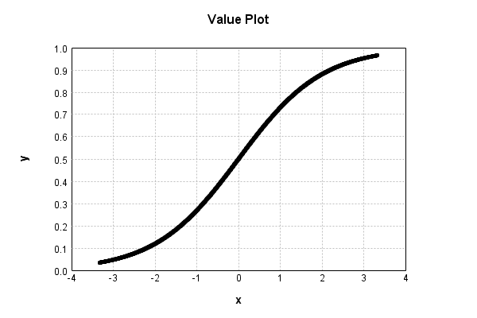

# ActivationLayer
## Sigmoid_Double
### Json Serialization
Code from [StandardLayerTests.java:68](../../../../../../../../src/main/java/com/simiacryptus/mindseye/test/StandardLayerTests.java#L68) executed in 0.00 seconds: 
```java
    JsonObject json = layer.getJson();
    NNLayer echo = NNLayer.fromJson(json);
    if ((echo == null)) throw new AssertionError("Failed to deserialize");
    if ((layer == echo)) throw new AssertionError("Serialization did not copy");
    if ((!layer.equals(echo))) throw new AssertionError("Serialization not equal");
    return new GsonBuilder().setPrettyPrinting().create().toJson(json);
```

Returns: 

```
    {
      "class": "com.simiacryptus.mindseye.layers.cudnn.ActivationLayer",
      "id": "674dbb4f-ce08-48a0-b03a-680c7d3fbb6a",
      "isFrozen": false,
      "name": "ActivationLayer/674dbb4f-ce08-48a0-b03a-680c7d3fbb6a",
      "mode": 0
    }
```


### Example Input/Output Pair
Code from [StandardLayerTests.java:152](../../../../../../../../src/main/java/com/simiacryptus/mindseye/test/StandardLayerTests.java#L152) executed in 0.00 seconds: 
```java
    SimpleEval eval = SimpleEval.run(layer, inputPrototype);
    return String.format("--------------------\nInput: \n[%s]\n--------------------\nOutput: \n%s\n--------------------\nDerivative: \n%s",
      Arrays.stream(inputPrototype).map(t -> t.prettyPrint()).reduce((a, b) -> a + ",\n" + b).get(),
      eval.getOutput().prettyPrint(),
      Arrays.stream(eval.getDerivative()).map(t -> t.prettyPrint()).reduce((a, b) -> a + ",\n" + b).get());
```

Returns: 

```
    --------------------
    Input: 
    [[
    	[ [ 1.824 ] ]
    ]]
    --------------------
    Output: 
    [
    	[ [ 0.8610454034281185 ] ]
    ]
    --------------------
    Derivative: 
    [
    	[ [ 0.11964621666342713 ] ]
    ]
```


[GPU Log](etc/cuda.log)

### Reference Implementation
Code from [StandardLayerTests.java:92](../../../../../../../../src/main/java/com/simiacryptus/mindseye/test/StandardLayerTests.java#L92) executed in 0.00 seconds: 
```java
    System.out.println(new GsonBuilder().setPrettyPrinting().create().toJson(referenceLayer.getJson()));
    getEquivalencyTester().test(referenceLayer, layer, inputPrototype);
```
Logging: 
```
    {
      "class": "com.simiacryptus.mindseye.layers.java.SigmoidActivationLayer",
      "id": "3c570656-4f50-4987-aaa7-00670b31146a",
      "isFrozen": true,
      "name": "SigmoidActivationLayer/3c570656-4f50-4987-aaa7-00670b31146a",
      "balanced": false
    }
    Inputs: [
    	[ [ -1.492 ] ]
    ]
    Error: [
    	[ [ -2.7755575615628914E-17 ] ]
    ]
    Accuracy:
    absoluteTol: 2.7756e-17 +- 0.0000e+00 [2.7756e-17 - 2.7756e-17] (1#)
    relativeTol: 7.5578e-17 +- 0.0000e+00 [7.5578e-17 - 7.5578e-17] (1#)
    
```

### Batch Execution
Code from [StandardLayerTests.java:101](../../../../../../../../src/main/java/com/simiacryptus/mindseye/test/StandardLayerTests.java#L101) executed in 0.01 seconds: 
```java
    return getBatchingTester().test(layer, inputPrototype);
```

Returns: 

```
    ToleranceStatistics{absoluteTol=0.0000e+00 +- 0.0000e+00 [0.0000e+00 - 0.0000e+00] (20#), relativeTol=0.0000e+00 +- 0.0000e+00 [0.0000e+00 - 0.0000e+00] (20#)}
```


### Differential Validation
Code from [StandardLayerTests.java:109](../../../../../../../../src/main/java/com/simiacryptus/mindseye/test/StandardLayerTests.java#L109) executed in 0.00 seconds: 
```java
    return getDerivativeTester().test(layer, inputPrototype);
```
Logging: 
```
    Inputs: [
    	[ [ 0.932 ] ]
    ]
    Inputs Statistics: {meanExponent=-0.030584087646018613, negative=0, min=0.932, max=0.932, mean=0.932, count=1.0, positive=1, stdDev=0.0, zeros=0}
    Output: [
    	[ [ 0.7174808659156633 ] ]
    ]
    Outputs Statistics: {meanExponent=-0.14418967638915853, negative=0, min=0.7174808659156633, max=0.7174808659156633, mean=0.7174808659156633, count=1.0, positive=1, stdDev=0.0, zeros=0}
    Feedback for input 0
    Inputs Values: [
    	[ [ 0.932 ] ]
    ]
    Value Statistics: {meanExponent=-0.030584087646018613, negative=0, min=0.932, max=0.932, mean=0.932, count=1.0, positive=1, stdDev=0.0, zeros=0}
    Implemented Feedback: [ [ 0.2027020729605733 ] ]
    Implemented Statistics: {meanExponent=-0.6931418099121478, negative=0, min=0.2027020729605733, max=0.2027020729605733, mean=0.2027020729605733, count=1.0, positive=1, stdDev=0.0, zeros=0}
    Measured Feedback: [ [ 0.20269766450531357 ] ]
    Measured Statistics: {meanExponent=-0.6931512552453148, negative=0, min=0.20269766450531357, max=0.20269766450531357, mean=0.20269766450531357, count=1.0, positive=1, stdDev=0.0, zeros=0}
    Feedback Error: [ [ -4.408455259730104E-6 ] ]
    Error Statistics: {meanExponent=-5.3557135623914816, negative=1, min=-4.408455259730104E-6, max=-4.408455259730104E-6, mean=-4.408455259730104E-6, count=1.0, positive=0, stdDev=0.0, zeros=0}
    Finite-Difference Derivative Accuracy:
    absoluteTol: 4.4085e-06 +- 0.0000e+00 [4.4085e-06 - 4.4085e-06] (1#)
    relativeTol: 1.0874e-05 +- 0.0000e+00 [1.0874e-05 - 1.0874e-05] (1#)
    
```

Returns: 

```
    ToleranceStatistics{absoluteTol=4.4085e-06 +- 0.0000e+00 [4.4085e-06 - 4.4085e-06] (1#), relativeTol=1.0874e-05 +- 0.0000e+00 [1.0874e-05 - 1.0874e-05] (1#)}
```


### Performance
Code from [StandardLayerTests.java:119](../../../../../../../../src/main/java/com/simiacryptus/mindseye/test/StandardLayerTests.java#L119) executed in 0.18 seconds: 
```java
    getPerformanceTester().test(layer, permPrototype);
```
Logging: 
```
    100 batches
    Input Dimensions:
    	[100, 100, 1]
    	[100, 100, 1]
    Performance:
    	Evaluation performance: 0.006005s +- 0.000331s [0.005368s - 0.006295s]
    	Learning performance: 0.023773s +- 0.000819s [0.022481s - 0.024624s]
    
```

### Function Plots
Code from [ActivationLayerTest.java:90](../../../../../../../../src/test/java/com/simiacryptus/mindseye/layers/cudnn/ActivationLayerTest.java#L90) executed in 0.00 seconds: 
```java
    return ActivationLayerTestBase.plot("Value Plot", plotData, x -> new double[]{x[0], x[1]});
```

Returns: 




Code from [ActivationLayerTest.java:94](../../../../../../../../src/test/java/com/simiacryptus/mindseye/layers/cudnn/ActivationLayerTest.java#L94) executed in 0.00 seconds: 
```java
    return ActivationLayerTestBase.plot("Derivative Plot", plotData, x -> new double[]{x[0], x[2]});
```

Returns: 


