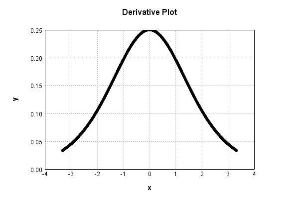

# ActivationLayer
## Sigmoid_Double
### Json Serialization
Code from [StandardLayerTests.java:69](../../../../../../../../src/main/java/com/simiacryptus/mindseye/test/StandardLayerTests.java#L69) executed in 0.00 seconds: 
```java
    JsonObject json = layer.getJson();
    NNLayer echo = NNLayer.fromJson(json);
    if ((echo == null)) throw new AssertionError("Failed to deserialize");
    if ((layer == echo)) throw new AssertionError("Serialization did not copy");
    if ((!layer.equals(echo))) throw new AssertionError("Serialization not equal");
    return new GsonBuilder().setPrettyPrinting().create().toJson(json);
```

Returns: 

```
    {
      "class": "com.simiacryptus.mindseye.layers.cudnn.ActivationLayer",
      "id": "c85747f3-80a1-4621-b9a1-e5a2f9dbc379",
      "isFrozen": false,
      "name": "ActivationLayer/c85747f3-80a1-4621-b9a1-e5a2f9dbc379",
      "mode": 0
    }
```


### Example Input/Output Pair
Code from [StandardLayerTests.java:153](../../../../../../../../src/main/java/com/simiacryptus/mindseye/test/StandardLayerTests.java#L153) executed in 0.00 seconds: 
```java
    SimpleEval eval = SimpleEval.run(layer, inputPrototype);
    return String.format("--------------------\nInput: \n[%s]\n--------------------\nOutput: \n%s\n--------------------\nDerivative: \n%s",
      Arrays.stream(inputPrototype).map(t -> t.prettyPrint()).reduce((a, b) -> a + ",\n" + b).get(),
      eval.getOutput().prettyPrint(),
      Arrays.stream(eval.getDerivative()).map(t -> t.prettyPrint()).reduce((a, b) -> a + ",\n" + b).get());
```

Returns: 

```
    --------------------
    Input: 
    [[
    	[ [ -1.068 ] ]
    ]]
    --------------------
    Output: 
    [
    	[ [ 0.25578361489649876 ] ]
    ]
    --------------------
    Derivative: 
    [
    	[ [ 0.1903583572469784 ] ]
    ]
```


[GPU Log](etc/cuda.log)

### Reference Implementation
Code from [StandardLayerTests.java:93](../../../../../../../../src/main/java/com/simiacryptus/mindseye/test/StandardLayerTests.java#L93) executed in 0.00 seconds: 
```java
    System.out.println(new GsonBuilder().setPrettyPrinting().create().toJson(referenceLayer.getJson()));
    getEquivalencyTester().test(referenceLayer, layer, inputPrototype);
```
Logging: 
```
    {
      "class": "com.simiacryptus.mindseye.layers.java.SigmoidActivationLayer",
      "id": "92efd66a-3cd3-4ecf-95ca-06b2243f4f54",
      "isFrozen": true,
      "name": "SigmoidActivationLayer/92efd66a-3cd3-4ecf-95ca-06b2243f4f54",
      "balanced": false
    }
    Inputs: [
    	[ [ -0.312 ] ]
    ]
    Error: [
    	[ [ 0.0 ] ]
    ]
    Accuracy:
    absoluteTol: 0.0000e+00 +- 0.0000e+00 [0.0000e+00 - 0.0000e+00] (1#)
    relativeTol: 0.0000e+00 +- 0.0000e+00 [0.0000e+00 - 0.0000e+00] (1#)
    
```

### Batch Execution
Code from [StandardLayerTests.java:102](../../../../../../../../src/main/java/com/simiacryptus/mindseye/test/StandardLayerTests.java#L102) executed in 0.01 seconds: 
```java
    return getBatchingTester().test(layer, inputPrototype);
```

Returns: 

```
    ToleranceStatistics{absoluteTol=0.0000e+00 +- 0.0000e+00 [0.0000e+00 - 0.0000e+00] (20#), relativeTol=0.0000e+00 +- 0.0000e+00 [0.0000e+00 - 0.0000e+00] (20#)}
```


### Differential Validation
Code from [StandardLayerTests.java:110](../../../../../../../../src/main/java/com/simiacryptus/mindseye/test/StandardLayerTests.java#L110) executed in 0.00 seconds: 
```java
    return getDerivativeTester().test(layer, inputPrototype);
```
Logging: 
```
    Inputs: [
    	[ [ -0.708 ] ]
    ]
    Inputs Statistics: {meanExponent=-0.149966742310231, negative=1, min=-0.708, max=-0.708, mean=-0.708, count=1.0, positive=0, stdDev=0.0, zeros=0}
    Output: [
    	[ [ 0.3300409175942483 ] ]
    ]
    Outputs Statistics: {meanExponent=-0.48143221411061876, negative=0, min=0.3300409175942483, max=0.3300409175942483, mean=0.3300409175942483, count=1.0, positive=1, stdDev=0.0, zeros=0}
    Feedback for input 0
    Inputs Values: [
    	[ [ -0.708 ] ]
    ]
    Value Statistics: {meanExponent=-0.149966742310231, negative=1, min=-0.708, max=-0.708, mean=-0.708, count=1.0, positive=0, stdDev=0.0, zeros=0}
    Implemented Feedback: [ [ 0.22111391030779493 ] ]
    Implemented Statistics: {meanExponent=-0.6553839350337353, negative=0, min=0.22111391030779493, max=0.22111391030779493, mean=0.22111391030779493, count=1.0, positive=1, stdDev=0.0, zeros=0}
    Measured Feedback: [ [ 0.221117668218751 ] ]
    Measured Statistics: {meanExponent=-0.6553765541045072, negative=0, min=0.221117668218751, max=0.221117668218751, mean=0.221117668218751, count=1.0, positive=1, stdDev=0.0, zeros=0}
    Feedback Error: [ [ 3.757910956081467E-6 ] ]
    Error Statistics: {meanExponent=-5.425053514746568, negative=0, min=3.757910956081467E-6, max=3.757910956081467E-6, mean=3.757910956081467E-6, count=1.0, positive=1, stdDev=0.0, zeros=0}
    Finite-Difference Derivative Accuracy:
    absoluteTol: 3.7579e-06 +- 0.0000e+00 [3.7579e-06 - 3.7579e-06] (1#)
    relativeTol: 8.4976e-06 +- 0.0000e+00 [8.4976e-06 - 8.4976e-06] (1#)
    
```

Returns: 

```
    ToleranceStatistics{absoluteTol=3.7579e-06 +- 0.0000e+00 [3.7579e-06 - 3.7579e-06] (1#), relativeTol=8.4976e-06 +- 0.0000e+00 [8.4976e-06 - 8.4976e-06] (1#)}
```


### Performance
Code from [StandardLayerTests.java:120](../../../../../../../../src/main/java/com/simiacryptus/mindseye/test/StandardLayerTests.java#L120) executed in 0.00 seconds: 
```java
    getPerformanceTester().test(layer, permPrototype);
```
Logging: 
```
    Evaluation performance: 0.000191s +- 0.000009s [0.000183s - 0.000207s]
    Learning performance: 0.000288s +- 0.000012s [0.000273s - 0.000304s]
    
```

### Function Plots
Code from [ActivationLayerTest.java:83](../../../../../../../../src/test/java/com/simiacryptus/mindseye/layers/cudnn/ActivationLayerTest.java#L83) executed in 0.01 seconds: 
```java
    return ActivationLayerTestBase.plot("Value Plot", plotData, x -> new double[]{x[0], x[1]});
```

Returns: 


Code from [ActivationLayerTest.java:87](../../../../../../../../src/test/java/com/simiacryptus/mindseye/layers/cudnn/ActivationLayerTest.java#L87) executed in 0.01 seconds: 
```java
    return ActivationLayerTestBase.plot("Derivative Plot", plotData, x -> new double[]{x[0], x[2]});
```

Returns: 




