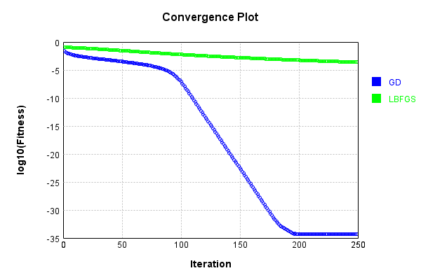
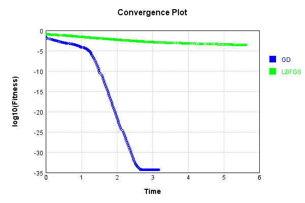
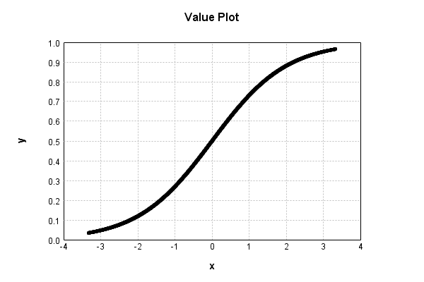

# ActivationLayer
## Sigmoid_Double
### Json Serialization
Code from [JsonTest.java:36](../../../../../../../../src/main/java/com/simiacryptus/mindseye/test/unit/JsonTest.java#L36) executed in 0.00 seconds: 
```java
    JsonObject json = layer.getJson();
    NNLayer echo = NNLayer.fromJson(json);
    if ((echo == null)) throw new AssertionError("Failed to deserialize");
    if ((layer == echo)) throw new AssertionError("Serialization did not copy");
    if ((!layer.equals(echo))) throw new AssertionError("Serialization not equal");
    return new GsonBuilder().setPrettyPrinting().create().toJson(json);
```

Returns: 

```
    {
      "class": "com.simiacryptus.mindseye.layers.cudnn.ActivationLayer",
      "id": "5c5b8182-9ca0-4ca8-ae1c-7bda3e08ddb0",
      "isFrozen": false,
      "name": "ActivationLayer/5c5b8182-9ca0-4ca8-ae1c-7bda3e08ddb0",
      "mode": 0,
      "precision": "Double"
    }
```


### Example Input/Output Pair
Code from [ReferenceIO.java:68](../../../../../../../../src/main/java/com/simiacryptus/mindseye/test/unit/ReferenceIO.java#L68) executed in 0.00 seconds: 
```java
    SimpleEval eval = SimpleEval.run(layer, inputPrototype);
    return String.format("--------------------\nInput: \n[%s]\n--------------------\nOutput: \n%s\n--------------------\nDerivative: \n%s",
      Arrays.stream(inputPrototype).map(t -> t.prettyPrint()).reduce((a, b) -> a + ",\n" + b).get(),
      eval.getOutput().prettyPrint(),
      Arrays.stream(eval.getDerivative()).map(t -> t.prettyPrint()).reduce((a, b) -> a + ",\n" + b).get());
```

Returns: 

```
    --------------------
    Input: 
    [[
    	[ [ -1.892 ] ]
    ]]
    --------------------
    Output: 
    [
    	[ [ 0.131016598854196 ] ]
    ]
    --------------------
    Derivative: 
    [
    	[ [ 0.11385124967887468 ] ]
    ]
```


[GPU Log](etc/cuda.log)

### Batch Execution
Code from [BatchingTester.java:66](../../../../../../../../src/main/java/com/simiacryptus/mindseye/test/unit/BatchingTester.java#L66) executed in 0.01 seconds: 
```java
    return test(reference, inputPrototype);
```

Returns: 

```
    ToleranceStatistics{absoluteTol=0.0000e+00 +- 0.0000e+00 [0.0000e+00 - 0.0000e+00] (20#), relativeTol=0.0000e+00 +- 0.0000e+00 [0.0000e+00 - 0.0000e+00] (20#)}
```


Code from [SingleDerivativeTester.java:77](../../../../../../../../src/main/java/com/simiacryptus/mindseye/test/unit/SingleDerivativeTester.java#L77) executed in 0.00 seconds: 
```java
    return test(component, inputPrototype);
```
Logging: 
```
    Inputs: [
    	[ [ -0.4 ] ]
    ]
    Inputs Statistics: {meanExponent=-0.3979400086720376, negative=1, min=-0.4, max=-0.4, mean=-0.4, count=1.0, positive=0, stdDev=0.0, zeros=0}
    Output: [
    	[ [ 0.401312339887548 ] ]
    ]
    Outputs Statistics: {meanExponent=-0.3965174860108041, negative=0, min=0.401312339887548, max=0.401312339887548, mean=0.401312339887548, count=1.0, positive=1, stdDev=0.0, zeros=0}
    Feedback for input 0
    Inputs Values: [
    	[ [ -0.4 ] ]
    ]
    Value Statistics: {meanExponent=-0.3979400086720376, negative=1, min=-0.4, max=-0.4, mean=-0.4, count=1.0, positive=0, stdDev=0.0, zeros=0}
    Implemented Feedback: [ [ 0.24026074574152914 ] ]
    Implemented Statistics: {meanExponent=-0.6193171792603075, negative=0, min=0.24026074574152914, max=0.24026074574152914, mean=0.24026074574152914, count=1.0, positive=1, stdDev=0.0, zeros=0}
    Measured Feedback: [ [ 0.2402631166420477 ] ]
    Measured Statistics: {meanExponent=-0.6193128936499853, negative=0, min=0.2402631166420477, max=0.2402631166420477, mean=0.2402631166420477, count=1.0, positive=1, stdDev=0.0, zeros=0}
    Feedback Error: [ [ 2.3709005185501564E-6 ] ]
    Error Statistics: {meanExponent=-5.625086668354633, negative=0, min=2.3709005185501564E-6, max=2.3709005185501564E-6, mean=2.3709005185501564E-6, count=1.0, positive=1, stdDev=0.0, zeros=0}
    Finite-Difference Derivative Accuracy:
    absoluteTol: 2.3709e-06 +- 0.0000e+00 [2.3709e-06 - 2.3709e-06] (1#)
    relativeTol: 4.9340e-06 +- 0.0000e+00 [4.9340e-06 - 4.9340e-06] (1#)
    
```

Returns: 

```
    ToleranceStatistics{absoluteTol=2.3709e-06 +- 0.0000e+00 [2.3709e-06 - 2.3709e-06] (1#), relativeTol=4.9340e-06 +- 0.0000e+00 [4.9340e-06 - 4.9340e-06] (1#)}
```


### Reference Implementation
Code from [EquivalencyTester.java:61](../../../../../../../../src/main/java/com/simiacryptus/mindseye/test/unit/EquivalencyTester.java#L61) executed in 0.00 seconds: 
```java
    System.out.println(new GsonBuilder().setPrettyPrinting().create().toJson(this.reference.getJson()));
```
Logging: 
```
    {
      "class": "com.simiacryptus.mindseye.layers.java.SigmoidActivationLayer",
      "id": "35dad1de-673a-460c-bb1b-1534ff0a2a4e",
      "isFrozen": true,
      "name": "SigmoidActivationLayer/35dad1de-673a-460c-bb1b-1534ff0a2a4e",
      "balanced": false
    }
    
```

Code from [EquivalencyTester.java:64](../../../../../../../../src/main/java/com/simiacryptus/mindseye/test/unit/EquivalencyTester.java#L64) executed in 0.00 seconds: 
```java
    return test(subject, inputPrototype);
```
Logging: 
```
    Inputs: [
    	[ [ 1.468 ] ]
    ]
    Error: [
    	[ [ 0.0 ] ]
    ]
    Accuracy:
    absoluteTol: 0.0000e+00 +- 0.0000e+00 [0.0000e+00 - 0.0000e+00] (1#)
    relativeTol: 0.0000e+00 +- 0.0000e+00 [0.0000e+00 - 0.0000e+00] (1#)
    
```

Returns: 

```
    ToleranceStatistics{absoluteTol=0.0000e+00 +- 0.0000e+00 [0.0000e+00 - 0.0000e+00] (1#), relativeTol=0.0000e+00 +- 0.0000e+00 [0.0000e+00 - 0.0000e+00] (1#)}
```


### Performance
Now we execute larger-scale runs to benchmark performance:

Code from [PerformanceTester.java:66](../../../../../../../../src/main/java/com/simiacryptus/mindseye/test/unit/PerformanceTester.java#L66) executed in 0.30 seconds: 
```java
    test(component, inputPrototype);
```
Logging: 
```
    100 batches
    Input Dimensions:
    	[100, 100, 1]
    Performance:
    	Evaluation performance: 0.019456s +- 0.012009s [0.005413s - 0.041112s]
    	Learning performance: 0.031136s +- 0.003390s [0.026516s - 0.036900s]
    
```

### Input Learning
In this test, we use a network to learn this target input, given it's pre-evaluated output:

Code from [LearningTester.java:127](../../../../../../../../src/main/java/com/simiacryptus/mindseye/test/unit/LearningTester.java#L127) executed in 0.00 seconds: 
```java
    return Arrays.stream(input_target).map(x -> x.prettyPrint()).reduce((a, b) -> a + "\n" + b).orElse("");
```

Returns: 

```
    [
    	[ [ 1.964 ], [ 0.872 ], [ 1.42 ], [ -0.92 ], [ -1.152 ], [ 0.308 ], [ 1.624 ], [ 0.22 ], ... ],
    	[ [ -0.316 ], [ 1.888 ], [ -1.684 ], [ -0.852 ], [ -0.684 ], [ -0.84 ], [ 0.972 ], [ 0.112 ], ... ],
    	[ [ 0.128 ], [ -1.928 ], [ 0.88 ], [ 0.04 ], [ -0.144 ], [ -0.876 ], [ -1.764 ], [ 1.7 ], ... ],
    	[ [ 0.104 ], [ 0.592 ], [ -0.192 ], [ -1.604 ], [ -0.832 ], [ 0.54 ], [ -0.868 ], [ -1.192 ], ... ],
    	[ [ 1.36 ], [ 0.82 ], [ 1.776 ], [ -0.64 ], [ -1.892 ], [ -0.52 ], [ -0.712 ], [ -0.456 ], ... ],
    	[ [ -1.904 ], [ -0.056 ], [ 0.008 ], [ 0.564 ], [ 0.12 ], [ 0.464 ], [ 1.004 ], [ 0.284 ], ... ],
    	[ [ 1.148 ], [ -0.356 ], [ 1.7 ], [ -1.596 ], [ 0.464 ], [ -0.316 ], [ -0.772 ], [ 0.056 ], ... ],
    	[ [ 1.352 ], [ -1.344 ], [ 0.788 ], [ -1.512 ], [ -1.112 ], [ 0.332 ], [ 0.356 ], [ -1.612 ], ... ],
    	...
    ]
```


First, we use a conjugate gradient descent method, which converges the fastest for purely linear functions.

Code from [LearningTester.java:300](../../../../../../../../src/main/java/com/simiacryptus/mindseye/test/unit/LearningTester.java#L300) executed in 3.25 seconds: 
```java
    return new IterativeTrainer(trainable)
      .setLineSearchFactory(label -> new QuadraticSearch())
      .setOrientation(new GradientDescent())
      .setMonitor(monitor)
      .setTimeout(30, TimeUnit.SECONDS)
      .setMaxIterations(250)
      .setTerminateThreshold(0)
      .run();
```
Logging: 
```
    Constructing line search parameters: GD
    F(0.0) = LineSearchPoint{point=PointSample{avg=0.11640040323689861}, derivative=-1.491516427878557E-6}
    New Minimum: 0.11640040323689861 > 0.11640040323689847
    F(1.0E-10) = LineSearchPoint{point=PointSample{avg=0.11640040323689847}, derivative=-1.4915164278785568E-6}, delta = -1.3877787807814457E-16
    New Minimum: 0.11640040323689847 > 0.11640040323689771
    F(7.000000000000001E-10) = LineSearchPoint{point=PointSample{avg=0.11640040323689771}, derivative=-1.4915164278785555E-6}, delta = -9.020562075079397E-16
    New Minimum: 0.11640040323689771 > 0.11640040323689127
    F(4.900000000000001E-9) = LineSearchPoint{point=PointSample{avg=0.11640040323689127}, derivative=-1.4915164278785466E-6}, delta = -7.341349750333848E-15
    New Minimum: 0.11640040323689127 > 0.11640040323684728
    F(3.430000000000001E-8) = LineSearchPoint{point=PointSample{avg=0.11640040323684728}, derivative=-1.491516427878483E-6}, delta = -5.1333937101105676E-14
    New Minimum: 0.11640040323684728 > 0.1164004032365
```
...[skipping 260928 bytes](etc/43.txt)...
```
    232766E-35
    F(90906.39829640972) = LineSearchPoint{point=PointSample{avg=5.255862818232766E-35}, derivative=1.0518771759625044E-40}, delta = 0.0
    5.255862818232766E-35 > 5.23275165890012E-35
    Iteration 249 complete. Error: 5.23275165890012E-35 Total: 249381090552997.9000; Orientation: 0.0004; Line Search: 0.0070
    Zero gradient: 2.2938079330699412E-20
    F(0.0) = LineSearchPoint{point=PointSample{avg=5.255862818232766E-35}, derivative=-5.261554833814596E-40}
    New Minimum: 5.255862818232766E-35 > 5.23275165890012E-35
    F(109199.72536629508) = LineSearchPoint{point=PointSample{avg=5.23275165890012E-35}, derivative=1.0587961383891729E-40}, delta = -2.3111159332646423E-37
    5.23275165890012E-35 <= 5.255862818232766E-35
    F(90906.39829640972) = LineSearchPoint{point=PointSample{avg=5.255862818232766E-35}, derivative=1.0518771759625044E-40}, delta = 0.0
    5.255862818232766E-35 > 5.23275165890012E-35
    Iteration 250 complete. Error: 5.23275165890012E-35 Total: 249381098285886.9000; Orientation: 0.0003; Line Search: 0.0061
    
```

Returns: 

```
    5.255862818232766E-35
```


Training Converged

Next, we run the same optimization using L-BFGS, which is nearly ideal for purely second-order or quadratic functions.

Code from [LearningTester.java:324](../../../../../../../../src/main/java/com/simiacryptus/mindseye/test/unit/LearningTester.java#L324) executed in 5.68 seconds: 
```java
    return new IterativeTrainer(trainable)
      .setLineSearchFactory(label -> new ArmijoWolfeSearch())
      .setOrientation(new LBFGS())
      .setMonitor(monitor)
      .setTimeout(30, TimeUnit.SECONDS)
      .setMaxIterations(250)
      .setTerminateThreshold(0)
      .run();
```
Logging: 
```
    LBFGS Accumulation History: 1 points
    Constructing line search parameters: GD
    th(0)=0.11640040323689861;dx=-1.491516427878557E-6
    New Minimum: 0.11640040323689861 > 0.11639718986717547
    WOLFE (weak): th(2.154434690031884)=0.11639718986717547; dx=-1.4915117762787975E-6 delta=3.2133697231429004E-6
    New Minimum: 0.11639718986717547 > 0.11639397650747701
    WOLFE (weak): th(4.308869380063768)=0.11639397650747701; dx=-1.4915071233665693E-6 delta=6.426729421596389E-6
    New Minimum: 0.11639397650747701 > 0.1163811231689655
    WOLFE (weak): th(12.926608140191302)=0.1163811231689655; dx=-1.4914884985926537E-6 delta=1.9280067933113987E-5
    New Minimum: 0.1163811231689655 > 0.11632328513562656
    WOLFE (weak): th(51.70643256076521)=0.11632328513562656; dx=-1.4914044272112264E-6 delta=7.711810127204732E-5
    New Minimum: 0.11632328513562656 > 0.1160148712286885
    WOLFE (weak): th(258.53216280382605)=0.1160148712286885; dx=-1.4909488605116744E-6 delta=3.8553200821010714E-4
    New Minimum: 0.1160148712286885 > 0.11408954691489344
    WOL
```
...[skipping 323912 bytes](etc/44.txt)...
```
    231E-4 > 2.481775006683849E-4
    WOLFE (weak): th(4.308869380063768)=2.481775006683849E-4; dx=-2.4736978600632506E-9 delta=1.0658979186968249E-8
    New Minimum: 2.481775006683849E-4 > 2.481561835393484E-4
    WOLFE (weak): th(12.926608140191302)=2.481561835393484E-4; dx=-2.4735695449672036E-9 delta=3.197610822343799E-8
    New Minimum: 2.481561835393484E-4 > 2.4806027014259333E-4
    WOLFE (weak): th(51.70643256076521)=2.4806027014259333E-4; dx=-2.472992140602359E-9 delta=1.2788950497851122E-7
    New Minimum: 2.4806027014259333E-4 > 2.4754911016821896E-4
    WOLFE (weak): th(258.53216280382605)=2.4754911016821896E-4; dx=-2.46991302558747E-9 delta=6.390494793528847E-7
    New Minimum: 2.4754911016821896E-4 > 2.443687820835276E-4
    WOLFE (weak): th(1551.1929768229563)=2.443687820835276E-4; dx=-2.450682858293132E-9 delta=3.819377564044223E-6
    MAX ALPHA: th(0)=2.4818815964757184E-4;th'(0)=-2.4737620180224116E-9;
    Iteration 250 complete. Error: 2.443687820835276E-4 Total: 249386779077026.2500; Orientation: 0.0006; Line Search: 0.0200
    
```

Returns: 

```
    2.443687820835276E-4
```


This training run resulted in the following regressed input:

Code from [LearningTester.java:154](../../../../../../../../src/main/java/com/simiacryptus/mindseye/test/unit/LearningTester.java#L154) executed in 0.01 seconds: 
```java
    return Arrays.stream(input_lbgfs).map(x -> x.prettyPrint()).reduce((a, b) -> a + "\n" + b).orElse("");
```

Returns: 

```
    [
    	[ [ 1.7204938331362136 ], [ 0.8543621294634686 ], [ 1.303622807442107 ], [ -0.8764733542792251 ], [ -1.1468976909791804 ], [ 0.30088314225325014 ], [ 1.4391639111247676 ], [ 0.2214258099539502 ], ... ],
    	[ [ -0.3054081075861627 ], [ 1.873883791287348 ], [ -1.5455152097700788 ], [ -0.8304101508287759 ], [ -0.6566477062045627 ], [ -0.8759591720305633 ], [ 0.9366398744283887 ], [ 0.10540278490751268 ], ... ],
    	[ [ 0.11578089836294209 ], [ -1.6092669140738873 ], [ 0.9400852356963104 ], [ 0.017484231228389054 ], [ -0.11014304735700754 ], [ -0.8895479889026809 ], [ -1.5656461660043035 ], [ 1.5412277577007931 ], ... ],
    	[ [ 0.11454056431335902 ], [ 0.5516369079851093 ], [ -0.2072489333173382 ], [ -1.4509218730373465 ], [ -0.803240590049745 ], [ 0.5394848208120414 ], [ -0.9226826312069684 ], [ -1.126521991753221 ], ... ],
    	[ [ 1.2109513295497587 ], [ 0.8139177660235182 ], [ 1.509057041987375 ], [ -0.6148987434976148 ], [ -1.6743740285034956 ], [ -0.48673303985897254 ], [ -0.7059260529953831 ], [ -0.4424473433706133 ], ... ],
    	[ [ -1.6623419857005333 ], [ -0.07216556751811834 ], [ -0.0068209127827976845 ], [ 0.557015012080642 ], [ 0.12833321936821457 ], [ 0.4326264842132606 ], [ 0.9272333385173119 ], [ 0.3132405522942689 ], ... ],
    	[ [ 1.0872912673391797 ], [ -0.33459974463124625 ], [ 1.6623176295905495 ], [ -1.4419931283845768 ], [ 0.4600657507185122 ], [ -0.30733519473176885 ], [ -0.7609457987940794 ], [ 0.052728848419537414 ], ... ],
    	[ [ 1.2823674356512043 ], [ -1.283581350670935 ], [ 0.7978127411729293 ], [ -1.3794798874568108 ], [ -1.0296247682059114 ], [ 0.3277158111638362 ], [ 0.33598223173084024 ], [ -1.6562736829041047 ], ... ],
    	...
    ]
```


Code from [LearningTester.java:96](../../../../../../../../src/main/java/com/simiacryptus/mindseye/test/unit/LearningTester.java#L96) executed in 0.01 seconds: 
```java
    return TestUtil.compare(runs);
```

Returns: 




Code from [LearningTester.java:99](../../../../../../../../src/main/java/com/simiacryptus/mindseye/test/unit/LearningTester.java#L99) executed in 0.00 seconds: 
```java
    return TestUtil.compareTime(runs);
```

Returns: 




### Function Plots
Code from [ActivationLayerTest.java:90](../../../../../../../../src/test/java/com/simiacryptus/mindseye/layers/cudnn/ActivationLayerTest.java#L90) executed in 0.00 seconds: 
```java
    return ActivationLayerTestBase.plot("Value Plot", plotData, x -> new double[]{x[0], x[1]});
```

Returns: 




Code from [ActivationLayerTest.java:94](../../../../../../../../src/test/java/com/simiacryptus/mindseye/layers/cudnn/ActivationLayerTest.java#L94) executed in 0.00 seconds: 
```java
    return ActivationLayerTestBase.plot("Derivative Plot", plotData, x -> new double[]{x[0], x[2]});
```

Returns: 


