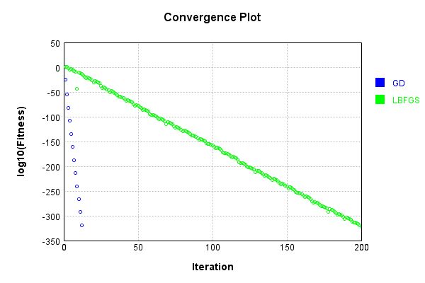
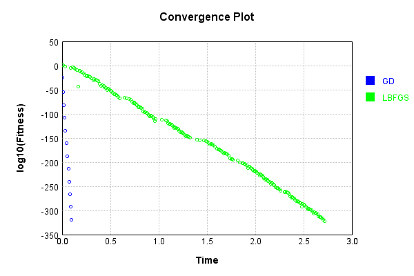

# BinarySumLayer
## Double_Add
### Json Serialization
Code from [JsonTest.java:36](../../../../../../../../src/main/java/com/simiacryptus/mindseye/test/unit/JsonTest.java#L36) executed in 0.00 seconds: 
```java
    JsonObject json = layer.getJson();
    NNLayer echo = NNLayer.fromJson(json);
    if ((echo == null)) throw new AssertionError("Failed to deserialize");
    if ((layer == echo)) throw new AssertionError("Serialization did not copy");
    if ((!layer.equals(echo))) throw new AssertionError("Serialization not equal");
    return new GsonBuilder().setPrettyPrinting().create().toJson(json);
```

Returns: 

```
    {
      "class": "com.simiacryptus.mindseye.layers.cudnn.BinarySumLayer",
      "id": "cafdb95d-7ae7-410f-9bc1-3227120b8674",
      "isFrozen": false,
      "name": "BinarySumLayer/cafdb95d-7ae7-410f-9bc1-3227120b8674",
      "rightFactor": 1.0,
      "leftFactor": 1.0,
      "precision": "Double"
    }
```


### Example Input/Output Pair
Code from [ReferenceIO.java:68](../../../../../../../../src/main/java/com/simiacryptus/mindseye/test/unit/ReferenceIO.java#L68) executed in 0.01 seconds: 
```java
    SimpleEval eval = SimpleEval.run(layer, inputPrototype);
    return String.format("--------------------\nInput: \n[%s]\n--------------------\nOutput: \n%s\n--------------------\nDerivative: \n%s",
      Arrays.stream(inputPrototype).map(t -> t.prettyPrint()).reduce((a, b) -> a + ",\n" + b).get(),
      eval.getOutput().prettyPrint(),
      Arrays.stream(eval.getDerivative()).map(t -> t.prettyPrint()).reduce((a, b) -> a + ",\n" + b).get());
```

Returns: 

```
    --------------------
    Input: 
    [[
    	[ [ -0.472 ], [ 0.632 ] ],
    	[ [ -0.608 ], [ -1.916 ] ]
    ],
    [
    	[ [ -1.492 ], [ 1.628 ] ],
    	[ [ -1.296 ], [ 1.708 ] ]
    ]]
    --------------------
    Output: 
    [
    	[ [ -1.964 ], [ 2.26 ] ],
    	[ [ -1.904 ], [ -0.20799999999999996 ] ]
    ]
    --------------------
    Derivative: 
    [
    	[ [ 1.0 ], [ 1.0 ] ],
    	[ [ 1.0 ], [ 1.0 ] ]
    ],
    [
    	[ [ 1.0 ], [ 1.0 ] ],
    	[ [ 1.0 ], [ 1.0 ] ]
    ]
```


[GPU Log](etc/cuda.log)

### Batch Execution
Code from [BatchingTester.java:66](../../../../../../../../src/main/java/com/simiacryptus/mindseye/test/unit/BatchingTester.java#L66) executed in 0.01 seconds: 
```java
    return test(reference, inputPrototype);
```

Returns: 

```
    ToleranceStatistics{absoluteTol=0.0000e+00 +- 0.0000e+00 [0.0000e+00 - 0.0000e+00] (120#), relativeTol=0.0000e+00 +- 0.0000e+00 [0.0000e+00 - 0.0000e+00] (120#)}
```


Code from [SingleDerivativeTester.java:77](../../../../../../../../src/main/java/com/simiacryptus/mindseye/test/unit/SingleDerivativeTester.java#L77) executed in 0.02 seconds: 
```java
    return test(component, inputPrototype);
```
Logging: 
```
    Inputs: [
    	[ [ 1.248 ], [ -0.568 ] ],
    	[ [ 0.72 ], [ 1.148 ] ]
    ],
    [
    	[ [ -1.868 ], [ -1.556 ] ],
    	[ [ -0.168 ], [ 1.188 ] ]
    ]
    Inputs Statistics: {meanExponent=-0.058040673612338216, negative=1, min=1.148, max=1.148, mean=0.637, count=4.0, positive=3, stdDev=0.7234217303896806, zeros=0},
    {meanExponent=-0.059121953270304436, negative=3, min=1.188, max=1.188, mean=-0.601, count=4.0, positive=1, stdDev=1.215043620616149, zeros=0}
    Output: [
    	[ [ -0.6200000000000001 ], [ -2.124 ] ],
    	[ [ 0.5519999999999999 ], [ 2.336 ] ]
    ]
    Outputs Statistics: {meanExponent=0.057489529519311536, negative=2, min=2.336, max=2.336, mean=0.03599999999999992, count=4.0, positive=2, stdDev=1.631884799855676, zeros=0}
    Feedback for input 0
    Inputs Values: [
    	[ [ 1.248 ], [ -0.568 ] ],
    	[ [ 0.72 ], [ 1.148 ] ]
    ]
    Value Statistics: {meanExponent=-0.058040673612338216, negative=1, min=1.148, max=1.148, mean=0.637, count=4.0, positive=3, stdDev=0.7234217303896806, zeros=0}
    Implemented Feedback: [ [ 1.0, 0.0, 0.0, 0.0 ], [ 0.0, 1.0, 0.0, 0.
```
...[skipping 1467 bytes](etc/47.txt)...
```
    , positive=4, stdDev=0.4330127018922193, zeros=12}
    Measured Feedback: [ [ 0.9999999999998899, 0.0, 0.0, 0.0 ], [ 0.0, 0.9999999999998899, 0.0, 0.0 ], [ 0.0, 0.0, 1.0000000000021103, 0.0 ], [ 0.0, 0.0, 0.0, 1.0000000000021103 ] ]
    Measured Statistics: {meanExponent=4.343330909351157E-13, negative=0, min=1.0000000000021103, max=1.0000000000021103, mean=0.25000000000025, count=16.0, positive=4, stdDev=0.4330127018926524, zeros=12}
    Feedback Error: [ [ -1.1013412404281553E-13, 0.0, 0.0, 0.0 ], [ 0.0, -1.1013412404281553E-13, 0.0, 0.0 ], [ 0.0, 0.0, 2.1103119252074976E-12, 0.0 ], [ 0.0, 0.0, 0.0, 2.1103119252074976E-12 ] ]
    Error Statistics: {meanExponent=-12.316865722463364, negative=2, min=2.1103119252074976E-12, max=2.1103119252074976E-12, mean=2.5002222514558525E-13, count=16.0, positive=2, stdDev=7.040469659775596E-13, zeros=12}
    Finite-Difference Derivative Accuracy:
    absoluteTol: 2.7756e-13 +- 6.9365e-13 [0.0000e+00 - 2.1103e-12] (32#)
    relativeTol: 5.5511e-13 +- 5.0004e-13 [5.5067e-14 - 1.0552e-12] (8#)
    
```

Returns: 

```
    ToleranceStatistics{absoluteTol=2.7756e-13 +- 6.9365e-13 [0.0000e+00 - 2.1103e-12] (32#), relativeTol=5.5511e-13 +- 5.0004e-13 [5.5067e-14 - 1.0552e-12] (8#)}
```


### Performance
Now we execute larger-scale runs to benchmark performance:

Code from [PerformanceTester.java:66](../../../../../../../../src/main/java/com/simiacryptus/mindseye/test/unit/PerformanceTester.java#L66) executed in 0.30 seconds: 
```java
    test(component, inputPrototype);
```
Logging: 
```
    100 batches
    Input Dimensions:
    	[100, 100, 1]
    	[100, 100, 1]
    Performance:
    	Evaluation performance: 0.011020s +- 0.001117s [0.009975s - 0.013120s]
    	Learning performance: 0.036322s +- 0.010492s [0.027373s - 0.055060s]
    
```

### Input Learning
In this test, we use a network to learn this target input, given it's pre-evaluated output:

Code from [LearningTester.java:127](../../../../../../../../src/main/java/com/simiacryptus/mindseye/test/unit/LearningTester.java#L127) executed in 0.01 seconds: 
```java
    return Arrays.stream(input_target).map(x -> x.prettyPrint()).reduce((a, b) -> a + "\n" + b).orElse("");
```

Returns: 

```
    [
    	[ [ 0.476 ], [ 1.932 ], [ -1.34 ], [ -0.008 ], [ -1.744 ], [ -1.148 ], [ -0.976 ], [ -1.488 ], ... ],
    	[ [ -1.3 ], [ 1.056 ], [ -0.48 ], [ 0.452 ], [ -1.152 ], [ -0.84 ], [ 1.18 ], [ 0.448 ], ... ],
    	[ [ -0.712 ], [ -1.84 ], [ -1.716 ], [ -1.616 ], [ -0.624 ], [ -1.792 ], [ -0.452 ], [ 1.188 ], ... ],
    	[ [ -0.504 ], [ 1.868 ], [ 1.256 ], [ 1.636 ], [ 0.076 ], [ -0.852 ], [ -1.408 ], [ -1.204 ], ... ],
    	[ [ -1.044 ], [ -0.096 ], [ 0.136 ], [ 1.812 ], [ 1.94 ], [ -0.256 ], [ 1.8 ], [ 1.796 ], ... ],
    	[ [ 1.452 ], [ -0.416 ], [ 1.82 ], [ -1.916 ], [ -1.732 ], [ -1.224 ], [ -0.156 ], [ 0.664 ], ... ],
    	[ [ 0.256 ], [ 1.824 ], [ -0.496 ], [ -1.848 ], [ -0.196 ], [ -1.288 ], [ 1.44 ], [ 0.62 ], ... ],
    	[ [ -0.004 ], [ -0.976 ], [ -0.528 ], [ 1.544 ], [ -0.068 ], [ -0.504 ], [ -1.324 ], [ 1.48 ], ... ],
    	...
    ]
    [
    	[ [ -1.148 ], [ -1.532 ], [ -0.18 ], [ -1.08 ], [ -1.656 ], [ -1.868 ], [ 0.872 ], [ 1.616 ], ... ],
    	[ [ 1.944 ], [ 1.448 ], [ 1.548 ], [ -0.976 ], [ 0.144 ], [ -1.0 ], [ 0.936 ], [ -1.652 ], ... ],
    	[ [ -0.016 ], [ 1.388 ], [ -1.536 ], [ 0.904 ], [ 1.928 ], [ 0.496 ], [ 0.372 ], [ -1.388 ], ... ],
    	[ [ -1.404 ], [ 0.932 ], [ 1.204 ], [ -1.748 ], [ 1.168 ], [ 0.864 ], [ -1.904 ], [ 0.548 ], ... ],
    	[ [ -1.8 ], [ -1.048 ], [ 1.76 ], [ -1.608 ], [ 0.9 ], [ -0.896 ], [ -1.888 ], [ -0.848 ], ... ],
    	[ [ -1.332 ], [ 1.8 ], [ 0.528 ], [ -0.136 ], [ 1.516 ], [ -0.472 ], [ 1.472 ], [ -0.188 ], ... ],
    	[ [ 0.972 ], [ -0.428 ], [ 1.228 ], [ -0.928 ], [ 0.284 ], [ 1.496 ], [ 0.544 ], [ -1.624 ], ... ],
    	[ [ -1.88 ], [ 0.164 ], [ -0.268 ], [ 0.976 ], [ -0.548 ], [ 1.3 ], [ -1.552 ], [ 0.572 ], ... ],
    	...
    ]
```


First, we use a conjugate gradient descent method, which converges the fastest for purely linear functions.

Code from [LearningTester.java:300](../../../../../../../../src/main/java/com/simiacryptus/mindseye/test/unit/LearningTester.java#L300) executed in 0.19 seconds: 
```java
    return new IterativeTrainer(trainable)
      .setLineSearchFactory(label -> new QuadraticSearch())
      .setOrientation(new GradientDescent())
      .setMonitor(monitor)
      .setTimeout(30, TimeUnit.SECONDS)
      .setMaxIterations(250)
      .setTerminateThreshold(0)
      .run();
```
Logging: 
```
    Constructing line search parameters: GD
    F(0.0) = LineSearchPoint{point=PointSample{avg=8.01692862080002}, derivative=-0.012827085793280001}
    New Minimum: 8.01692862080002 > 8.01692862079872
    F(1.0E-10) = LineSearchPoint{point=PointSample{avg=8.01692862079872}, derivative=-0.012827085793278976}, delta = -1.3002932064409833E-12
    New Minimum: 8.01692862079872 > 8.01692862079103
    F(7.000000000000001E-10) = LineSearchPoint{point=PointSample{avg=8.01692862079103}, derivative=-0.012827085793272817}, delta = -8.990141964204668E-12
    New Minimum: 8.01692862079103 > 8.016928620737131
    F(4.900000000000001E-9) = LineSearchPoint{point=PointSample{avg=8.016928620737131}, derivative=-0.012827085793229718}, delta = -6.288836118528707E-11
    New Minimum: 8.016928620737131 > 8.016928620360014
    F(3.430000000000001E-8) = LineSearchPoint{point=PointSample{avg=8.016928620360014}, derivative=-0.012827085792928026}, delta = -4.4000536547628144E-10
    New Minimum: 8.016928620360014 > 8.016928617720218
    F(2.4010000000000004E-7) = LineSear
```
...[skipping 8168 bytes](etc/48.txt)...
```
    0; Orientation: 0.0003; Line Search: 0.0047
    Zero gradient: 1.0185960221140752E-161
    F(0.0) = LineSearchPoint{point=PointSample{avg=6.791E-320}, derivative=-1.04E-322}
    New Minimum: 6.791E-320 > 0.0
    F(1250.0000000000805) = LineSearchPoint{point=PointSample{avg=0.0}, derivative=0.0}, delta = -6.791E-320
    0.0 <= 6.791E-320
    F(625.0000000000402) = LineSearchPoint{point=PointSample{avg=1.6976E-320}, derivative=-5.9E-323}, delta = -5.0933E-320
    Left bracket at 625.0000000000402
    F(937.5000000000604) = LineSearchPoint{point=PointSample{avg=4.244E-321}, derivative=-2.0E-323}, delta = -6.3665E-320
    Left bracket at 937.5000000000604
    F(1093.7500000000705) = LineSearchPoint{point=PointSample{avg=1.06E-321}, derivative=-1.5E-323}, delta = -6.6847E-320
    Left bracket at 1093.7500000000705
    F(1171.8750000000755) = LineSearchPoint{point=PointSample{avg=2.67E-322}, derivative=0.0}, delta = -6.7643E-320
    2.67E-322 > 0.0
    Iteration 13 complete. Error: 0.0 Total: 249389646602254.3800; Orientation: 0.0003; Line Search: 0.0329
    
```

Returns: 

```
    0.0
```


Training Converged

Next, we run the same optimization using L-BFGS, which is nearly ideal for purely second-order or quadratic functions.

Code from [LearningTester.java:324](../../../../../../../../src/main/java/com/simiacryptus/mindseye/test/unit/LearningTester.java#L324) executed in 2.76 seconds: 
```java
    return new IterativeTrainer(trainable)
      .setLineSearchFactory(label -> new ArmijoWolfeSearch())
      .setOrientation(new LBFGS())
      .setMonitor(monitor)
      .setTimeout(30, TimeUnit.SECONDS)
      .setMaxIterations(250)
      .setTerminateThreshold(0)
      .run();
```
Logging: 
```
    LBFGS Accumulation History: 1 points
    Constructing line search parameters: GD
    th(0)=8.01692862080002;dx=-0.012827085793280001
    New Minimum: 8.01692862080002 > 7.989317317418248
    WOLFE (weak): th(2.154434690031884)=7.989317317418248; dx=-0.012804977698395954 delta=0.027611303381771535
    New Minimum: 7.989317317418248 > 7.961753644482972
    WOLFE (weak): th(4.308869380063768)=7.961753644482972; dx=-0.01278286960351191 delta=0.05517497631704771
    New Minimum: 7.961753644482972 > 7.851975257207587
    WOLFE (weak): th(12.926608140191302)=7.851975257207587; dx=-0.012694437223975725 delta=0.1649533635924323
    New Minimum: 7.851975257207587 > 7.3674033428846295
    WOLFE (weak): th(51.70643256076521)=7.3674033428846295; dx=-0.012296491516062895 delta=0.6495252779153899
    New Minimum: 7.3674033428846295 > 5.043653603343776
    END: th(258.53216280382605)=5.043653603343776; dx=-0.010174114407194474 delta=2.9732750174562437
    Iteration 1 complete. Error: 5.043653603343776 Total: 249389684166680.3400; Orientation: 0.0005; Line Search:
```
...[skipping 107166 bytes](etc/49.txt)...
```
     0.0077
    LBFGS Accumulation History: 1 points
    th(0)=4.0509307E-317;dx=-6.481E-320
    New Minimum: 4.0509307E-317 > 3.177733E-317
    WOLF (strong): th(2357.111348962417)=3.177733E-317; dx=5.7415E-320 delta=8.73198E-318
    New Minimum: 3.177733E-317 > 1.32335E-319
    END: th(1178.5556744812086)=1.32335E-319; dx=-3.705E-321 delta=4.037697E-317
    Iteration 199 complete. Error: 1.32335E-319 Total: 249392390572820.6200; Orientation: 0.0006; Line Search: 0.0085
    LBFGS Accumulation History: 1 points
    th(0)=1.32335E-319;dx=-2.1E-322
    Armijo: th(2539.12122923624)=1.40744E-319; dx=2.2E-322 delta=-8.41E-321
    New Minimum: 1.32335E-319 > 3.5E-323
    END: th(1269.56061461812)=3.5E-323; dx=0.0 delta=1.323E-319
    Iteration 200 complete. Error: 3.5E-323 Total: 249392401512571.6000; Orientation: 0.0006; Line Search: 0.0086
    LBFGS Accumulation History: 1 points
    th(0)=3.5E-323;dx=0.0 (ERROR: Starting derivative negative)
    Iteration 201 failed, aborting. Error: 3.5E-323 Total: 249392409134318.6000; Orientation: 0.0005; Line Search: 0.0053
    
```

Returns: 

```
    3.5E-323
```


Training Converged

Code from [LearningTester.java:96](../../../../../../../../src/main/java/com/simiacryptus/mindseye/test/unit/LearningTester.java#L96) executed in 0.01 seconds: 
```java
    return TestUtil.compare(runs);
```

Returns: 




Code from [LearningTester.java:99](../../../../../../../../src/main/java/com/simiacryptus/mindseye/test/unit/LearningTester.java#L99) executed in 0.00 seconds: 
```java
    return TestUtil.compareTime(runs);
```

Returns: 




