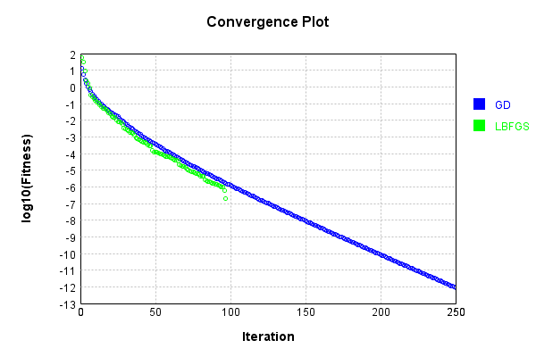
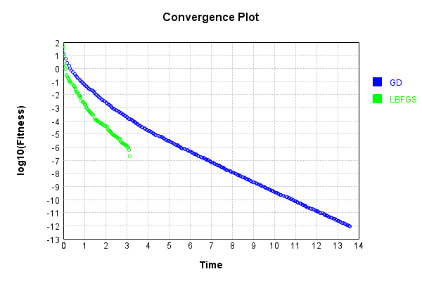
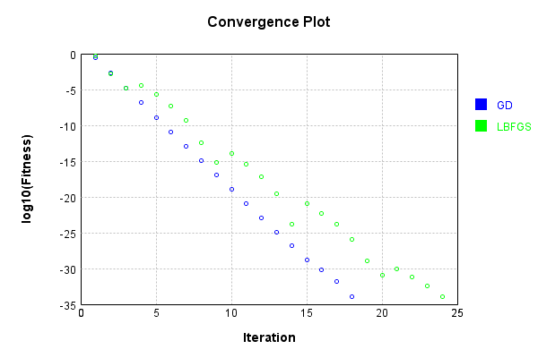
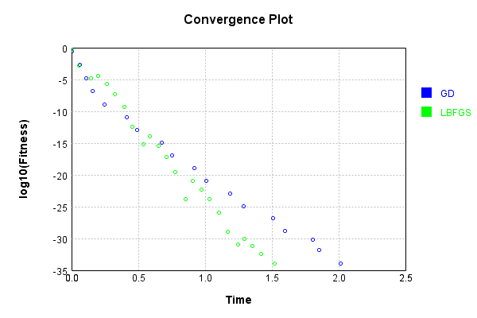
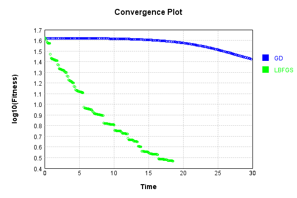

# ConvolutionLayer
## AsymmetricTest
### Json Serialization
Code from [JsonTest.java:36](../../../../../../../../src/main/java/com/simiacryptus/mindseye/test/unit/JsonTest.java#L36) executed in 0.00 seconds: 
```java
    JsonObject json = layer.getJson();
    NNLayer echo = NNLayer.fromJson(json);
    if ((echo == null)) throw new AssertionError("Failed to deserialize");
    if ((layer == echo)) throw new AssertionError("Serialization did not copy");
    if ((!layer.equals(echo))) throw new AssertionError("Serialization not equal");
    return new GsonBuilder().setPrettyPrinting().create().toJson(json);
```

Returns: 

```
    {
      "class": "com.simiacryptus.mindseye.layers.cudnn.ConvolutionLayer",
      "id": "16493fe1-a876-4f0d-88d3-b5b4d705e820",
      "isFrozen": false,
      "name": "ConvolutionLayer/16493fe1-a876-4f0d-88d3-b5b4d705e820",
      "filter": [
        [
          [
            -1.88,
            0.8,
            -0.884
          ],
          [
            -1.208,
            -0.812,
            1.488
          ],
          [
            -0.504,
            1.34,
            1.276
          ]
        ],
        [
          [
            1.272,
            0.244,
            -0.652
          ],
          [
            -0.424,
            -0.648,
            0.012
          ],
          [
            0.664,
            -1.272,
            -0.268
          ]
        ],
        [
          [
            -1.132,
            0.38,
            0.136
          ],
          [
            1.0,
            -1.852,
            -1.096
          ],
          [
            0.54,
            -1.212,
            -0.38
          ]
        ],
        [
          [
            -0.62,
            -1.724,
            -0.592
          ],
          [
            1.596,
            0.168,
            0.68
          ],
          [
            0.188,
            0.396,
            0.68
          ]
        ],
        [
          [
      
```
...[skipping 1777 bytes](etc/53.txt)...
```
        -1.16,
            -0.112,
            1.824
          ],
          [
            0.036,
            -0.24,
            -2.0
          ],
          [
            1.1,
            1.424,
            -1.772
          ]
        ],
        [
          [
            -1.86,
            0.076,
            -0.572
          ],
          [
            0.672,
            -1.172,
            -0.716
          ],
          [
            -0.868,
            -1.628,
            -0.712
          ]
        ],
        [
          [
            -1.96,
            1.824,
            1.504
          ],
          [
            1.444,
            0.528,
            1.6
          ],
          [
            -1.84,
            -1.032,
            1.54
          ]
        ],
        [
          [
            -0.468,
            0.268,
            -0.432
          ],
          [
            0.716,
            -0.664,
            -0.516
          ],
          [
            0.836,
            -0.66,
            0.528
          ]
        ],
        [
          [
            -1.956,
            0.472,
            -1.08
          ],
          [
            0.392,
            1.156,
            0.944
          ],
          [
            0.3,
            0.212,
            1.744
          ]
        ]
      ],
      "strideX": 1,
      "strideY": 1,
      "precision": "Double"
    }
```


### Example Input/Output Pair
Code from [ReferenceIO.java:68](../../../../../../../../src/main/java/com/simiacryptus/mindseye/test/unit/ReferenceIO.java#L68) executed in 0.01 seconds: 
```java
    SimpleEval eval = SimpleEval.run(layer, inputPrototype);
    return String.format("--------------------\nInput: \n[%s]\n--------------------\nOutput: \n%s\n--------------------\nDerivative: \n%s",
      Arrays.stream(inputPrototype).map(t -> t.prettyPrint()).reduce((a, b) -> a + ",\n" + b).get(),
      eval.getOutput().prettyPrint(),
      Arrays.stream(eval.getDerivative()).map(t -> t.prettyPrint()).reduce((a, b) -> a + ",\n" + b).get());
```

Returns: 

```
    --------------------
    Input: 
    [[
    	[ [ -0.904, -1.448, -0.868 ], [ 0.564, 0.188, -0.112 ], [ 0.516, -0.76, -1.532 ], [ 0.644, -0.288, -1.6 ], [ -1.736, 0.028, 0.196 ] ],
    	[ [ 0.712, 0.104, 1.22 ], [ -0.192, 0.128, 1.716 ], [ -1.9, -0.952, -0.072 ], [ -1.46, 0.836, -1.56 ], [ 0.4, 0.948, 0.732 ] ],
    	[ [ -0.392, 0.188, -1.228 ], [ -0.704, -1.456, -0.304 ], [ 0.272, -0.804, 0.972 ], [ 1.004, 1.796, -1.384 ], [ 1.076, 0.928, 1.72 ] ],
    	[ [ 0.276, 0.896, -0.508 ], [ 0.136, 1.008, -1.192 ], [ -1.344, 0.552, -1.712 ], [ -0.668, 0.568, -1.304 ], [ 0.716, 0.06, -1.216 ] ],
    	[ [ 0.832, -1.012, -1.708 ], [ -0.088, -0.484, -0.412 ], [ -0.532, 0.888, -0.084 ], [ 1.964, -1.716, 0.844 ], [ 1.468, 0.236, -0.896 ] ]
    ]]
    --------------------
    Output: 
    [
    	[ [ 4.55336, -4.130336, 3.9177600000000004, -3.960544, 0.6527839999999997, -4.067088 ], [ 1.3916479999999982, 2.7469280000000005, 3.4650079999999996, 1.3896479999999993, 3.476272, -0.6792159999999996 ], [ 2.7098079999999984, -1.4482240000000004, 1.39128, -8.15704, 3.32524800000000
```
...[skipping 2764 bytes](etc/54.txt)...
```
    000000000012 ], [ -4.895999999999999, 6.256, -2.024 ], [ -4.895999999999999, 6.256, -2.024000000000001 ], [ -4.896, 6.256, -2.024000000000001 ], [ -5.728000000000001, 2.4720000000000004, 0.09600000000000009 ] ],
    	[ [ -1.1520000000000001, 11.268, 0.376000000000003 ], [ -4.895999999999999, 6.256, -2.023999999999999 ], [ -4.895999999999999, 6.256, -2.024000000000002 ], [ -4.896, 6.256, -2.024000000000001 ], [ -5.728000000000001, 2.4720000000000004, 0.09600000000000009 ] ],
    	[ [ -1.1519999999999997, 11.268, 0.37600000000000033 ], [ -4.895999999999999, 6.256, -2.0239999999999974 ], [ -4.896, 6.256, -2.024000000000001 ], [ -4.896, 6.256, -2.024000000000001 ], [ -5.728000000000001, 2.4720000000000004, 0.0959999999999992 ] ],
    	[ [ -2.3440000000000003, 5.828, 0.6359999999999999 ], [ -3.2679999999999993, 2.4479999999999995, -3.4640000000000013 ], [ -3.2680000000000002, 2.448, -3.4640000000000004 ], [ -3.2679999999999993, 2.448, -3.4640000000000013 ], [ -1.2120000000000002, 0.41200000000000037, -1.1720000000000006 ] ]
    ]
```


[GPU Log](etc/cuda.log)

### Batch Execution
Code from [BatchingTester.java:66](../../../../../../../../src/main/java/com/simiacryptus/mindseye/test/unit/BatchingTester.java#L66) executed in 0.04 seconds: 
```java
    return test(reference, inputPrototype);
```

Returns: 

```
    ToleranceStatistics{absoluteTol=2.8224e-17 +- 1.8909e-16 [0.0000e+00 - 2.6645e-15] (2250#), relativeTol=6.1752e-18 +- 6.3555e-17 [0.0000e+00 - 2.3622e-15] (2250#)}
```


Code from [SingleDerivativeTester.java:77](../../../../../../../../src/main/java/com/simiacryptus/mindseye/test/unit/SingleDerivativeTester.java#L77) executed in 1.40 seconds: 
```java
    return test(component, inputPrototype);
```
Logging: 
```
    Inputs: [
    	[ [ -0.492, 1.66, 1.692 ], [ -0.78, -1.94, -1.532 ], [ -0.568, -1.472, -0.948 ], [ -1.156, -0.62, 0.684 ], [ 1.368, 0.304, 0.028 ] ],
    	[ [ -1.672, 0.052, -0.22 ], [ 1.432, -0.36, -1.572 ], [ 0.872, 1.724, -0.336 ], [ 0.2, -0.184, -0.236 ], [ -0.056, -0.424, -0.688 ] ],
    	[ [ 0.472, 0.988, -0.664 ], [ 0.348, -1.7, -1.672 ], [ 0.952, 0.136, -0.652 ], [ 1.08, -1.188, -1.68 ], [ -1.032, -0.9, -1.376 ] ],
    	[ [ -0.62, 0.34, 0.148 ], [ -1.136, -0.2, 1.216 ], [ 0.504, -0.976, -0.876 ], [ 1.676, -0.14, -0.388 ], [ -1.248, -1.924, -1.424 ] ],
    	[ [ -0.64, -0.364, 1.48 ], [ -1.936, -0.272, -1.536 ], [ 1.588, 1.408, 1.3 ], [ 1.808, 1.36, -1.728 ], [ 0.5, -0.96, -1.684 ] ]
    ]
    Inputs Statistics: {meanExponent=-0.15243721899156065, negative=46, min=-1.684, max=-1.684, mean=-0.2246933333333333, count=75.0, positive=29, stdDev=1.0906869514006095, zeros=0}
    Output: [
    	[ [ -3.832432, 7.928143999999999, -4.205871999999999, 1.641584, -3.7042559999999995, 9.205872 ], [ -0.5718720000000003, -3.9133760000000004, 3.714671999
```
...[skipping 9846 bytes](etc/55.txt)...
```
    183551752074E-12, ... ], [ 5.836220395849523E-12, -3.6706193640156926E-12, 2.5002222514558525E-13, 2.1554980023097414E-12, -6.400435736964027E-13, -2.4453772340393698E-12, 1.2101430968414206E-12, -1.095235013792717E-12, ... ], [ 0.0, 1.3953282973488967E-12, 7.702727344849336E-13, 2.5002222514558525E-13, -6.494804694057166E-14, 0.0, -2.4453772340393698E-12, -7.671641100159832E-12, ... ], [ 0.0, 0.0, 0.0, 0.0, 0.0, 7.702727344849336E-13, 2.5002222514558525E-13, 2.1554980023097414E-12, ... ], [ 0.0, 0.0, 0.0, 0.0, 0.0, -3.0455638011517294E-12, 7.702727344849336E-13, 2.5002222514558525E-13, ... ], ... ]
    Error Statistics: {meanExponent=-11.760711221279402, negative=1653, min=1.3267720255782933E-11, max=1.3267720255782933E-11, mean=-2.7072714212175183E-14, count=24300.0, positive=1389, stdDev=1.6146953461480056E-12, zeros=21258}
    Finite-Difference Derivative Accuracy:
    absoluteTol: 5.2302e-13 +- 1.7574e-12 [0.0000e+00 - 2.9761e-11] (35550#)
    relativeTol: 4.6286e-12 +- 1.7610e-11 [9.5316e-15 - 6.6201e-10] (6084#)
    
```

Returns: 

```
    ToleranceStatistics{absoluteTol=5.2302e-13 +- 1.7574e-12 [0.0000e+00 - 2.9761e-11] (35550#), relativeTol=4.6286e-12 +- 1.7610e-11 [9.5316e-15 - 6.6201e-10] (6084#)}
```


### Reference Implementation
Code from [EquivalencyTester.java:61](../../../../../../../../src/main/java/com/simiacryptus/mindseye/test/unit/EquivalencyTester.java#L61) executed in 0.00 seconds: 
```java
    System.out.println(new GsonBuilder().setPrettyPrinting().create().toJson(this.reference.getJson()));
```
Logging: 
```
    {
      "class": "com.simiacryptus.mindseye.layers.aparapi.ConvolutionLayer",
      "id": "1e7b9e7f-dd6e-4df8-8eae-f1a29d94e5e8",
      "isFrozen": false,
      "name": "ConvolutionLayer/1e7b9e7f-dd6e-4df8-8eae-f1a29d94e5e8",
      "filter": [
        [
          [
            -1.88,
            0.8,
            -0.884
          ],
          [
            -1.208,
            -0.812,
            1.488
          ],
          [
            -0.504,
            1.34,
            1.276
          ]
        ],
        [
          [
            1.272,
            0.244,
            -0.652
          ],
          [
            -0.424,
            -0.648,
            0.012
          ],
          [
            0.664,
            -1.272,
            -0.268
          ]
        ],
        [
          [
            -1.132,
            0.38,
            0.136
          ],
          [
            1.0,
            -1.852,
            -1.096
          ],
          [
            0.54,
            -1.212,
            -0.38
          ]
        ],
        [
          [
            -0.62,
            -1.724,
            -0.592
          ],
          [
            1.596,
            0.168,
            0.68
          ],
          [
            0.188,
            0.396,
            0.68
          ]
        ],
        [
          [
```
...[skipping 1781 bytes](etc/56.txt)...
```
      -1.16,
            -0.112,
            1.824
          ],
          [
            0.036,
            -0.24,
            -2.0
          ],
          [
            1.1,
            1.424,
            -1.772
          ]
        ],
        [
          [
            -1.86,
            0.076,
            -0.572
          ],
          [
            0.672,
            -1.172,
            -0.716
          ],
          [
            -0.868,
            -1.628,
            -0.712
          ]
        ],
        [
          [
            -1.96,
            1.824,
            1.504
          ],
          [
            1.444,
            0.528,
            1.6
          ],
          [
            -1.84,
            -1.032,
            1.54
          ]
        ],
        [
          [
            -0.468,
            0.268,
            -0.432
          ],
          [
            0.716,
            -0.664,
            -0.516
          ],
          [
            0.836,
            -0.66,
            0.528
          ]
        ],
        [
          [
            -1.956,
            0.472,
            -1.08
          ],
          [
            0.392,
            1.156,
            0.944
          ],
          [
            0.3,
            0.212,
            1.744
          ]
        ]
      ],
      "skip": [
        [
          0.0
        ]
      ],
      "simple": true
    }
    
```

Code from [EquivalencyTester.java:64](../../../../../../../../src/main/java/com/simiacryptus/mindseye/test/unit/EquivalencyTester.java#L64) executed in 0.02 seconds: 
```java
    return test(subject, inputPrototype);
```
Logging: 
```
    Inputs: [
    	[ [ 1.352, -1.74, 1.872 ], [ 1.94, 1.636, 1.08 ], [ -0.976, 0.312, -0.744 ], [ 1.412, 1.416, 0.388 ], [ -0.044, 1.548, -0.828 ] ],
    	[ [ -0.66, -1.052, 1.332 ], [ 1.252, 1.736, -1.192 ], [ 1.092, -0.268, -1.208 ], [ 1.464, 0.456, 1.368 ], [ -0.5, 1.352, -1.552 ] ],
    	[ [ 1.936, -0.252, -1.168 ], [ 0.992, 1.808, 1.652 ], [ 1.068, -0.42, 1.588 ], [ -0.796, 1.996, -1.392 ], [ -1.748, 0.46, -1.06 ] ],
    	[ [ -1.588, 0.744, -0.668 ], [ -0.472, 1.232, 1.492 ], [ -1.872, -1.3, 1.588 ], [ 0.228, 1.644, 1.108 ], [ -0.848, 0.52, -1.896 ] ],
    	[ [ -0.796, -0.848, 0.052 ], [ -0.34, 0.584, -0.232 ], [ -0.432, -0.056, 1.788 ], [ 1.576, -0.852, -1.344 ], [ 0.748, -1.588, -0.124 ] ]
    ]
    Error: [
    	[ [ 0.0, 0.0, 0.0, 0.0, 0.0, 0.0 ], [ 0.0, 0.0, 0.0, 0.0, 0.0, 0.0 ], [ 0.0, 0.0, 0.0, 0.0, 0.0, 0.0 ], [ 0.0, 0.0, 0.0, 0.0, 0.0, 0.0 ], [ 0.0, 0.0, 0.0, 0.0, 0.0, 0.0 ] ],
    	[ [ 0.0, 0.0, 0.0, 0.0, 0.0, 0.0 ], [ 0.0, 0.0, 0.0, 0.0, 0.0, 0.0 ], [ 0.0, 0.0, 0.0, 0.0, 0.0, 0.0 ], [ 0.0, 0.0, 0.0, 0.0, 0.0, 0.0 ], [ 0.0, 0.0, 0.0, 0.0, 0.0, 0.0 ] ],
    	[ [ 0.0, 0.0, 0.0, 0.0, 0.0, 0.0 ], [ 0.0, 0.0, 0.0, 0.0, 0.0, 0.0 ], [ 0.0, 0.0, 0.0, 0.0, 0.0, 0.0 ], [ 0.0, 0.0, 0.0, 0.0, 0.0, 0.0 ], [ 0.0, 0.0, 0.0, 0.0, 0.0, 0.0 ] ],
    	[ [ 0.0, 0.0, 0.0, 0.0, 0.0, 0.0 ], [ 0.0, 0.0, 0.0, 0.0, 0.0, 0.0 ], [ 0.0, 0.0, 0.0, 0.0, 0.0, 0.0 ], [ 0.0, 0.0, 0.0, 0.0, 0.0, 0.0 ], [ 0.0, 0.0, 0.0, 0.0, 0.0, 0.0 ] ],
    	[ [ 0.0, 0.0, 0.0, 0.0, 0.0, 0.0 ], [ 0.0, 0.0, 0.0, 0.0, 0.0, 0.0 ], [ 0.0, 0.0, 0.0, 0.0, 0.0, 0.0 ], [ 0.0, 0.0, 0.0, 0.0, 0.0, 0.0 ], [ 0.0, 0.0, 0.0, 0.0, 0.0, 0.0 ] ]
    ]
    Accuracy:
    absoluteTol: 0.0000e+00 +- 0.0000e+00 [0.0000e+00 - 0.0000e+00] (150#)
    relativeTol: 0.0000e+00 +- 0.0000e+00 [0.0000e+00 - 0.0000e+00] (150#)
    
```

Returns: 

```
    ToleranceStatistics{absoluteTol=0.0000e+00 +- 0.0000e+00 [0.0000e+00 - 0.0000e+00] (150#), relativeTol=0.0000e+00 +- 0.0000e+00 [0.0000e+00 - 0.0000e+00] (150#)}
```


### Performance
Now we execute larger-scale runs to benchmark performance:

Code from [PerformanceTester.java:66](../../../../../../../../src/main/java/com/simiacryptus/mindseye/test/unit/PerformanceTester.java#L66) executed in 2.06 seconds: 
```java
    test(component, inputPrototype);
```
Logging: 
```
    100 batches
    Input Dimensions:
    	[100, 100, 3]
    Performance:
    	Evaluation performance: 0.079975s +- 0.022437s [0.053124s - 0.108498s]
    	Learning performance: 0.261456s +- 0.035311s [0.213525s - 0.295795s]
    
```

### Input Learning
In this test, we use a network to learn this target input, given it's pre-evaluated output:

Code from [LearningTester.java:127](../../../../../../../../src/main/java/com/simiacryptus/mindseye/test/unit/LearningTester.java#L127) executed in 0.01 seconds: 
```java
    return Arrays.stream(input_target).map(x -> x.prettyPrint()).reduce((a, b) -> a + "\n" + b).orElse("");
```

Returns: 

```
    [
    	[ [ 0.432, -0.172, -1.5 ], [ -0.164, -0.052, -1.472 ], [ -0.572, -1.532, 0.072 ], [ -0.052, -1.592, 0.024 ], [ -0.8, -1.692, 0.196 ], [ -1.756, -1.336, 0.428 ], [ -0.428, 1.312, 1.728 ], [ 1.128, 1.236, 1.908 ], ... ],
    	[ [ 0.428, 1.176, 1.444 ], [ -0.848, 0.812, 1.204 ], [ -1.488, 1.844, 0.848 ], [ -0.8, 1.696, 1.396 ], [ 0.388, -0.512, 0.608 ], [ -0.188, -1.584, -1.348 ], [ 1.348, 0.932, -1.764 ], [ 0.88, 0.632, 0.656 ], ... ],
    	[ [ -1.944, -1.94, 1.692 ], [ 0.984, 1.672, 0.164 ], [ -0.68, 1.864, 1.716 ], [ -1.656, 1.576, -0.316 ], [ -0.948, 0.264, -0.88 ], [ -1.768, 1.928, -0.768 ], [ 0.236, -0.928, 0.068 ], [ -1.62, -1.924, 0.048 ], ... ],
    	[ [ -1.076, 0.784, -1.532 ], [ -0.336, 0.78, 1.7 ], [ -0.228, 1.188, 0.044 ], [ -0.68, -1.876, 1.94 ], [ -0.412, 1.344, 1.68 ], [ -0.976, 1.22, -0.108 ], [ -0.268, -0.492, 1.064 ], [ 0.344, 1.904, 0.38 ], ... ],
    	[ [ -0.476, -1.02, -0.08 ], [ 0.336, 0.124, -0.164 ], [ 0.296, -0.448, -0.58 ], [ 0.628, -0.412, 1.708 ], [ -0.7, -0.164, -0.472 ], [ -0.512, -0.324, -0.448 ], [ 0.884, -0.284, -1.14 ], [ -0.468, -1.972, 1.692 ], ... ],
    	[ [ -1.468, 1.712, -0.656 ], [ -1.084, -1.016, -1.216 ], [ -1.464, -0.468, -0.08 ], [ -1.044, -0.388, -0.584 ], [ -0.892, -0.608, 1.82 ], [ 0.084, -0.908, -0.428 ], [ -1.168, -1.092, 0.232 ], [ 1.384, -1.828, -0.844 ], ... ],
    	[ [ -1.428, -1.144, 1.576 ], [ 0.956, 1.22, 0.28 ], [ -1.736, 0.868, -0.284 ], [ -1.4, 0.928, -0.484 ], [ 0.336, 1.636, -1.22 ], [ -1.284, 0.46, 1.656 ], [ 0.62, 1.992, -1.628 ], [ -1.708, 0.636, -0.388 ], ... ],
    	[ [ 1.9, -0.44, -1.16 ], [ 0.416, 0.412, 1.656 ], [ -1.824, -0.312, 0.664 ], [ 1.888, 1.408, -1.728 ], [ 1.632, 1.852, 1.8 ], [ 1.584, 0.304, 1.408 ], [ -1.44, -0.716, -1.336 ], [ -1.064, -1.272, 0.976 ], ... ],
    	...
    ]
```


First, we use a conjugate gradient descent method, which converges the fastest for purely linear functions.

Code from [LearningTester.java:300](../../../../../../../../src/main/java/com/simiacryptus/mindseye/test/unit/LearningTester.java#L300) executed in 13.73 seconds: 
```java
    return new IterativeTrainer(trainable)
      .setLineSearchFactory(label -> new QuadraticSearch())
      .setOrientation(new GradientDescent())
      .setMonitor(monitor)
      .setTimeout(30, TimeUnit.SECONDS)
      .setMaxIterations(250)
      .setTerminateThreshold(0)
      .run();
```
Logging: 
```
    Constructing line search parameters: GD
    F(0.0) = LineSearchPoint{point=PointSample{avg=81.63191635827054}, derivative=-0.47796553575745304}
    New Minimum: 81.63191635827054 > 81.63191635822255
    F(1.0E-10) = LineSearchPoint{point=PointSample{avg=81.63191635822255}, derivative=-0.47796553575728495}, delta = -4.7990056373237167E-11
    New Minimum: 81.63191635822255 > 81.63191635793513
    F(7.000000000000001E-10) = LineSearchPoint{point=PointSample{avg=81.63191635793513}, derivative=-0.4779655357562764}, delta = -3.354188038429129E-10
    New Minimum: 81.63191635793513 > 81.63191635592692
    F(4.900000000000001E-9) = LineSearchPoint{point=PointSample{avg=81.63191635592692}, derivative=-0.47796553574921685}, delta = -2.343625737921684E-9
    New Minimum: 81.63191635592692 > 81.63191634187558
    F(3.430000000000001E-8) = LineSearchPoint{point=PointSample{avg=81.63191634187558}, derivative=-0.4779655356997997}, delta = -1.6394963608945545E-8
    New Minimum: 81.63191634187558 > 81.6319162435097
    F(2.4010000000000004E-7) = LineSearch
```
...[skipping 294783 bytes](etc/57.txt)...
```
    457E-13 Total: 249411024347643.0300; Orientation: 0.0009; Line Search: 0.0512
    Low gradient: 1.4481266610875173E-8
    F(0.0) = LineSearchPoint{point=PointSample{avg=9.786273621390457E-13}, derivative=-2.0970708265524811E-16}
    New Minimum: 9.786273621390457E-13 > 9.40633862599787E-13
    F(208.1199229979371) = LineSearchPoint{point=PointSample{avg=9.40633862599787E-13}, derivative=-1.5540452237480166E-16}, delta = -3.7993499539258706E-14
    F(1456.8394609855598) = LineSearchPoint{point=PointSample{avg=9.500032032024762E-13}, derivative=1.7041083932727235E-16}, delta = -2.862415893656945E-14
    9.500032032024762E-13 <= 9.786273621390457E-13
    New Minimum: 9.40633862599787E-13 > 8.943541492567415E-13
    F(803.72309641947) = LineSearchPoint{point=PointSample{avg=8.943541492567415E-13}, derivative=-6.565993934602311E-27}, delta = -8.42732128823042E-14
    Left bracket at 803.72309641947
    Converged to left
    Iteration 250 complete. Error: 8.943541492567415E-13 Total: 249411062552700.9700; Orientation: 0.0009; Line Search: 0.0325
    
```

Returns: 

```
    8.943541492567415E-13
```


Training Converged

Next, we run the same optimization using L-BFGS, which is nearly ideal for purely second-order or quadratic functions.

Code from [LearningTester.java:324](../../../../../../../../src/main/java/com/simiacryptus/mindseye/test/unit/LearningTester.java#L324) executed in 3.22 seconds: 
```java
    return new IterativeTrainer(trainable)
      .setLineSearchFactory(label -> new ArmijoWolfeSearch())
      .setOrientation(new LBFGS())
      .setMonitor(monitor)
      .setTimeout(30, TimeUnit.SECONDS)
      .setMaxIterations(250)
      .setTerminateThreshold(0)
      .run();
```
Logging: 
```
    LBFGS Accumulation History: 1 points
    Constructing line search parameters: GD
    th(0)=81.63191635827054;dx=-0.47796553575745304
    New Minimum: 81.63191635827054 > 80.60607174720981
    WOLFE (weak): th(2.154434690031884)=80.60607174720981; dx=-0.47434424258611996 delta=1.0258446110607338
    New Minimum: 80.60607174720981 > 79.58802897578059
    WOLFE (weak): th(4.308869380063768)=79.58802897578059; dx=-0.4707229494147868 delta=2.043887382489956
    New Minimum: 79.58802897578059 > 75.5938762863758
    WOLFE (weak): th(12.926608140191302)=75.5938762863758; dx=-0.45623777672945437 delta=6.038040071894741
    New Minimum: 75.5938762863758 > 59.164953431012
    END: th(51.70643256076521)=59.164953431012; dx=-0.3910544996454584 delta=22.466962927258542
    Iteration 1 complete. Error: 59.164953431012 Total: 249411134029270.9400; Orientation: 0.0017; Line Search: 0.0404
    LBFGS Accumulation History: 1 points
    th(0)=59.164953431012;dx=-0.32179561848095606
    New Minimum: 59.164953431012 > 29.973898846792146
    END: th(111.39813200670669)=29.9738
```
...[skipping 47731 bytes](etc/58.txt)...
```
    31E-7; dx=-1.7843397837537322E-10 delta=1.3495239971287965E-7
    New Minimum: 8.541774141150231E-7 > 6.146323005344693E-7
    END: th(2183.874168832529)=6.146323005344693E-7; dx=-1.5063046636132366E-10 delta=3.7449751329343344E-7
    Iteration 96 complete. Error: 6.146323005344693E-7 Total: 249414251172769.7800; Orientation: 0.0015; Line Search: 0.0281
    LBFGS Accumulation History: 1 points
    th(0)=6.146323005344693E-7;dx=-1.1836056638171376E-10
    New Minimum: 6.146323005344693E-7 > 1.9597967448463826E-7
    END: th(4705.014267997348)=1.9597967448463826E-7; dx=-5.95996276595394E-11 delta=4.1865262604983106E-7
    Iteration 97 complete. Error: 1.9597967448463826E-7 Total: 249414272668119.7500; Orientation: 0.0016; Line Search: 0.0150
    LBFGS Accumulation History: 1 points
    th(0)=1.9597967448463826E-7;dx=-1.4552323556880492E-10
    MAX ALPHA: th(0)=1.9597967448463826E-7;th'(0)=-1.4552323556880492E-10;
    Iteration 98 failed, aborting. Error: 1.9597967448463826E-7 Total: 249414293341876.7200; Orientation: 0.0016; Line Search: 0.0134
    
```

Returns: 

```
    1.9597967448463826E-7
```


Training Converged

Code from [LearningTester.java:96](../../../../../../../../src/main/java/com/simiacryptus/mindseye/test/unit/LearningTester.java#L96) executed in 0.00 seconds: 
```java
    return TestUtil.compare(runs);
```

Returns: 




Code from [LearningTester.java:99](../../../../../../../../src/main/java/com/simiacryptus/mindseye/test/unit/LearningTester.java#L99) executed in 0.00 seconds: 
```java
    return TestUtil.compareTime(runs);
```

Returns: 




### Model Learning
In this test, attempt to train a network to emulate a randomized network given an example input/output. The target state is:

Code from [LearningTester.java:176](../../../../../../../../src/main/java/com/simiacryptus/mindseye/test/unit/LearningTester.java#L176) executed in 0.00 seconds: 
```java
    return network_target.state().stream().map(Arrays::toString).reduce((a, b) -> a + "\n" + b).orElse("");
```

Returns: 

```
    [1.036, 1.988, -1.852, -0.96, 0.392, 1.444, -0.036, -0.812, -1.64, 1.54, -1.724, 0.836, -0.912, 0.68, -1.96, 0.86, 1.34, -0.652, 0.228, 1.488, 0.136, 0.936, 1.596, 0.188, -1.096, -0.652, 0.54, -0.264, -0.592, 0.472, 1.644, -0.424, 0.592, -0.38, 0.484, 0.38, -0.664, -1.632, 0.396, -1.156, 0.672, 1.144, 0.716, -1.032, 0.552, -1.796, -1.128, -0.392, 1.0, 1.272, -1.88, -0.2, -0.648, 1.824, -0.716, -1.172, 0.168, -0.112, -0.724, 1.204, -1.792, -1.108, -1.112, -1.628, 1.612, 1.744, 0.256, 0.148, 0.268, -0.588, 0.332, 0.528, -1.548, 0.212, 0.332, 1.748, -2.0, 0.3, -1.212, 0.152, 1.948, -0.468, 0.992, 0.512, -1.272, -0.984, 1.824, 0.016, -0.704, 0.68, -1.96, 1.684, -0.66, -1.16, 0.792, -1.08, -0.808, -1.772, 1.292, 0.784, 0.252, 0.24, 1.888, -1.02, -0.24, 0.22, -1.78, 1.316, 1.62, 1.708, 1.704, -1.1, 0.864, -0.572, -0.788, -1.208, 1.276, -0.128, 0.528, -1.84, -1.716, 0.012, 1.504, -0.032, 1.556, 0.456, -0.132, 0.32, -1.408, -1.956, -0.424, 0.424, 1.152, 0.84, -0.268, 1.156, -0.432, -0.056, -1.86, -1.272, -0.868, 0.944, -0.18, 0.196, -0.516, 1.704, -1.132, -0.628, 1.1, -0.712, 0.664, 0.036, 0.076, 0.108, -0.884, 0.8, 1.424, -1.16, 0.244, -0.62, -0.504, 1.6]
```


First, we use a conjugate gradient descent method, which converges the fastest for purely linear functions.

Code from [LearningTester.java:300](../../../../../../../../src/main/java/com/simiacryptus/mindseye/test/unit/LearningTester.java#L300) executed in 2.44 seconds: 
```java
    return new IterativeTrainer(trainable)
      .setLineSearchFactory(label -> new QuadraticSearch())
      .setOrientation(new GradientDescent())
      .setMonitor(monitor)
      .setTimeout(30, TimeUnit.SECONDS)
      .setMaxIterations(250)
      .setTerminateThreshold(0)
      .run();
```
Logging: 
```
    Constructing line search parameters: GD
    F(0.0) = LineSearchPoint{point=PointSample{avg=76.86679154384329}, derivative=-67.97526120632419}
    New Minimum: 76.86679154384329 > 76.8667915370456
    F(1.0E-10) = LineSearchPoint{point=PointSample{avg=76.8667915370456}, derivative=-67.97526120330662}, delta = -6.7976912987433025E-9
    New Minimum: 76.8667915370456 > 76.86679149625986
    F(7.000000000000001E-10) = LineSearchPoint{point=PointSample{avg=76.86679149625986}, derivative=-67.9752611852005}, delta = -4.7583426976416376E-8
    New Minimum: 76.86679149625986 > 76.86679121076466
    F(4.900000000000001E-9) = LineSearchPoint{point=PointSample{avg=76.86679121076466}, derivative=-67.97526105845775}, delta = -3.33078631342687E-7
    New Minimum: 76.86679121076466 > 76.86678921229147
    F(3.430000000000001E-8) = LineSearchPoint{point=PointSample{avg=76.86678921229147}, derivative=-67.9752601712587}, delta = -2.331551826273426E-6
    New Minimum: 76.86678921229147 > 76.86677522298375
    F(2.4010000000000004E-7) = LineSearchPoint{point=Poi
```
...[skipping 19626 bytes](etc/59.txt)...
```
    oint=PointSample{avg=1.116319218983386E-32}, derivative=2.0789822520714126E-34}, delta = -3.0017560995889737E-33
    1.116319218983386E-32 <= 1.4164948289422834E-32
    New Minimum: 3.6659434514762905E-33 > 1.2654643687920398E-34
    F(2.4953703761357513) = LineSearchPoint{point=PointSample{avg=1.2654643687920398E-34}, derivative=1.2662655534576162E-37}, delta = -1.403840185254363E-32
    Right bracket at 2.4953703761357513
    Converged to right
    Iteration 18 complete. Error: 1.2654643687920398E-34 Total: 249416827344071.3400; Orientation: 0.0001; Line Search: 0.1428
    Zero gradient: 9.635198145505956E-19
    F(0.0) = LineSearchPoint{point=PointSample{avg=1.2654643687920398E-34}, derivative=-9.283704330316142E-37}
    New Minimum: 1.2654643687920398E-34 > 0.0
    F(2.4953703761357513) = LineSearchPoint{point=PointSample{avg=0.0}, derivative=0.0}, delta = -1.2654643687920398E-34
    0.0 <= 1.2654643687920398E-34
    Converged to right
    Iteration 19 complete. Error: 0.0 Total: 249416873739978.2000; Orientation: 0.0001; Line Search: 0.0310
    
```

Returns: 

```
    0.0
```


Training Converged

Next, we run the same optimization using L-BFGS, which is nearly ideal for purely second-order or quadratic functions.

Code from [LearningTester.java:324](../../../../../../../../src/main/java/com/simiacryptus/mindseye/test/unit/LearningTester.java#L324) executed in 1.65 seconds: 
```java
    return new IterativeTrainer(trainable)
      .setLineSearchFactory(label -> new ArmijoWolfeSearch())
      .setOrientation(new LBFGS())
      .setMonitor(monitor)
      .setTimeout(30, TimeUnit.SECONDS)
      .setMaxIterations(250)
      .setTerminateThreshold(0)
      .run();
```
Logging: 
```
    LBFGS Accumulation History: 1 points
    Constructing line search parameters: GD
    th(0)=82.16168082830765;dx=-72.41543410590172
    New Minimum: 82.16168082830765 > 0.4861743329419838
    END: th(2.154434690031884)=0.4861743329419838; dx=-3.405389679809537 delta=81.67550649536567
    Iteration 1 complete. Error: 0.4861743329419838 Total: 249416954560989.1200; Orientation: 0.0001; Line Search: 0.0361
    LBFGS Accumulation History: 1 points
    th(0)=0.4861743329419838;dx=-0.40511728419970233
    New Minimum: 0.4861743329419838 > 0.4276709805935954
    WOLF (strong): th(4.641588833612779)=0.4276709805935954; dx=0.37990895384319695 delta=0.05850335234838844
    New Minimum: 0.4276709805935954 > 0.0014515291936688113
    END: th(2.3207944168063896)=0.0014515291936688113; dx=-0.012604165178252785 delta=0.484722803748315
    Iteration 2 complete. Error: 0.0014515291936688113 Total: 249417013869837.0300; Orientation: 0.0001; Line Search: 0.0449
    LBFGS Accumulation History: 1 points
    th(0)=0.0014515291936688113;dx=-0.0012257555112965995
    Armijo: th
```
...[skipping 11071 bytes](etc/60.txt)...
```
    n: 0.0001; Line Search: 0.0457
    LBFGS Accumulation History: 1 points
    th(0)=4.069002070237651E-33;dx=-5.007444325831705E-35
    New Minimum: 4.069002070237651E-33 > 3.8194015494450656E-33
    WOLF (strong): th(4.709502797067904)=3.8194015494450656E-33; dx=4.033275769207784E-35 delta=2.4960052079258565E-34
    New Minimum: 3.8194015494450656E-33 > 1.2654643687920398E-34
    WOLF (strong): th(2.354751398533952)=1.2654643687920398E-34; dx=5.390852901766713E-37 delta=3.9424556333584476E-33
    END: th(0.7849171328446506)=2.1301298766241333E-33; dx=-2.686918347280562E-35 delta=1.938872193613518E-33
    Iteration 24 complete. Error: 1.2654643687920398E-34 Total: 249418472738619.6200; Orientation: 0.0001; Line Search: 0.0842
    LBFGS Accumulation History: 1 points
    th(0)=2.1301298766241333E-33;dx=-1.8283242683130612E-35
    New Minimum: 2.1301298766241333E-33 > 0.0
    END: th(1.6910526998008797)=0.0; dx=0.0 delta=2.1301298766241333E-33
    Iteration 25 complete. Error: 0.0 Total: 249418524287220.5300; Orientation: 0.0001; Line Search: 0.0343
    
```

Returns: 

```
    0.0
```


Training Converged

Code from [LearningTester.java:96](../../../../../../../../src/main/java/com/simiacryptus/mindseye/test/unit/LearningTester.java#L96) executed in 0.01 seconds: 
```java
    return TestUtil.compare(runs);
```

Returns: 




Code from [LearningTester.java:99](../../../../../../../../src/main/java/com/simiacryptus/mindseye/test/unit/LearningTester.java#L99) executed in 0.00 seconds: 
```java
    return TestUtil.compareTime(runs);
```

Returns: 




### Composite Learning
In this test, attempt to train a network to emulate a randomized network given an example input/output. The target state is:

Code from [LearningTester.java:219](../../../../../../../../src/main/java/com/simiacryptus/mindseye/test/unit/LearningTester.java#L219) executed in 0.00 seconds: 
```java
    return network_target.state().stream().map(Arrays::toString).reduce((a, b) -> a + "\n" + b).orElse("");
```

Returns: 

```
    [-0.628, 0.54, -0.788, -1.172, 0.332, -0.704, -0.036, 1.596, 0.592, 1.488, -1.272, -1.112, -0.648, -1.108, -2.0, 0.168, -0.812, 1.036, 0.472, -0.128, -0.24, 1.6, 0.012, -1.628, 0.992, 0.076, -1.212, -0.66, -1.64, -0.724, 1.424, 1.704, 1.34, 0.936, 0.396, 1.62, 0.528, -0.868, -1.86, 1.316, -1.408, -0.588, -1.16, -0.652, -1.956, 0.456, 0.252, 0.664, -0.716, -0.056, -0.504, 1.612, 0.136, 0.84, 0.196, -1.272, -0.264, 1.888, 0.188, -0.884, -0.132, -0.516, -0.432, 1.556, -0.912, -1.96, 0.864, 0.036, 1.144, -1.1, 0.484, 0.108, 1.152, -1.548, -0.96, 0.944, -1.88, -1.724, -1.852, 0.228, -0.62, -0.808, -1.632, 0.212, -0.424, 1.824, 0.68, -1.096, 1.272, 0.784, -0.984, 0.152, 0.148, 0.424, -0.268, -0.112, 0.3, 1.704, 0.792, -0.712, 1.948, 1.0, 1.1, 1.708, -1.128, -1.78, -1.16, 0.68, -1.772, 1.204, -0.664, -1.796, 0.22, 0.716, -0.468, -1.08, 1.644, -1.792, -1.02, 0.332, 0.672, 0.016, 0.86, 1.444, 0.512, 0.392, -1.032, 1.988, 1.504, -0.392, -1.208, 1.276, 0.32, 0.528, 1.54, 1.292, -0.652, -0.18, -0.592, -0.032, 1.824, 1.748, -0.572, 1.744, 0.244, -0.38, 1.156, -1.84, -0.424, 0.268, 0.552, 0.836, -1.96, -1.716, 0.24, 0.38, -1.132, 1.684, 0.8, -0.2, -1.156, 0.256]
```


We simultaneously regress this target input:

Code from [LearningTester.java:223](../../../../../../../../src/main/java/com/simiacryptus/mindseye/test/unit/LearningTester.java#L223) executed in 0.01 seconds: 
```java
    return Arrays.stream(testInput).map(x -> x.prettyPrint()).reduce((a, b) -> a + "\n" + b).orElse("");
```

Returns: 

```
    [
    	[ [ -1.648, 0.42, -0.84 ], [ -0.98, 1.224, -0.46 ], [ 0.48, -1.632, -1.476 ], [ -1.696, 0.496, -0.5 ], [ 0.952, -1.088, -0.056 ], [ 0.032, 1.22, 0.48 ], [ -0.9, -1.928, 0.224 ], [ 0.656, -0.284, 1.724 ], ... ],
    	[ [ -1.66, -0.988, -1.688 ], [ 0.012, -1.508, -1.28 ], [ -0.316, 1.976, -1.272 ], [ 0.004, 1.888, -0.364 ], [ 1.896, 1.404, -0.176 ], [ 0.844, -0.468, -0.672 ], [ -0.184, 0.808, 0.004 ], [ -1.852, -1.704, -0.952 ], ... ],
    	[ [ 1.38, 0.88, 0.112 ], [ 1.56, -1.852, -0.9 ], [ -1.828, 1.976, 1.18 ], [ 0.74, -1.556, 1.724 ], [ 0.132, -0.24, -1.896 ], [ -0.36, 1.832, 0.916 ], [ 0.628, -1.104, 0.576 ], [ -1.476, 0.144, 0.908 ], ... ],
    	[ [ 0.608, 1.34, 1.084 ], [ 1.32, -0.156, -0.76 ], [ -1.324, -1.272, -0.528 ], [ 0.276, -0.812, 1.708 ], [ -1.944, 1.88, 1.404 ], [ 0.644, 0.12, -0.1 ], [ -0.732, 1.74, 1.664 ], [ -0.776, -0.756, 0.016 ], ... ],
    	[ [ 0.744, 1.86, -1.76 ], [ -1.272, 0.016, -0.776 ], [ 1.432, 0.64, 0.396 ], [ 0.44, -1.792, 1.412 ], [ 1.476, 1.44, 1.764 ], [ 1.372, -1.676, -1.208 ], [ -0.392, 1.404, -0.188 ], [ -0.868, 1.848, -1.216 ], ... ],
    	[ [ 1.532, 1.564, 0.868 ], [ 0.584, 0.892, 0.88 ], [ -0.888, 0.028, 1.672 ], [ 0.368, 1.284, 1.064 ], [ -0.596, 1.58, 0.144 ], [ 0.96, 1.808, -0.62 ], [ -1.528, -0.952, -0.492 ], [ -1.784, 0.268, -0.312 ], ... ],
    	[ [ -0.832, 1.816, 1.616 ], [ 0.008, 0.912, 0.984 ], [ -1.812, 0.612, -0.84 ], [ 1.584, -1.912, -1.972 ], [ -1.652, -1.616, 0.488 ], [ -1.9, 0.468, 0.176 ], [ -0.64, 1.464, -1.24 ], [ -1.936, 1.26, 0.372 ], ... ],
    	[ [ -0.708, 1.98, -1.092 ], [ -1.984, -1.316, 1.216 ], [ -0.408, 1.912, -0.684 ], [ -1.64, -0.052, -1.06 ], [ -0.492, -1.236, 1.656 ], [ 1.796, 0.14, -1.44 ], [ -0.616, 1.696, 0.916 ], [ 0.32, 1.904, -1.884 ], ... ],
    	...
    ]
```


Which produces the following output:

Code from [LearningTester.java:230](../../../../../../../../src/main/java/com/simiacryptus/mindseye/test/unit/LearningTester.java#L230) executed in 0.02 seconds: 
```java
    return Stream.of(targetOutput).map(x -> x.prettyPrint()).reduce((a, b) -> a + "\n" + b).orElse("");
```

Returns: 

```
    [
    	[ [ 1.7839359999999997, 1.480016, -5.816016, -3.494528, 5.455807999999999, 6.710304000000001 ], [ 1.679424, 5.700735999999999, -0.5193919999999997, -1.2607039999999996, 2.238384, -1.9482399999999997 ], [ 3.8759679999999994, 7.219119999999998, 10.07992, -1.4883359999999999, 4.110048000000001, 0.17907200000000065 ], [ 8.408848, 2.433935999999999, 0.23251199999999916, -10.637424000000001, -1.5218560000000003, 0.7524959999999992 ], [ -2.045440000000001, -2.380288, 2.2779039999999995, -4.011792000000001, 5.000431999999998, -0.7581759999999999 ], [ 4.1527519999999996, -0.5440639999999997, 1.7028959999999993, 6.966064, -3.3117920000000005, -0.01424000000000016 ], [ 5.678224000000002, -3.787232, 7.761296000000001, -4.613440000000001, 1.949824, 0.5410560000000003 ], [ 3.737008, -7.860575999999999, -6.857952000000002, -2.4107680000000005, -6.181423999999999, -0.6064640000000006 ], ... ],
    	[ [ 0.31238400000000033, 7.028127999999998, 5.4466079999999994, -2.8741600000000003, 10.143168000000001, -4.168063999999999 ], [ 
```
...[skipping 5047 bytes](etc/61.txt)...
```
    99, 2.810879999999999, 10.018608 ], [ 2.04352, -3.8275840000000008, -0.8571840000000007, -1.6954560000000007, 16.393455999999997, -1.441296 ], ... ],
    	[ [ 2.995999999999999, 6.534687999999999, -0.10735999999999914, 9.035024, 4.644304, 0.9200319999999995 ], [ -1.6117599999999999, -0.4535039999999994, -3.2503519999999995, 0.7264320000000006, 9.351792000000001, -0.32702400000000126 ], [ -3.414672, 11.251968, -8.149455999999999, 0.10732800000000021, -6.932352, 1.3283199999999995 ], [ -2.2914399999999997, 1.4884480000000004, 7.447856, -6.204847999999999, 14.894464, -12.517600000000002 ], [ -2.412608, -3.8300800000000006, -2.353616, -2.2947519999999995, 6.39496, 1.6134399999999993 ], [ -2.2355039999999997, 0.8283999999999996, 1.1265439999999987, -10.148976000000001, -8.159648, -0.5400640000000018 ], [ 2.3898240000000013, 3.1912, -8.705952, 1.3150880000000018, 9.885728000000002, 6.900543999999999 ], [ -0.583424, 8.978432, 4.4794719999999995, -0.1429920000000004, 6.898207999999999, -7.795663999999998 ], ... ],
    	...
    ]
```


First, we use a conjugate gradient descent method, which converges the fastest for purely linear functions.

Code from [LearningTester.java:300](../../../../../../../../src/main/java/com/simiacryptus/mindseye/test/unit/LearningTester.java#L300) executed in 30.13 seconds: 
```java
    return new IterativeTrainer(trainable)
      .setLineSearchFactory(label -> new QuadraticSearch())
      .setOrientation(new GradientDescent())
      .setMonitor(monitor)
      .setTimeout(30, TimeUnit.SECONDS)
      .setMaxIterations(250)
      .setTerminateThreshold(0)
      .run();
```
Logging: 
```
    Constructing line search parameters: GD
    F(0.0) = LineSearchPoint{point=PointSample{avg=84.05906773583136}, derivative=-37.39529068024217}
    New Minimum: 84.05906773583136 > 84.05906773209328
    F(1.0E-10) = LineSearchPoint{point=PointSample{avg=84.05906773209328}, derivative=-37.39529067856214}, delta = -3.738080067705596E-9
    New Minimum: 84.05906773209328 > 84.05906770965525
    F(7.000000000000001E-10) = LineSearchPoint{point=PointSample{avg=84.05906770965525}, derivative=-37.395290668481884}, delta = -2.6176110168307787E-8
    New Minimum: 84.05906770965525 > 84.05906755259457
    F(4.900000000000001E-9) = LineSearchPoint{point=PointSample{avg=84.05906755259457}, derivative=-37.395290597920095}, delta = -1.832367928500389E-7
    New Minimum: 84.05906755259457 > 84.05906645317458
    F(3.430000000000001E-8) = LineSearchPoint{point=PointSample{avg=84.05906645317458}, derivative=-37.3952901039876}, delta = -1.2826567825641177E-6
    New Minimum: 84.05906645317458 > 84.05905875722348
    F(2.4010000000000004E-7) = LineSearchPoint{po
```
...[skipping 271366 bytes](etc/62.txt)...
```
    83}, delta = 4.792295071723331
    F(2.1495380425832065) = LineSearchPoint{point=PointSample{avg=26.61627623787945}, derivative=-0.03414603742404375}, delta = -0.11346829378161871
    F(15.046766298082446) = LineSearchPoint{point=PointSample{avg=27.620249695266686}, derivative=0.1899856028066551}, delta = 0.8905051636056172
    F(1.1574435613909573) = LineSearchPoint{point=PointSample{avg=26.658688626664393}, derivative=-0.05135408966154534}, delta = -0.07105590499667613
    F(8.1021049297367) = LineSearchPoint{point=PointSample{avg=26.72049055594171}, derivative=0.06918747330117875}, delta = -0.009253975719360596
    26.72049055594171 <= 26.72974453166107
    New Minimum: 26.582810958134935 > 26.58267426320515
    F(4.115542914705259) = LineSearchPoint{point=PointSample{avg=26.58267426320515}, derivative=-3.443004306571268E-5}, delta = -0.14707026845591997
    Left bracket at 4.115542914705259
    Converged to left
    Iteration 250 complete. Error: 26.58267426320515 Total: 249448800827940.3800; Orientation: 0.0008; Line Search: 0.1535
    
```

Returns: 

```
    26.58267426320515
```


This training run resulted in the following configuration:

Code from [LearningTester.java:245](../../../../../../../../src/main/java/com/simiacryptus/mindseye/test/unit/LearningTester.java#L245) executed in 0.01 seconds: 
```java
    return network_gd.state().stream().map(Arrays::toString).reduce((a, b) -> a + "\n" + b).orElse("");
```

Returns: 

```
    [0.7388054925263272, -0.07720247761666922, 0.024680683324860873, 1.2325913231371322, -0.48371908187946333, -0.08664955568196692, 0.13012769846375694, 0.07557792408017892, -0.46433641669309483, 0.6843251690296613, -0.12234566480554104, 0.06320149261195333, -0.14444427741538146, -0.0789692484345146, 0.6777133229210793, -1.0360385831586378, 0.3451626747542295, -0.4090008434951195, 0.8639116461139893, -1.1842394205958044, -1.0415236124893013, -0.17970921019712674, -0.8010629251101151, -0.26763587286479407, -0.6604115206984378, 0.3869495035776174, -0.6492923410316417, -1.0882444927565071, -0.2184718125713607, 0.40414158597525907, -0.1631699338840936, 0.6156001764524576, -0.39072536180952083, -0.654224047650495, 0.2674119868305441, -0.9969240074785974, -0.41857921038601614, -0.281187964441702, -0.05957320827337453, 0.3327986252499086, 0.8231901865524144, 0.05270970159228738, 0.3160716214906494, -0.08453391843995092, 0.9081884721847562, 0.2079821075811735, 1.1240012238808983, -0.1628937023201613, 0.8873124393273562,
```
...[skipping 1049632 bytes](etc/63.txt)...
```
    99996, -0.0026559999999996673, 6.403776, 5.331887999999998, -0.3683359999999991, -1.8062239999999998, -4.279552000000001, 4.772543999999998, -0.25190399999999885, 6.672912, -1.7380160000000007, -9.085488000000002, -8.089568, -3.6642400000000004, 0.5534560000000008, 4.577327999999999, 1.087808, -4.183615999999999, -5.931231999999999, -1.7237599999999995, 1.642735999999999, -13.682527999999998, -4.935823999999999, 0.6465439999999992, -5.462736, 0.80056, -0.07425600000000007, 2.9085919999999996, 7.287935999999999, -0.0862079999999998, -4.654112, 5.521248000000001, 3.9156000000000004, -0.6881440000000004, -5.0195039999999995, -11.934911999999999, 0.20670399999999994, -0.4470400000000001, 0.6342560000000004, 1.6345120000000009, 5.194463999999998, 6.249840000000001, 7.063536, -3.0532959999999982, 3.6041600000000003, 3.770832000000001, -2.2199840000000006, 1.768448, -0.6064000000000002, -0.9362400000000007, -2.143040000000001, 1.0974239999999997, -13.68808, 2.26496, -7.87736, -3.4944799999999994, 3.3630399999999994]
```


And regressed input:

Code from [LearningTester.java:249](../../../../../../../../src/main/java/com/simiacryptus/mindseye/test/unit/LearningTester.java#L249) executed in 0.01 seconds: 
```java
    return Arrays.stream(input_gd).map(x -> x.prettyPrint()).reduce((a, b) -> a + "\n" + b).orElse("");
```

Returns: 

```
    [
    	[ [ -1.4571582199214121, 1.7768334223851265, 0.9293201024684142 ], [ 1.5962689817263602, 0.6955854660485528, 0.7907481932845201 ], [ 1.052902779968977, -1.4520910918556602, -1.9222110542292106 ], [ 0.30942207873371946, 0.17641868600292435, 0.8036750229728623 ], [ 0.8538830435775008, -0.7027489369887635, -1.0070599583738122 ], [ -1.0792445279689846, -1.2057879989186007, 1.4721411337061625 ], [ -1.6689188564608453, 1.3439749815238213, 1.0013425361250081 ], [ 0.834736510085562, -0.7371193775472785, 0.5393769498019703 ], ... ],
    	[ [ -0.8192399060485596, -0.5947406431308015, 0.7838062274625804 ], [ -0.7127351104856701, -1.8317878583250746, -1.7709209139597768 ], [ -0.3010575382417137, -0.26830439214239055, -0.16184297061920394 ], [ 1.1074981355070188, -0.9626670433417617, -2.663767431983644 ], [ -1.0212980624831267, -0.6818699481996352, -0.15892153773069403 ], [ 0.7035680766892543, 0.22699088072139342, -0.3808067208551126 ], [ 1.4110534872431009, 1.147833447074285, -0.7108775746767039 ], [ 1.262965065540632, -0
```
...[skipping 2250 bytes](etc/64.txt)...
```
    87607895736 ], [ -0.30740920704791497, -0.34017826994055606, -0.9667272696716623 ], [ 0.3837890921315762, -0.3108497992936374, -1.1685219128589208 ], [ 1.349984293035894, -0.36085905453566797, 0.6854995375994112 ], [ -2.4756848149271202, -2.079699563923818, 0.4369900511694378 ], [ 1.4158046206803603, 1.1448678527983498, 0.6917968433264542 ], [ -0.9845834769240567, 1.1913826022792613, 1.1625564163866275 ], [ -0.531422789830964, -0.21703700392683367, 2.5086919248138773 ], ... ],
    	[ [ 1.5964461104247485, 1.2723301010981611, -0.22651011253993342 ], [ -0.6418911868533362, 0.9349224429596525, -0.961711084399291 ], [ -0.6638004023570424, -0.17997618611619906, 0.21243504888610754 ], [ -0.5354376884434341, 0.47959502202684706, 0.2596661695662753 ], [ -0.11174646566547497, -0.9273493371085367, -0.31375495444914986 ], [ 1.3107710424459287, 1.1147426787686667, -0.6892752705424698 ], [ 1.378690718413057, -1.073612309742433, -1.2033219212108763 ], [ 1.1992464565662915, -1.2463203688350022, 2.03047698750836 ], ... ],
    	...
    ]
```


Which produces the following output:

Code from [LearningTester.java:256](../../../../../../../../src/main/java/com/simiacryptus/mindseye/test/unit/LearningTester.java#L256) executed in 0.00 seconds: 
```java
    return Stream.of(regressedOutput).map(x -> x.prettyPrint()).reduce((a, b) -> a + "\n" + b).orElse("");
```

Returns: 

```
    [ 26.58267426320515 ]
```


Next, we run the same optimization using L-BFGS, which is nearly ideal for purely second-order or quadratic functions.

Code from [LearningTester.java:324](../../../../../../../../src/main/java/com/simiacryptus/mindseye/test/unit/LearningTester.java#L324) executed in 18.59 seconds: 
```java
    return new IterativeTrainer(trainable)
      .setLineSearchFactory(label -> new ArmijoWolfeSearch())
      .setOrientation(new LBFGS())
      .setMonitor(monitor)
      .setTimeout(30, TimeUnit.SECONDS)
      .setMaxIterations(250)
      .setTerminateThreshold(0)
      .run();
```
Logging: 
```
    LBFGS Accumulation History: 1 points
    Constructing line search parameters: GD
    th(0)=84.05906773583136;dx=-37.39529068024217
    New Minimum: 84.05906773583136 > 41.98776134769091
    END: th(2.154434690031884)=41.98776134769091; dx=-1.8892451923385671 delta=42.07130638814045
    Iteration 1 complete. Error: 41.98776134769091 Total: 249448913512385.1600; Orientation: 0.0015; Line Search: 0.0297
    LBFGS Accumulation History: 1 points
    th(0)=41.98776134769091;dx=-0.17556049486567246
    New Minimum: 41.98776134769091 > 41.949321858578294
    WOLF (strong): th(4.641588833612779)=41.949321858578294; dx=0.15896243579512195 delta=0.038439489112619185
    New Minimum: 41.949321858578294 > 41.77445189135679
    END: th(2.3207944168063896)=41.77445189135679; dx=-0.008272790553903236 delta=0.21330945633412313
    Iteration 2 complete. Error: 41.77445189135679 Total: 249448974040940.1000; Orientation: 0.0015; Line Search: 0.0461
    LBFGS Accumulation History: 1 points
    th(0)=41.77445189135679;dx=-0.001121892861146144
    New Minimum: 41.774451891356
```
...[skipping 138157 bytes](etc/65.txt)...
```
    n: 0.0015; Line Search: 0.0608
    LBFGS Accumulation History: 1 points
    th(0)=2.9504308252966527;dx=-0.0010761057868095103
    New Minimum: 2.9504308252966527 > 2.947892089270285
    END: th(3.4623037731593316)=2.947892089270285; dx=-3.904000649800809E-4 delta=0.0025387360263677827
    Iteration 249 complete. Error: 2.947892089270285 Total: 249467357200351.7000; Orientation: 0.0015; Line Search: 0.0300
    LBFGS Accumulation History: 1 points
    th(0)=2.947892089270285;dx=-0.001705594257729808
    Armijo: th(7.459307356322746)=2.955480703550896; dx=0.0037401100897920996 delta=-0.007588614280610972
    New Minimum: 2.947892089270285 > 2.9466087490807613
    WOLF (strong): th(3.729653678161373)=2.9466087490807613; dx=0.001017373508056756 delta=0.0012833401895235852
    New Minimum: 2.9466087490807613 > 2.946335889790136
    END: th(1.2432178927204578)=2.946335889790136; dx=-7.979124569685159E-4 delta=0.0015561994801487344
    Iteration 250 complete. Error: 2.946335889790136 Total: 249467433484506.6600; Orientation: 0.0014; Line Search: 0.0615
    
```

Returns: 

```
    2.946335889790136
```


This training run resulted in the following configuration:

Code from [LearningTester.java:266](../../../../../../../../src/main/java/com/simiacryptus/mindseye/test/unit/LearningTester.java#L266) executed in 0.01 seconds: 
```java
    return network_lbfgs.state().stream().map(Arrays::toString).reduce((a, b) -> a + "\n" + b).orElse("");
```

Returns: 

```
    [0.9356316053170529, -0.9076360171208614, 0.19662555888398475, 1.9342257586734508, -0.7855422580738812, -0.4798681301219724, 0.6850170074714602, -0.06981659339313559, -1.0206536553840824, 0.8199124497321391, 0.899818919103257, 0.20301905635309853, -0.28620075671967693, -0.09908636687710934, 1.0780840965105494, -1.6918455361950329, 0.20825666445146493, -0.7686977718673957, 0.44905856010704004, -1.8144299287477508, -1.7194278647209609, -0.6744409143537266, -0.5180593556380174, -0.09112327519854474, -1.2520581815253375, -0.6317286434784574, -0.4581052402290119, -1.7317560224452277, -0.027402638054437864, 0.5622810731371357, 0.2568491979621475, 1.0430661254312712, -0.814363306149685, -0.8732593037411474, 0.5052673939142959, -1.367198907724475, -0.5636915825149662, 0.09873071350665913, 0.2268318775323453, 0.5234475570988899, 1.4692813791227664, 0.17707677888244677, 0.06578590694667516, -0.6462932570668806, 2.2657557051842336, 0.5629545452141071, 1.3626552866084223, 0.14228248308201516, 1.3882857537835576, -1.35124
```
...[skipping 1049614 bytes](etc/66.txt)...
```
    99996, -0.0026559999999996673, 6.403776, 5.331887999999998, -0.3683359999999991, -1.8062239999999998, -4.279552000000001, 4.772543999999998, -0.25190399999999885, 6.672912, -1.7380160000000007, -9.085488000000002, -8.089568, -3.6642400000000004, 0.5534560000000008, 4.577327999999999, 1.087808, -4.183615999999999, -5.931231999999999, -1.7237599999999995, 1.642735999999999, -13.682527999999998, -4.935823999999999, 0.6465439999999992, -5.462736, 0.80056, -0.07425600000000007, 2.9085919999999996, 7.287935999999999, -0.0862079999999998, -4.654112, 5.521248000000001, 3.9156000000000004, -0.6881440000000004, -5.0195039999999995, -11.934911999999999, 0.20670399999999994, -0.4470400000000001, 0.6342560000000004, 1.6345120000000009, 5.194463999999998, 6.249840000000001, 7.063536, -3.0532959999999982, 3.6041600000000003, 3.770832000000001, -2.2199840000000006, 1.768448, -0.6064000000000002, -0.9362400000000007, -2.143040000000001, 1.0974239999999997, -13.68808, 2.26496, -7.87736, -3.4944799999999994, 3.3630399999999994]
```


And regressed input:

Code from [LearningTester.java:270](../../../../../../../../src/main/java/com/simiacryptus/mindseye/test/unit/LearningTester.java#L270) executed in 0.01 seconds: 
```java
    return Arrays.stream(input_lbgfs).map(x -> x.prettyPrint()).reduce((a, b) -> a + "\n" + b).orElse("");
```

Returns: 

```
    [
    	[ [ 1.0142735885215144, 1.1768821540801997, 0.35335106462112365 ], [ 0.7403268861480169, 1.4866391798765923, -0.14453860698878684 ], [ 0.7960905493515583, -1.8589294348333927, -1.014403596954289 ], [ 0.6894456347880052, 1.8304022009983643, -0.1622135621908616 ], [ -0.28523905889389184, -2.129698676029292, -0.34639461655405446 ], [ 0.30570368946290355, 1.2596583190149189, 1.0782514733600097 ], [ -1.4766243860585118, -1.2726300427218817, 0.624224640853255 ], [ -0.8695194053166927, -0.02997908135385411, 1.344292420605466 ], ... ],
    	[ [ 1.8630378604666302, 1.0166054102172732, 0.5136459160956617 ], [ -0.11797177179681494, -2.344998715116053, -1.380803642966256 ], [ -0.17176737237362655, 2.581798562606271, -2.6009769106882104 ], [ -0.021861113722917283, 0.8804722079340388, -2.091320171130055 ], [ 1.3926430521879558, -0.604344112663253, -0.16434753341617223 ], [ -0.34980073168357584, -0.8081990833024928, -0.8890338676056655 ], [ 1.1367725039380998, 1.5461888088264715, 1.0549686850214843 ], [ 0.59057932742005, -0.
```
...[skipping 2216 bytes](etc/67.txt)...
```
    75, 1.3934239439649792 ], [ 0.1878940013639668, -0.49922420447110594, 1.0973805639123237 ], [ 3.138075463972056, 0.482113915794481, -0.487030454029937 ], [ 2.2093699909360254, -2.6158096349697906, 2.348653710750618 ], [ -1.9059782359879978, -1.5670472477994992, 0.520825888922009 ], [ 1.920711645331681, -0.07543787889059667, 0.20915859794795102 ], [ -0.2181586509443865, 1.8702291721811388, -0.718044975646494 ], [ 3.112749106557484, 2.3452141982784815, 2.6117080910746613 ], ... ],
    	[ [ 2.870167734657482, 1.507932965601924, 1.624860350477636 ], [ 0.07079515916032236, -1.9399800044170603, 0.9646365568925522 ], [ 0.8537545845460109, 1.899017318512399, -0.06607789833643544 ], [ -0.07970078505502846, 1.2654725234502828, 0.029241602084709543 ], [ -0.7318826236596323, 0.7223746066939044, -0.13146593677713161 ], [ -0.784867221261256, 0.06738206813119077, -1.8895691140581006 ], [ 0.47592887052447375, 0.08818963138471579, -0.7377024366817798 ], [ 1.4537915449309355, 0.8931977946252778, 0.7180945555973648 ], ... ],
    	...
    ]
```


Which produces the following output:

Code from [LearningTester.java:277](../../../../../../../../src/main/java/com/simiacryptus/mindseye/test/unit/LearningTester.java#L277) executed in 0.00 seconds: 
```java
    return Stream.of(regressedOutput).map(x -> x.prettyPrint()).reduce((a, b) -> a + "\n" + b).orElse("");
```

Returns: 

```
    [ 2.946335889790136 ]
```


Code from [LearningTester.java:96](../../../../../../../../src/main/java/com/simiacryptus/mindseye/test/unit/LearningTester.java#L96) executed in 0.00 seconds: 
```java
    return TestUtil.compare(runs);
```

Returns: 


Code from [LearningTester.java:99](../../../../../../../../src/main/java/com/simiacryptus/mindseye/test/unit/LearningTester.java#L99) executed in 0.00 seconds: 
```java
    return TestUtil.compareTime(runs);
```

Returns: 




