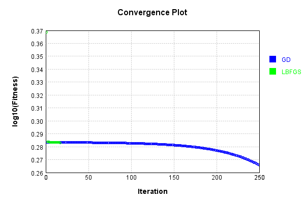
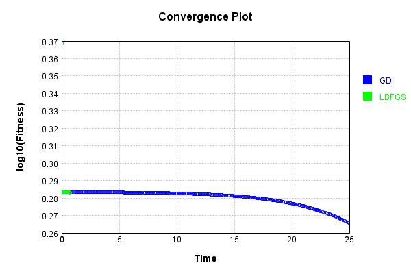

# ConvolutionLayer
## Double
### Batch Execution
Code from [BatchingTester.java:66](../../../../../../../../src/main/java/com/simiacryptus/mindseye/test/unit/BatchingTester.java#L66) executed in 0.02 seconds: 
```java
    return test(reference, inputPrototype);
```

Returns: 

```
    ToleranceStatistics{absoluteTol=0.0000e+00 +- 0.0000e+00 [0.0000e+00 - 0.0000e+00] (1000#), relativeTol=0.0000e+00 +- 0.0000e+00 [0.0000e+00 - 0.0000e+00] (1000#)}
```


Code from [SingleDerivativeTester.java:77](../../../../../../../../src/main/java/com/simiacryptus/mindseye/test/unit/SingleDerivativeTester.java#L77) executed in 0.18 seconds: 
```java
    return test(component, inputPrototype);
```
Logging: 
```
    Inputs: [
    	[ [ -0.972, -0.412 ], [ 0.424, 1.056 ], [ 1.352, 0.556 ], [ -0.436, 0.312 ], [ -1.1, 1.78 ] ],
    	[ [ 1.788, -1.96 ], [ -0.248, -0.308 ], [ -0.656, 0.608 ], [ 1.66, 1.328 ], [ -1.304, -0.836 ] ],
    	[ [ -1.448, -0.412 ], [ 0.948, 0.868 ], [ -0.168, -1.52 ], [ 0.888, 1.956 ], [ -1.484, -1.016 ] ],
    	[ [ -1.364, -1.304 ], [ 1.772, 1.076 ], [ 0.056, -1.116 ], [ 0.18, 1.944 ], [ -1.068, -0.292 ] ],
    	[ [ -1.132, 0.416 ], [ 1.544, 1.656 ], [ 1.296, 1.896 ], [ 1.364, -1.404 ], [ 1.944, -1.808 ] ]
    ]
    Inputs Statistics: {meanExponent=-0.05712223988122414, negative=24, min=-1.808, max=-1.808, mean=0.13799999999999998, count=50.0, positive=26, stdDev=1.2178612728878442, zeros=0}
    Output: [
    	[ [ -1.7329439999999998, -1.365072 ], [ 0.8610880000000001, 1.3736 ], [ 2.4083840000000003, 1.8835840000000001 ], [ -0.717712, -0.171152 ], [ -1.6916000000000002, 0.44984 ] ],
    	[ [ 2.861616, 0.09758400000000016 ], [ -0.46649599999999997, -0.528448 ], [ -1.0632320000000002, -0.13446400000000008 ], [ 3.03448, 2.885744 ], [ -2.358
```
...[skipping 4700 bytes](etc/49.txt)...
```
    9999999998098, mean=0.06900000000016962, count=200.0, positive=52, stdDev=0.8639178433160867, zeros=100}
    Gradient Error: [ [ -1.305178187749334E-12, 3.448352714485736E-13, 2.7706725802545407E-12, -1.475042310516983E-12, -1.4652723479002816E-12, -2.0039525594484076E-14, 8.504308368628699E-14, 6.150635556423367E-13, ... ], [ 0.0, 0.0, 0.0, 0.0, 0.0, 0.0, 0.0, 0.0, ... ], [ -7.451261829771738E-13, -3.070432796903333E-12, 3.695765915523452E-12, 2.4706903190008234E-12, 8.6014528832834E-13, -7.203126983768016E-13, 2.503552920529728E-14, 5.350164755668629E-13, ... ], [ 0.0, 0.0, 0.0, 0.0, 0.0, 0.0, 0.0, 0.0, ... ] ]
    Error Statistics: {meanExponent=-12.230440963184543, negative=36, min=1.9029222642075183E-13, max=1.9029222642075183E-13, mean=1.6962063698056085E-13, count=200.0, positive=64, stdDev=1.0606543051831983E-12, zeros=100}
    Finite-Difference Derivative Accuracy:
    absoluteTol: 8.3222e-14 +- 3.9338e-13 [0.0000e+00 - 3.9559e-12] (2700#)
    relativeTol: 1.1387e-12 +- 2.2144e-12 [6.2513e-17 - 1.4378e-11] (200#)
    
```

Returns: 

```
    ToleranceStatistics{absoluteTol=8.3222e-14 +- 3.9338e-13 [0.0000e+00 - 3.9559e-12] (2700#), relativeTol=1.1387e-12 +- 2.2144e-12 [6.2513e-17 - 1.4378e-11] (200#)}
```


### Reference Implementation
Code from [EquivalencyTester.java:61](../../../../../../../../src/main/java/com/simiacryptus/mindseye/test/unit/EquivalencyTester.java#L61) executed in 0.00 seconds: 
```java
    System.out.println(new GsonBuilder().setPrettyPrinting().create().toJson(this.reference.getJson()));
```
Logging: 
```
    {
      "class": "com.simiacryptus.mindseye.layers.aparapi.ConvolutionLayer",
      "id": "31b1e912-fb7f-4b8a-a74b-1b4d9f21f482",
      "isFrozen": false,
      "name": "ConvolutionLayer/31b1e912-fb7f-4b8a-a74b-1b4d9f21f482",
      "filter": [
        [
          [
            1.732
          ]
        ],
        [
          [
            1.028
          ]
        ],
        [
          [
            0.12
          ]
        ],
        [
          [
            0.888
          ]
        ]
      ],
      "skip": [
        [
          0.0
        ]
      ],
      "simple": true
    }
    
```

Code from [EquivalencyTester.java:64](../../../../../../../../src/main/java/com/simiacryptus/mindseye/test/unit/EquivalencyTester.java#L64) executed in 0.01 seconds: 
```java
    return test(subject, inputPrototype);
```
Logging: 
```
    Inputs: [
    	[ [ -0.152, 1.224 ], [ 1.18, -0.884 ], [ 0.648, 0.656 ], [ -1.632, 1.712 ], [ 1.484, -1.756 ] ],
    	[ [ -0.352, -0.648 ], [ 0.732, 1.172 ], [ -0.772, 1.872 ], [ -0.812, -0.808 ], [ -1.088, -1.464 ] ],
    	[ [ -1.328, -0.328 ], [ 1.36, 0.052 ], [ -0.624, 0.164 ], [ 1.452, 1.748 ], [ -1.288, -1.912 ] ],
    	[ [ 1.716, -1.284 ], [ 1.36, 1.16 ], [ 1.296, 1.768 ], [ 1.844, 0.348 ], [ 0.988, 0.044 ] ],
    	[ [ 1.228, -0.412 ], [ 0.064, 0.808 ], [ -1.18, 1.032 ], [ 0.04, 1.928 ], [ 1.512, 1.076 ] ]
    ]
    Error: [
    	[ [ 0.0, 0.0 ], [ 0.0, 0.0 ], [ 0.0, 0.0 ], [ 0.0, 0.0 ], [ 0.0, 0.0 ] ],
    	[ [ 0.0, 0.0 ], [ 0.0, 0.0 ], [ 0.0, 0.0 ], [ 0.0, 0.0 ], [ 0.0, 0.0 ] ],
    	[ [ 0.0, 0.0 ], [ 0.0, 0.0 ], [ 0.0, 0.0 ], [ 0.0, 0.0 ], [ 0.0, 0.0 ] ],
    	[ [ 0.0, 0.0 ], [ 0.0, 0.0 ], [ 0.0, 0.0 ], [ 0.0, 0.0 ], [ 0.0, 0.0 ] ],
    	[ [ 0.0, 0.0 ], [ 0.0, 0.0 ], [ 0.0, 0.0 ], [ 0.0, 0.0 ], [ 0.0, 0.0 ] ]
    ]
    Accuracy:
    absoluteTol: 0.0000e+00 +- 0.0000e+00 [0.0000e+00 - 0.0000e+00] (50#)
    relativeTol: 0.0000e+00 +- 0.0000e+00 [0.0000e+00 - 0.0000e+00] (50#)
    
```

Returns: 

```
    ToleranceStatistics{absoluteTol=0.0000e+00 +- 0.0000e+00 [0.0000e+00 - 0.0000e+00] (50#), relativeTol=0.0000e+00 +- 0.0000e+00 [0.0000e+00 - 0.0000e+00] (50#)}
```


### Json Serialization
Code from [JsonTest.java:36](../../../../../../../../src/main/java/com/simiacryptus/mindseye/test/unit/JsonTest.java#L36) executed in 0.00 seconds: 
```java
    JsonObject json = layer.getJson();
    NNLayer echo = NNLayer.fromJson(json);
    if ((echo == null)) throw new AssertionError("Failed to deserialize");
    if ((layer == echo)) throw new AssertionError("Serialization did not copy");
    if ((!layer.equals(echo))) throw new AssertionError("Serialization not equal");
    return new GsonBuilder().setPrettyPrinting().create().toJson(json);
```

Returns: 

```
    {
      "class": "com.simiacryptus.mindseye.layers.cudnn.ConvolutionLayer",
      "id": "532f3ac5-d798-4ad6-9901-2622684f9984",
      "isFrozen": false,
      "name": "ConvolutionLayer/532f3ac5-d798-4ad6-9901-2622684f9984",
      "filter": [
        [
          [
            1.732
          ]
        ],
        [
          [
            1.028
          ]
        ],
        [
          [
            0.12
          ]
        ],
        [
          [
            0.888
          ]
        ]
      ],
      "strideX": 1,
      "strideY": 1
    }
```


### Example Input/Output Pair
Code from [ReferenceIO.java:68](../../../../../../../../src/main/java/com/simiacryptus/mindseye/test/unit/ReferenceIO.java#L68) executed in 0.00 seconds: 
```java
    SimpleEval eval = SimpleEval.run(layer, inputPrototype);
    return String.format("--------------------\nInput: \n[%s]\n--------------------\nOutput: \n%s\n--------------------\nDerivative: \n%s",
      Arrays.stream(inputPrototype).map(t -> t.prettyPrint()).reduce((a, b) -> a + ",\n" + b).get(),
      eval.getOutput().prettyPrint(),
      Arrays.stream(eval.getDerivative()).map(t -> t.prettyPrint()).reduce((a, b) -> a + ",\n" + b).get());
```

Returns: 

```
    --------------------
    Input: 
    [[
    	[ [ -0.028, -1.864 ], [ 0.54, -0.54 ], [ 0.82, 0.212 ], [ 1.504, -0.72 ], [ -0.532, -1.976 ] ],
    	[ [ -0.028, 1.472 ], [ -1.14, 1.34 ], [ -1.124, -1.608 ], [ -1.976, 0.444 ], [ 0.28, 0.752 ] ],
    	[ [ 1.66, 1.996 ], [ 1.232, 1.224 ], [ -1.584, -0.812 ], [ 0.056, 1.504 ], [ 1.764, 1.988 ] ],
    	[ [ -1.472, 0.596 ], [ -0.016, -0.216 ], [ 0.5, -1.836 ], [ 1.624, -1.988 ], [ 0.256, 0.212 ] ],
    	[ [ 1.796, -1.516 ], [ 0.952, -0.868 ], [ 0.74, 1.316 ], [ 0.332, -1.432 ], [ 1.752, 0.036 ] ]
    ]]
    --------------------
    Output: 
    [
    	[ [ -0.27217600000000003, -1.6840160000000002 ], [ 0.87048, 0.07560000000000001 ], [ 1.4456799999999999, 1.031216 ], [ 2.5185280000000003, 0.9067519999999999 ], [ -1.158544, -2.301584 ] ],
    	[ [ 0.12814399999999998, 1.278352 ], [ -1.8136799999999997, 0.018000000000000235 ], [ -2.1397280000000003, -2.5833760000000003 ], [ -3.369152, -1.6370560000000003 ], [ 0.5752, 0.955616 ] ],
    	[ [ 3.11464, 3.478928 ], [ 2.280704, 2.353408 ], [ -2.8409280000000003, -2.349408 ], [ 0.277472, 1.39312 ], [ 3.2938080000000003, 3.578736 ] ],
    	[ [ -2.4779839999999997, -0.9839680000000002 ], [ -0.053632, -0.208256 ], [ 0.64568, -1.116368 ], [ 2.574208, -0.09587199999999994 ], [ 0.468832, 0.451424 ] ],
    	[ [ 2.9287520000000002, 0.5000800000000001 ], [ 1.5447039999999999, 0.20787199999999997 ], [ 1.4396, 1.9293280000000002 ], [ 0.403184, -0.9303199999999999 ], [ 3.0387839999999997, 1.833024 ] ]
    ]
    --------------------
    Derivative: 
    [
    	[ [ 2.76, 1.008 ], [ 2.76, 1.008 ], [ 2.76, 1.008 ], [ 2.76, 1.008 ], [ 2.76, 1.008 ] ],
    	[ [ 2.76, 1.008 ], [ 2.76, 1.008 ], [ 2.76, 1.008 ], [ 2.76, 1.008 ], [ 2.76, 1.008 ] ],
    	[ [ 2.76, 1.008 ], [ 2.76, 1.008 ], [ 2.76, 1.008 ], [ 2.76, 1.008 ], [ 2.76, 1.008 ] ],
    	[ [ 2.76, 1.008 ], [ 2.76, 1.008 ], [ 2.76, 1.008 ], [ 2.76, 1.008 ], [ 2.76, 1.008 ] ],
    	[ [ 2.76, 1.008 ], [ 2.76, 1.008 ], [ 2.76, 1.008 ], [ 2.76, 1.008 ], [ 2.76, 1.008 ] ]
    ]
```


[GPU Log](etc/cuda.log)

### Input Learning
In this test, we use a network to learn this target input, given it's pre-evaluated output:

Code from [LearningTester.java:127](../../../../../../../../src/main/java/com/simiacryptus/mindseye/test/unit/LearningTester.java#L127) executed in 0.01 seconds: 
```java
    return Arrays.stream(input_target).map(x -> x.prettyPrint()).reduce((a, b) -> a + "\n" + b).orElse("");
```

Returns: 

```
    [
    	[ [ 1.532, -1.772 ], [ 1.056, 1.08 ], [ -0.196, -0.24 ], [ -0.828, 0.3 ], [ 0.568, 0.92 ], [ -0.852, 1.444 ], [ 0.908, -0.824 ], [ -0.344, -1.528 ], ... ],
    	[ [ 0.804, -0.696 ], [ 0.592, 0.092 ], [ 1.188, -0.352 ], [ 1.872, -1.152 ], [ 0.312, -0.752 ], [ 1.7, -1.76 ], [ 1.376, -1.408 ], [ -0.568, 0.844 ], ... ],
    	[ [ 0.304, -0.496 ], [ 0.528, 1.732 ], [ 0.208, 1.112 ], [ -1.72, 1.872 ], [ -0.832, -1.82 ], [ 0.732, 1.188 ], [ -1.548, -1.012 ], [ -0.144, 1.044 ], ... ],
    	[ [ -1.148, 1.064 ], [ 0.096, 0.392 ], [ 1.46, 0.632 ], [ -0.004, -0.128 ], [ 0.716, 1.26 ], [ 0.712, -1.228 ], [ -1.048, -0.272 ], [ -1.228, -0.892 ], ... ],
    	[ [ -0.248, 0.948 ], [ -0.944, -0.704 ], [ 1.24, 0.864 ], [ 1.804, -0.444 ], [ -0.676, 0.584 ], [ -0.024, -0.58 ], [ -0.152, 1.816 ], [ 0.48, -1.252 ], ... ],
    	[ [ -0.148, 0.632 ], [ -0.136, 0.056 ], [ -0.316, 0.152 ], [ 1.664, 0.592 ], [ 0.232, 1.036 ], [ -0.832, -0.16 ], [ -0.168, -1.568 ], [ 1.692, 1.136 ], ... ],
    	[ [ 0.52, -1.36 ], [ 1.572, -0.376 ], [ -1.192, -1.852 ], [ -1.48, -1.04 ], [ 0.092, -1.872 ], [ -1.292, -1.384 ], [ -1.336, -1.408 ], [ -1.848, 0.48 ], ... ],
    	[ [ 0.968, 0.076 ], [ -1.564, 0.916 ], [ -0.044, 1.448 ], [ -1.144, 1.656 ], [ -1.872, 0.528 ], [ 1.664, 1.14 ], [ -1.688, -0.676 ], [ -0.448, 1.976 ], ... ],
    	...
    ]
```


First, we use a conjugate gradient descent method, which converges the fastest for purely linear functions.

Code from [LearningTester.java:225](../../../../../../../../src/main/java/com/simiacryptus/mindseye/test/unit/LearningTester.java#L225) executed in 1.92 seconds: 
```java
    return new IterativeTrainer(trainable)
      .setLineSearchFactory(label -> new QuadraticSearch())
      .setOrientation(new GradientDescent())
      .setMonitor(monitor)
      .setTimeout(30, TimeUnit.SECONDS)
      .setMaxIterations(250)
      .setTerminateThreshold(0)
      .run();
```
Logging: 
```
    Constructing line search parameters: GD
    F(0.0) = LineSearchPoint{point=PointSample{avg=6.511403102045252}, derivative=-0.005259102021799559}
    New Minimum: 6.511403102045252 > 6.511403102044713
    F(1.0E-10) = LineSearchPoint{point=PointSample{avg=6.511403102044713}, derivative=-0.0052591020217993304}, delta = -5.39124300757976E-13
    New Minimum: 6.511403102044713 > 6.511403102041563
    F(7.000000000000001E-10) = LineSearchPoint{point=PointSample{avg=6.511403102041563}, derivative=-0.005259102021797953}, delta = -3.68860497701462E-12
    New Minimum: 6.511403102041563 > 6.511403102019445
    F(4.900000000000001E-9) = LineSearchPoint{point=PointSample{avg=6.511403102019445}, derivative=-0.005259102021788314}, delta = -2.580691216280684E-11
    New Minimum: 6.511403102019445 > 6.5114031018648575
    F(3.430000000000001E-8) = LineSearchPoint{point=PointSample{avg=6.5114031018648575}, derivative=-0.0052591020217208385}, delta = -1.8039436611161364E-10
    New Minimum: 6.5114031018648575 > 6.511403100782518
    F(2.4010000000000004E-7) 
```
...[skipping 78941 bytes](etc/50.txt)...
```
    acket at 0.01081350562578125
    F(0.005406752812890625) = LineSearchPoint{point=PointSample{avg=2.5280116989462415E-32}, derivative=-6.179327464366827E-36}, delta = 0.0
    Right bracket at 0.005406752812890625
    F(0.0027033764064453127) = LineSearchPoint{point=PointSample{avg=2.5280116989462415E-32}, derivative=-6.179327464366827E-36}, delta = 0.0
    Right bracket at 0.0027033764064453127
    F(0.0013516882032226563) = LineSearchPoint{point=PointSample{avg=2.5280116989462415E-32}, derivative=-6.179327464366827E-36}, delta = 0.0
    Right bracket at 0.0013516882032226563
    F(6.758441016113282E-4) = LineSearchPoint{point=PointSample{avg=2.5280116989462415E-32}, derivative=-6.179327464366827E-36}, delta = 0.0
    Right bracket at 6.758441016113282E-4
    F(3.379220508056641E-4) = LineSearchPoint{point=PointSample{avg=2.5280116989462415E-32}, derivative=-6.179327464366827E-36}, delta = 0.0
    Loops = 12
    Iteration 48 failed, aborting. Error: 2.5280116989462415E-32 Total: 239489436590205.7000; Orientation: 0.0007; Line Search: 0.1250
    
```

Returns: 

```
    2.5280116989462415E-32
```


Training Converged

Next, we run the same optimization using L-BFGS, which is nearly ideal for purely second-order or quadratic functions.

Code from [LearningTester.java:249](../../../../../../../../src/main/java/com/simiacryptus/mindseye/test/unit/LearningTester.java#L249) executed in 0.14 seconds: 
```java
    return new IterativeTrainer(trainable)
      .setLineSearchFactory(label -> new ArmijoWolfeSearch())
      .setOrientation(new LBFGS())
      .setMonitor(monitor)
      .setTimeout(30, TimeUnit.SECONDS)
      .setMaxIterations(250)
      .setTerminateThreshold(0)
      .run();
```
Logging: 
```
    LBFGS Accumulation History: 1 points
    Constructing line search parameters: GD
    th(0)=6.511403102045252;dx=-0.005259102021799559
    New Minimum: 6.511403102045252 > 6.500078036594038
    WOLFE (weak): th(2.154434690031884)=6.500078036594038; dx=-0.005254157445836914 delta=0.01132506545121359
    New Minimum: 6.500078036594038 > 6.4887636239088415
    WOLFE (weak): th(4.308869380063768)=6.4887636239088415; dx=-0.0052492128698742695 delta=0.022639478136410318
    New Minimum: 6.4887636239088415 > 6.443612500827819
    WOLFE (weak): th(12.926608140191302)=6.443612500827819; dx=-0.005229434566023688 delta=0.06779060121743274
    New Minimum: 6.443612500827819 > 6.242541694627477
    WOLFE (weak): th(51.70643256076521)=6.242541694627477; dx=-0.005140432198696073 delta=0.2688614074177744
    New Minimum: 6.242541694627477 > 5.22845599700964
    END: th(258.53216280382605)=5.22845599700964; dx=-0.004665752906282126 delta=1.2829471050356123
    Iteration 1 complete. Error: 5.22845599700964 Total: 239489502815193.5600; Orientation: 0.0013; Line Searc
```
...[skipping 1177 bytes](etc/51.txt)...
```
     0.0111
    LBFGS Accumulation History: 1 points
    th(0)=0.5531306875224171;dx=-1.3621515470350583E-4
    New Minimum: 0.5531306875224171 > 0.34462386907025516
    END: th(2784.9533001676677)=0.34462386907025516; dx=-1.3522952890335594E-5 delta=0.20850681845216196
    Iteration 5 complete. Error: 0.34462386907025516 Total: 239489559174799.4700; Orientation: 0.0012; Line Search: 0.0098
    LBFGS Accumulation History: 1 points
    th(0)=0.34462386907025516;dx=-3.5734958695761734E-5
    New Minimum: 0.34462386907025516 > 0.1945102541269457
    END: th(6000.000000000001)=0.1945102541269457; dx=-1.4302912952008018E-5 delta=0.15011361494330946
    Iteration 6 complete. Error: 0.1945102541269457 Total: 239489569679673.4400; Orientation: 0.0010; Line Search: 0.0065
    LBFGS Accumulation History: 1 points
    th(0)=0.1945102541269457;dx=-2.961568010885314E-5
    MAX ALPHA: th(0)=0.1945102541269457;th'(0)=-2.961568010885314E-5;
    Iteration 7 failed, aborting. Error: 0.1945102541269457 Total: 239489581167721.4400; Orientation: 0.0010; Line Search: 0.0068
    
```

Returns: 

```
    0.1945102541269457
```


This training run resulted in the following regressed input:

Code from [LearningTester.java:154](../../../../../../../../src/main/java/com/simiacryptus/mindseye/test/unit/LearningTester.java#L154) executed in 0.01 seconds: 
```java
    return Arrays.stream(input_lbgfs).map(x -> x.prettyPrint()).reduce((a, b) -> a + "\n" + b).orElse("");
```

Returns: 

```
    [
    	[ [ 0.6793347959854066, -1.1171436215510253 ], [ 0.46143184732437276, 1.5051574182454817 ], [ 0.33238531495739404, -0.632540485845022 ], [ -0.657245632985869, 0.2421383235152244 ], [ 1.0709945686148712, 0.5885121985154479 ], [ -0.07736813308883655, 0.9479200699183548 ], [ 0.13652836566388232, -0.38790192932188083 ], [ 0.015591846376485016, -1.6730714823220825 ], ... ],
    	[ [ -0.7721446270222585, 0.496397641598658 ], [ 1.1864577758485713, -0.35686978192780905 ], [ 1.3842055900050296, -0.5298148583249597 ], [ 1.6555924879649881, -0.980648595941419 ], [ -0.6369721687961711, 0.014105980064323065 ], [ -0.013601692171104629, -0.5297476009131146 ], [ 0.4064410216718992, -0.6671385674892925 ], [ 0.39445529891892006, 0.198629099161807 ], ... ],
    	[ [ -0.22592486496518305, -0.17858388730392627 ], [ 0.2892655336539492, 1.7359242568314568 ], [ 0.3772047375649458, 0.9888306999462282 ], [ -0.5170887577538125, 0.9894311139783522 ], [ -0.9467049055702758, -1.6352040003172201 ], [ 0.9776313283846139, 0.8963748756296331 ], [ 
```
...[skipping 943 bytes](etc/52.txt)...
```
     -0.413109840895159, 0.1267133045789117 ], [ 0.6249079330769958, 1.2168886391483766 ], [ -0.17048022279396333, 1.357311615846881 ], [ 0.2571441023697397, -0.9838231927636001 ], [ 0.4900159630863463, -1.9862783962749873 ], [ 0.5698638417923545, 1.8137519835633966 ], ... ],
    	[ [ 0.19337333095103187, -1.0426793095978404 ], [ 0.9429563642566553, 0.035726806400207006 ], [ -1.504239868398678, -1.3755754291347975 ], [ -1.4894773379113386, -0.8633266716494058 ], [ -0.9727611807825166, -1.046158547174275 ], [ -0.7037192113647774, -1.590219588976467 ], [ -2.2410736018661934, -0.6210841296194464 ], [ -0.7778062195825393, -0.2571420040460035 ], ... ],
    	[ [ 0.20779910834680904, 0.556947953303091 ], [ -0.1076550280741953, -0.11570849936858485 ], [ 0.30993513327362987, 1.1700765913935243 ], [ 0.18370485245485957, 0.7350163250005097 ], [ -1.513060335144456, 0.23083758600399867 ], [ 1.8071214919358978, 0.9650594509525892 ], [ -1.5137547669579545, -0.5910098357795147 ], [ 0.5834638789172315, 1.1701654661708223 ], ... ],
    	...
    ]
```


Code from [LearningTester.java:95](../../../../../../../../src/main/java/com/simiacryptus/mindseye/test/unit/LearningTester.java#L95) executed in 0.00 seconds: 
```java
    return TestUtil.compare(runs);
```

Returns: 




Code from [LearningTester.java:98](../../../../../../../../src/main/java/com/simiacryptus/mindseye/test/unit/LearningTester.java#L98) executed in 0.00 seconds: 
```java
    return TestUtil.compareTime(runs);
```

Returns: 




### Model Learning
In this test, attempt to train a network to emulate a randomized network given an example input/output. The target state is:

Code from [LearningTester.java:176](../../../../../../../../src/main/java/com/simiacryptus/mindseye/test/unit/LearningTester.java#L176) executed in 0.00 seconds: 
```java
    return network_target.state().stream().map(Arrays::toString).reduce((a, b) -> a + "\n" + b).orElse("");
```

Returns: 

```
    [1.732, 0.888, 1.028, 0.12]
```


First, we use a conjugate gradient descent method, which converges the fastest for purely linear functions.

Code from [LearningTester.java:225](../../../../../../../../src/main/java/com/simiacryptus/mindseye/test/unit/LearningTester.java#L225) executed in 0.53 seconds: 
```java
    return new IterativeTrainer(trainable)
      .setLineSearchFactory(label -> new QuadraticSearch())
      .setOrientation(new GradientDescent())
      .setMonitor(monitor)
      .setTimeout(30, TimeUnit.SECONDS)
      .setMaxIterations(250)
      .setTerminateThreshold(0)
      .run();
```
Logging: 
```
    Constructing line search parameters: GD
    F(0.0) = LineSearchPoint{point=PointSample{avg=0.9633766038632211}, derivative=-2.589067927763424}
    New Minimum: 0.9633766038632211 > 0.9633766036043122
    F(1.0E-10) = LineSearchPoint{point=PointSample{avg=0.9633766036043122}, derivative=-2.589067927415507}, delta = -2.5890889432389486E-10
    New Minimum: 0.9633766036043122 > 0.9633766020508687
    F(7.000000000000001E-10) = LineSearchPoint{point=PointSample{avg=0.9633766020508687}, derivative=-2.5890679253280493}, delta = -1.8123523792823448E-9
    New Minimum: 0.9633766020508687 > 0.9633765911767878
    F(4.900000000000001E-9) = LineSearchPoint{point=PointSample{avg=0.9633765911767878}, derivative=-2.5890679107158188}, delta = -1.2686433348285675E-8
    New Minimum: 0.9633765911767878 > 0.9633765150581907
    F(3.430000000000001E-8) = LineSearchPoint{point=PointSample{avg=0.9633765150581907}, derivative=-2.5890678084302157}, delta = -8.880503044039756E-8
    New Minimum: 0.9633765150581907 > 0.9633759822281167
    F(2.4010000000000004E-7) =
```
...[skipping 8541 bytes](etc/53.txt)...
```
    chPoint{point=PointSample{avg=1.3067931746484386E-32}, derivative=7.0466433479880905E-31}, delta = -9.659358133410618E-30
    1.3067931746484386E-32 <= 9.672426065157102E-30
    New Minimum: 1.3067931746484386E-32 > 1.940926969819546E-33
    F(0.7374653587569268) = LineSearchPoint{point=PointSample{avg=1.940926969819546E-33}, derivative=-1.404811587250712E-31}, delta = -9.670485138187282E-30
    Left bracket at 0.7374653587569268
    Converged to left
    Iteration 7 complete. Error: 1.940926969819546E-33 Total: 239490217404205.8000; Orientation: 0.0001; Line Search: 0.0262
    Zero gradient: 3.6219980965079326E-17
    F(0.0) = LineSearchPoint{point=PointSample{avg=1.940926969819546E-33}, derivative=-1.3118870211107087E-33}
    New Minimum: 1.940926969819546E-33 > 0.0
    F(0.7374653587569268) = LineSearchPoint{point=PointSample{avg=0.0}, derivative=0.0}, delta = -1.940926969819546E-33
    0.0 <= 1.940926969819546E-33
    Converged to right
    Iteration 8 complete. Error: 0.0 Total: 239490241958513.7800; Orientation: 0.0001; Line Search: 0.0158
    
```

Returns: 

```
    0.0
```


Training Converged

Next, we run the same optimization using L-BFGS, which is nearly ideal for purely second-order or quadratic functions.

Code from [LearningTester.java:249](../../../../../../../../src/main/java/com/simiacryptus/mindseye/test/unit/LearningTester.java#L249) executed in 0.74 seconds: 
```java
    return new IterativeTrainer(trainable)
      .setLineSearchFactory(label -> new ArmijoWolfeSearch())
      .setOrientation(new LBFGS())
      .setMonitor(monitor)
      .setTimeout(30, TimeUnit.SECONDS)
      .setMaxIterations(250)
      .setTerminateThreshold(0)
      .run();
```
Logging: 
```
    LBFGS Accumulation History: 1 points
    Constructing line search parameters: GD
    th(0)=1.7299311025597393;dx=-4.565065917036106
    Armijo: th(2.154434690031884)=5.873723614415286; dx=8.41182212740352 delta=-4.143792511855547
    New Minimum: 1.7299311025597393 > 0.3070951370374232
    WOLF (strong): th(1.077217345015942)=0.3070951370374232; dx=1.9233781051837102 delta=1.422835965522316
    END: th(0.3590724483386473)=0.47904528706338567; dx=-2.4022512429628393 delta=1.2508858154963536
    Iteration 1 complete. Error: 0.3070951370374232 Total: 239490288315377.7500; Orientation: 0.0001; Line Search: 0.0314
    LBFGS Accumulation History: 1 points
    th(0)=0.47904528706338567;dx=-1.2641289802675084
    New Minimum: 0.47904528706338567 > 2.074981130612909E-4
    WOLF (strong): th(0.7735981389354633)=2.074981130612909E-4; dx=0.026179288172212423 delta=0.47883778895032436
    END: th(0.3867990694677316)=0.11485388319847281; dx=-0.6189748460476485 delta=0.3641914038649129
    Iteration 2 complete. Error: 2.074981130612909E-4 Total: 239490319464655.
```
...[skipping 9583 bytes](etc/54.txt)...
```
    rientation: 0.0001; Line Search: 0.0234
    LBFGS Accumulation History: 1 points
    th(0)=3.1844216033147926E-29;dx=-8.39545278963117E-29
    New Minimum: 3.1844216033147926E-29 > 2.3864012182133127E-29
    WOLF (strong): th(1.4128508391203713)=2.3864012182133127E-29; dx=7.266094139876156E-29 delta=7.9802038510148E-30
    New Minimum: 2.3864012182133127E-29 > 1.7132660013119587E-31
    END: th(0.7064254195601857)=1.7132660013119587E-31; dx=-5.713822786942903E-30 delta=3.167288943301673E-29
    Iteration 21 complete. Error: 1.7132660013119587E-31 Total: 239490958136850.0600; Orientation: 0.0001; Line Search: 0.0205
    LBFGS Accumulation History: 1 points
    th(0)=1.7132660013119587E-31;dx=-3.9289102718548253E-31
    Armijo: th(1.521947429820792)=1.732972023432282E-31; dx=3.944497784089717E-31 delta=-1.9706022120323318E-33
    New Minimum: 1.7132660013119587E-31 > 0.0
    END: th(0.760973714910396)=0.0; dx=0.0 delta=1.7132660013119587E-31
    Iteration 22 complete. Error: 0.0 Total: 239490988536350.0300; Orientation: 0.0001; Line Search: 0.0209
    
```

Returns: 

```
    0.0
```


Training Converged

Code from [LearningTester.java:95](../../../../../../../../src/main/java/com/simiacryptus/mindseye/test/unit/LearningTester.java#L95) executed in 0.00 seconds: 
```java
    return TestUtil.compare(runs);
```

Returns: 


Code from [LearningTester.java:98](../../../../../../../../src/main/java/com/simiacryptus/mindseye/test/unit/LearningTester.java#L98) executed in 0.00 seconds: 
```java
    return TestUtil.compareTime(runs);
```

Returns: 


### Performance
Now we execute larger-scale runs to benchmark performance:

Code from [PerformanceTester.java:66](../../../../../../../../src/main/java/com/simiacryptus/mindseye/test/unit/PerformanceTester.java#L66) executed in 0.60 seconds: 
```java
    test(component, inputPrototype);
```
Logging: 
```
    100 batches
    Input Dimensions:
    	[100, 100, 2]
    Performance:
    	Evaluation performance: 0.015819s +- 0.001405s [0.014225s - 0.017625s]
    	Learning performance: 0.084227s +- 0.027295s [0.061393s - 0.131686s]
    
```

