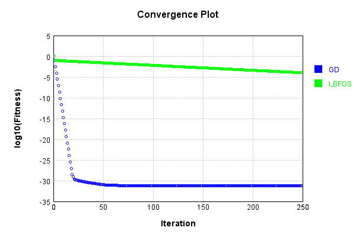
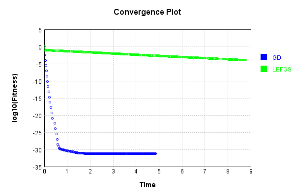
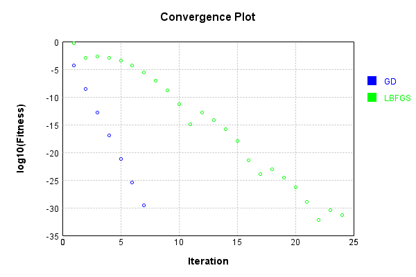
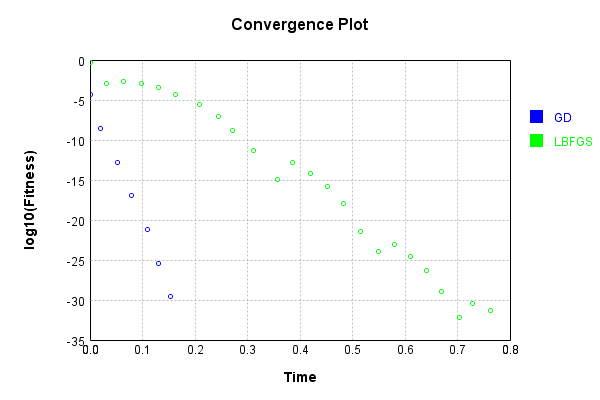

# ConvolutionLayer
## Double
### Json Serialization
Code from [JsonTest.java:36](../../../../../../../../src/main/java/com/simiacryptus/mindseye/test/unit/JsonTest.java#L36) executed in 0.00 seconds: 
```java
    JsonObject json = layer.getJson();
    NNLayer echo = NNLayer.fromJson(json);
    if ((echo == null)) throw new AssertionError("Failed to deserialize");
    if ((layer == echo)) throw new AssertionError("Serialization did not copy");
    if ((!layer.equals(echo))) throw new AssertionError("Serialization not equal");
    return new GsonBuilder().setPrettyPrinting().create().toJson(json);
```

Returns: 

```
    {
      "class": "com.simiacryptus.mindseye.layers.cudnn.ConvolutionLayer",
      "id": "88cd9131-8bcf-47e8-be92-4539800e8d9d",
      "isFrozen": false,
      "name": "ConvolutionLayer/88cd9131-8bcf-47e8-be92-4539800e8d9d",
      "filter": [
        [
          [
            -0.272
          ]
        ],
        [
          [
            0.484
          ]
        ],
        [
          [
            -1.552
          ]
        ],
        [
          [
            0.404
          ]
        ]
      ],
      "strideX": 1,
      "strideY": 1,
      "precision": "Double"
    }
```


### Example Input/Output Pair
Code from [ReferenceIO.java:68](../../../../../../../../src/main/java/com/simiacryptus/mindseye/test/unit/ReferenceIO.java#L68) executed in 0.00 seconds: 
```java
    SimpleEval eval = SimpleEval.run(layer, inputPrototype);
    return String.format("--------------------\nInput: \n[%s]\n--------------------\nOutput: \n%s\n--------------------\nDerivative: \n%s",
      Arrays.stream(inputPrototype).map(t -> t.prettyPrint()).reduce((a, b) -> a + ",\n" + b).get(),
      eval.getOutput().prettyPrint(),
      Arrays.stream(eval.getDerivative()).map(t -> t.prettyPrint()).reduce((a, b) -> a + ",\n" + b).get());
```

Returns: 

```
    --------------------
    Input: 
    [[
    	[ [ -0.72, 1.472 ], [ 0.22, 0.392 ], [ -0.136, -1.796 ], [ -0.04, -1.396 ], [ 1.992, 0.116 ] ],
    	[ [ 0.408, -1.252 ], [ -1.336, 0.992 ], [ -0.616, -1.584 ], [ 1.412, -0.464 ], [ 0.748, 1.46 ] ],
    	[ [ -0.832, -0.64 ], [ -0.044, 1.716 ], [ 0.988, 1.772 ], [ 1.7, 0.304 ], [ 1.424, -1.336 ] ],
    	[ [ -1.984, -0.084 ], [ -1.816, 1.124 ], [ 0.636, 1.408 ], [ -0.352, 1.588 ], [ -0.348, -0.384 ] ],
    	[ [ -1.672, 0.872 ], [ -1.708, 0.516 ], [ 1.488, 1.3 ], [ 0.068, -1.604 ], [ -1.46, -0.152 ] ]
    ]]
    --------------------
    Output: 
    [
    	[ [ -2.088704, 0.24620800000000007 ], [ -0.668224, 0.26484800000000003 ], [ 2.8243840000000002, -0.7914080000000001 ], [ 2.177472, -0.583344 ], [ -0.721856, 1.010992 ] ],
    	[ [ 1.832128, -0.30833600000000005 ], [ -1.176192, -0.24585599999999996 ], [ 2.6259200000000003, -0.93808 ], [ 0.33606400000000003, 0.4959519999999999 ], [ -2.469376, 0.9518719999999999 ] ],
    	[ [ 1.219584, -0.6612480000000001 ], [ -2.651264, 0.671968 ], [ -3.0188800000000002, 1.19408 ], [ -0.93
```
...[skipping 586 bytes](etc/68.txt)...
```
    99999999997, -1.1480000000000001 ], [ 0.21199999999999997, -1.1480000000000001 ] ],
    	[ [ 0.21199999999999997, -1.1480000000000001 ], [ 0.21199999999999997, -1.1480000000000001 ], [ 0.21199999999999997, -1.1480000000000001 ], [ 0.21199999999999997, -1.1480000000000001 ], [ 0.21199999999999997, -1.1480000000000001 ] ],
    	[ [ 0.21199999999999997, -1.1480000000000001 ], [ 0.21199999999999997, -1.1480000000000001 ], [ 0.21199999999999997, -1.1480000000000001 ], [ 0.21199999999999997, -1.1480000000000001 ], [ 0.21199999999999997, -1.1480000000000001 ] ],
    	[ [ 0.21199999999999997, -1.1480000000000001 ], [ 0.21199999999999997, -1.1480000000000001 ], [ 0.21199999999999997, -1.1480000000000001 ], [ 0.21199999999999997, -1.1480000000000001 ], [ 0.21199999999999997, -1.1480000000000001 ] ],
    	[ [ 0.21199999999999997, -1.1480000000000001 ], [ 0.21199999999999997, -1.1480000000000001 ], [ 0.21199999999999997, -1.1480000000000001 ], [ 0.21199999999999997, -1.1480000000000001 ], [ 0.21199999999999997, -1.1480000000000001 ] ]
    ]
```


[GPU Log](etc/cuda.log)

### Batch Execution
Code from [BatchingTester.java:66](../../../../../../../../src/main/java/com/simiacryptus/mindseye/test/unit/BatchingTester.java#L66) executed in 0.02 seconds: 
```java
    return test(reference, inputPrototype);
```

Returns: 

```
    ToleranceStatistics{absoluteTol=0.0000e+00 +- 0.0000e+00 [0.0000e+00 - 0.0000e+00] (1000#), relativeTol=0.0000e+00 +- 0.0000e+00 [0.0000e+00 - 0.0000e+00] (1000#)}
```


Code from [SingleDerivativeTester.java:77](../../../../../../../../src/main/java/com/simiacryptus/mindseye/test/unit/SingleDerivativeTester.java#L77) executed in 0.21 seconds: 
```java
    return test(component, inputPrototype);
```
Logging: 
```
    Inputs: [
    	[ [ -1.708, -0.708 ], [ -0.016, -1.844 ], [ 0.4, -1.4 ], [ -0.608, -1.348 ], [ -1.036, -0.732 ] ],
    	[ [ 0.668, -1.148 ], [ -1.868, -0.02 ], [ 1.4, 1.976 ], [ 0.2, 1.968 ], [ -0.16, -0.596 ] ],
    	[ [ -1.56, -1.384 ], [ 1.184, 1.008 ], [ 1.512, 1.34 ], [ 1.596, -0.188 ], [ -0.508, -0.876 ] ],
    	[ [ -1.972, 1.22 ], [ 0.888, 1.168 ], [ 0.452, -1.624 ], [ 1.76, -1.304 ], [ -1.74, 0.036 ] ],
    	[ [ 0.524, -0.316 ], [ -0.268, -0.644 ], [ -1.828, 1.564 ], [ 1.268, 1.908 ], [ -0.672, 1.54 ] ]
    ]
    Inputs Statistics: {meanExponent=-0.11715734882994307, negative=28, min=1.54, max=1.54, mean=-0.04991999999999997, count=50.0, positive=22, stdDev=1.2279917237506122, zeros=0}
    Output: [
    	[ [ 1.5633920000000001, -1.112704 ], [ 2.8662400000000003, -0.7527200000000001 ], [ 2.064, -0.372 ], [ 2.2574720000000004, -0.838864 ], [ 1.417856, -0.797152 ] ],
    	[ [ 1.5999999999999999, -0.14048 ], [ 0.5391360000000001, -0.912192 ], [ -3.447552, 1.475904 ], [ -3.108736, 0.891872 ], [ 0.968512, -0.318224 ] ],
    	[ [ 2.572288, -1.314176 
```
...[skipping 4645 bytes](etc/69.txt)...
```
    9998748, mean=-0.02496000000001554, count=200.0, positive=44, stdDev=0.8686799401390218, zeros=100}
    Gradient Error: [ [ -2.6489921367556235E-13, -7.752687380957468E-13, -4.4986236957811343E-13, 1.0254019855437946E-12, 7.993605777301127E-14, -4.600902991924727E-13, -4.247713292215849E-13, 7.400746682151293E-13, ... ], [ 0.0, 0.0, 0.0, 0.0, 0.0, 0.0, 0.0, 0.0, ... ], [ -3.750333377183779E-13, 2.950972799453666E-13, 1.7008616737257398E-13, 1.7752466163756253E-12, 3.501088308155431E-13, -1.9551027463649007E-12, 5.351101506345657E-13, 1.199040866595169E-13, ... ], [ 0.0, 0.0, 0.0, 0.0, 0.0, 0.0, 0.0, 0.0, ... ] ]
    Error Statistics: {meanExponent=-12.43107618845112, negative=51, min=-1.2523315717771766E-13, max=-1.2523315717771766E-13, mean=-1.5523381191595577E-14, count=200.0, positive=49, stdDev=7.069438316018302E-13, zeros=100}
    Finite-Difference Derivative Accuracy:
    absoluteTol: 4.9572e-14 +- 2.6470e-13 [0.0000e+00 - 3.3806e-12] (2700#)
    relativeTol: 9.3560e-13 +- 2.1926e-12 [6.2513e-17 - 1.4378e-11] (200#)
    
```

Returns: 

```
    ToleranceStatistics{absoluteTol=4.9572e-14 +- 2.6470e-13 [0.0000e+00 - 3.3806e-12] (2700#), relativeTol=9.3560e-13 +- 2.1926e-12 [6.2513e-17 - 1.4378e-11] (200#)}
```


### Reference Implementation
Code from [EquivalencyTester.java:61](../../../../../../../../src/main/java/com/simiacryptus/mindseye/test/unit/EquivalencyTester.java#L61) executed in 0.00 seconds: 
```java
    System.out.println(new GsonBuilder().setPrettyPrinting().create().toJson(this.reference.getJson()));
```
Logging: 
```
    {
      "class": "com.simiacryptus.mindseye.layers.aparapi.ConvolutionLayer",
      "id": "b0c10f54-ce6b-4909-8820-f464c74d8eca",
      "isFrozen": false,
      "name": "ConvolutionLayer/b0c10f54-ce6b-4909-8820-f464c74d8eca",
      "filter": [
        [
          [
            -0.272
          ]
        ],
        [
          [
            0.484
          ]
        ],
        [
          [
            -1.552
          ]
        ],
        [
          [
            0.404
          ]
        ]
      ],
      "skip": [
        [
          0.0
        ]
      ],
      "simple": true
    }
    
```

Code from [EquivalencyTester.java:64](../../../../../../../../src/main/java/com/simiacryptus/mindseye/test/unit/EquivalencyTester.java#L64) executed in 0.02 seconds: 
```java
    return test(subject, inputPrototype);
```
Logging: 
```
    Inputs: [
    	[ [ -0.028, 0.208 ], [ -1.5, -1.176 ], [ -0.664, -0.904 ], [ -0.344, 1.532 ], [ -0.532, -1.384 ] ],
    	[ [ 0.568, -0.488 ], [ 0.632, 1.308 ], [ -1.74, 0.344 ], [ 1.86, -0.3 ], [ -0.332, -0.5 ] ],
    	[ [ 0.308, -1.6 ], [ -0.756, 0.816 ], [ 1.824, 0.936 ], [ 1.076, 1.0 ], [ -0.744, 1.556 ] ],
    	[ [ -1.408, -0.644 ], [ -0.396, -0.18 ], [ 0.124, -1.828 ], [ 0.52, 0.284 ], [ 1.772, -0.004 ] ],
    	[ [ -0.304, -1.972 ], [ 0.2, -1.552 ], [ -1.556, -0.332 ], [ -0.248, 1.168 ], [ 0.072, -0.96 ] ]
    ]
    Error: [
    	[ [ 0.0, 0.0 ], [ 0.0, 0.0 ], [ 0.0, 0.0 ], [ 0.0, 0.0 ], [ 0.0, 0.0 ] ],
    	[ [ 0.0, 0.0 ], [ 0.0, 0.0 ], [ 0.0, 0.0 ], [ 0.0, 0.0 ], [ 0.0, 0.0 ] ],
    	[ [ 0.0, 0.0 ], [ 0.0, 0.0 ], [ 0.0, 0.0 ], [ 0.0, 0.0 ], [ 0.0, 0.0 ] ],
    	[ [ 0.0, 0.0 ], [ 0.0, 0.0 ], [ 0.0, 0.0 ], [ 0.0, 0.0 ], [ 0.0, 0.0 ] ],
    	[ [ 0.0, 0.0 ], [ 0.0, 0.0 ], [ 0.0, 0.0 ], [ 0.0, 0.0 ], [ 0.0, 0.0 ] ]
    ]
    Accuracy:
    absoluteTol: 0.0000e+00 +- 0.0000e+00 [0.0000e+00 - 0.0000e+00] (50#)
    relativeTol: 0.0000e+00 +- 0.0000e+00 [0.0000e+00 - 0.0000e+00] (50#)
    
```

Returns: 

```
    ToleranceStatistics{absoluteTol=0.0000e+00 +- 0.0000e+00 [0.0000e+00 - 0.0000e+00] (50#), relativeTol=0.0000e+00 +- 0.0000e+00 [0.0000e+00 - 0.0000e+00] (50#)}
```


### Performance
Now we execute larger-scale runs to benchmark performance:

Code from [PerformanceTester.java:66](../../../../../../../../src/main/java/com/simiacryptus/mindseye/test/unit/PerformanceTester.java#L66) executed in 0.63 seconds: 
```java
    test(component, inputPrototype);
```
Logging: 
```
    100 batches
    Input Dimensions:
    	[100, 100, 2]
    Performance:
    	Evaluation performance: 0.021644s +- 0.005711s [0.018381s - 0.033043s]
    	Learning performance: 0.086745s +- 0.015781s [0.063445s - 0.104745s]
    
```

### Input Learning
In this test, we use a network to learn this target input, given it's pre-evaluated output:

Code from [LearningTester.java:127](../../../../../../../../src/main/java/com/simiacryptus/mindseye/test/unit/LearningTester.java#L127) executed in 0.01 seconds: 
```java
    return Arrays.stream(input_target).map(x -> x.prettyPrint()).reduce((a, b) -> a + "\n" + b).orElse("");
```

Returns: 

```
    [
    	[ [ 0.864, 1.908 ], [ 1.948, -0.76 ], [ 0.432, -1.88 ], [ -1.236, 0.844 ], [ -1.436, 1.016 ], [ 0.0, -0.676 ], [ -1.224, 0.172 ], [ -0.96, 0.596 ], ... ],
    	[ [ 0.752, 0.532 ], [ 1.3, 1.472 ], [ -0.008, 0.532 ], [ -0.096, -0.644 ], [ 0.672, -0.24 ], [ -0.648, -1.264 ], [ 1.184, 0.3 ], [ 1.04, 0.836 ], ... ],
    	[ [ -1.7, 0.716 ], [ -1.544, -0.004 ], [ 1.656, 1.524 ], [ -0.428, 1.976 ], [ 0.368, 0.232 ], [ 0.532, 0.716 ], [ 1.404, -1.3 ], [ -1.972, -0.496 ], ... ],
    	[ [ 0.604, -1.572 ], [ -0.504, 0.436 ], [ -1.988, 0.252 ], [ -0.932, -0.568 ], [ -0.252, 0.152 ], [ -0.696, -0.716 ], [ 1.708, -0.676 ], [ -0.368, -0.992 ], ... ],
    	[ [ -1.6, 0.624 ], [ 1.548, -1.568 ], [ 0.012, -0.468 ], [ -0.892, 0.572 ], [ 0.528, -1.128 ], [ -0.112, -0.656 ], [ -0.872, -1.704 ], [ -0.332, -1.424 ], ... ],
    	[ [ 0.164, 1.668 ], [ -0.628, -0.72 ], [ -1.684, 1.708 ], [ 1.132, 1.772 ], [ 0.96, 0.184 ], [ -0.48, 0.588 ], [ 1.832, 0.928 ], [ -0.404, -1.564 ], ... ],
    	[ [ 1.468, -0.58 ], [ 0.544, 0.032 ], [ 1.684, 0.604 ], [ -0.956, 1.096 ], [ -0.296, -1.324 ], [ 1.416, -0.208 ], [ 1.748, 0.604 ], [ -0.48, -1.496 ], ... ],
    	[ [ -0.864, 0.716 ], [ -1.952, -1.988 ], [ 1.544, -0.624 ], [ -1.94, 0.044 ], [ -0.952, -1.944 ], [ -0.524, -0.996 ], [ 1.32, 1.316 ], [ -0.16, -0.352 ], ... ],
    	...
    ]
```


First, we use a conjugate gradient descent method, which converges the fastest for purely linear functions.

Code from [LearningTester.java:300](../../../../../../../../src/main/java/com/simiacryptus/mindseye/test/unit/LearningTester.java#L300) executed in 4.92 seconds: 
```java
    return new IterativeTrainer(trainable)
      .setLineSearchFactory(label -> new QuadraticSearch())
      .setOrientation(new GradientDescent())
      .setMonitor(monitor)
      .setTimeout(30, TimeUnit.SECONDS)
      .setMaxIterations(250)
      .setTerminateThreshold(0)
      .run();
```
Logging: 
```
    Constructing line search parameters: GD
    F(0.0) = LineSearchPoint{point=PointSample{avg=3.863382781266503}, derivative=-0.0020923146849024443}
    New Minimum: 3.863382781266503 > 3.8633827812662807
    F(1.0E-10) = LineSearchPoint{point=PointSample{avg=3.8633827812662807}, derivative=-0.0020923146849023857}, delta = -2.2248869413488137E-13
    New Minimum: 3.8633827812662807 > 3.863382781265052
    F(7.000000000000001E-10) = LineSearchPoint{point=PointSample{avg=3.863382781265052}, derivative=-0.0020923146849020358}, delta = -1.4512835377900046E-12
    New Minimum: 3.863382781265052 > 3.8633827812562545
    F(4.900000000000001E-9) = LineSearchPoint{point=PointSample{avg=3.8633827812562545}, derivative=-0.002092314684899584}, delta = -1.0248690784919745E-11
    New Minimum: 3.8633827812562545 > 3.86338278119471
    F(3.430000000000001E-8) = LineSearchPoint{point=PointSample{avg=3.86338278119471}, derivative=-0.0020923146848824247}, delta = -7.179323802120052E-11
    New Minimum: 3.86338278119471 > 3.8633827807641246
    F(2.40100000000000
```
...[skipping 207103 bytes](etc/70.txt)...
```
    ineSearchPoint{point=PointSample{avg=7.056844080277463E-32}, derivative=4.265341426399797E-37}, delta = 1.1161555605619488E-34
    7.056844080277463E-32 > 6.922623806176067E-32
    Iteration 249 complete. Error: 6.922623806176067E-32 Total: 249473427739336.6000; Orientation: 0.0006; Line Search: 0.0134
    Zero gradient: 2.0594720415500117E-18
    F(0.0) = LineSearchPoint{point=PointSample{avg=7.056844080277463E-32}, derivative=-4.241425089926173E-36}
    New Minimum: 7.056844080277463E-32 > 6.91518922593939E-32
    F(5636.44540511339) = LineSearchPoint{point=PointSample{avg=6.91518922593939E-32}, derivative=5.2323266182720145E-37}, delta = -1.4165485433807228E-33
    6.91518922593939E-32 <= 7.056844080277463E-32
    F(5017.477058126475) = LineSearchPoint{point=PointSample{avg=7.048662660519539E-32}, derivative=4.232726020806869E-37}, delta = -8.181419757924188E-35
    7.048662660519539E-32 > 6.91518922593939E-32
    Iteration 250 complete. Error: 6.91518922593939E-32 Total: 249473443227057.5600; Orientation: 0.0006; Line Search: 0.0127
    
```

Returns: 

```
    7.048662660519539E-32
```


Training Converged

Next, we run the same optimization using L-BFGS, which is nearly ideal for purely second-order or quadratic functions.

Code from [LearningTester.java:324](../../../../../../../../src/main/java/com/simiacryptus/mindseye/test/unit/LearningTester.java#L324) executed in 8.83 seconds: 
```java
    return new IterativeTrainer(trainable)
      .setLineSearchFactory(label -> new ArmijoWolfeSearch())
      .setOrientation(new LBFGS())
      .setMonitor(monitor)
      .setTimeout(30, TimeUnit.SECONDS)
      .setMaxIterations(250)
      .setTerminateThreshold(0)
      .run();
```
Logging: 
```
    LBFGS Accumulation History: 1 points
    Constructing line search parameters: GD
    th(0)=3.863382781266503;dx=-0.0020923146849024443
    New Minimum: 3.863382781266503 > 3.858876380481844
    WOLFE (weak): th(2.154434690031884)=3.858876380481844; dx=-0.002091057227441899 delta=0.004506400784659359
    New Minimum: 3.858876380481844 > 3.8543726888071883
    WOLFE (weak): th(4.308869380063768)=3.8543726888071883; dx=-0.002089799769981354 delta=0.009010092459314833
    New Minimum: 3.8543726888071883 > 3.8363850132083366
    WOLFE (weak): th(12.926608140191302)=3.8363850132083366; dx=-0.0020847699401391737 delta=0.02699776805816656
    New Minimum: 3.8363850132083366 > 3.755976876788238
    WOLFE (weak): th(51.70643256076521)=3.755976876788238; dx=-0.002062135705849362 delta=0.10740590447826515
    New Minimum: 3.755976876788238 > 3.341957732326948
    WOLFE (weak): th(258.53216280382605)=3.341957732326948; dx=-0.0019414197896370346 delta=0.5214250489395553
    New Minimum: 3.341957732326948 > 1.3200002420646868
    END: th(1551.1929768229563)=1.32000
```
...[skipping 321573 bytes](etc/71.txt)...
```
    28E-4 > 1.079789450156164E-4
    WOLFE (weak): th(4.308869380063768)=1.079789450156164E-4; dx=-1.89787756650457E-9 delta=8.177861366494461E-9
    New Minimum: 1.079789450156164E-4 > 1.0796259022188217E-4
    WOLFE (weak): th(12.926608140191302)=1.0796259022188217E-4; dx=-1.897733832133272E-9 delta=2.4532655100716365E-8
    New Minimum: 1.0796259022188217E-4 > 1.078890089785609E-4
    WOLFE (weak): th(51.70643256076521)=1.078890089785609E-4; dx=-1.897087027462431E-9 delta=9.811389842198268E-8
    New Minimum: 1.078890089785609E-4 > 1.0749699930436654E-4
    WOLFE (weak): th(258.53216280382605)=1.0749699930436654E-4; dx=-1.8936374025512795E-9 delta=4.901235726163496E-7
    New Minimum: 1.0749699930436654E-4 > 1.0506310342233373E-4
    WOLFE (weak): th(1551.1929768229563)=1.0506310342233373E-4; dx=-1.872077246856583E-9 delta=2.924019454649156E-6
    MAX ALPHA: th(0)=1.0798712287698289E-4;th'(0)=-1.8979494336902188E-9;
    Iteration 250 complete. Error: 1.0506310342233373E-4 Total: 249482277703904.7500; Orientation: 0.0011; Line Search: 0.0297
    
```

Returns: 

```
    1.0506310342233373E-4
```


This training run resulted in the following regressed input:

Code from [LearningTester.java:154](../../../../../../../../src/main/java/com/simiacryptus/mindseye/test/unit/LearningTester.java#L154) executed in 0.01 seconds: 
```java
    return Arrays.stream(input_lbgfs).map(x -> x.prettyPrint()).reduce((a, b) -> a + "\n" + b).orElse("");
```

Returns: 

```
    [
    	[ [ 0.7980894137112098, 1.8843017868598715 ], [ 1.9241970897703855, -0.7685583587059169 ], [ 0.40909113447724793, -1.8882369040927351 ], [ -1.2003784579721712, 0.8568077588576859 ], [ -1.406229045594895, 1.0267041745886762 ], [ -0.002364898788300699, -0.6768503015781778 ], [ -1.2163766458072198, 0.17474098415255515 ], [ -0.9793468322060226, 0.5890438283283393 ], ... ],
    	[ [ 0.7725615952011023, 0.5393929408462815 ], [ 1.2722320965091904, 1.4620160242469027 ], [ -0.01175119157824614, 0.5306512555485211 ], [ -0.04070853879977082, -0.624119903248759 ], [ 0.6734227165470009, -0.23948846093067527 ], [ -0.6562988843818301, -1.266983871665838 ], [ 1.1008783802883277, 0.2701135436445825 ], [ 0.9610560084087196, 0.8076156137548901 ], ... ],
    	[ [ -1.7176140038765442, 0.7096668683800135 ], [ -1.4873728152775991, 0.016360357396868065 ], [ 1.612562427531288, 1.5083819800639768 ], [ -0.4207573029838909, 1.978604118507535 ], [ 0.32412303682363536, 0.21622399672278597 ], [ 0.5252307347581779, 0.7135661043311027 ], [ 1.4288
```
...[skipping 930 bytes](etc/72.txt)...
```
     ], [ -1.6334548120315318, 1.7261735697576146 ], [ 1.1169459328318898, 1.7665872960253677 ], [ 0.9154193522326975, 0.16797098626788878 ], [ -0.48323778302966347, 0.5868358520738647 ], [ 1.7524098905250096, 0.8993833014635881 ], [ -0.3409524367381448, -1.541331189475411 ], ... ],
    	[ [ 1.4535720991106384, -0.5851875653016135 ], [ 0.5265892473497118, 0.0257399475491123 ], [ 1.598262071720943, 0.5731728474444522 ], [ -0.9231897974535593, 1.10779693910944 ], [ -0.32526695050785487, -1.3345229595145431 ], [ 1.4449650555345634, -0.197585587106354 ], [ 1.745122877002197, 0.602965527726706 ], [ -0.42034879189410135, -1.4745523521583337 ], ... ],
    	[ [ -0.8933456846867127, 0.705448731537577 ], [ -1.9180854515350076, -1.9758059922794027 ], [ 1.5540012036435227, -0.6204040578464353 ], [ -1.9269936383246902, 0.04867644954345539 ], [ -0.8619070131286781, -1.9116069820415102 ], [ -0.546680960365869, -1.004154960579748 ], [ 1.3019019788618218, 1.3094928395194683 ], [ -0.19121364357545942, -0.36322289483346687 ], ... ],
    	...
    ]
```


Code from [LearningTester.java:96](../../../../../../../../src/main/java/com/simiacryptus/mindseye/test/unit/LearningTester.java#L96) executed in 0.00 seconds: 
```java
    return TestUtil.compare(runs);
```

Returns: 




Code from [LearningTester.java:99](../../../../../../../../src/main/java/com/simiacryptus/mindseye/test/unit/LearningTester.java#L99) executed in 0.00 seconds: 
```java
    return TestUtil.compareTime(runs);
```

Returns: 




### Model Learning
In this test, attempt to train a network to emulate a randomized network given an example input/output. The target state is:

Code from [LearningTester.java:176](../../../../../../../../src/main/java/com/simiacryptus/mindseye/test/unit/LearningTester.java#L176) executed in 0.00 seconds: 
```java
    return network_target.state().stream().map(Arrays::toString).reduce((a, b) -> a + "\n" + b).orElse("");
```

Returns: 

```
    [-0.272, 0.404, -1.552, 0.484]
```


First, we use a conjugate gradient descent method, which converges the fastest for purely linear functions.

Code from [LearningTester.java:300](../../../../../../../../src/main/java/com/simiacryptus/mindseye/test/unit/LearningTester.java#L300) executed in 0.37 seconds: 
```java
    return new IterativeTrainer(trainable)
      .setLineSearchFactory(label -> new QuadraticSearch())
      .setOrientation(new GradientDescent())
      .setMonitor(monitor)
      .setTimeout(30, TimeUnit.SECONDS)
      .setMaxIterations(250)
      .setTerminateThreshold(0)
      .run();
```
Logging: 
```
    Constructing line search parameters: GD
    F(0.0) = LineSearchPoint{point=PointSample{avg=5.5778741771486775}, derivative=-15.011208453062157}
    New Minimum: 5.5778741771486775 > 5.577874175647609
    F(1.0E-10) = LineSearchPoint{point=PointSample{avg=5.577874175647609}, derivative=-15.011208451042242}, delta = -1.5010686027494557E-9
    New Minimum: 5.577874175647609 > 5.5778741666409495
    F(7.000000000000001E-10) = LineSearchPoint{point=PointSample{avg=5.5778741666409495}, derivative=-15.011208438922631}, delta = -1.0507728021025287E-8
    New Minimum: 5.5778741666409495 > 5.577874103593836
    F(4.900000000000001E-9) = LineSearchPoint{point=PointSample{avg=5.577874103593836}, derivative=-15.011208354085454}, delta = -7.355484132887113E-8
    New Minimum: 5.577874103593836 > 5.577873662264353
    F(3.430000000000001E-8) = LineSearchPoint{point=PointSample{avg=5.577873662264353}, derivative=-15.011207760225982}, delta = -5.148843245095236E-7
    New Minimum: 5.577873662264353 > 5.577870572958223
    F(2.4010000000000004E-7) = LineSearc
```
...[skipping 4690 bytes](etc/73.txt)...
```
     0.0156
    Zero gradient: 3.3155937101769837E-13
    F(0.0) = LineSearchPoint{point=PointSample{avg=4.052792555487896E-26}, derivative=-1.0993161650965177E-25}
    New Minimum: 4.052792555487896E-26 > 2.5199247424924018E-30
    F(0.7431547311821044) = LineSearchPoint{point=PointSample{avg=2.5199247424924018E-30}, derivative=8.65052613764507E-28}, delta = -4.052540563013647E-26
    2.5199247424924018E-30 <= 4.052792555487896E-26
    Converged to right
    Iteration 7 complete. Error: 2.5199247424924018E-30 Total: 249482754944390.2800; Orientation: 0.0000; Line Search: 0.0151
    Zero gradient: 2.609572950333096E-15
    F(0.0) = LineSearchPoint{point=PointSample{avg=2.5199247424924018E-30}, derivative=-6.809870983110179E-30}
    New Minimum: 2.5199247424924018E-30 > 0.0
    F(0.7431547311821044) = LineSearchPoint{point=PointSample{avg=0.0}, derivative=0.0}, delta = -2.5199247424924018E-30
    0.0 <= 2.5199247424924018E-30
    Converged to right
    Iteration 8 complete. Error: 0.0 Total: 249482780516926.2500; Orientation: 0.0001; Line Search: 0.0158
    
```

Returns: 

```
    0.0
```


Training Converged

Next, we run the same optimization using L-BFGS, which is nearly ideal for purely second-order or quadratic functions.

Code from [LearningTester.java:324](../../../../../../../../src/main/java/com/simiacryptus/mindseye/test/unit/LearningTester.java#L324) executed in 0.85 seconds: 
```java
    return new IterativeTrainer(trainable)
      .setLineSearchFactory(label -> new ArmijoWolfeSearch())
      .setOrientation(new LBFGS())
      .setMonitor(monitor)
      .setTimeout(30, TimeUnit.SECONDS)
      .setMaxIterations(250)
      .setTerminateThreshold(0)
      .run();
```
Logging: 
```
    LBFGS Accumulation History: 1 points
    Constructing line search parameters: GD
    th(0)=2.2142439842303854;dx=-5.961738029910183
    Armijo: th(2.154434690031884)=7.996602842435971; dx=11.329604491547927 delta=-5.782358858205585
    New Minimum: 2.2142439842303854 > 0.44878989265157815
    WOLF (strong): th(1.077217345015942)=0.44878989265157815; dx=2.6839332308188872 delta=1.7654540915788073
    END: th(0.3590724483386473)=0.5909518379971049; dx=-3.0798476096671616 delta=1.6232921462332803
    Iteration 1 complete. Error: 0.44878989265157815 Total: 249482837915278.2200; Orientation: 0.0001; Line Search: 0.0372
    LBFGS Accumulation History: 1 points
    th(0)=0.5909518379971049;dx=-1.5910727421160569
    New Minimum: 0.5909518379971049 > 0.0010209519836012972
    WOLF (strong): th(0.7735981389354633)=0.0010209519836012972; dx=0.06591166345758324 delta=0.5899308860135036
    END: th(0.3867990694677316)=0.135756388440744; dx=-0.7625805393292384 delta=0.45519544955636093
    Iteration 2 complete. Error: 0.0010209519836012972 Total: 2494828685159
```
...[skipping 11132 bytes](etc/74.txt)...
```
    ; Orientation: 0.0001; Line Search: 0.0144
    LBFGS Accumulation History: 1 points
    th(0)=3.5950948655644093E-31;dx=-9.424151474463023E-31
    New Minimum: 3.5950948655644093E-31 > 1.634290526431112E-31
    WOLF (strong): th(1.1773756992669762)=1.634290526431112E-31; dx=6.245850527358315E-31 delta=1.9608043391332974E-31
    New Minimum: 1.634290526431112E-31 > 4.2517861279487125E-32
    END: th(0.5886878496334881)=4.2517861279487125E-32; dx=-2.9368464644735185E-31 delta=3.169916252769538E-31
    Iteration 24 complete. Error: 4.2517861279487125E-32 Total: 249483599711815.4400; Orientation: 0.0001; Line Search: 0.0242
    LBFGS Accumulation History: 1 points
    th(0)=4.2517861279487125E-32;dx=-9.423940170184042E-32
    Armijo: th(1.26828952485066)=4.30891479875203E-32; dx=9.517823759724749E-32 delta=-5.712867080331731E-34
    New Minimum: 4.2517861279487125E-32 > 0.0
    END: th(0.63414476242533)=0.0; dx=0.0 delta=4.2517861279487125E-32
    Iteration 25 complete. Error: 0.0 Total: 249483633282840.4000; Orientation: 0.0001; Line Search: 0.0239
    
```

Returns: 

```
    0.0
```


Training Converged

Code from [LearningTester.java:96](../../../../../../../../src/main/java/com/simiacryptus/mindseye/test/unit/LearningTester.java#L96) executed in 0.00 seconds: 
```java
    return TestUtil.compare(runs);
```

Returns: 




Code from [LearningTester.java:99](../../../../../../../../src/main/java/com/simiacryptus/mindseye/test/unit/LearningTester.java#L99) executed in 0.00 seconds: 
```java
    return TestUtil.compareTime(runs);
```

Returns: 




### Composite Learning
In this test, attempt to train a network to emulate a randomized network given an example input/output. The target state is:

Code from [LearningTester.java:219](../../../../../../../../src/main/java/com/simiacryptus/mindseye/test/unit/LearningTester.java#L219) executed in 0.00 seconds: 
```java
    return network_target.state().stream().map(Arrays::toString).reduce((a, b) -> a + "\n" + b).orElse("");
```

Returns: 

```
    [0.484, -1.552, 0.404, -0.272]
```


We simultaneously regress this target input:

Code from [LearningTester.java:223](../../../../../../../../src/main/java/com/simiacryptus/mindseye/test/unit/LearningTester.java#L223) executed in 0.01 seconds: 
```java
    return Arrays.stream(testInput).map(x -> x.prettyPrint()).reduce((a, b) -> a + "\n" + b).orElse("");
```

Returns: 

```
    [
    	[ [ -1.804, 0.032 ], [ 1.612, 0.552 ], [ -1.732, -0.136 ], [ 0.428, -0.64 ], [ -0.232, -1.1 ], [ 0.896, -0.912 ], [ -0.636, -1.3 ], [ -1.84, -0.572 ], ... ],
    	[ [ -0.712, 0.896 ], [ 1.264, -0.084 ], [ 1.924, -0.9 ], [ 0.364, -1.476 ], [ -0.46, 1.792 ], [ 0.044, -0.812 ], [ -1.992, 0.0 ], [ 1.58, -0.184 ], ... ],
    	[ [ 1.26, 1.3 ], [ -0.624, -1.248 ], [ -0.532, 1.248 ], [ 0.388, -1.948 ], [ -0.044, 0.68 ], [ -0.808, -1.328 ], [ -1.188, -1.828 ], [ 0.924, 1.716 ], ... ],
    	[ [ 1.08, -1.22 ], [ -0.152, 1.344 ], [ 0.552, -0.156 ], [ 0.74, -1.08 ], [ 1.668, -1.344 ], [ 1.892, 1.268 ], [ -0.436, -0.536 ], [ 1.012, -1.532 ], ... ],
    	[ [ -0.808, -0.22 ], [ 0.2, -1.144 ], [ 0.416, -1.536 ], [ 0.38, 1.84 ], [ 1.848, -1.98 ], [ -0.264, 0.96 ], [ 1.684, -1.972 ], [ 1.484, 0.784 ], ... ],
    	[ [ -0.004, 0.052 ], [ -0.912, 1.188 ], [ 1.396, 0.74 ], [ 0.82, 1.188 ], [ 0.604, -0.488 ], [ -0.816, 0.936 ], [ -1.5, -1.6 ], [ -1.436, -0.74 ], ... ],
    	[ [ -0.036, 1.44 ], [ -1.564, -0.92 ], [ -1.8, 1.388 ], [ -1.336, -1.116 ], [ 0.996, 0.964 ], [ 1.872, -0.664 ], [ 1.948, -1.904 ], [ 0.56, -0.188 ], ... ],
    	[ [ 1.644, 1.516 ], [ 1.52, 0.088 ], [ 1.04, -1.528 ], [ -0.592, 0.288 ], [ -1.428, -1.812 ], [ -0.876, -1.036 ], [ -0.444, 1.212 ], [ -1.008, -1.18 ], ... ],
    	...
    ]
```


Which produces the following output:

Code from [LearningTester.java:230](../../../../../../../../src/main/java/com/simiacryptus/mindseye/test/unit/LearningTester.java#L230) executed in 0.01 seconds: 
```java
    return Stream.of(targetOutput).map(x -> x.prettyPrint()).reduce((a, b) -> a + "\n" + b).orElse("");
```

Returns: 

```
    [
    	[ [ -0.860208, 2.7911040000000003 ], [ 1.003216, -2.651968 ], [ -0.8932319999999999, 2.7250560000000004 ], [ -0.051408000000000016, -0.49017599999999995 ], [ -0.5566880000000001, 0.6592640000000001 ], [ 0.06521599999999995, -1.142528 ], [ -0.833024, 1.340672 ], [ -1.121648, 3.011264 ], ... ],
    	[ [ 0.01737600000000006, 0.861312 ], [ 0.57784, -1.9388800000000002 ], [ 0.5676159999999999, -2.7412479999999997 ], [ -0.42012800000000006, -0.16345599999999996 ], [ 0.5013280000000001, 0.22649599999999995 ], [ -0.306752, 0.15257600000000002 ], [ -0.964128, 3.091584 ], [ 0.6903840000000001, -2.4021120000000002 ], ... ],
    	[ [ 1.13504, -2.30912 ], [ -0.806208, 1.307904 ], [ 0.24670400000000003, 0.48620800000000003 ], [ -0.5992000000000001, -0.07232000000000002 ], [ 0.25342400000000004, -0.11667200000000003 ], [ -0.9275840000000001, 1.615232 ], [ -1.313504, 2.340992 ], [ 1.14048, -1.9008000000000003 ], ... ],
    	[ [ 0.029840000000000054, -1.3443200000000002 ], [ 0.46940800000000005, -0.12966400000000006 ], [ 0.20414400000
```
...[skipping 283 bytes](etc/75.txt)...
```
    , 7.679999999999876E-4 ], [ -0.4192000000000001, -0.22783999999999993 ], [ 0.9272800000000001, -1.09024 ], [ 0.09451199999999996, -2.3295360000000005 ], [ 0.260064, 0.14860800000000002 ], [ 0.01836799999999996, -2.077184 ], [ 1.0349920000000001, -2.516416 ], ... ],
    	[ [ 0.019072, -0.007936 ], [ 0.03854399999999999, 1.092288 ], [ 0.9746239999999999, -2.367872 ], [ 0.876832, -1.595776 ], [ 0.09518399999999998, -0.804672 ], [ -0.016799999999999916, 1.01184 ], [ -1.3724, 2.7632000000000003 ], [ -0.993984, 2.429952 ], ... ],
    	[ [ 0.5643360000000001, -0.335808 ], [ -1.128656, 2.6775680000000004 ], [ -0.310448, 2.416064 ], [ -1.097488, 2.3770240000000005 ], [ 0.87152, -1.808 ], [ 0.637792, -2.7247360000000005 ], [ 0.173616, -2.505408 ], [ 0.195088, -0.8179840000000002 ], ... ],
    	[ [ 1.40816, -2.96384 ], [ 0.771232, -2.382976 ], [ -0.11395200000000003, -1.1984640000000002 ], [ -0.170176, 0.840448 ], [ -1.4232, 2.70912 ], [ -0.842528, 1.6413440000000001 ], [ 0.274752, 0.359424 ], [ -0.964592, 1.885376 ], ... ],
    	...
    ]
```


First, we use a conjugate gradient descent method, which converges the fastest for purely linear functions.

Code from [LearningTester.java:300](../../../../../../../../src/main/java/com/simiacryptus/mindseye/test/unit/LearningTester.java#L300) executed in 25.20 seconds: 
```java
    return new IterativeTrainer(trainable)
      .setLineSearchFactory(label -> new QuadraticSearch())
      .setOrientation(new GradientDescent())
      .setMonitor(monitor)
      .setTimeout(30, TimeUnit.SECONDS)
      .setMaxIterations(250)
      .setTerminateThreshold(0)
      .run();
```
Logging: 
```
    Constructing line search parameters: GD
    F(0.0) = LineSearchPoint{point=PointSample{avg=3.8810451319811405}, derivative=-5.318808333249558}
    New Minimum: 3.8810451319811405 > 3.881045131449242
    F(1.0E-10) = LineSearchPoint{point=PointSample{avg=3.881045131449242}, derivative=-5.318808332527844}, delta = -5.318985252245056E-10
    New Minimum: 3.881045131449242 > 3.8810451282579583
    F(7.000000000000001E-10) = LineSearchPoint{point=PointSample{avg=3.8810451282579583}, derivative=-5.3188083281975835}, delta = -3.723182206982756E-9
    New Minimum: 3.8810451282579583 > 3.8810451059189575
    F(4.900000000000001E-9) = LineSearchPoint{point=PointSample{avg=3.8810451059189575}, derivative=-5.318808297885697}, delta = -2.6062183078323642E-8
    New Minimum: 3.8810451059189575 > 3.8810449495460286
    F(3.430000000000001E-8) = LineSearchPoint{point=PointSample{avg=3.8810449495460286}, derivative=-5.318808085702471}, delta = -1.8243511190618733E-7
    New Minimum: 3.8810449495460286 > 3.8810438549354775
    F(2.4010000000000004E-7) = LineS
```
...[skipping 422684 bytes](etc/76.txt)...
```
    intSample{avg=1.8446796529202945}, derivative=-0.002766571278080363}, delta = -8.245487149776132E-4
    F(1.684062457843938) = LineSearchPoint{point=PointSample{avg=1.8464089391729936}, derivative=0.005162567176149391}, delta = 9.047375377215783E-4
    F(0.12954326598799523) = LineSearchPoint{point=PointSample{avg=1.8450207075186154}, derivative=-0.0033765041972436305}, delta = -4.8349411665671305E-4
    New Minimum: 1.8442259448674119 > 1.8440555545553143
    F(0.9068028619159666) = LineSearchPoint{point=PointSample{avg=1.8440555545553143}, derivative=8.930286574765302E-4}, delta = -0.0014486470799577322
    1.8440555545553143 <= 1.845504201635272
    New Minimum: 1.8440555545553143 > 1.8439829629700208
    F(0.7442288301510369) = LineSearchPoint{point=PointSample{avg=1.8439829629700208}, derivative=-5.659900037999189E-10}, delta = -0.0015212386652512233
    Left bracket at 0.7442288301510369
    Converged to left
    Iteration 250 complete. Error: 1.8439829629700208 Total: 249508966271799.1600; Orientation: 0.0007; Line Search: 0.1010
    
```

Returns: 

```
    1.8439829629700208
```


This training run resulted in the following configuration:

Code from [LearningTester.java:245](../../../../../../../../src/main/java/com/simiacryptus/mindseye/test/unit/LearningTester.java#L245) executed in 0.00 seconds: 
```java
    return network_gd.state().stream().map(Arrays::toString).reduce((a, b) -> a + "\n" + b).orElse("");
```

Returns: 

```
    [0.11209832885431496, -0.31668474713261097, -0.013745119820039068, 0.03178275281774485]
    [-0.860208, 0.01737600000000006, 1.13504, 0.029840000000000054, -0.47995200000000005, 0.019072, 0.5643360000000001, 1.40816, 0.760896, 0.846192, -0.25007999999999997, 0.956032, -0.6051360000000001, -0.313376, 0.11251199999999992, 0.19625600000000007, 0.23951999999999996, 0.19816000000000003, 0.9152319999999999, -0.69856, 1.251936, -0.762784, -0.977232, -0.4640639999999999, -1.601856, 0.924912, 0.4426400000000001, 0.8231040000000001, 0.31193599999999994, 0.1452, 0.3884639999999999, 1.273824, 0.44336, 0.75296, -0.47473600000000005, -1.2188160000000001, -0.16294399999999995, -0.604272, -0.384896, 0.07761600000000002, -0.264768, -1.045472, 0.5840000000000001, -0.7330400000000001, -1.731456, 0.874384, 0.11884800000000005, 0.011807999999999996, 0.105088, -0.11580800000000001, -0.28281599999999996, -0.19620800000000002, 0.13927999999999982, -0.593392, 0.40036799999999995, -0.06119999999999997, 0.504016, 0.90736, -0.580064, 0.8689
```
...[skipping 299446 bytes](etc/77.txt)...
```
    .674944, 1.8642560000000001, -0.491136, -2.317952, 2.5118080000000003, 1.303552, -0.033088000000000034, -0.9240959999999999, 2.57792, -0.5088639999999999, 0.628992, -2.277056, 2.964416, 0.7942400000000001, 0.19462400000000002, 1.9417600000000002, -0.193152, 2.496384, -1.594368, -3.3156480000000004, 3.1810560000000003, -0.6050559999999999, -0.520704, -0.9511040000000001, -0.132992, 0.9315840000000001, 2.557888, 2.626496, -0.285504, 2.054336, 1.794816, -1.4849280000000002, -2.080192, -2.43328, -0.016895999999999994, -2.814144, -3.353472, 0.20787200000000003, -0.64576, 1.75648, -0.7927040000000001, -1.873728, -2.363712, -0.46751999999999994, 3.243648, 1.6738560000000002, -2.6051200000000003, 2.295168, 2.295296, 1.272704, 1.2769920000000001, 1.289792, -1.468544, -0.22534399999999996, -2.4336, -1.503936, 1.962624, 0.353472, 1.227392, -2.1781759999999997, 0.571136, 2.7410560000000004, 1.761984, 2.2792320000000004, -1.5379200000000002, -3.3088640000000002, 1.3516160000000002, 2.777984, 2.666048, -1.479488, 1.783872]
```


And regressed input:

Code from [LearningTester.java:249](../../../../../../../../src/main/java/com/simiacryptus/mindseye/test/unit/LearningTester.java#L249) executed in 0.01 seconds: 
```java
    return Arrays.stream(input_gd).map(x -> x.prettyPrint()).reduce((a, b) -> a + "\n" + b).orElse("");
```

Returns: 

```
    [
    	[ [ -1.2877763564823492, 0.34041404903562866 ], [ -1.5766635613879871, -1.3377019604659681 ], [ -2.438807326283383E-4, 0.4986908654217419 ], [ 0.8439604324383501, -0.7988240087376597 ], [ 0.22525453098240678, 1.0864833064103612 ], [ 1.2329891570084193, -1.73335373593656 ], [ 1.1567078596781049, 0.7057540407339967 ], [ -0.008974641639287446, -1.8638911910803644 ], ... ],
    	[ [ 0.14861620204973497, 0.2415089376889794 ], [ -1.465878422903479, 1.5715847389485487 ], [ 1.287814635937765, -0.1382446548722866 ], [ -1.1120876334834886, 1.2856620751913588 ], [ -0.3671573711395075, 1.3261645538340914 ], [ -1.395095396023417, 1.8035943727307042 ], [ -1.2892929907123125, 1.6757338612494237 ], [ -0.6414438857141461, -0.6513541410728458 ], ... ],
    	[ [ -1.0392130594352633, -0.9457047400506835 ], [ 1.4025337493176144, 1.769344736427264 ], [ -0.03173028499760774, -0.40005125933417934 ], [ -0.7001873508682308, -1.8220849116158007 ], [ 0.1306491126179072, 1.4249447671750635 ], [ -1.439993814853254, 1.9230031987942493 ], [ -1.5
```
...[skipping 949 bytes](etc/78.txt)...
```
    69713974, 0.6531834505631805 ], [ 0.016704683083667054, -0.5022584728945004 ], [ -0.3532759918220502, 0.20980559930987133 ], [ -0.7079515930926968, -0.090422244130896 ], [ -1.3509723305483141, 2.0102676731988396 ], [ -0.23925307639939924, -1.3956766625870844 ], ... ],
    	[ [ -1.5940628514934745, -0.3783508179381377 ], [ 0.7922379586569827, -1.0100549502881113 ], [ 0.284386563530884, 0.09272205522157878 ], [ -1.6489577100843502, -1.7746311946323254 ], [ -1.104124091754579, -1.8264840715283819 ], [ 0.2231200121739112, 0.015088482853360275 ], [ 0.9039892136482865, 1.9329084661894473 ], [ -1.6607788488693325, 0.2701378581709188 ], ... ],
    	[ [ 0.27091533011171837, -0.9395149315059037 ], [ 1.7775533807108028, -0.5222819587500116 ], [ -0.2715362955373816, -1.3364334306487744 ], [ 0.06855688961584248, 1.6176261056593286 ], [ -0.21884913734745842, -1.7259438174012844 ], [ -0.30738820517529825, -1.773144880651869 ], [ -0.40374077482804777, 0.2493043347171397 ], [ -1.960299691658702, -0.054173508221944666 ], ... ],
    	...
    ]
```


Which produces the following output:

Code from [LearningTester.java:256](../../../../../../../../src/main/java/com/simiacryptus/mindseye/test/unit/LearningTester.java#L256) executed in 0.00 seconds: 
```java
    return Stream.of(regressedOutput).map(x -> x.prettyPrint()).reduce((a, b) -> a + "\n" + b).orElse("");
```

Returns: 

```
    [ 1.8439829629700208 ]
```


Next, we run the same optimization using L-BFGS, which is nearly ideal for purely second-order or quadratic functions.

Code from [LearningTester.java:324](../../../../../../../../src/main/java/com/simiacryptus/mindseye/test/unit/LearningTester.java#L324) executed in 0.83 seconds: 
```java
    return new IterativeTrainer(trainable)
      .setLineSearchFactory(label -> new ArmijoWolfeSearch())
      .setOrientation(new LBFGS())
      .setMonitor(monitor)
      .setTimeout(30, TimeUnit.SECONDS)
      .setMaxIterations(250)
      .setTerminateThreshold(0)
      .run();
```
Logging: 
```
    LBFGS Accumulation History: 1 points
    Constructing line search parameters: GD
    th(0)=3.8810451319811405;dx=-5.318808333249558
    Armijo: th(2.154434690031884)=9.15286340291726; dx=10.204100551074337 delta=-5.271818270936119
    New Minimum: 3.8810451319811405 > 2.3365679489046722
    WOLF (strong): th(1.077217345015942)=2.3365679489046722; dx=2.449118868425713 delta=1.5444771830764683
    END: th(0.3590724483386473)=2.4363837681461695; dx=-2.7280603864107955 delta=1.444661363834971
    Iteration 1 complete. Error: 2.3365679489046722 Total: 249509050181691.0000; Orientation: 0.0012; Line Search: 0.0339
    LBFGS Accumulation History: 1 points
    th(0)=2.4363837681461695;dx=-1.3993195134451457
    New Minimum: 2.4363837681461695 > 1.9216145991267786
    WOLF (strong): th(0.7735981389354633)=1.9216145991267786; dx=0.06839863488735766 delta=0.514769169019391
    END: th(0.3867990694677316)=2.0370711802532737; dx=-0.6654026799453467 delta=0.3993125878928958
    Iteration 2 complete. Error: 1.9216145991267786 Total: 249509090789116.9400; Orienta
```
...[skipping 7881 bytes](etc/79.txt)...
```
    417 > 1.9203623026167287
    WOLFE (weak): th(37.77334662770819)=1.9203623026167287; dx=-2.5080048895129706E-7 delta=9.480331344846604E-6
    New Minimum: 1.9203623026167287 > 1.9203245164722178
    WOLFE (weak): th(188.86673313854095)=1.9203245164722178; dx=-2.4936874893893854E-7 delta=4.726647585573396E-5
    New Minimum: 1.9203245164722178 > 1.9200932632914858
    WOLFE (weak): th(1133.2003988312458)=1.9200932632914858; dx=-2.403922583497144E-7 delta=2.7851965658776123E-4
    New Minimum: 1.9200932632914858 > 1.9186860271432256
    END: th(7932.40279181872)=1.9186860271432256; dx=-1.7213367246777074E-7 delta=0.001685755804847977
    Iteration 17 complete. Error: 1.9186860271432256 Total: 249509792247749.2800; Orientation: 0.0010; Line Search: 0.0759
    LBFGS Accumulation History: 1 points
    th(0)=1.9186860271432256;dx=-0.006710132654576473
    MAX ALPHA: th(0)=1.9186860271432256;th'(0)=-0.006710132654576473;
    Iteration 18 failed, aborting. Error: 1.9186860271432256 Total: 249509822769505.2200; Orientation: 0.0011; Line Search: 0.0197
    
```

Returns: 

```
    1.9186860271432256
```


This training run resulted in the following configuration:

Code from [LearningTester.java:266](../../../../../../../../src/main/java/com/simiacryptus/mindseye/test/unit/LearningTester.java#L266) executed in 0.00 seconds: 
```java
    return network_lbfgs.state().stream().map(Arrays::toString).reduce((a, b) -> a + "\n" + b).orElse("");
```

Returns: 

```
    [0.03045770535674836, -0.10399671564307257, 0.04962723033320459, 0.009803016978751111]
    [-0.860208, 0.01737600000000006, 1.13504, 0.029840000000000054, -0.47995200000000005, 0.019072, 0.5643360000000001, 1.40816, 0.760896, 0.846192, -0.25007999999999997, 0.956032, -0.6051360000000001, -0.313376, 0.11251199999999992, 0.19625600000000007, 0.23951999999999996, 0.19816000000000003, 0.9152319999999999, -0.69856, 1.251936, -0.762784, -0.977232, -0.4640639999999999, -1.601856, 0.924912, 0.4426400000000001, 0.8231040000000001, 0.31193599999999994, 0.1452, 0.3884639999999999, 1.273824, 0.44336, 0.75296, -0.47473600000000005, -1.2188160000000001, -0.16294399999999995, -0.604272, -0.384896, 0.07761600000000002, -0.264768, -1.045472, 0.5840000000000001, -0.7330400000000001, -1.731456, 0.874384, 0.11884800000000005, 0.011807999999999996, 0.105088, -0.11580800000000001, -0.28281599999999996, -0.19620800000000002, 0.13927999999999982, -0.593392, 0.40036799999999995, -0.06119999999999997, 0.504016, 0.90736, -0.580064, 0.86892
```
...[skipping 299445 bytes](etc/80.txt)...
```
    .674944, 1.8642560000000001, -0.491136, -2.317952, 2.5118080000000003, 1.303552, -0.033088000000000034, -0.9240959999999999, 2.57792, -0.5088639999999999, 0.628992, -2.277056, 2.964416, 0.7942400000000001, 0.19462400000000002, 1.9417600000000002, -0.193152, 2.496384, -1.594368, -3.3156480000000004, 3.1810560000000003, -0.6050559999999999, -0.520704, -0.9511040000000001, -0.132992, 0.9315840000000001, 2.557888, 2.626496, -0.285504, 2.054336, 1.794816, -1.4849280000000002, -2.080192, -2.43328, -0.016895999999999994, -2.814144, -3.353472, 0.20787200000000003, -0.64576, 1.75648, -0.7927040000000001, -1.873728, -2.363712, -0.46751999999999994, 3.243648, 1.6738560000000002, -2.6051200000000003, 2.295168, 2.295296, 1.272704, 1.2769920000000001, 1.289792, -1.468544, -0.22534399999999996, -2.4336, -1.503936, 1.962624, 0.353472, 1.227392, -2.1781759999999997, 0.571136, 2.7410560000000004, 1.761984, 2.2792320000000004, -1.5379200000000002, -3.3088640000000002, 1.3516160000000002, 2.777984, 2.666048, -1.479488, 1.783872]
```


And regressed input:

Code from [LearningTester.java:270](../../../../../../../../src/main/java/com/simiacryptus/mindseye/test/unit/LearningTester.java#L270) executed in 0.01 seconds: 
```java
    return Arrays.stream(input_lbgfs).map(x -> x.prettyPrint()).reduce((a, b) -> a + "\n" + b).orElse("");
```

Returns: 

```
    [
    	[ [ -1.0393484526700698, 0.3146100180158494 ], [ -1.8730110995966227, -1.3068363423473768 ], [ 0.2690432304530909, 0.4706744481910691 ], [ 0.8207767880532213, -0.7965524454653122 ], [ 0.30364064764109544, 1.078266245527381 ], [ 1.1580033913061445, -1.7257882830779303 ], [ 1.3240050753843982, 0.6882116483012264 ], [ 0.2978042175978768, -1.8960076963636456 ], ... ],
    	[ [ 0.22710648457786484, 0.2334473691565242 ], [ -1.6893907852863979, 1.5949802620603986 ], [ 1.0526145022958833, -0.11389962245250652 ], [ -1.138581700585456, 1.288368623359268 ], [ -0.3730805146613908, 1.3270701968529983 ], [ -1.4039004078561825, 1.8045719655209191 ], [ -1.013756269083741, 1.6471889468617387 ], [ -0.8882785326749969, -0.6257034303439369 ], ... ],
    	[ [ -1.2992181497117679, -0.9185295064646906 ], [ 1.5687780174295065, 1.7519788277668258 ], [ 0.003911780988151852, -0.4036499282530131 ], [ -0.6979941849504125, -1.8226237026089018 ], [ 0.11189631385444379, 1.4270582272807282 ], [ -1.300391334972671, 1.9084837149099696 ], [ -1.36493
```
...[skipping 947 bytes](etc/81.txt)...
```
    0780597, 0.6776577865369378 ], [ -0.15136122577579306, -0.48466509990002693 ], [ -0.4353792780900418, 0.21832162750919487 ], [ -0.6316127178982905, -0.09825483193656265 ], [ -1.093705031580903, 1.9834726853919056 ], [ 0.0061852908368669884, -1.421390369098539 ], ... ],
    	[ [ -1.6731181405093498, -0.3699474255666579 ], [ 1.0839581905639777, -1.0406079959519414 ], [ 0.5144524558496162, 0.06892209951747058 ], [ -1.432646951980471, -1.797342059220767 ], [ -1.3107201119002694, -1.804959675435708 ], [ -0.03467243046792737, 0.04184785466976149 ], [ 0.6900064400412937, 1.955076107396536 ], [ -1.7737723373822596, 0.28193929001566936 ], ... ],
    	[ [ -0.02942155326498895, -0.9081502924090181 ], [ 1.578490121588678, -0.5016276847804843 ], [ -0.3770991897354461, -1.325688865628214 ], [ 0.14655962209493495, 1.6096381538701783 ], [ 0.06605011538684241, -1.7559039686876161 ], [ -0.13738631331243417, -1.7910600625119664 ], [ -0.38915258942378933, 0.24794405352174886 ], [ -1.8018296590665304, -0.0707531217266425 ], ... ],
    	...
    ]
```


Which produces the following output:

Code from [LearningTester.java:277](../../../../../../../../src/main/java/com/simiacryptus/mindseye/test/unit/LearningTester.java#L277) executed in 0.00 seconds: 
```java
    return Stream.of(regressedOutput).map(x -> x.prettyPrint()).reduce((a, b) -> a + "\n" + b).orElse("");
```

Returns: 

```
    [ 1.9186860271432256 ]
```


Code from [LearningTester.java:96](../../../../../../../../src/main/java/com/simiacryptus/mindseye/test/unit/LearningTester.java#L96) executed in 0.00 seconds: 
```java
    return TestUtil.compare(runs);
```

Returns: 


Code from [LearningTester.java:99](../../../../../../../../src/main/java/com/simiacryptus/mindseye/test/unit/LearningTester.java#L99) executed in 0.00 seconds: 
```java
    return TestUtil.compareTime(runs);
```

Returns: 


