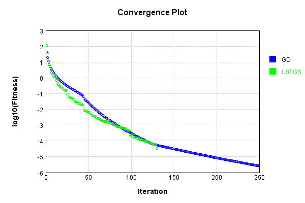
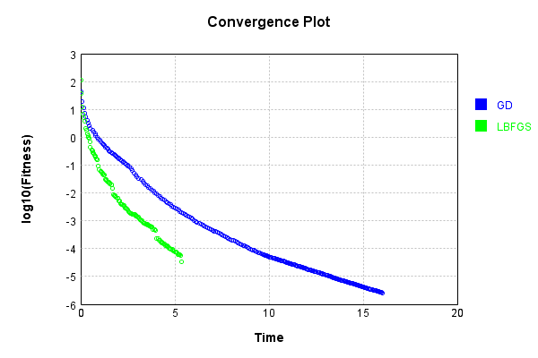
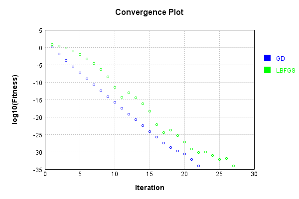
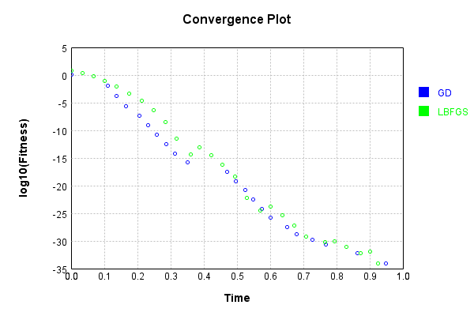
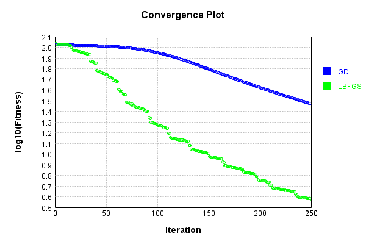
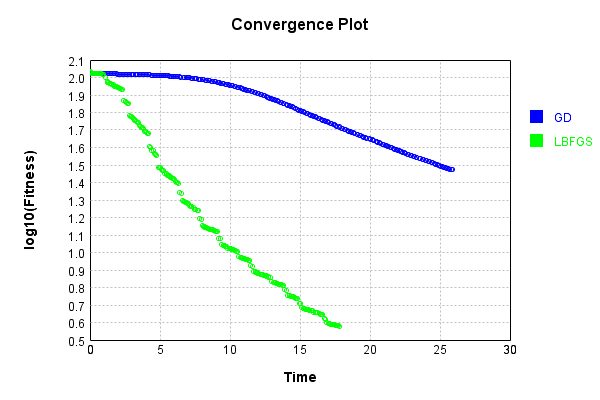

# ConvolutionLayer
## IrregularTest
### Json Serialization
Code from [JsonTest.java:36](../../../../../../../../src/main/java/com/simiacryptus/mindseye/test/unit/JsonTest.java#L36) executed in 0.00 seconds: 
```java
    JsonObject json = layer.getJson();
    NNLayer echo = NNLayer.fromJson(json);
    if ((echo == null)) throw new AssertionError("Failed to deserialize");
    if ((layer == echo)) throw new AssertionError("Serialization did not copy");
    if ((!layer.equals(echo))) throw new AssertionError("Serialization not equal");
    return new GsonBuilder().setPrettyPrinting().create().toJson(json);
```

Returns: 

```
    {
      "class": "com.simiacryptus.mindseye.layers.cudnn.ConvolutionLayer",
      "id": "da68af72-d9d2-46d9-a49b-63203f2f1dd2",
      "isFrozen": false,
      "name": "ConvolutionLayer/da68af72-d9d2-46d9-a49b-63203f2f1dd2",
      "filter": [
        [
          [
            1.96,
            1.008,
            0.248
          ],
          [
            -1.936,
            0.908,
            1.288
          ],
          [
            1.992,
            1.54,
            0.44
          ]
        ],
        [
          [
            0.376,
            -0.264,
            1.432
          ],
          [
            1.268,
            -1.684,
            -1.32
          ],
          [
            -0.992,
            0.496,
            1.988
          ]
        ],
        [
          [
            -0.24,
            -0.708,
            1.132
          ],
          [
            -0.64,
            -0.516,
            -0.336
          ],
          [
            1.672,
            -0.464,
            1.552
          ]
        ],
        [
          [
            2.0,
            1.088,
            0.184
          ],
          [
            -0.26,
            0.204,
            1.616
          ],
          [
            -0.776,
            1.716,
            0.316
          ]
        ],
        [
          [
        
```
...[skipping 5126 bytes](etc/84.txt)...
```
    1.48,
            -1.776,
            0.5
          ],
          [
            -1.072,
            1.732,
            1.852
          ],
          [
            1.244,
            1.368,
            1.304
          ]
        ],
        [
          [
            -1.576,
            -1.748,
            0.324
          ],
          [
            1.22,
            -1.672,
            0.04
          ],
          [
            -0.764,
            -0.212,
            0.956
          ]
        ],
        [
          [
            0.224,
            -0.076,
            1.824
          ],
          [
            0.856,
            -0.556,
            1.06
          ],
          [
            -0.592,
            -1.784,
            0.412
          ]
        ],
        [
          [
            0.896,
            0.328,
            0.952
          ],
          [
            0.404,
            0.396,
            1.02
          ],
          [
            1.512,
            -0.448,
            -1.852
          ]
        ],
        [
          [
            0.756,
            0.416,
            -1.76
          ],
          [
            1.132,
            -0.292,
            -1.076
          ],
          [
            -0.088,
            -1.204,
            0.132
          ]
        ]
      ],
      "strideX": 1,
      "strideY": 1,
      "precision": "Double"
    }
```


### Example Input/Output Pair
Code from [ReferenceIO.java:68](../../../../../../../../src/main/java/com/simiacryptus/mindseye/test/unit/ReferenceIO.java#L68) executed in 0.00 seconds: 
```java
    SimpleEval eval = SimpleEval.run(layer, inputPrototype);
    return String.format("--------------------\nInput: \n[%s]\n--------------------\nOutput: \n%s\n--------------------\nDerivative: \n%s",
      Arrays.stream(inputPrototype).map(t -> t.prettyPrint()).reduce((a, b) -> a + ",\n" + b).get(),
      eval.getOutput().prettyPrint(),
      Arrays.stream(eval.getDerivative()).map(t -> t.prettyPrint()).reduce((a, b) -> a + ",\n" + b).get());
```

Returns: 

```
    --------------------
    Input: 
    [[
    	[ [ -1.352, 1.604, 0.464, 0.976, 1.1, -0.068, -0.916 ], [ -0.696, -1.856, 0.34, 0.596, 1.836, -1.38, 1.588 ], [ -1.468, -0.852, 0.916, -0.668, 0.652, 1.688, 0.676 ], [ 0.408, 1.124, -0.728, -0.612, -1.044, 0.84, 1.34 ], [ 0.504, 1.488, -1.672, -1.292, -0.172, 1.628, 0.34 ] ],
    	[ [ -1.252, -1.012, -0.452, 1.628, -1.732, -0.632, 1.528 ], [ 0.94, -0.776, 0.916, -1.528, 1.956, 0.74, 0.916 ], [ -0.54, -0.72, 1.732, 1.16, 1.964, -1.636, 1.232 ], [ 1.96, 1.804, -1.784, 0.456, 0.9, 1.552, -0.96 ], [ -0.3, 1.768, 1.152, 1.372, 1.024, -1.188, 0.224 ] ],
    	[ [ 0.06, 0.112, -1.484, -1.6, -0.736, 1.684, 1.804 ], [ 1.964, 1.544, -0.74, 1.004, 1.664, -1.884, -0.884 ], [ 1.176, 1.612, -0.892, 1.396, 0.804, 1.868, 0.748 ], [ -0.972, -0.464, -1.852, 1.912, -1.668, 0.548, 1.412 ], [ -1.82, 0.644, 0.76, -0.912, -1.396, 0.056, 0.208 ] ],
    	[ [ 0.54, 0.952, 1.04, 1.344, 0.064, -0.428, -1.424 ], [ -0.604, 0.224, 1.564, -0.136, 1.236, -1.092, 1.296 ], [ -1.72, -0.072, -1.82, 0.744, -0.384, 1.236, -0.30
```
...[skipping 4308 bytes](etc/85.txt)...
```
    5999999999999, 5.028 ], [ 16.460000000000004, -1.02, 4.08, 5.192000000000002, 7.735999999999999, 13.591999999999999, 5.791999999999998 ], [ 16.46, -1.02, 4.08, 5.192000000000002, 7.736000000000001, 13.591999999999999, 5.792 ], [ 16.46, -1.02, 4.08, 5.192000000000001, 7.735999999999999, 13.591999999999999, 5.792 ], [ 6.752000000000001, 5.0280000000000005, 5.208, 4.836, 13.044, 14.896, 5.808 ] ],
    	[ [ 3.852, -1.2639999999999998, 1.2679999999999998, -1.3159999999999994, 1.4279999999999995, 4.9559999999999995, 1.1800000000000002 ], [ 9.168, -0.5999999999999992, -0.4800000000000004, 0.648000000000001, 5.868, 15.780000000000001, 0.10400000000000009 ], [ 9.168, -0.5999999999999992, -0.4800000000000004, 0.648000000000001, 5.868, 15.780000000000001, 0.10399999999999965 ], [ 9.168000000000001, -0.5999999999999992, -0.4800000000000004, 0.648000000000001, 5.868, 15.779999999999998, 0.10400000000000009 ], [ 2.564000000000001, 3.572000000000001, 1.5880000000000005, 1.4080000000000006, 7.98, 15.756, 1.0719999999999998 ] ]
    ]
```


[GPU Log](etc/cuda.log)

### Batch Execution
Code from [BatchingTester.java:66](../../../../../../../../src/main/java/com/simiacryptus/mindseye/test/unit/BatchingTester.java#L66) executed in 0.02 seconds: 
```java
    return test(reference, inputPrototype);
```

Returns: 

```
    ToleranceStatistics{absoluteTol=5.3513e-17 +- 3.1420e-16 [0.0000e+00 - 3.5527e-15] (3000#), relativeTol=1.2330e-17 +- 1.1380e-16 [0.0000e+00 - 2.1350e-15] (3000#)}
```


Code from [SingleDerivativeTester.java:77](../../../../../../../../src/main/java/com/simiacryptus/mindseye/test/unit/SingleDerivativeTester.java#L77) executed in 1.09 seconds: 
```java
    return test(component, inputPrototype);
```
Logging: 
```
    Inputs: [
    	[ [ -0.944, -1.98, 0.576, -1.352, -0.812, 1.356, 1.052 ], [ -0.936, 1.34, 1.08, -0.296, -1.432, -0.884, 1.964 ], [ -1.524, -1.628, 1.476, 0.396, -1.888, -1.456, -1.584 ], [ 0.328, -0.528, -0.496, 1.58, -0.804, -1.096, -0.156 ], [ -1.58, -1.74, 1.748, 0.404, 1.684, -0.156, -1.228 ] ],
    	[ [ -1.524, -0.912, 0.188, -0.668, 0.54, -1.308, -1.764 ], [ -1.192, 1.408, 0.896, -1.64, -0.404, 0.096, 0.468 ], [ 1.428, -1.164, 1.276, -0.576, -1.504, 0.176, -0.188 ], [ 1.308, 1.296, -0.784, -0.952, 0.424, -0.896, -0.848 ], [ -1.492, 1.744, -1.688, -1.0, -0.416, -0.748, -0.792 ] ],
    	[ [ 1.688, 1.832, -0.608, -1.032, 1.56, -1.684, 1.456 ], [ 0.476, -0.772, -1.136, 1.68, 0.144, -1.716, -1.548 ], [ -0.532, 1.808, -0.676, -1.604, -1.12, 0.952, 0.628 ], [ -1.044, 0.308, -1.512, -0.568, 1.996, 1.008, 1.288 ], [ -1.336, -1.912, -1.452, -0.572, 0.552, -1.072, 1.892 ] ],
    	[ [ -0.672, -1.336, 1.768, -1.264, -1.524, 0.2, 0.22 ], [ -0.712, 1.252, 0.424, 0.572, 0.992, 0.552, -1.844 ], [ -0.984, -0.26, 1.468, -1.656, 1.104, -0.
```
...[skipping 10971 bytes](etc/86.txt)...
```
    7803182021E-11, ... ], [ -5.000444502911705E-13, 2.5010216120335826E-11, -3.1019631308026874E-13, 1.6203371977496772E-11, 1.8496315590255108E-13, 4.170996881214251E-12, -3.190558928167775E-12, 2.5854873797470646E-12, ... ], [ 0.0, 1.7263523943711334E-11, -1.6351364706679306E-12, 8.571587883920984E-12, 1.6203371977496772E-11, 0.0, -1.3592571512788254E-11, 1.457300946583473E-11, ... ], [ 0.0, 0.0, 0.0, 0.0, 0.0, -1.6351364706679306E-12, -9.191980510081521E-12, -1.5601964165057325E-12, ... ], [ 0.0, 0.0, 0.0, 0.0, 0.0, -5.000444502911705E-13, -1.0516920667669183E-11, 8.571587883920984E-12, ... ], ... ]
    Error Statistics: {meanExponent=-11.501121215757758, negative=2791, min=-9.903189379656396E-13, max=-9.903189379656396E-13, mean=1.8767728112341805E-14, count=39375.0, positive=3124, stdDev=2.9651821994023416E-12, zeros=33460}
    Finite-Difference Derivative Accuracy:
    absoluteTol: 1.0112e-12 +- 3.1219e-12 [0.0000e+00 - 3.4352e-11] (61250#)
    relativeTol: 6.4655e-12 +- 2.4672e-11 [6.2513e-17 - 8.1829e-10] (11830#)
    
```

Returns: 

```
    ToleranceStatistics{absoluteTol=1.0112e-12 +- 3.1219e-12 [0.0000e+00 - 3.4352e-11] (61250#), relativeTol=6.4655e-12 +- 2.4672e-11 [6.2513e-17 - 8.1829e-10] (11830#)}
```


### Reference Implementation
Code from [EquivalencyTester.java:61](../../../../../../../../src/main/java/com/simiacryptus/mindseye/test/unit/EquivalencyTester.java#L61) executed in 0.00 seconds: 
```java
    System.out.println(new GsonBuilder().setPrettyPrinting().create().toJson(this.reference.getJson()));
```
Logging: 
```
    {
      "class": "com.simiacryptus.mindseye.layers.aparapi.ConvolutionLayer",
      "id": "70304582-debc-451e-a549-06a8ba04185b",
      "isFrozen": false,
      "name": "ConvolutionLayer/70304582-debc-451e-a549-06a8ba04185b",
      "filter": [
        [
          [
            1.96,
            1.008,
            0.248
          ],
          [
            -1.936,
            0.908,
            1.288
          ],
          [
            1.992,
            1.54,
            0.44
          ]
        ],
        [
          [
            0.376,
            -0.264,
            1.432
          ],
          [
            1.268,
            -1.684,
            -1.32
          ],
          [
            -0.992,
            0.496,
            1.988
          ]
        ],
        [
          [
            -0.24,
            -0.708,
            1.132
          ],
          [
            -0.64,
            -0.516,
            -0.336
          ],
          [
            1.672,
            -0.464,
            1.552
          ]
        ],
        [
          [
            2.0,
            1.088,
            0.184
          ],
          [
            -0.26,
            0.204,
            1.616
          ],
          [
            -0.776,
            1.716,
            0.316
          ]
        ],
        [
          [
      
```
...[skipping 5130 bytes](etc/87.txt)...
```
    48,
            -1.776,
            0.5
          ],
          [
            -1.072,
            1.732,
            1.852
          ],
          [
            1.244,
            1.368,
            1.304
          ]
        ],
        [
          [
            -1.576,
            -1.748,
            0.324
          ],
          [
            1.22,
            -1.672,
            0.04
          ],
          [
            -0.764,
            -0.212,
            0.956
          ]
        ],
        [
          [
            0.224,
            -0.076,
            1.824
          ],
          [
            0.856,
            -0.556,
            1.06
          ],
          [
            -0.592,
            -1.784,
            0.412
          ]
        ],
        [
          [
            0.896,
            0.328,
            0.952
          ],
          [
            0.404,
            0.396,
            1.02
          ],
          [
            1.512,
            -0.448,
            -1.852
          ]
        ],
        [
          [
            0.756,
            0.416,
            -1.76
          ],
          [
            1.132,
            -0.292,
            -1.076
          ],
          [
            -0.088,
            -1.204,
            0.132
          ]
        ]
      ],
      "skip": [
        [
          0.0
        ]
      ],
      "simple": true
    }
    
```

Code from [EquivalencyTester.java:64](../../../../../../../../src/main/java/com/simiacryptus/mindseye/test/unit/EquivalencyTester.java#L64) executed in 0.02 seconds: 
```java
    return test(subject, inputPrototype);
```
Logging: 
```
    Inputs: [
    	[ [ 0.836, 0.62, 1.276, 1.436, -1.248, 0.72, 1.768 ], [ 0.816, 0.996, 0.952, -0.844, 0.392, -1.692, 1.56 ], [ 0.28, -0.988, -1.476, 0.704, 1.48, 0.76, 1.676 ], [ 0.216, 1.064, 1.536, 0.712, 1.048, -0.396, -0.964 ], [ -1.0, -0.148, -0.468, 0.832, 1.252, -1.352, 1.416 ] ],
    	[ [ -0.284, 1.888, 0.984, 0.376, 0.56, 0.492, -0.176 ], [ -1.392, -0.444, -0.192, -1.724, -0.06, -1.98, -0.964 ], [ 0.56, 1.08, -1.328, 1.06, 1.96, -1.92, 0.68 ], [ 1.004, -0.188, 1.792, -0.796, -1.004, -0.096, -1.644 ], [ -1.18, 0.008, 0.96, 1.792, -1.408, 0.184, -0.016 ] ],
    	[ [ -0.976, -0.264, -0.256, -0.176, 1.36, 1.268, 1.376 ], [ -1.016, -0.216, -0.944, 0.796, 0.088, -0.772, 1.368 ], [ -0.58, 0.216, -0.712, 0.02, -1.936, -0.488, -0.744 ], [ 0.9, 0.432, 0.336, 1.604, 1.132, 1.244, -0.128 ], [ 0.196, 1.252, -0.456, 0.848, 0.456, 1.256, 1.052 ] ],
    	[ [ -0.444, 1.896, 0.716, -0.12, -1.0, 1.696, -0.44 ], [ -0.496, -1.868, 0.872, -0.06, 0.196, 1.0, 0.016 ], [ -0.44, 1.16, -0.3, -0.276, 1.36, 0.712, -0.368 ], [ -1.024, -0.528, -0.7
```
...[skipping 261 bytes](etc/88.txt)...
```
     0.032, -0.628, -0.728, 1.28, -0.868, -0.544 ], [ -1.032, 0.144, 0.532, -0.128, 1.984, -1.688, 1.088 ] ]
    ]
    Error: [
    	[ [ 0.0, 0.0, 0.0, 0.0, 0.0 ], [ 0.0, 0.0, 0.0, 0.0, 0.0 ], [ 0.0, 0.0, 0.0, 0.0, 0.0 ], [ 0.0, 0.0, 0.0, 0.0, 0.0 ], [ 0.0, 0.0, 0.0, 0.0, 0.0 ] ],
    	[ [ 0.0, 0.0, 0.0, 0.0, 0.0 ], [ 0.0, 0.0, 0.0, 0.0, 0.0 ], [ 0.0, 0.0, 0.0, 0.0, 0.0 ], [ 0.0, 0.0, 0.0, 0.0, 0.0 ], [ 0.0, 0.0, 0.0, 0.0, 0.0 ] ],
    	[ [ 0.0, 0.0, 0.0, 0.0, 0.0 ], [ 0.0, 0.0, 0.0, 0.0, 0.0 ], [ 0.0, 0.0, 0.0, 0.0, 0.0 ], [ 0.0, 0.0, 0.0, 0.0, 0.0 ], [ 0.0, 0.0, 0.0, 0.0, 0.0 ] ],
    	[ [ 0.0, 0.0, 0.0, 0.0, 0.0 ], [ 0.0, 0.0, 0.0, 0.0, 0.0 ], [ 0.0, 0.0, 0.0, 0.0, 0.0 ], [ 0.0, 0.0, 0.0, 0.0, 0.0 ], [ 0.0, 0.0, 0.0, 0.0, 0.0 ] ],
    	[ [ 0.0, 0.0, 0.0, 0.0, 0.0 ], [ 0.0, 0.0, 0.0, 0.0, 0.0 ], [ 0.0, 0.0, 0.0, 0.0, 0.0 ], [ 0.0, 0.0, 0.0, 0.0, 0.0 ], [ 0.0, 0.0, 0.0, 0.0, 0.0 ] ]
    ]
    Accuracy:
    absoluteTol: 0.0000e+00 +- 0.0000e+00 [0.0000e+00 - 0.0000e+00] (125#)
    relativeTol: 0.0000e+00 +- 0.0000e+00 [0.0000e+00 - 0.0000e+00] (125#)
    
```

Returns: 

```
    ToleranceStatistics{absoluteTol=0.0000e+00 +- 0.0000e+00 [0.0000e+00 - 0.0000e+00] (125#), relativeTol=0.0000e+00 +- 0.0000e+00 [0.0000e+00 - 0.0000e+00] (125#)}
```


### Performance
Now we execute larger-scale runs to benchmark performance:

Code from [PerformanceTester.java:66](../../../../../../../../src/main/java/com/simiacryptus/mindseye/test/unit/PerformanceTester.java#L66) executed in 1.69 seconds: 
```java
    test(component, inputPrototype);
```
Logging: 
```
    100 batches
    Input Dimensions:
    	[100, 100, 7]
    Performance:
    	Evaluation performance: 0.072261s +- 0.015267s [0.053492s - 0.094900s]
    	Learning performance: 0.196133s +- 0.028882s [0.157049s - 0.230326s]
    
```

### Input Learning
In this test, we use a network to learn this target input, given it's pre-evaluated output:

Code from [LearningTester.java:127](../../../../../../../../src/main/java/com/simiacryptus/mindseye/test/unit/LearningTester.java#L127) executed in 0.01 seconds: 
```java
    return Arrays.stream(input_target).map(x -> x.prettyPrint()).reduce((a, b) -> a + "\n" + b).orElse("");
```

Returns: 

```
    [
    	[ [ -1.644, 0.68, -0.76, -0.572, 0.96, 1.092, 1.004 ], [ -0.788, 1.328, -1.176, 0.98, -1.536, -1.74, -0.944 ], [ 0.448, 1.12, -1.972, -1.208, 1.364, -1.096, -1.504 ], [ -1.768, 0.592, 1.448, 1.644, 0.936, -1.612, -0.424 ], [ 1.492, -1.992, -0.944, -0.868, -1.9, 1.316, 0.948 ], [ -1.224, 0.848, -1.316, -0.792, 0.148, 1.368, 1.676 ], [ -0.572, 1.596, -0.844, 0.64, -0.284, 1.912, -0.856 ], [ -0.612, -1.356, -0.368, 1.776, 0.12, -0.232, 1.068 ], ... ],
    	[ [ 1.036, -1.712, 0.896, -0.7, 1.384, 1.324, -1.556 ], [ 1.52, -1.108, 1.848, -0.036, 1.34, -1.848, 0.052 ], [ 1.016, 0.8, -0.98, -1.452, 0.972, -1.088, 0.128 ], [ 0.204, -0.404, -0.176, -1.448, -1.14, -1.188, -0.68 ], [ 1.664, -0.228, 0.884, -1.848, 0.82, -0.668, -1.072 ], [ 1.808, 0.164, -1.476, 1.984, 1.372, -0.848, -0.692 ], [ 0.756, -1.284, -1.036, 1.192, 0.336, -1.564, -0.32 ], [ 0.164, 0.892, -0.62, 0.48, -1.48, -1.556, -1.38 ], ... ],
    	[ [ -0.508, -0.844, 0.908, -1.404, -1.176, 1.444, -1.06 ], [ 0.232, 0.344, -1.736, 0.12, 1.004, -1.532, 0.764 ], [ 0.3
```
...[skipping 1554 bytes](etc/89.txt)...
```
    0.652 ], [ -1.132, 0.18, -0.06, 0.36, 0.388, 1.804, -1.984 ], [ -0.892, 1.764, 0.564, 0.62, 1.548, -1.372, -1.652 ], ... ],
    	[ [ -1.456, -1.216, -0.792, 1.484, -0.864, 1.94, 1.192 ], [ -1.88, -1.912, 0.272, -1.792, 1.704, 0.556, -0.272 ], [ -0.684, -1.056, -0.748, -0.408, -1.992, -0.172, 0.096 ], [ 1.856, 0.28, 1.744, -1.264, 1.836, -1.456, 1.84 ], [ 0.488, -1.248, -0.572, 0.948, -1.096, 0.136, -0.844 ], [ -1.272, -0.408, -1.932, -1.952, 0.848, -0.036, 1.62 ], [ -1.5, -0.228, -1.312, 1.652, 0.808, 0.664, -0.44 ], [ 1.016, 0.288, -0.412, 0.928, 1.54, 0.18, -1.524 ], ... ],
    	[ [ 1.956, -0.028, -0.452, 0.964, -0.62, 0.8, -1.068 ], [ 1.856, 1.356, 1.26, 1.072, -0.872, -1.596, 1.448 ], [ 0.42, 1.9, -1.392, 0.504, -1.08, 0.584, -1.72 ], [ -1.888, -1.664, 0.092, -1.168, 0.632, -0.464, 1.484 ], [ -1.592, 0.216, 0.0, 0.132, 1.684, 1.732, -1.044 ], [ -1.812, 0.42, 0.852, -1.172, -0.288, 0.648, 0.472 ], [ 1.344, -0.2, 0.592, 1.456, 0.052, 0.34, -0.98 ], [ 1.3, -1.012, -1.848, -1.916, 0.752, 0.276, 1.784 ], ... ],
    	...
    ]
```


First, we use a conjugate gradient descent method, which converges the fastest for purely linear functions.

Code from [LearningTester.java:300](../../../../../../../../src/main/java/com/simiacryptus/mindseye/test/unit/LearningTester.java#L300) executed in 16.23 seconds: 
```java
    return new IterativeTrainer(trainable)
      .setLineSearchFactory(label -> new QuadraticSearch())
      .setOrientation(new GradientDescent())
      .setMonitor(monitor)
      .setTimeout(30, TimeUnit.SECONDS)
      .setMaxIterations(250)
      .setTerminateThreshold(0)
      .run();
```
Logging: 
```
    Constructing line search parameters: GD
    F(0.0) = LineSearchPoint{point=PointSample{avg=211.80717464484283}, derivative=-2.3867940712573055}
    New Minimum: 211.80717464484283 > 211.80717464460415
    F(1.0E-10) = LineSearchPoint{point=PointSample{avg=211.80717464460415}, derivative=-2.386794071255631}, delta = -2.3868551579653285E-10
    New Minimum: 211.80717464460415 > 211.80717464317237
    F(7.000000000000001E-10) = LineSearchPoint{point=PointSample{avg=211.80717464317237}, derivative=-2.3867940712455815}, delta = -1.6704575500625651E-9
    New Minimum: 211.80717464317237 > 211.80717463314755
    F(4.900000000000001E-9) = LineSearchPoint{point=PointSample{avg=211.80717463314755}, derivative=-2.386794071175238}, delta = -1.1695277635226375E-8
    New Minimum: 211.80717463314755 > 211.8071745629742
    F(3.430000000000001E-8) = LineSearchPoint{point=PointSample{avg=211.8071745629742}, derivative=-2.38679407068283}, delta = -8.186862032744102E-8
    New Minimum: 211.8071745629742 > 211.8071740717746
    F(2.4010000000000004E-7) = LineS
```
...[skipping 309919 bytes](etc/90.txt)...
```
    tion 249 complete. Error: 2.6417057657923685E-6 Total: 249529229231028.8000; Orientation: 0.0021; Line Search: 0.0442
    F(0.0) = LineSearchPoint{point=PointSample{avg=2.6417057657923685E-6}, derivative=-3.077240283150479E-10}
    New Minimum: 2.6417057657923685E-6 > 2.6122538477757174E-6
    F(111.64224599277233) = LineSearchPoint{point=PointSample{avg=2.6122538477757174E-6}, derivative=-2.198883957226715E-10}, delta = -2.9451918016651144E-8
    F(781.4957219494063) = LineSearchPoint{point=PointSample{avg=2.64147185299296E-6}, derivative=3.07125399831483E-10}, delta = -2.339127994083071E-10
    2.64147185299296E-6 <= 2.6417057657923685E-6
    New Minimum: 2.6122538477757174E-6 > 2.5815259777397925E-6
    F(391.1283001338915) = LineSearchPoint{point=PointSample{avg=2.5815259777397925E-6}, derivative=-1.4124980881138513E-23}, delta = -6.0179788052576E-8
    Left bracket at 391.1283001338915
    Converged to left
    Iteration 250 complete. Error: 2.5815259777397925E-6 Total: 249529293564045.7800; Orientation: 0.0021; Line Search: 0.0575
    
```

Returns: 

```
    2.5815259777397925E-6
```


Training Converged

Next, we run the same optimization using L-BFGS, which is nearly ideal for purely second-order or quadratic functions.

Code from [LearningTester.java:324](../../../../../../../../src/main/java/com/simiacryptus/mindseye/test/unit/LearningTester.java#L324) executed in 5.46 seconds: 
```java
    return new IterativeTrainer(trainable)
      .setLineSearchFactory(label -> new ArmijoWolfeSearch())
      .setOrientation(new LBFGS())
      .setMonitor(monitor)
      .setTimeout(30, TimeUnit.SECONDS)
      .setMaxIterations(250)
      .setTerminateThreshold(0)
      .run();
```
Logging: 
```
    LBFGS Accumulation History: 1 points
    Constructing line search parameters: GD
    th(0)=211.80717464484283;dx=-2.3867940712573055
    New Minimum: 211.80717464484283 > 206.70385267921384
    WOLFE (weak): th(2.154434690031884)=206.70385267921384; dx=-2.3507103787426042 delta=5.103321965628993
    New Minimum: 206.70385267921384 > 201.67827067248174
    WOLFE (weak): th(4.308869380063768)=201.67827067248174; dx=-2.314626686227903 delta=10.128903972361087
    New Minimum: 201.67827067248174 > 182.3533422345329
    WOLFE (weak): th(12.926608140191302)=182.3533422345329; dx=-2.1702919161690977 delta=29.45383241030993
    New Minimum: 182.3533422345329 > 110.7836761256002
    END: th(51.70643256076521)=110.7836761256002; dx=-1.520785450904473 delta=101.02349851924264
    Iteration 1 complete. Error: 110.7836761256002 Total: 249529369048266.7000; Orientation: 0.0038; Line Search: 0.0469
    LBFGS Accumulation History: 1 points
    th(0)=110.7836761256002;dx=-1.006066462130772
    New Minimum: 110.7836761256002 > 36.63251675438685
    END: th(111.3981320067
```
...[skipping 70765 bytes](etc/91.txt)...
```
    ): th(194.75048896328246)=5.662040552368785E-5; dx=-6.397316537254372E-9 delta=1.25497857938251E-6
    New Minimum: 5.662040552368785E-5 > 5.5383623055704396E-5
    WOLFE (weak): th(389.50097792656493)=5.5383623055704396E-5; dx=-6.3038835939269415E-9 delta=2.4917610473659625E-6
    New Minimum: 5.5383623055704396E-5 > 5.0618454297751126E-5
    WOLFE (weak): th(1168.5029337796948)=5.0618454297751126E-5; dx=-5.930151820617115E-9 delta=7.256929805319232E-6
    New Minimum: 5.0618454297751126E-5 > 3.277802494382539E-5
    END: th(4674.011735118779)=3.277802494382539E-5; dx=-4.24835884072296E-9 delta=2.5097359159244968E-5
    Iteration 130 complete. Error: 3.277802494382539E-5 Total: 249534739354310.3000; Orientation: 0.0034; Line Search: 0.0459
    LBFGS Accumulation History: 1 points
    th(0)=3.277802494382539E-5;dx=-2.4785582449190793E-8
    MAX ALPHA: th(0)=3.277802494382539E-5;th'(0)=-2.4785582449190793E-8;
    Iteration 131 failed, aborting. Error: 3.277802494382539E-5 Total: 249534765961603.2500; Orientation: 0.0036; Line Search: 0.0179
    
```

Returns: 

```
    3.277802494382539E-5
```


This training run resulted in the following regressed input:

Code from [LearningTester.java:154](../../../../../../../../src/main/java/com/simiacryptus/mindseye/test/unit/LearningTester.java#L154) executed in 0.04 seconds: 
```java
    return Arrays.stream(input_lbgfs).map(x -> x.prettyPrint()).reduce((a, b) -> a + "\n" + b).orElse("");
```

Returns: 

```
    [
    	[ [ -1.3538725211806801, -1.376063278271903, -0.8451241230175146, -0.3672710635014224, 0.9955620141109152, 1.6130870672039854, 0.9791163031186121 ], [ -0.8304009489992586, 1.2728585002124118, -1.6535757975363272, -0.6041921516438792, -0.7514882646078317, -1.8087043300560217, -0.22774054030937432 ], [ -0.2899474066081259, 0.041479634747947455, -2.4507362186438595, -1.418098373046414, 1.828339207083448, -2.5424118461842515, -1.8073277272609738 ], [ -1.6598196300417418, -0.1461908342421307, 1.2368864959202142, 1.049374806936049, 1.2916269482802107, -1.7551278248203452, -0.7983718051320159 ], [ 0.7981053506762977, -1.4478075481639605, -2.264093107412031, -1.735150638409707, -1.6061123277894602, 0.8024303403998613, 1.7953312098320853 ], [ -2.0321831800772148, 0.09603701489770711, -1.498339087298617, -0.21781761532282776, 0.6940681706251058, 2.488240624709347, 2.2436794148128723 ], [ -0.7922385792639556, 0.7062255891645323, -0.6009855959397599, -1.2717138777949666, -0.4623456328999367, 0.4292004922512562, 0.0648
```
...[skipping 7500 bytes](etc/92.txt)...
```
    67, 1.4615379299773381, 1.34097792276833, -0.2577905735789031, 1.1242285477593128, -1.9976569329627374, 1.3815865290350209 ], [ 0.5023368854845598, 0.5248003793717083, -0.9610876752345895, 0.3980078128400032, -0.8211953344188696, -0.9388004671586975, -1.2432878493407444 ], [ -1.895997397726176, -0.500454617320878, 0.03991417364374908, -0.6747521633050415, -0.5879638877556411, 0.03836241810938094, 1.57740864511372 ], [ -0.6866001620010729, 0.2780607561166589, -0.29140491643426736, 0.33824244273803367, 0.940486823156978, 0.9351444110646403, -1.2046880885485158 ], [ -2.2100577020077035, 0.8002554376718521, 1.0797741807590318, -0.6471777028741212, 0.7267269262294729, 0.6648971747867601, 0.30418069669287656 ], [ 0.5907082761710346, -0.5073204071852794, 0.9996959812920855, -0.02708887142083629, 0.397333260521846, 1.326037953125663, -0.8176167501055197 ], [ 0.8358063378067304, -1.1897690783766475, -3.1191441369796427, -1.1630167324505867, -0.0018949189819341585, 0.1940727273326181, 1.612482691941312 ], ... ],
    	...
    ]
```


Code from [LearningTester.java:96](../../../../../../../../src/main/java/com/simiacryptus/mindseye/test/unit/LearningTester.java#L96) executed in 0.00 seconds: 
```java
    return TestUtil.compare(runs);
```

Returns: 




Code from [LearningTester.java:99](../../../../../../../../src/main/java/com/simiacryptus/mindseye/test/unit/LearningTester.java#L99) executed in 0.00 seconds: 
```java
    return TestUtil.compareTime(runs);
```

Returns: 




### Model Learning
In this test, attempt to train a network to emulate a randomized network given an example input/output. The target state is:

Code from [LearningTester.java:176](../../../../../../../../src/main/java/com/simiacryptus/mindseye/test/unit/LearningTester.java#L176) executed in 0.00 seconds: 
```java
    return network_target.state().stream().map(Arrays::toString).reduce((a, b) -> a + "\n" + b).orElse("");
```

Returns: 

```
    [0.092, -0.688, 0.364, -0.792, -1.132, -1.096, -1.32, 0.844, 1.592, 1.528, -1.26, 0.312, 1.008, 0.312, -1.076, 0.968, -1.508, -0.52, 0.14, 1.716, -0.628, 1.612, 1.748, 0.184, -0.2, 1.232, 1.852, -0.888, 1.436, -1.684, -0.716, 1.908, 1.712, 0.908, 0.496, -0.196, 1.192, -0.376, 1.552, -1.808, -1.572, -0.268, 0.316, 1.128, 1.656, 0.924, 1.928, 0.996, 0.44, -0.22, 1.22, 1.856, -0.952, 1.244, 0.04, 0.828, 1.18, -0.88, -0.552, -0.132, 1.548, -0.264, -1.84, 0.5, 1.992, 0.86, -0.724, -0.096, 0.316, 1.34, 0.328, -0.6, -1.916, 1.424, -0.544, 0.844, 1.732, -0.156, -0.708, -0.64, -1.452, 0.376, 0.584, 0.852, -1.784, 2.0, -0.396, 0.932, 0.612, 0.712, -0.972, -1.672, 1.96, 0.196, 1.18, -1.508, -0.44, -1.416, -1.996, -0.048, -1.576, -0.852, 1.66, 0.308, 1.976, -0.852, 0.076, 0.132, 1.304, 0.652, -1.936, -1.192, -1.204, -1.672, 1.808, -0.864, -1.072, 1.132, -1.808, 0.244, -1.52, 1.204, 0.184, 1.54, 0.532, -0.556, 1.292, 0.684, -1.412, -1.652, 0.652, 0.944, 0.084, 0.344, 1.464, -0.32, 0.86, 0.728, -0.908, -1.58, 1.044, 1.06, 
```
...[skipping 223 bytes](etc/93.txt)...
```
    56, 1.832, 0.928, 1.988, 1.8, 0.496, -1.588, -0.988, -1.344, -1.52, 1.516, 0.032, 1.64, -0.04, 0.144, -0.516, 1.664, 1.204, -1.72, 0.856, -1.44, 0.056, -0.988, -0.428, 1.684, 1.92, 1.132, -0.292, 0.956, -0.612, 1.088, 0.18, -0.336, 0.796, -1.312, 0.86, 1.616, 0.204, 0.576, 1.94, 0.428, 1.136, 0.376, 0.964, -0.26, 1.732, 0.144, -1.856, 0.04, 0.984, -0.088, 0.476, 1.932, -1.852, 1.268, -1.468, 1.972, -0.448, 0.3, -1.684, 1.384, 0.888, -0.28, 0.324, -1.168, 0.112, -0.432, -1.152, -0.296, 1.528, -0.428, 0.008, -1.228, -0.476, 0.364, -0.308, -1.076, 1.824, 1.328, -0.092, 0.396, -0.716, 1.228, 1.288, 1.412, 1.512, 0.496, 0.224, -0.856, -1.748, -1.776, -1.576, -1.828, 0.928, 1.792, 1.7, 1.452, 0.66, 0.908, -0.212, -0.076, 1.292, 0.404, 0.416, 1.704, -0.404, -1.424, 1.112, 1.236, 1.432, 0.464, 1.368, -0.268, -1.28, -0.24, -0.88, 1.528, -0.448, 0.404, 0.82, 0.124, 0.26, 0.292, -0.992, 1.02, 0.86, 1.184, 1.46, -1.876, 1.872, 0.756, 1.876, -0.592, -1.76, 0.656, -0.012, -1.076, -1.672, 0.036, 0.872, -1.292, 1.48, -1.592]
```


First, we use a conjugate gradient descent method, which converges the fastest for purely linear functions.

Code from [LearningTester.java:300](../../../../../../../../src/main/java/com/simiacryptus/mindseye/test/unit/LearningTester.java#L300) executed in 1.16 seconds: 
```java
    return new IterativeTrainer(trainable)
      .setLineSearchFactory(label -> new QuadraticSearch())
      .setOrientation(new GradientDescent())
      .setMonitor(monitor)
      .setTimeout(30, TimeUnit.SECONDS)
      .setMaxIterations(250)
      .setTerminateThreshold(0)
      .run();
```
Logging: 
```
    Constructing line search parameters: GD
    F(0.0) = LineSearchPoint{point=PointSample{avg=196.39614301862122}, derivative=-207.8952596390883}
    New Minimum: 196.39614301862122 > 196.39614299783162
    F(1.0E-10) = LineSearchPoint{point=PointSample{avg=196.39614299783162}, derivative=-207.89525962802261}, delta = -2.078959937534819E-8
    New Minimum: 196.39614299783162 > 196.39614287309476
    F(7.000000000000001E-10) = LineSearchPoint{point=PointSample{avg=196.39614287309476}, derivative=-207.89525956162845}, delta = -1.4552645666299213E-7
    New Minimum: 196.39614287309476 > 196.39614199993343
    F(4.900000000000001E-9) = LineSearchPoint{point=PointSample{avg=196.39614199993343}, derivative=-207.89525909686964}, delta = -1.018687783016503E-6
    New Minimum: 196.39614199993343 > 196.39613588781364
    F(3.430000000000001E-8) = LineSearchPoint{point=PointSample{avg=196.39613588781364}, derivative=-207.895255843557}, delta = -7.13080757464013E-6
    New Minimum: 196.39613588781364 > 196.39609310297124
    F(2.4010000000000004E-7) = Line
```
...[skipping 17742 bytes](etc/94.txt)...
```
    ineSearchPoint{point=PointSample{avg=4.062140623822448E-33}, derivative=4.981560077219278E-35}, delta = -2.8362014733024193E-33
    4.062140623822448E-33 <= 6.898342097124867E-33
    New Minimum: 2.778762538641014E-33 > 9.071900410041636E-35
    F(2.455548489903943) = LineSearchPoint{point=PointSample{avg=9.071900410041636E-35}, derivative=-1.1207239456552287E-36}, delta = -6.80762309302445E-33
    Left bracket at 2.455548489903943
    Converged to left
    Iteration 22 complete. Error: 9.071900410041636E-35 Total: 249536079441821.0000; Orientation: 0.0001; Line Search: 0.0782
    Zero gradient: 8.84517291673077E-19
    F(0.0) = LineSearchPoint{point=PointSample{avg=9.071900410041636E-35}, derivative=-7.823708392686754E-37}
    New Minimum: 9.071900410041636E-35 > 0.0
    F(2.455548489903943) = LineSearchPoint{point=PointSample{avg=0.0}, derivative=0.0}, delta = -9.071900410041636E-35
    0.0 <= 9.071900410041636E-35
    Converged to right
    Iteration 23 complete. Error: 0.0 Total: 249536103845089.9000; Orientation: 0.0001; Line Search: 0.0174
    
```

Returns: 

```
    0.0
```


Training Converged

Next, we run the same optimization using L-BFGS, which is nearly ideal for purely second-order or quadratic functions.

Code from [LearningTester.java:324](../../../../../../../../src/main/java/com/simiacryptus/mindseye/test/unit/LearningTester.java#L324) executed in 1.04 seconds: 
```java
    return new IterativeTrainer(trainable)
      .setLineSearchFactory(label -> new ArmijoWolfeSearch())
      .setOrientation(new LBFGS())
      .setMonitor(monitor)
      .setTimeout(30, TimeUnit.SECONDS)
      .setMaxIterations(250)
      .setTerminateThreshold(0)
      .run();
```
Logging: 
```
    LBFGS Accumulation History: 1 points
    Constructing line search parameters: GD
    th(0)=219.29546358047585;dx=-231.1846135291117
    New Minimum: 219.29546358047585 > 5.714629057785067
    WOLF (strong): th(2.154434690031884)=5.714629057785067; dx=32.91373021026715 delta=213.5808345226908
    END: th(1.077217345015942)=41.38221715262046; dx=-99.13544165942223 delta=177.9132464278554
    Iteration 1 complete. Error: 5.714629057785067 Total: 249536163239430.9000; Orientation: 0.0001; Line Search: 0.0299
    LBFGS Accumulation History: 1 points
    th(0)=41.38221715262046;dx=-42.95133311409527
    New Minimum: 41.38221715262046 > 2.0855426487797635
    WOLF (strong): th(2.3207944168063896)=2.0855426487797635; dx=9.086485612508987 delta=39.2966745038407
    END: th(1.1603972084031948)=6.6377450052643185; dx=-16.93242375079315 delta=34.74447214735614
    Iteration 2 complete. Error: 2.0855426487797635 Total: 249536196789936.8400; Orientation: 0.0001; Line Search: 0.0270
    LBFGS Accumulation History: 1 points
    th(0)=6.6377450052643185;dx=-6.7687026
```
...[skipping 12517 bytes](etc/95.txt)...
```
    2234746711592)=1.0336050010658307E-32; dx=-3.596055322685346E-34 delta=6.782650714993548E-32
    Iteration 26 complete. Error: 1.0336050010658307E-32 Total: 249537063526630.9700; Orientation: 0.0001; Line Search: 0.0178
    LBFGS Accumulation History: 1 points
    th(0)=1.0336050010658307E-32;dx=-3.6268470287098395E-34
    New Minimum: 1.0336050010658307E-32 > 9.071900410041636E-35
    END: th(2.9434392481674423)=9.071900410041636E-35; dx=-1.0368812981773948E-36 delta=1.024533100655789E-32
    Iteration 27 complete. Error: 9.071900410041636E-35 Total: 249537087610154.9400; Orientation: 0.0001; Line Search: 0.0171
    LBFGS Accumulation History: 1 points
    th(0)=9.071900410041636E-35;dx=-7.823708392686754E-37
    Armijo: th(6.341447624253305)=2.0520244297061568E-33; dx=3.5186208433119906E-37 delta=-1.9613054256057404E-33
    New Minimum: 9.071900410041636E-35 > 0.0
    END: th(3.1707238121266523)=0.0; dx=0.0 delta=9.071900410041636E-35
    Iteration 28 complete. Error: 0.0 Total: 249537147314552.9000; Orientation: 0.0001; Line Search: 0.0275
    
```

Returns: 

```
    0.0
```


Training Converged

Code from [LearningTester.java:96](../../../../../../../../src/main/java/com/simiacryptus/mindseye/test/unit/LearningTester.java#L96) executed in 0.00 seconds: 
```java
    return TestUtil.compare(runs);
```

Returns: 




Code from [LearningTester.java:99](../../../../../../../../src/main/java/com/simiacryptus/mindseye/test/unit/LearningTester.java#L99) executed in 0.00 seconds: 
```java
    return TestUtil.compareTime(runs);
```

Returns: 




### Composite Learning
In this test, attempt to train a network to emulate a randomized network given an example input/output. The target state is:

Code from [LearningTester.java:219](../../../../../../../../src/main/java/com/simiacryptus/mindseye/test/unit/LearningTester.java#L219) executed in 0.00 seconds: 
```java
    return network_target.state().stream().map(Arrays::toString).reduce((a, b) -> a + "\n" + b).orElse("");
```

Returns: 

```
    [-0.432, -1.204, -0.476, -0.056, -1.544, -0.88, 0.412, 0.44, 0.076, 1.088, 0.26, 0.932, 1.452, 1.528, 0.768, 1.304, 0.248, -0.076, 0.124, -0.264, -1.192, -0.296, 0.86, -1.152, 0.244, 0.496, 1.684, -0.04, -1.132, 0.24, 1.432, -0.404, -0.396, -1.588, 0.924, 1.832, 1.704, 1.94, 1.928, -0.988, -1.412, 0.756, 0.224, -0.544, -0.6, 0.652, 0.312, 1.54, 1.664, 0.312, -0.972, -0.988, -1.58, 1.808, -1.424, 1.552, -0.592, -0.552, 0.496, -0.716, -0.516, -1.748, -0.764, 0.656, 1.856, 0.196, 1.204, 0.968, -1.84, -1.508, 0.228, -1.684, 0.396, -0.856, -1.808, 0.416, 0.852, 0.928, 1.872, 0.908, 2.0, 0.996, -0.44, -0.268, -1.28, -0.628, 1.676, 1.672, 0.364, 1.136, 0.892, 1.528, -0.24, -1.808, 1.424, 0.04, 0.092, -1.32, 1.66, 0.908, -1.852, -0.64, -1.076, -0.532, -1.672, 1.748, -0.092, 1.18, -0.724, -1.916, 1.96, 0.984, -0.32, 0.184, -0.776, -1.076, 0.956, -0.196, 0.344, 1.616, 0.112, 1.852, 0.684, -1.452, -1.856, 1.236, 0.964, 0.376, 0.896, 0.204, 0.844, 0.364, -0.212, -0.908, 0.04, 0.5, -1.508, -0.2, -1.76, 0.036, 0.008, -0.74
```
...[skipping 223 bytes](etc/96.txt)...
```
    992, -1.076, -1.44, 0.428, -1.416, 0.86, -1.072, 0.084, 1.244, -0.952, 1.204, -1.72, -0.156, 0.872, -0.428, 0.796, -0.612, -1.672, 1.612, -1.672, 0.86, -1.652, -0.26, -0.708, 1.132, 0.86, -1.936, -1.52, -1.572, -1.576, 1.988, 1.368, -1.576, 0.464, -1.864, 0.032, 0.292, 1.64, -1.784, -1.216, 1.7, -0.132, 1.732, -0.716, 1.044, 1.972, 1.46, 0.728, 0.652, -0.076, -1.876, 0.144, 1.288, -0.852, -0.28, -0.448, 1.528, -0.292, 1.328, -0.088, 1.292, 1.464, 0.888, -0.792, -1.684, 1.34, 0.404, 0.476, 1.512, -1.592, 0.3, 0.496, 1.908, 0.856, 1.48, 1.292, 1.712, -1.292, 0.404, -0.788, -1.168, 1.732, 1.592, 1.8, 1.112, 0.828, 1.976, -0.852, 0.66, 0.14, -0.376, 1.02, 1.932, 1.876, 1.008, 0.928, 0.056, 1.22, -0.884, 0.584, 1.92, 0.184, -0.688, -0.22, 1.384, 0.844, 0.308, -0.156, 1.132, 0.952, -0.268, 1.412, 0.612, 1.436, -0.012, -1.52, 0.328, -1.468, -0.864, 0.712, -0.52, 0.324, -1.996, 1.228, -0.336, 1.06, -0.556, 1.092, -0.3, -1.9, 1.992, 0.18, 0.944, -0.308, -1.828, 0.576, -0.888, -0.464, 0.376, 0.82, 0.532, -0.048, 0.132]
```


We simultaneously regress this target input:

Code from [LearningTester.java:223](../../../../../../../../src/main/java/com/simiacryptus/mindseye/test/unit/LearningTester.java#L223) executed in 0.01 seconds: 
```java
    return Arrays.stream(testInput).map(x -> x.prettyPrint()).reduce((a, b) -> a + "\n" + b).orElse("");
```

Returns: 

```
    [
    	[ [ 1.356, -0.84, -0.48, 1.284, -0.476, -0.184, 1.512 ], [ -1.492, -0.752, 0.62, 1.848, 1.184, -0.02, -0.888 ], [ 1.32, -1.896, 1.752, -1.656, -1.388, 1.82, 1.88 ], [ -0.596, -1.68, 1.512, -0.74, -1.136, 0.344, -0.148 ], [ -1.896, -0.816, 0.816, -0.112, 0.252, 1.1, 0.332 ], [ -1.944, -1.684, -1.144, 1.628, 0.676, 0.76, -1.26 ], [ -1.856, 1.636, 0.98, 0.54, 1.872, -0.196, 1.876 ], [ -1.408, -0.768, 0.38, -1.9, -0.504, 1.044, -1.984 ], ... ],
    	[ [ -0.796, 0.192, 1.052, 1.388, 1.784, 1.504, 0.224 ], [ 0.448, 1.232, 0.3, 1.288, 1.96, -0.608, 1.472 ], [ 0.304, 0.788, 0.316, -0.332, 0.044, -0.04, -1.332 ], [ 0.752, -1.968, 0.124, 0.948, -0.148, 1.908, -2.0 ], [ -1.036, -1.396, 0.068, 1.76, 0.764, 0.516, -0.032 ], [ -0.444, 0.612, -0.152, -0.996, -1.72, -0.212, 1.952 ], [ -1.032, -0.252, 0.948, 1.296, 1.096, 0.252, -1.944 ], [ -0.924, -1.964, 0.824, 1.884, -1.872, 0.52, 0.868 ], ... ],
    	[ [ -0.68, 0.764, 1.644, 0.164, 0.064, -1.864, -0.684 ], [ 1.14, 0.024, -1.18, 0.632, -0.524, -1.168, -0.804 ], [ -1.568, -0.808
```
...[skipping 1566 bytes](etc/97.txt)...
```
    .724, -1.388, 1.464, -1.112, -1.888 ], [ -0.14, 0.24, -0.888, -0.784, -0.668, -0.444, -0.336 ], ... ],
    	[ [ 0.968, -0.696, -0.372, 0.336, -1.316, -1.524, 0.504 ], [ 1.168, -1.508, -0.28, -1.196, -1.244, -1.772, -0.812 ], [ 0.364, -1.804, -1.208, -0.692, -0.768, -0.124, -0.688 ], [ 0.948, 1.436, 1.216, 0.896, 1.276, 1.648, 1.46 ], [ -0.02, 1.724, 1.532, 0.064, -0.388, 0.184, 0.036 ], [ -1.688, -0.368, 0.896, -1.016, -1.484, -1.008, 0.436 ], [ 0.188, 1.74, -1.42, -0.16, -1.208, -0.132, -1.84 ], [ 0.32, -1.46, 1.964, 1.908, -1.556, 1.748, 0.088 ], ... ],
    	[ [ -1.004, -1.276, -1.836, -1.552, 1.544, -0.032, 1.208 ], [ -0.3, 1.536, 0.912, -1.864, 0.792, -0.632, 0.628 ], [ -0.604, 1.848, -1.996, 1.84, 0.616, -1.796, -1.472 ], [ 0.736, -1.084, -0.024, 0.384, -1.1, -1.768, -1.984 ], [ -1.484, -1.312, -0.488, 1.836, -1.588, 1.208, -1.728 ], [ -0.02, 1.568, 1.928, -0.912, -1.976, 1.608, -1.532 ], [ -1.192, 1.988, 0.556, -0.104, 1.136, 0.748, 0.284 ], [ -1.936, -1.64, -1.332, -0.768, 1.676, 1.472, -0.924 ], ... ],
    	...
    ]
```


Which produces the following output:

Code from [LearningTester.java:230](../../../../../../../../src/main/java/com/simiacryptus/mindseye/test/unit/LearningTester.java#L230) executed in 0.01 seconds: 
```java
    return Stream.of(targetOutput).map(x -> x.prettyPrint()).reduce((a, b) -> a + "\n" + b).orElse("");
```

Returns: 

```
    [
    	[ [ -7.356800000000001, -2.0807040000000008, -4.313984, 1.9831200000000004, 2.738352000000001 ], [ 6.893423999999999, -6.570928000000002, -5.776368000000001, 5.437807999999998, 4.122624 ], [ 2.333952, 15.632240000000001, -11.878303999999998, 2.071968, 4.179200000000001 ], [ 5.7370719999999995, 1.5872320000000013, -8.478816, 11.147936000000001, 4.376528 ], [ -12.213295999999998, -0.9390559999999997, 1.3307999999999998, -0.1586719999999973, -6.294879999999999 ], [ 15.432784, -5.1816320000000005, 3.1987839999999985, -4.111616000000002, 7.576479999999999 ], [ 5.9164639999999995, 6.562719999999999, 6.6385440000000004, 4.040112000000001, 3.9889440000000005 ], [ -9.113727999999998, -5.845615999999999, 12.906688, 12.992144000000001, -13.369872 ], ... ],
    	[ [ -8.319248, -10.857471999999998, 7.744879999999998, 0.23795199999999914, 6.884032 ], [ -4.175872000000002, 0.682655999999999, 19.210207999999998, 5.193120000000004, -16.525408 ], [ -15.92844800000001, -4.842032000000002, 26.226976000000004, 13.790175999999999, 
```
...[skipping 4201 bytes](etc/98.txt)...
```
    , 6.974767999999999 ], [ 1.748496, -14.067152000000002, -4.670048, -1.7619839999999982, -8.137935999999996 ], [ -13.222368000000001, 14.161296000000002, -13.275504000000003, -2.5520319999999983, 31.020768000000004 ], ... ],
    	[ [ -13.018831999999998, 8.264064, -9.924239999999998, -19.294048000000004, -5.7240319999999985 ], [ 2.7136480000000005, 7.197520000000002, 9.378912000000001, -17.217792000000003, -15.3428 ], [ -7.962479999999997, -19.831696000000008, 11.514719999999997, -5.197408000000003, -6.532320000000002 ], [ -5.042800000000002, -11.584208000000002, 19.557088000000004, 23.696256, -9.265392000000004 ], [ 12.538064000000004, -4.4177760000000035, 12.26088, 14.390624000000004, 0.5731360000000011 ], [ 5.035136, 2.1904640000000013, -0.8112799999999993, -2.6155999999999997, -7.613503999999996 ], [ -4.708832000000002, -14.319007999999998, 13.511104000000001, -0.15152000000000304, 12.290687999999994 ], [ 3.2128320000000015, -28.433376, 10.073871999999998, 5.8961760000000005, 8.673248000000001 ], ... ],
    	...
    ]
```


First, we use a conjugate gradient descent method, which converges the fastest for purely linear functions.

Code from [LearningTester.java:300](../../../../../../../../src/main/java/com/simiacryptus/mindseye/test/unit/LearningTester.java#L300) executed in 26.13 seconds: 
```java
    return new IterativeTrainer(trainable)
      .setLineSearchFactory(label -> new QuadraticSearch())
      .setOrientation(new GradientDescent())
      .setMonitor(monitor)
      .setTimeout(30, TimeUnit.SECONDS)
      .setMaxIterations(250)
      .setTerminateThreshold(0)
      .run();
```
Logging: 
```
    Constructing line search parameters: GD
    F(0.0) = LineSearchPoint{point=PointSample{avg=212.50260790772285}, derivative=-116.3130771534086}
    New Minimum: 212.50260790772285 > 212.5026078960945
    F(1.0E-10) = LineSearchPoint{point=PointSample{avg=212.5026078960945}, derivative=-116.31307714694631}, delta = -1.1628344509517774E-8
    New Minimum: 212.5026078960945 > 212.5026078263073
    F(7.000000000000001E-10) = LineSearchPoint{point=PointSample{avg=212.5026078263073}, derivative=-116.31307710817245}, delta = -8.141554985741095E-8
    New Minimum: 212.5026078263073 > 212.50260733779166
    F(4.900000000000001E-9) = LineSearchPoint{point=PointSample{avg=212.50260733779166}, derivative=-116.31307683675541}, delta = -5.69931188465489E-7
    New Minimum: 212.50260733779166 > 212.50260391818597
    F(3.430000000000001E-8) = LineSearchPoint{point=PointSample{avg=212.50260391818597}, derivative=-116.31307493683633}, delta = -3.989536878634681E-6
    New Minimum: 212.50260391818597 > 212.5025799809574
    F(2.4010000000000004E-7) = LineSearc
```
...[skipping 269793 bytes](etc/99.txt)...
```
    39) = LineSearchPoint{point=PointSample{avg=29.806774390681195}, derivative=3.385401207124661E-6}, delta = -0.19256981925743233
    Right bracket at 3.261297025755139
    Converged to right
    Iteration 249 complete. Error: 29.806774390681195 Total: 249563374001441.7500; Orientation: 0.0019; Line Search: 0.1155
    F(0.0) = LineSearchPoint{point=PointSample{avg=29.806774390681195}, derivative=-0.1259872659192379}
    New Minimum: 29.806774390681195 > 29.61719885564087
    F(3.261297025755139) = LineSearchPoint{point=PointSample{avg=29.61719885564087}, derivative=0.009797234222655965}, delta = -0.18957553504032632
    29.61719885564087 <= 29.806774390681195
    New Minimum: 29.61719885564087 > 29.616047804661157
    F(3.0259852574930393) = LineSearchPoint{point=PointSample{avg=29.616047804661157}, derivative=-1.3675938749811711E-5}, delta = -0.19072658602003756
    Left bracket at 3.0259852574930393
    Converged to left
    Iteration 250 complete. Error: 29.616047804661157 Total: 249563430375866.6200; Orientation: 0.0020; Line Search: 0.0454
    
```

Returns: 

```
    29.616047804661157
```


This training run resulted in the following configuration:

Code from [LearningTester.java:245](../../../../../../../../src/main/java/com/simiacryptus/mindseye/test/unit/LearningTester.java#L245) executed in 0.01 seconds: 
```java
    return network_gd.state().stream().map(Arrays::toString).reduce((a, b) -> a + "\n" + b).orElse("");
```

Returns: 

```
    [-7.356800000000001, -8.319248, 19.4156, 6.557119999999997, 0.5558239999999981, -8.262528, 3.2729920000000012, -13.018831999999998, 9.029344, 6.401088, -1.0984960000000021, -7.203808, -4.748464000000003, 0.3367200000000005, -4.615647999999999, -7.217024, 7.103199999999997, 4.314784000000003, 7.760607999999997, 11.440127999999994, 2.4313439999999993, -7.775168000000001, -2.1365279999999998, -6.01928, 0.7305919999999997, 6.556848000000001, -0.7292960000000007, 8.700544, -0.6818240000000002, 5.986752, -14.756208, -2.9437919999999993, 6.2928320000000015, 1.3920960000000002, -11.101616000000002, 1.524079999999999, -5.056416, -8.015951999999999, -18.75305600000001, 16.083088000000004, 4.891551999999998, 1.996143999999999, -2.665696, 5.511184, -2.3764479999999977, -14.214720000000005, -2.3587039999999995, -4.073408000000001, -1.0044959999999976, -4.599568, 4.275936000000001, -6.8531679999999975, 9.457008000000002, -7.5972800000000005, -4.047471999999999, 4.611088, 5.132463999999999, -5.066015999999999, -9.0683839999
```
...[skipping 919630 bytes](etc/100.txt)...
```
    961975805064, -0.1477515828523255, 1.259277430289654, 1.6596800701005687, 0.9076528229717159, -0.5045763863921631, 0.22955738455126967, -1.2644252865830632, 0.4531363300638296, 0.501576985688951, -0.47556129134044434, 0.31543185872161333, -0.3518126599113739, 0.27011398995838154, 0.16151529323137848, 2.0709433393193613, 0.3498657532714711, 0.07615336551429121, 0.6436528931082236, -0.9565368591988612, -0.7261364274543566, 0.10752296104563107, -1.253441814581125, 0.8788207815811065, 0.0738623518650524, 1.4917731466519182, 0.7055139161822679, 0.08596407780313758, 1.48740756004144, 0.6430575836378416, 1.0739895139852935, 1.6616255614070308, -0.0026232433829811545, 0.048920065545035224, -2.0393129754848043, -0.41365981187592443, 1.3252646148710379, 0.6317283348097646, -0.32259914380169624, 1.8048306534251592, 0.32099639908409017, -0.3089803263642883, 0.29422979163293955, -1.2406573754876506, -1.2006708939941377, -1.0509414976051812, -1.1691192329287987, 0.7359093439477481, 0.9449443578038248, -0.26557371581191647]
```


And regressed input:

Code from [LearningTester.java:249](../../../../../../../../src/main/java/com/simiacryptus/mindseye/test/unit/LearningTester.java#L249) executed in 0.03 seconds: 
```java
    return Arrays.stream(input_gd).map(x -> x.prettyPrint()).reduce((a, b) -> a + "\n" + b).orElse("");
```

Returns: 

```
    [
    	[ [ -1.9150473773807328, 0.7820371048595529, -1.5295766118873229, -1.4147048013419365, -2.379238343487573, 1.6668806639038427, 0.415067486710538 ], [ 0.8314381501750003, 0.532976163077211, -1.2088244979034197, -1.117010744408158, 2.2391615980707282, -0.21076075671069813, 0.6108497517734214 ], [ -0.5519886412314369, -1.102223266095677, 0.8285652432995337, 0.3156715654127191, -2.421180215841988, 3.1499402335770856, 1.3900871637280894 ], [ 0.5014976628737082, -0.6370745104065398, 1.6323142072153538, -0.12654311388878256, -0.8923059751206815, 0.9083933816793547, 1.572049377313585 ], [ -0.0829296677623848, 1.1310024941221684, -0.8643612082209702, 0.6208579353218006, -0.44147359561066574, 0.47911431046690833, 0.5169700665735008 ], [ -1.4852462142595018, -0.8691590317514805, -0.35965161480889934, -0.2683858667668426, -1.4134486727195503, -0.8239477850296117, -1.2345660826109155 ], [ -0.31171559621198547, -0.48555313671790534, 0.4260920360444361, 0.09180621900453018, -1.1485032093813197, -0.3034026684585766, 0.531
```
...[skipping 7521 bytes](etc/101.txt)...
```
    92810758034039, -0.003836730261816499, 1.635015680096438, 0.3493999397307625, -0.924409734501067, 0.08172180649320893 ], [ 0.6340187825338387, -1.7956675252006813, 0.5054240691899713, -0.39553875487038576, -2.177019996588373, -2.973007938671388, -1.6972930467910765 ], [ -0.9590863184420518, -1.0506616529169492, -1.4177955215852247, -1.0985346780712195, 0.1158623366521027, -0.2151929752482565, -0.4301520112744296 ], [ -1.2384787584284043, -1.9646848868064648, 1.238614130895841, -1.3953418714357242, -0.10424517576690293, 1.117457019440158, 0.8043053735110517 ], [ 0.8439151015891257, -0.4142779733889875, 0.23617976013588293, -1.6373477340987432, -1.7800667277016384, 1.5717646883169898, 0.2869762406001543 ], [ -0.2470751215634368, -0.017311129844306376, -1.367687730271982, -1.885397167058204, -0.20772574615553582, -0.594536394588336, 0.05383015180561832 ], [ -1.325223440055649, 0.4645074972403104, 1.024344441314086, 1.2523818782971399, 0.008263050676032854, -2.161508828856037, -1.9037193724113162 ], ... ],
    	...
    ]
```


Which produces the following output:

Code from [LearningTester.java:256](../../../../../../../../src/main/java/com/simiacryptus/mindseye/test/unit/LearningTester.java#L256) executed in 0.00 seconds: 
```java
    return Stream.of(regressedOutput).map(x -> x.prettyPrint()).reduce((a, b) -> a + "\n" + b).orElse("");
```

Returns: 

```
    [ 29.616047804661157 ]
```


Next, we run the same optimization using L-BFGS, which is nearly ideal for purely second-order or quadratic functions.

Code from [LearningTester.java:324](../../../../../../../../src/main/java/com/simiacryptus/mindseye/test/unit/LearningTester.java#L324) executed in 17.90 seconds: 
```java
    return new IterativeTrainer(trainable)
      .setLineSearchFactory(label -> new ArmijoWolfeSearch())
      .setOrientation(new LBFGS())
      .setMonitor(monitor)
      .setTimeout(30, TimeUnit.SECONDS)
      .setMaxIterations(250)
      .setTerminateThreshold(0)
      .run();
```
Logging: 
```
    LBFGS Accumulation History: 1 points
    Constructing line search parameters: GD
    th(0)=212.50260790772285;dx=-116.3130771534086
    New Minimum: 212.50260790772285 > 108.63458349385404
    WOLF (strong): th(2.154434690031884)=108.63458349385404; dx=18.39510769563166 delta=103.86802441386881
    END: th(1.077217345015942)=124.2932351154473; dx=-47.837406978881106 delta=88.20937279227554
    Iteration 1 complete. Error: 108.63458349385404 Total: 249563601334972.4700; Orientation: 0.0041; Line Search: 0.0494
    LBFGS Accumulation History: 1 points
    th(0)=124.2932351154473;dx=-19.975615291266756
    New Minimum: 124.2932351154473 > 106.18727527175017
    WOLF (strong): th(2.3207944168063896)=106.18727527175017; dx=4.319031883858173 delta=18.105959843697136
    END: th(1.1603972084031948)=108.1924368193045; dx=-7.788286543223067 delta=16.1007982961428
    Iteration 2 complete. Error: 106.18727527175017 Total: 249563670703272.4000; Orientation: 0.0043; Line Search: 0.0526
    LBFGS Accumulation History: 1 points
    th(0)=108.1924368193045;dx=-3.08
```
...[skipping 136976 bytes](etc/102.txt)...
```
    9
    WOLF (strong): th(3.063224791049895)=3.822607571653159; dx=5.231549793231487E-4 delta=0.007955173679759397
    END: th(1.0210749303499649)=3.8257871417725102; dx=-0.003637042394928958 delta=0.0047756035604082925
    Iteration 249 complete. Error: 3.822607571653159 Total: 249581320931322.7500; Orientation: 0.0035; Line Search: 0.0579
    LBFGS Accumulation History: 1 points
    th(0)=3.8257871417725102;dx=-0.003254172769387846
    New Minimum: 3.8257871417725102 > 3.8187983623170387
    WOLFE (weak): th(2.199839251067854)=3.8187983623170387; dx=-0.0030997233446736464 delta=0.006988779455471494
    New Minimum: 3.8187983623170387 > 3.8121493733568896
    WOLFE (weak): th(4.399678502135708)=3.8121493733568896; dx=-0.002945249718344481 delta=0.013637768415620588
    New Minimum: 3.8121493733568896 > 3.7889523966601053
    END: th(13.199035506407125)=3.7889523966601053; dx=-0.002327109779344562 delta=0.03683474511240492
    Iteration 250 complete. Error: 3.7889523966601053 Total: 249581403059815.7000; Orientation: 0.0034; Line Search: 0.0659
    
```

Returns: 

```
    3.7889523966601053
```


This training run resulted in the following configuration:

Code from [LearningTester.java:266](../../../../../../../../src/main/java/com/simiacryptus/mindseye/test/unit/LearningTester.java#L266) executed in 0.01 seconds: 
```java
    return network_lbfgs.state().stream().map(Arrays::toString).reduce((a, b) -> a + "\n" + b).orElse("");
```

Returns: 

```
    [-7.356800000000001, -8.319248, 19.4156, 6.557119999999997, 0.5558239999999981, -8.262528, 3.2729920000000012, -13.018831999999998, 9.029344, 6.401088, -1.0984960000000021, -7.203808, -4.748464000000003, 0.3367200000000005, -4.615647999999999, -7.217024, 7.103199999999997, 4.314784000000003, 7.760607999999997, 11.440127999999994, 2.4313439999999993, -7.775168000000001, -2.1365279999999998, -6.01928, 0.7305919999999997, 6.556848000000001, -0.7292960000000007, 8.700544, -0.6818240000000002, 5.986752, -14.756208, -2.9437919999999993, 6.2928320000000015, 1.3920960000000002, -11.101616000000002, 1.524079999999999, -5.056416, -8.015951999999999, -18.75305600000001, 16.083088000000004, 4.891551999999998, 1.996143999999999, -2.665696, 5.511184, -2.3764479999999977, -14.214720000000005, -2.3587039999999995, -4.073408000000001, -1.0044959999999976, -4.599568, 4.275936000000001, -6.8531679999999975, 9.457008000000002, -7.5972800000000005, -4.047471999999999, 4.611088, 5.132463999999999, -5.066015999999999, -9.0683839999
```
...[skipping 919627 bytes](etc/103.txt)...
```
    92193506232884, -0.13063208334302037, 1.3913448035439513, 1.8047551508942135, 0.6535695019416359, -0.628645906425012, -0.32694999997692964, -1.0462930486216426, 0.5635572995876831, 1.1140814911367465, -0.5562576897093203, 0.6637795453797484, -0.5221587641685034, 0.25545038960355815, -0.19481639217500607, 2.1892125185775675, 0.37856105481836744, 0.23375524472450268, 0.9815597060214212, -1.3772362725692706, -0.8622235253198983, 0.31622419478398506, -0.9615737334978752, 0.7939296088122894, -0.6280395299970061, 1.9801514799511326, 0.9390349369534583, 0.4548337073070618, 1.0637072323747463, 0.44315584181109524, 1.450143341130383, 1.8186037134306368, 0.06572551300925697, 0.7416550188253764, -2.2166277074879863, 0.25683350118468695, 1.016169494663397, 0.9874524108901491, -0.9016490450570145, 2.2967038515539944, -0.25109211294881967, -0.05227569381037878, 0.9305099865929127, -1.4771205335290114, -1.1468749481104978, -1.4005860873920122, -1.2626888262127642, 0.6797316774128936, 0.9268364471736388, -0.3288398835648234]
```


And regressed input:

Code from [LearningTester.java:270](../../../../../../../../src/main/java/com/simiacryptus/mindseye/test/unit/LearningTester.java#L270) executed in 0.04 seconds: 
```java
    return Arrays.stream(input_lbgfs).map(x -> x.prettyPrint()).reduce((a, b) -> a + "\n" + b).orElse("");
```

Returns: 

```
    [
    	[ [ -2.25932365455247, 0.858821144928466, -1.5716901135942964, -1.7785331754012812, -3.0684890794296225, 1.5392975593636262, -0.5501554260319441 ], [ 0.6566883393327796, 0.9565481654442435, -0.6352954495219882, -0.2600238979725829, 2.3029701142428554, 0.7975878656019805, 0.6292013777912502 ], [ -0.5325143197354606, -1.213924761379182, -0.6184357376879397, 0.9304772029685946, -2.324456373329969, 3.7331408069114698, 2.4227469311053658 ], [ 0.12369362283835039, -0.8857890454514685, 0.4637558166723027, 0.09246013408364566, -0.09276164558537008, -0.016374876479063376, 2.1065197469946333 ], [ -0.7657071568296425, 1.3983421272928849, -0.6658935876270906, 0.6350041144901499, -0.2424695734861498, 0.5001143577139113, -0.5467576942458894 ], [ -1.5173005528241834, -1.5232026049215035, -0.09318197309592124, -0.5101077842157075, -0.88930732982395, 0.05102293265141174, -2.166163906333113 ], [ -0.19914862677644693, -0.885225977970234, 0.6688606141838483, 0.6485921692800156, -1.204456101024761, 0.20244962863158417, 1.04959
```
...[skipping 7528 bytes](etc/104.txt)...
```
    172517961372485, -0.3416202163967763, 2.224782601963661, 0.5937563144989703, -1.1997196170986637, -0.48363711569309886 ], [ 0.2932807401162684, -1.2998932188646815, 0.24046438081402002, -0.6046166409374077, -1.8471036381012669, -3.677354767512408, -1.992609760778746 ], [ -1.0093477403036222, 0.4002175045767232, -1.6697986294249054, 0.8460219148899498, 0.14441295133651214, 0.4630530848759552, 0.6115547711938574 ], [ -2.235892780778115, -1.6359759601367487, 0.511140843141151, -0.47138244098354753, -0.8047114523611579, 1.3929446374838694, 0.7492850788275185 ], [ 0.4319239592770391, -1.0643417308926697, -0.1711359025651831, -2.983204583550438, -0.24936732620112437, 1.1958479403916251, 0.5268540047900294 ], [ -0.5578487788001212, 0.19539808772728942, -1.6294301178184711, -1.111492125651458, 0.35843373197608064, -0.9277885109481767, -0.39880178459282556 ], [ -1.6462105322827492, 0.9017521557926097, 0.17600098051159954, 1.4500507415821393, 0.05640240886685622, -1.9287110973893538, -2.290781502065881 ], ... ],
    	...
    ]
```


Which produces the following output:

Code from [LearningTester.java:277](../../../../../../../../src/main/java/com/simiacryptus/mindseye/test/unit/LearningTester.java#L277) executed in 0.00 seconds: 
```java
    return Stream.of(regressedOutput).map(x -> x.prettyPrint()).reduce((a, b) -> a + "\n" + b).orElse("");
```

Returns: 

```
    [ 3.7889523966601053 ]
```


Code from [LearningTester.java:96](../../../../../../../../src/main/java/com/simiacryptus/mindseye/test/unit/LearningTester.java#L96) executed in 0.01 seconds: 
```java
    return TestUtil.compare(runs);
```

Returns: 




Code from [LearningTester.java:99](../../../../../../../../src/main/java/com/simiacryptus/mindseye/test/unit/LearningTester.java#L99) executed in 0.00 seconds: 
```java
    return TestUtil.compareTime(runs);
```

Returns: 




