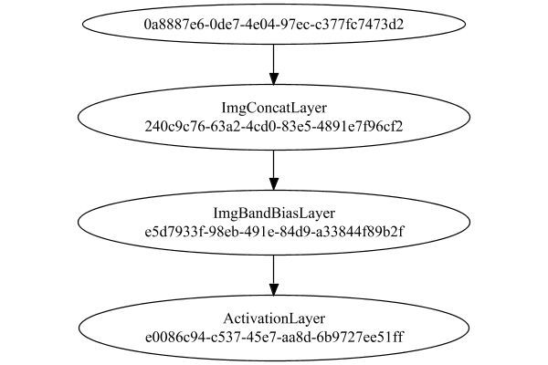
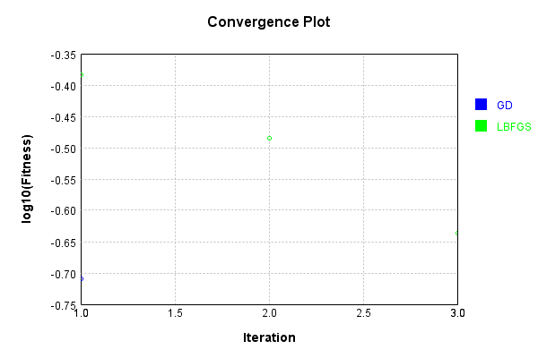
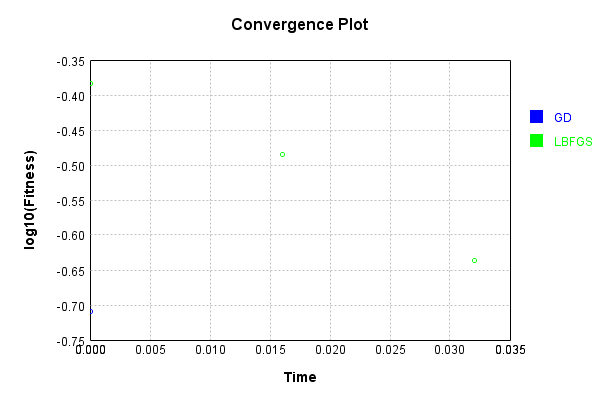
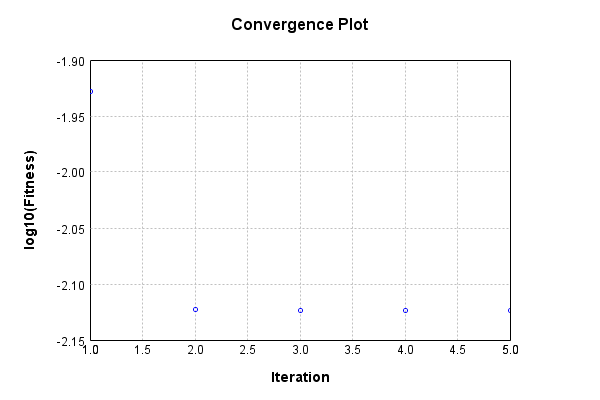
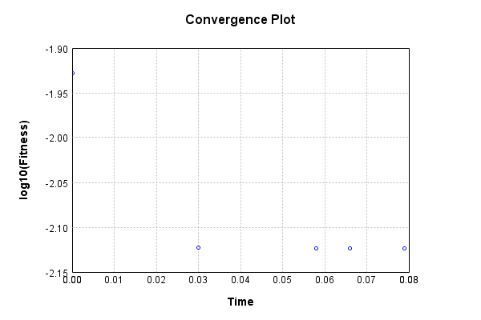
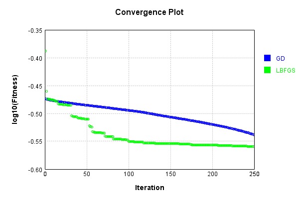
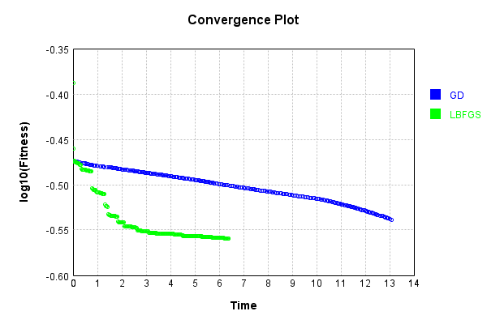

# PipelineNetwork
## Double
### Network Diagram
This is a network with the following layout:

Code from [StandardLayerTests.java:72](../../../../../../../../src/main/java/com/simiacryptus/mindseye/test/unit/StandardLayerTests.java#L72) executed in 1.67 seconds: 
```java
    return Graphviz.fromGraph(TestUtil.toGraph((DAGNetwork) layer))
      .height(400).width(600).render(Format.PNG).toImage();
```

Returns: 




### Json Serialization
Code from [JsonTest.java:36](../../../../../../../../src/main/java/com/simiacryptus/mindseye/test/unit/JsonTest.java#L36) executed in 0.00 seconds: 
```java
    JsonObject json = layer.getJson();
    NNLayer echo = NNLayer.fromJson(json);
    if ((echo == null)) throw new AssertionError("Failed to deserialize");
    if ((layer == echo)) throw new AssertionError("Serialization did not copy");
    if ((!layer.equals(echo))) throw new AssertionError("Serialization not equal");
    return new GsonBuilder().setPrettyPrinting().create().toJson(json);
```

Returns: 

```
    {
      "class": "com.simiacryptus.mindseye.network.PipelineNetwork",
      "id": "afae2f6f-2ee7-48dd-9a91-eefbac825368",
      "isFrozen": false,
      "name": "PipelineNetwork/afae2f6f-2ee7-48dd-9a91-eefbac825368",
      "inputs": [
        "0a8887e6-0de7-4e04-97ec-c377fc7473d2"
      ],
      "nodes": {
        "0fbccba4-b89b-47c5-b563-c311446758c3": "240c9c76-63a2-4cd0-83e5-4891e7f96cf2",
        "dfeb9d0a-8d6b-4851-9c05-a251a459516d": "e5d7933f-98eb-491e-84d9-a33844f89b2f",
        "bf120aa3-9868-497b-96bb-a50b9a843d70": "e0086c94-c537-45e7-aa8d-6b9727ee51ff"
      },
      "layers": {
        "240c9c76-63a2-4cd0-83e5-4891e7f96cf2": {
          "class": "com.simiacryptus.mindseye.layers.cudnn.ImgConcatLayer",
          "id": "240c9c76-63a2-4cd0-83e5-4891e7f96cf2",
          "isFrozen": false,
          "name": "ImgConcatLayer/240c9c76-63a2-4cd0-83e5-4891e7f96cf2",
          "maxBands": -1,
          "precision": "Double"
        },
        "e5d7933f-98eb-491e-84d9-a33844f89b2f": {
          "class": "com.simiacryptus.mindseye.layers.cudnn.ImgBandBiasLayer",
          "id": "e5d7933f-98eb-491e-84d9-a33844f89b2f",
          "isFrozen": false,
          "name": "ImgBandBiasLayer/e5d7933f-98eb-491e-84d9-a33844f89b2f",
          "bias": [
            -0.072,
            -0.112,
            -1.78
          ],
          "precision": "Double"
        },
        "e0086c94-c537-45e7-aa8d-6b9727ee51ff": {
          "class": "com.simiacryptus.mindseye.layers.cudnn.ActivationLayer",
          "id": "e0086c94-c537-45e7-aa8d-6b9727ee51ff",
          "isFrozen": false,
          "name": "ActivationLayer/e0086c94-c537-45e7-aa8d-6b9727ee51ff",
          "mode": 1,
          "precision": "Double"
        }
      },
      "links": {
        "0fbccba4-b89b-47c5-b563-c311446758c3": [
          "0a8887e6-0de7-4e04-97ec-c377fc7473d2"
        ],
        "dfeb9d0a-8d6b-4851-9c05-a251a459516d": [
          "0fbccba4-b89b-47c5-b563-c311446758c3"
        ],
        "bf120aa3-9868-497b-96bb-a50b9a843d70": [
          "dfeb9d0a-8d6b-4851-9c05-a251a459516d"
        ]
      },
      "labels": {},
      "head": "bf120aa3-9868-497b-96bb-a50b9a843d70"
    }
```


### Example Input/Output Pair
Code from [ReferenceIO.java:68](../../../../../../../../src/main/java/com/simiacryptus/mindseye/test/unit/ReferenceIO.java#L68) executed in 0.00 seconds: 
```java
    SimpleEval eval = SimpleEval.run(layer, inputPrototype);
    return String.format("--------------------\nInput: \n[%s]\n--------------------\nOutput: \n%s\n--------------------\nDerivative: \n%s",
      Arrays.stream(inputPrototype).map(t -> t.prettyPrint()).reduce((a, b) -> a + ",\n" + b).get(),
      eval.getOutput().prettyPrint(),
      Arrays.stream(eval.getDerivative()).map(t -> t.prettyPrint()).reduce((a, b) -> a + ",\n" + b).get());
```

Returns: 

```
    --------------------
    Input: 
    [[
    	[ [ 1.732, 0.172, 1.9 ] ]
    ]]
    --------------------
    Output: 
    [
    	[ [ 1.66, 0.059999999999999984, 0.11999999999999988 ] ]
    ]
    --------------------
    Derivative: 
    [
    	[ [ 1.0, 1.0, 1.0 ] ]
    ]
```


[GPU Log](etc/cuda.log)

### Batch Execution
Code from [BatchingTester.java:66](../../../../../../../../src/main/java/com/simiacryptus/mindseye/test/unit/BatchingTester.java#L66) executed in 0.02 seconds: 
```java
    return test(reference, inputPrototype);
```

Returns: 

```
    ToleranceStatistics{absoluteTol=0.0000e+00 +- 0.0000e+00 [0.0000e+00 - 0.0000e+00] (60#), relativeTol=0.0000e+00 +- 0.0000e+00 [0.0000e+00 - 0.0000e+00] (24#)}
```


Code from [SingleDerivativeTester.java:77](../../../../../../../../src/main/java/com/simiacryptus/mindseye/test/unit/SingleDerivativeTester.java#L77) executed in 0.03 seconds: 
```java
    return test(component, inputPrototype);
```
Logging: 
```
    Inputs: [
    	[ [ -1.252, -1.792, -0.572 ] ]
    ]
    Inputs Statistics: {meanExponent=0.03611278766451382, negative=3, min=-0.572, max=-0.572, mean=-1.2053333333333334, count=3.0, positive=0, stdDev=0.4991548412622636, zeros=0}
    Output: [
    	[ [ 0.0, 0.0, 0.0 ] ]
    ]
    Outputs Statistics: {meanExponent=NaN, negative=0, min=0.0, max=0.0, mean=0.0, count=3.0, positive=0, stdDev=0.0, zeros=3}
    Feedback for input 0
    Inputs Values: [
    	[ [ -1.252, -1.792, -0.572 ] ]
    ]
    Value Statistics: {meanExponent=0.03611278766451382, negative=3, min=-0.572, max=-0.572, mean=-1.2053333333333334, count=3.0, positive=0, stdDev=0.4991548412622636, zeros=0}
    Implemented Feedback: [ [ 0.0, 0.0, 0.0 ], [ 0.0, 0.0, 0.0 ], [ 0.0, 0.0, 0.0 ] ]
    Implemented Statistics: {meanExponent=NaN, negative=0, min=0.0, max=0.0, mean=0.0, count=9.0, positive=0, stdDev=0.0, zeros=9}
    Measured Feedback: [ [ 0.0, 0.0, 0.0 ], [ 0.0, 0.0, 0.0 ], [ 0.0, 0.0, 0.0 ] ]
    Measured Statistics: {meanExponent=NaN, negative=0, min=0.0, max=0.0, mean=0.0, count=9.0, positive=0, 
```
...[skipping 62 bytes](etc/109.txt)...
```
    .0, 0.0, 0.0 ], [ 0.0, 0.0, 0.0 ] ]
    Error Statistics: {meanExponent=NaN, negative=0, min=0.0, max=0.0, mean=0.0, count=9.0, positive=0, stdDev=0.0, zeros=9}
    Learning Gradient for weight set 0
    Weights: [ -0.072, -0.112, -1.78 ]
    Implemented Gradient: [ [ 0.0, 0.0, 0.0 ], [ 0.0, 0.0, 0.0 ], [ 0.0, 0.0, 0.0 ] ]
    Implemented Statistics: {meanExponent=NaN, negative=0, min=0.0, max=0.0, mean=0.0, count=9.0, positive=0, stdDev=0.0, zeros=9}
    Measured Gradient: [ [ 0.0, 0.0, 0.0 ], [ 0.0, 0.0, 0.0 ], [ 0.0, 0.0, 0.0 ] ]
    Measured Statistics: {meanExponent=NaN, negative=0, min=0.0, max=0.0, mean=0.0, count=9.0, positive=0, stdDev=0.0, zeros=9}
    Gradient Error: [ [ 0.0, 0.0, 0.0 ], [ 0.0, 0.0, 0.0 ], [ 0.0, 0.0, 0.0 ] ]
    Error Statistics: {meanExponent=NaN, negative=0, min=0.0, max=0.0, mean=0.0, count=9.0, positive=0, stdDev=0.0, zeros=9}
    Finite-Difference Derivative Accuracy:
    absoluteTol: 0.0000e+00 +- 0.0000e+00 [0.0000e+00 - 0.0000e+00] (18#)
    relativeTol: 0.0000e+00 +- 0.0000e+00 [Infinity - -Infinity] (0#)
    
```

Returns: 

```
    ToleranceStatistics{absoluteTol=0.0000e+00 +- 0.0000e+00 [0.0000e+00 - 0.0000e+00] (18#), relativeTol=0.0000e+00 +- 0.0000e+00 [Infinity - -Infinity] (0#)}
```


### Performance
Adding performance wrappers

Code from [TestUtil.java:302](../../../../../../../../src/main/java/com/simiacryptus/mindseye/test/TestUtil.java#L302) executed in 0.00 seconds: 
```java
    network.visitNodes(node -> {
      if (!(node.getLayer() instanceof MonitoringWrapperLayer)) {
        node.setLayer(new MonitoringWrapperLayer(node.getLayer()).shouldRecordSignalMetrics(false));
      }
      else {
        ((MonitoringWrapperLayer) node.getLayer()).shouldRecordSignalMetrics(false);
      }
    });
```

Now we execute larger-scale runs to benchmark performance:

Code from [PerformanceTester.java:66](../../../../../../../../src/main/java/com/simiacryptus/mindseye/test/unit/PerformanceTester.java#L66) executed in 1.38 seconds: 
```java
    test(component, inputPrototype);
```
Logging: 
```
    100 batches
    Input Dimensions:
    	[100, 100, 3]
    Performance:
    	Evaluation performance: 0.087634s +- 0.022158s [0.065231s - 0.126667s]
    	Learning performance: 0.108117s +- 0.029648s [0.080843s - 0.160607s]
    
```

Per-layer Performance Metrics:

Code from [TestUtil.java:267](../../../../../../../../src/main/java/com/simiacryptus/mindseye/test/TestUtil.java#L267) executed in 0.00 seconds: 
```java
    Map<NNLayer, MonitoringWrapperLayer> metrics = new HashMap<>();
    network.visitNodes(node -> {
      if ((node.getLayer() instanceof MonitoringWrapperLayer)) {
        MonitoringWrapperLayer layer = node.getLayer();
        metrics.put(layer.getInner(), layer);
      }
    });
    System.out.println("Forward Performance: \n\t" + metrics.entrySet().stream().map(e -> {
      PercentileStatistics performance = e.getValue().getForwardPerformance();
      return String.format("%s -> %.6fs +- %.6fs (%s)", e.getKey(), performance.getMean(), performance.getStdDev(), performance.getCount());
    }).reduce((a, b) -> a + "\n\t" + b));
    System.out.println("Backward Performance: \n\t" + metrics.entrySet().stream().map(e -> {
      PercentileStatistics performance = e.getValue().getBackwardPerformance();
      return String.format("%s -> %.6fs +- %.6fs (%s)", e.getKey(), performance.getMean(), performance.getStdDev(), performance.getCount());
    }).reduce((a, b) -> a + "\n\t" + b));
```
Logging: 
```
    Forward Performance: 
    	Optional[ImgBandBiasLayer/a3022a66-a228-4174-966e-f654542960ea -> 0.025934s +- 0.019030s (11.0)
    	ImgConcatLayer/9f59dc87-61c6-48f7-98dd-7cfc72181dca -> 0.017395s +- 0.005562s (11.0)
    	ActivationLayer/64533ee1-671f-4fcd-afce-b9d883e1d248 -> 0.031833s +- 0.020879s (11.0)]
    Backward Performance: 
    	Optional[ImgBandBiasLayer/a3022a66-a228-4174-966e-f654542960ea -> 0.000068s +- 0.000081s (6.0)
    	ImgConcatLayer/9f59dc87-61c6-48f7-98dd-7cfc72181dca -> 0.000087s +- 0.000000s (1.0)
    	ActivationLayer/64533ee1-671f-4fcd-afce-b9d883e1d248 -> 0.000249s +- 0.000065s (6.0)]
    
```

Removing performance wrappers

Code from [TestUtil.java:285](../../../../../../../../src/main/java/com/simiacryptus/mindseye/test/TestUtil.java#L285) executed in 0.00 seconds: 
```java
    network.visitNodes(node -> {
      if (node.getLayer() instanceof MonitoringWrapperLayer) {
        node.setLayer(node.<MonitoringWrapperLayer>getLayer().getInner());
      }
    });
```

### Input Learning
In this test, we use a network to learn this target input, given it's pre-evaluated output:

Code from [LearningTester.java:127](../../../../../../../../src/main/java/com/simiacryptus/mindseye/test/unit/LearningTester.java#L127) executed in 0.01 seconds: 
```java
    return Arrays.stream(input_target).map(x -> x.prettyPrint()).reduce((a, b) -> a + "\n" + b).orElse("");
```

Returns: 

```
    [
    	[ [ 0.824, 1.656, -1.044 ], [ 1.36, 0.524, -0.336 ], [ 1.076, -0.932, 0.824 ], [ -1.532, 0.176, 1.084 ], [ 0.228, 1.688, -1.624 ], [ -1.7, 0.116, 1.916 ], [ 1.012, 1.932, -0.552 ], [ -1.16, 1.792, -0.504 ], ... ],
    	[ [ 0.52, 1.608, 0.156 ], [ -0.952, 0.0, -0.308 ], [ -0.276, -0.644, -0.18 ], [ 0.536, 0.236, 1.604 ], [ -1.064, -0.044, -0.012 ], [ -1.252, -0.576, -0.516 ], [ 0.288, 1.308, -0.072 ], [ -1.984, 1.024, -1.664 ], ... ],
    	[ [ 0.924, -0.496, 1.648 ], [ -1.6, 0.944, -0.692 ], [ -1.188, 0.476, -0.904 ], [ 1.276, -0.66, -0.828 ], [ 0.792, 0.128, 0.536 ], [ 0.988, 0.908, 0.944 ], [ 1.792, -1.592, -1.368 ], [ 1.18, 1.2, 1.312 ], ... ],
    	[ [ -1.276, 1.092, 1.164 ], [ 1.828, 0.128, 0.672 ], [ -0.196, 0.588, 1.584 ], [ 0.696, -0.4, -0.704 ], [ -0.152, -1.208, 1.728 ], [ 0.316, -1.724, -0.672 ], [ -1.948, -0.044, -0.728 ], [ -0.56, 1.664, 1.732 ], ... ],
    	[ [ 0.12, 0.064, -0.872 ], [ 1.116, -0.984, 1.056 ], [ 0.832, -1.82, -1.12 ], [ 1.332, -1.156, -0.156 ], [ 0.184, 0.856, -0.936 ], [ 0.276, -1.724, 1.46 ], [ 1.672, -0.532, -0.48 ], [ -0.368, 0.64, 0.008 ], ... ],
    	[ [ -0.26, 1.808, -0.096 ], [ 0.656, 1.376, 0.58 ], [ -1.456, -1.152, 0.008 ], [ -1.932, -0.98, -1.044 ], [ 0.6, -1.28, -0.532 ], [ -0.744, -1.484, -0.72 ], [ 1.492, -0.724, 0.044 ], [ 0.768, 0.972, 0.956 ], ... ],
    	[ [ -0.556, 0.672, -1.724 ], [ -0.276, -1.956, 1.544 ], [ -0.668, -1.192, 1.392 ], [ 0.132, 1.02, 0.76 ], [ -1.016, -1.944, -1.732 ], [ 0.728, -0.232, -0.108 ], [ 0.052, -0.888, 1.956 ], [ -0.132, 0.552, 1.068 ], ... ],
    	[ [ -1.28, -0.064, 0.992 ], [ 1.628, -0.156, -0.504 ], [ -0.924, 1.14, -0.808 ], [ 1.94, 0.924, -1.844 ], [ 0.452, -1.8, 0.132 ], [ -0.464, 1.272, 0.612 ], [ -1.724, 0.28, -0.312 ], [ -0.5, 0.776, 1.104 ], ... ],
    	...
    ]
```


First, we use a conjugate gradient descent method, which converges the fastest for purely linear functions.

Code from [LearningTester.java:300](../../../../../../../../src/main/java/com/simiacryptus/mindseye/test/unit/LearningTester.java#L300) executed in 0.11 seconds: 
```java
    return new IterativeTrainer(trainable)
      .setLineSearchFactory(label -> new QuadraticSearch())
      .setOrientation(new GradientDescent())
      .setMonitor(monitor)
      .setTimeout(30, TimeUnit.SECONDS)
      .setMaxIterations(250)
      .setTerminateThreshold(0)
      .run();
```
Logging: 
```
    Constructing line search parameters: GD
    F(0.0) = LineSearchPoint{point=PointSample{avg=0.46702736960000746}, derivative=-3.62456280888889E-5}
    New Minimum: 0.46702736960000746 > 0.4670273696000054
    F(1.0E-10) = LineSearchPoint{point=PointSample{avg=0.4670273696000054}, derivative=-3.6245628088888655E-5}, delta = -2.0539125955565396E-15
    New Minimum: 0.4670273696000054 > 0.46702736959998575
    F(7.000000000000001E-10) = LineSearchPoint{point=PointSample{avg=0.46702736959998575}, derivative=-3.6245628088887204E-5}, delta = -2.170486013142181E-14
    New Minimum: 0.46702736959998575 > 0.4670273695998301
    F(4.900000000000001E-9) = LineSearchPoint{point=PointSample{avg=0.4670273695998301}, derivative=-3.6245628088877054E-5}, delta = -1.7735812818386876E-13
    New Minimum: 0.4670273695998301 > 0.4670273695987613
    F(3.430000000000001E-8) = LineSearchPoint{point=PointSample{avg=0.4670273695987613}, derivative=-3.624562808880601E-5}, delta = -1.246169833990507E-12
    New Minimum: 0.4670273695987613 > 0.46702736959130225
    F(2.
```
...[skipping 1623 bytes](etc/110.txt)...
```
    020270225747 > 0.46697720329984954
    F(1.3841287201) = LineSearchPoint{point=PointSample{avg=0.46697720329984954}, derivative=-3.624228351456784E-5}, delta = -5.016630015791668E-5
    Loops = 12
    New Minimum: 0.46697720329984954 > 0.19518515893333196
    F(14999.999999990961) = LineSearchPoint{point=PointSample{avg=0.19518515893333196}, derivative=-2.18369157891887E-17}, delta = -0.27184221066667547
    Right bracket at 14999.999999990961
    Converged to right
    Iteration 1 complete. Error: 0.19518515893333196 Total: 249585929034451.1600; Orientation: 0.0011; Line Search: 0.0818
    Zero gradient: 3.6271330782616634E-15
    F(0.0) = LineSearchPoint{point=PointSample{avg=0.19518515893333196}, derivative=-1.315609436741993E-29}
    F(14999.999999990961) = LineSearchPoint{point=PointSample{avg=0.19518515893333196}, derivative=0.0}, delta = 0.0
    0.19518515893333196 <= 0.19518515893333196
    Converged to right
    Iteration 2 failed, aborting. Error: 0.19518515893333196 Total: 249585942392528.0600; Orientation: 0.0010; Line Search: 0.0087
    
```

Returns: 

```
    0.19518515893333196
```


This training run resulted in the following regressed input:

Code from [LearningTester.java:144](../../../../../../../../src/main/java/com/simiacryptus/mindseye/test/unit/LearningTester.java#L144) executed in 0.01 seconds: 
```java
    return Arrays.stream(input_gd).map(x -> x.prettyPrint()).reduce((a, b) -> a + "\n" + b).orElse("");
```

Returns: 

```
    [
    	[ [ 0.824, -0.776, -0.784 ], [ -0.168, -1.82, 0.008 ], [ 1.076, 0.168, 0.972 ], [ 0.156, -1.86, 0.204 ], [ -0.38, -1.824, -1.808 ], [ -1.412, 0.168, 1.916 ], [ 1.012, 1.932, -0.032 ], [ 0.156, -0.5, 0.188 ], ... ],
    	[ [ 0.084, -1.388, -1.384 ], [ 0.156, 0.168, -1.392 ], [ 0.156, -1.104, 0.028 ], [ 0.536, 0.236, -1.02 ], [ -0.244, 0.168, 0.668 ], [ -1.32, -1.644, -1.988 ], [ 0.288, 1.308, 1.348 ], [ -0.544, 1.024, 1.096 ], ... ],
    	[ [ -0.32, 0.168, -0.088 ], [ -0.84, 0.944, -1.764 ], [ -0.2, -1.616, -1.148 ], [ -1.396, -1.616, -0.46 ], [ 0.792, 0.168, -1.0 ], [ 0.988, 0.908, 1.348 ], [ 1.792, -1.592, -0.192 ], [ 1.18, -0.82, -1.252 ], ... ],
    	[ [ 0.156, -1.136, -1.224 ], [ 1.828, -1.364, 1.348 ], [ -1.364, 0.588, 1.236 ], [ -0.072, 0.168, 1.348 ], [ -1.592, -1.6, 1.32 ], [ -0.424, -0.728, -1.916 ], [ 0.156, -0.164, 0.584 ], [ 0.156, -1.032, 1.732 ], ... ],
    	[ [ 0.156, 0.168, 1.068 ], [ -0.384, 0.168, -0.04 ], [ -1.708, -0.848, 1.192 ], [ 1.332, -0.936, 0.02 ], [ 0.184, 0.856, 0.952 ], [ 0.276, -0.608, 0.952 ], [ 0.008, 0.168, -1.124 ], [ 0.156, 0.168, -0.836 ], ... ],
    	[ [ -0.192, -1.436, -1.952 ], [ 0.656, 1.376, 1.348 ], [ -1.616, 0.168, 1.348 ], [ -1.472, 0.168, -0.072 ], [ -1.456, 0.168, -1.924 ], [ -0.916, 0.168, 1.3 ], [ 1.492, -0.432, 0.816 ], [ -0.836, -0.456, 1.348 ], ... ],
    	[ [ 0.156, -1.324, -0.988 ], [ 0.156, -0.856, 1.544 ], [ 0.156, -0.052, -0.848 ], [ -1.524, -1.7, -1.1 ], [ -0.748, 0.168, 0.408 ], [ 0.728, 0.168, 0.46 ], [ 0.156, -1.716, -1.824 ], [ 0.156, -0.148, -1.24 ], ... ],
    	[ [ -1.088, -1.836, 1.24 ], [ 1.628, 0.168, -0.468 ], [ 0.156, -0.612, -0.896 ], [ -0.588, -1.724, -1.632 ], [ -1.3, -0.88, 0.336 ], [ -0.08, -1.46, 0.504 ], [ 0.02, -0.296, -0.84 ], [ -1.356, 0.776, -0.792 ], ... ],
    	...
    ]
```


Next, we run the same optimization using L-BFGS, which is nearly ideal for purely second-order or quadratic functions.

Code from [LearningTester.java:324](../../../../../../../../src/main/java/com/simiacryptus/mindseye/test/unit/LearningTester.java#L324) executed in 0.10 seconds: 
```java
    return new IterativeTrainer(trainable)
      .setLineSearchFactory(label -> new ArmijoWolfeSearch())
      .setOrientation(new LBFGS())
      .setMonitor(monitor)
      .setTimeout(30, TimeUnit.SECONDS)
      .setMaxIterations(250)
      .setTerminateThreshold(0)
      .run();
```
Logging: 
```
    LBFGS Accumulation History: 1 points
    Constructing line search parameters: GD
    th(0)=0.46702736960000746;dx=-3.62456280888889E-5
    New Minimum: 0.46702736960000746 > 0.4669492863693921
    WOLFE (weak): th(2.154434690031884)=0.4669492863693921; dx=-3.624042216632111E-5 delta=7.80832306153667E-5
    New Minimum: 0.4669492863693921 > 0.46687121435461104
    WOLFE (weak): th(4.308869380063768)=0.46687121435461104; dx=-3.623521624375333E-5 delta=1.5615524539641656E-4
    New Minimum: 0.46687121435461104 > 0.4665590384536655
    WOLFE (weak): th(12.926608140191302)=0.4665590384536655; dx=-3.6214392553482215E-5 delta=4.683311463419826E-4
    New Minimum: 0.4665590384536655 > 0.46515646763180435
    WOLFE (weak): th(51.70643256076521)=0.46515646763180435; dx=-3.612068594726218E-5 delta=0.0018709019682031092
    New Minimum: 0.46515646763180435 > 0.45773746288325035
    WOLFE (weak): th(258.53216280382605)=0.45773746288325035; dx=-3.5620917380755326E-5 delta=0.009289906716757113
    New Minimum: 0.45773746288325035 > 0.41371054645699173
    END: th(1
```
...[skipping 204 bytes](etc/111.txt)...
```
     0.0374
    LBFGS Accumulation History: 1 points
    th(0)=0.41371054645699173;dx=-2.9136718336487207E-5
    New Minimum: 0.41371054645699173 > 0.3271844680765733
    END: th(3341.943960201201)=0.3271844680765733; dx=-2.264516634550674E-5 delta=0.08652607838041843
    Iteration 2 complete. Error: 0.3271844680765733 Total: 249586014244984.0000; Orientation: 0.0014; Line Search: 0.0110
    LBFGS Accumulation History: 1 points
    th(0)=0.3271844680765733;dx=-1.7599907885765555E-5
    New Minimum: 0.3271844680765733 > 0.23087777212566157
    END: th(7200.000000000001)=0.23087777212566157; dx=-9.151952100598087E-6 delta=0.09630669595091174
    Iteration 3 complete. Error: 0.23087777212566157 Total: 249586030905391.0000; Orientation: 0.0017; Line Search: 0.0112
    LBFGS Accumulation History: 1 points
    th(0)=0.23087777212566157;dx=-4.759015092311003E-6
    MAX ALPHA: th(0)=0.23087777212566157;th'(0)=-4.759015092311003E-6;
    Iteration 4 failed, aborting. Error: 0.23087777212566157 Total: 249586048456069.9700; Orientation: 0.0014; Line Search: 0.0113
    
```

Returns: 

```
    0.23087777212566157
```


This training run resulted in the following regressed input:

Code from [LearningTester.java:154](../../../../../../../../src/main/java/com/simiacryptus/mindseye/test/unit/LearningTester.java#L154) executed in 0.01 seconds: 
```java
    return Arrays.stream(input_lbgfs).map(x -> x.prettyPrint()).reduce((a, b) -> a + "\n" + b).orElse("");
```

Returns: 

```
    [
    	[ [ 1.0544559056124911, -0.776, -0.784 ], [ -0.168, -1.82, 0.008 ], [ 0.9832378744704439, 0.814436062284095, 0.972 ], [ 0.24731271731815693, -1.86, 0.204 ], [ -0.38, -1.824, -1.808 ], [ -1.412, 0.3636701085389078, 1.939190531382389 ], [ 1.2917357848000681, 1.4928293119460072, -0.032 ], [ 0.6705399150467575, -0.5, 0.188 ], ... ],
    	[ [ 0.084, -1.388, -1.384 ], [ 0.7719984898447094, 0.8158854704954944, -1.392 ], [ 0.19078579707358362, -1.104, 0.028 ], [ 0.7447147824415016, 0.6316884417120134, -1.02 ], [ -0.244, 0.4201970287834811, 0.668 ], [ -1.32, -1.644, -1.988 ], [ 0.29524704105699656, 1.4790301689451195, 1.5799053138238908 ], [ -0.544, 0.8558686474776793, 1.096 ], ... ],
    	[ [ -0.32, 0.4549828258570647, -0.088 ], [ -0.84, 0.7918121378030717, -1.764 ], [ -0.2, -1.616, -1.148 ], [ -1.396, -1.616, -0.46 ], [ 0.5774875847129012, 0.6129683208995901, -1.0 ], [ 1.3518014610612283, 0.6775440943875087, 1.571208864555495 ], [ 1.3368858216206148, -1.592, -0.192 ], [ 1.4742298669140612, -0.82, -1.252 ], ... ],
    	[ [ 0.
```
...[skipping 586 bytes](etc/112.txt)...
```
    .1839434903253925, -1.124 ], [ 0.5415425842322181, 0.168, -0.836 ], ... ],
    	[ [ -0.192, -1.436, -1.952 ], [ 0.9806674393534469, 1.2832378744704438, 1.4914914129285324 ], [ -1.616, 0.32888431146532415, 1.5465689249617065 ], [ -1.472, 0.168, -0.072 ], [ -1.456, 0.2709079830093515, -1.924 ], [ -0.916, 0.38541123170989755, 1.3 ], [ 1.4195295894300342, -0.432, 0.816 ], [ -0.836, -0.456, 1.3552470410569966 ], ... ],
    	[ [ 0.4879144804104435, -1.324, -0.988 ], [ 0.5879236469969964, -0.856, 1.630964492683959 ], [ 0.5966200962653923, -0.052, -0.848 ], [ -1.524, -1.7, -1.1 ], [ -0.748, 0.3767147824415016, 0.408 ], [ 0.9715005795150851, 0.44338756016587016, 0.46 ], [ 0.6024177291109895, -1.716, -1.824 ], [ 0.2502115337409556, -0.148, -1.24 ], ... ],
    	[ [ -1.088, -1.836, 1.24 ], [ 1.2004245776372016, 0.2535150844725597, -0.468 ], [ 0.3400748428477132, -0.612, -0.896 ], [ -0.588, -1.724, -1.632 ], [ -1.3, -0.88, 0.336 ], [ -0.08, -1.46, 0.504 ], [ 0.02, -0.296, -0.84 ], [ -1.356, 0.9731195167503071, -0.792 ], ... ],
    	...
    ]
```


Code from [LearningTester.java:96](../../../../../../../../src/main/java/com/simiacryptus/mindseye/test/unit/LearningTester.java#L96) executed in 0.01 seconds: 
```java
    return TestUtil.compare(runs);
```

Returns: 




Code from [LearningTester.java:99](../../../../../../../../src/main/java/com/simiacryptus/mindseye/test/unit/LearningTester.java#L99) executed in 0.00 seconds: 
```java
    return TestUtil.compareTime(runs);
```

Returns: 




### Model Learning
In this test, attempt to train a network to emulate a randomized network given an example input/output. The target state is:

Code from [LearningTester.java:176](../../../../../../../../src/main/java/com/simiacryptus/mindseye/test/unit/LearningTester.java#L176) executed in 0.00 seconds: 
```java
    return network_target.state().stream().map(Arrays::toString).reduce((a, b) -> a + "\n" + b).orElse("");
```

Returns: 

```
    [-1.348, -0.168, -0.156]
```


First, we use a conjugate gradient descent method, which converges the fastest for purely linear functions.

Code from [LearningTester.java:300](../../../../../../../../src/main/java/com/simiacryptus/mindseye/test/unit/LearningTester.java#L300) executed in 0.18 seconds: 
```java
    return new IterativeTrainer(trainable)
      .setLineSearchFactory(label -> new QuadraticSearch())
      .setOrientation(new GradientDescent())
      .setMonitor(monitor)
      .setTimeout(30, TimeUnit.SECONDS)
      .setMaxIterations(250)
      .setTerminateThreshold(0)
      .run();
```
Logging: 
```
    Constructing line search parameters: GD
    F(0.0) = LineSearchPoint{point=PointSample{avg=0.2465128528000038}, derivative=-0.07633186920512003}
    New Minimum: 0.2465128528000038 > 0.24651285279237276
    F(1.0E-10) = LineSearchPoint{point=PointSample{avg=0.24651285279237276}, derivative=-0.07640480688846954}, delta = -7.631034693034167E-12
    New Minimum: 0.24651285279237276 > 0.2465128527465481
    F(7.000000000000001E-10) = LineSearchPoint{point=PointSample{avg=0.2465128527465481}, derivative=-0.07640480687656663}, delta = -5.345568432346681E-11
    New Minimum: 0.2465128527465481 > 0.2465128524256127
    F(4.900000000000001E-9) = LineSearchPoint{point=PointSample{avg=0.2465128524256127}, derivative=-0.07640480679324624}, delta = -3.7439110145420784E-10
    New Minimum: 0.2465128524256127 > 0.24651285017932692
    F(3.430000000000001E-8) = LineSearchPoint{point=PointSample{avg=0.24651285017932692}, derivative=-0.07640480621000369}, delta = -2.6206768699577054E-9
    New Minimum: 0.24651285017932692 > 0.2465128344551856
    F(2.40100000
```
...[skipping 6907 bytes](etc/113.txt)...
```
    001}, derivative=-1.480916805346376E-19}, delta = -1.3119713648812592E-14
    Left bracket at 3.249505544621467
    Converged to left
    Iteration 5 complete. Error: 0.007529017600000001 Total: 249586451151338.5600; Orientation: 0.0001; Line Search: 0.0103
    Zero gradient: 4.1827110975774334E-12
    F(0.0) = LineSearchPoint{point=PointSample{avg=0.007529017600000001}, derivative=-1.7495072125797415E-23}
    F(3.249505544621467) = LineSearchPoint{point=PointSample{avg=0.007529017600000001}, derivative=-1.8540833600141655E-25}, delta = 0.0
    F(22.74653881235027) = LineSearchPoint{point=PointSample{avg=0.007529017600000001}, derivative=1.0386975760359138E-22}, delta = 0.0
    0.007529017600000001 <= 0.007529017600000001
    F(3.27897577924054) = LineSearchPoint{point=PointSample{avg=0.007529017600000001}, derivative=-2.8338421897942443E-26}, delta = 0.0
    Left bracket at 3.27897577924054
    Converged to left
    Iteration 6 failed, aborting. Error: 0.007529017600000001 Total: 249586465576374.5600; Orientation: 0.0001; Line Search: 0.0122
    
```

Returns: 

```
    0.007529017600000001
```


This training run resulted in the following configuration:

Code from [LearningTester.java:189](../../../../../../../../src/main/java/com/simiacryptus/mindseye/test/unit/LearningTester.java#L189) executed in 0.00 seconds: 
```java
    return network_gd.state().stream().map(Arrays::toString).reduce((a, b) -> a + "\n" + b).orElse("");
```

Returns: 

```
    [0.0, 0.0, 0.0, 0.0, 0.0, 0.0, 0.0, 0.0, 0.0, 0.0, 0.0, 0.0, 0.0, 0.244, 0.0, 0.0, 0.0, 0.0, 0.2999999999999998, 0.1359999999999999, 0.0, 0.0, 0.0, 0.0, 0.0, 0.0, 0.0, 0.0, 0.0, 0.0, 0.0, 0.0, 0.4159999999999999, 0.0, 0.0, 0.2999999999999998, 0.0, 0.33999999999999986, 0.0, 0.42799999999999994, 0.0, 0.5599999999999998, 0.0, 0.0, 0.0, 0.0, 0.20799999999999996, 0.0, 0.0, 0.0, 0.0, 0.0, 0.0, 0.07599999999999985, 0.0, 0.0, 0.0, 0.0, 0.0, 0.0, 0.0, 0.31199999999999983, 0.07199999999999984, 0.0, 0.0, 0.5879999999999999, 0.0, 0.0, 0.0, 0.0, 0.0, 0.0, 0.0, 0.0, 0.0, 0.0, 0.0, 0.0, 0.0, 0.33599999999999985, 0.0, 0.0, 0.0, 0.0, 0.11599999999999988, 0.0, 0.0, 0.0, 0.0, 0.0, 0.3919999999999999, 0.0, 0.0, 0.0, 0.0, 0.0, 0.0, 0.0, 0.0, 0.0, 0.0, 0.0, 0.0, 0.0, 0.10399999999999987, 0.18799999999999994, 0.0, 0.0, 0.0, 0.0, 0.0, 0.0, 0.0, 0.0, 0.0, 0.0, 0.08399999999999985, 0.0, 0.0, 0.0, 0.236, 0.0, 0.0, 0.0, 0.0, 0.0, 0.0, 0.0, 0.0, 0.0, 0.0, 0.0, 0.0, 0.0, 0.0, 0.0, 0.0, 0.0, 0.0, 0.0, 0.0, 0.0, 0.0, 0.16799999999999993, 0.
```
...[skipping 235851 bytes](etc/114.txt)...
```
    00002, 0.396, 1.4280000000000002, 1.6, 0.0, 1.616, 1.6960000000000002, 1.1640000000000001, 0.0, 1.1, 0.0, 0.0, 0.0, 0.0, 0.0, 1.1840000000000002, 0.0, 0.0, 1.7160000000000002, 0.0, 0.0, 0.0, 0.0, 0.704, 0.0, 0.896, 0.0, 1.248, 1.2040000000000002, 0.10800000000000001, 0.0, 1.7120000000000002, 0.032, 0.0, 0.752, 0.0, 0.844, 0.0, 0.0, 0.0, 0.348, 1.1440000000000001, 0.0, 0.0, 0.0, 1.8, 0.728, 0.0, 1.544, 0.4119999999999999, 1.3960000000000001, 0.0, 0.0, 0.0, 1.24, 0.0, 0.0, 0.0, 0.0, 0.0, 0.736, 0.0, 0.6799999999999999, 0.0, 0.5319999999999999, 0.0, 0.0, 0.42399999999999993, 0.5399999999999999, 0.0, 0.488, 0.0, 0.0, 0.62, 0.0, 1.4320000000000002, 1.6280000000000001, 1.3920000000000001, 0.0, 1.228, 0.0, 0.356, 1.7000000000000002, 0.0, 0.0, 0.0, 0.0, 0.0, 0.0, 0.72, 1.4160000000000001, 0.0, 0.472, 0.0, 0.716, 0.0, 0.0, 0.18799999999999997, 0.368, 0.0, 0.8119999999999999, 1.488, 0.212, 0.5479999999999999, 0.0, 0.0, 0.0, 0.06, 0.13599999999999998, 0.0]
    [-3.5240459220427285, -0.16800000000004578, -0.1559999999999511]
```


Next, we run the same optimization using L-BFGS, which is nearly ideal for purely second-order or quadratic functions.

Code from [LearningTester.java:324](../../../../../../../../src/main/java/com/simiacryptus/mindseye/test/unit/LearningTester.java#L324) executed in 0.00 seconds: 
```java
    return new IterativeTrainer(trainable)
      .setLineSearchFactory(label -> new ArmijoWolfeSearch())
      .setOrientation(new LBFGS())
      .setMonitor(monitor)
      .setTimeout(30, TimeUnit.SECONDS)
      .setMaxIterations(250)
      .setTerminateThreshold(0)
      .run();
```

Returns: 

```
    0.0
```


This training run resulted in the following configuration:

Code from [LearningTester.java:203](../../../../../../../../src/main/java/com/simiacryptus/mindseye/test/unit/LearningTester.java#L203) executed in 0.00 seconds: 
```java
    return network_lbfgs.state().stream().map(Arrays::toString).reduce((a, b) -> a + "\n" + b).orElse("");
```

Returns: 

```
    [-1.348, -0.168, -0.156]
    [0.0, 0.0, 0.0, 0.0, 0.0, 0.0, 0.0, 0.0, 0.0, 0.0, 0.0, 0.0, 0.0, 0.244, 0.0, 0.0, 0.0, 0.0, 0.2999999999999998, 0.1359999999999999, 0.0, 0.0, 0.0, 0.0, 0.0, 0.0, 0.0, 0.0, 0.0, 0.0, 0.0, 0.0, 0.4159999999999999, 0.0, 0.0, 0.2999999999999998, 0.0, 0.33999999999999986, 0.0, 0.42799999999999994, 0.0, 0.5599999999999998, 0.0, 0.0, 0.0, 0.0, 0.20799999999999996, 0.0, 0.0, 0.0, 0.0, 0.0, 0.0, 0.07599999999999985, 0.0, 0.0, 0.0, 0.0, 0.0, 0.0, 0.0, 0.31199999999999983, 0.07199999999999984, 0.0, 0.0, 0.5879999999999999, 0.0, 0.0, 0.0, 0.0, 0.0, 0.0, 0.0, 0.0, 0.0, 0.0, 0.0, 0.0, 0.0, 0.33599999999999985, 0.0, 0.0, 0.0, 0.0, 0.11599999999999988, 0.0, 0.0, 0.0, 0.0, 0.0, 0.3919999999999999, 0.0, 0.0, 0.0, 0.0, 0.0, 0.0, 0.0, 0.0, 0.0, 0.0, 0.0, 0.0, 0.0, 0.10399999999999987, 0.18799999999999994, 0.0, 0.0, 0.0, 0.0, 0.0, 0.0, 0.0, 0.0, 0.0, 0.0, 0.08399999999999985, 0.0, 0.0, 0.0, 0.236, 0.0, 0.0, 0.0, 0.0, 0.0, 0.0, 0.0, 0.0, 0.0, 0.0, 0.0, 0.0, 0.0, 0.0, 0.0, 0.0, 0.0, 0.0, 0.0, 0.0, 0.0, 0.0
```
...[skipping 235811 bytes](etc/115.txt)...
```
    1.58, 0.224, 0.0, 0.0, 0.015999999999999986, 0.156, 1.1760000000000002, 0.396, 1.4280000000000002, 1.6, 0.0, 1.616, 1.6960000000000002, 1.1640000000000001, 0.0, 1.1, 0.0, 0.0, 0.0, 0.0, 0.0, 1.1840000000000002, 0.0, 0.0, 1.7160000000000002, 0.0, 0.0, 0.0, 0.0, 0.704, 0.0, 0.896, 0.0, 1.248, 1.2040000000000002, 0.10800000000000001, 0.0, 1.7120000000000002, 0.032, 0.0, 0.752, 0.0, 0.844, 0.0, 0.0, 0.0, 0.348, 1.1440000000000001, 0.0, 0.0, 0.0, 1.8, 0.728, 0.0, 1.544, 0.4119999999999999, 1.3960000000000001, 0.0, 0.0, 0.0, 1.24, 0.0, 0.0, 0.0, 0.0, 0.0, 0.736, 0.0, 0.6799999999999999, 0.0, 0.5319999999999999, 0.0, 0.0, 0.42399999999999993, 0.5399999999999999, 0.0, 0.488, 0.0, 0.0, 0.62, 0.0, 1.4320000000000002, 1.6280000000000001, 1.3920000000000001, 0.0, 1.228, 0.0, 0.356, 1.7000000000000002, 0.0, 0.0, 0.0, 0.0, 0.0, 0.0, 0.72, 1.4160000000000001, 0.0, 0.472, 0.0, 0.716, 0.0, 0.0, 0.18799999999999997, 0.368, 0.0, 0.8119999999999999, 1.488, 0.212, 0.5479999999999999, 0.0, 0.0, 0.0, 0.06, 0.13599999999999998, 0.0]
```


Code from [LearningTester.java:96](../../../../../../../../src/main/java/com/simiacryptus/mindseye/test/unit/LearningTester.java#L96) executed in 0.00 seconds: 
```java
    return TestUtil.compare(runs);
```

Returns: 




Code from [LearningTester.java:99](../../../../../../../../src/main/java/com/simiacryptus/mindseye/test/unit/LearningTester.java#L99) executed in 0.01 seconds: 
```java
    return TestUtil.compareTime(runs);
```

Returns: 




### Composite Learning
In this test, attempt to train a network to emulate a randomized network given an example input/output. The target state is:

Code from [LearningTester.java:219](../../../../../../../../src/main/java/com/simiacryptus/mindseye/test/unit/LearningTester.java#L219) executed in 0.00 seconds: 
```java
    return network_target.state().stream().map(Arrays::toString).reduce((a, b) -> a + "\n" + b).orElse("");
```

Returns: 

```
    [-1.348, -0.156, -0.168]
```


We simultaneously regress this target input:

Code from [LearningTester.java:223](../../../../../../../../src/main/java/com/simiacryptus/mindseye/test/unit/LearningTester.java#L223) executed in 0.01 seconds: 
```java
    return Arrays.stream(testInput).map(x -> x.prettyPrint()).reduce((a, b) -> a + "\n" + b).orElse("");
```

Returns: 

```
    [
    	[ [ -1.68, 1.9, -1.788 ], [ 0.616, -1.46, -0.9 ], [ -0.136, 1.444, 1.356 ], [ -1.884, 0.744, -1.04 ], [ -0.5, -0.156, -0.696 ], [ -1.46, 0.852, -1.74 ], [ -0.496, -1.492, 1.504 ], [ 0.276, -1.244, -1.032 ], ... ],
    	[ [ 1.108, 1.896, -1.548 ], [ -0.456, 0.132, -0.564 ], [ 1.708, 0.168, 1.7 ], [ -0.728, 1.372, -0.332 ], [ -1.372, 0.364, 0.136 ], [ -1.98, 1.332, 0.104 ], [ -0.276, -0.196, -1.356 ], [ 0.7, -0.088, 0.832 ], ... ],
    	[ [ -1.98, 1.12, 1.288 ], [ 1.744, 0.476, 1.416 ], [ 0.72, -0.228, 0.28 ], [ -1.008, -1.816, -1.372 ], [ 1.892, 1.564, -0.248 ], [ -1.648, -0.572, 0.596 ], [ -0.976, -1.904, -0.6 ], [ 1.92, 1.012, 0.288 ], ... ],
    	[ [ 0.608, -0.04, -1.94 ], [ -1.3, 0.94, -0.504 ], [ 0.392, -1.596, -0.308 ], [ -1.4, -1.408, -0.764 ], [ -0.664, 1.012, -0.344 ], [ 1.488, -0.556, 0.232 ], [ -0.824, -1.752, 0.112 ], [ 0.348, -0.156, 0.324 ], ... ],
    	[ [ 0.24, 0.156, 1.728 ], [ 1.688, 1.036, 0.98 ], [ 0.26, 1.972, -1.784 ], [ -1.728, 1.536, 0.468 ], [ 0.452, -0.696, -1.836 ], [ 1.908, -1.928, -1.08 ], [ -1.748, 1.6, -1.516 ], [ 0.712, 1.268, -0.844 ], ... ],
    	[ [ 1.068, 1.628, 0.332 ], [ 1.948, 0.532, -1.0 ], [ 1.396, -1.016, 1.288 ], [ 0.792, 1.756, 0.96 ], [ -1.952, 1.532, -1.572 ], [ -1.348, 1.18, -1.32 ], [ 1.44, 1.1, -1.12 ], [ 0.412, -0.664, 0.604 ], ... ],
    	[ [ -0.088, 0.58, -1.676 ], [ -1.568, 1.608, -1.116 ], [ 0.3, 0.8, 0.572 ], [ -0.032, 1.224, -0.728 ], [ 1.496, -1.46, -0.9 ], [ -0.784, 0.78, 1.708 ], [ 0.092, 0.6, -0.82 ], [ -0.444, -1.66, -0.088 ], ... ],
    	[ [ -1.292, -1.22, 1.58 ], [ 1.872, -0.896, -0.048 ], [ -0.428, 1.624, 1.356 ], [ 0.16, 1.196, -0.024 ], [ -0.016, -1.216, -0.076 ], [ 0.976, -1.768, -1.532 ], [ -1.372, 0.336, -1.1 ], [ 0.684, -1.016, 1.036 ], ... ],
    	...
    ]
```


Which produces the following output:

Code from [LearningTester.java:230](../../../../../../../../src/main/java/com/simiacryptus/mindseye/test/unit/LearningTester.java#L230) executed in 0.01 seconds: 
```java
    return Stream.of(targetOutput).map(x -> x.prettyPrint()).reduce((a, b) -> a + "\n" + b).orElse("");
```

Returns: 

```
    [
    	[ [ 0.0, 1.744, 0.0 ], [ 0.0, 0.0, 0.0 ], [ 0.0, 1.288, 1.1880000000000002 ], [ 0.0, 0.588, 0.0 ], [ 0.0, 0.0, 0.0 ], [ 0.0, 0.696, 0.0 ], [ 0.0, 0.0, 1.336 ], [ 0.0, 0.0, 0.0 ], ... ],
    	[ [ 0.0, 1.74, 0.0 ], [ 0.0, 0.0, 0.0 ], [ 0.3599999999999999, 0.01200000000000001, 1.532 ], [ 0.0, 1.2160000000000002, 0.0 ], [ 0.0, 0.208, 0.0 ], [ 0.0, 1.1760000000000002, 0.0 ], [ 0.0, 0.0, 0.0 ], [ 0.0, 0.0, 0.6639999999999999 ], ... ],
    	[ [ 0.0, 0.9640000000000001, 1.12 ], [ 0.3959999999999999, 0.31999999999999995, 1.248 ], [ 0.0, 0.0, 0.11200000000000002 ], [ 0.0, 0.0, 0.0 ], [ 0.5439999999999998, 1.4080000000000001, 0.0 ], [ 0.0, 0.0, 0.42799999999999994 ], [ 0.0, 0.0, 0.0 ], [ 0.5719999999999998, 0.856, 0.11999999999999997 ], ... ],
    	[ [ 0.0, 0.0, 0.0 ], [ 0.0, 0.7839999999999999, 0.0 ], [ 0.0, 0.0, 0.0 ], [ 0.0, 0.0, 0.0 ], [ 0.0, 0.856, 0.0 ], [ 0.1399999999999999, 0.0, 0.064 ], [ 0.0, 0.0, 0.0 ], [ 0.0, 0.0, 0.156 ], ... ],
    	[ [ 0.0, 0.0, 1.56 ], [ 0.33999999999999986, 0.88, 0.8119999999999999 ], [ 0.0, 1.816, 0.0 ], [ 0.0, 1.3800000000000001, 0.30000000000000004 ], [ 0.0, 0.0, 0.0 ], [ 0.5599999999999998, 0.0, 0.0 ], [ 0.0, 1.4440000000000002, 0.0 ], [ 0.0, 1.112, 0.0 ], ... ],
    	[ [ 0.0, 1.472, 0.164 ], [ 0.5999999999999999, 0.376, 0.0 ], [ 0.04799999999999982, 0.0, 1.12 ], [ 0.0, 1.6, 0.7919999999999999 ], [ 0.0, 1.3760000000000001, 0.0 ], [ 0.0, 1.024, 0.0 ], [ 0.09199999999999986, 0.9440000000000001, 0.0 ], [ 0.0, 0.0, 0.43599999999999994 ], ... ],
    	[ [ 0.0, 0.42399999999999993, 0.0 ], [ 0.0, 1.4520000000000002, 0.0 ], [ 0.0, 0.644, 0.4039999999999999 ], [ 0.0, 1.068, 0.0 ], [ 0.1479999999999999, 0.0, 0.0 ], [ 0.0, 0.624, 1.54 ], [ 0.0, 0.44399999999999995, 0.0 ], [ 0.0, 0.0, 0.0 ], ... ],
    	[ [ 0.0, 0.0, 1.4120000000000001 ], [ 0.524, 0.0, 0.0 ], [ 0.0, 1.4680000000000002, 1.1880000000000002 ], [ 0.0, 1.04, 0.0 ], [ 0.0, 0.0, 0.0 ], [ 0.0, 0.0, 0.0 ], [ 0.0, 0.18000000000000002, 0.0 ], [ 0.0, 0.0, 0.868 ], ... ],
    	...
    ]
```


First, we use a conjugate gradient descent method, which converges the fastest for purely linear functions.

Code from [LearningTester.java:300](../../../../../../../../src/main/java/com/simiacryptus/mindseye/test/unit/LearningTester.java#L300) executed in 13.22 seconds: 
```java
    return new IterativeTrainer(trainable)
      .setLineSearchFactory(label -> new QuadraticSearch())
      .setOrientation(new GradientDescent())
      .setMonitor(monitor)
      .setTimeout(30, TimeUnit.SECONDS)
      .setMaxIterations(250)
      .setTerminateThreshold(0)
      .run();
```
Logging: 
```
    Constructing line search parameters: GD
    F(0.0) = LineSearchPoint{point=PointSample{avg=0.5583634245333366}, derivative=-0.0958677307288178}
    New Minimum: 0.5583634245333366 > 0.5583634245237437
    F(1.0E-10) = LineSearchPoint{point=PointSample{avg=0.5583634245237437}, derivative=-0.09587086914082278}, delta = -9.592993066576128E-12
    New Minimum: 0.5583634245237437 > 0.558363424466225
    F(7.000000000000001E-10) = LineSearchPoint{point=PointSample{avg=0.558363424466225}, derivative=-0.09587086912325274}, delta = -6.711164957096116E-11
    New Minimum: 0.558363424466225 > 0.5583634240635676
    F(4.900000000000001E-9) = LineSearchPoint{point=PointSample{avg=0.5583634240635676}, derivative=-0.0958708690002623}, delta = -4.697690014765499E-10
    New Minimum: 0.5583634240635676 > 0.5583634212449614
    F(3.430000000000001E-8) = LineSearchPoint{point=PointSample{avg=0.5583634212449614}, derivative=-0.09587086813932919}, delta = -3.2883752387746767E-9
    New Minimum: 0.5583634212449614 > 0.5583634015147384
    F(2.4010000000000004E-7)
```
...[skipping 388488 bytes](etc/116.txt)...
```
    ineSearchPoint{point=PointSample{avg=0.28977306830312904}, derivative=8.768409127590287E-5}, delta = -1.829122441426856E-5
    0.28977306830312904 <= 0.2897913595275433
    New Minimum: 0.2896049797281661 > 0.28942664112302724
    F(8.054656405256484) = LineSearchPoint{point=PointSample{avg=0.28942664112302724}, derivative=1.0695459465640988E-5}, delta = -3.647184045160734E-4
    Right bracket at 8.054656405256484
    New Minimum: 0.28942664112302724 > 0.2894215769913758
    F(7.285560484116228) = LineSearchPoint{point=PointSample{avg=0.2894215769913758}, derivative=1.6016821388333996E-6}, delta = -3.6978253616754E-4
    Right bracket at 7.285560484116228
    New Minimum: 0.2894215769913758 > 0.28942149075915885
    F(7.172178123848713) = LineSearchPoint{point=PointSample{avg=0.28942149075915885}, derivative=-8.059513083769445E-8}, delta = -3.698687683844626E-4
    Left bracket at 7.172178123848713
    Converged to left
    Iteration 250 complete. Error: 0.28942149075915885 Total: 249599827897316.2200; Orientation: 0.0009; Line Search: 0.0499
    
```

Returns: 

```
    0.28942149075915885
```


This training run resulted in the following configuration:

Code from [LearningTester.java:245](../../../../../../../../src/main/java/com/simiacryptus/mindseye/test/unit/LearningTester.java#L245) executed in 0.00 seconds: 
```java
    return network_gd.state().stream().map(Arrays::toString).reduce((a, b) -> a + "\n" + b).orElse("");
```

Returns: 

```
    [0.0, 0.0, 0.0, 0.0, 0.0, 0.0, 0.0, 0.0, 0.0, 0.0, 0.0, 0.0, 0.5, 0.12399999999999989, 0.0, 0.0, 0.0, 0.0, 0.0, 0.0, 0.0, 0.0, 0.0, 0.0, 0.0, 0.0, 0.0, 0.07599999999999985, 0.0, 0.0, 0.0, 0.0, 0.0, 0.0, 0.0, 0.0, 0.0, 0.32799999999999985, 0.0040000000000000036, 0.0, 0.0, 0.0, 0.0, 0.0, 0.0, 0.0, 0.0, 0.0, 0.0, 0.0, 0.0, 0.0, 0.09599999999999986, 0.0, 0.0, 0.0, 0.0, 0.0, 0.0, 0.0, 0.0, 0.19999999999999996, 0.06799999999999984, 0.0, 0.31999999999999984, 0.0, 0.0, 0.31199999999999983, 0.0, 0.0, 0.3959999999999999, 0.0, 0.0, 0.0, 0.0, 0.0, 0.0, 0.0, 0.0, 0.6079999999999999, 0.0, 0.0, 0.45199999999999996, 0.2799999999999998, 0.0, 0.0, 0.09199999999999986, 0.0, 0.0, 0.3839999999999999, 0.0, 0.0, 0.0, 0.0, 0.0, 0.0, 0.0, 0.23199999999999998, 0.0, 0.0, 0.0, 0.0, 0.3959999999999999, 0.0, 0.33999999999999986, 0.5999999999999999, 0.0, 0.524, 0.472, 0.0, 0.0, 0.0, 0.0, 0.02400000000000002, 0.0, 0.0, 0.0, 0.0, 0.256, 0.0, 0.0, 0.0, 0.0, 0.0, 0.0, 0.0, 0.0, 0.11199999999999988, 0.0, 0.0, 0.0, 0.5799999999999998, 0.0, 0.0, 
```
...[skipping 236570 bytes](etc/117.txt)...
```
    0000000000002, 0.0, 0.096, 0.0, 1.248, 0.9520000000000001, 0.0, 0.256, 0.0, 0.0, 0.0, 0.0, 0.0, 0.0, 0.064, 0.748, 0.0, 0.055999999999999994, 1.092, 1.808, 0.0, 0.0, 0.0, 0.0, 1.708, 0.0, 0.003999999999999976, 0.0, 0.0, 1.068, 0.04799999999999999, 1.068, 1.4480000000000002, 0.0, 1.596, 0.0, 0.0, 0.0, 0.088, 1.4000000000000001, 0.0, 0.0, 0.0, 0.0, 0.0, 0.0, 1.56, 0.0, 0.18799999999999997, 0.484, 1.576, 0.0, 0.11200000000000002, 0.0, 0.0, 1.364, 0.0, 0.0, 0.0, 0.0, 0.0, 1.556, 0.0, 0.0, 0.0, 0.392, 1.112, 0.616, 0.0, 0.0, 0.0, 1.816, 0.0, 0.46799999999999997, 1.4120000000000001, 0.0, 0.0, 0.824, 1.4360000000000002, 0.0, 1.6440000000000001, 0.003999999999999976, 0.0, 1.572, 0.0, 0.0, 0.628, 0.0, 1.22, 0.0, 0.45199999999999996, 0.736, 1.044, 0.0, 0.0, 0.0, 0.0, 0.0, 1.4120000000000001, 0.03999999999999998, 1.044, 0.768, 1.496, 0.0, 1.124, 1.1920000000000002, 0.45199999999999996, 0.0, 0.0, 0.6719999999999999, 0.0, 1.736, 0.0, 0.06, 0.0, 0.0, 0.0, 0.0]
    [-1.9008829824646587, -1.0979616572052089, -1.1443660529525026]
```


And regressed input:

Code from [LearningTester.java:249](../../../../../../../../src/main/java/com/simiacryptus/mindseye/test/unit/LearningTester.java#L249) executed in 0.01 seconds: 
```java
    return Arrays.stream(input_gd).map(x -> x.prettyPrint()).reduce((a, b) -> a + "\n" + b).orElse("");
```

Returns: 

```
    [
    	[ [ -1.012, 0.4526317328679104, 1.056 ], [ 1.0636071140794092, 1.375306370901563, -1.584 ], [ -1.34, -1.872, 1.783632295084812 ], [ 0.8277092298032631, 0.052, -1.992 ], [ -0.996, 0.299942884425641, 0.412 ], [ -1.684, 1.6676327771923896, 0.0 ], [ 0.39989442272618486, 1.4762247693288582, -0.448 ], [ -0.612, -0.248, 1.1658375284676723 ], ... ],
    	[ [ 1.6993319208574975, 2.3933516744601566, -1.644 ], [ 1.883252305208391, -0.028, 0.748 ], [ -0.824, -1.74, 0.472 ], [ 1.0955932678795646, -0.432, -1.476 ], [ 0.7237542299527581, 1.5095583105123882, 0.488 ], [ -0.808, -0.908, -0.348 ], [ 0.5878130763020977, 0.1719982692250194, 0.26 ], [ 0.3079342305507381, -0.98, -0.7 ], ... ],
    	[ [ 1.9176649313331076, -1.88, 1.800579226042836 ], [ 1.287681537403574, -1.22, -1.748 ], [ 1.2115430754051277, 0.23597057682533018, -1.616 ], [ -0.78, 0.6677836531274279, 1.459058968569884 ], [ 1.103825191726962, -0.584, 1.124 ], [ -1.46, -1.628, -0.2 ], [ 1.271517113780419, 1.4354692622716807, -1.672 ], [ 1.4157023067033407, -0.336, 1.104 ]
```
...[skipping 751 bytes](etc/118.txt)...
```
    28908264 ], [ 0.4761211542486403, -1.94, 0.12 ], [ 1.479447882781196, 1.4723432924662703, 1.8900968254604782 ], [ -1.772, -1.424, 0.008 ], [ 0.5558269225019424, -1.964, -1.004 ], [ -0.484, -1.844, -0.68 ], [ 0.8237507684027969, -0.048, 0.74 ], [ 1.1675621139299142, -0.816, -1.872 ], ... ],
    	[ [ -0.692, -1.564, 1.4823478297454142 ], [ -0.228, 0.35254865566884275, 1.2106295456717306 ], [ -0.904, 1.6525068073869773, 1.550600081131533 ], [ 1.307501536805594, 0.35238250127070736, -1.684 ], [ 1.5514599982060602, 1.3345508638443893, -1.828 ], [ -0.964, -0.42, -0.212 ], [ 1.0036330757041179, -1.592, 0.652 ], [ -1.952, 1.2685657571803883, 1.2455777411275333 ], ... ],
    	[ [ 1.0116296141541565, 0.6917732684775444, 0.044 ], [ 1.2197663453776222, 0.6078096147521366, 1.032 ], [ -0.152, 0.7523825012707074, -1.676 ], [ -1.088, -1.492, -1.952 ], [ 1.9157241929018134, 0.4238892304012431, -0.46 ], [ 0.35191519202595173, 1.2278102501232122, -1.116 ], [ -0.952, -1.656, 0.464 ], [ -0.956, 0.8397092298032631, -0.912 ], ... ],
    	...
    ]
```


Which produces the following output:

Code from [LearningTester.java:256](../../../../../../../../src/main/java/com/simiacryptus/mindseye/test/unit/LearningTester.java#L256) executed in 0.00 seconds: 
```java
    return Stream.of(regressedOutput).map(x -> x.prettyPrint()).reduce((a, b) -> a + "\n" + b).orElse("");
```

Returns: 

```
    [ 0.28942149075915885 ]
```


Next, we run the same optimization using L-BFGS, which is nearly ideal for purely second-order or quadratic functions.

Code from [LearningTester.java:324](../../../../../../../../src/main/java/com/simiacryptus/mindseye/test/unit/LearningTester.java#L324) executed in 6.43 seconds: 
```java
    return new IterativeTrainer(trainable)
      .setLineSearchFactory(label -> new ArmijoWolfeSearch())
      .setOrientation(new LBFGS())
      .setMonitor(monitor)
      .setTimeout(30, TimeUnit.SECONDS)
      .setMaxIterations(250)
      .setTerminateThreshold(0)
      .run();
```
Logging: 
```
    LBFGS Accumulation History: 1 points
    Constructing line search parameters: GD
    th(0)=0.5583634245333366;dx=-0.0958677307288178
    New Minimum: 0.5583634245333366 > 0.4090881075543946
    END: th(2.154434690031884)=0.4090881075543946; dx=-0.04596154265714589 delta=0.14927531697894203
    Iteration 1 complete. Error: 0.4090881075543946 Total: 249599889793198.1600; Orientation: 0.0016; Line Search: 0.0139
    LBFGS Accumulation History: 1 points
    th(0)=0.4090881075543946;dx=-0.022218701822974883
    New Minimum: 0.4090881075543946 > 0.34624200023466006
    END: th(4.641588833612779)=0.34624200023466006; dx=-0.006382053743826098 delta=0.06284610731973456
    Iteration 2 complete. Error: 0.34624200023466006 Total: 249599910954553.1200; Orientation: 0.0015; Line Search: 0.0142
    LBFGS Accumulation History: 1 points
    th(0)=0.34624200023466006;dx=-0.0018691017584911665
    New Minimum: 0.34624200023466006 > 0.33630179918701086
    END: th(10.000000000000002)=0.33630179918701086; dx=-2.5673213167243394E-4 delta=0.0099402010476492
    Iteration 3 c
```
...[skipping 141775 bytes](etc/119.txt)...
```
    y: 1 points
    th(0)=0.27607358724132436;dx=-5.941973348013419E-7
    Armijo: th(213.96377992699107)=0.2771360984456778; dx=9.075440320932866E-6 delta=-0.0010625112043534668
    Armijo: th(106.98188996349553)=0.2763458764481601; dx=5.352804179110066E-6 delta=-2.7228920683575186E-4
    Armijo: th(35.66062998783185)=0.27609174906970074; dx=1.6011150161595696E-6 delta=-1.8161828376384026E-5
    New Minimum: 0.27607358724132436 > 0.2760706706049536
    END: th(8.915157496957962)=0.2760706706049536; dx=-4.842455156567903E-8 delta=2.916636370753345E-6
    Iteration 249 complete. Error: 0.2760706706049536 Total: 249606265572535.7500; Orientation: 0.0015; Line Search: 0.0257
    LBFGS Accumulation History: 1 points
    th(0)=0.2760706706049536;dx=-1.8615692082694304E-7
    New Minimum: 0.2760706706049536 > 0.2760678588469457
    END: th(19.20712457854405)=0.2760678588469457; dx=-1.0661594960130664E-7 delta=2.8117580079256577E-6
    Iteration 250 complete. Error: 0.2760678588469457 Total: 249606281017794.7200; Orientation: 0.0014; Line Search: 0.0102
    
```

Returns: 

```
    0.2760678588469457
```


This training run resulted in the following configuration:

Code from [LearningTester.java:266](../../../../../../../../src/main/java/com/simiacryptus/mindseye/test/unit/LearningTester.java#L266) executed in 0.00 seconds: 
```java
    return network_lbfgs.state().stream().map(Arrays::toString).reduce((a, b) -> a + "\n" + b).orElse("");
```

Returns: 

```
    [0.0, 0.0, 0.0, 0.0, 0.0, 0.0, 0.0, 0.0, 0.0, 0.0, 0.0, 0.0, 0.5, 0.12399999999999989, 0.0, 0.0, 0.0, 0.0, 0.0, 0.0, 0.0, 0.0, 0.0, 0.0, 0.0, 0.0, 0.0, 0.07599999999999985, 0.0, 0.0, 0.0, 0.0, 0.0, 0.0, 0.0, 0.0, 0.0, 0.32799999999999985, 0.0040000000000000036, 0.0, 0.0, 0.0, 0.0, 0.0, 0.0, 0.0, 0.0, 0.0, 0.0, 0.0, 0.0, 0.0, 0.09599999999999986, 0.0, 0.0, 0.0, 0.0, 0.0, 0.0, 0.0, 0.0, 0.19999999999999996, 0.06799999999999984, 0.0, 0.31999999999999984, 0.0, 0.0, 0.31199999999999983, 0.0, 0.0, 0.3959999999999999, 0.0, 0.0, 0.0, 0.0, 0.0, 0.0, 0.0, 0.0, 0.6079999999999999, 0.0, 0.0, 0.45199999999999996, 0.2799999999999998, 0.0, 0.0, 0.09199999999999986, 0.0, 0.0, 0.3839999999999999, 0.0, 0.0, 0.0, 0.0, 0.0, 0.0, 0.0, 0.23199999999999998, 0.0, 0.0, 0.0, 0.0, 0.3959999999999999, 0.0, 0.33999999999999986, 0.5999999999999999, 0.0, 0.524, 0.472, 0.0, 0.0, 0.0, 0.0, 0.02400000000000002, 0.0, 0.0, 0.0, 0.0, 0.256, 0.0, 0.0, 0.0, 0.0, 0.0, 0.0, 0.0, 0.0, 0.11199999999999988, 0.0, 0.0, 0.0, 0.5799999999999998, 0.0, 0.0, 
```
...[skipping 236570 bytes](etc/120.txt)...
```
    0000000000002, 0.0, 0.096, 0.0, 1.248, 0.9520000000000001, 0.0, 0.256, 0.0, 0.0, 0.0, 0.0, 0.0, 0.0, 0.064, 0.748, 0.0, 0.055999999999999994, 1.092, 1.808, 0.0, 0.0, 0.0, 0.0, 1.708, 0.0, 0.003999999999999976, 0.0, 0.0, 1.068, 0.04799999999999999, 1.068, 1.4480000000000002, 0.0, 1.596, 0.0, 0.0, 0.0, 0.088, 1.4000000000000001, 0.0, 0.0, 0.0, 0.0, 0.0, 0.0, 1.56, 0.0, 0.18799999999999997, 0.484, 1.576, 0.0, 0.11200000000000002, 0.0, 0.0, 1.364, 0.0, 0.0, 0.0, 0.0, 0.0, 1.556, 0.0, 0.0, 0.0, 0.392, 1.112, 0.616, 0.0, 0.0, 0.0, 1.816, 0.0, 0.46799999999999997, 1.4120000000000001, 0.0, 0.0, 0.824, 1.4360000000000002, 0.0, 1.6440000000000001, 0.003999999999999976, 0.0, 1.572, 0.0, 0.0, 0.628, 0.0, 1.22, 0.0, 0.45199999999999996, 0.736, 1.044, 0.0, 0.0, 0.0, 0.0, 0.0, 1.4120000000000001, 0.03999999999999998, 1.044, 0.768, 1.496, 0.0, 1.124, 1.1920000000000002, 0.45199999999999996, 0.0, 0.0, 0.6719999999999999, 0.0, 1.736, 0.0, 0.06, 0.0, 0.0, 0.0, 0.0]
    [-1.8758906586104687, -1.0994608534311159, -1.1420970547202267]
```


And regressed input:

Code from [LearningTester.java:270](../../../../../../../../src/main/java/com/simiacryptus/mindseye/test/unit/LearningTester.java#L270) executed in 0.01 seconds: 
```java
    return Arrays.stream(input_lbgfs).map(x -> x.prettyPrint()).reduce((a, b) -> a + "\n" + b).orElse("");
```

Returns: 

```
    [
    	[ [ -1.012, 0.45220969830982977, 1.055970707090099 ], [ 1.063770789153813, 1.1793144276558842, -1.584 ], [ -1.34, -1.872, 2.176819517571276 ], [ 0.8278777027683629, 0.052, -1.992 ], [ -0.996, 0.2999810409747277, 0.412 ], [ -1.684, 1.7621773280321555, 0.0 ], [ 0.3999649545290422, 1.2075987025618151, -0.448 ], [ -0.612, -0.248, 1.148769200876086 ], ... ],
    	[ [ 1.6991794948410337, 2.7169730764057523, -1.644 ], [ 1.8767888119268672, -0.028, 0.748 ], [ -0.824, -1.74, 0.472 ], [ 1.0957562923925184, -0.432, -1.476 ], [ 0.7239184187397374, 1.3666451498400094, 0.488 ], [ -0.808, -0.908, -0.348 ], [ 0.587937952280927, 0.17199942548408265, 0.26 ], [ 0.307978168395141, -0.98, -0.7 ], ... ],
    	[ [ 1.8838598806533495, -1.88, 2.1327500712686187 ], [ 1.287848709245773, -1.22, -1.748 ], [ 1.2117037416328245, 0.23599023322940518, -1.616 ], [ -0.78, 0.6678702799269897, 1.2309359007524314 ], [ 1.1039991131442077, -0.584, 1.1237905979874105 ], [ -1.46, -1.628, -0.2 ], [ 1.2716765602053965, 1.1961762069267288, -1.672 ], [ 1.4161
```
...[skipping 810 bytes](etc/121.txt)...
```
    .47604021611421393, -1.94, 0.12 ], [ 1.4795325033304814, 1.2065108458346643, 2.1578413316830876 ], [ -1.772, -1.424, 0.008 ], [ 0.5559425484082658, -1.964, -1.004 ], [ -0.484, -1.844, -0.68 ], [ 0.8239211930522475, -0.048, 0.74 ], [ 1.1677236746796047, -0.816, -1.872 ], ... ],
    	[ [ -0.692, -1.564, 1.2374630411153376 ], [ -0.228, 0.35218212154579737, 1.1613083045274137 ], [ -0.904, 1.7205119669400921, 1.5473634342167568 ], [ 1.3076602513489397, 0.3521269680177325, -1.684 ], [ 1.5515638462068373, 1.1678919320207954, -1.828 ], [ -0.964, -0.42, -0.212 ], [ 1.003797970581241, -1.592, 0.652 ], [ -1.952, 1.1493983676592243, 1.1711037807591123 ], ... ],
    	[ [ 1.0117943463909174, 0.6918594073560184, 0.044 ], [ 1.2199375019087044, 0.6078974613544175, 1.0319928046495677 ], [ -0.152, 0.7524972648529935, -1.676 ], [ -1.088, -1.492, -1.952 ], [ 1.8833159522897742, 0.42396323098129013, -0.46 ], [ 0.3519718487200502, 1.1379758720241364, -1.116 ], [ -0.952, -1.656, 0.464 ], [ -0.956, 0.8397923598350295, -0.912 ], ... ],
    	...
    ]
```


Which produces the following output:

Code from [LearningTester.java:277](../../../../../../../../src/main/java/com/simiacryptus/mindseye/test/unit/LearningTester.java#L277) executed in 0.00 seconds: 
```java
    return Stream.of(regressedOutput).map(x -> x.prettyPrint()).reduce((a, b) -> a + "\n" + b).orElse("");
```

Returns: 

```
    [ 0.2760678588469457 ]
```


Code from [LearningTester.java:96](../../../../../../../../src/main/java/com/simiacryptus/mindseye/test/unit/LearningTester.java#L96) executed in 0.00 seconds: 
```java
    return TestUtil.compare(runs);
```

Returns: 




Code from [LearningTester.java:99](../../../../../../../../src/main/java/com/simiacryptus/mindseye/test/unit/LearningTester.java#L99) executed in 0.00 seconds: 
```java
    return TestUtil.compareTime(runs);
```

Returns: 




