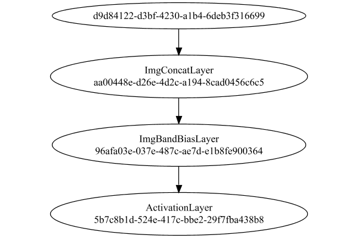

# PipelineNetwork
## Double
### Json Serialization
Code from [StandardLayerTests.java:69](../../../../../../../../src/main/java/com/simiacryptus/mindseye/test/StandardLayerTests.java#L69) executed in 0.00 seconds: 
```java
    JsonObject json = layer.getJson();
    NNLayer echo = NNLayer.fromJson(json);
    if ((echo == null)) throw new AssertionError("Failed to deserialize");
    if ((layer == echo)) throw new AssertionError("Serialization did not copy");
    if ((!layer.equals(echo))) throw new AssertionError("Serialization not equal");
    return new GsonBuilder().setPrettyPrinting().create().toJson(json);
```

Returns: 

```
    {
      "class": "com.simiacryptus.mindseye.network.PipelineNetwork",
      "id": "b7ddfbad-d515-47bc-aba2-6fe6407b57d5",
      "isFrozen": false,
      "name": "PipelineNetwork/b7ddfbad-d515-47bc-aba2-6fe6407b57d5",
      "inputs": [
        "d9d84122-d3bf-4230-a1b4-6deb3f316699"
      ],
      "nodes": {
        "3d75946d-91c1-474e-beb3-68e176c8211b": "aa00448e-d26e-4d2c-a194-8cad0456c6c5",
        "4349a3ce-3f8a-40a0-94cb-e290e3bd78dd": "96afa03e-037e-487c-ae7d-e1b8fe900364",
        "1f64e569-16f4-47bf-8a48-925e10444b9e": "5b7c8b1d-524e-417c-bbe2-29f7fba438b8"
      },
      "layers": {
        "aa00448e-d26e-4d2c-a194-8cad0456c6c5": {
          "class": "com.simiacryptus.mindseye.layers.cudnn.ImgConcatLayer",
          "id": "aa00448e-d26e-4d2c-a194-8cad0456c6c5",
          "isFrozen": false,
          "name": "ImgConcatLayer/aa00448e-d26e-4d2c-a194-8cad0456c6c5",
          "maxBands": -1
        },
        "96afa03e-037e-487c-ae7d-e1b8fe900364": {
          "class": "com.simiacryptus.mindseye.layers.cudnn.ImgBandBiasLayer",
          "id": "96afa03e-037e-487c-ae7d-e1b8fe900364",
          "isFrozen": false,
          "name": "ImgBandBiasLayer/96afa03e-037e-487c-ae7d-e1b8fe900364",
          "bias": [
            0.0
          ]
        },
        "5b7c8b1d-524e-417c-bbe2-29f7fba438b8": {
          "class": "com.simiacryptus.mindseye.layers.cudnn.ActivationLayer",
          "id": "5b7c8b1d-524e-417c-bbe2-29f7fba438b8",
          "isFrozen": false,
          "name": "ActivationLayer/5b7c8b1d-524e-417c-bbe2-29f7fba438b8",
          "mode": 1
        }
      },
      "links": {
        "3d75946d-91c1-474e-beb3-68e176c8211b": [
          "d9d84122-d3bf-4230-a1b4-6deb3f316699"
        ],
        "4349a3ce-3f8a-40a0-94cb-e290e3bd78dd": [
          "3d75946d-91c1-474e-beb3-68e176c8211b"
        ],
        "1f64e569-16f4-47bf-8a48-925e10444b9e": [
          "4349a3ce-3f8a-40a0-94cb-e290e3bd78dd"
        ]
      },
      "labels": {},
      "head": "1f64e569-16f4-47bf-8a48-925e10444b9e"
    }
```


### Network Diagram
Code from [StandardLayerTests.java:80](../../../../../../../../src/main/java/com/simiacryptus/mindseye/test/StandardLayerTests.java#L80) executed in 0.14 seconds: 
```java
    return Graphviz.fromGraph(TestUtil.toGraph((DAGNetwork) layer))
      .height(400).width(600).render(Format.PNG).toImage();
```

Returns: 




### Example Input/Output Pair
Code from [StandardLayerTests.java:153](../../../../../../../../src/main/java/com/simiacryptus/mindseye/test/StandardLayerTests.java#L153) executed in 0.00 seconds: 
```java
    SimpleEval eval = SimpleEval.run(layer, inputPrototype);
    return String.format("--------------------\nInput: \n[%s]\n--------------------\nOutput: \n%s\n--------------------\nDerivative: \n%s",
      Arrays.stream(inputPrototype).map(t -> t.prettyPrint()).reduce((a, b) -> a + ",\n" + b).get(),
      eval.getOutput().prettyPrint(),
      Arrays.stream(eval.getDerivative()).map(t -> t.prettyPrint()).reduce((a, b) -> a + ",\n" + b).get());
```

Returns: 

```
    --------------------
    Input: 
    [[
    	[ [ -1.912 ] ]
    ]]
    --------------------
    Output: 
    [
    	[ [ 0.0 ] ]
    ]
    --------------------
    Derivative: 
    [
    	[ [ 0.0 ] ]
    ]
```


[GPU Log](etc/cuda.log)

### Batch Execution
Code from [StandardLayerTests.java:102](../../../../../../../../src/main/java/com/simiacryptus/mindseye/test/StandardLayerTests.java#L102) executed in 0.01 seconds: 
```java
    return getBatchingTester().test(layer, inputPrototype);
```

Returns: 

```
    ToleranceStatistics{absoluteTol=0.0000e+00 +- 0.0000e+00 [0.0000e+00 - 0.0000e+00] (20#), relativeTol=0.0000e+00 +- 0.0000e+00 [0.0000e+00 - 0.0000e+00] (12#)}
```


### Differential Validation
Code from [StandardLayerTests.java:110](../../../../../../../../src/main/java/com/simiacryptus/mindseye/test/StandardLayerTests.java#L110) executed in 0.01 seconds: 
```java
    return getDerivativeTester().test(layer, inputPrototype);
```
Logging: 
```
    Inputs: [
    	[ [ 1.476 ] ]
    ]
    Inputs Statistics: {meanExponent=0.16908635748702275, negative=0, min=1.476, max=1.476, mean=1.476, count=1.0, positive=1, stdDev=0.0, zeros=0}
    Output: [
    	[ [ 1.476 ] ]
    ]
    Outputs Statistics: {meanExponent=0.16908635748702275, negative=0, min=1.476, max=1.476, mean=1.476, count=1.0, positive=1, stdDev=0.0, zeros=0}
    Feedback for input 0
    Inputs Values: [
    	[ [ 1.476 ] ]
    ]
    Value Statistics: {meanExponent=0.16908635748702275, negative=0, min=1.476, max=1.476, mean=1.476, count=1.0, positive=1, stdDev=0.0, zeros=0}
    Implemented Feedback: [ [ 1.0 ] ]
    Implemented Statistics: {meanExponent=0.0, negative=0, min=1.0, max=1.0, mean=1.0, count=1.0, positive=1, stdDev=0.0, zeros=0}
    Measured Feedback: [ [ 0.9999999999998899 ] ]
    Measured Statistics: {meanExponent=-4.7830642341045674E-14, negative=0, min=0.9999999999998899, max=0.9999999999998899, mean=0.9999999999998899, count=1.0, positive=1, stdDev=0.0, zeros=0}
    Feedback Error: [ [ -1.1013412404281553E-13 ] ]
    Error Statistics: {meanExpo
```
...[skipping 28 bytes](etc/29.txt)...
```
    gative=1, min=-1.1013412404281553E-13, max=-1.1013412404281553E-13, mean=-1.1013412404281553E-13, count=1.0, positive=0, stdDev=0.0, zeros=0}
    Learning Gradient for weight set 0
    Weights: [ 0.0 ]
    Implemented Gradient: [ [ 1.0 ] ]
    Implemented Statistics: {meanExponent=0.0, negative=0, min=1.0, max=1.0, mean=1.0, count=1.0, positive=1, stdDev=0.0, zeros=0}
    Measured Gradient: [ [ 0.9999999999998899 ] ]
    Measured Statistics: {meanExponent=-4.7830642341045674E-14, negative=0, min=0.9999999999998899, max=0.9999999999998899, mean=0.9999999999998899, count=1.0, positive=1, stdDev=0.0, zeros=0}
    Gradient Error: [ [ -1.1013412404281553E-13 ] ]
    Error Statistics: {meanExponent=-12.958078098036825, negative=1, min=-1.1013412404281553E-13, max=-1.1013412404281553E-13, mean=-1.1013412404281553E-13, count=1.0, positive=0, stdDev=0.0, zeros=0}
    Finite-Difference Derivative Accuracy:
    absoluteTol: 1.1013e-13 +- 0.0000e+00 [1.1013e-13 - 1.1013e-13] (2#)
    relativeTol: 5.5067e-14 +- 0.0000e+00 [5.5067e-14 - 5.5067e-14] (2#)
    
```

Returns: 

```
    ToleranceStatistics{absoluteTol=1.1013e-13 +- 0.0000e+00 [1.1013e-13 - 1.1013e-13] (2#), relativeTol=5.5067e-14 +- 0.0000e+00 [5.5067e-14 - 5.5067e-14] (2#)}
```


### Performance
Adding performance wrappers

Code from [TestUtil.java:260](../../../../../../../../src/main/java/com/simiacryptus/mindseye/test/TestUtil.java#L260) executed in 0.00 seconds: 
```java
    network.visitNodes(node -> {
      if (!(node.getLayer() instanceof MonitoringWrapperLayer)) {
        node.setLayer(new MonitoringWrapperLayer(node.getLayer()).shouldRecordSignalMetrics(false));
      }
      else {
        ((MonitoringWrapperLayer) node.getLayer()).shouldRecordSignalMetrics(false);
      }
    });
```

Code from [StandardLayerTests.java:120](../../../../../../../../src/main/java/com/simiacryptus/mindseye/test/StandardLayerTests.java#L120) executed in 0.01 seconds: 
```java
    getPerformanceTester().test(layer, permPrototype);
```
Logging: 
```
    Evaluation performance: 0.000680s +- 0.000185s [0.000500s - 0.001028s]
    Learning performance: 0.000672s +- 0.000090s [0.000596s - 0.000848s]
    
```

Per-layer Performance Metrics:

Code from [TestUtil.java:225](../../../../../../../../src/main/java/com/simiacryptus/mindseye/test/TestUtil.java#L225) executed in 0.00 seconds: 
```java
    Map<NNLayer, MonitoringWrapperLayer> metrics = new HashMap<>();
    network.visitNodes(node -> {
      if ((node.getLayer() instanceof MonitoringWrapperLayer)) {
        MonitoringWrapperLayer layer = node.getLayer();
        metrics.put(layer.getInner(), layer);
      }
    });
    System.out.println("Forward Performance: \n\t" + metrics.entrySet().stream().map(e -> {
      PercentileStatistics performance = e.getValue().getForwardPerformance();
      return String.format("%s -> %.6fs +- %.6fs (%s)", e.getKey(), performance.getMean(), performance.getStdDev(), performance.getCount());
    }).reduce((a, b) -> a + "\n\t" + b));
    System.out.println("Backward Performance: \n\t" + metrics.entrySet().stream().map(e -> {
      PercentileStatistics performance = e.getValue().getBackwardPerformance();
      return String.format("%s -> %.6fs +- %.6fs (%s)", e.getKey(), performance.getMean(), performance.getStdDev(), performance.getCount());
    }).reduce((a, b) -> a + "\n\t" + b));
```
Logging: 
```
    Forward Performance: 
    	Optional[ImgBandBiasLayer/96afa03e-037e-487c-ae7d-e1b8fe900364 -> 0.000195s +- 0.000014s (11.0)
    	ImgConcatLayer/aa00448e-d26e-4d2c-a194-8cad0456c6c5 -> 0.000196s +- 0.000038s (11.0)
    	ActivationLayer/5b7c8b1d-524e-417c-bbe2-29f7fba438b8 -> 0.000139s +- 0.000012s (11.0)]
    Backward Performance: 
    	Optional[ImgBandBiasLayer/96afa03e-037e-487c-ae7d-e1b8fe900364 -> 0.000046s +- 0.000097s (6.0)
    	ImgConcatLayer/aa00448e-d26e-4d2c-a194-8cad0456c6c5 -> 0.000091s +- 0.000000s (1.0)
    	ActivationLayer/5b7c8b1d-524e-417c-bbe2-29f7fba438b8 -> 0.000025s +- 0.000052s (6.0)]
    
```

Removing performance wrappers

Code from [TestUtil.java:243](../../../../../../../../src/main/java/com/simiacryptus/mindseye/test/TestUtil.java#L243) executed in 0.00 seconds: 
```java
    network.visitNodes(node -> {
      if (node.getLayer() instanceof MonitoringWrapperLayer) {
        node.setLayer(node.<MonitoringWrapperLayer>getLayer().getInner());
      }
    });
```

