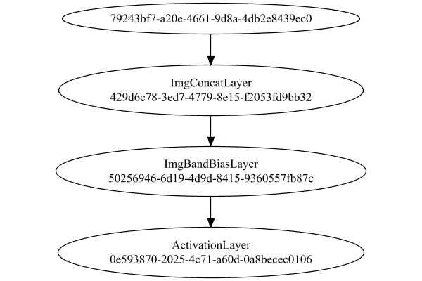

# PipelineNetwork
## Float
### Json Serialization
Code from [StandardLayerTests.java:68](../../../../../../../../src/main/java/com/simiacryptus/mindseye/test/StandardLayerTests.java#L68) executed in 0.00 seconds: 
```java
    JsonObject json = layer.getJson();
    NNLayer echo = NNLayer.fromJson(json);
    if ((echo == null)) throw new AssertionError("Failed to deserialize");
    if ((layer == echo)) throw new AssertionError("Serialization did not copy");
    if ((!layer.equals(echo))) throw new AssertionError("Serialization not equal");
    return new GsonBuilder().setPrettyPrinting().create().toJson(json);
```

Returns: 

```
    {
      "class": "com.simiacryptus.mindseye.network.PipelineNetwork",
      "id": "f261ad58-6a18-44a2-9aeb-dbbcbd8b7502",
      "isFrozen": false,
      "name": "PipelineNetwork/f261ad58-6a18-44a2-9aeb-dbbcbd8b7502",
      "inputs": [
        "79243bf7-a20e-4661-9d8a-4db2e8439ec0"
      ],
      "nodes": {
        "6ef7bace-9259-4050-858d-117fe643b4e1": "429d6c78-3ed7-4779-8e15-f2053fd9bb32",
        "af09cb2e-424a-4014-a97f-1c146ddcc1b4": "50256946-6d19-4d9d-8415-9360557fb87c",
        "4693d217-bd88-473c-916d-81cc37a8135e": "0e593870-2025-4c71-a60d-0a8becec0106"
      },
      "layers": {
        "429d6c78-3ed7-4779-8e15-f2053fd9bb32": {
          "class": "com.simiacryptus.mindseye.layers.cudnn.ImgConcatLayer",
          "id": "429d6c78-3ed7-4779-8e15-f2053fd9bb32",
          "isFrozen": false,
          "name": "ImgConcatLayer/429d6c78-3ed7-4779-8e15-f2053fd9bb32",
          "maxBands": -1
        },
        "50256946-6d19-4d9d-8415-9360557fb87c": {
          "class": "com.simiacryptus.mindseye.layers.cudnn.ImgBandBiasLayer",
          "id": "50256946-6d19-4d9d-8415-9360557fb87c",
          "isFrozen": false,
          "name": "ImgBandBiasLayer/50256946-6d19-4d9d-8415-9360557fb87c",
          "bias": [
            0.0
          ]
        },
        "0e593870-2025-4c71-a60d-0a8becec0106": {
          "class": "com.simiacryptus.mindseye.layers.cudnn.ActivationLayer",
          "id": "0e593870-2025-4c71-a60d-0a8becec0106",
          "isFrozen": false,
          "name": "ActivationLayer/0e593870-2025-4c71-a60d-0a8becec0106",
          "mode": 1
        }
      },
      "links": {
        "6ef7bace-9259-4050-858d-117fe643b4e1": [
          "79243bf7-a20e-4661-9d8a-4db2e8439ec0"
        ],
        "af09cb2e-424a-4014-a97f-1c146ddcc1b4": [
          "6ef7bace-9259-4050-858d-117fe643b4e1"
        ],
        "4693d217-bd88-473c-916d-81cc37a8135e": [
          "af09cb2e-424a-4014-a97f-1c146ddcc1b4"
        ]
      },
      "labels": {},
      "head": "4693d217-bd88-473c-916d-81cc37a8135e"
    }
```


### Network Diagram
Code from [StandardLayerTests.java:79](../../../../../../../../src/main/java/com/simiacryptus/mindseye/test/StandardLayerTests.java#L79) executed in 0.11 seconds: 
```java
    return Graphviz.fromGraph(TestUtil.toGraph((DAGNetwork) layer))
      .height(400).width(600).render(Format.PNG).toImage();
```

Returns: 




### Example Input/Output Pair
Code from [StandardLayerTests.java:152](../../../../../../../../src/main/java/com/simiacryptus/mindseye/test/StandardLayerTests.java#L152) executed in 0.00 seconds: 
```java
    SimpleEval eval = SimpleEval.run(layer, inputPrototype);
    return String.format("--------------------\nInput: \n[%s]\n--------------------\nOutput: \n%s\n--------------------\nDerivative: \n%s",
      Arrays.stream(inputPrototype).map(t -> t.prettyPrint()).reduce((a, b) -> a + ",\n" + b).get(),
      eval.getOutput().prettyPrint(),
      Arrays.stream(eval.getDerivative()).map(t -> t.prettyPrint()).reduce((a, b) -> a + ",\n" + b).get());
```

Returns: 

```
    --------------------
    Input: 
    [[
    	[ [ -1.592 ] ]
    ]]
    --------------------
    Output: 
    [
    	[ [ 0.0 ] ]
    ]
    --------------------
    Derivative: 
    [
    	[ [ 0.0 ] ]
    ]
```


[GPU Log](etc/cuda.log)

### Batch Execution
Code from [StandardLayerTests.java:101](../../../../../../../../src/main/java/com/simiacryptus/mindseye/test/StandardLayerTests.java#L101) executed in 0.02 seconds: 
```java
    return getBatchingTester().test(layer, inputPrototype);
```

Returns: 

```
    ToleranceStatistics{absoluteTol=0.0000e+00 +- 0.0000e+00 [0.0000e+00 - 0.0000e+00] (20#), relativeTol=0.0000e+00 +- 0.0000e+00 [Infinity - -Infinity] (0#)}
```


### Differential Validation
Code from [StandardLayerTests.java:109](../../../../../../../../src/main/java/com/simiacryptus/mindseye/test/StandardLayerTests.java#L109) executed in 0.01 seconds: 
```java
    return getDerivativeTester().test(layer, inputPrototype);
```
Logging: 
```
    Inputs: [
    	[ [ -1.828 ] ]
    ]
    Inputs Statistics: {meanExponent=0.26197619139781264, negative=1, min=-1.828, max=-1.828, mean=-1.828, count=1.0, positive=0, stdDev=0.0, zeros=0}
    Output: [
    	[ [ 0.0 ] ]
    ]
    Outputs Statistics: {meanExponent=NaN, negative=0, min=0.0, max=0.0, mean=0.0, count=1.0, positive=0, stdDev=0.0, zeros=1}
    Feedback for input 0
    Inputs Values: [
    	[ [ -1.828 ] ]
    ]
    Value Statistics: {meanExponent=0.26197619139781264, negative=1, min=-1.828, max=-1.828, mean=-1.828, count=1.0, positive=0, stdDev=0.0, zeros=0}
    Implemented Feedback: [ [ 0.0 ] ]
    Implemented Statistics: {meanExponent=NaN, negative=0, min=0.0, max=0.0, mean=0.0, count=1.0, positive=0, stdDev=0.0, zeros=1}
    Measured Feedback: [ [ 0.0 ] ]
    Measured Statistics: {meanExponent=NaN, negative=0, min=0.0, max=0.0, mean=0.0, count=1.0, positive=0, stdDev=0.0, zeros=1}
    Feedback Error: [ [ 0.0 ] ]
    Error Statistics: {meanExponent=NaN, negative=0, min=0.0, max=0.0, mean=0.0, count=1.0, positive=0, stdDev=0.0, zeros=1}
    Learning Gradient for weight set 0
    Weights: [ 0.0 ]
    Implemented Gradient: [ [ 0.0 ] ]
    Implemented Statistics: {meanExponent=NaN, negative=0, min=0.0, max=0.0, mean=0.0, count=1.0, positive=0, stdDev=0.0, zeros=1}
    Measured Gradient: [ [ 0.0 ] ]
    Measured Statistics: {meanExponent=NaN, negative=0, min=0.0, max=0.0, mean=0.0, count=1.0, positive=0, stdDev=0.0, zeros=1}
    Gradient Error: [ [ 0.0 ] ]
    Error Statistics: {meanExponent=NaN, negative=0, min=0.0, max=0.0, mean=0.0, count=1.0, positive=0, stdDev=0.0, zeros=1}
    Finite-Difference Derivative Accuracy:
    absoluteTol: 0.0000e+00 +- 0.0000e+00 [0.0000e+00 - 0.0000e+00] (2#)
    relativeTol: 0.0000e+00 +- 0.0000e+00 [Infinity - -Infinity] (0#)
    
```

Returns: 

```
    ToleranceStatistics{absoluteTol=0.0000e+00 +- 0.0000e+00 [0.0000e+00 - 0.0000e+00] (2#), relativeTol=0.0000e+00 +- 0.0000e+00 [Infinity - -Infinity] (0#)}
```


### Performance
Adding performance wrappers

Code from [TestUtil.java:269](../../../../../../../../src/main/java/com/simiacryptus/mindseye/test/TestUtil.java#L269) executed in 0.00 seconds: 
```java
    network.visitNodes(node -> {
      if (!(node.getLayer() instanceof MonitoringWrapperLayer)) {
        node.setLayer(new MonitoringWrapperLayer(node.getLayer()).shouldRecordSignalMetrics(false));
      }
      else {
        ((MonitoringWrapperLayer) node.getLayer()).shouldRecordSignalMetrics(false);
      }
    });
```

Code from [StandardLayerTests.java:119](../../../../../../../../src/main/java/com/simiacryptus/mindseye/test/StandardLayerTests.java#L119) executed in 0.00 seconds: 
```java
    getPerformanceTester().test(layer, permPrototype);
```
Logging: 
```
    100 batches
    Input Dimensions:
    
```

Returns: 

```
    java.lang.RuntimeException: java.lang.RuntimeException: java.util.concurrent.ExecutionException: com.simiacryptus.mindseye.lang.ComponentException: Error evaluating layer ActivationLayer/0e593870-2025-4c71-a60d-0a8becec0106
    	at com.simiacryptus.util.lang.TimedResult.time(TimedResult.java:61)
    	at com.simiacryptus.util.io.MarkdownNotebookOutput.lambda$code$2(MarkdownNotebookOutput.java:138)
    	at com.simiacryptus.util.test.SysOutInterceptor.withOutput(SysOutInterceptor.java:72)
    	at com.simiacryptus.util.io.MarkdownNotebookOutput.code(MarkdownNotebookOutput.java:136)
    	at com.simiacryptus.util.io.NotebookOutput.code(NotebookOutput.java:156)
    	at com.simiacryptus.mindseye.test.StandardLayerTests.test(StandardLayerTests.java:119)
    	at com.simiacryptus.mindseye.layers.LayerTestBase.test(LayerTestBase.java:40)
    	at sun.reflect.GeneratedMethodAccessor16.invoke(Unknown Source)
    	at sun.reflect.DelegatingMethodAccessorImpl.invoke(DelegatingMethodAccessorImpl.java:43)
    	at java.lang.reflect.Method.invoke(Method.java:4
```
...[skipping 4376 bytes](etc/66.txt)...
```
    ad.java:748)
    Caused by: com.simiacryptus.mindseye.lang.ComponentException: Error evaluating layer ImgBandBiasLayer/50256946-6d19-4d9d-8415-9360557fb87c
    	at com.simiacryptus.mindseye.network.LazyResult.lambda$get$0(LazyResult.java:77)
    	at java.util.HashMap.computeIfAbsent(HashMap.java:1126)
    	at com.simiacryptus.mindseye.network.LazyResult.get(LazyResult.java:73)
    	at com.simiacryptus.mindseye.network.LazyResult.get(LazyResult.java:32)
    	at com.simiacryptus.mindseye.network.InnerNode.eval(InnerNode.java:82)
    	at com.simiacryptus.mindseye.network.LazyResult.lambda$get$0(LazyResult.java:75)
    	... 10 more
    Caused by: java.lang.AssertionError: 3 != 1
    	at com.simiacryptus.mindseye.layers.cudnn.ImgBandBiasLayer.eval(ImgBandBiasLayer.java:91)
    	at com.simiacryptus.mindseye.layers.java.MonitoringWrapperLayer.eval(MonitoringWrapperLayer.java:148)
    	at com.simiacryptus.mindseye.network.InnerNode.eval(InnerNode.java:83)
    	at com.simiacryptus.mindseye.network.LazyResult.lambda$get$0(LazyResult.java:75)
    	... 15 more
    
```


