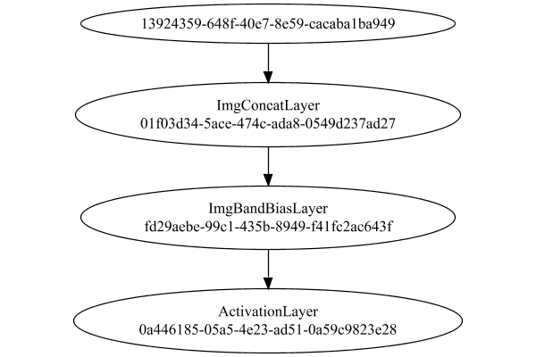

# PipelineNetwork
## Float
### Network Diagram
This is a network with the following layout:

Code from [StandardLayerTests.java:72](../../../../../../../../src/main/java/com/simiacryptus/mindseye/test/unit/StandardLayerTests.java#L72) executed in 0.16 seconds: 
```java
    return Graphviz.fromGraph(TestUtil.toGraph((DAGNetwork) layer))
      .height(400).width(600).render(Format.PNG).toImage();
```

Returns: 




### Json Serialization
Code from [JsonTest.java:36](../../../../../../../../src/main/java/com/simiacryptus/mindseye/test/unit/JsonTest.java#L36) executed in 0.00 seconds: 
```java
    JsonObject json = layer.getJson();
    NNLayer echo = NNLayer.fromJson(json);
    if ((echo == null)) throw new AssertionError("Failed to deserialize");
    if ((layer == echo)) throw new AssertionError("Serialization did not copy");
    if ((!layer.equals(echo))) throw new AssertionError("Serialization not equal");
    return new GsonBuilder().setPrettyPrinting().create().toJson(json);
```

Returns: 

```
    {
      "class": "com.simiacryptus.mindseye.network.PipelineNetwork",
      "id": "0630ae42-de16-4cc7-8533-01573bfd375b",
      "isFrozen": false,
      "name": "PipelineNetwork/0630ae42-de16-4cc7-8533-01573bfd375b",
      "inputs": [
        "13924359-648f-40e7-8e59-cacaba1ba949"
      ],
      "nodes": {
        "af8be505-46d0-47d5-afd7-c21e8457faea": "01f03d34-5ace-474c-ada8-0549d237ad27",
        "25a6e0dc-a800-4e9e-a9b6-ff237d2f39cc": "fd29aebe-99c1-435b-8949-f41fc2ac643f",
        "0687dfd3-391f-47f7-a3e3-068e6490ebf8": "0a446185-05a5-4e23-ad51-0a59c9823e28"
      },
      "layers": {
        "01f03d34-5ace-474c-ada8-0549d237ad27": {
          "class": "com.simiacryptus.mindseye.layers.cudnn.ImgConcatLayer",
          "id": "01f03d34-5ace-474c-ada8-0549d237ad27",
          "isFrozen": false,
          "name": "ImgConcatLayer/01f03d34-5ace-474c-ada8-0549d237ad27",
          "maxBands": -1,
          "precision": "Float"
        },
        "fd29aebe-99c1-435b-8949-f41fc2ac643f": {
          "class": "com.simiacryptus.mindseye.layers.cudnn.ImgBandBiasLayer",
          "id": "fd29aebe-99c1-435b-8949-f41fc2ac643f",
          "isFrozen": false,
          "name": "ImgBandBiasLayer/fd29aebe-99c1-435b-8949-f41fc2ac643f",
          "bias": [
            -1.768,
            0.824,
            -1.26
          ],
          "precision": "Float"
        },
        "0a446185-05a5-4e23-ad51-0a59c9823e28": {
          "class": "com.simiacryptus.mindseye.layers.cudnn.ActivationLayer",
          "id": "0a446185-05a5-4e23-ad51-0a59c9823e28",
          "isFrozen": false,
          "name": "ActivationLayer/0a446185-05a5-4e23-ad51-0a59c9823e28",
          "mode": 1,
          "precision": "Float"
        }
      },
      "links": {
        "af8be505-46d0-47d5-afd7-c21e8457faea": [
          "13924359-648f-40e7-8e59-cacaba1ba949"
        ],
        "25a6e0dc-a800-4e9e-a9b6-ff237d2f39cc": [
          "af8be505-46d0-47d5-afd7-c21e8457faea"
        ],
        "0687dfd3-391f-47f7-a3e3-068e6490ebf8": [
          "25a6e0dc-a800-4e9e-a9b6-ff237d2f39cc"
        ]
      },
      "labels": {},
      "head": "0687dfd3-391f-47f7-a3e3-068e6490ebf8"
    }
```


### Example Input/Output Pair
Code from [ReferenceIO.java:68](../../../../../../../../src/main/java/com/simiacryptus/mindseye/test/unit/ReferenceIO.java#L68) executed in 0.00 seconds: 
```java
    SimpleEval eval = SimpleEval.run(layer, inputPrototype);
    return String.format("--------------------\nInput: \n[%s]\n--------------------\nOutput: \n%s\n--------------------\nDerivative: \n%s",
      Arrays.stream(inputPrototype).map(t -> t.prettyPrint()).reduce((a, b) -> a + ",\n" + b).get(),
      eval.getOutput().prettyPrint(),
      Arrays.stream(eval.getDerivative()).map(t -> t.prettyPrint()).reduce((a, b) -> a + ",\n" + b).get());
```

Returns: 

```
    --------------------
    Input: 
    [[
    	[ [ 0.104, 1.936, 1.94 ] ]
    ]]
    --------------------
    Output: 
    [
    	[ [ 0.0, 0.0, 0.0 ] ]
    ]
    --------------------
    Derivative: 
    [
    	[ [ 0.0, 0.0, 0.0 ] ]
    ]
```


[GPU Log](etc/cuda.log)

### Batch Execution
Code from [BatchingTester.java:66](../../../../../../../../src/main/java/com/simiacryptus/mindseye/test/unit/BatchingTester.java#L66) executed in 0.02 seconds: 
```java
    return test(reference, inputPrototype);
```

Returns: 

```
    ToleranceStatistics{absoluteTol=0.0000e+00 +- 0.0000e+00 [0.0000e+00 - 0.0000e+00] (60#), relativeTol=0.0000e+00 +- 0.0000e+00 [Infinity - -Infinity] (0#)}
```


Code from [SingleDerivativeTester.java:77](../../../../../../../../src/main/java/com/simiacryptus/mindseye/test/unit/SingleDerivativeTester.java#L77) executed in 0.00 seconds: 
```java
    return test(component, inputPrototype);
```
Logging: 
```
    Inputs: [
    	[ [ -1.064, 0.664, 1.484 ] ]
    ]
    Inputs Statistics: {meanExponent=0.006847869423351721, negative=1, min=1.484, max=1.484, mean=0.36133333333333334, count=3.0, positive=2, stdDev=1.0620048127114219, zeros=0}
    Output: [
    	[ [ 0.0, 0.0, 0.0 ] ]
    ]
    Outputs Statistics: {meanExponent=NaN, negative=0, min=0.0, max=0.0, mean=0.0, count=3.0, positive=0, stdDev=0.0, zeros=3}
    Feedback for input 0
    Inputs Values: [
    	[ [ -1.064, 0.664, 1.484 ] ]
    ]
    Value Statistics: {meanExponent=0.006847869423351721, negative=1, min=1.484, max=1.484, mean=0.36133333333333334, count=3.0, positive=2, stdDev=1.0620048127114219, zeros=0}
    Implemented Feedback: [ [ 0.0, 0.0, 0.0 ], [ 0.0, 0.0, 0.0 ], [ 0.0, 0.0, 0.0 ] ]
    Implemented Statistics: {meanExponent=NaN, negative=0, min=0.0, max=0.0, mean=0.0, count=9.0, positive=0, stdDev=0.0, zeros=9}
    Measured Feedback: [ [ 0.0, 0.0, 0.0 ], [ 0.0, 0.0, 0.0 ], [ 0.0, 0.0, 0.0 ] ]
    Measured Statistics: {meanExponent=NaN, negative=0, min=0.0, max=0.0, mean=0.0, count=9.0, positive=0, stdDev=0.0, zeros=9}
    Feedback Error: [ [ 0.0, 0.0, 0.0 ], [ 0.0, 0.0, 0.0 ], [ 0.0, 0.0, 0.0 ] ]
    Error Statistics: {meanExponent=NaN, negative=0, min=0.0, max=0.0, mean=0.0, count=9.0, positive=0, stdDev=0.0, zeros=9}
    Learning Gradient for weight set 0
    Implemented Gradient: [ [ 0.0, 0.0, 0.0 ], [ 0.0, 1.0, 0.0 ], [ 0.0, 0.0, 1.0 ] ]
    Implemented Statistics: {meanExponent=0.0, negative=0, min=1.0, max=1.0, mean=0.2222222222222222, count=9.0, positive=2, stdDev=0.41573970964154905, zeros=7}
    Measured Gradient: [ [ 0.0, 0.0, 0.0 ], [ 0.0, 0.0, 0.0 ], [ 0.0, 0.0, 0.0 ] ]
    Measured Statistics: {meanExponent=NaN, negative=0, min=0.0, max=0.0, mean=0.0, count=9.0, positive=0, stdDev=0.0, zeros=9}
    Gradient Error: [ [ 0.0, 0.0, 0.0 ], [ 0.0, -1.0, 0.0 ], [ 0.0, 0.0, -1.0 ] ]
    Error Statistics: {meanExponent=0.0, negative=2, min=-1.0, max=-1.0, mean=-0.2222222222222222, count=9.0, positive=0, stdDev=0.41573970964154905, zeros=7}
    
```

Returns: 

```
    java.lang.AssertionError: ToleranceStatistics{absoluteTol=2.2222e-01 +- 4.1574e-01 [0.0000e+00 - 1.0000e+00] (9#), relativeTol=1.0000e+00 +- 0.0000e+00 [1.0000e+00 - 1.0000e+00] (2#)}
    	at com.simiacryptus.mindseye.test.unit.SingleDerivativeTester.lambda$test$11(SingleDerivativeTester.java:150)
    	at java.util.stream.IntPipeline$4$1.accept(IntPipeline.java:250)
    	at java.util.stream.Streams$RangeIntSpliterator.forEachRemaining(Streams.java:110)
    	at java.util.Spliterator$OfInt.forEachRemaining(Spliterator.java:693)
    	at java.util.stream.AbstractPipeline.copyInto(AbstractPipeline.java:481)
    	at java.util.stream.AbstractPipeline.wrapAndCopyInto(AbstractPipeline.java:471)
    	at java.util.stream.ReduceOps$ReduceOp.evaluateSequential(ReduceOps.java:708)
    	at java.util.stream.AbstractPipeline.evaluate(AbstractPipeline.java:234)
    	at java.util.stream.ReferencePipeline.reduce(ReferencePipeline.java:479)
    	at com.simiacryptus.mindseye.test.unit.SingleDerivativeTester.test(SingleDerivativeTester.java:183)
    	at com.simiac
```
...[skipping 2950 bytes](etc/122.txt)...
```
    unner.java:268)
    	at org.junit.runners.ParentRunner.run(ParentRunner.java:363)
    	at org.junit.runners.Suite.runChild(Suite.java:128)
    	at org.junit.runners.Suite.runChild(Suite.java:27)
    	at org.junit.runners.ParentRunner$3.run(ParentRunner.java:290)
    	at org.junit.runners.ParentRunner$1.schedule(ParentRunner.java:71)
    	at org.junit.runners.ParentRunner.runChildren(ParentRunner.java:288)
    	at org.junit.runners.ParentRunner.access$000(ParentRunner.java:58)
    	at org.junit.runners.ParentRunner$2.evaluate(ParentRunner.java:268)
    	at org.junit.runners.ParentRunner.run(ParentRunner.java:363)
    	at org.junit.runner.JUnitCore.run(JUnitCore.java:137)
    	at com.intellij.junit4.JUnit4IdeaTestRunner.startRunnerWithArgs(JUnit4IdeaTestRunner.java:68)
    	at com.intellij.rt.execution.junit.IdeaTestRunner$Repeater.startRunnerWithArgs(IdeaTestRunner.java:47)
    	at com.intellij.rt.execution.junit.JUnitStarter.prepareStreamsAndStart(JUnitStarter.java:242)
    	at com.intellij.rt.execution.junit.JUnitStarter.main(JUnitStarter.java:70)
    
```


