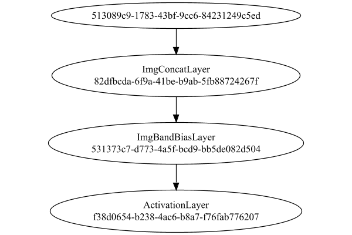

# PipelineNetwork
## Float
### Json Serialization
Code from [StandardLayerTests.java:69](../../../../../../../../src/main/java/com/simiacryptus/mindseye/test/StandardLayerTests.java#L69) executed in 0.00 seconds: 
```java
    JsonObject json = layer.getJson();
    NNLayer echo = NNLayer.fromJson(json);
    if ((echo == null)) throw new AssertionError("Failed to deserialize");
    if ((layer == echo)) throw new AssertionError("Serialization did not copy");
    if ((!layer.equals(echo))) throw new AssertionError("Serialization not equal");
    return new GsonBuilder().setPrettyPrinting().create().toJson(json);
```

Returns: 

```
    {
      "class": "com.simiacryptus.mindseye.network.PipelineNetwork",
      "id": "29b1a275-7400-4738-8fa1-ae0e70aaf0ce",
      "isFrozen": false,
      "name": "PipelineNetwork/29b1a275-7400-4738-8fa1-ae0e70aaf0ce",
      "inputs": [
        "513089c9-1783-43bf-9cc6-84231249c5ed"
      ],
      "nodes": {
        "a35ab5e5-5a65-418f-a336-d687dd05edd1": "82dfbcda-6f9a-41be-b9ab-5fb88724267f",
        "2b3b19c2-f931-447b-8c9b-55b46c0d950b": "531373c7-d773-4a5f-bcd9-bb5de082d504",
        "eb8734b6-a625-4cec-8305-612cb175da38": "f38d0654-b238-4ac6-b8a7-f76fab776207"
      },
      "layers": {
        "82dfbcda-6f9a-41be-b9ab-5fb88724267f": {
          "class": "com.simiacryptus.mindseye.layers.cudnn.ImgConcatLayer",
          "id": "82dfbcda-6f9a-41be-b9ab-5fb88724267f",
          "isFrozen": false,
          "name": "ImgConcatLayer/82dfbcda-6f9a-41be-b9ab-5fb88724267f",
          "maxBands": -1
        },
        "531373c7-d773-4a5f-bcd9-bb5de082d504": {
          "class": "com.simiacryptus.mindseye.layers.cudnn.ImgBandBiasLayer",
          "id": "531373c7-d773-4a5f-bcd9-bb5de082d504",
          "isFrozen": false,
          "name": "ImgBandBiasLayer/531373c7-d773-4a5f-bcd9-bb5de082d504",
          "bias": [
            0.0
          ]
        },
        "f38d0654-b238-4ac6-b8a7-f76fab776207": {
          "class": "com.simiacryptus.mindseye.layers.cudnn.ActivationLayer",
          "id": "f38d0654-b238-4ac6-b8a7-f76fab776207",
          "isFrozen": false,
          "name": "ActivationLayer/f38d0654-b238-4ac6-b8a7-f76fab776207",
          "mode": 1
        }
      },
      "links": {
        "a35ab5e5-5a65-418f-a336-d687dd05edd1": [
          "513089c9-1783-43bf-9cc6-84231249c5ed"
        ],
        "2b3b19c2-f931-447b-8c9b-55b46c0d950b": [
          "a35ab5e5-5a65-418f-a336-d687dd05edd1"
        ],
        "eb8734b6-a625-4cec-8305-612cb175da38": [
          "2b3b19c2-f931-447b-8c9b-55b46c0d950b"
        ]
      },
      "labels": {},
      "head": "eb8734b6-a625-4cec-8305-612cb175da38"
    }
```


### Network Diagram
Code from [StandardLayerTests.java:80](../../../../../../../../src/main/java/com/simiacryptus/mindseye/test/StandardLayerTests.java#L80) executed in 0.14 seconds: 
```java
    return Graphviz.fromGraph(TestUtil.toGraph((DAGNetwork) layer))
      .height(400).width(600).render(Format.PNG).toImage();
```

Returns: 




### Example Input/Output Pair
Code from [StandardLayerTests.java:153](../../../../../../../../src/main/java/com/simiacryptus/mindseye/test/StandardLayerTests.java#L153) executed in 0.00 seconds: 
```java
    SimpleEval eval = SimpleEval.run(layer, inputPrototype);
    return String.format("--------------------\nInput: \n[%s]\n--------------------\nOutput: \n%s\n--------------------\nDerivative: \n%s",
      Arrays.stream(inputPrototype).map(t -> t.prettyPrint()).reduce((a, b) -> a + ",\n" + b).get(),
      eval.getOutput().prettyPrint(),
      Arrays.stream(eval.getDerivative()).map(t -> t.prettyPrint()).reduce((a, b) -> a + ",\n" + b).get());
```

Returns: 

```
    --------------------
    Input: 
    [[
    	[ [ 0.332 ] ]
    ]]
    --------------------
    Output: 
    [
    	[ [ 0.0 ] ]
    ]
    --------------------
    Derivative: 
    [
    	[ [ 0.0 ] ]
    ]
```


[GPU Log](etc/cuda.log)

### Batch Execution
Code from [StandardLayerTests.java:102](../../../../../../../../src/main/java/com/simiacryptus/mindseye/test/StandardLayerTests.java#L102) executed in 0.01 seconds: 
```java
    return getBatchingTester().test(layer, inputPrototype);
```

Returns: 

```
    ToleranceStatistics{absoluteTol=0.0000e+00 +- 0.0000e+00 [0.0000e+00 - 0.0000e+00] (20#), relativeTol=0.0000e+00 +- 0.0000e+00 [Infinity - -Infinity] (0#)}
```


### Differential Validation
Code from [StandardLayerTests.java:110](../../../../../../../../src/main/java/com/simiacryptus/mindseye/test/StandardLayerTests.java#L110) executed in 0.00 seconds: 
```java
    return getDerivativeTester().test(layer, inputPrototype);
```
Logging: 
```
    Inputs: [
    	[ [ 0.58 ] ]
    ]
    Inputs Statistics: {meanExponent=-0.23657200643706275, negative=0, min=0.58, max=0.58, mean=0.58, count=1.0, positive=1, stdDev=0.0, zeros=0}
    Output: [
    	[ [ 0.0 ] ]
    ]
    Outputs Statistics: {meanExponent=NaN, negative=0, min=0.0, max=0.0, mean=0.0, count=1.0, positive=0, stdDev=0.0, zeros=1}
    Feedback for input 0
    Inputs Values: [
    	[ [ 0.58 ] ]
    ]
    Value Statistics: {meanExponent=-0.23657200643706275, negative=0, min=0.58, max=0.58, mean=0.58, count=1.0, positive=1, stdDev=0.0, zeros=0}
    Implemented Feedback: [ [ 0.0 ] ]
    Implemented Statistics: {meanExponent=NaN, negative=0, min=0.0, max=0.0, mean=0.0, count=1.0, positive=0, stdDev=0.0, zeros=1}
    Measured Feedback: [ [ 0.0 ] ]
    Measured Statistics: {meanExponent=NaN, negative=0, min=0.0, max=0.0, mean=0.0, count=1.0, positive=0, stdDev=0.0, zeros=1}
    Feedback Error: [ [ 0.0 ] ]
    Error Statistics: {meanExponent=NaN, negative=0, min=0.0, max=0.0, mean=0.0, count=1.0, positive=0, stdDev=0.0, zeros=1}
    Learning Gradient for weight set 0
    Implemented Gradient: [ [ 1.0 ] ]
    Implemented Statistics: {meanExponent=0.0, negative=0, min=1.0, max=1.0, mean=1.0, count=1.0, positive=1, stdDev=0.0, zeros=0}
    Measured Gradient: [ [ 0.0 ] ]
    Measured Statistics: {meanExponent=NaN, negative=0, min=0.0, max=0.0, mean=0.0, count=1.0, positive=0, stdDev=0.0, zeros=1}
    Gradient Error: [ [ -1.0 ] ]
    Error Statistics: {meanExponent=0.0, negative=1, min=-1.0, max=-1.0, mean=-1.0, count=1.0, positive=0, stdDev=0.0, zeros=0}
    
```

Returns: 

```
    java.lang.AssertionError: ToleranceStatistics{absoluteTol=1.0000e+00 +- 0.0000e+00 [1.0000e+00 - 1.0000e+00] (1#), relativeTol=1.0000e+00 +- 0.0000e+00 [1.0000e+00 - 1.0000e+00] (1#)}
    	at com.simiacryptus.mindseye.test.SingleDerivativeTester.lambda$test$10(SingleDerivativeTester.java:133)
    	at java.util.stream.IntPipeline$4$1.accept(IntPipeline.java:250)
    	at java.util.stream.Streams$RangeIntSpliterator.forEachRemaining(Streams.java:110)
    	at java.util.Spliterator$OfInt.forEachRemaining(Spliterator.java:693)
    	at java.util.stream.AbstractPipeline.copyInto(AbstractPipeline.java:481)
    	at java.util.stream.AbstractPipeline.wrapAndCopyInto(AbstractPipeline.java:471)
    	at java.util.stream.ReduceOps$ReduceOp.evaluateSequential(ReduceOps.java:708)
    	at java.util.stream.AbstractPipeline.evaluate(AbstractPipeline.java:234)
    	at java.util.stream.ReferencePipeline.reduce(ReferencePipeline.java:479)
    	at com.simiacryptus.mindseye.test.SingleDerivativeTester.test(SingleDerivativeTester.java:166)
    	at com.simiacryptus.min
```
...[skipping 1900 bytes](etc/30.txt)...
```
    unner.java:268)
    	at org.junit.runners.ParentRunner.run(ParentRunner.java:363)
    	at org.junit.runners.Suite.runChild(Suite.java:128)
    	at org.junit.runners.Suite.runChild(Suite.java:27)
    	at org.junit.runners.ParentRunner$3.run(ParentRunner.java:290)
    	at org.junit.runners.ParentRunner$1.schedule(ParentRunner.java:71)
    	at org.junit.runners.ParentRunner.runChildren(ParentRunner.java:288)
    	at org.junit.runners.ParentRunner.access$000(ParentRunner.java:58)
    	at org.junit.runners.ParentRunner$2.evaluate(ParentRunner.java:268)
    	at org.junit.runners.ParentRunner.run(ParentRunner.java:363)
    	at org.junit.runner.JUnitCore.run(JUnitCore.java:137)
    	at com.intellij.junit4.JUnit4IdeaTestRunner.startRunnerWithArgs(JUnit4IdeaTestRunner.java:68)
    	at com.intellij.rt.execution.junit.IdeaTestRunner$Repeater.startRunnerWithArgs(IdeaTestRunner.java:47)
    	at com.intellij.rt.execution.junit.JUnitStarter.prepareStreamsAndStart(JUnitStarter.java:242)
    	at com.intellij.rt.execution.junit.JUnitStarter.main(JUnitStarter.java:70)
    
```


