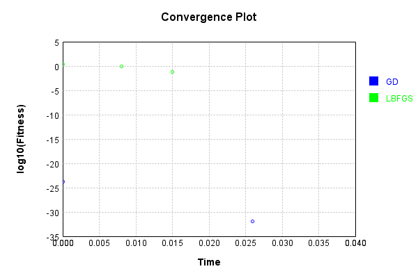
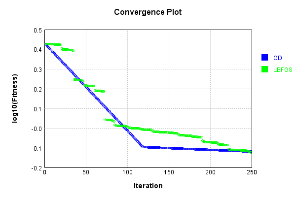
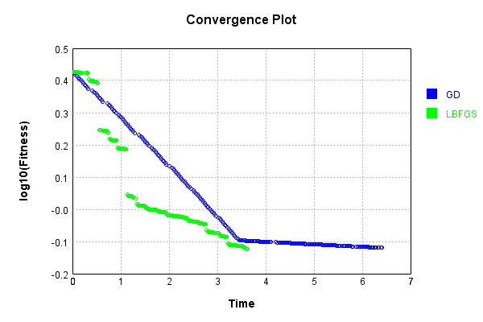

# ImgBandBiasLayer
## Double
### Json Serialization
Code from [JsonTest.java:36](../../../../../../../../src/main/java/com/simiacryptus/mindseye/test/unit/JsonTest.java#L36) executed in 0.00 seconds: 
```java
    JsonObject json = layer.getJson();
    NNLayer echo = NNLayer.fromJson(json);
    if ((echo == null)) throw new AssertionError("Failed to deserialize");
    if ((layer == echo)) throw new AssertionError("Serialization did not copy");
    if ((!layer.equals(echo))) throw new AssertionError("Serialization not equal");
    return new GsonBuilder().setPrettyPrinting().create().toJson(json);
```

Returns: 

```
    {
      "class": "com.simiacryptus.mindseye.layers.cudnn.ImgBandBiasLayer",
      "id": "1799dd09-af4b-4a21-864d-42be57639186",
      "isFrozen": false,
      "name": "ImgBandBiasLayer/1799dd09-af4b-4a21-864d-42be57639186",
      "bias": [
        -0.092,
        -0.296
      ],
      "precision": "Double"
    }
```


### Example Input/Output Pair
Code from [ReferenceIO.java:68](../../../../../../../../src/main/java/com/simiacryptus/mindseye/test/unit/ReferenceIO.java#L68) executed in 0.00 seconds: 
```java
    SimpleEval eval = SimpleEval.run(layer, inputPrototype);
    return String.format("--------------------\nInput: \n[%s]\n--------------------\nOutput: \n%s\n--------------------\nDerivative: \n%s",
      Arrays.stream(inputPrototype).map(t -> t.prettyPrint()).reduce((a, b) -> a + ",\n" + b).get(),
      eval.getOutput().prettyPrint(),
      Arrays.stream(eval.getDerivative()).map(t -> t.prettyPrint()).reduce((a, b) -> a + ",\n" + b).get());
```

Returns: 

```
    --------------------
    Input: 
    [[
    	[ [ -1.216, 0.4 ], [ -1.816, 1.84 ], [ -0.672, -0.688 ] ],
    	[ [ 1.736, 1.456 ], [ 0.128, 0.288 ], [ -1.768, -0.14 ] ],
    	[ [ -1.3, -1.064 ], [ -0.192, 1.184 ], [ 1.644, -0.08 ] ]
    ]]
    --------------------
    Output: 
    [
    	[ [ -1.308, 0.10400000000000004 ], [ -1.9080000000000001, 1.544 ], [ -0.764, -0.984 ] ],
    	[ [ 1.644, 1.16 ], [ 0.036000000000000004, -0.008000000000000007 ], [ -1.86, -0.436 ] ],
    	[ [ -1.3920000000000001, -1.36 ], [ -0.28400000000000003, 0.8879999999999999 ], [ 1.5519999999999998, -0.376 ] ]
    ]
    --------------------
    Derivative: 
    [
    	[ [ 1.0, 1.0 ], [ 1.0, 1.0 ], [ 1.0, 1.0 ] ],
    	[ [ 1.0, 1.0 ], [ 1.0, 1.0 ], [ 1.0, 1.0 ] ],
    	[ [ 1.0, 1.0 ], [ 1.0, 1.0 ], [ 1.0, 1.0 ] ]
    ]
```


[GPU Log](etc/cuda.log)

### Batch Execution
Code from [BatchingTester.java:66](../../../../../../../../src/main/java/com/simiacryptus/mindseye/test/unit/BatchingTester.java#L66) executed in 0.01 seconds: 
```java
    return test(reference, inputPrototype);
```

Returns: 

```
    ToleranceStatistics{absoluteTol=0.0000e+00 +- 0.0000e+00 [0.0000e+00 - 0.0000e+00] (360#), relativeTol=0.0000e+00 +- 0.0000e+00 [0.0000e+00 - 0.0000e+00] (360#)}
```


Code from [SingleDerivativeTester.java:77](../../../../../../../../src/main/java/com/simiacryptus/mindseye/test/unit/SingleDerivativeTester.java#L77) executed in 0.03 seconds: 
```java
    return test(component, inputPrototype);
```
Logging: 
```
    Inputs: [
    	[ [ 1.24, -1.972 ], [ 0.46, -0.192 ], [ -0.996, 0.164 ] ],
    	[ [ -0.612, 1.2 ], [ -1.668, -1.324 ], [ 0.992, -1.932 ] ],
    	[ [ -1.248, 0.952 ], [ -0.52, -0.308 ], [ 1.004, -1.872 ] ]
    ]
    Inputs Statistics: {meanExponent=-0.07814047291481123, negative=11, min=-1.872, max=-1.872, mean=-0.3684444444444444, count=18.0, positive=7, stdDev=1.1219561400727365, zeros=0}
    Output: [
    	[ [ 1.148, -2.268 ], [ 0.368, -0.488 ], [ -1.088, -0.13199999999999998 ] ],
    	[ [ -0.704, 0.9039999999999999 ], [ -1.76, -1.62 ], [ 0.9, -2.2279999999999998 ] ],
    	[ [ -1.34, 0.6559999999999999 ], [ -0.612, -0.604 ], [ 0.912, -2.168 ] ]
    ]
    Outputs Statistics: {meanExponent=-0.04467594510309658, negative=12, min=-2.168, max=-2.168, mean=-0.5624444444444445, count=18.0, positive=6, stdDev=1.1462100942876543, zeros=0}
    Feedback for input 0
    Inputs Values: [
    	[ [ 1.24, -1.972 ], [ 0.46, -0.192 ], [ -0.996, 0.164 ] ],
    	[ [ -0.612, 1.2 ], [ -1.668, -1.324 ], [ 0.992, -1.932 ] ],
    	[ [ -1.248, 0.952 ], [ -0.52, -0.308 ], [ 1.004, -1.872 ] ]
```
...[skipping 2738 bytes](etc/123.txt)...
```
    0.9999999999998899, 0.9999999999998899, 0.9999999999998899, 0.9999999999998899, ... ], [ 0.0, 0.0, 0.0, 0.0, 0.0, 0.0, 0.0, 0.0, ... ] ]
    Measured Statistics: {meanExponent=-8.801095344761919E-14, negative=0, min=1.0000000000021103, max=1.0000000000021103, mean=0.49999999999989864, count=36.0, positive=18, stdDev=0.49999999999989864, zeros=18}
    Gradient Error: [ [ -1.1013412404281553E-13, -1.1013412404281553E-13, -1.1013412404281553E-13, 4.4497738826976274E-13, -1.1013412404281553E-13, -1.1013412404281553E-13, -1.1013412404281553E-13, -1.1013412404281553E-13, ... ], [ 0.0, 0.0, 0.0, 0.0, 0.0, 0.0, 0.0, 0.0, ... ] ]
    Error Statistics: {meanExponent=-12.705860037873784, negative=16, min=2.1103119252074976E-12, max=2.1103119252074976E-12, mean=-1.0132635471412262E-13, count=36.0, positive=2, stdDev=6.522360993406629E-13, zeros=18}
    Finite-Difference Derivative Accuracy:
    absoluteTol: 4.7727e-14 +- 2.9042e-13 [0.0000e+00 - 2.3306e-12] (360#)
    relativeTol: 2.3864e-13 +- 3.9950e-13 [5.5067e-14 - 1.1653e-12] (36#)
    
```

Returns: 

```
    ToleranceStatistics{absoluteTol=4.7727e-14 +- 2.9042e-13 [0.0000e+00 - 2.3306e-12] (360#), relativeTol=2.3864e-13 +- 3.9950e-13 [5.5067e-14 - 1.1653e-12] (36#)}
```


### Performance
Now we execute larger-scale runs to benchmark performance:

Code from [PerformanceTester.java:66](../../../../../../../../src/main/java/com/simiacryptus/mindseye/test/unit/PerformanceTester.java#L66) executed in 0.46 seconds: 
```java
    test(component, inputPrototype);
```
Logging: 
```
    100 batches
    Input Dimensions:
    	[100, 100, 2]
    Performance:
    	Evaluation performance: 0.012821s +- 0.000979s [0.011859s - 0.014625s]
    	Learning performance: 0.066716s +- 0.018378s [0.052711s - 0.099406s]
    
```

### Input Learning
In this test, we use a network to learn this target input, given it's pre-evaluated output:

Code from [LearningTester.java:127](../../../../../../../../src/main/java/com/simiacryptus/mindseye/test/unit/LearningTester.java#L127) executed in 0.01 seconds: 
```java
    return Arrays.stream(input_target).map(x -> x.prettyPrint()).reduce((a, b) -> a + "\n" + b).orElse("");
```

Returns: 

```
    [
    	[ [ 0.96, 0.088 ], [ -1.46, -0.516 ], [ -1.856, -0.54 ], [ -0.956, 1.972 ], [ -1.336, 0.784 ], [ 0.532, -1.888 ], [ -0.316, -1.168 ], [ -0.408, 1.184 ], ... ],
    	[ [ -0.816, 1.3 ], [ 0.116, 0.116 ], [ 1.652, 0.992 ], [ 0.352, -0.764 ], [ 0.308, -1.916 ], [ -0.668, -0.656 ], [ 0.94, 1.188 ], [ -1.604, -1.328 ], ... ],
    	[ [ 0.484, 1.724 ], [ -0.832, -0.644 ], [ 1.732, -1.18 ], [ 1.736, -0.464 ], [ -0.704, 0.36 ], [ 0.08, 1.528 ], [ 1.096, 0.208 ], [ -1.604, 1.08 ], ... ],
    	[ [ 1.604, 1.024 ], [ -0.408, 0.932 ], [ -0.884, 0.156 ], [ 1.752, 1.192 ], [ 1.768, -1.636 ], [ 0.284, 1.696 ], [ -0.928, 1.676 ], [ 1.12, 1.712 ], ... ],
    	[ [ -0.312, -0.568 ], [ 1.644, 1.984 ], [ 1.492, -0.624 ], [ -0.1, -1.94 ], [ 1.308, -1.24 ], [ 1.24, -0.944 ], [ -1.904, -0.392 ], [ 1.416, -0.612 ], ... ],
    	[ [ 0.032, 1.156 ], [ 0.184, -1.784 ], [ -1.0, -0.012 ], [ -1.408, -0.136 ], [ 0.196, -1.54 ], [ -1.888, 0.08 ], [ -1.768, -1.716 ], [ 0.572, -1.968 ], ... ],
    	[ [ 1.164, 1.708 ], [ 0.144, -0.2 ], [ -1.728, -1.452 ], [ -1.156, 0.588 ], [ 0.724, -0.704 ], [ 0.896, 0.292 ], [ 1.564, -1.644 ], [ -1.08, 0.876 ], ... ],
    	[ [ 0.38, -0.476 ], [ 1.632, 1.9 ], [ 1.392, -0.06 ], [ 1.28, 1.24 ], [ 0.116, -1.048 ], [ 0.292, 0.66 ], [ -0.356, -0.8 ], [ -1.748, 0.596 ], ... ],
    	...
    ]
```


First, we use a conjugate gradient descent method, which converges the fastest for purely linear functions.

Code from [LearningTester.java:300](../../../../../../../../src/main/java/com/simiacryptus/mindseye/test/unit/LearningTester.java#L300) executed in 0.09 seconds: 
```java
    return new IterativeTrainer(trainable)
      .setLineSearchFactory(label -> new QuadraticSearch())
      .setOrientation(new GradientDescent())
      .setMonitor(monitor)
      .setTimeout(30, TimeUnit.SECONDS)
      .setMaxIterations(250)
      .setTerminateThreshold(0)
      .run();
```
Logging: 
```
    Constructing line search parameters: GD
    F(0.0) = LineSearchPoint{point=PointSample{avg=2.723177873600008}, derivative=-5.4463557472E-4}
    New Minimum: 2.723177873600008 > 2.7231778735999588
    F(1.0E-10) = LineSearchPoint{point=PointSample{avg=2.7231778735999588}, derivative=-5.446355747199946E-4}, delta = -4.929390229335695E-14
    New Minimum: 2.7231778735999588 > 2.7231778735996115
    F(7.000000000000001E-10) = LineSearchPoint{point=PointSample{avg=2.7231778735996115}, derivative=-5.44635574719962E-4}, delta = -3.965716643961059E-13
    New Minimum: 2.7231778735996115 > 2.723177873597319
    F(4.900000000000001E-9) = LineSearchPoint{point=PointSample{avg=2.723177873597319}, derivative=-5.446355747197332E-4}, delta = -2.688960165642129E-12
    New Minimum: 2.723177873597319 > 2.7231778735813514
    F(3.430000000000001E-8) = LineSearchPoint{point=PointSample{avg=2.7231778735813514}, derivative=-5.446355747181319E-4}, delta = -1.865663179501098E-11
    New Minimum: 2.7231778735813514 > 2.7231778734692473
    F(2.4010000000000004E-7) 
```
...[skipping 3687 bytes](etc/124.txt)...
```
    =PointSample{avg=1.2787558533149042E-32}, derivative=-1.5502719161306637E-35}, delta = -1.5274225203879305E-24
    Left bracket at 9999.992679491796
    Converged to left
    Iteration 2 complete. Error: 1.2787558533149042E-32 Total: 249607296822695.7200; Orientation: 0.0006; Line Search: 0.0237
    Zero gradient: 1.5992222192771736E-18
    F(0.0) = LineSearchPoint{point=PointSample{avg=1.2787558533149042E-32}, derivative=-2.5575117066298085E-36}
    New Minimum: 1.2787558533149042E-32 > 1.2777081474251575E-32
    F(9999.992679491796) = LineSearchPoint{point=PointSample{avg=1.2777081474251575E-32}, derivative=2.5554162948503153E-36}, delta = -1.0477058897466778E-35
    1.2777081474251575E-32 <= 1.2787558533149042E-32
    New Minimum: 1.2777081474251575E-32 > 0.0
    F(5002.045469173244) = LineSearchPoint{point=PointSample{avg=0.0}, derivative=0.0}, delta = -1.2787558533149042E-32
    Right bracket at 5002.045469173244
    Converged to right
    Iteration 3 complete. Error: 0.0 Total: 249607307775269.7000; Orientation: 0.0006; Line Search: 0.0087
    
```

Returns: 

```
    0.0
```


Training Converged

Next, we run the same optimization using L-BFGS, which is nearly ideal for purely second-order or quadratic functions.

Code from [LearningTester.java:324](../../../../../../../../src/main/java/com/simiacryptus/mindseye/test/unit/LearningTester.java#L324) executed in 0.05 seconds: 
```java
    return new IterativeTrainer(trainable)
      .setLineSearchFactory(label -> new ArmijoWolfeSearch())
      .setOrientation(new LBFGS())
      .setMonitor(monitor)
      .setTimeout(30, TimeUnit.SECONDS)
      .setMaxIterations(250)
      .setTerminateThreshold(0)
      .run();
```
Logging: 
```
    LBFGS Accumulation History: 1 points
    Constructing line search parameters: GD
    th(0)=2.723177873600008;dx=-5.4463557472E-4
    New Minimum: 2.723177873600008 > 2.722004618223087
    WOLFE (weak): th(2.154434690031884)=2.722004618223087; dx=-5.445182365424398E-4 delta=0.001173255376921034
    New Minimum: 2.722004618223087 > 2.7208316156436636
    WOLFE (weak): th(4.308869380063768)=2.7208316156436636; dx=-5.444008983648796E-4 delta=0.0023462579563444663
    New Minimum: 2.7208316156436636 > 2.716142133300315
    WOLFE (weak): th(12.926608140191302)=2.716142133300315; dx=-5.439315456546388E-4 delta=0.007035740299693227
    New Minimum: 2.716142133300315 > 2.6950895166483138
    WOLFE (weak): th(51.70643256076521)=2.6950895166483138; dx=-5.418194584585547E-4 delta=0.028088356951694315
    New Minimum: 2.6950895166483138 > 2.5841922020972024
    WOLFE (weak): th(258.53216280382605)=2.5841922020972024; dx=-5.305549934127734E-4 delta=0.13898567150280572
    New Minimum: 2.5841922020972024 > 1.9438680916664657
    END: th(1551.1929768229563)=1.943868
```
...[skipping 166 bytes](etc/125.txt)...
```
    Search: 0.0192
    LBFGS Accumulation History: 1 points
    th(0)=1.9438680916664657;dx=-3.8877361833329307E-4
    New Minimum: 1.9438680916664657 > 0.8617110922717078
    END: th(3341.943960201201)=0.8617110922717078; dx=-2.5884765376584147E-4 delta=1.082156999394758
    Iteration 2 complete. Error: 0.8617110922717078 Total: 249607341621012.6600; Orientation: 0.0010; Line Search: 0.0056
    LBFGS Accumulation History: 1 points
    th(0)=0.8617110922717078;dx=-1.7234221845434093E-4
    New Minimum: 0.8617110922717078 > 0.0675581496341013
    END: th(7200.000000000001)=0.0675581496341013; dx=-4.8255821167215434E-5 delta=0.7941529426376065
    Iteration 3 complete. Error: 0.0675581496341013 Total: 249607348828401.6600; Orientation: 0.0010; Line Search: 0.0048
    LBFGS Accumulation History: 1 points
    th(0)=0.0675581496341013;dx=-1.3511629926820316E-5
    MAX ALPHA: th(0)=0.0675581496341013;th'(0)=-1.3511629926820316E-5;
    Iteration 4 failed, aborting. Error: 0.0675581496341013 Total: 249607357450137.6600; Orientation: 0.0010; Line Search: 0.0062
    
```

Returns: 

```
    0.0675581496341013
```


This training run resulted in the following regressed input:

Code from [LearningTester.java:154](../../../../../../../../src/main/java/com/simiacryptus/mindseye/test/unit/LearningTester.java#L154) executed in 0.01 seconds: 
```java
    return Arrays.stream(input_lbgfs).map(x -> x.prettyPrint()).reduce((a, b) -> a + "\n" + b).orElse("");
```

Returns: 

```
    [
    	[ [ 0.6027732944487821, -0.15456134327551818 ], [ -0.9194347207002735, -0.26461824424173586 ], [ -1.7432247261134604, -0.42596466718735404 ], [ -0.734859658468294, 1.4156839841239415 ], [ -1.0688675076654033, 0.4607948854536601 ], [ 0.28565847994616206, -1.6655995995421873 ], [ -0.06965847994616203, -1.0514445493351405 ], [ -0.2933346377243006, 0.9048969478673906 ], ... ],
    	[ [ -0.9375956863692858, 1.3182708544285455 ], [ 0.3094190451573614, -0.1857841128025277 ], [ 1.5902571126207772, 0.9548282616798557 ], [ 0.07478703625655059, -0.34629046599566615 ], [ 0.16120313510858247, -1.6098056809560988 ], [ -0.2597409079414653, -0.5740961698030715 ], [ 0.8530559340986453, 0.7936015561286379 ], [ -1.3960902771924129, -0.8548478732469761 ], ... ],
    	[ [ 0.3208223690691968, 1.177134426069741 ], [ -0.997067719319963, -0.541305197522313 ], [ 1.4075348265275536, -0.8517546497492338 ], [ 1.3857036185423688, -0.4690402357044266 ], [ -0.33228261679855653, 0.08278703625655082 ], [ 0.07810991161084019, 0.9842845733850072 ], 
```
...[skipping 931 bytes](etc/126.txt)...
```
     -0.9647183500690152, 0.09951521496043297 ], [ -1.1862296290052408, -0.2519254212018061 ], [ 0.3377566291869912, -1.1752129408921428 ], [ -1.445089287473534, 0.04597840899512214 ], [ -1.3231991990843743, -1.2075662233159914 ], [ 0.6148420034876239, -1.7355191281333346 ], ... ],
    	[ [ 1.1154877313448963, 1.5977448439656734 ], [ -2.767470392044946E-4, 0.06272228609322372 ], [ -1.265558374118882, -1.0935132355226758 ], [ -1.006683017256369, 0.4090716324928643 ], [ 0.5746830172563693, -0.3858351211580865 ], [ 0.4404886982124685, -0.02553484937886008 ], [ 1.366800778064319, -1.1028046912372202 ], [ -0.7498645613600738, 0.8665495580542005 ], ... ],
    	[ [ 0.4971854801279128, -0.623426894354471 ], [ 1.3226555336408325, 1.8174661403400185 ], [ 1.073205091695033, -0.21120707113279047 ], [ 1.1124121628278238, 0.8191403186803996 ], [ -0.12341119596025163, -0.8508007780643192 ], [ 0.5301511370341452, 0.49115210390171715 ], [ -0.46310500871906, -0.42891264626160985 ], [ -1.769421001743812, 0.4000608369904254 ], ... ],
    	...
    ]
```


Code from [LearningTester.java:96](../../../../../../../../src/main/java/com/simiacryptus/mindseye/test/unit/LearningTester.java#L96) executed in 0.00 seconds: 
```java
    return TestUtil.compare(runs);
```

Returns: 


Code from [LearningTester.java:99](../../../../../../../../src/main/java/com/simiacryptus/mindseye/test/unit/LearningTester.java#L99) executed in 0.00 seconds: 
```java
    return TestUtil.compareTime(runs);
```

Returns: 




### Model Learning
In this test, attempt to train a network to emulate a randomized network given an example input/output. The target state is:

Code from [LearningTester.java:176](../../../../../../../../src/main/java/com/simiacryptus/mindseye/test/unit/LearningTester.java#L176) executed in 0.00 seconds: 
```java
    return network_target.state().stream().map(Arrays::toString).reduce((a, b) -> a + "\n" + b).orElse("");
```

Returns: 

```
    [-1.664, -1.836]
```


First, we use a conjugate gradient descent method, which converges the fastest for purely linear functions.

Code from [LearningTester.java:300](../../../../../../../../src/main/java/com/simiacryptus/mindseye/test/unit/LearningTester.java#L300) executed in 0.00 seconds: 
```java
    return new IterativeTrainer(trainable)
      .setLineSearchFactory(label -> new QuadraticSearch())
      .setOrientation(new GradientDescent())
      .setMonitor(monitor)
      .setTimeout(30, TimeUnit.SECONDS)
      .setMaxIterations(250)
      .setTerminateThreshold(0)
      .run();
```

Returns: 

```
    0.0
```


This training run resulted in the following configuration:

Code from [LearningTester.java:189](../../../../../../../../src/main/java/com/simiacryptus/mindseye/test/unit/LearningTester.java#L189) executed in 0.00 seconds: 
```java
    return network_gd.state().stream().map(Arrays::toString).reduce((a, b) -> a + "\n" + b).orElse("");
```

Returns: 

```
    [-1.664, -1.836]
    [-1.1079999999999999, -0.7519999999999999, -0.41999999999999993, -1.932, -0.16799999999999993, -2.884, -1.032, -1.628, -3.372, -0.72, -1.2879999999999998, -1.1079999999999999, -1.056, 0.248, -0.6599999999999999, -1.188, -2.968, -3.5759999999999996, -0.28400000000000003, -2.6399999999999997, -2.2119999999999997, -0.3039999999999998, -0.9999999999999999, -2.368, 0.248, -2.992, -3.1639999999999997, -0.04399999999999982, -3.16, -0.34399999999999986, -2.1719999999999997, -1.3479999999999999, -0.472, -1.98, -0.5439999999999998, -0.5439999999999998, 0.1160000000000001, -2.2279999999999998, -1.5799999999999998, -1.3359999999999999, -2.564, -0.6239999999999999, -0.94, -2.908, -2.6719999999999997, -3.368, -1.748, -1.7999999999999998, -1.944, -2.896, -2.216, -3.104, -0.8999999999999999, -3.456, -0.7559999999999999, -0.46799999999999997, -2.912, -2.6399999999999997, -2.992, -0.45199999999999996, -1.196, -0.6399999999999999, -1.18, -0.45199999999999996, -1.432, -0.1319999999999999, -1.5479999999999998, -1
```
...[skipping 267231 bytes](etc/127.txt)...
```
    200000000000008, -1.1920000000000002, -2.408, -0.8840000000000001, -1.728, -0.936, -1.08, -1.2040000000000002, -2.428, -0.3600000000000001, -0.03600000000000003, 0.06799999999999984, -1.5, -0.46799999999999997, -2.66, -0.9760000000000001, -1.2480000000000002, -3.372, -0.6960000000000002, -1.304, -0.1280000000000001, -0.21199999999999997, -2.3440000000000003, 0.1439999999999999, -2.676, -1.488, -1.6800000000000002, -0.48, -3.564, -0.5680000000000001, -1.7120000000000002, -3.46, -1.6680000000000001, -2.128, -0.8280000000000001, -2.8040000000000003, -2.2720000000000002, 0.05599999999999983, -2.324, -0.08000000000000007, -3.548, -2.076, -3.004, -3.232, -1.432, -0.03600000000000003, -1.9080000000000001, -2.68, -3.2720000000000002, -3.188, -2.888, -0.19200000000000017, -1.2600000000000002, -0.3880000000000001, -3.16, -3.2279999999999998, -2.872, -1.2440000000000002, -1.556, -2.032, -0.5960000000000001, -1.9000000000000001, -2.112, -2.104, -0.052000000000000046, -2.348, -1.592, -1.032, -0.28, -0.904, -3.068, -3.624]
```


Next, we run the same optimization using L-BFGS, which is nearly ideal for purely second-order or quadratic functions.

Code from [LearningTester.java:324](../../../../../../../../src/main/java/com/simiacryptus/mindseye/test/unit/LearningTester.java#L324) executed in 0.00 seconds: 
```java
    return new IterativeTrainer(trainable)
      .setLineSearchFactory(label -> new ArmijoWolfeSearch())
      .setOrientation(new LBFGS())
      .setMonitor(monitor)
      .setTimeout(30, TimeUnit.SECONDS)
      .setMaxIterations(250)
      .setTerminateThreshold(0)
      .run();
```

Returns: 

```
    0.0
```


This training run resulted in the following configuration:

Code from [LearningTester.java:203](../../../../../../../../src/main/java/com/simiacryptus/mindseye/test/unit/LearningTester.java#L203) executed in 0.00 seconds: 
```java
    return network_lbfgs.state().stream().map(Arrays::toString).reduce((a, b) -> a + "\n" + b).orElse("");
```

Returns: 

```
    [-1.664, -1.836]
    [-1.1079999999999999, -0.7519999999999999, -0.41999999999999993, -1.932, -0.16799999999999993, -2.884, -1.032, -1.628, -3.372, -0.72, -1.2879999999999998, -1.1079999999999999, -1.056, 0.248, -0.6599999999999999, -1.188, -2.968, -3.5759999999999996, -0.28400000000000003, -2.6399999999999997, -2.2119999999999997, -0.3039999999999998, -0.9999999999999999, -2.368, 0.248, -2.992, -3.1639999999999997, -0.04399999999999982, -3.16, -0.34399999999999986, -2.1719999999999997, -1.3479999999999999, -0.472, -1.98, -0.5439999999999998, -0.5439999999999998, 0.1160000000000001, -2.2279999999999998, -1.5799999999999998, -1.3359999999999999, -2.564, -0.6239999999999999, -0.94, -2.908, -2.6719999999999997, -3.368, -1.748, -1.7999999999999998, -1.944, -2.896, -2.216, -3.104, -0.8999999999999999, -3.456, -0.7559999999999999, -0.46799999999999997, -2.912, -2.6399999999999997, -2.992, -0.45199999999999996, -1.196, -0.6399999999999999, -1.18, -0.45199999999999996, -1.432, -0.1319999999999999, -1.5479999999999998, -1
```
...[skipping 267231 bytes](etc/128.txt)...
```
    200000000000008, -1.1920000000000002, -2.408, -0.8840000000000001, -1.728, -0.936, -1.08, -1.2040000000000002, -2.428, -0.3600000000000001, -0.03600000000000003, 0.06799999999999984, -1.5, -0.46799999999999997, -2.66, -0.9760000000000001, -1.2480000000000002, -3.372, -0.6960000000000002, -1.304, -0.1280000000000001, -0.21199999999999997, -2.3440000000000003, 0.1439999999999999, -2.676, -1.488, -1.6800000000000002, -0.48, -3.564, -0.5680000000000001, -1.7120000000000002, -3.46, -1.6680000000000001, -2.128, -0.8280000000000001, -2.8040000000000003, -2.2720000000000002, 0.05599999999999983, -2.324, -0.08000000000000007, -3.548, -2.076, -3.004, -3.232, -1.432, -0.03600000000000003, -1.9080000000000001, -2.68, -3.2720000000000002, -3.188, -2.888, -0.19200000000000017, -1.2600000000000002, -0.3880000000000001, -3.16, -3.2279999999999998, -2.872, -1.2440000000000002, -1.556, -2.032, -0.5960000000000001, -1.9000000000000001, -2.112, -2.104, -0.052000000000000046, -2.348, -1.592, -1.032, -0.28, -0.904, -3.068, -3.624]
```


Code from [LearningTester.java:96](../../../../../../../../src/main/java/com/simiacryptus/mindseye/test/unit/LearningTester.java#L96) executed in 0.00 seconds: 
```java
    return TestUtil.compare(runs);
```

Code from [LearningTester.java:99](../../../../../../../../src/main/java/com/simiacryptus/mindseye/test/unit/LearningTester.java#L99) executed in 0.00 seconds: 
```java
    return TestUtil.compareTime(runs);
```

### Composite Learning
In this test, attempt to train a network to emulate a randomized network given an example input/output. The target state is:

Code from [LearningTester.java:219](../../../../../../../../src/main/java/com/simiacryptus/mindseye/test/unit/LearningTester.java#L219) executed in 0.00 seconds: 
```java
    return network_target.state().stream().map(Arrays::toString).reduce((a, b) -> a + "\n" + b).orElse("");
```

Returns: 

```
    [-1.664, -1.836]
```


We simultaneously regress this target input:

Code from [LearningTester.java:223](../../../../../../../../src/main/java/com/simiacryptus/mindseye/test/unit/LearningTester.java#L223) executed in 0.01 seconds: 
```java
    return Arrays.stream(testInput).map(x -> x.prettyPrint()).reduce((a, b) -> a + "\n" + b).orElse("");
```

Returns: 

```
    [
    	[ [ -0.056, 1.396 ], [ -0.744, 0.548 ], [ 1.276, -1.256 ], [ 1.688, -0.692 ], [ 0.808, 1.128 ], [ -1.68, 1.572 ], [ 0.38, 0.316 ], [ -1.84, 0.4 ], ... ],
    	[ [ 1.028, -1.776 ], [ -1.416, -1.588 ], [ -1.172, 1.536 ], [ -1.06, 1.404 ], [ 0.488, -0.336 ], [ -1.648, 1.78 ], [ 1.928, 0.136 ], [ 1.072, -0.236 ], ... ],
    	[ [ 0.328, 1.732 ], [ -1.704, 1.192 ], [ -0.54, -0.632 ], [ -0.04, 0.636 ], [ 0.712, 0.712 ], [ 0.584, 1.144 ], [ 0.556, 0.944 ], [ -0.792, -0.068 ], ... ],
    	[ [ -1.828, 1.952 ], [ -1.396, -0.692 ], [ 0.448, 1.748 ], [ -0.428, 1.036 ], [ 1.716, -0.592 ], [ 1.572, -0.772 ], [ 1.2, -1.624 ], [ 1.592, -0.684 ], ... ],
    	[ [ 1.56, 1.468 ], [ 1.648, -0.204 ], [ -0.588, -0.644 ], [ 1.256, 1.216 ], [ 0.304, -0.116 ], [ -0.356, 1.716 ], [ -0.292, 0.124 ], [ -1.048, -1.232 ], ... ],
    	[ [ 0.924, -1.184 ], [ -1.684, -0.512 ], [ -1.2, 0.912 ], [ 1.108, 1.616 ], [ -0.236, 0.332 ], [ -0.14, 1.208 ], [ -1.712, -0.148 ], [ 0.772, -0.416 ], ... ],
    	[ [ -0.748, 1.864 ], [ 0.816, -0.64 ], [ 0.028, -1.26 ], [ 1.496, -1.468 ], [ -1.348, -0.216 ], [ -1.056, -1.348 ], [ 1.24, -0.756 ], [ -0.468, -1.244 ], ... ],
    	[ [ -1.82, 1.676 ], [ 1.96, 1.952 ], [ -1.28, -0.416 ], [ 0.104, 0.328 ], [ -0.728, -0.512 ], [ -0.46, -1.028 ], [ 1.284, -1.688 ], [ 1.244, 0.64 ], ... ],
    	...
    ]
```


Which produces the following output:

Code from [LearningTester.java:230](../../../../../../../../src/main/java/com/simiacryptus/mindseye/test/unit/LearningTester.java#L230) executed in 0.01 seconds: 
```java
    return Stream.of(targetOutput).map(x -> x.prettyPrint()).reduce((a, b) -> a + "\n" + b).orElse("");
```

Returns: 

```
    [
    	[ [ -1.72, -0.44000000000000017 ], [ -2.408, -1.288 ], [ -0.3879999999999999, -3.092 ], [ 0.02400000000000002, -2.528 ], [ -0.8559999999999999, -0.7080000000000002 ], [ -3.344, -0.264 ], [ -1.2839999999999998, -1.52 ], [ -3.504, -1.436 ], ... ],
    	[ [ -0.6359999999999999, -3.612 ], [ -3.08, -3.4240000000000004 ], [ -2.836, -0.30000000000000004 ], [ -2.724, -0.43200000000000016 ], [ -1.176, -2.172 ], [ -3.312, -0.05600000000000005 ], [ 0.264, -1.7000000000000002 ], [ -0.5919999999999999, -2.072 ], ... ],
    	[ [ -1.3359999999999999, -0.10400000000000009 ], [ -3.368, -0.6440000000000001 ], [ -2.2039999999999997, -2.468 ], [ -1.704, -1.2000000000000002 ], [ -0.952, -1.124 ], [ -1.08, -0.6920000000000002 ], [ -1.1079999999999999, -0.8920000000000001 ], [ -2.456, -1.9040000000000001 ], ... ],
    	[ [ -3.492, 0.11599999999999988 ], [ -3.0599999999999996, -2.528 ], [ -1.216, -0.08800000000000008 ], [ -2.092, -0.8 ], [ 0.052000000000000046, -2.428 ], [ -0.09199999999999986, -2.608 ], [ -0.46399999999999997, -3.46 ], [ -0
```
...[skipping 90 bytes](etc/129.txt)...
```
    .016000000000000014, -2.04 ], [ -2.252, -2.48 ], [ -0.4079999999999999, -0.6200000000000001 ], [ -1.3599999999999999, -1.9520000000000002 ], [ -2.02, -0.1200000000000001 ], [ -1.956, -1.7120000000000002 ], [ -2.7119999999999997, -3.068 ], ... ],
    	[ [ -0.7399999999999999, -3.02 ], [ -3.348, -2.348 ], [ -2.864, -0.924 ], [ -0.5559999999999998, -0.21999999999999997 ], [ -1.9, -1.504 ], [ -1.8039999999999998, -0.6280000000000001 ], [ -3.376, -1.984 ], [ -0.8919999999999999, -2.2520000000000002 ], ... ],
    	[ [ -2.412, 0.028000000000000025 ], [ -0.848, -2.476 ], [ -1.636, -3.096 ], [ -0.16799999999999993, -3.3040000000000003 ], [ -3.012, -2.052 ], [ -2.7199999999999998, -3.184 ], [ -0.42399999999999993, -2.592 ], [ -2.132, -3.08 ], ... ],
    	[ [ -3.484, -0.16000000000000014 ], [ 0.29600000000000004, 0.11599999999999988 ], [ -2.944, -2.2520000000000002 ], [ -1.5599999999999998, -1.508 ], [ -2.392, -2.348 ], [ -2.124, -2.864 ], [ -0.3799999999999999, -3.524 ], [ -0.41999999999999993, -1.1960000000000002 ], ... ],
    	...
    ]
```


First, we use a conjugate gradient descent method, which converges the fastest for purely linear functions.

Code from [LearningTester.java:300](../../../../../../../../src/main/java/com/simiacryptus/mindseye/test/unit/LearningTester.java#L300) executed in 6.52 seconds: 
```java
    return new IterativeTrainer(trainable)
      .setLineSearchFactory(label -> new QuadraticSearch())
      .setOrientation(new GradientDescent())
      .setMonitor(monitor)
      .setTimeout(30, TimeUnit.SECONDS)
      .setMaxIterations(250)
      .setTerminateThreshold(0)
      .run();
```
Logging: 
```
    Constructing line search parameters: GD
    F(0.0) = LineSearchPoint{point=PointSample{avg=2.70066312800002}, derivative=-0.05436703748608011}
    New Minimum: 2.70066312800002 > 2.700663127994547
    F(1.0E-10) = LineSearchPoint{point=PointSample{avg=2.700663127994547}, derivative=-0.05436703748069634}, delta = -5.472955422192172E-12
    New Minimum: 2.700663127994547 > 2.7006631279619104
    F(7.000000000000001E-10) = LineSearchPoint{point=PointSample{avg=2.7006631279619104}, derivative=-0.0543670374483937}, delta = -3.8109515543283123E-11
    New Minimum: 2.7006631279619104 > 2.7006631277336126
    F(4.900000000000001E-9) = LineSearchPoint{point=PointSample{avg=2.7006631277336126}, derivative=-0.05436703722227524}, delta = -2.6640734063221316E-10
    New Minimum: 2.7006631277336126 > 2.700663126135194
    F(3.430000000000001E-8) = LineSearchPoint{point=PointSample{avg=2.700663126135194}, derivative=-0.054367035639446136}, delta = -1.8648260713405307E-9
    New Minimum: 2.700663126135194 > 2.7006631149464964
    F(2.4010000000000004E-7) = 
```
...[skipping 344131 bytes](etc/130.txt)...
```
    earchPoint{point=PointSample{avg=0.7598695051390228}, derivative=-1.6263032587282567E-19}, delta = -3.0661447269775266E-4
    Left bracket at 2.203918634651149
    Converged to left
    Iteration 249 complete. Error: 0.7598695051390228 Total: 249614021573461.0300; Orientation: 0.0006; Line Search: 0.0479
    F(0.0) = LineSearchPoint{point=PointSample{avg=0.7598695051390228}, derivative=-3.349716062670565E-4}
    New Minimum: 0.7598695051390228 > 0.7595758142436438
    F(2.203918634651149) = LineSearchPoint{point=PointSample{avg=0.7595758142436438}, derivative=6.845460262990715E-5}, delta = -2.936908953790063E-4
    0.7595758142436438 <= 0.7598695051390228
    New Minimum: 0.7595758142436438 > 0.7595630143382446
    F(1.8299509274558432) = LineSearchPoint{point=PointSample{avg=0.7595630143382446}, derivative=-6.505213034913027E-19}, delta = -3.064908007782696E-4
    Left bracket at 1.8299509274558432
    Converged to left
    Iteration 250 complete. Error: 0.7595630143382446 Total: 249614035493229.9700; Orientation: 0.0009; Line Search: 0.0106
    
```

Returns: 

```
    0.7595630143382446
```


This training run resulted in the following configuration:

Code from [LearningTester.java:245](../../../../../../../../src/main/java/com/simiacryptus/mindseye/test/unit/LearningTester.java#L245) executed in 0.00 seconds: 
```java
    return network_gd.state().stream().map(Arrays::toString).reduce((a, b) -> a + "\n" + b).orElse("");
```

Returns: 

```
    [-1.6799030584366437, -1.8200969415633592]
    [-1.72, -0.6359999999999999, -1.3359999999999999, -3.492, -0.10399999999999987, -0.7399999999999999, -2.412, -3.484, -1.44, -1.6039999999999999, -0.02400000000000002, -3.284, -1.048, 0.23199999999999998, -3.12, 0.03600000000000003, -0.7639999999999999, -2.436, 0.28800000000000003, -1.184, -0.7599999999999999, -1.412, -1.6159999999999999, -0.3039999999999998, -1.5679999999999998, -3.436, -3.42, -2.108, -1.904, -0.6839999999999999, -1.996, -2.1879999999999997, -2.54, -0.33199999999999985, -0.19999999999999996, -2.6719999999999997, -1.392, -3.5919999999999996, -1.72, -1.4, -0.32399999999999984, -1.468, -1.5559999999999998, -0.836, -0.1519999999999999, -1.1159999999999999, 0.052000000000000046, -0.039999999999999813, -2.388, -1.244, -3.128, -1.3399999999999999, -2.2359999999999998, -3.588, -2.08, -2.132, -0.34799999999999986, -3.088, -1.76, -3.168, -1.168, -0.8759999999999999, -2.024, -1.176, -1.684, -2.716, -2.1639999999999997, -1.4, -0.6399999999999999, -1.952, -0.1479
```
...[skipping 267169 bytes](etc/131.txt)...
```
    00000000007, -0.15200000000000014, -1.36, -2.944, -2.712, -2.152, -2.964, -0.6240000000000001, -3.292, -0.40800000000000014, 0.07599999999999985, -3.276, -1.332, -3.388, -3.104, -0.6520000000000001, -1.848, -1.6920000000000002, -0.9920000000000001, -1.1400000000000001, -1.2360000000000002, -3.076, -2.88, -0.14800000000000013, -1.6400000000000001, -3.556, -1.284, 0.1399999999999999, -0.32800000000000007, -3.02, -2.004, 0.02400000000000002, -2.2760000000000002, 0.12399999999999989, -1.2640000000000002, -0.5840000000000001, -2.9080000000000004, -2.096, -3.3600000000000003, -0.19600000000000017, -1.732, -0.8240000000000001, -0.8, -0.32800000000000007, -0.1160000000000001, -3.68, -1.292, -3.672, -0.736, -0.09600000000000009, -0.3480000000000001, -0.44000000000000017, -2.8600000000000003, -2.3840000000000003, -2.104, -2.308, -2.348, -1.308, -2.356, -0.936, -2.8520000000000003, -1.84, -0.44000000000000017, -3.152, -2.784, -3.4320000000000004, -1.328, -0.732, -3.412, -0.40400000000000014, -3.4320000000000004, -2.792]
```


And regressed input:

Code from [LearningTester.java:249](../../../../../../../../src/main/java/com/simiacryptus/mindseye/test/unit/LearningTester.java#L249) executed in 0.01 seconds: 
```java
    return Arrays.stream(input_gd).map(x -> x.prettyPrint()).reduce((a, b) -> a + "\n" + b).orElse("");
```

Returns: 

```
    [
    	[ [ -0.6811786770863743, 1.411459956284292 ], [ -0.49084261774910926, -0.722065878134085 ], [ 1.559003753199245, 0.2219321327536218 ], [ 0.6385764787191691, 0.6644147653210399 ], [ 0.9822776876016704, 0.20116738777198284 ], [ -1.128378908265572, 0.07382257247492663 ], [ 0.5073762475399719, 0.19715128701670043 ], [ -0.19045883409399028, 0.8524961023137564 ], ... ],
    	[ [ -0.16639160874426234, -0.6178504131215957 ], [ -0.2759790238551706, -1.2037241741396232 ], [ 0.3368368457209135, 0.8415427044413076 ], [ -0.16088187508116858, 1.5836149965002366 ], [ 1.060939928126109, -0.8215326989202162 ], [ -1.6869106763151422, 1.0258499625446005 ], [ 1.2751068356044406, -0.17898200778676698 ], [ -0.5061306637945233, -0.6255979351576498 ], ... ],
    	[ [ 1.0032703428061784, 0.8264862241636651 ], [ 0.1864440171320078, 0.968688988697462 ], [ -0.8539236657678277, 0.12535546271479772 ], [ 0.6843036665070457, -0.5829006707940496 ], [ -0.580458256145996, -0.11250219754794726 ], [ -0.4270496157758046, -0.23479194373165846 ], [ -0.3
```
...[skipping 924 bytes](etc/132.txt)...
```
     ], [ -0.9745571050582946, 0.3092137009255372 ], [ 0.7151966395829508, 1.136862951997288 ], [ -1.1063452955907072, 0.1491947778416569 ], [ -0.5882323350354198, 0.6073455845647051 ], [ -0.4994949801234553, -0.0472646981489831 ], [ 1.127487796930962, -0.24064877077809899 ], ... ],
    	[ [ -1.1919685677570846, 1.0224427333387076 ], [ 0.768561789128186, 0.21968587739486725 ], [ -0.20491208747944023, -0.6646676938619785 ], [ 1.7299704294983786, -0.5763358680176113 ], [ 0.06916584923668471, 0.7609394775491138 ], [ -0.2826630097920878, -0.6567329300994137 ], [ 1.0582531198605964, -1.2436645825593848 ], [ 0.567558677825591, -1.5803008441784472 ], ... ],
    	[ [ -0.149139997702309, 1.3396991558215527 ], [ 1.7377473307163984, 1.816096217903356 ], [ -1.1867338906867189, 0.6376872885591666 ], [ 0.7515558554969941, 1.2132684810648844 ], [ -0.6539208434392314, 0.24109169543646133 ], [ 0.7226586489281921, -0.5413937594595536 ], [ 0.1834112713791345, -1.2568227340779254 ], [ 0.7232836212328637, -0.6982861545874642 ], ... ],
    	...
    ]
```


Which produces the following output:

Code from [LearningTester.java:256](../../../../../../../../src/main/java/com/simiacryptus/mindseye/test/unit/LearningTester.java#L256) executed in 0.00 seconds: 
```java
    return Stream.of(regressedOutput).map(x -> x.prettyPrint()).reduce((a, b) -> a + "\n" + b).orElse("");
```

Returns: 

```
    [ 0.7595630143382446 ]
```


Next, we run the same optimization using L-BFGS, which is nearly ideal for purely second-order or quadratic functions.

Code from [LearningTester.java:324](../../../../../../../../src/main/java/com/simiacryptus/mindseye/test/unit/LearningTester.java#L324) executed in 3.66 seconds: 
```java
    return new IterativeTrainer(trainable)
      .setLineSearchFactory(label -> new ArmijoWolfeSearch())
      .setOrientation(new LBFGS())
      .setMonitor(monitor)
      .setTimeout(30, TimeUnit.SECONDS)
      .setMaxIterations(250)
      .setTerminateThreshold(0)
      .run();
```
Logging: 
```
    LBFGS Accumulation History: 1 points
    Constructing line search parameters: GD
    th(0)=2.70066312800002;dx=-0.05436703748608011
    Armijo: th(2.154434690031884)=2.7084791863096362; dx=0.06162282328064834 delta=-0.007816058309616292
    New Minimum: 2.70066312800002 > 2.67333458468889
    WOLF (strong): th(1.077217345015942)=2.67333458468889; dx=0.0036278928972841005 delta=0.027328543311130105
    END: th(0.3590724483386473)=2.6846121530149305; dx=-0.035035394024958734 delta=0.01605097498508945
    Iteration 1 complete. Error: 2.67333458468889 Total: 249614095794087.9400; Orientation: 0.0018; Line Search: 0.0172
    LBFGS Accumulation History: 1 points
    th(0)=2.6846121530149305;dx=-0.02264589836319422
    New Minimum: 2.6846121530149305 > 2.6737102708054934
    END: th(0.7735981389354633)=2.6737102708054934; dx=-0.005538973499226358 delta=0.010901882209437108
    Iteration 2 complete. Error: 2.6737102708054934 Total: 249614104457430.9000; Orientation: 0.0011; Line Search: 0.0059
    LBFGS Accumulation History: 1 points
    th(0)=2.673710270805
```
...[skipping 141868 bytes](etc/133.txt)...
```
    630703571 > 0.7514303121552067
    END: th(50.24658537011284)=0.7514303121552067; dx=-1.1220409726636734E-4 delta=0.006647732931774342
    Iteration 249 complete. Error: 0.7514303121552067 Total: 249617698678692.3000; Orientation: 0.0010; Line Search: 0.0148
    LBFGS Accumulation History: 1 points
    th(0)=0.7514303121552067;dx=-0.0020536515908641997
    Armijo: th(108.25298657701964)=11.683928422727321; dx=0.20403418730188264 delta=-10.932498110572114
    Armijo: th(54.12649328850982)=3.428976360273324; dx=0.10099026785550921 delta=-2.6775460481181175
    Armijo: th(18.042164429503273)=1.0242338821572334; dx=0.03229432155792694 delta=-0.2728035700020267
    Armijo: th(4.510541107375818)=0.7615332253397041; dx=0.006533341696333586 delta=-0.010102913184497408
    New Minimum: 0.7514303121552067 > 0.7503523358952391
    END: th(0.9021082214751637)=0.7503523358952391; dx=-3.362529334246414E-4 delta=0.001077976259967639
    Iteration 250 complete. Error: 0.7503523358952391 Total: 249617719044672.3000; Orientation: 0.0010; Line Search: 0.0178
    
```

Returns: 

```
    0.7503523358952391
```


This training run resulted in the following configuration:

Code from [LearningTester.java:266](../../../../../../../../src/main/java/com/simiacryptus/mindseye/test/unit/LearningTester.java#L266) executed in 0.00 seconds: 
```java
    return network_lbfgs.state().stream().map(Arrays::toString).reduce((a, b) -> a + "\n" + b).orElse("");
```

Returns: 

```
    [-1.6749800173754654, -1.8250199826245366]
    [-1.72, -0.6359999999999999, -1.3359999999999999, -3.492, -0.10399999999999987, -0.7399999999999999, -2.412, -3.484, -1.44, -1.6039999999999999, -0.02400000000000002, -3.284, -1.048, 0.23199999999999998, -3.12, 0.03600000000000003, -0.7639999999999999, -2.436, 0.28800000000000003, -1.184, -0.7599999999999999, -1.412, -1.6159999999999999, -0.3039999999999998, -1.5679999999999998, -3.436, -3.42, -2.108, -1.904, -0.6839999999999999, -1.996, -2.1879999999999997, -2.54, -0.33199999999999985, -0.19999999999999996, -2.6719999999999997, -1.392, -3.5919999999999996, -1.72, -1.4, -0.32399999999999984, -1.468, -1.5559999999999998, -0.836, -0.1519999999999999, -1.1159999999999999, 0.052000000000000046, -0.039999999999999813, -2.388, -1.244, -3.128, -1.3399999999999999, -2.2359999999999998, -3.588, -2.08, -2.132, -0.34799999999999986, -3.088, -1.76, -3.168, -1.168, -0.8759999999999999, -2.024, -1.176, -1.684, -2.716, -2.1639999999999997, -1.4, -0.6399999999999999, -1.952, -0.1479
```
...[skipping 267169 bytes](etc/134.txt)...
```
    00000000007, -0.15200000000000014, -1.36, -2.944, -2.712, -2.152, -2.964, -0.6240000000000001, -3.292, -0.40800000000000014, 0.07599999999999985, -3.276, -1.332, -3.388, -3.104, -0.6520000000000001, -1.848, -1.6920000000000002, -0.9920000000000001, -1.1400000000000001, -1.2360000000000002, -3.076, -2.88, -0.14800000000000013, -1.6400000000000001, -3.556, -1.284, 0.1399999999999999, -0.32800000000000007, -3.02, -2.004, 0.02400000000000002, -2.2760000000000002, 0.12399999999999989, -1.2640000000000002, -0.5840000000000001, -2.9080000000000004, -2.096, -3.3600000000000003, -0.19600000000000017, -1.732, -0.8240000000000001, -0.8, -0.32800000000000007, -0.1160000000000001, -3.68, -1.292, -3.672, -0.736, -0.09600000000000009, -0.3480000000000001, -0.44000000000000017, -2.8600000000000003, -2.3840000000000003, -2.104, -2.308, -2.348, -1.308, -2.356, -0.936, -2.8520000000000003, -1.84, -0.44000000000000017, -3.152, -2.784, -3.4320000000000004, -1.328, -0.732, -3.412, -0.40400000000000014, -3.4320000000000004, -2.792]
```


And regressed input:

Code from [LearningTester.java:270](../../../../../../../../src/main/java/com/simiacryptus/mindseye/test/unit/LearningTester.java#L270) executed in 0.01 seconds: 
```java
    return Arrays.stream(input_lbgfs).map(x -> x.prettyPrint()).reduce((a, b) -> a + "\n" + b).orElse("");
```

Returns: 

```
    [
    	[ [ -0.6773499550940043, 1.4113178427859843 ], [ -0.4923246744265073, -0.7144351772200835 ], [ 1.5573412331689915, 0.2129473149653578 ], [ 0.644970358369998, 0.6561646911836899 ], [ 0.9812725697853915, 0.2067227601281367 ], [ -1.1316655984715307, 0.08283252901432911 ], [ 0.5066547149924677, 0.19782125860624564 ], [ -0.2003839976371631, 0.8497114897200545 ], ... ],
    	[ [ -0.15912119280813222, -0.6249016949864006 ], [ -0.28282342016029793, -1.2060962990696555 ], [ 0.3277624379840623, 0.8456930406930809 ], [ -0.16626967432395584, 1.5824803345612193 ], [ 1.057524335525249, -0.8186456061384363 ], [ -1.6866267701824462, 1.0303612255020858 ], [ 1.2791031307101781, -0.177126134164166 ], [ -0.4965400047502422, -0.6232909031529098 ], ... ],
    	[ [ 0.9992360187098132, 0.8319126941249207 ], [ 0.17506225652649443, 0.969990582022005 ], [ -0.8519769187409584, 0.12072754587406306 ], [ 0.6799728669024171, -0.5755793356278027 ], [ -0.5725948891933391, -0.10756555668730067 ], [ -0.42088776043579124, -0.2265038406036815 ], [ -0.
```
...[skipping 924 bytes](etc/135.txt)...
```
    ], [ -0.9758715886223261, 0.3128097568792518 ], [ 0.7176203254709408, 1.1397113740605984 ], [ -1.1010341960570187, 0.15025145661589404 ], [ -0.5854735029206963, 0.610928750278929 ], [ -0.506777644571233, -0.0479224212268804 ], [ 1.1253870087580562, -0.24175765223813692 ], ... ],
    	[ [ -1.1892355161213408, 1.027482496115272 ], [ 0.7688972562188404, 0.2144392290586256 ], [ -0.2034551695531794, -0.6683159525014946 ], [ 1.728604384976386, -0.5817758699461987 ], [ 0.060645721797892724, 0.7549838660409377 ], [ -0.2872902849049807, -0.6609612495159676 ], [ 1.0594006720391014, -1.2407645995381151 ], [ 0.561345903255461, -1.5783160681609505 ], ... ],
    	[ [ -0.15919406364037939, 1.3416839318390497 ], [ 1.7391397974452125, 1.8168693114088184 ], [ -1.1872491794023863, 0.6312676284293597 ], [ 0.7476891045139945, 1.207867149854767 ], [ -0.6543201199994912, 0.23648955907470606 ], [ 0.7155564478332703, -0.544384615885092 ], [ 0.19011451677771649, -1.2594784442767302 ], [ 0.7264807214902379, -0.6902429660097923 ], ... ],
    	...
    ]
```


Which produces the following output:

Code from [LearningTester.java:277](../../../../../../../../src/main/java/com/simiacryptus/mindseye/test/unit/LearningTester.java#L277) executed in 0.00 seconds: 
```java
    return Stream.of(regressedOutput).map(x -> x.prettyPrint()).reduce((a, b) -> a + "\n" + b).orElse("");
```

Returns: 

```
    [ 0.7503523358952391 ]
```


Code from [LearningTester.java:96](../../../../../../../../src/main/java/com/simiacryptus/mindseye/test/unit/LearningTester.java#L96) executed in 0.00 seconds: 
```java
    return TestUtil.compare(runs);
```

Returns: 




Code from [LearningTester.java:99](../../../../../../../../src/main/java/com/simiacryptus/mindseye/test/unit/LearningTester.java#L99) executed in 0.00 seconds: 
```java
    return TestUtil.compareTime(runs);
```

Returns: 




