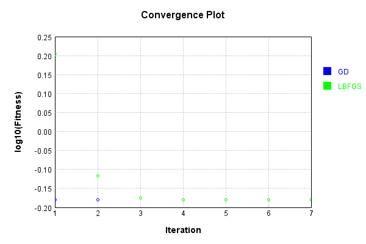
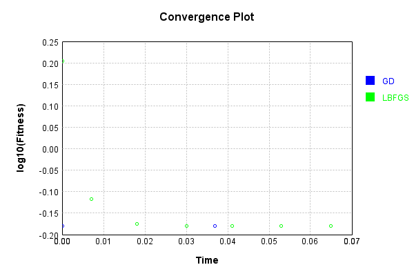

# ImgConcatLayer
## BandLimitTest
### Json Serialization
Code from [JsonTest.java:36](../../../../../../../../src/main/java/com/simiacryptus/mindseye/test/unit/JsonTest.java#L36) executed in 0.00 seconds: 
```java
    JsonObject json = layer.getJson();
    NNLayer echo = NNLayer.fromJson(json);
    if ((echo == null)) throw new AssertionError("Failed to deserialize");
    if ((layer == echo)) throw new AssertionError("Serialization did not copy");
    if ((!layer.equals(echo))) throw new AssertionError("Serialization not equal");
    return new GsonBuilder().setPrettyPrinting().create().toJson(json);
```

Returns: 

```
    {
      "class": "com.simiacryptus.mindseye.layers.cudnn.ImgConcatLayer",
      "id": "8269938f-791f-4888-9fb5-148f1259a5a4",
      "isFrozen": false,
      "name": "ImgConcatLayer/8269938f-791f-4888-9fb5-148f1259a5a4",
      "maxBands": 3,
      "precision": "Double"
    }
```


### Example Input/Output Pair
Code from [ReferenceIO.java:68](../../../../../../../../src/main/java/com/simiacryptus/mindseye/test/unit/ReferenceIO.java#L68) executed in 0.00 seconds: 
```java
    SimpleEval eval = SimpleEval.run(layer, inputPrototype);
    return String.format("--------------------\nInput: \n[%s]\n--------------------\nOutput: \n%s\n--------------------\nDerivative: \n%s",
      Arrays.stream(inputPrototype).map(t -> t.prettyPrint()).reduce((a, b) -> a + ",\n" + b).get(),
      eval.getOutput().prettyPrint(),
      Arrays.stream(eval.getDerivative()).map(t -> t.prettyPrint()).reduce((a, b) -> a + ",\n" + b).get());
```

Returns: 

```
    --------------------
    Input: 
    [[
    	[ [ 0.14, 0.576 ], [ 1.508, -1.96 ] ],
    	[ [ 0.788, -1.252 ], [ -1.644, 0.668 ] ]
    ],
    [
    	[ [ -0.028, 0.508 ], [ -0.656, 0.168 ] ],
    	[ [ 0.836, -0.552 ], [ 0.676, 0.172 ] ]
    ]]
    --------------------
    Output: 
    [
    	[ [ 0.14, 0.576, -0.028 ], [ 1.508, -1.96, -0.656 ] ],
    	[ [ 0.788, -1.252, 0.836 ], [ -1.644, 0.668, 0.676 ] ]
    ]
    --------------------
    Derivative: 
    [
    	[ [ 1.0, 1.0 ], [ 1.0, 1.0 ] ],
    	[ [ 1.0, 1.0 ], [ 1.0, 1.0 ] ]
    ],
    [
    	[ [ 1.0, 0.0 ], [ 1.0, 0.0 ] ],
    	[ [ 1.0, 0.0 ], [ 1.0, 0.0 ] ]
    ]
```


[GPU Log](etc/cuda.log)

### Batch Execution
Code from [BatchingTester.java:66](../../../../../../../../src/main/java/com/simiacryptus/mindseye/test/unit/BatchingTester.java#L66) executed in 0.01 seconds: 
```java
    return test(reference, inputPrototype);
```

Returns: 

```
    ToleranceStatistics{absoluteTol=0.0000e+00 +- 0.0000e+00 [0.0000e+00 - 0.0000e+00] (280#), relativeTol=0.0000e+00 +- 0.0000e+00 [0.0000e+00 - 0.0000e+00] (240#)}
```


Code from [SingleDerivativeTester.java:77](../../../../../../../../src/main/java/com/simiacryptus/mindseye/test/unit/SingleDerivativeTester.java#L77) executed in 0.03 seconds: 
```java
    return test(component, inputPrototype);
```
Logging: 
```
    Inputs: [
    	[ [ -0.276, 1.88 ], [ -1.504, -0.216 ] ],
    	[ [ -0.288, -0.38 ], [ -1.792, -1.588 ] ]
    ],
    [
    	[ [ 1.968, 0.74 ], [ -0.204, -1.312 ] ],
    	[ [ -0.048, -1.212 ], [ 0.9, 1.776 ] ]
    ]
    Inputs Statistics: {meanExponent=-0.15998336168391541, negative=7, min=-1.588, max=-1.588, mean=-0.5205000000000001, count=8.0, positive=1, stdDev=1.1018301820153593, zeros=0},
    {meanExponent=-0.1800937319525499, negative=4, min=1.776, max=1.776, mean=0.326, count=8.0, positive=4, stdDev=1.1602154972245458, zeros=0}
    Output: [
    	[ [ -0.276, 1.88, 1.968 ], [ -1.504, -0.216, -0.204 ] ],
    	[ [ -0.288, -0.38, -0.048 ], [ -1.792, -1.588, 0.9 ] ]
    ]
    Outputs Statistics: {meanExponent=-0.2533939904279325, negative=9, min=0.9, max=0.9, mean=-0.1290000000000001, count=12.0, positive=3, stdDev=1.1692893853390898, zeros=0}
    Feedback for input 0
    Inputs Values: [
    	[ [ -0.276, 1.88 ], [ -1.504, -0.216 ] ],
    	[ [ -0.288, -0.38 ], [ -1.792, -1.588 ] ]
    ]
    Value Statistics: {meanExponent=-0.15998336168391541, negative=7, min=-1.588, max=-1.588, mea
```
...[skipping 3331 bytes](etc/138.txt)...
```
    0.0, 0.0, 0.0, ... ], [ 0.0, 0.0, 0.0, 0.0, 0.0, 0.0, 0.0, 0.0, ... ] ]
    Measured Statistics: {meanExponent=-3.276302567614995E-14, negative=0, min=0.0, max=0.0, mean=0.04166666666666352, count=96.0, positive=4, stdDev=0.19982631347134824, zeros=92}
    Feedback Error: [ [ 0.0, 0.0, 0.0, 0.0, 0.0, 0.0, 0.0, 0.0, ... ], [ 0.0, 0.0, 0.0, 0.0, 0.0, 0.0, 0.0, 0.0, ... ], [ 0.0, 0.0, 0.0, 0.0, 0.0, 0.0, 0.0, 0.0, ... ], [ 0.0, 0.0, 0.0, 0.0, 0.0, 0.0, 0.0, 0.0, ... ], [ 0.0, 0.0, 0.0, 0.0, 0.0, 0.0, 0.0, 0.0, ... ], [ 0.0, 0.0, 0.0, 0.0, 0.0, 0.0, 0.0, 0.0, ... ], [ 0.0, 0.0, 0.0, 0.0, 0.0, 0.0, 0.0, 0.0, ... ], [ 0.0, 0.0, 0.0, 0.0, 0.0, 0.0, 0.0, 0.0, ... ] ]
    Error Statistics: {meanExponent=-13.104301089584563, negative=3, min=0.0, max=0.0, mean=-3.1433189384699745E-15, count=96.0, positive=1, stdDev=1.943485831517598E-14, zeros=92}
    Finite-Difference Derivative Accuracy:
    absoluteTol: 6.4590e-15 +- 2.5641e-14 [0.0000e+00 - 1.1013e-13] (192#)
    relativeTol: 5.1672e-14 +- 1.1261e-14 [1.4322e-14 - 5.5067e-14] (12#)
    
```

Returns: 

```
    ToleranceStatistics{absoluteTol=6.4590e-15 +- 2.5641e-14 [0.0000e+00 - 1.1013e-13] (192#), relativeTol=5.1672e-14 +- 1.1261e-14 [1.4322e-14 - 5.5067e-14] (12#)}
```


### Performance
Now we execute larger-scale runs to benchmark performance:

Code from [PerformanceTester.java:66](../../../../../../../../src/main/java/com/simiacryptus/mindseye/test/unit/PerformanceTester.java#L66) executed in 0.43 seconds: 
```java
    test(component, inputPrototype);
```
Logging: 
```
    100 batches
    Input Dimensions:
    	[100, 100, 1]
    	[100, 100, 1]
    Performance:
    	Evaluation performance: 0.014006s +- 0.001049s [0.012847s - 0.015688s]
    	Learning performance: 0.056784s +- 0.005711s [0.051144s - 0.066836s]
    
```

### Input Learning
In this test, we use a network to learn this target input, given it's pre-evaluated output:

Code from [LearningTester.java:127](../../../../../../../../src/main/java/com/simiacryptus/mindseye/test/unit/LearningTester.java#L127) executed in 0.01 seconds: 
```java
    return Arrays.stream(input_target).map(x -> x.prettyPrint()).reduce((a, b) -> a + "\n" + b).orElse("");
```

Returns: 

```
    [
    	[ [ 0.096 ], [ 1.288 ], [ -0.92 ], [ 0.836 ], [ -0.344 ], [ -0.78 ], [ 1.316 ], [ -1.168 ], ... ],
    	[ [ 0.456 ], [ -1.796 ], [ -0.632 ], [ -1.816 ], [ 0.224 ], [ -1.804 ], [ 0.424 ], [ 1.628 ], ... ],
    	[ [ 0.968 ], [ -0.156 ], [ 1.868 ], [ -1.8 ], [ -1.472 ], [ -0.032 ], [ 0.376 ], [ 1.904 ], ... ],
    	[ [ 0.604 ], [ 0.852 ], [ -0.868 ], [ 1.992 ], [ -0.82 ], [ -1.136 ], [ -0.244 ], [ 1.94 ], ... ],
    	[ [ -1.12 ], [ -0.128 ], [ 1.912 ], [ 1.332 ], [ -1.02 ], [ 1.292 ], [ 0.264 ], [ 1.556 ], ... ],
    	[ [ -0.428 ], [ 1.144 ], [ -0.512 ], [ 0.264 ], [ -0.668 ], [ 1.868 ], [ 0.452 ], [ 1.932 ], ... ],
    	[ [ -1.904 ], [ 0.816 ], [ -1.124 ], [ 0.048 ], [ 0.404 ], [ 1.364 ], [ 1.268 ], [ 1.092 ], ... ],
    	[ [ -1.272 ], [ 0.608 ], [ 1.844 ], [ 0.224 ], [ 1.444 ], [ 1.408 ], [ -0.676 ], [ -1.828 ], ... ],
    	...
    ]
    [
    	[ [ 0.852 ], [ 1.256 ], [ 1.428 ], [ 0.524 ], [ 0.56 ], [ -1.896 ], [ 1.06 ], [ -0.144 ], ... ],
    	[ [ -1.752 ], [ -1.588 ], [ -0.3 ], [ 1.996 ], [ 1.488 ], [ -1.488 ], [ -0.708 ], [ 1.908 ], ... ],
    	[ [ 0.316 ], [ 0.78 ], [ -0.704 ], [ 1.112 ], [ 1.952 ], [ 1.628 ], [ 0.148 ], [ -0.06 ], ... ],
    	[ [ 0.392 ], [ 0.848 ], [ 1.544 ], [ 0.852 ], [ -1.06 ], [ -1.76 ], [ 1.944 ], [ 0.168 ], ... ],
    	[ [ -1.064 ], [ -1.488 ], [ 1.568 ], [ 1.508 ], [ -1.012 ], [ 1.488 ], [ -0.084 ], [ 1.336 ], ... ],
    	[ [ -1.424 ], [ 0.004 ], [ 1.504 ], [ 1.64 ], [ -0.512 ], [ -1.288 ], [ 0.14 ], [ 1.86 ], ... ],
    	[ [ -0.956 ], [ -1.672 ], [ -0.404 ], [ 1.596 ], [ 1.952 ], [ -0.3 ], [ 1.948 ], [ -1.468 ], ... ],
    	[ [ 0.264 ], [ -0.764 ], [ 1.656 ], [ -0.656 ], [ -0.38 ], [ 0.836 ], [ -0.064 ], [ -0.064 ], ... ],
    	...
    ]
```


First, we use a conjugate gradient descent method, which converges the fastest for purely linear functions.

Code from [LearningTester.java:300](../../../../../../../../src/main/java/com/simiacryptus/mindseye/test/unit/LearningTester.java#L300) executed in 0.13 seconds: 
```java
    return new IterativeTrainer(trainable)
      .setLineSearchFactory(label -> new QuadraticSearch())
      .setOrientation(new GradientDescent())
      .setMonitor(monitor)
      .setTimeout(30, TimeUnit.SECONDS)
      .setMaxIterations(250)
      .setTerminateThreshold(0)
      .run();
```
Logging: 
```
    Constructing line search parameters: GD
    F(0.0) = LineSearchPoint{point=PointSample{avg=2.6365596184000304}, derivative=-7.9031973296E-4}
    New Minimum: 2.6365596184000304 > 2.6365596183999482
    F(1.0E-10) = LineSearchPoint{point=PointSample{avg=2.6365596183999482}, derivative=-7.903197329599843E-4}, delta = -8.215650382226158E-14
    New Minimum: 2.6365596183999482 > 2.6365596183994575
    F(7.000000000000001E-10) = LineSearchPoint{point=PointSample{avg=2.6365596183994575}, derivative=-7.903197329598894E-4}, delta = -5.728750807065808E-13
    New Minimum: 2.6365596183994575 > 2.63655961839613
    F(4.900000000000001E-9) = LineSearchPoint{point=PointSample{avg=2.63655961839613}, derivative=-7.903197329592256E-4}, delta = -3.9004355301131E-12
    New Minimum: 2.63655961839613 > 2.636559618372902
    F(3.430000000000001E-8) = LineSearchPoint{point=PointSample{avg=2.636559618372902}, derivative=-7.903197329545785E-4}, delta = -2.7128521651320625E-11
    New Minimum: 2.636559618372902 > 2.63655961821024
    F(2.4010000000000004E-7) = Line
```
...[skipping 5859 bytes](etc/139.txt)...
```
    .3055589192854) = LineSearchPoint{point=PointSample{avg=0.6607602860000018}, derivative=-1.3940131528451493E-36}, delta = 1.1102230246251565E-16
    F(71.71581222456042) = LineSearchPoint{point=PointSample{avg=0.6607602860000017}, derivative=-1.6862067966893623E-36}, delta = 0.0
    F(502.010685571923) = LineSearchPoint{point=PointSample{avg=0.6607602860000017}, derivative=-1.6033812236622466E-36}, delta = 0.0
    F(3514.0747990034606) = LineSearchPoint{point=PointSample{avg=0.6607602860000018}, derivative=-3.3667958158612158E-37}, delta = 1.1102230246251565E-16
    F(270.31344607718927) = LineSearchPoint{point=PointSample{avg=0.6607602860000017}, derivative=-1.6179902421995045E-36}, delta = 0.0
    Loops = 12
    F(5439.545242577703) = LineSearchPoint{point=PointSample{avg=0.6607602860000018}, derivative=1.0099778331167175E-36}, delta = 1.1102230246251565E-16
    0.6607602860000018 > 0.6607602860000017
    Iteration 3 failed, aborting. Error: 0.6607602860000017 Total: 249618539753082.5000; Orientation: 0.0003; Line Search: 0.0372
    
```

Returns: 

```
    0.6607602860000017
```


This training run resulted in the following regressed input:

Code from [LearningTester.java:144](../../../../../../../../src/main/java/com/simiacryptus/mindseye/test/unit/LearningTester.java#L144) executed in 0.01 seconds: 
```java
    return Arrays.stream(input_gd).map(x -> x.prettyPrint()).reduce((a, b) -> a + "\n" + b).orElse("");
```

Returns: 

```
    [
    	[ [ 0.474 ], [ 1.272 ], [ 0.25399999999999995 ], [ 0.68 ], [ 0.10800000000000003 ], [ -1.338 ], [ 1.1880000000000002 ], [ -0.656 ], ... ],
    	[ [ -0.648 ], [ -1.6920000000000002 ], [ -0.466 ], [ 0.09000000000000005 ], [ 0.856 ], [ -1.6460000000000001 ], [ -0.142 ], [ 1.768 ], ... ],
    	[ [ 0.642 ], [ 0.31200000000000006 ], [ 0.582 ], [ -0.34399999999999986 ], [ 0.24 ], [ 0.7979999999999999 ], [ 0.262 ], [ 0.9219999999999999 ], ... ],
    	[ [ 0.498 ], [ 0.85 ], [ 0.33799999999999997 ], [ 1.422 ], [ -0.94 ], [ -1.448 ], [ 0.85 ], [ 1.054 ], ... ],
    	[ [ -1.092 ], [ -0.8079999999999999 ], [ 1.74 ], [ 1.4200000000000002 ], [ -1.016 ], [ 1.3900000000000001 ], [ 0.09000000000000002 ], [ 1.4460000000000002 ], ... ],
    	[ [ -0.9259999999999999 ], [ 0.574 ], [ 0.4959999999999999 ], [ 0.952 ], [ -0.5900000000000001 ], [ 0.29 ], [ 0.296 ], [ 1.8960000000000001 ], ... ],
    	[ [ -1.43 ], [ -0.42799999999999994 ], [ -0.7640000000000001 ], [ 0.8220000000000001 ], [ 1.178 ], [ 0.532 ], [ 1.6079999999999999 ], [ -0.18799999999999997 ], ... ],
    	[ [ -0.504 ], [ -0.07799999999999996 ], [ 1.75 ], [ -0.21600000000000003 ], [ 0.5319999999999999 ], [ 1.1219999999999999 ], [ -0.37 ], [ -0.9460000000000001 ], ... ],
    	...
    ]
    [
    	[ [ 1.872 ], [ -1.812 ], [ 1.504 ], [ -0.804 ], [ 0.304 ], [ 1.744 ], [ -0.432 ], [ -0.432 ], ... ],
    	[ [ 0.904 ], [ 1.256 ], [ 0.192 ], [ -0.664 ], [ 0.496 ], [ 1.164 ], [ 1.572 ], [ -1.076 ], ... ],
    	[ [ 0.044 ], [ 1.436 ], [ 0.412 ], [ -0.72 ], [ 1.544 ], [ -0.256 ], [ -0.736 ], [ 1.004 ], ... ],
    	[ [ -1.932 ], [ 1.408 ], [ 1.348 ], [ -0.912 ], [ 1.476 ], [ 1.38 ], [ -0.796 ], [ -1.824 ], ... ],
    	[ [ 2.0 ], [ -1.252 ], [ 1.004 ], [ 0.56 ], [ 1.86 ], [ -1.688 ], [ -0.74 ], [ -1.488 ], ... ],
    	[ [ -0.82 ], [ 0.588 ], [ 0.088 ], [ 1.028 ], [ 1.876 ], [ 1.664 ], [ 0.848 ], [ 1.968 ], ... ],
    	[ [ 1.548 ], [ -0.856 ], [ -0.28 ], [ 1.6 ], [ -1.988 ], [ 0.836 ], [ -1.876 ], [ -1.704 ], ... ],
    	[ [ -1.252 ], [ -0.432 ], [ 0.668 ], [ -0.472 ], [ 1.436 ], [ -1.432 ], [ -0.004 ], [ 1.052 ], ... ],
    	...
    ]
```


Next, we run the same optimization using L-BFGS, which is nearly ideal for purely second-order or quadratic functions.

Code from [LearningTester.java:324](../../../../../../../../src/main/java/com/simiacryptus/mindseye/test/unit/LearningTester.java#L324) executed in 0.10 seconds: 
```java
    return new IterativeTrainer(trainable)
      .setLineSearchFactory(label -> new ArmijoWolfeSearch())
      .setOrientation(new LBFGS())
      .setMonitor(monitor)
      .setTimeout(30, TimeUnit.SECONDS)
      .setMaxIterations(250)
      .setTerminateThreshold(0)
      .run();
```
Logging: 
```
    LBFGS Accumulation History: 1 points
    Constructing line search parameters: GD
    th(0)=2.6365596184000304;dx=-7.9031973296E-4
    New Minimum: 2.6365596184000304 > 2.634857292985024
    WOLFE (weak): th(2.154434690031884)=2.634857292985024; dx=-7.899791945102189E-4 delta=0.0017023254150063671
    New Minimum: 2.634857292985024 > 2.6331557012378655
    WOLFE (weak): th(4.308869380063768)=2.6331557012378655; dx=-7.896386560604378E-4 delta=0.0034039171621649267
    New Minimum: 2.6331557012378655 > 2.626356670927867
    WOLFE (weak): th(12.926608140191302)=2.626356670927867; dx=-7.882765022613131E-4 delta=0.010202947472163437
    New Minimum: 2.626356670927867 > 2.5959063007669236
    WOLFE (weak): th(51.70643256076521)=2.5959063007669236; dx=-7.821468101652524E-4 delta=0.040653317633106756
    New Minimum: 2.5959063007669236 > 2.4375189570476845
    WOLFE (weak): th(258.53216280382605)=2.4375189570476845; dx=-7.494551189862618E-4 delta=0.19904066135234588
    New Minimum: 2.4375189570476845 > 1.6007879057777852
    END: th(1551.1929768229563)=1.600
```
...[skipping 2445 bytes](etc/140.txt)...
```
    000000002)=0.6607603964536726; dx=-4.4181468141091423E-10 delta=1.093491336345842E-5
    Iteration 6 complete. Error: 0.6607603964536726 Total: 249618628663775.3800; Orientation: 0.0006; Line Search: 0.0095
    LBFGS Accumulation History: 1 points
    th(0)=0.6607603964536726;dx=-4.418146814109126E-11
    New Minimum: 0.6607603964536726 > 0.6607603833875002
    WOLF (strong): th(9694.956105143481)=0.6607603833875002; dx=4.1486010716643835E-11 delta=1.3066172366293927E-8
    New Minimum: 0.6607603833875002 > 0.6607602861027749
    END: th(4847.478052571741)=0.6607602861027749; dx=-1.3477287122236153E-12 delta=1.1035089764188655E-7
    Iteration 7 complete. Error: 0.6607602861027749 Total: 249618640215944.3800; Orientation: 0.0005; Line Search: 0.0091
    LBFGS Accumulation History: 1 points
    th(0)=0.6607602861027749;dx=-4.1111641558660554E-14
    MAX ALPHA: th(0)=0.6607602861027749;th'(0)=-4.1111641558660554E-14;
    Iteration 8 failed, aborting. Error: 0.6607602861027749 Total: 249618649329553.3800; Orientation: 0.0006; Line Search: 0.0062
    
```

Returns: 

```
    0.6607602861027749
```


This training run resulted in the following regressed input:

Code from [LearningTester.java:154](../../../../../../../../src/main/java/com/simiacryptus/mindseye/test/unit/LearningTester.java#L154) executed in 0.05 seconds: 
```java
    return Arrays.stream(input_lbgfs).map(x -> x.prettyPrint()).reduce((a, b) -> a + "\n" + b).orElse("");
```

Returns: 

```
    [
    	[ [ 0.47400861162922725 ], [ 1.2720021637259364 ], [ 0.25400252434692583 ], [ 0.6799899314619755 ], [ 0.10799826901925082 ], [ -1.338003130190188 ], [ 1.1879927298808535 ], [ -0.6559826036434706 ], ... ],
    	[ [ -0.6480096357928371 ], [ -1.691991316246575 ], [ -0.46600858277954804 ], [ 0.09000829428275658 ], [ 0.8559945185609609 ], [ -1.6459985719408818 ], [ -0.1419989469867109 ], [ 1.7679956436984479 ], ... ],
    	[ [ 0.6420080634853232 ], [ 0.31199062385427523 ], [ 0.5820000144248396 ], [ -0.3439876811870016 ], [ 0.24000848180567108 ], [ 0.7979836855064388 ], [ 0.261998023796978 ], [ 0.9219883591544616 ], ... ],
    	[ [ 0.49800682294911974 ], [ 0.8500009953139308 ], [ 0.33798758021312464 ], [ 1.4220036783340921 ], [ -0.9399901911090879 ], [ -1.447990941200746 ], [ 0.8499937540444633 ], [ 1.0539803677933361 ], ... ],
    	[ [ -1.0920040966544398 ], [ -0.8080039812557231 ], [ 1.7399912296975375 ], [ 1.4199930472273241 ], [ -1.0160068373739592 ], [ 1.3899839451535512 ], [ 0.08999707175756595 ], [ 1.4459937828941425 ], 
```
...[skipping 420 bytes](etc/141.txt)...
```
    [ [ -0.5039977208753469 ], [ -0.07800786153756929 ], [ 1.7499732130729062 ], [ -0.21599148934464982 ], [ 0.5319919509395162 ], [ 1.1219883591544617 ], [ -0.3700113523487468 ], [ -0.9459998124770855 ], ... ],
    	...
    ]
    [
    	[ [ 1.872 ], [ -1.812 ], [ 1.504 ], [ -0.804 ], [ 0.304 ], [ 1.744 ], [ -0.432 ], [ -0.432 ], ... ],
    	[ [ 0.904 ], [ 1.256 ], [ 0.192 ], [ -0.664 ], [ 0.496 ], [ 1.164 ], [ 1.572 ], [ -1.076 ], ... ],
    	[ [ 0.044 ], [ 1.436 ], [ 0.412 ], [ -0.72 ], [ 1.544 ], [ -0.256 ], [ -0.736 ], [ 1.004 ], ... ],
    	[ [ -1.932 ], [ 1.408 ], [ 1.348 ], [ -0.912 ], [ 1.476 ], [ 1.38 ], [ -0.796 ], [ -1.824 ], ... ],
    	[ [ 2.0 ], [ -1.252 ], [ 1.004 ], [ 0.56 ], [ 1.86 ], [ -1.688 ], [ -0.74 ], [ -1.488 ], ... ],
    	[ [ -0.82 ], [ 0.588 ], [ 0.088 ], [ 1.028 ], [ 1.876 ], [ 1.664 ], [ 0.848 ], [ 1.968 ], ... ],
    	[ [ 1.548 ], [ -0.856 ], [ -0.28 ], [ 1.6 ], [ -1.988 ], [ 0.836 ], [ -1.876 ], [ -1.704 ], ... ],
    	[ [ -1.252 ], [ -0.432 ], [ 0.668 ], [ -0.472 ], [ 1.436 ], [ -1.432 ], [ -0.004 ], [ 1.052 ], ... ],
    	...
    ]
```


Code from [LearningTester.java:96](../../../../../../../../src/main/java/com/simiacryptus/mindseye/test/unit/LearningTester.java#L96) executed in 0.01 seconds: 
```java
    return TestUtil.compare(runs);
```

Returns: 




Code from [LearningTester.java:99](../../../../../../../../src/main/java/com/simiacryptus/mindseye/test/unit/LearningTester.java#L99) executed in 0.00 seconds: 
```java
    return TestUtil.compareTime(runs);
```

Returns: 




