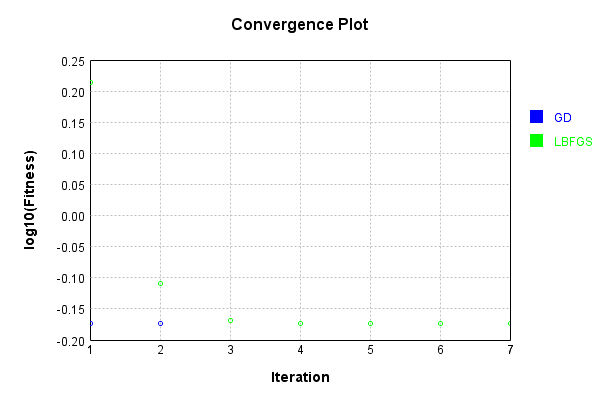
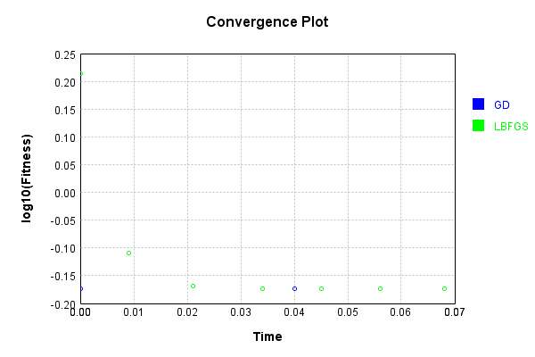

# ImgConcatLayer
## Double
### Json Serialization
Code from [JsonTest.java:36](../../../../../../../../src/main/java/com/simiacryptus/mindseye/test/unit/JsonTest.java#L36) executed in 0.00 seconds: 
```java
    JsonObject json = layer.getJson();
    NNLayer echo = NNLayer.fromJson(json);
    if ((echo == null)) throw new AssertionError("Failed to deserialize");
    if ((layer == echo)) throw new AssertionError("Serialization did not copy");
    if ((!layer.equals(echo))) throw new AssertionError("Serialization not equal");
    return new GsonBuilder().setPrettyPrinting().create().toJson(json);
```

Returns: 

```
    {
      "class": "com.simiacryptus.mindseye.layers.cudnn.ImgConcatLayer",
      "id": "cc87bd51-6e4d-495d-ac08-1181516ce4ab",
      "isFrozen": false,
      "name": "ImgConcatLayer/cc87bd51-6e4d-495d-ac08-1181516ce4ab",
      "maxBands": -1,
      "precision": "Double"
    }
```


### Example Input/Output Pair
Code from [ReferenceIO.java:68](../../../../../../../../src/main/java/com/simiacryptus/mindseye/test/unit/ReferenceIO.java#L68) executed in 0.00 seconds: 
```java
    SimpleEval eval = SimpleEval.run(layer, inputPrototype);
    return String.format("--------------------\nInput: \n[%s]\n--------------------\nOutput: \n%s\n--------------------\nDerivative: \n%s",
      Arrays.stream(inputPrototype).map(t -> t.prettyPrint()).reduce((a, b) -> a + ",\n" + b).get(),
      eval.getOutput().prettyPrint(),
      Arrays.stream(eval.getDerivative()).map(t -> t.prettyPrint()).reduce((a, b) -> a + ",\n" + b).get());
```

Returns: 

```
    --------------------
    Input: 
    [[
    	[ [ 1.692 ], [ -1.992 ] ],
    	[ [ 0.564 ], [ -1.508 ] ]
    ],
    [
    	[ [ 1.964 ], [ 0.128 ] ],
    	[ [ -0.32 ], [ -0.068 ] ]
    ]]
    --------------------
    Output: 
    [
    	[ [ 1.692, 1.964 ], [ -1.992, 0.128 ] ],
    	[ [ 0.564, -0.32 ], [ -1.508, -0.068 ] ]
    ]
    --------------------
    Derivative: 
    [
    	[ [ 1.0 ], [ 1.0 ] ],
    	[ [ 1.0 ], [ 1.0 ] ]
    ],
    [
    	[ [ 1.0 ], [ 1.0 ] ],
    	[ [ 1.0 ], [ 1.0 ] ]
    ]
```


[GPU Log](etc/cuda.log)

### Batch Execution
Code from [BatchingTester.java:66](../../../../../../../../src/main/java/com/simiacryptus/mindseye/test/unit/BatchingTester.java#L66) executed in 0.01 seconds: 
```java
    return test(reference, inputPrototype);
```

Returns: 

```
    ToleranceStatistics{absoluteTol=0.0000e+00 +- 0.0000e+00 [0.0000e+00 - 0.0000e+00] (160#), relativeTol=0.0000e+00 +- 0.0000e+00 [0.0000e+00 - 0.0000e+00] (160#)}
```


Code from [SingleDerivativeTester.java:77](../../../../../../../../src/main/java/com/simiacryptus/mindseye/test/unit/SingleDerivativeTester.java#L77) executed in 0.02 seconds: 
```java
    return test(component, inputPrototype);
```
Logging: 
```
    Inputs: [
    	[ [ -0.156 ], [ -1.448 ] ],
    	[ [ 1.816 ], [ 1.512 ] ]
    ],
    [
    	[ [ 1.096 ], [ 0.46 ] ],
    	[ [ -0.092 ], [ 0.072 ] ]
    ]
    Inputs Statistics: {meanExponent=-0.05185980110853907, negative=2, min=1.512, max=1.512, mean=0.43100000000000005, count=4.0, positive=2, stdDev=1.319279727730249, zeros=0},
    {meanExponent=-0.6190778225983129, negative=1, min=0.072, max=0.072, mean=0.384, count=4.0, positive=3, stdDev=0.4573401360038282, zeros=0}
    Output: [
    	[ [ -0.156, 1.096 ], [ -1.448, 0.46 ] ],
    	[ [ 1.816, -0.092 ], [ 1.512, 0.072 ] ]
    ]
    Outputs Statistics: {meanExponent=-0.33546881185342603, negative=3, min=0.072, max=0.072, mean=0.40750000000000003, count=8.0, positive=5, stdDev=0.9876141706152257, zeros=0}
    Feedback for input 0
    Inputs Values: [
    	[ [ -0.156 ], [ -1.448 ] ],
    	[ [ 1.816 ], [ 1.512 ] ]
    ]
    Value Statistics: {meanExponent=-0.05185980110853907, negative=2, min=1.512, max=1.512, mean=0.43100000000000005, count=4.0, positive=2, stdDev=1.319279727730249, zeros=0}
    Implemented Feedback: [ [ 1.0, 0.0, 0.0, 
```
...[skipping 1914 bytes](etc/142.txt)...
```
    0000000000000286, 0.0, 0.0 ], [ 0.0, 0.0, 0.0, 0.0, 0.0, 0.0, 0.9999999999998899, 0.0 ], [ 0.0, 0.0, 0.0, 0.0, 0.0, 0.0, 0.0, 1.0000000000000286 ] ]
    Measured Statistics: {meanExponent=-1.7695409011254224E-14, negative=0, min=1.0000000000000286, max=1.0000000000000286, mean=0.12499999999999489, count=32.0, positive=4, stdDev=0.33071891388306035, zeros=28}
    Feedback Error: [ [ 0.0, 0.0, 0.0, 0.0, -1.1013412404281553E-13, 0.0, 0.0, 0.0 ], [ 0.0, 0.0, 0.0, 0.0, 0.0, 2.864375403532904E-14, 0.0, 0.0 ], [ 0.0, 0.0, 0.0, 0.0, 0.0, 0.0, -1.1013412404281553E-13, 0.0 ], [ 0.0, 0.0, 0.0, 0.0, 0.0, 0.0, 0.0, 2.864375403532904E-14 ] ]
    Error Statistics: {meanExponent=-13.2505240811323, negative=2, min=2.864375403532904E-14, max=2.864375403532904E-14, mean=-5.093148125467906E-15, count=32.0, positive=2, stdDev=2.7989894826824766E-14, zeros=28}
    Finite-Difference Derivative Accuracy:
    absoluteTol: 1.1220e-14 +- 3.2201e-14 [0.0000e+00 - 1.1013e-13] (64#)
    relativeTol: 4.4881e-14 +- 1.7643e-14 [1.4322e-14 - 5.5067e-14] (8#)
    
```

Returns: 

```
    ToleranceStatistics{absoluteTol=1.1220e-14 +- 3.2201e-14 [0.0000e+00 - 1.1013e-13] (64#), relativeTol=4.4881e-14 +- 1.7643e-14 [1.4322e-14 - 5.5067e-14] (8#)}
```


### Performance
Now we execute larger-scale runs to benchmark performance:

Code from [PerformanceTester.java:66](../../../../../../../../src/main/java/com/simiacryptus/mindseye/test/unit/PerformanceTester.java#L66) executed in 0.49 seconds: 
```java
    test(component, inputPrototype);
```
Logging: 
```
    100 batches
    Input Dimensions:
    	[100, 100, 1]
    	[100, 100, 1]
    Performance:
    	Evaluation performance: 0.017689s +- 0.001132s [0.015755s - 0.018986s]
    	Learning performance: 0.064586s +- 0.021739s [0.050351s - 0.107604s]
    
```

### Input Learning
In this test, we use a network to learn this target input, given it's pre-evaluated output:

Code from [LearningTester.java:127](../../../../../../../../src/main/java/com/simiacryptus/mindseye/test/unit/LearningTester.java#L127) executed in 0.01 seconds: 
```java
    return Arrays.stream(input_target).map(x -> x.prettyPrint()).reduce((a, b) -> a + "\n" + b).orElse("");
```

Returns: 

```
    [
    	[ [ 1.444 ], [ -1.112 ], [ 1.028 ], [ 1.132 ], [ -0.2 ], [ -0.4 ], [ -0.676 ], [ 1.192 ], ... ],
    	[ [ 0.756 ], [ 0.76 ], [ 0.636 ], [ -0.672 ], [ -1.788 ], [ -1.64 ], [ 0.032 ], [ 1.632 ], ... ],
    	[ [ -1.016 ], [ -1.412 ], [ 1.932 ], [ -0.096 ], [ -1.392 ], [ 1.22 ], [ -1.2 ], [ -1.504 ], ... ],
    	[ [ -0.496 ], [ 1.856 ], [ 0.084 ], [ 1.396 ], [ 1.036 ], [ -1.62 ], [ -1.44 ], [ -1.876 ], ... ],
    	[ [ 0.712 ], [ -1.012 ], [ -1.456 ], [ 1.868 ], [ 0.876 ], [ -0.972 ], [ 0.952 ], [ -0.7 ], ... ],
    	[ [ -1.052 ], [ 0.428 ], [ -0.452 ], [ 0.348 ], [ -1.904 ], [ 1.408 ], [ 1.184 ], [ -1.272 ], ... ],
    	[ [ 0.608 ], [ -1.072 ], [ -0.196 ], [ 1.964 ], [ 1.048 ], [ 2.0 ], [ -0.12 ], [ 1.944 ], ... ],
    	[ [ 0.9 ], [ -1.512 ], [ 1.148 ], [ 0.24 ], [ -1.824 ], [ -0.528 ], [ -1.184 ], [ -1.396 ], ... ],
    	...
    ]
    [
    	[ [ 0.836 ], [ -0.18 ], [ 0.692 ], [ 0.548 ], [ -1.816 ], [ -0.416 ], [ -0.02 ], [ -0.992 ], ... ],
    	[ [ -1.044 ], [ 0.96 ], [ 0.66 ], [ -0.864 ], [ 0.98 ], [ -1.284 ], [ 0.892 ], [ 0.984 ], ... ],
    	[ [ -1.08 ], [ 0.376 ], [ 1.412 ], [ -0.044 ], [ 1.068 ], [ -0.536 ], [ -0.312 ], [ -0.144 ], ... ],
    	[ [ 1.112 ], [ -0.092 ], [ 1.32 ], [ -1.348 ], [ -0.368 ], [ -0.128 ], [ -0.92 ], [ -0.648 ], ... ],
    	[ [ 1.272 ], [ -0.536 ], [ -0.996 ], [ 0.156 ], [ -0.684 ], [ -0.356 ], [ 1.352 ], [ -1.424 ], ... ],
    	[ [ 1.724 ], [ -1.352 ], [ -0.584 ], [ -0.456 ], [ 1.872 ], [ 1.796 ], [ 0.956 ], [ 0.42 ], ... ],
    	[ [ -1.952 ], [ -1.096 ], [ -0.648 ], [ 1.072 ], [ 0.68 ], [ 1.028 ], [ 1.392 ], [ -1.852 ], ... ],
    	[ [ 1.536 ], [ 0.48 ], [ -0.112 ], [ -1.384 ], [ -1.352 ], [ -0.324 ], [ -0.208 ], [ -1.848 ], ... ],
    	...
    ]
```


First, we use a conjugate gradient descent method, which converges the fastest for purely linear functions.

Code from [LearningTester.java:300](../../../../../../../../src/main/java/com/simiacryptus/mindseye/test/unit/LearningTester.java#L300) executed in 0.20 seconds: 
```java
    return new IterativeTrainer(trainable)
      .setLineSearchFactory(label -> new QuadraticSearch())
      .setOrientation(new GradientDescent())
      .setMonitor(monitor)
      .setTimeout(30, TimeUnit.SECONDS)
      .setMaxIterations(250)
      .setTerminateThreshold(0)
      .run();
```
Logging: 
```
    Constructing line search parameters: GD
    F(0.0) = LineSearchPoint{point=PointSample{avg=2.705020379200003}, derivative=-8.136433900800001E-4}
    New Minimum: 2.705020379200003 > 2.705020379199927
    F(1.0E-10) = LineSearchPoint{point=PointSample{avg=2.705020379199927}, derivative=-8.136433900799838E-4}, delta = -7.593925488436071E-14
    New Minimum: 2.705020379199927 > 2.7050203791994445
    F(7.000000000000001E-10) = LineSearchPoint{point=PointSample{avg=2.7050203791994445}, derivative=-8.136433900798862E-4}, delta = -5.586642259913788E-13
    New Minimum: 2.7050203791994445 > 2.7050203791960157
    F(4.900000000000001E-9) = LineSearchPoint{point=PointSample{avg=2.7050203791960157}, derivative=-8.136433900792027E-4}, delta = -3.987477015243712E-12
    New Minimum: 2.7050203791960157 > 2.7050203791720944
    F(3.430000000000001E-8) = LineSearchPoint{point=PointSample{avg=2.7050203791720944}, derivative=-8.136433900744185E-4}, delta = -2.7908786393027185E-11
    New Minimum: 2.7050203791720944 > 2.705020379004645
    F(2.401000000000000
```
...[skipping 7709 bytes](etc/143.txt)...
```
    elta = 0.0
    Right bracket at 0.01081350562578125
    F(0.005406752812890625) = LineSearchPoint{point=PointSample{avg=0.6709119040000037}, derivative=-1.6791836632478252E-36}, delta = 0.0
    Right bracket at 0.005406752812890625
    F(0.0027033764064453127) = LineSearchPoint{point=PointSample{avg=0.6709119040000037}, derivative=-1.6791836632478252E-36}, delta = 0.0
    Right bracket at 0.0027033764064453127
    F(0.0013516882032226563) = LineSearchPoint{point=PointSample{avg=0.6709119040000037}, derivative=-1.6791836632478252E-36}, delta = 0.0
    Right bracket at 0.0013516882032226563
    F(6.758441016113282E-4) = LineSearchPoint{point=PointSample{avg=0.6709119040000037}, derivative=-1.6791836632478252E-36}, delta = 0.0
    Right bracket at 6.758441016113282E-4
    F(3.379220508056641E-4) = LineSearchPoint{point=PointSample{avg=0.6709119040000037}, derivative=-1.6791836632478252E-36}, delta = 0.0
    Loops = 12
    Iteration 3 failed, aborting. Error: 0.6709119040000037 Total: 249619585964322.5000; Orientation: 0.0006; Line Search: 0.0975
    
```

Returns: 

```
    0.6709119040000037
```


This training run resulted in the following regressed input:

Code from [LearningTester.java:144](../../../../../../../../src/main/java/com/simiacryptus/mindseye/test/unit/LearningTester.java#L144) executed in 0.01 seconds: 
```java
    return Arrays.stream(input_gd).map(x -> x.prettyPrint()).reduce((a, b) -> a + "\n" + b).orElse("");
```

Returns: 

```
    [
    	[ [ 1.14 ], [ -0.6460000000000001 ], [ 0.86 ], [ 0.84 ], [ -1.008 ], [ -0.40800000000000003 ], [ -0.34800000000000003 ], [ 0.09999999999999998 ], ... ],
    	[ [ -0.14400000000000002 ], [ 0.86 ], [ 0.648 ], [ -0.768 ], [ -0.404 ], [ -1.462 ], [ 0.462 ], [ 1.3079999999999998 ], ... ],
    	[ [ -1.048 ], [ -0.518 ], [ 1.672 ], [ -0.07 ], [ -0.16199999999999995 ], [ 0.342 ], [ -0.756 ], [ -0.824 ], ... ],
    	[ [ 0.308 ], [ 0.882 ], [ 0.702 ], [ 0.023999999999999966 ], [ 0.33399999999999996 ], [ -0.874 ], [ -1.18 ], [ -1.262 ], ... ],
    	[ [ 0.992 ], [ -0.774 ], [ -1.226 ], [ 1.012 ], [ 0.096 ], [ -0.6639999999999999 ], [ 1.1520000000000001 ], [ -1.062 ], ... ],
    	[ [ 0.3360000000000001 ], [ -0.4620000000000001 ], [ -0.518 ], [ -0.05399999999999999 ], [ -0.01599999999999982 ], [ 1.6019999999999999 ], [ 1.0699999999999998 ], [ -0.4260000000000001 ], ... ],
    	[ [ -0.672 ], [ -1.084 ], [ -0.422 ], [ 1.518 ], [ 0.8640000000000001 ], [ 1.514 ], [ 0.6359999999999999 ], [ 0.04599999999999998 ], ... ],
    	[ [ 1.218 ], [ -0.516 ], [ 0.518 ], [ -0.572 ], [ -1.588 ], [ -0.426 ], [ -0.696 ], [ -1.622 ], ... ],
    	...
    ]
    [
    	[ [ -0.084 ], [ 0.008 ], [ -1.16 ], [ -1.416 ], [ -1.256 ], [ 0.62 ], [ 1.556 ], [ -0.34 ], ... ],
    	[ [ -1.816 ], [ -1.78 ], [ -0.228 ], [ -1.24 ], [ -0.908 ], [ 1.992 ], [ -1.576 ], [ -0.732 ], ... ],
    	[ [ 1.416 ], [ 0.98 ], [ 1.904 ], [ 0.984 ], [ 1.22 ], [ 1.416 ], [ 1.704 ], [ 0.644 ], ... ],
    	[ [ -0.596 ], [ 0.884 ], [ 0.048 ], [ 0.492 ], [ -0.94 ], [ 0.98 ], [ 1.964 ], [ 1.34 ], ... ],
    	[ [ -1.144 ], [ -0.736 ], [ 1.404 ], [ -1.38 ], [ -1.128 ], [ -0.908 ], [ 0.752 ], [ -0.352 ], ... ],
    	[ [ -1.064 ], [ -1.38 ], [ -0.548 ], [ -1.584 ], [ -1.024 ], [ 0.384 ], [ -0.784 ], [ 1.836 ], ... ],
    	[ [ 1.28 ], [ 1.644 ], [ -0.5 ], [ 0.624 ], [ 1.2 ], [ -1.064 ], [ -1.436 ], [ 1.916 ], ... ],
    	[ [ -1.848 ], [ 1.096 ], [ 1.468 ], [ 1.204 ], [ 1.26 ], [ -0.088 ], [ 0.532 ], [ 0.512 ], ... ],
    	...
    ]
```


Next, we run the same optimization using L-BFGS, which is nearly ideal for purely second-order or quadratic functions.

Code from [LearningTester.java:324](../../../../../../../../src/main/java/com/simiacryptus/mindseye/test/unit/LearningTester.java#L324) executed in 0.11 seconds: 
```java
    return new IterativeTrainer(trainable)
      .setLineSearchFactory(label -> new ArmijoWolfeSearch())
      .setOrientation(new LBFGS())
      .setMonitor(monitor)
      .setTimeout(30, TimeUnit.SECONDS)
      .setMaxIterations(250)
      .setTerminateThreshold(0)
      .run();
```
Logging: 
```
    LBFGS Accumulation History: 1 points
    Constructing line search parameters: GD
    th(0)=2.705020379200003;dx=-8.136433900800001E-4
    New Minimum: 2.705020379200003 > 2.7032678153149106
    WOLFE (weak): th(2.154434690031884)=2.7032678153149106; dx=-8.132928017710193E-4 delta=0.001752563885092595
    New Minimum: 2.7032678153149106 > 2.701516006749421
    WOLFE (weak): th(4.308869380063768)=2.701516006749421; dx=-8.129422134620387E-4 delta=0.003504372450582327
    New Minimum: 2.701516006749421 > 2.694516325683647
    WOLFE (weak): th(12.926608140191302)=2.694516325683647; dx=-8.115398602261159E-4 delta=0.010504053516356304
    New Minimum: 2.694516325683647 > 2.6631673141713734
    WOLFE (weak): th(51.70643256076521)=2.6631673141713734; dx=-8.052292706644633E-4 delta=0.04185306502862973
    New Minimum: 2.6631673141713734 > 2.500105695038057
    WOLFE (weak): th(258.53216280382605)=2.500105695038057; dx=-7.715727930023161E-4 delta=0.20491468416194625
    New Minimum: 2.500105695038057 > 1.6386813110224265
    END: th(1551.1929768229563)=1.638681
```
...[skipping 2437 bytes](etc/144.txt)...
```
    .000000000002)=0.6709120177133383; dx=-4.54853371589147E-10 delta=1.1257620952331848E-5
    Iteration 6 complete. Error: 0.6709120177133383 Total: 249619686006841.3000; Orientation: 0.0006; Line Search: 0.0080
    LBFGS Accumulation History: 1 points
    th(0)=0.6709120177133383;dx=-4.548533715891439E-11
    New Minimum: 0.6709120177133383 > 0.6709120042615717
    WOLF (strong): th(9694.956105143481)=0.6709120042615717; dx=4.271033227775083E-11 delta=1.3451766589511749E-8
    New Minimum: 0.6709120042615717 > 0.6709119041058129
    END: th(4847.478052571741)=0.6709119041058129; dx=-1.3875024405818971E-12 delta=1.1360752538713825E-7
    Iteration 7 complete. Error: 0.6709119041058129 Total: 249619697576963.3000; Orientation: 0.0005; Line Search: 0.0092
    LBFGS Accumulation History: 1 points
    th(0)=0.6709119041058129;dx=-4.232491485980818E-14
    MAX ALPHA: th(0)=0.6709119041058129;th'(0)=-4.232491485980818E-14;
    Iteration 8 failed, aborting. Error: 0.6709119041058129 Total: 249619704833938.3000; Orientation: 0.0005; Line Search: 0.0048
    
```

Returns: 

```
    0.6709119041058129
```


This training run resulted in the following regressed input:

Code from [LearningTester.java:154](../../../../../../../../src/main/java/com/simiacryptus/mindseye/test/unit/LearningTester.java#L154) executed in 0.04 seconds: 
```java
    return Arrays.stream(input_lbgfs).map(x -> x.prettyPrint()).reduce((a, b) -> a + "\n" + b).orElse("");
```

Returns: 

```
    [
    	[ [ 1.1399777857470519 ], [ -0.6459936386457468 ], [ 0.8599817670027752 ], [ 0.839998499816684 ], [ -1.0080045293996271 ], [ -0.4080040678047606 ], [ -0.3480041543537981 ], [ 0.09998840242898041 ], ... ],
    	[ [ -0.1440004327451872 ], [ 0.8599918932401579 ], [ 0.6479909123510668 ], [ -0.7679995095554544 ], [ -0.40399047960587947 ], [ -1.4619996393790105 ], [ 0.4620050342690123 ], [ 1.3079774972502605 ], ... ],
    	[ [ -1.047997374679197 ], [ -0.5179829354147808 ], [ 1.6719970861824054 ], [ -0.07001146774746339 ], [ -0.1620102849106181 ], [ 0.3420013415100806 ], [ -0.7559880850825097 ], [ -0.8239959610449186 ], ... ],
    	[ [ 0.30799039305684206 ], [ 0.8819832239115725 ], [ 0.7020028705430758 ], [ 0.02398600790561047 ], [ 0.33399245580890147 ], [ -0.8739973314046784 ], [ -1.1800032600137442 ], [ -1.2620024666475675 ], ... ],
    	[ [ 0.9920064334784512 ], [ -0.7740035917850546 ], [ -1.2259998413267645 ], [ 1.0119815073556628 ], [ 0.09601156872134037 ], [ -0.6639887197754512 ], [ 1.1519831229376953 ], [ -1.0619966390123
```
...[skipping 428 bytes](etc/145.txt)...
```
    . ],
    	[ [ 1.2179937828941425 ], [ -0.5160019617781825 ], [ 0.5180083808317939 ], [ -0.5720048467460976 ], [ -1.587999047960588 ], [ -0.42598495489232163 ], [ -0.6959914027956123 ], [ -1.621980512041732 ], ... ],
    	...
    ]
    [
    	[ [ -0.084 ], [ 0.008 ], [ -1.16 ], [ -1.416 ], [ -1.256 ], [ 0.62 ], [ 1.556 ], [ -0.34 ], ... ],
    	[ [ -1.816 ], [ -1.78 ], [ -0.228 ], [ -1.24 ], [ -0.908 ], [ 1.992 ], [ -1.576 ], [ -0.732 ], ... ],
    	[ [ 1.416 ], [ 0.98 ], [ 1.904 ], [ 0.984 ], [ 1.22 ], [ 1.416 ], [ 1.704 ], [ 0.644 ], ... ],
    	[ [ -0.596 ], [ 0.884 ], [ 0.048 ], [ 0.492 ], [ -0.94 ], [ 0.98 ], [ 1.964 ], [ 1.34 ], ... ],
    	[ [ -1.144 ], [ -0.736 ], [ 1.404 ], [ -1.38 ], [ -1.128 ], [ -0.908 ], [ 0.752 ], [ -0.352 ], ... ],
    	[ [ -1.064 ], [ -1.38 ], [ -0.548 ], [ -1.584 ], [ -1.024 ], [ 0.384 ], [ -0.784 ], [ 1.836 ], ... ],
    	[ [ 1.28 ], [ 1.644 ], [ -0.5 ], [ 0.624 ], [ 1.2 ], [ -1.064 ], [ -1.436 ], [ 1.916 ], ... ],
    	[ [ -1.848 ], [ 1.096 ], [ 1.468 ], [ 1.204 ], [ 1.26 ], [ -0.088 ], [ 0.532 ], [ 0.512 ], ... ],
    	...
    ]
```


Code from [LearningTester.java:96](../../../../../../../../src/main/java/com/simiacryptus/mindseye/test/unit/LearningTester.java#L96) executed in 0.00 seconds: 
```java
    return TestUtil.compare(runs);
```

Returns: 




Code from [LearningTester.java:99](../../../../../../../../src/main/java/com/simiacryptus/mindseye/test/unit/LearningTester.java#L99) executed in 0.00 seconds: 
```java
    return TestUtil.compareTime(runs);
```

Returns: 




