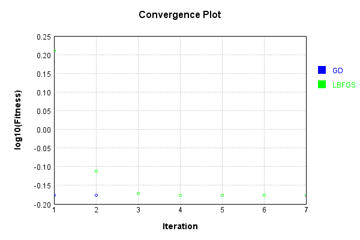
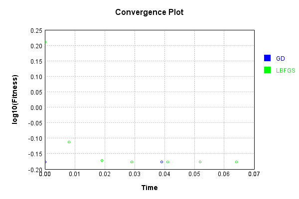

# ImgConcatLayer
## Float
### Json Serialization
Code from [JsonTest.java:36](../../../../../../../../src/main/java/com/simiacryptus/mindseye/test/unit/JsonTest.java#L36) executed in 0.00 seconds: 
```java
    JsonObject json = layer.getJson();
    NNLayer echo = NNLayer.fromJson(json);
    if ((echo == null)) throw new AssertionError("Failed to deserialize");
    if ((layer == echo)) throw new AssertionError("Serialization did not copy");
    if ((!layer.equals(echo))) throw new AssertionError("Serialization not equal");
    return new GsonBuilder().setPrettyPrinting().create().toJson(json);
```

Returns: 

```
    {
      "class": "com.simiacryptus.mindseye.layers.cudnn.ImgConcatLayer",
      "id": "d69a5f89-0c7e-4561-a3c9-0c9e73e4d484",
      "isFrozen": false,
      "name": "ImgConcatLayer/d69a5f89-0c7e-4561-a3c9-0c9e73e4d484",
      "maxBands": -1,
      "precision": "Double"
    }
```


### Example Input/Output Pair
Code from [ReferenceIO.java:68](../../../../../../../../src/main/java/com/simiacryptus/mindseye/test/unit/ReferenceIO.java#L68) executed in 0.00 seconds: 
```java
    SimpleEval eval = SimpleEval.run(layer, inputPrototype);
    return String.format("--------------------\nInput: \n[%s]\n--------------------\nOutput: \n%s\n--------------------\nDerivative: \n%s",
      Arrays.stream(inputPrototype).map(t -> t.prettyPrint()).reduce((a, b) -> a + ",\n" + b).get(),
      eval.getOutput().prettyPrint(),
      Arrays.stream(eval.getDerivative()).map(t -> t.prettyPrint()).reduce((a, b) -> a + ",\n" + b).get());
```

Returns: 

```
    --------------------
    Input: 
    [[
    	[ [ 0.032 ], [ 0.396 ] ],
    	[ [ -1.268 ], [ 0.064 ] ]
    ],
    [
    	[ [ -0.088 ], [ 0.76 ] ],
    	[ [ 0.72 ], [ 0.696 ] ]
    ]]
    --------------------
    Output: 
    [
    	[ [ 0.032, -0.088 ], [ 0.396, 0.76 ] ],
    	[ [ -1.268, 0.72 ], [ 0.064, 0.696 ] ]
    ]
    --------------------
    Derivative: 
    [
    	[ [ 1.0 ], [ 1.0 ] ],
    	[ [ 1.0 ], [ 1.0 ] ]
    ],
    [
    	[ [ 1.0 ], [ 1.0 ] ],
    	[ [ 1.0 ], [ 1.0 ] ]
    ]
```


[GPU Log](etc/cuda.log)

### Batch Execution
Code from [BatchingTester.java:66](../../../../../../../../src/main/java/com/simiacryptus/mindseye/test/unit/BatchingTester.java#L66) executed in 0.01 seconds: 
```java
    return test(reference, inputPrototype);
```

Returns: 

```
    ToleranceStatistics{absoluteTol=0.0000e+00 +- 0.0000e+00 [0.0000e+00 - 0.0000e+00] (160#), relativeTol=0.0000e+00 +- 0.0000e+00 [0.0000e+00 - 0.0000e+00] (160#)}
```


Code from [SingleDerivativeTester.java:77](../../../../../../../../src/main/java/com/simiacryptus/mindseye/test/unit/SingleDerivativeTester.java#L77) executed in 0.02 seconds: 
```java
    return test(component, inputPrototype);
```
Logging: 
```
    Inputs: [
    	[ [ 1.608 ], [ -1.508 ] ],
    	[ [ 1.868 ], [ -0.556 ] ]
    ],
    [
    	[ [ -0.924 ], [ -0.424 ] ],
    	[ [ -1.744 ], [ -0.196 ] ]
    ]
    Inputs Statistics: {meanExponent=0.10028476235557994, negative=2, min=-0.556, max=-0.556, mean=0.353, count=4.0, positive=2, stdDev=1.4282727330590612, zeros=0},
    {meanExponent=-0.21828990505853405, negative=4, min=-0.196, max=-0.196, mean=-0.8220000000000001, count=4.0, positive=0, stdDev=0.5938787755089416, zeros=0}
    Output: [
    	[ [ 1.608, -0.924 ], [ -1.508, -0.424 ] ],
    	[ [ 1.868, -1.744 ], [ -0.556, -0.196 ] ]
    ]
    Outputs Statistics: {meanExponent=-0.05900257135147705, negative=6, min=-0.196, max=-0.196, mean=-0.23450000000000001, count=8.0, positive=2, stdDev=1.2415650405838592, zeros=0}
    Feedback for input 0
    Inputs Values: [
    	[ [ 1.608 ], [ -1.508 ] ],
    	[ [ 1.868 ], [ -0.556 ] ]
    ]
    Value Statistics: {meanExponent=0.10028476235557994, negative=2, min=-0.556, max=-0.556, mean=0.353, count=4.0, positive=2, stdDev=1.4282727330590612, zeros=0}
    Implemented Feedback: [ [ 1.0, 0.0, 0
```
...[skipping 1949 bytes](etc/146.txt)...
```
    998899, 0.0, 0.0 ], [ 0.0, 0.0, 0.0, 0.0, 0.0, 0.0, 0.9999999999998899, 0.0 ], [ 0.0, 0.0, 0.0, 0.0, 0.0, 0.0, 0.0, 0.9999999999998899 ] ]
    Measured Statistics: {meanExponent=-4.7830642341045674E-14, negative=0, min=0.9999999999998899, max=0.9999999999998899, mean=0.12499999999998623, count=32.0, positive=4, stdDev=0.3307189138830374, zeros=28}
    Feedback Error: [ [ 0.0, 0.0, 0.0, 0.0, -1.1013412404281553E-13, 0.0, 0.0, 0.0 ], [ 0.0, 0.0, 0.0, 0.0, 0.0, -1.1013412404281553E-13, 0.0, 0.0 ], [ 0.0, 0.0, 0.0, 0.0, 0.0, 0.0, -1.1013412404281553E-13, 0.0 ], [ 0.0, 0.0, 0.0, 0.0, 0.0, 0.0, 0.0, -1.1013412404281553E-13 ] ]
    Error Statistics: {meanExponent=-12.958078098036825, negative=4, min=-1.1013412404281553E-13, max=-1.1013412404281553E-13, mean=-1.3766765505351941E-14, count=32.0, positive=0, stdDev=3.6423437884903677E-14, zeros=28}
    Finite-Difference Derivative Accuracy:
    absoluteTol: 1.3767e-14 +- 3.6423e-14 [0.0000e+00 - 1.1013e-13] (64#)
    relativeTol: 5.5067e-14 +- 0.0000e+00 [5.5067e-14 - 5.5067e-14] (8#)
    
```

Returns: 

```
    ToleranceStatistics{absoluteTol=1.3767e-14 +- 3.6423e-14 [0.0000e+00 - 1.1013e-13] (64#), relativeTol=5.5067e-14 +- 0.0000e+00 [5.5067e-14 - 5.5067e-14] (8#)}
```


### Performance
Now we execute larger-scale runs to benchmark performance:

Code from [PerformanceTester.java:66](../../../../../../../../src/main/java/com/simiacryptus/mindseye/test/unit/PerformanceTester.java#L66) executed in 0.47 seconds: 
```java
    test(component, inputPrototype);
```
Logging: 
```
    100 batches
    Input Dimensions:
    	[100, 100, 1]
    	[100, 100, 1]
    Performance:
    	Evaluation performance: 0.011880s +- 0.000565s [0.011170s - 0.012531s]
    	Learning performance: 0.068232s +- 0.029488s [0.051425s - 0.127029s]
    
```

### Input Learning
In this test, we use a network to learn this target input, given it's pre-evaluated output:

Code from [LearningTester.java:127](../../../../../../../../src/main/java/com/simiacryptus/mindseye/test/unit/LearningTester.java#L127) executed in 0.01 seconds: 
```java
    return Arrays.stream(input_target).map(x -> x.prettyPrint()).reduce((a, b) -> a + "\n" + b).orElse("");
```

Returns: 

```
    [
    	[ [ 0.26 ], [ 0.7 ], [ 0.636 ], [ 1.848 ], [ -1.544 ], [ -0.656 ], [ -0.208 ], [ -0.84 ], ... ],
    	[ [ -0.444 ], [ -0.644 ], [ 0.244 ], [ 1.016 ], [ -1.348 ], [ 0.964 ], [ -1.48 ], [ 1.628 ], ... ],
    	[ [ -1.476 ], [ 0.396 ], [ -1.072 ], [ 0.66 ], [ 0.456 ], [ -1.244 ], [ 0.8 ], [ 1.576 ], ... ],
    	[ [ -1.756 ], [ -1.592 ], [ 1.068 ], [ -0.236 ], [ 1.028 ], [ 0.672 ], [ -0.324 ], [ 0.028 ], ... ],
    	[ [ -1.024 ], [ -0.896 ], [ 1.42 ], [ -1.32 ], [ 1.792 ], [ -1.86 ], [ 1.848 ], [ -1.828 ], ... ],
    	[ [ -1.116 ], [ 1.944 ], [ -0.748 ], [ -0.28 ], [ -1.096 ], [ -1.588 ], [ 0.592 ], [ 0.06 ], ... ],
    	[ [ -0.02 ], [ -1.404 ], [ 0.732 ], [ 0.704 ], [ -0.236 ], [ -0.868 ], [ 1.164 ], [ -1.02 ], ... ],
    	[ [ -0.016 ], [ 1.652 ], [ -1.456 ], [ 1.16 ], [ -1.116 ], [ -0.448 ], [ -0.528 ], [ 1.924 ], ... ],
    	...
    ]
    [
    	[ [ 0.352 ], [ 1.196 ], [ -0.648 ], [ 1.352 ], [ -0.532 ], [ -0.62 ], [ -0.812 ], [ -1.212 ], ... ],
    	[ [ -0.196 ], [ 0.468 ], [ -1.212 ], [ 0.308 ], [ -1.192 ], [ -1.284 ], [ 0.192 ], [ -1.88 ], ... ],
    	[ [ 0.972 ], [ -1.668 ], [ 0.54 ], [ 1.96 ], [ 1.244 ], [ -1.588 ], [ -0.352 ], [ 0.372 ], ... ],
    	[ [ -1.74 ], [ -1.848 ], [ -0.812 ], [ -1.34 ], [ -0.036 ], [ -1.848 ], [ 0.652 ], [ -1.832 ], ... ],
    	[ [ -0.312 ], [ 1.824 ], [ -1.108 ], [ -0.196 ], [ 1.328 ], [ -1.3 ], [ -0.156 ], [ 0.544 ], ... ],
    	[ [ 0.504 ], [ -1.2 ], [ 0.772 ], [ -1.1 ], [ 0.164 ], [ 0.028 ], [ -0.756 ], [ 1.004 ], ... ],
    	[ [ 1.36 ], [ 0.712 ], [ -0.72 ], [ -1.948 ], [ -1.32 ], [ 1.876 ], [ -1.764 ], [ -1.796 ], ... ],
    	[ [ 0.736 ], [ -0.284 ], [ -1.468 ], [ 1.524 ], [ 1.112 ], [ -1.5 ], [ 0.04 ], [ -1.088 ], ... ],
    	...
    ]
```


First, we use a conjugate gradient descent method, which converges the fastest for purely linear functions.

Code from [LearningTester.java:300](../../../../../../../../src/main/java/com/simiacryptus/mindseye/test/unit/LearningTester.java#L300) executed in 0.13 seconds: 
```java
    return new IterativeTrainer(trainable)
      .setLineSearchFactory(label -> new QuadraticSearch())
      .setOrientation(new GradientDescent())
      .setMonitor(monitor)
      .setTimeout(30, TimeUnit.SECONDS)
      .setMaxIterations(250)
      .setTerminateThreshold(0)
      .run();
```
Logging: 
```
    Constructing line search parameters: GD
    F(0.0) = LineSearchPoint{point=PointSample{avg=2.684484584799999}, derivative=-8.076722481600001E-4}
    New Minimum: 2.684484584799999 > 2.6844845847999177
    F(1.0E-10) = LineSearchPoint{point=PointSample{avg=2.6844845847999177}, derivative=-8.076722481599839E-4}, delta = -8.126832540256146E-14
    New Minimum: 2.6844845847999177 > 2.684484584799425
    F(7.000000000000001E-10) = LineSearchPoint{point=PointSample{avg=2.684484584799425}, derivative=-8.07672248159887E-4}, delta = -5.737632591262809E-13
    New Minimum: 2.684484584799425 > 2.684484584796045
    F(4.900000000000001E-9) = LineSearchPoint{point=PointSample{avg=2.684484584796045}, derivative=-8.076722481592085E-4}, delta = -3.9541703245049575E-12
    New Minimum: 2.684484584796045 > 2.6844845847723016
    F(3.430000000000001E-8) = LineSearchPoint{point=PointSample{avg=2.6844845847723016}, derivative=-8.076722481544595E-4}, delta = -2.7697399929138555E-11
    New Minimum: 2.6844845847723016 > 2.684484584606068
    F(2.4010000000000004E-
```
...[skipping 5135 bytes](etc/147.txt)...
```
    0.6653039644000039 <= 0.6653039644000039
    F(3294.2253480944837) = LineSearchPoint{point=PointSample{avg=0.6653039644000039}, derivative=-2.610137160521222E-37}, delta = 0.0
    Left bracket at 3294.2253480944837
    F(3701.494465072889) = LineSearchPoint{point=PointSample{avg=0.6653039644000039}, derivative=-1.7872624163530716E-37}, delta = 0.0
    Left bracket at 3701.494465072889
    F(3949.8577233125484) = LineSearchPoint{point=PointSample{avg=0.6653039644000039}, derivative=-1.532878091995436E-37}, delta = 0.0
    Left bracket at 3949.8577233125484
    F(4142.567345171907) = LineSearchPoint{point=PointSample{avg=0.6653039644000039}, derivative=3.836592700751426E-37}, delta = 0.0
    Right bracket at 4142.567345171907
    F(4004.872522511003) = LineSearchPoint{point=PointSample{avg=0.6653039644000039}, derivative=-1.5145109927638377E-37}, delta = 0.0
    Left bracket at 4004.872522511003
    Converged to left
    Iteration 3 failed, aborting. Error: 0.6653039644000039 Total: 249620536525415.5000; Orientation: 0.0004; Line Search: 0.0332
    
```

Returns: 

```
    0.6653039644000039
```


This training run resulted in the following regressed input:

Code from [LearningTester.java:144](../../../../../../../../src/main/java/com/simiacryptus/mindseye/test/unit/LearningTester.java#L144) executed in 0.01 seconds: 
```java
    return Arrays.stream(input_gd).map(x -> x.prettyPrint()).reduce((a, b) -> a + "\n" + b).orElse("");
```

Returns: 

```
    [
    	[ [ 0.306 ], [ 0.948 ], [ -0.006000000000000032 ], [ 1.6 ], [ -1.038 ], [ -0.638 ], [ -0.51 ], [ -1.026 ], ... ],
    	[ [ -0.32 ], [ -0.08800000000000002 ], [ -0.48399999999999993 ], [ 0.662 ], [ -1.27 ], [ -0.16000000000000003 ], [ -0.644 ], [ -0.12600000000000006 ], ... ],
    	[ [ -0.25200000000000006 ], [ -0.6359999999999999 ], [ -0.26600000000000007 ], [ 1.31 ], [ 0.85 ], [ -1.416 ], [ 0.224 ], [ 0.9740000000000001 ], ... ],
    	[ [ -1.748 ], [ -1.7200000000000002 ], [ 0.12799999999999997 ], [ -0.788 ], [ 0.49600000000000005 ], [ -0.588 ], [ 0.164 ], [ -0.902 ], ... ],
    	[ [ -0.668 ], [ 0.46399999999999997 ], [ 0.15599999999999983 ], [ -0.758 ], [ 1.56 ], [ -1.58 ], [ 0.8460000000000001 ], [ -0.642 ], ... ],
    	[ [ -0.3060000000000001 ], [ 0.37200000000000005 ], [ 0.011999999999999955 ], [ -0.6900000000000001 ], [ -0.4660000000000001 ], [ -0.78 ], [ -0.08200000000000005 ], [ 0.532 ], ... ],
    	[ [ 0.67 ], [ -0.346 ], [ 0.005999999999999955 ], [ -0.622 ], [ -0.778 ], [ 0.504 ], [ -0.30000000000000004 ], [ -1.408 ], ... ],
    	[ [ 0.36 ], [ 0.6839999999999999 ], [ -1.462 ], [ 1.342 ], [ -0.0020000000000000096 ], [ -0.974 ], [ -0.24400000000000002 ], [ 0.41799999999999987 ], ... ],
    	...
    ]
    [
    	[ [ -0.876 ], [ -1.924 ], [ -0.328 ], [ 1.84 ], [ 1.9 ], [ 1.752 ], [ -0.38 ], [ 0.548 ], ... ],
    	[ [ -1.34 ], [ -0.484 ], [ -1.664 ], [ 1.116 ], [ -1.264 ], [ 1.136 ], [ 0.092 ], [ -0.38 ], ... ],
    	[ [ -0.096 ], [ 0.864 ], [ 1.588 ], [ -0.48 ], [ -1.316 ], [ 1.812 ], [ -0.12 ], [ -0.752 ], ... ],
    	[ [ -1.484 ], [ -1.588 ], [ -1.956 ], [ -0.636 ], [ 0.388 ], [ -1.928 ], [ -1.168 ], [ -0.652 ], ... ],
    	[ [ 0.184 ], [ 0.316 ], [ 1.556 ], [ -0.904 ], [ 0.452 ], [ 1.98 ], [ -0.104 ], [ 0.8 ], ... ],
    	[ [ -1.5 ], [ 0.572 ], [ -1.084 ], [ 1.408 ], [ -1.72 ], [ 0.848 ], [ -1.304 ], [ -0.224 ], ... ],
    	[ [ -1.232 ], [ 1.584 ], [ -0.688 ], [ 1.568 ], [ 1.2 ], [ 1.816 ], [ -1.892 ], [ -1.748 ], ... ],
    	[ [ 0.756 ], [ -0.9 ], [ -0.46 ], [ 0.656 ], [ 0.444 ], [ -0.208 ], [ 1.304 ], [ -1.212 ], ... ],
    	...
    ]
```


Next, we run the same optimization using L-BFGS, which is nearly ideal for purely second-order or quadratic functions.

Code from [LearningTester.java:324](../../../../../../../../src/main/java/com/simiacryptus/mindseye/test/unit/LearningTester.java#L324) executed in 0.10 seconds: 
```java
    return new IterativeTrainer(trainable)
      .setLineSearchFactory(label -> new ArmijoWolfeSearch())
      .setOrientation(new LBFGS())
      .setMonitor(monitor)
      .setTimeout(30, TimeUnit.SECONDS)
      .setMaxIterations(250)
      .setTerminateThreshold(0)
      .run();
```
Logging: 
```
    LBFGS Accumulation History: 1 points
    Constructing line search parameters: GD
    th(0)=2.684484584799999;dx=-8.076722481600001E-4
    New Minimum: 2.684484584799999 > 2.6827448825786244
    WOLFE (weak): th(2.154434690031884)=2.6827448825786244; dx=-8.073242327380777E-4 delta=0.0017397022213745394
    New Minimum: 2.6827448825786244 > 2.68100593013377
    WOLFE (weak): th(4.308869380063768)=2.68100593013377; dx=-8.069762173161554E-4 delta=0.0034786546662290974
    New Minimum: 2.68100593013377 > 2.6740576181192806
    WOLFE (weak): th(12.926608140191302)=2.6740576181192806; dx=-8.055841556284658E-4 delta=0.010426966680718408
    New Minimum: 2.6740576181192806 > 2.6429386698006363
    WOLFE (weak): th(51.70643256076521)=2.6429386698006363; dx=-7.993198780338628E-4 delta=0.041545914999362665
    New Minimum: 2.6429386698006363 > 2.481073722429678
    WOLFE (weak): th(258.53216280382605)=2.481073722429678; dx=-7.659103975293134E-4 delta=0.2034108623703208
    New Minimum: 2.481073722429678 > 1.6259711340717413
    END: th(1551.1929768229563)=1.6259
```
...[skipping 2444 bytes](etc/148.txt)...
```
    000000000002)=0.6653040772788293; dx=-4.515153071893589E-10 delta=1.117500384739678E-5
    Iteration 6 complete. Error: 0.6653040772788293 Total: 249620624869286.3800; Orientation: 0.0005; Line Search: 0.0081
    LBFGS Accumulation History: 1 points
    th(0)=0.6653040772788293;dx=-4.515153071893565E-11
    New Minimum: 0.6653040772788293 > 0.6653040639257688
    WOLF (strong): th(9694.956105143481)=0.6653040639257688; dx=4.2396890961088124E-11 delta=1.3353060546172912E-8
    New Minimum: 0.6653040639257688 > 0.6653039645050335
    END: th(4847.478052571741)=0.6653039645050335; dx=-1.3773198789235795E-12 delta=1.1277379585727942E-7
    Iteration 7 complete. Error: 0.6653039645050335 Total: 249620636803326.3800; Orientation: 0.0006; Line Search: 0.0082
    LBFGS Accumulation History: 1 points
    th(0)=0.6653039645050335;dx=-4.201430203300938E-14
    MAX ALPHA: th(0)=0.6653039645050335;th'(0)=-4.201430203300938E-14;
    Iteration 8 failed, aborting. Error: 0.6653039645050335 Total: 249620647119829.3800; Orientation: 0.0007; Line Search: 0.0069
    
```

Returns: 

```
    0.6653039645050335
```


This training run resulted in the following regressed input:

Code from [LearningTester.java:154](../../../../../../../../src/main/java/com/simiacryptus/mindseye/test/unit/LearningTester.java#L154) executed in 0.01 seconds: 
```java
    return Arrays.stream(input_lbgfs).map(x -> x.prettyPrint()).reduce((a, b) -> a + "\n" + b).orElse("");
```

Returns: 

```
    [
    	[ [ 0.30598726286665384 ], [ 0.9479978939734218 ], [ -0.00600953481896007 ], [ 1.5999996538038503 ], [ -1.0380047457722208 ], [ -0.6380005625687435 ], [ -0.5099824449702353 ], [ -1.0259975622021116 ], ... ],
    	[ [ -0.31999353767186967 ], [ -0.08801309775433558 ], [ -0.4839955282997313 ], [ 0.6619879841086327 ], [ -1.2699943021883673 ], [ -0.1599899603116547 ], [ -0.6439855751604233 ], [ -0.1260129679307793 ], ... ],
    	[ [ -0.25199212403759114 ], [ -0.6359893544683924 ], [ -0.26598538763750895 ], [ 1.3099951388290627 ], [ 0.8499830219638184 ], [ -1.4159917489917622 ], [ 0.2240031157653486 ], [ 0.9739987450389569 ], ... ],
    	[ [ -1.7479961052933144 ], [ -1.7199996249541711 ], [ 0.127984940467482 ], [ -0.7879980959211759 ], [ 0.4959934511228322 ], [ -0.5879917778414414 ], [ 0.16399913450962542 ], [ -0.9020056689619537 ], ... ],
    	[ [ -0.6679944608616026 ], [ 0.4639968553849723 ], [ 0.1560102704857785 ], [ -0.7579809736365986 ], [ 1.5599860079056107 ], [ -1.579975304674645 ], [ 0.8459942733386882 ], [ -0.641994388
```
...[skipping 439 bytes](etc/149.txt)...
```
     [ 0.36000721241978834 ], [ 0.6839859213565732 ], [ -1.4619780309693249 ], [ 1.3419977929995448 ], [ -0.002000504869385102 ], [ -0.9739919076649975 ], [ -0.2439849116178029 ], [ 0.41801138119842585 ], ... ],
    	...
    ]
    [
    	[ [ -0.876 ], [ -1.924 ], [ -0.328 ], [ 1.84 ], [ 1.9 ], [ 1.752 ], [ -0.38 ], [ 0.548 ], ... ],
    	[ [ -1.34 ], [ -0.484 ], [ -1.664 ], [ 1.116 ], [ -1.264 ], [ 1.136 ], [ 0.092 ], [ -0.38 ], ... ],
    	[ [ -0.096 ], [ 0.864 ], [ 1.588 ], [ -0.48 ], [ -1.316 ], [ 1.812 ], [ -0.12 ], [ -0.752 ], ... ],
    	[ [ -1.484 ], [ -1.588 ], [ -1.956 ], [ -0.636 ], [ 0.388 ], [ -1.928 ], [ -1.168 ], [ -0.652 ], ... ],
    	[ [ 0.184 ], [ 0.316 ], [ 1.556 ], [ -0.904 ], [ 0.452 ], [ 1.98 ], [ -0.104 ], [ 0.8 ], ... ],
    	[ [ -1.5 ], [ 0.572 ], [ -1.084 ], [ 1.408 ], [ -1.72 ], [ 0.848 ], [ -1.304 ], [ -0.224 ], ... ],
    	[ [ -1.232 ], [ 1.584 ], [ -0.688 ], [ 1.568 ], [ 1.2 ], [ 1.816 ], [ -1.892 ], [ -1.748 ], ... ],
    	[ [ 0.756 ], [ -0.9 ], [ -0.46 ], [ 0.656 ], [ 0.444 ], [ -0.208 ], [ 1.304 ], [ -1.212 ], ... ],
    	...
    ]
```


Code from [LearningTester.java:96](../../../../../../../../src/main/java/com/simiacryptus/mindseye/test/unit/LearningTester.java#L96) executed in 0.00 seconds: 
```java
    return TestUtil.compare(runs);
```

Returns: 




Code from [LearningTester.java:99](../../../../../../../../src/main/java/com/simiacryptus/mindseye/test/unit/LearningTester.java#L99) executed in 0.00 seconds: 
```java
    return TestUtil.compareTime(runs);
```

Returns: 




