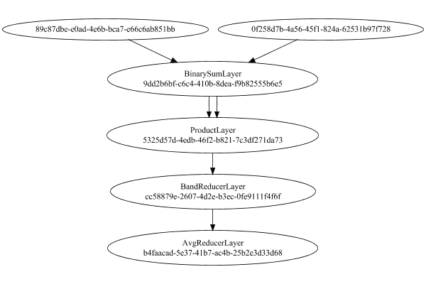

# MeanSqLossLayer
## MeanSqLossLayerTest
### Network Diagram
This is a network with the following layout:

Code from [StandardLayerTests.java:72](../../../../../../../src/main/java/com/simiacryptus/mindseye/test/unit/StandardLayerTests.java#L72) executed in 0.20 seconds: 
```java
    return Graphviz.fromGraph(TestUtil.toGraph((DAGNetwork) layer))
      .height(400).width(600).render(Format.PNG).toImage();
```

Returns: 




### Json Serialization
Code from [JsonTest.java:36](../../../../../../../src/main/java/com/simiacryptus/mindseye/test/unit/JsonTest.java#L36) executed in 0.00 seconds: 
```java
    JsonObject json = layer.getJson();
    NNLayer echo = NNLayer.fromJson(json);
    if ((echo == null)) throw new AssertionError("Failed to deserialize");
    if ((layer == echo)) throw new AssertionError("Serialization did not copy");
    if ((!layer.equals(echo))) throw new AssertionError("Serialization not equal");
    return new GsonBuilder().setPrettyPrinting().create().toJson(json);
```

Returns: 

```
    {
      "class": "com.simiacryptus.mindseye.layers.cudnn.MeanSqLossLayer",
      "id": "d72ce5d6-feb6-49ff-ac2b-a0ca94477e4e",
      "isFrozen": false,
      "name": "MeanSqLossLayer/d72ce5d6-feb6-49ff-ac2b-a0ca94477e4e",
      "inputs": [
        "89c87dbe-e0ad-4e6b-bca7-e66c6ab851bb",
        "0f258d7b-4a56-45f1-824a-62531b97f728"
      ],
      "nodes": {
        "1230b7ba-6987-456c-b898-de729348da97": "9dd2b6bf-c6c4-410b-8dea-f9b82555b6e5",
        "83d3da37-6f4f-400c-91ef-0541341908b6": "5325d57d-4edb-46f2-b821-7c3df271da73",
        "a6834e81-ad6c-4758-b69e-43235d69a60d": "cc58879e-2607-4d2e-b3ec-0fe9111f4f6f",
        "53d1fd4e-f68f-48b2-b031-e50b5e322470": "b4faacad-5e37-41b7-ac4b-25b2e3d33d68"
      },
      "layers": {
        "9dd2b6bf-c6c4-410b-8dea-f9b82555b6e5": {
          "class": "com.simiacryptus.mindseye.layers.cudnn.BinarySumLayer",
          "id": "9dd2b6bf-c6c4-410b-8dea-f9b82555b6e5",
          "isFrozen": false,
          "name": "BinarySumLayer/9dd2b6bf-c6c4-410b-8dea-f9b82555b6e5",
          "rightFactor": -1.0,
          "leftFactor": 1.0,
          "precision": "Double"
     
```
...[skipping 410 bytes](etc/150.txt)...
```
    79e-2607-4d2e-b3ec-0fe9111f4f6f",
          "isFrozen": false,
          "name": "BandReducerLayer/cc58879e-2607-4d2e-b3ec-0fe9111f4f6f",
          "mode": 2,
          "precision": "Double"
        },
        "b4faacad-5e37-41b7-ac4b-25b2e3d33d68": {
          "class": "com.simiacryptus.mindseye.layers.java.AvgReducerLayer",
          "id": "b4faacad-5e37-41b7-ac4b-25b2e3d33d68",
          "isFrozen": false,
          "name": "AvgReducerLayer/b4faacad-5e37-41b7-ac4b-25b2e3d33d68"
        }
      },
      "links": {
        "1230b7ba-6987-456c-b898-de729348da97": [
          "89c87dbe-e0ad-4e6b-bca7-e66c6ab851bb",
          "0f258d7b-4a56-45f1-824a-62531b97f728"
        ],
        "83d3da37-6f4f-400c-91ef-0541341908b6": [
          "1230b7ba-6987-456c-b898-de729348da97",
          "1230b7ba-6987-456c-b898-de729348da97"
        ],
        "a6834e81-ad6c-4758-b69e-43235d69a60d": [
          "83d3da37-6f4f-400c-91ef-0541341908b6"
        ],
        "53d1fd4e-f68f-48b2-b031-e50b5e322470": [
          "a6834e81-ad6c-4758-b69e-43235d69a60d"
        ]
      },
      "labels": {},
      "head": "53d1fd4e-f68f-48b2-b031-e50b5e322470"
    }
```


### Example Input/Output Pair
Code from [ReferenceIO.java:68](../../../../../../../src/main/java/com/simiacryptus/mindseye/test/unit/ReferenceIO.java#L68) executed in 0.01 seconds: 
```java
    SimpleEval eval = SimpleEval.run(layer, inputPrototype);
    return String.format("--------------------\nInput: \n[%s]\n--------------------\nOutput: \n%s\n--------------------\nDerivative: \n%s",
      Arrays.stream(inputPrototype).map(t -> t.prettyPrint()).reduce((a, b) -> a + ",\n" + b).get(),
      eval.getOutput().prettyPrint(),
      Arrays.stream(eval.getDerivative()).map(t -> t.prettyPrint()).reduce((a, b) -> a + ",\n" + b).get());
```

Returns: 

```
    --------------------
    Input: 
    [[
    	[ [ -1.26 ], [ -1.984 ], [ -1.224 ] ],
    	[ [ 1.716 ], [ -1.164 ], [ -1.62 ] ],
    	[ [ -1.088 ], [ -0.4 ], [ -1.6 ] ]
    ],
    [
    	[ [ 0.672 ], [ -1.708 ], [ -0.216 ] ],
    	[ [ -1.292 ], [ -1.464 ], [ -0.904 ] ],
    	[ [ -1.016 ], [ 0.188 ], [ -1.808 ] ]
    ]]
    --------------------
    Output: 
    [ 1.6521973333333333 ]
    --------------------
    Derivative: 
    [
    	[ [ -0.4293333333333333 ], [ -0.06133333333333334 ], [ -0.22399999999999998 ] ],
    	[ [ 0.6684444444444444 ], [ 0.06666666666666668 ], [ -0.15911111111111112 ] ],
    	[ [ -0.016000000000000014 ], [ -0.13066666666666668 ], [ 0.04622222222222221 ] ]
    ],
    [
    	[ [ 0.4293333333333333 ], [ 0.06133333333333334 ], [ 0.22399999999999998 ] ],
    	[ [ -0.6684444444444444 ], [ -0.06666666666666668 ], [ 0.15911111111111112 ] ],
    	[ [ 0.016000000000000014 ], [ 0.13066666666666668 ], [ -0.04622222222222221 ] ]
    ]
```


### Batch Execution
Code from [BatchingTester.java:66](../../../../../../../src/main/java/com/simiacryptus/mindseye/test/unit/BatchingTester.java#L66) executed in 0.03 seconds: 
```java
    return test(reference, inputPrototype);
```

Returns: 

```
    ToleranceStatistics{absoluteTol=0.0000e+00 +- 0.0000e+00 [0.0000e+00 - 0.0000e+00] (190#), relativeTol=0.0000e+00 +- 0.0000e+00 [0.0000e+00 - 0.0000e+00] (190#)}
```


Code from [SingleDerivativeTester.java:77](../../../../../../../src/main/java/com/simiacryptus/mindseye/test/unit/SingleDerivativeTester.java#L77) executed in 0.03 seconds: 
```java
    return test(component, inputPrototype);
```
Logging: 
```
    Inputs: [
    	[ [ -0.596 ], [ 0.884 ], [ 0.048 ] ],
    	[ [ -0.668 ], [ 1.768 ], [ -0.204 ] ],
    	[ [ 1.976 ], [ 0.628 ], [ 1.504 ] ]
    ],
    [
    	[ [ 1.78 ], [ -0.7 ], [ 0.48 ] ],
    	[ [ 1.892 ], [ -1.06 ], [ 1.188 ] ],
    	[ [ 1.104 ], [ 0.072 ], [ -0.048 ] ]
    ]
    Inputs Statistics: {meanExponent=-0.2160196585609084, negative=3, min=1.504, max=1.504, mean=0.5933333333333333, count=9.0, positive=6, stdDev=0.9513274935583435, zeros=0},
    {meanExponent=-0.2516282750139453, negative=3, min=-0.048, max=-0.048, mean=0.5231111111111111, count=9.0, positive=6, stdDev=0.9869653201657475, zeros=0}
    Output: [ 3.1453475555555563 ]
    Outputs Statistics: {meanExponent=0.4976686412344637, negative=0, min=3.1453475555555563, max=3.1453475555555563, mean=3.1453475555555563, count=1.0, positive=1, stdDev=0.0, zeros=0}
    Feedback for input 0
    Inputs Values: [
    	[ [ -0.596 ], [ 0.884 ], [ 0.048 ] ],
    	[ [ -0.668 ], [ 1.768 ], [ -0.204 ] ],
    	[ [ 1.976 ], [ 0.628 ], [ 1.504 ] ]
    ]
    Value Statistics: {meanExponent=-0.2160196585609084, negative=3, min=1.504, 
```
...[skipping 2321 bytes](etc/151.txt)...
```
    66737208 ], [ -0.35198888889365065 ], [ -0.6284333333361758 ], [ -0.1235444444480649 ], [ 0.0960111111103501 ], [ 0.3093444444424165 ], [ -0.34487777777592044 ] ]
    Measured Statistics: {meanExponent=-0.5320001689153654, negative=5, min=-0.34487777777592044, max=-0.34487777777592044, mean=-0.015593827162874163, count=9.0, positive=4, stdDev=0.39380488965174, zeros=0}
    Feedback Error: [ [ 1.111110944995719E-5 ], [ 1.1111104211036782E-5 ], [ 1.1111110405664926E-5 ], [ 1.1111106349326327E-5 ], [ 1.1111108268679892E-5 ], [ 1.1111107490663352E-5 ], [ 1.1111110350112141E-5 ], [ 1.1111109083195014E-5 ], [ 1.1111112968420489E-5 ] ]
    Error Statistics: {meanExponent=-4.954242602478008, negative=0, min=1.1111112968420489E-5, max=1.1111112968420489E-5, mean=1.1111108730784012E-5, count=9.0, positive=9, stdDev=2.4009195933493713E-12, zeros=0}
    Finite-Difference Derivative Accuracy:
    absoluteTol: 1.1111e-05 +- 2.6855e-12 [1.1111e-05 - 1.1111e-05] (18#)
    relativeTol: 2.3387e-05 +- 1.6281e-05 [8.8401e-06 - 5.7874e-05] (18#)
    
```

Returns: 

```
    ToleranceStatistics{absoluteTol=1.1111e-05 +- 2.6855e-12 [1.1111e-05 - 1.1111e-05] (18#), relativeTol=2.3387e-05 +- 1.6281e-05 [8.8401e-06 - 5.7874e-05] (18#)}
```


### Performance
Adding performance wrappers

Code from [TestUtil.java:302](../../../../../../../src/main/java/com/simiacryptus/mindseye/test/TestUtil.java#L302) executed in 0.00 seconds: 
```java
    network.visitNodes(node -> {
      if (!(node.getLayer() instanceof MonitoringWrapperLayer)) {
        node.setLayer(new MonitoringWrapperLayer(node.getLayer()).shouldRecordSignalMetrics(false));
      }
      else {
        ((MonitoringWrapperLayer) node.getLayer()).shouldRecordSignalMetrics(false);
      }
    });
```

Now we execute larger-scale runs to benchmark performance:

Code from [PerformanceTester.java:66](../../../../../../../src/main/java/com/simiacryptus/mindseye/test/unit/PerformanceTester.java#L66) executed in 0.75 seconds: 
```java
    test(component, inputPrototype);
```
Logging: 
```
    100 batches
    Input Dimensions:
    	[100, 100, 3]
    	[100, 100, 3]
    Performance:
    	Evaluation performance: 0.090617s +- 0.019925s [0.060016s - 0.111577s]
    	Learning performance: 0.000394s +- 0.000115s [0.000265s - 0.000594s]
    
```

Per-layer Performance Metrics:

Code from [TestUtil.java:267](../../../../../../../src/main/java/com/simiacryptus/mindseye/test/TestUtil.java#L267) executed in 0.00 seconds: 
```java
    Map<NNLayer, MonitoringWrapperLayer> metrics = new HashMap<>();
    network.visitNodes(node -> {
      if ((node.getLayer() instanceof MonitoringWrapperLayer)) {
        MonitoringWrapperLayer layer = node.getLayer();
        metrics.put(layer.getInner(), layer);
      }
    });
    System.out.println("Forward Performance: \n\t" + metrics.entrySet().stream().map(e -> {
      PercentileStatistics performance = e.getValue().getForwardPerformance();
      return String.format("%s -> %.6fs +- %.6fs (%s)", e.getKey(), performance.getMean(), performance.getStdDev(), performance.getCount());
    }).reduce((a, b) -> a + "\n\t" + b));
    System.out.println("Backward Performance: \n\t" + metrics.entrySet().stream().map(e -> {
      PercentileStatistics performance = e.getValue().getBackwardPerformance();
      return String.format("%s -> %.6fs +- %.6fs (%s)", e.getKey(), performance.getMean(), performance.getStdDev(), performance.getCount());
    }).reduce((a, b) -> a + "\n\t" + b));
```
Logging: 
```
    Forward Performance: 
    	Optional[ProductLayer/b84b29fa-b304-40d5-b8ca-defd08641d57 -> 0.001377s +- 0.000542s (11.0)
    	BinarySumLayer/04b5cd96-a297-4847-aec9-17209b4b92a8 -> 0.034778s +- 0.012554s (11.0)
    	BandReducerLayer/0682c4aa-b1f9-47fa-8ef5-9911c4849681 -> 0.025288s +- 0.014940s (11.0)
    	AvgReducerLayer/ea8ec49c-32e9-4efc-84f8-84df87cabd65 -> 0.003790s +- 0.009314s (11.0)]
    Backward Performance: 
    	Optional[ProductLayer/b84b29fa-b304-40d5-b8ca-defd08641d57 -> 0.001336s +- 0.000000s (1.0)
    	BinarySumLayer/04b5cd96-a297-4847-aec9-17209b4b92a8 -> 0.001221s +- 0.000000s (1.0)
    	BandReducerLayer/0682c4aa-b1f9-47fa-8ef5-9911c4849681 -> 0.000020s +- 0.000041s (6.0)
    	AvgReducerLayer/ea8ec49c-32e9-4efc-84f8-84df87cabd65 -> 0.000005s +- 0.000009s (6.0)]
    
```

Removing performance wrappers

Code from [TestUtil.java:285](../../../../../../../src/main/java/com/simiacryptus/mindseye/test/TestUtil.java#L285) executed in 0.00 seconds: 
```java
    network.visitNodes(node -> {
      if (node.getLayer() instanceof MonitoringWrapperLayer) {
        node.setLayer(node.<MonitoringWrapperLayer>getLayer().getInner());
      }
    });
```

### Input Learning
In this test, we use a network to learn this target input, given it's pre-evaluated output:

Code from [LearningTester.java:127](../../../../../../../src/main/java/com/simiacryptus/mindseye/test/unit/LearningTester.java#L127) executed in 0.01 seconds: 
```java
    return Arrays.stream(input_target).map(x -> x.prettyPrint()).reduce((a, b) -> a + "\n" + b).orElse("");
```

Returns: 

```
    [
    	[ [ 1.536, -0.408, -1.02 ], [ 0.488, 1.292, -0.648 ], [ -1.524, 0.012, -1.592 ], [ 0.656, 0.148, 1.94 ], [ -0.828, -0.04, 0.196 ], [ -1.652, 0.332, 1.264 ], [ 1.028, -1.86, -1.672 ], [ 0.872, -0.74, 0.364 ], ... ],
    	[ [ -0.696, 0.324, -1.04 ], [ -0.984, 1.296, 0.168 ], [ 0.084, -0.388, 0.324 ], [ -1.564, -0.676, 1.604 ], [ -1.444, 0.8, -0.14 ], [ 0.652, -1.892, -1.256 ], [ 0.996, 1.62, -0.848 ], [ -1.384, -0.532, -1.352 ], ... ],
    	[ [ -1.508, -0.876, -0.092 ], [ -0.936, -0.008, 1.024 ], [ 0.508, 1.836, 1.36 ], [ 0.748, -0.156, -1.44 ], [ 0.132, 0.208, -0.868 ], [ -0.748, -1.768, -1.664 ], [ -0.764, -0.296, -1.796 ], [ 1.092, -0.112, 0.852 ], ... ],
    	[ [ 0.688, 1.292, -0.06 ], [ 1.836, -0.12, -1.456 ], [ 1.556, -1.556, -0.94 ], [ 1.276, -1.064, -0.244 ], [ -0.928, 0.268, 1.156 ], [ 0.164, 1.984, -1.264 ], [ 0.488, 1.008, 1.684 ], [ -0.296, 0.872, 1.808 ], ... ],
    	[ [ -1.684, 0.456, 0.2 ], [ -1.96, -1.1, 0.976 ], [ 0.172, -0.352, 0.564 ], [ 1.372, 0.304, -0.856 ], [ -0.78, -0.836, -1.932 ], [ 0.952, -1.332, 
```
...[skipping 1445 bytes](etc/152.txt)...
```
    , -1.568, -1.804 ], [ -0.92, -1.98, -1.452 ], [ -1.712, 0.916, 0.836 ], [ -1.82, 0.856, -1.444 ], [ -1.64, -0.48, 0.564 ], [ 0.852, 1.312, 0.536 ], ... ],
    	[ [ -0.808, 0.692, -0.072 ], [ -0.388, 1.156, -0.44 ], [ -1.94, -0.368, -0.672 ], [ 0.74, -0.076, -0.732 ], [ -0.572, 1.348, 1.368 ], [ -0.16, -0.032, 1.312 ], [ 1.82, 0.772, 0.3 ], [ 0.032, 1.0, 1.22 ], ... ],
    	[ [ 1.064, -0.296, -0.132 ], [ 0.216, -0.912, 0.208 ], [ -0.408, 1.996, -1.624 ], [ 1.92, 1.124, 0.456 ], [ 0.988, -0.98, 0.704 ], [ 1.384, 0.952, 0.488 ], [ 0.332, -0.956, -0.304 ], [ -0.54, 1.728, -0.984 ], ... ],
    	[ [ 1.044, -0.04, 1.72 ], [ -0.784, 1.504, -1.572 ], [ 1.532, -1.26, 1.528 ], [ -1.512, 1.804, 0.524 ], [ -0.284, 0.184, 1.656 ], [ 1.272, -0.46, -0.312 ], [ -1.776, -0.916, -0.64 ], [ 1.672, -0.032, 1.308 ], ... ],
    	[ [ 0.388, -0.236, 0.752 ], [ 0.768, 0.128, 0.116 ], [ 0.404, 0.58, 0.924 ], [ 1.112, 1.192, 0.596 ], [ -1.516, 0.908, -1.46 ], [ -0.908, 1.608, -1.564 ], [ -0.116, 1.488, -1.624 ], [ -1.528, 0.384, -0.492 ], ... ],
    	...
    ]
```


First, we use a conjugate gradient descent method, which converges the fastest for purely linear functions.

Code from [LearningTester.java:300](../../../../../../../src/main/java/com/simiacryptus/mindseye/test/unit/LearningTester.java#L300) executed in 0.07 seconds: 
```java
    return new IterativeTrainer(trainable)
      .setLineSearchFactory(label -> new QuadraticSearch())
      .setOrientation(new GradientDescent())
      .setMonitor(monitor)
      .setTimeout(30, TimeUnit.SECONDS)
      .setMaxIterations(250)
      .setTerminateThreshold(0)
      .run();
```
Logging: 
```
    Zero gradient: 0.0
    Constructing line search parameters: GD
    F(0.0) = LineSearchPoint{point=PointSample{avg=7.154067159091394}, derivative=0.0}
    Iteration 1 failed, aborting. Error: 7.154067159091394 Total: 249621972700229.1000; Orientation: 0.0009; Line Search: 0.0199
    
```

Returns: 

```
    7.154067159091394
```


This training run resulted in the following regressed input:

Code from [LearningTester.java:144](../../../../../../../src/main/java/com/simiacryptus/mindseye/test/unit/LearningTester.java#L144) executed in 0.02 seconds: 
```java
    return Arrays.stream(input_gd).map(x -> x.prettyPrint()).reduce((a, b) -> a + "\n" + b).orElse("");
```

Returns: 

```
    [
    	[ [ -1.148, -0.88, 0.348 ], [ 1.184, -1.012, 0.788 ], [ 1.804, 0.328, -1.056 ], [ -1.028, -1.34, 0.744 ], [ -1.288, 0.824, 0.416 ], [ 0.448, -0.3, -0.904 ], [ 0.208, 1.276, -0.552 ], [ 1.324, 1.088, 0.116 ], ... ],
    	[ [ 1.096, -1.644, -0.92 ], [ 0.948, 1.952, 0.984 ], [ -1.392, -1.244, 1.84 ], [ -1.82, -1.788, 0.06 ], [ 1.596, -1.884, -0.624 ], [ 0.552, -1.864, 1.804 ], [ 1.304, 1.016, -0.936 ], [ -1.976, 1.9, -1.876 ], ... ],
    	[ [ -0.48, 0.588, 0.388 ], [ -1.108, 0.844, -0.044 ], [ 0.132, 1.488, 1.752 ], [ -0.22, 1.788, 0.904 ], [ 1.672, 0.432, 1.352 ], [ -1.224, -0.108, 1.496 ], [ 1.056, 1.016, -0.072 ], [ -0.476, 0.564, -0.524 ], ... ],
    	[ [ 0.172, -1.332, 1.168 ], [ 1.368, -1.736, -1.256 ], [ 1.952, 0.992, 0.66 ], [ -1.032, -0.444, -0.264 ], [ 1.94, -0.12, 0.412 ], [ -1.576, -1.16, 0.624 ], [ 0.052, -0.544, -1.452 ], [ 0.996, 0.5, 1.988 ], ... ],
    	[ [ 1.032, 1.196, -1.092 ], [ -0.268, -0.1, 1.112 ], [ -1.38, -1.46, 1.232 ], [ -0.984, -1.6, -0.532 ], [ 0.176, -1.368, 0.696 ], [ -0.98, -1.052, 1.328 ], [
```
...[skipping 1427 bytes](etc/153.txt)...
```
    56, 1.76 ], [ -0.552, -1.3, -0.332 ], [ 1.36, 1.592, -0.556 ], [ -1.52, 1.672, -0.904 ], [ 0.228, -0.948, 1.508 ], [ 0.588, 0.224, -1.1 ], ... ],
    	[ [ 0.704, -1.34, -0.576 ], [ 1.204, -0.296, -0.088 ], [ 1.688, 1.688, 1.36 ], [ -1.312, -1.328, 1.476 ], [ 0.656, -0.524, -1.816 ], [ -1.52, -1.564, -0.456 ], [ 1.448, 1.956, -0.984 ], [ 0.028, -1.712, -1.524 ], ... ],
    	[ [ -0.052, 1.376, 0.708 ], [ 1.088, -1.52, -1.948 ], [ 1.148, 1.736, -1.296 ], [ 1.0, 1.052, -1.756 ], [ -1.124, 1.7, 0.164 ], [ -1.444, 1.604, -0.8 ], [ -0.908, -1.22, -1.964 ], [ -0.228, 0.424, -1.424 ], ... ],
    	[ [ -0.336, -1.544, -0.828 ], [ 0.452, -0.396, 1.196 ], [ -1.564, -0.744, 0.52 ], [ -1.3, -1.084, 1.044 ], [ 1.592, 0.08, 1.396 ], [ 0.384, -0.628, -1.492 ], [ 1.04, -0.828, 1.772 ], [ -0.792, -1.464, 1.476 ], ... ],
    	[ [ -1.764, -0.272, -0.82 ], [ 0.024, 0.096, 0.212 ], [ 1.224, 1.548, -0.276 ], [ -1.392, -1.724, 0.4 ], [ 1.336, -1.084, 1.844 ], [ -1.224, -1.368, -0.856 ], [ -0.456, 1.936, 1.568 ], [ -1.58, 0.132, 1.424 ], ... ],
    	...
    ]
```


Next, we run the same optimization using L-BFGS, which is nearly ideal for purely second-order or quadratic functions.

Code from [LearningTester.java:324](../../../../../../../src/main/java/com/simiacryptus/mindseye/test/unit/LearningTester.java#L324) executed in 0.05 seconds: 
```java
    return new IterativeTrainer(trainable)
      .setLineSearchFactory(label -> new ArmijoWolfeSearch())
      .setOrientation(new LBFGS())
      .setMonitor(monitor)
      .setTimeout(30, TimeUnit.SECONDS)
      .setMaxIterations(250)
      .setTerminateThreshold(0)
      .run();
```
Logging: 
```
    LBFGS Accumulation History: 1 points
    Constructing line search parameters: GD
    th(0)=7.154067159091394;dx=0.0 (ERROR: Starting derivative negative)
    Iteration 1 failed, aborting. Error: 7.154067159091394 Total: 249622039607170.0000; Orientation: 0.0018; Line Search: 0.0182
    
```

Returns: 

```
    7.154067159091394
```


This training run resulted in the following regressed input:

Code from [LearningTester.java:154](../../../../../../../src/main/java/com/simiacryptus/mindseye/test/unit/LearningTester.java#L154) executed in 0.01 seconds: 
```java
    return Arrays.stream(input_lbgfs).map(x -> x.prettyPrint()).reduce((a, b) -> a + "\n" + b).orElse("");
```

Returns: 

```
    [
    	[ [ -1.148, -0.88, 0.348 ], [ 1.184, -1.012, 0.788 ], [ 1.804, 0.328, -1.056 ], [ -1.028, -1.34, 0.744 ], [ -1.288, 0.824, 0.416 ], [ 0.448, -0.3, -0.904 ], [ 0.208, 1.276, -0.552 ], [ 1.324, 1.088, 0.116 ], ... ],
    	[ [ 1.096, -1.644, -0.92 ], [ 0.948, 1.952, 0.984 ], [ -1.392, -1.244, 1.84 ], [ -1.82, -1.788, 0.06 ], [ 1.596, -1.884, -0.624 ], [ 0.552, -1.864, 1.804 ], [ 1.304, 1.016, -0.936 ], [ -1.976, 1.9, -1.876 ], ... ],
    	[ [ -0.48, 0.588, 0.388 ], [ -1.108, 0.844, -0.044 ], [ 0.132, 1.488, 1.752 ], [ -0.22, 1.788, 0.904 ], [ 1.672, 0.432, 1.352 ], [ -1.224, -0.108, 1.496 ], [ 1.056, 1.016, -0.072 ], [ -0.476, 0.564, -0.524 ], ... ],
    	[ [ 0.172, -1.332, 1.168 ], [ 1.368, -1.736, -1.256 ], [ 1.952, 0.992, 0.66 ], [ -1.032, -0.444, -0.264 ], [ 1.94, -0.12, 0.412 ], [ -1.576, -1.16, 0.624 ], [ 0.052, -0.544, -1.452 ], [ 0.996, 0.5, 1.988 ], ... ],
    	[ [ 1.032, 1.196, -1.092 ], [ -0.268, -0.1, 1.112 ], [ -1.38, -1.46, 1.232 ], [ -0.984, -1.6, -0.532 ], [ 0.176, -1.368, 0.696 ], [ -0.98, -1.052, 1.328 ], [
```
...[skipping 1427 bytes](etc/154.txt)...
```
    56, 1.76 ], [ -0.552, -1.3, -0.332 ], [ 1.36, 1.592, -0.556 ], [ -1.52, 1.672, -0.904 ], [ 0.228, -0.948, 1.508 ], [ 0.588, 0.224, -1.1 ], ... ],
    	[ [ 0.704, -1.34, -0.576 ], [ 1.204, -0.296, -0.088 ], [ 1.688, 1.688, 1.36 ], [ -1.312, -1.328, 1.476 ], [ 0.656, -0.524, -1.816 ], [ -1.52, -1.564, -0.456 ], [ 1.448, 1.956, -0.984 ], [ 0.028, -1.712, -1.524 ], ... ],
    	[ [ -0.052, 1.376, 0.708 ], [ 1.088, -1.52, -1.948 ], [ 1.148, 1.736, -1.296 ], [ 1.0, 1.052, -1.756 ], [ -1.124, 1.7, 0.164 ], [ -1.444, 1.604, -0.8 ], [ -0.908, -1.22, -1.964 ], [ -0.228, 0.424, -1.424 ], ... ],
    	[ [ -0.336, -1.544, -0.828 ], [ 0.452, -0.396, 1.196 ], [ -1.564, -0.744, 0.52 ], [ -1.3, -1.084, 1.044 ], [ 1.592, 0.08, 1.396 ], [ 0.384, -0.628, -1.492 ], [ 1.04, -0.828, 1.772 ], [ -0.792, -1.464, 1.476 ], ... ],
    	[ [ -1.764, -0.272, -0.82 ], [ 0.024, 0.096, 0.212 ], [ 1.224, 1.548, -0.276 ], [ -1.392, -1.724, 0.4 ], [ 1.336, -1.084, 1.844 ], [ -1.224, -1.368, -0.856 ], [ -0.456, 1.936, 1.568 ], [ -1.58, 0.132, 1.424 ], ... ],
    	...
    ]
```


Code from [LearningTester.java:96](../../../../../../../src/main/java/com/simiacryptus/mindseye/test/unit/LearningTester.java#L96) executed in 0.00 seconds: 
```java
    return TestUtil.compare(runs);
```

Code from [LearningTester.java:99](../../../../../../../src/main/java/com/simiacryptus/mindseye/test/unit/LearningTester.java#L99) executed in 0.00 seconds: 
```java
    return TestUtil.compareTime(runs);
```

