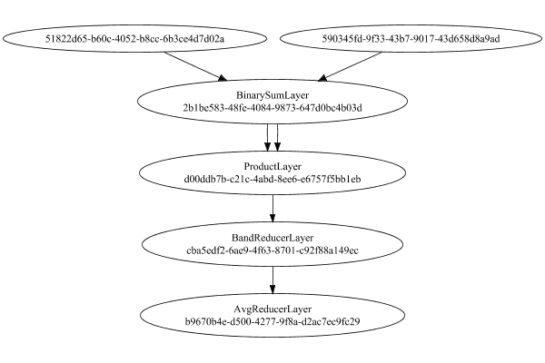

# MeanSqLossLayer
## MeanSqLossLayerTest
### Json Serialization
Code from [StandardLayerTests.java:69](../../../../../../../src/main/java/com/simiacryptus/mindseye/test/StandardLayerTests.java#L69) executed in 0.00 seconds: 
```java
    JsonObject json = layer.getJson();
    NNLayer echo = NNLayer.fromJson(json);
    if ((echo == null)) throw new AssertionError("Failed to deserialize");
    if ((layer == echo)) throw new AssertionError("Serialization did not copy");
    if ((!layer.equals(echo))) throw new AssertionError("Serialization not equal");
    return new GsonBuilder().setPrettyPrinting().create().toJson(json);
```

Returns: 

```
    {
      "class": "com.simiacryptus.mindseye.layers.cudnn.MeanSqLossLayer",
      "id": "de23b406-40f9-4baf-ba44-8e2029717b42",
      "isFrozen": false,
      "name": "MeanSqLossLayer/de23b406-40f9-4baf-ba44-8e2029717b42",
      "inputs": [
        "590345fd-9f33-43b7-9017-43d658d8a9ad",
        "51822d65-b60c-4052-b8cc-6b3ce4d7d02a"
      ],
      "nodes": {
        "b74b5732-ab5f-4522-bac8-16e4a4ed723c": "2b1be583-48fe-4084-9873-647d0bc4b03d",
        "3a969464-8f73-442e-bd71-2147b2fa2503": "d00ddb7b-c21c-4abd-8ee6-e6757f5bb1eb",
        "2ba9b617-2365-4134-84bd-a8d4b6a27782": "cba5edf2-6ae9-4f63-8701-c92f88a149ec",
        "8b22aabc-0f95-4b26-ab79-2c43f9c25f7b": "b9670b4e-d500-4277-9f8a-d2ac7ec9fc29"
      },
      "layers": {
        "2b1be583-48fe-4084-9873-647d0bc4b03d": {
          "class": "com.simiacryptus.mindseye.layers.cudnn.BinarySumLayer",
          "id": "2b1be583-48fe-4084-9873-647d0bc4b03d",
          "isFrozen": false,
          "name": "BinarySumLayer/2b1be583-48fe-4084-9873-647d0bc4b03d",
          "rightFactor": -1.0,
          "leftFactor": 1.0
        },
        "d00ddb7b-c21c-4abd
```
...[skipping 352 bytes](etc/37.txt)...
```
    cerLayer",
          "id": "cba5edf2-6ae9-4f63-8701-c92f88a149ec",
          "isFrozen": false,
          "name": "BandReducerLayer/cba5edf2-6ae9-4f63-8701-c92f88a149ec",
          "mode": 2
        },
        "b9670b4e-d500-4277-9f8a-d2ac7ec9fc29": {
          "class": "com.simiacryptus.mindseye.layers.java.AvgReducerLayer",
          "id": "b9670b4e-d500-4277-9f8a-d2ac7ec9fc29",
          "isFrozen": false,
          "name": "AvgReducerLayer/b9670b4e-d500-4277-9f8a-d2ac7ec9fc29"
        }
      },
      "links": {
        "b74b5732-ab5f-4522-bac8-16e4a4ed723c": [
          "590345fd-9f33-43b7-9017-43d658d8a9ad",
          "51822d65-b60c-4052-b8cc-6b3ce4d7d02a"
        ],
        "3a969464-8f73-442e-bd71-2147b2fa2503": [
          "b74b5732-ab5f-4522-bac8-16e4a4ed723c",
          "b74b5732-ab5f-4522-bac8-16e4a4ed723c"
        ],
        "2ba9b617-2365-4134-84bd-a8d4b6a27782": [
          "3a969464-8f73-442e-bd71-2147b2fa2503"
        ],
        "8b22aabc-0f95-4b26-ab79-2c43f9c25f7b": [
          "2ba9b617-2365-4134-84bd-a8d4b6a27782"
        ]
      },
      "labels": {},
      "head": "8b22aabc-0f95-4b26-ab79-2c43f9c25f7b"
    }
```


### Network Diagram
Code from [StandardLayerTests.java:80](../../../../../../../src/main/java/com/simiacryptus/mindseye/test/StandardLayerTests.java#L80) executed in 0.19 seconds: 
```java
    return Graphviz.fromGraph(TestUtil.toGraph((DAGNetwork) layer))
      .height(400).width(600).render(Format.PNG).toImage();
```

Returns: 




### Example Input/Output Pair
Code from [StandardLayerTests.java:153](../../../../../../../src/main/java/com/simiacryptus/mindseye/test/StandardLayerTests.java#L153) executed in 0.01 seconds: 
```java
    SimpleEval eval = SimpleEval.run(layer, inputPrototype);
    return String.format("--------------------\nInput: \n[%s]\n--------------------\nOutput: \n%s\n--------------------\nDerivative: \n%s",
      Arrays.stream(inputPrototype).map(t -> t.prettyPrint()).reduce((a, b) -> a + ",\n" + b).get(),
      eval.getOutput().prettyPrint(),
      Arrays.stream(eval.getDerivative()).map(t -> t.prettyPrint()).reduce((a, b) -> a + ",\n" + b).get());
```

Returns: 

```
    --------------------
    Input: 
    [[
    	[ [ -0.156 ], [ 1.3 ], [ -0.448 ] ],
    	[ [ -1.068 ], [ 1.452 ], [ -1.872 ] ],
    	[ [ -1.352 ], [ 0.368 ], [ -1.484 ] ]
    ],
    [
    	[ [ 1.4 ], [ 1.628 ], [ -1.908 ] ],
    	[ [ -0.004 ], [ 1.984 ], [ -1.284 ] ],
    	[ [ -1.752 ], [ -0.832 ], [ -1.508 ] ]
    ]]
    --------------------
    Output: 
    [ 0.8913066666666665 ]
    --------------------
    Derivative: 
    [
    	[ [ -0.34577777777777774 ], [ -0.07288888888888885 ], [ 0.3244444444444444 ] ],
    	[ [ -0.23644444444444446 ], [ -0.11822222222222223 ], [ -0.13066666666666668 ] ],
    	[ [ 0.08888888888888886 ], [ 0.26666666666666666 ], [ 0.0053333333333333375 ] ]
    ],
    [
    	[ [ 0.34577777777777774 ], [ 0.07288888888888885 ], [ -0.3244444444444444 ] ],
    	[ [ 0.23644444444444446 ], [ 0.11822222222222223 ], [ 0.13066666666666668 ] ],
    	[ [ -0.08888888888888886 ], [ -0.26666666666666666 ], [ -0.0053333333333333375 ] ]
    ]
```


### Batch Execution
Code from [StandardLayerTests.java:102](../../../../../../../src/main/java/com/simiacryptus/mindseye/test/StandardLayerTests.java#L102) executed in 0.03 seconds: 
```java
    return getBatchingTester().test(layer, inputPrototype);
```

Returns: 

```
    ToleranceStatistics{absoluteTol=0.0000e+00 +- 0.0000e+00 [0.0000e+00 - 0.0000e+00] (190#), relativeTol=0.0000e+00 +- 0.0000e+00 [0.0000e+00 - 0.0000e+00] (188#)}
```


### Differential Validation
Code from [StandardLayerTests.java:110](../../../../../../../src/main/java/com/simiacryptus/mindseye/test/StandardLayerTests.java#L110) executed in 0.03 seconds: 
```java
    return getDerivativeTester().test(layer, inputPrototype);
```
Logging: 
```
    Inputs: [
    	[ [ -0.048 ], [ -0.684 ], [ 0.684 ] ],
    	[ [ 1.48 ], [ -0.72 ], [ -1.456 ] ],
    	[ [ -0.52 ], [ -0.728 ], [ -0.748 ] ]
    ],
    [
    	[ [ 1.468 ], [ -0.556 ], [ 0.796 ] ],
    	[ [ 1.476 ], [ 0.204 ], [ 0.456 ] ],
    	[ [ 0.88 ], [ -1.0 ], [ 1.056 ] ]
    ]
    Inputs Statistics: {meanExponent=-0.222872739063182, negative=7, min=-0.748, max=-0.748, mean=-0.30444444444444446, count=9.0, positive=2, stdDev=0.8361593563046475, zeros=0},
    {meanExponent=-0.12016201413054477, negative=2, min=1.056, max=1.056, mean=0.5311111111111111, count=9.0, positive=7, stdDev=0.8080655150068032, zeros=0}
    Output: [ 1.3472355555555555 ]
    Outputs Statistics: {meanExponent=0.12944353598589925, negative=0, min=1.3472355555555555, max=1.3472355555555555, mean=1.3472355555555555, count=1.0, positive=1, stdDev=0.0, zeros=0}
    Feedback for input 0
    Inputs Values: [
    	[ [ -0.048 ], [ -0.684 ], [ 0.684 ] ],
    	[ [ 1.48 ], [ -0.72 ], [ -1.456 ] ],
    	[ [ -0.52 ], [ -0.728 ], [ -0.748 ] ]
    ]
    Value Statistics: {meanExponent=-0.222872739063182, negative=7, min=-0
```
...[skipping 2377 bytes](etc/38.txt)...
```
    222222295927 ], [ 0.02845555555408552 ], [ 0.2053444444438668 ], [ -0.06043333333316525 ], [ 0.024899999999661304 ], [ 0.42490000000006134 ], [ 0.4008999999993712 ] ]
    Measured Statistics: {meanExponent=-1.0956371849935704, negative=2, min=0.4008999999993712, max=0.4008999999993712, mean=0.18569012345660674, count=9.0, positive=7, stdDev=0.17903478786530808, zeros=0}
    Feedback Error: [ [ 1.1111110862438434E-5 ], [ 1.1111111758172441E-5 ], [ 1.1111111848205457E-5 ], [ 1.1111109641078615E-5 ], [ 1.1111110533479351E-5 ], [ 1.111111127919534E-5 ], [ 1.1111110772420163E-5 ], [ 1.1111111172468213E-5 ], [ 1.1111110482353581E-5 ] ]
    Error Statistics: {meanExponent=-4.954242516606002, negative=0, min=1.1111110482353581E-5, max=1.1111110482353581E-5, mean=1.1111110927756844E-5, count=9.0, positive=9, stdDev=6.431098710768743E-13, zeros=0}
    Finite-Difference Derivative Accuracy:
    absoluteTol: 1.1111e-05 +- 7.7106e-13 [1.1111e-05 - 1.1111e-05] (18#)
    relativeTol: 7.6100e-04 +- 1.9423e-03 [1.3075e-05 - 6.2893e-03] (18#)
    
```

Returns: 

```
    ToleranceStatistics{absoluteTol=1.1111e-05 +- 7.7106e-13 [1.1111e-05 - 1.1111e-05] (18#), relativeTol=7.6100e-04 +- 1.9423e-03 [1.3075e-05 - 6.2893e-03] (18#)}
```


### Performance
Adding performance wrappers

Code from [TestUtil.java:260](../../../../../../../src/main/java/com/simiacryptus/mindseye/test/TestUtil.java#L260) executed in 0.00 seconds: 
```java
    network.visitNodes(node -> {
      if (!(node.getLayer() instanceof MonitoringWrapperLayer)) {
        node.setLayer(new MonitoringWrapperLayer(node.getLayer()).shouldRecordSignalMetrics(false));
      }
      else {
        ((MonitoringWrapperLayer) node.getLayer()).shouldRecordSignalMetrics(false);
      }
    });
```

Code from [StandardLayerTests.java:120](../../../../../../../src/main/java/com/simiacryptus/mindseye/test/StandardLayerTests.java#L120) executed in 0.02 seconds: 
```java
    getPerformanceTester().test(layer, permPrototype);
```
Logging: 
```
    Evaluation performance: 0.001808s +- 0.000114s [0.001603s - 0.001938s]
    Learning performance: 0.000395s +- 0.000104s [0.000287s - 0.000584s]
    
```

Per-layer Performance Metrics:

Code from [TestUtil.java:225](../../../../../../../src/main/java/com/simiacryptus/mindseye/test/TestUtil.java#L225) executed in 0.00 seconds: 
```java
    Map<NNLayer, MonitoringWrapperLayer> metrics = new HashMap<>();
    network.visitNodes(node -> {
      if ((node.getLayer() instanceof MonitoringWrapperLayer)) {
        MonitoringWrapperLayer layer = node.getLayer();
        metrics.put(layer.getInner(), layer);
      }
    });
    System.out.println("Forward Performance: \n\t" + metrics.entrySet().stream().map(e -> {
      PercentileStatistics performance = e.getValue().getForwardPerformance();
      return String.format("%s -> %.6fs +- %.6fs (%s)", e.getKey(), performance.getMean(), performance.getStdDev(), performance.getCount());
    }).reduce((a, b) -> a + "\n\t" + b));
    System.out.println("Backward Performance: \n\t" + metrics.entrySet().stream().map(e -> {
      PercentileStatistics performance = e.getValue().getBackwardPerformance();
      return String.format("%s -> %.6fs +- %.6fs (%s)", e.getKey(), performance.getMean(), performance.getStdDev(), performance.getCount());
    }).reduce((a, b) -> a + "\n\t" + b));
```
Logging: 
```
    Forward Performance: 
    	Optional[ProductLayer/d00ddb7b-c21c-4abd-8ee6-e6757f5bb1eb -> 0.000111s +- 0.000023s (11.0)
    	BinarySumLayer/2b1be583-48fe-4084-9873-647d0bc4b03d -> 0.000445s +- 0.000145s (11.0)
    	AvgReducerLayer/b9670b4e-d500-4277-9f8a-d2ac7ec9fc29 -> 0.000557s +- 0.000230s (11.0)
    	BandReducerLayer/cba5edf2-6ae9-4f63-8701-c92f88a149ec -> 0.000264s +- 0.000059s (11.0)]
    Backward Performance: 
    	Optional[ProductLayer/d00ddb7b-c21c-4abd-8ee6-e6757f5bb1eb -> 0.000220s +- 0.000000s (1.0)
    	BinarySumLayer/2b1be583-48fe-4084-9873-647d0bc4b03d -> 0.000229s +- 0.000000s (1.0)
    	AvgReducerLayer/b9670b4e-d500-4277-9f8a-d2ac7ec9fc29 -> 0.000004s +- 0.000005s (6.0)
    	BandReducerLayer/cba5edf2-6ae9-4f63-8701-c92f88a149ec -> 0.000023s +- 0.000049s (6.0)]
    
```

Removing performance wrappers

Code from [TestUtil.java:243](../../../../../../../src/main/java/com/simiacryptus/mindseye/test/TestUtil.java#L243) executed in 0.00 seconds: 
```java
    network.visitNodes(node -> {
      if (node.getLayer() instanceof MonitoringWrapperLayer) {
        node.setLayer(node.<MonitoringWrapperLayer>getLayer().getInner());
      }
    });
```

