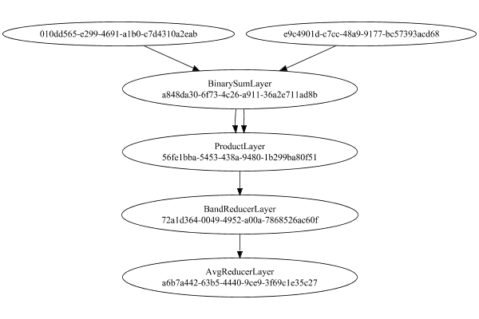

# MeanSqLossLayer
## MeanSqLossLayerTest
### Json Serialization
Code from [StandardLayerTests.java:68](../../../../../../../src/main/java/com/simiacryptus/mindseye/test/StandardLayerTests.java#L68) executed in 0.00 seconds: 
```java
    JsonObject json = layer.getJson();
    NNLayer echo = NNLayer.fromJson(json);
    if ((echo == null)) throw new AssertionError("Failed to deserialize");
    if ((layer == echo)) throw new AssertionError("Serialization did not copy");
    if ((!layer.equals(echo))) throw new AssertionError("Serialization not equal");
    return new GsonBuilder().setPrettyPrinting().create().toJson(json);
```

Returns: 

```
    {
      "class": "com.simiacryptus.mindseye.layers.cudnn.MeanSqLossLayer",
      "id": "cb1cca3a-3303-43ba-bdf1-1c14629070c3",
      "isFrozen": false,
      "name": "MeanSqLossLayer/cb1cca3a-3303-43ba-bdf1-1c14629070c3",
      "inputs": [
        "010dd565-e299-4691-a1b0-c7d4310a2eab",
        "e9c4901d-c7cc-48a9-9177-bc57393acd68"
      ],
      "nodes": {
        "0b456236-0cae-48fe-93d8-e28231ba5d18": "a848da30-6f73-4c26-a911-36a2e711ad8b",
        "7dd89ccd-c3fa-444a-b220-5cf3f59f3595": "56fe1bba-5453-438a-9480-1b299ba80f51",
        "559c1ef1-891d-4b68-8615-a5709795eab4": "72a1d364-0049-4952-a00a-7868526ac60f",
        "24a78220-42d9-4fab-8186-f966142ebc15": "a6b7a442-63b5-4440-9ce9-3f69c1e35c27"
      },
      "layers": {
        "a848da30-6f73-4c26-a911-36a2e711ad8b": {
          "class": "com.simiacryptus.mindseye.layers.cudnn.BinarySumLayer",
          "id": "a848da30-6f73-4c26-a911-36a2e711ad8b",
          "isFrozen": false,
          "name": "BinarySumLayer/a848da30-6f73-4c26-a911-36a2e711ad8b",
          "rightFactor": -1.0,
          "leftFactor": 1.0
        },
        "56fe1bba-5453-438a
```
...[skipping 352 bytes](etc/74.txt)...
```
    cerLayer",
          "id": "72a1d364-0049-4952-a00a-7868526ac60f",
          "isFrozen": false,
          "name": "BandReducerLayer/72a1d364-0049-4952-a00a-7868526ac60f",
          "mode": 2
        },
        "a6b7a442-63b5-4440-9ce9-3f69c1e35c27": {
          "class": "com.simiacryptus.mindseye.layers.java.AvgReducerLayer",
          "id": "a6b7a442-63b5-4440-9ce9-3f69c1e35c27",
          "isFrozen": false,
          "name": "AvgReducerLayer/a6b7a442-63b5-4440-9ce9-3f69c1e35c27"
        }
      },
      "links": {
        "0b456236-0cae-48fe-93d8-e28231ba5d18": [
          "010dd565-e299-4691-a1b0-c7d4310a2eab",
          "e9c4901d-c7cc-48a9-9177-bc57393acd68"
        ],
        "7dd89ccd-c3fa-444a-b220-5cf3f59f3595": [
          "0b456236-0cae-48fe-93d8-e28231ba5d18",
          "0b456236-0cae-48fe-93d8-e28231ba5d18"
        ],
        "559c1ef1-891d-4b68-8615-a5709795eab4": [
          "7dd89ccd-c3fa-444a-b220-5cf3f59f3595"
        ],
        "24a78220-42d9-4fab-8186-f966142ebc15": [
          "559c1ef1-891d-4b68-8615-a5709795eab4"
        ]
      },
      "labels": {},
      "head": "24a78220-42d9-4fab-8186-f966142ebc15"
    }
```


### Network Diagram
Code from [StandardLayerTests.java:79](../../../../../../../src/main/java/com/simiacryptus/mindseye/test/StandardLayerTests.java#L79) executed in 0.11 seconds: 
```java
    return Graphviz.fromGraph(TestUtil.toGraph((DAGNetwork) layer))
      .height(400).width(600).render(Format.PNG).toImage();
```

Returns: 




### Example Input/Output Pair
Code from [StandardLayerTests.java:152](../../../../../../../src/main/java/com/simiacryptus/mindseye/test/StandardLayerTests.java#L152) executed in 0.01 seconds: 
```java
    SimpleEval eval = SimpleEval.run(layer, inputPrototype);
    return String.format("--------------------\nInput: \n[%s]\n--------------------\nOutput: \n%s\n--------------------\nDerivative: \n%s",
      Arrays.stream(inputPrototype).map(t -> t.prettyPrint()).reduce((a, b) -> a + ",\n" + b).get(),
      eval.getOutput().prettyPrint(),
      Arrays.stream(eval.getDerivative()).map(t -> t.prettyPrint()).reduce((a, b) -> a + ",\n" + b).get());
```

Returns: 

```
    --------------------
    Input: 
    [[
    	[ [ -0.28 ], [ 1.176 ], [ -1.556 ] ],
    	[ [ -1.808 ], [ 1.604 ], [ 1.684 ] ],
    	[ [ 1.616 ], [ -1.284 ], [ 1.404 ] ]
    ],
    [
    	[ [ 0.632 ], [ -1.824 ], [ 1.232 ] ],
    	[ [ 0.672 ], [ 1.18 ], [ -1.792 ] ],
    	[ [ -1.844 ], [ 0.956 ], [ -1.548 ] ]
    ]]
    --------------------
    Output: 
    [ 6.857882666666668 ]
    --------------------
    Derivative: 
    [
    	[ [ -0.20266666666666666 ], [ 0.6666666666666666 ], [ -0.6195555555555555 ] ],
    	[ [ -0.5511111111111111 ], [ 0.09422222222222225 ], [ 0.7724444444444444 ] ],
    	[ [ 0.7688888888888888 ], [ -0.4977777777777778 ], [ 0.6559999999999999 ] ]
    ],
    [
    	[ [ 0.20266666666666666 ], [ -0.6666666666666666 ], [ 0.6195555555555555 ] ],
    	[ [ 0.5511111111111111 ], [ -0.09422222222222225 ], [ -0.7724444444444444 ] ],
    	[ [ -0.7688888888888888 ], [ 0.4977777777777778 ], [ -0.6559999999999999 ] ]
    ]
```


### Batch Execution
Code from [StandardLayerTests.java:101](../../../../../../../src/main/java/com/simiacryptus/mindseye/test/StandardLayerTests.java#L101) executed in 0.03 seconds: 
```java
    return getBatchingTester().test(layer, inputPrototype);
```

Returns: 

```
    ToleranceStatistics{absoluteTol=0.0000e+00 +- 0.0000e+00 [0.0000e+00 - 0.0000e+00] (190#), relativeTol=0.0000e+00 +- 0.0000e+00 [0.0000e+00 - 0.0000e+00] (190#)}
```


### Differential Validation
Code from [StandardLayerTests.java:109](../../../../../../../src/main/java/com/simiacryptus/mindseye/test/StandardLayerTests.java#L109) executed in 0.03 seconds: 
```java
    return getDerivativeTester().test(layer, inputPrototype);
```
Logging: 
```
    Inputs: [
    	[ [ -1.048 ], [ -1.344 ], [ -1.636 ] ],
    	[ [ 0.232 ], [ -0.52 ], [ 1.376 ] ],
    	[ [ -0.708 ], [ 0.92 ], [ -1.696 ] ]
    ],
    [
    	[ [ 1.632 ], [ 1.904 ], [ -0.88 ] ],
    	[ [ -0.248 ], [ -0.008 ], [ 1.632 ] ],
    	[ [ -0.22 ], [ 1.932 ], [ -0.152 ] ]
    ]
    Inputs Statistics: {meanExponent=-0.04156660599088565, negative=6, min=-1.696, max=-1.696, mean=-0.4915555555555556, count=9.0, positive=3, stdDev=1.046060027076321, zeros=0},
    {meanExponent=-0.36028833514456415, negative=5, min=-0.152, max=-0.152, mean=0.6213333333333332, count=9.0, positive=4, stdDev=1.0602758550909706, zeros=0}
    Output: [ 2.500860444444444 ]
    Outputs Statistics: {meanExponent=0.3980894574647185, negative=0, min=2.500860444444444, max=2.500860444444444, mean=2.500860444444444, count=1.0, positive=1, stdDev=0.0, zeros=0}
    Feedback for input 0
    Inputs Values: [
    	[ [ -1.048 ], [ -1.344 ], [ -1.636 ] ],
    	[ [ 0.232 ], [ -0.52 ], [ 1.376 ] ],
    	[ [ -0.708 ], [ 0.92 ], [ -1.696 ] ]
    ]
    Value Statistics: {meanExponent=-0.04156660599088565, negative=6, min
```
...[skipping 2350 bytes](etc/75.txt)...
```
    [ 0.10845555555860642 ], [ 0.7217888888888524 ], [ 0.11378888888913252 ], [ 0.22490000000097154 ], [ 0.1680111111124205 ], [ 0.056900000000581485 ], [ 0.343122222221659 ] ]
    Measured Statistics: {meanExponent=-0.708826190109377, negative=1, min=0.343122222221659, max=0.343122222221659, mean=0.24731975308710397, count=9.0, positive=8, stdDev=0.24967522266224693, zeros=0}
    Feedback Error: [ [ 1.1111112379391663E-5 ], [ 1.111111044346802E-5 ], [ 1.111111416197963E-5 ], [ 1.1111111074657565E-5 ], [ 1.1111111354752956E-5 ], [ 1.1111112082656804E-5 ], [ 1.1111112420553182E-5 ], [ 1.1111111692600761E-5 ], [ 1.111111054791225E-5 ] ]
    Error Statistics: {meanExponent=-4.954242482695592, negative=0, min=1.111111054791225E-5, max=1.111111054791225E-5, mean=1.1111111795330315E-5, count=9.0, positive=9, stdDev=1.0904458402621274E-12, zeros=0}
    Finite-Difference Derivative Accuracy:
    absoluteTol: 1.1111e-05 +- 1.9757e-12 [1.1111e-05 - 1.1111e-05] (18#)
    relativeTol: 3.7865e-05 +- 2.6805e-05 [7.6970e-06 - 9.7666e-05] (18#)
    
```

Returns: 

```
    ToleranceStatistics{absoluteTol=1.1111e-05 +- 1.9757e-12 [1.1111e-05 - 1.1111e-05] (18#), relativeTol=3.7865e-05 +- 2.6805e-05 [7.6970e-06 - 9.7666e-05] (18#)}
```


### Performance
Adding performance wrappers

Code from [TestUtil.java:269](../../../../../../../src/main/java/com/simiacryptus/mindseye/test/TestUtil.java#L269) executed in 0.00 seconds: 
```java
    network.visitNodes(node -> {
      if (!(node.getLayer() instanceof MonitoringWrapperLayer)) {
        node.setLayer(new MonitoringWrapperLayer(node.getLayer()).shouldRecordSignalMetrics(false));
      }
      else {
        ((MonitoringWrapperLayer) node.getLayer()).shouldRecordSignalMetrics(false);
      }
    });
```

Code from [StandardLayerTests.java:119](../../../../../../../src/main/java/com/simiacryptus/mindseye/test/StandardLayerTests.java#L119) executed in 0.00 seconds: 
```java
    getPerformanceTester().test(layer, permPrototype);
```
Logging: 
```
    100 batches
    Input Dimensions:
    
```

Returns: 

```
    java.lang.RuntimeException: java.lang.RuntimeException: java.util.concurrent.ExecutionException: java.lang.AssertionError: 1 != 2
    	at com.simiacryptus.util.lang.TimedResult.time(TimedResult.java:61)
    	at com.simiacryptus.util.io.MarkdownNotebookOutput.lambda$code$2(MarkdownNotebookOutput.java:138)
    	at com.simiacryptus.util.test.SysOutInterceptor.withOutput(SysOutInterceptor.java:72)
    	at com.simiacryptus.util.io.MarkdownNotebookOutput.code(MarkdownNotebookOutput.java:136)
    	at com.simiacryptus.util.io.NotebookOutput.code(NotebookOutput.java:156)
    	at com.simiacryptus.mindseye.test.StandardLayerTests.test(StandardLayerTests.java:119)
    	at com.simiacryptus.mindseye.layers.LayerTestBase.test(LayerTestBase.java:40)
    	at sun.reflect.GeneratedMethodAccessor16.invoke(Unknown Source)
    	at sun.reflect.DelegatingMethodAccessorImpl.invoke(DelegatingMethodAccessorImpl.java:43)
    	at java.lang.reflect.Method.invoke(Method.java:498)
    	at org.junit.runners.model.FrameworkMethod$1.runReflectiveCall(FrameworkMethod.java:50)
```
...[skipping 2784 bytes](etc/76.txt)...
```
    esult.time(TimedResult.java:59)
    	... 35 more
    Caused by: java.util.concurrent.ExecutionException: java.lang.AssertionError: 1 != 2
    	at java.util.concurrent.FutureTask.report(FutureTask.java:122)
    	at java.util.concurrent.FutureTask.get(FutureTask.java:192)
    	at com.simiacryptus.mindseye.layers.cudnn.GpuController.lambda$call$1(GpuController.java:94)
    	... 44 more
    Caused by: java.lang.AssertionError: 1 != 2
    	at com.simiacryptus.mindseye.network.DAGNetwork.buildExeCtx(DAGNetwork.java:349)
    	at com.simiacryptus.mindseye.network.DAGNetwork.eval(DAGNetwork.java:458)
    	at com.simiacryptus.mindseye.test.SimpleEval.lambda$call$4(SimpleEval.java:95)
    	at com.simiacryptus.mindseye.layers.cudnn.GpuController.lambda$null$0(GpuController.java:94)
    	at java.util.concurrent.FutureTask.run(FutureTask.java:266)
    	at java.util.concurrent.ThreadPoolExecutor.runWorker(ThreadPoolExecutor.java:1149)
    	at java.util.concurrent.ThreadPoolExecutor$Worker.run(ThreadPoolExecutor.java:624)
    	at java.lang.Thread.run(Thread.java:748)
    
```


