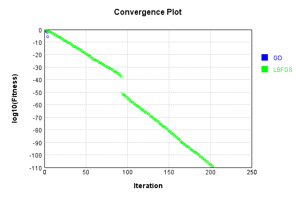
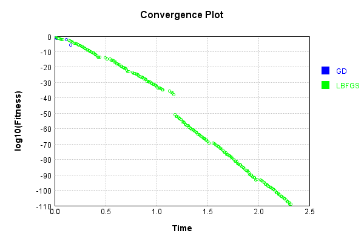

# PoolingLayer
## Double
### Json Serialization
Code from [JsonTest.java:36](../../../../../../../../src/main/java/com/simiacryptus/mindseye/test/unit/JsonTest.java#L36) executed in 0.00 seconds: 
```java
    JsonObject json = layer.getJson();
    NNLayer echo = NNLayer.fromJson(json);
    if ((echo == null)) throw new AssertionError("Failed to deserialize");
    if ((layer == echo)) throw new AssertionError("Serialization did not copy");
    if ((!layer.equals(echo))) throw new AssertionError("Serialization not equal");
    return new GsonBuilder().setPrettyPrinting().create().toJson(json);
```

Returns: 

```
    {
      "class": "com.simiacryptus.mindseye.layers.cudnn.PoolingLayer",
      "id": "296fe640-fdf0-436d-9369-e093f3198a4e",
      "isFrozen": false,
      "name": "PoolingLayer/296fe640-fdf0-436d-9369-e093f3198a4e",
      "mode": 0,
      "windowX": 2,
      "windowY": 2,
      "paddingX": 0,
      "paddingY": 0,
      "strideX": 2,
      "strideY": 2,
      "precision": "Double"
    }
```


### Example Input/Output Pair
Code from [ReferenceIO.java:68](../../../../../../../../src/main/java/com/simiacryptus/mindseye/test/unit/ReferenceIO.java#L68) executed in 0.00 seconds: 
```java
    SimpleEval eval = SimpleEval.run(layer, inputPrototype);
    return String.format("--------------------\nInput: \n[%s]\n--------------------\nOutput: \n%s\n--------------------\nDerivative: \n%s",
      Arrays.stream(inputPrototype).map(t -> t.prettyPrint()).reduce((a, b) -> a + ",\n" + b).get(),
      eval.getOutput().prettyPrint(),
      Arrays.stream(eval.getDerivative()).map(t -> t.prettyPrint()).reduce((a, b) -> a + ",\n" + b).get());
```

Returns: 

```
    --------------------
    Input: 
    [[
    	[ [ 0.144, 0.428 ], [ -0.516, -0.568 ], [ -0.908, 1.96 ], [ 1.728, -0.528 ] ],
    	[ [ 1.056, -1.756 ], [ -0.66, 1.96 ], [ 0.74, -0.808 ], [ -1.756, -1.668 ] ],
    	[ [ -0.22, 0.616 ], [ 0.28, -1.216 ], [ -0.372, -0.356 ], [ 0.876, 0.612 ] ],
    	[ [ -1.744, -0.38 ], [ -0.26, 1.428 ], [ -1.388, -1.836 ], [ -1.196, 0.564 ] ]
    ]]
    --------------------
    Output: 
    [
    	[ [ 1.056, 1.96 ], [ 1.728, 1.96 ] ],
    	[ [ 0.28, 1.428 ], [ 0.876, 0.612 ] ]
    ]
    --------------------
    Derivative: 
    [
    	[ [ 0.0, 0.0 ], [ 0.0, 0.0 ], [ 0.0, 1.0 ], [ 1.0, 0.0 ] ],
    	[ [ 1.0, 0.0 ], [ 0.0, 1.0 ], [ 0.0, 0.0 ], [ 0.0, 0.0 ] ],
    	[ [ 0.0, 0.0 ], [ 1.0, 0.0 ], [ 0.0, 0.0 ], [ 1.0, 1.0 ] ],
    	[ [ 0.0, 0.0 ], [ 0.0, 1.0 ], [ 0.0, 0.0 ], [ 0.0, 0.0 ] ]
    ]
```


[GPU Log](etc/cuda.log)

### Batch Execution
Code from [BatchingTester.java:66](../../../../../../../../src/main/java/com/simiacryptus/mindseye/test/unit/BatchingTester.java#L66) executed in 0.01 seconds: 
```java
    return test(reference, inputPrototype);
```

Returns: 

```
    ToleranceStatistics{absoluteTol=0.0000e+00 +- 0.0000e+00 [0.0000e+00 - 0.0000e+00] (400#), relativeTol=0.0000e+00 +- 0.0000e+00 [0.0000e+00 - 0.0000e+00] (160#)}
```


Code from [SingleDerivativeTester.java:77](../../../../../../../../src/main/java/com/simiacryptus/mindseye/test/unit/SingleDerivativeTester.java#L77) executed in 0.02 seconds: 
```java
    return test(component, inputPrototype);
```
Logging: 
```
    Inputs: [
    	[ [ -0.9, -1.94 ], [ 1.928, -0.18 ], [ -1.572, 1.692 ], [ 1.108, 1.568 ] ],
    	[ [ 0.008, 0.02 ], [ -0.812, -1.056 ], [ -1.228, -1.448 ], [ -1.92, 0.556 ] ],
    	[ [ -1.364, -0.732 ], [ 1.404, -0.3 ], [ 0.16, -1.556 ], [ -0.864, 1.54 ] ],
    	[ [ -1.092, 1.848 ], [ 0.592, 0.124 ], [ -0.712, 1.172 ], [ 1.832, 0.136 ] ]
    ]
    Inputs Statistics: {meanExponent=-0.17201989984656688, negative=16, min=0.136, max=0.136, mean=-0.062125000000000014, count=32.0, positive=16, stdDev=1.209935529015906, zeros=0}
    Output: [
    	[ [ 1.928, 0.02 ], [ 1.108, 1.692 ] ],
    	[ [ 1.404, 1.848 ], [ 1.832, 1.54 ] ]
    ]
    Outputs Statistics: {meanExponent=-0.034550948853452765, negative=0, min=1.54, max=1.54, mean=1.4215, count=8.0, positive=8, stdDev=0.5870432266877799, zeros=0}
    Feedback for input 0
    Inputs Values: [
    	[ [ -0.9, -1.94 ], [ 1.928, -0.18 ], [ -1.572, 1.692 ], [ 1.108, 1.568 ] ],
    	[ [ 0.008, 0.02 ], [ -0.812, -1.056 ], [ -1.228, -1.448 ], [ -1.92, 0.556 ] ],
    	[ [ -1.364, -0.732 ], [ 1.404, -0.3 ], [ 0.16, -1.556 ], [ -0.864, 1
```
...[skipping 1146 bytes](etc/155.txt)...
```
    .0, 0.0, 0.0 ], [ 0.0, 0.0, 0.0, 0.0, 0.0, 0.0, 0.0, 0.0 ], ... ]
    Measured Statistics: {meanExponent=-4.21772725683767E-14, negative=0, min=0.0, max=0.0, mean=0.031249999999996964, count=256.0, positive=8, stdDev=0.1739926363384213, zeros=248}
    Feedback Error: [ [ 0.0, 0.0, 0.0, 0.0, 0.0, 0.0, 0.0, 0.0 ], [ 0.0, 0.0, 0.0, 0.0, 0.0, 0.0, 0.0, 0.0 ], [ 0.0, 0.0, 0.0, 0.0, 0.0, 0.0, 0.0, 0.0 ], [ 0.0, 0.0, 0.0, 0.0, 0.0, 0.0, 0.0, 0.0 ], [ -1.1013412404281553E-13, 0.0, 0.0, 0.0, 0.0, 0.0, 0.0, 0.0 ], [ 0.0, 0.0, 0.0, 0.0, 0.0, 0.0, 0.0, 0.0 ], [ 0.0, -1.1013412404281553E-13, 0.0, 0.0, 0.0, 0.0, 0.0, 0.0 ], [ 0.0, 0.0, 0.0, 0.0, 0.0, 0.0, 0.0, 0.0 ], ... ]
    Error Statistics: {meanExponent=-13.116092837078225, negative=8, min=0.0, max=0.0, mean=-3.034898721221424E-15, count=256.0, positive=0, stdDev=1.796097149053284E-14, zeros=248}
    Finite-Difference Derivative Accuracy:
    absoluteTol: 3.0349e-15 +- 1.7961e-14 [0.0000e+00 - 1.1013e-13] (256#)
    relativeTol: 4.8558e-14 +- 1.7220e-14 [2.9976e-15 - 5.5067e-14] (8#)
    
```

Returns: 

```
    ToleranceStatistics{absoluteTol=3.0349e-15 +- 1.7961e-14 [0.0000e+00 - 1.1013e-13] (256#), relativeTol=4.8558e-14 +- 1.7220e-14 [2.9976e-15 - 5.5067e-14] (8#)}
```


### Performance
Now we execute larger-scale runs to benchmark performance:

Code from [PerformanceTester.java:66](../../../../../../../../src/main/java/com/simiacryptus/mindseye/test/unit/PerformanceTester.java#L66) executed in 0.21 seconds: 
```java
    test(component, inputPrototype);
```
Logging: 
```
    100 batches
    Input Dimensions:
    	[100, 100, 2]
    Performance:
    	Evaluation performance: 0.013222s +- 0.001105s [0.011329s - 0.014633s]
    	Learning performance: 0.014142s +- 0.002722s [0.011872s - 0.019313s]
    
```

### Input Learning
In this test, we use a network to learn this target input, given it's pre-evaluated output:

Code from [LearningTester.java:127](../../../../../../../../src/main/java/com/simiacryptus/mindseye/test/unit/LearningTester.java#L127) executed in 0.01 seconds: 
```java
    return Arrays.stream(input_target).map(x -> x.prettyPrint()).reduce((a, b) -> a + "\n" + b).orElse("");
```

Returns: 

```
    [
    	[ [ 1.604, 0.836 ], [ -0.824, -0.516 ], [ -0.228, -1.912 ], [ -1.808, -1.084 ], [ -0.664, -1.172 ], [ -0.276, -1.72 ], [ 1.344, -1.2 ], [ -1.848, 1.024 ], ... ],
    	[ [ -1.752, 0.892 ], [ 1.412, 1.224 ], [ -1.996, 0.264 ], [ 0.02, -0.728 ], [ -0.852, 1.76 ], [ 1.756, 1.372 ], [ -0.572, -0.28 ], [ -0.692, -1.72 ], ... ],
    	[ [ -1.18, 0.924 ], [ -1.1, 0.512 ], [ -0.376, 0.152 ], [ -0.504, -1.612 ], [ 0.032, -0.516 ], [ 1.676, 0.024 ], [ 0.756, -0.664 ], [ 0.596, -1.812 ], ... ],
    	[ [ 1.368, -0.832 ], [ -0.776, -0.168 ], [ 1.892, 1.924 ], [ -1.224, -1.08 ], [ -0.764, 0.508 ], [ 0.672, -0.936 ], [ 1.904, -0.82 ], [ -1.648, -1.296 ], ... ],
    	[ [ -1.684, -0.656 ], [ 1.876, -1.132 ], [ 0.552, 0.04 ], [ 0.364, 1.172 ], [ -0.18, -0.832 ], [ 1.296, -0.08 ], [ -1.02, -1.696 ], [ -1.044, -0.556 ], ... ],
    	[ [ -1.164, -1.364 ], [ 0.072, -1.104 ], [ 1.644, -1.68 ], [ -0.828, -0.832 ], [ 0.82, -1.136 ], [ -1.528, 0.524 ], [ 0.192, -0.648 ], [ 1.112, -0.204 ], ... ],
    	[ [ -1.044, -0.724 ], [ 0.732, 1.628 ], [ -1.164, 1.12 ], [ -1.02, 1.944 ], [ 1.456, 0.52 ], [ -0.388, -0.904 ], [ -0.428, -0.652 ], [ -0.34, 1.96 ], ... ],
    	[ [ 1.56, -1.548 ], [ 1.984, -1.844 ], [ 0.228, 0.928 ], [ -0.7, -0.2 ], [ -0.988, 0.072 ], [ -0.392, -0.376 ], [ 1.996, 1.236 ], [ -1.076, -0.268 ], ... ],
    	...
    ]
```


First, we use a conjugate gradient descent method, which converges the fastest for purely linear functions.

Code from [LearningTester.java:300](../../../../../../../../src/main/java/com/simiacryptus/mindseye/test/unit/LearningTester.java#L300) executed in 0.36 seconds: 
```java
    return new IterativeTrainer(trainable)
      .setLineSearchFactory(label -> new QuadraticSearch())
      .setOrientation(new GradientDescent())
      .setMonitor(monitor)
      .setTimeout(30, TimeUnit.SECONDS)
      .setMaxIterations(250)
      .setTerminateThreshold(0)
      .run();
```
Logging: 
```
    Constructing line search parameters: GD
    F(0.0) = LineSearchPoint{point=PointSample{avg=0.8339782751999993}, derivative=-6.671826201600001E-4}
    New Minimum: 0.8339782751999993 > 0.8339782751999361
    F(1.0E-10) = LineSearchPoint{point=PointSample{avg=0.8339782751999361}, derivative=-6.665219737599734E-4}, delta = -6.328271240363392E-14
    New Minimum: 0.8339782751999361 > 0.8339782751995372
    F(7.000000000000001E-10) = LineSearchPoint{point=PointSample{avg=0.8339782751995372}, derivative=-6.665219737598134E-4}, delta = -4.621858451514527E-13
    New Minimum: 0.8339782751995372 > 0.8339782751967363
    F(4.900000000000001E-9) = LineSearchPoint{point=PointSample{avg=0.8339782751967363}, derivative=-6.665219737586937E-4}, delta = -3.2630564916757976E-12
    New Minimum: 0.8339782751967363 > 0.8339782751771406
    F(3.430000000000001E-8) = LineSearchPoint{point=PointSample{avg=0.8339782751771406}, derivative=-6.665219737508553E-4}, delta = -2.2858714920914736E-11
    New Minimum: 0.8339782751771406 > 0.8339782750399681
    F(2.40100000
```
...[skipping 8611 bytes](etc/156.txt)...
```
    24907524485482E-6 > 2.527646016150438E-6
    F(2545.2545573840102) = LineSearchPoint{point=PointSample{avg=2.527646016150438E-6}, derivative=4.6734834285391706E-8}, delta = -0.006712269273448101
    Right bracket at 2545.2545573840102
    Converged to right
    Iteration 4 complete. Error: 2.527646016150438E-6 Total: 249622672803219.3800; Orientation: 0.0007; Line Search: 0.0376
    F(0.0) = LineSearchPoint{point=PointSample{avg=2.527646016150438E-6}, derivative=-2.0221168129203575E-9}
    New Minimum: 2.527646016150438E-6 > 8.28248921438051E-10
    F(2545.2545573840102) = LineSearchPoint{point=PointSample{avg=8.28248921438051E-10}, derivative=3.6604000538990703E-11}, delta = -2.526817767229E-6
    8.28248921438051E-10 <= 2.527646016150438E-6
    New Minimum: 8.28248921438051E-10 > 0.0
    F(2500.0) = LineSearchPoint{point=PointSample{avg=0.0}, derivative=0.0}, delta = -2.527646016150438E-6
    Right bracket at 2500.0
    Converged to right
    Iteration 5 complete. Error: 0.0 Total: 249622686646329.3000; Orientation: 0.0007; Line Search: 0.0116
    
```

Returns: 

```
    0.0
```


Training Converged

Next, we run the same optimization using L-BFGS, which is nearly ideal for purely second-order or quadratic functions.

Code from [LearningTester.java:324](../../../../../../../../src/main/java/com/simiacryptus/mindseye/test/unit/LearningTester.java#L324) executed in 2.35 seconds: 
```java
    return new IterativeTrainer(trainable)
      .setLineSearchFactory(label -> new ArmijoWolfeSearch())
      .setOrientation(new LBFGS())
      .setMonitor(monitor)
      .setTimeout(30, TimeUnit.SECONDS)
      .setMaxIterations(250)
      .setTerminateThreshold(0)
      .run();
```
Logging: 
```
    LBFGS Accumulation History: 1 points
    Constructing line search parameters: GD
    th(0)=0.8339782751999993;dx=-6.671826201600001E-4
    New Minimum: 0.8339782751999993 > 0.8325429158822509
    WOLFE (weak): th(2.154434690031884)=0.8325429158822509; dx=-6.659475825352252E-4 delta=0.001435359317748408
    New Minimum: 0.8325429158822509 > 0.8311087940528907
    WOLFE (weak): th(4.308869380063768)=0.8311087940528907; dx=-6.653731913104504E-4 delta=0.00286948114710861
    New Minimum: 0.8311087940528907 > 0.8253940946222552
    WOLFE (weak): th(12.926608140191302)=0.8253940946222552; dx=-6.600597316579132E-4 delta=0.008584180577744127
    New Minimum: 0.8253940946222552 > 0.8001904152873482
    WOLFE (weak): th(51.70643256076521)=0.8001904152873482; dx=-6.429564141775513E-4 delta=0.0337878599126511
    New Minimum: 0.8001904152873482 > 0.6752420856631082
    END: th(258.53216280382605)=0.6752420856631082; dx=-5.645699968236761E-4 delta=0.15873618953689117
    Iteration 1 complete. Error: 0.6752420856631082 Total: 249622715980295.3000; Orientation: 
```
...[skipping 100754 bytes](etc/157.txt)...
```
    .1690782246345284E-109
    WOLF (strong): th(4419.583779304533)=1.1690782246345284E-109; dx=7.4E-323 delta=1.4482071280619228E-108
    END: th(2209.7918896522665)=1.1690782246345284E-109; dx=-1.0E-323 delta=1.4482071280619228E-108
    Iteration 202 complete. Error: 1.1690782246345284E-109 Total: 249625023947890.0000; Orientation: 0.0010; Line Search: 0.0073
    LBFGS Accumulation History: 1 points
    th(0)=1.1690782246345284E-109;dx=-9.35262579707623E-113
    New Minimum: 1.1690782246345284E-109 > 8.760217564869217E-110
    END: th(4760.852304817951)=8.760217564869217E-110; dx=0.0 delta=2.930564681476067E-110
    Iteration 203 complete. Error: 8.760217564869217E-110 Total: 249625031402068.9700; Orientation: 0.0010; Line Search: 0.0049
    LBFGS Accumulation History: 1 points
    th(0)=8.760217564869217E-110;dx=-7.008174051895374E-113
    MAX ALPHA: th(0)=8.760217564869217E-110;th'(0)=-7.008174051895374E-113;
    Iteration 204 failed, aborting. Error: 8.760217564869217E-110 Total: 249625038373780.9700; Orientation: 0.0010; Line Search: 0.0047
    
```

Returns: 

```
    8.760217564869217E-110
```


Training Converged

Code from [LearningTester.java:96](../../../../../../../../src/main/java/com/simiacryptus/mindseye/test/unit/LearningTester.java#L96) executed in 0.00 seconds: 
```java
    return TestUtil.compare(runs);
```

Returns: 




Code from [LearningTester.java:99](../../../../../../../../src/main/java/com/simiacryptus/mindseye/test/unit/LearningTester.java#L99) executed in 0.00 seconds: 
```java
    return TestUtil.compareTime(runs);
```

Returns: 




