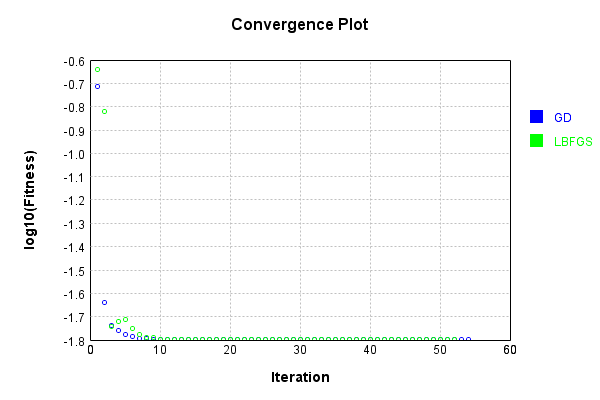
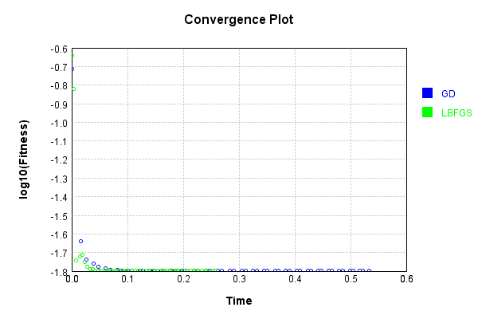

# ProductLayer
## Double
### Json Serialization
Code from [JsonTest.java:36](../../../../../../../../src/main/java/com/simiacryptus/mindseye/test/unit/JsonTest.java#L36) executed in 0.00 seconds: 
```java
    JsonObject json = layer.getJson();
    NNLayer echo = NNLayer.fromJson(json);
    if ((echo == null)) throw new AssertionError("Failed to deserialize");
    if ((layer == echo)) throw new AssertionError("Serialization did not copy");
    if ((!layer.equals(echo))) throw new AssertionError("Serialization not equal");
    return new GsonBuilder().setPrettyPrinting().create().toJson(json);
```

Returns: 

```
    {
      "class": "com.simiacryptus.mindseye.layers.cudnn.ProductLayer",
      "id": "2eb2a9df-d47d-448c-865a-637b9631c462",
      "isFrozen": false,
      "name": "ProductLayer/2eb2a9df-d47d-448c-865a-637b9631c462"
    }
```


### Example Input/Output Pair
Code from [ReferenceIO.java:68](../../../../../../../../src/main/java/com/simiacryptus/mindseye/test/unit/ReferenceIO.java#L68) executed in 0.00 seconds: 
```java
    SimpleEval eval = SimpleEval.run(layer, inputPrototype);
    return String.format("--------------------\nInput: \n[%s]\n--------------------\nOutput: \n%s\n--------------------\nDerivative: \n%s",
      Arrays.stream(inputPrototype).map(t -> t.prettyPrint()).reduce((a, b) -> a + ",\n" + b).get(),
      eval.getOutput().prettyPrint(),
      Arrays.stream(eval.getDerivative()).map(t -> t.prettyPrint()).reduce((a, b) -> a + ",\n" + b).get());
```

Returns: 

```
    --------------------
    Input: 
    [[
    	[ [ 1.048 ], [ -1.312 ] ],
    	[ [ -0.132 ], [ -0.96 ] ]
    ],
    [
    	[ [ 1.916 ], [ -1.444 ] ],
    	[ [ 0.404 ], [ 1.66 ] ]
    ]]
    --------------------
    Output: 
    [
    	[ [ 2.007968 ], [ 1.894528 ] ],
    	[ [ -0.05332800000000001 ], [ -1.5936 ] ]
    ]
    --------------------
    Derivative: 
    [
    	[ [ 1.916 ], [ -1.444 ] ],
    	[ [ 0.404 ], [ 1.66 ] ]
    ],
    [
    	[ [ 1.048 ], [ -1.312 ] ],
    	[ [ -0.132 ], [ -0.96 ] ]
    ]
```


[GPU Log](etc/cuda.log)

### Batch Execution
Code from [BatchingTester.java:66](../../../../../../../../src/main/java/com/simiacryptus/mindseye/test/unit/BatchingTester.java#L66) executed in 0.01 seconds: 
```java
    return test(reference, inputPrototype);
```

Returns: 

```
    ToleranceStatistics{absoluteTol=0.0000e+00 +- 0.0000e+00 [0.0000e+00 - 0.0000e+00] (120#), relativeTol=0.0000e+00 +- 0.0000e+00 [0.0000e+00 - 0.0000e+00] (120#)}
```


Code from [SingleDerivativeTester.java:77](../../../../../../../../src/main/java/com/simiacryptus/mindseye/test/unit/SingleDerivativeTester.java#L77) executed in 0.02 seconds: 
```java
    return test(component, inputPrototype);
```
Logging: 
```
    Inputs: [
    	[ [ 0.164 ], [ -1.488 ] ],
    	[ [ 1.004 ], [ -0.164 ] ]
    ],
    [
    	[ [ 0.792 ], [ 0.464 ] ],
    	[ [ -1.064 ], [ 0.584 ] ]
    ]
    Inputs Statistics: {meanExponent=-0.34899391497143595, negative=2, min=-0.164, max=-0.164, mean=-0.12100000000000002, count=4.0, positive=2, stdDev=0.8968539457459057, zeros=0},
    {meanExponent=-0.16035059069604918, negative=1, min=0.584, max=0.584, mean=0.194, count=4.0, positive=3, stdDev=0.7357254922863554, zeros=0}
    Output: [
    	[ [ 0.129888 ], [ -0.690432 ] ],
    	[ [ -1.068256 ], [ -0.095776 ] ]
    ]
    Outputs Statistics: {meanExponent=-0.5093445056674851, negative=3, min=-0.095776, max=-0.095776, mean=-0.431144, count=4.0, positive=1, stdDev=0.4744392922008041, zeros=0}
    Feedback for input 0
    Inputs Values: [
    	[ [ 0.164 ], [ -1.488 ] ],
    	[ [ 1.004 ], [ -0.164 ] ]
    ]
    Value Statistics: {meanExponent=-0.34899391497143595, negative=2, min=-0.164, max=-0.164, mean=-0.12100000000000002, count=4.0, positive=2, stdDev=0.8968539457459057, zeros=0}
    Implemented Feedback: [ [ 0.792, 0.0, 0.0, 0.0 ],
```
...[skipping 1569 bytes](etc/159.txt)...
```
    sitive=2, stdDev=0.4514775049767153, zeros=12}
    Measured Feedback: [ [ 0.16399999999999748, 0.0, 0.0, 0.0 ], [ 0.0, 1.0040000000000049, 0.0, 0.0 ], [ 0.0, 0.0, -1.4879999999994897, 0.0 ], [ 0.0, 0.0, 0.0, -0.16399999999999748 ] ]
    Measured Statistics: {meanExponent=-0.348993914971476, negative=2, min=-0.16399999999999748, max=-0.16399999999999748, mean=-0.030249999999967803, count=16.0, positive=2, stdDev=0.45147750497661293, zeros=12}
    Feedback Error: [ [ -2.525757381022231E-15, 0.0, 0.0, 0.0 ], [ 0.0, 4.884981308350689E-15, 0.0, 0.0 ], [ 0.0, 0.0, 5.102585021177219E-13, 0.0 ], [ 0.0, 0.0, 0.0, 2.525757381022231E-15 ] ]
    Error Statistics: {meanExponent=-13.949640895568828, negative=1, min=2.525757381022231E-15, max=2.525757381022231E-15, mean=3.219646771412954E-14, count=16.0, positive=3, stdDev=1.2344395499431816E-13, zeros=12}
    Finite-Difference Derivative Accuracy:
    absoluteTol: 3.2703e-14 +- 1.2083e-13 [0.0000e+00 - 5.1026e-13] (32#)
    relativeTol: 5.6450e-14 +- 8.4898e-14 [1.0456e-15 - 2.3039e-13] (8#)
    
```

Returns: 

```
    ToleranceStatistics{absoluteTol=3.2703e-14 +- 1.2083e-13 [0.0000e+00 - 5.1026e-13] (32#), relativeTol=5.6450e-14 +- 8.4898e-14 [1.0456e-15 - 2.3039e-13] (8#)}
```


### Performance
Now we execute larger-scale runs to benchmark performance:

Code from [PerformanceTester.java:66](../../../../../../../../src/main/java/com/simiacryptus/mindseye/test/unit/PerformanceTester.java#L66) executed in 0.01 seconds: 
```java
    test(component, inputPrototype);
```
Logging: 
```
    100 batches
    Input Dimensions:
    	[2, 2, 1]
    	[2, 2, 1]
    Performance:
    	Evaluation performance: 0.000407s +- 0.000242s [0.000261s - 0.000889s]
    	Learning performance: 0.000358s +- 0.000258s [0.000202s - 0.000872s]
    
```

### Input Learning
In this test, we use a network to learn this target input, given it's pre-evaluated output:

Code from [LearningTester.java:127](../../../../../../../../src/main/java/com/simiacryptus/mindseye/test/unit/LearningTester.java#L127) executed in 0.00 seconds: 
```java
    return Arrays.stream(input_target).map(x -> x.prettyPrint()).reduce((a, b) -> a + "\n" + b).orElse("");
```

Returns: 

```
    [
    	[ [ -0.776 ], [ -0.916 ] ],
    	[ [ -1.288 ], [ -0.208 ] ]
    ]
    [
    	[ [ -0.832 ], [ -0.976 ] ],
    	[ [ 0.196 ], [ -0.872 ] ]
    ]
```


First, we use a conjugate gradient descent method, which converges the fastest for purely linear functions.

Code from [LearningTester.java:300](../../../../../../../../src/main/java/com/simiacryptus/mindseye/test/unit/LearningTester.java#L300) executed in 0.59 seconds: 
```java
    return new IterativeTrainer(trainable)
      .setLineSearchFactory(label -> new QuadraticSearch())
      .setOrientation(new GradientDescent())
      .setMonitor(monitor)
      .setTimeout(30, TimeUnit.SECONDS)
      .setMaxIterations(250)
      .setTerminateThreshold(0)
      .run();
```
Logging: 
```
    Constructing line search parameters: GD
    F(0.0) = LineSearchPoint{point=PointSample{avg=1.1479209567360003}, derivative=-6.230152094334949}
    New Minimum: 1.1479209567360003 > 1.1479209561129848
    F(1.0E-10) = LineSearchPoint{point=PointSample{avg=1.1479209561129848}, derivative=-6.230152091144767}, delta = -6.230154170339119E-10
    New Minimum: 1.1479209561129848 > 1.1479209523748937
    F(7.000000000000001E-10) = LineSearchPoint{point=PointSample{avg=1.1479209523748937}, derivative=-6.230152072003674}, delta = -4.361106586969754E-9
    New Minimum: 1.1479209523748937 > 1.1479209262082555
    F(4.900000000000001E-9) = LineSearchPoint{point=PointSample{avg=1.1479209262082555}, derivative=-6.23015193801602}, delta = -3.052774477652065E-8
    New Minimum: 1.1479209262082555 > 1.1479207430418021
    F(3.430000000000001E-8) = LineSearchPoint{point=PointSample{avg=1.1479207430418021}, derivative=-6.230151000102487}, delta = -2.136941981145668E-7
    New Minimum: 1.1479207430418021 > 1.1479194608774015
    F(2.4010000000000004E-7) = LineSe
```
...[skipping 66832 bytes](etc/160.txt)...
```
    477824375590507E-18}, delta = -3.469446951953614E-18
    0.015932498176000003 <= 0.015932498176000006
    F(1.3237323004711432) = LineSearchPoint{point=PointSample{avg=0.015932498176}, derivative=-7.328734456957539E-26}, delta = -6.938893903907228E-18
    Left bracket at 1.3237323004711432
    Converged to left
    Iteration 54 complete. Error: 0.015932498176 Total: 249626093336421.9000; Orientation: 0.0000; Line Search: 0.0098
    Low gradient: 1.613477517126343E-9
    F(0.0) = LineSearchPoint{point=PointSample{avg=0.015932498176}, derivative=-2.6033096982721884E-18}
    F(1.3237323004711432) = LineSearchPoint{point=PointSample{avg=0.015932498176}, derivative=1.8250497749770633E-18}, delta = 0.0
    0.015932498176 <= 0.015932498176
    F(0.778185501098031) = LineSearchPoint{point=PointSample{avg=0.015932498176}, derivative=1.6288056236706525E-25}, delta = 0.0
    Right bracket at 0.778185501098031
    Converged to right
    Iteration 55 failed, aborting. Error: 0.015932498176 Total: 249626099373688.9000; Orientation: 0.0000; Line Search: 0.0048
    
```

Returns: 

```
    0.015932498176
```


This training run resulted in the following regressed input:

Code from [LearningTester.java:144](../../../../../../../../src/main/java/com/simiacryptus/mindseye/test/unit/LearningTester.java#L144) executed in 0.00 seconds: 
```java
    return Arrays.stream(input_gd).map(x -> x.prettyPrint()).reduce((a, b) -> a + "\n" + b).orElse("");
```

Returns: 

```
    [
    	[ [ -0.803512289887342 ], [ -0.9455241935285019 ] ],
    	[ [ -2.9393140918065274E-9 ], [ -0.4258826129313684 ] ]
    ]
    [
    	[ [ 0.196 ], [ -0.832 ] ],
    	[ [ -0.872 ], [ -0.976 ] ]
    ]
```


Next, we run the same optimization using L-BFGS, which is nearly ideal for purely second-order or quadratic functions.

Code from [LearningTester.java:324](../../../../../../../../src/main/java/com/simiacryptus/mindseye/test/unit/LearningTester.java#L324) executed in 0.27 seconds: 
```java
    return new IterativeTrainer(trainable)
      .setLineSearchFactory(label -> new ArmijoWolfeSearch())
      .setOrientation(new LBFGS())
      .setMonitor(monitor)
      .setTimeout(30, TimeUnit.SECONDS)
      .setMaxIterations(250)
      .setTerminateThreshold(0)
      .run();
```
Logging: 
```
    LBFGS Accumulation History: 1 points
    Constructing line search parameters: GD
    th(0)=1.1479209567360003;dx=-6.230152094334949
    Armijo: th(2.154434690031884)=67.19314243819828; dx=161.92866688098178 delta=-66.04522148146228
    Armijo: th(1.077217345015942)=1.2547409389048572; dx=7.058585684614012 delta=-0.10681998216885691
    New Minimum: 1.1479209567360003 > 0.22899666966389218
    END: th(0.3590724483386473)=0.22899666966389218; dx=-0.5194015448670802 delta=0.918924287072108
    Iteration 1 complete. Error: 0.22899666966389218 Total: 249626112078595.9000; Orientation: 0.0001; Line Search: 0.0055
    LBFGS Accumulation History: 1 points
    th(0)=0.22899666966389218;dx=-0.11025574028641179
    New Minimum: 0.22899666966389218 > 0.1507741057165683
    END: th(0.7735981389354633)=0.1507741057165683; dx=-0.09237074374485166 delta=0.07822256394732388
    Iteration 2 complete. Error: 0.1507741057165683 Total: 249626115425381.8800; Orientation: 0.0000; Line Search: 0.0022
    LBFGS Accumulation History: 1 points
    th(0)=0.1507741057165683;dx=-
```
...[skipping 23003 bytes](etc/161.txt)...
```
    F (strong): th(0.7211719057652738)=0.015932498176000006; dx=2.666307403862351E-18 delta=6.938893903907228E-18
    END: th(0.18029297644131845)=0.01593249817600001; dx=-1.751674622567611E-17 delta=3.469446951953614E-18
    Iteration 51 complete. Error: 0.015932498176000006 Total: 249626365278760.6600; Orientation: 0.0000; Line Search: 0.0061
    LBFGS Accumulation History: 1 points
    th(0)=0.01593249817600001;dx=-1.2908343638994993E-17
    New Minimum: 0.01593249817600001 > 0.015932498176000006
    END: th(0.38842944281427766)=0.015932498176000006; dx=-6.0786588839587256E-18 delta=3.469446951953614E-18
    Iteration 52 complete. Error: 0.015932498176000006 Total: 249626368988038.6200; Orientation: 0.0000; Line Search: 0.0025
    LBFGS Accumulation History: 1 points
    th(0)=0.015932498176000006;dx=-3.782955184509748E-18
    END: th(0.8368458662288356)=0.015932498176000006; dx=-1.86518713043759E-18 delta=0.0
    Iteration 53 failed, aborting. Error: 0.015932498176000006 Total: 249626374158686.6200; Orientation: 0.0000; Line Search: 0.0038
    
```

Returns: 

```
    0.015932498176000006
```


This training run resulted in the following regressed input:

Code from [LearningTester.java:154](../../../../../../../../src/main/java/com/simiacryptus/mindseye/test/unit/LearningTester.java#L154) executed in 0.00 seconds: 
```java
    return Arrays.stream(input_lbgfs).map(x -> x.prettyPrint()).reduce((a, b) -> a + "\n" + b).orElse("");
```

Returns: 

```
    [
    	[ [ -0.803512289887342 ], [ -0.9455241934978316 ] ],
    	[ [ -5.332054633378656E-9 ], [ -0.42588261293459895 ] ]
    ]
    [
    	[ [ 0.196 ], [ -0.832 ] ],
    	[ [ -0.872 ], [ -0.976 ] ]
    ]
```


Code from [LearningTester.java:96](../../../../../../../../src/main/java/com/simiacryptus/mindseye/test/unit/LearningTester.java#L96) executed in 0.00 seconds: 
```java
    return TestUtil.compare(runs);
```

Returns: 




Code from [LearningTester.java:99](../../../../../../../../src/main/java/com/simiacryptus/mindseye/test/unit/LearningTester.java#L99) executed in 0.00 seconds: 
```java
    return TestUtil.compareTime(runs);
```

Returns: 




