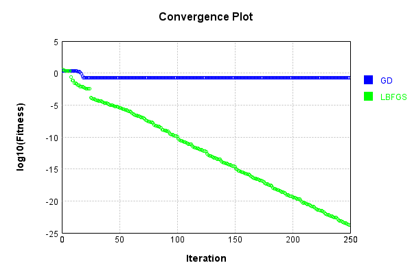
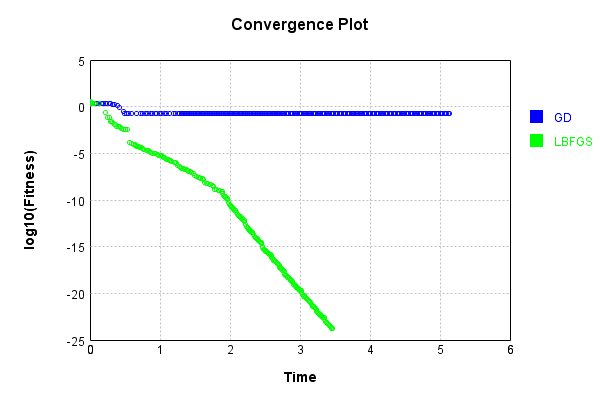

# ProductLayer
## Double3
### Json Serialization
Code from [JsonTest.java:36](../../../../../../../../src/main/java/com/simiacryptus/mindseye/test/unit/JsonTest.java#L36) executed in 0.00 seconds: 
```java
    JsonObject json = layer.getJson();
    NNLayer echo = NNLayer.fromJson(json);
    if ((echo == null)) throw new AssertionError("Failed to deserialize");
    if ((layer == echo)) throw new AssertionError("Serialization did not copy");
    if ((!layer.equals(echo))) throw new AssertionError("Serialization not equal");
    return new GsonBuilder().setPrettyPrinting().create().toJson(json);
```

Returns: 

```
    {
      "class": "com.simiacryptus.mindseye.layers.cudnn.ProductLayer",
      "id": "7fd27a3a-43f3-4711-94b0-1093b0c56582",
      "isFrozen": false,
      "name": "ProductLayer/7fd27a3a-43f3-4711-94b0-1093b0c56582"
    }
```


### Example Input/Output Pair
Code from [ReferenceIO.java:68](../../../../../../../../src/main/java/com/simiacryptus/mindseye/test/unit/ReferenceIO.java#L68) executed in 0.00 seconds: 
```java
    SimpleEval eval = SimpleEval.run(layer, inputPrototype);
    return String.format("--------------------\nInput: \n[%s]\n--------------------\nOutput: \n%s\n--------------------\nDerivative: \n%s",
      Arrays.stream(inputPrototype).map(t -> t.prettyPrint()).reduce((a, b) -> a + ",\n" + b).get(),
      eval.getOutput().prettyPrint(),
      Arrays.stream(eval.getDerivative()).map(t -> t.prettyPrint()).reduce((a, b) -> a + ",\n" + b).get());
```

Returns: 

```
    --------------------
    Input: 
    [[
    	[ [ 0.312 ], [ -1.82 ] ],
    	[ [ 1.736 ], [ 0.836 ] ]
    ],
    [
    	[ [ -0.328 ], [ 0.98 ] ],
    	[ [ 0.964 ], [ -0.288 ] ]
    ],
    [
    	[ [ -0.076 ], [ -1.848 ] ],
    	[ [ 0.632 ], [ 0.776 ] ]
    ]]
    --------------------
    Output: 
    [
    	[ [ 0.007777536000000001 ], [ 3.2960928000000003 ] ],
    	[ [ 1.057654528 ], [ -0.186835968 ] ]
    ]
    --------------------
    Derivative: 
    [
    	[ [ 0.024928 ], [ -1.81104 ] ],
    	[ [ 0.609248 ], [ -0.223488 ] ]
    ],
    [
    	[ [ -0.023712 ], [ 3.36336 ] ],
    	[ [ 1.097152 ], [ 0.648736 ] ]
    ],
    [
    	[ [ -0.10233600000000001 ], [ -1.7836 ] ],
    	[ [ 1.6735039999999999 ], [ -0.24076799999999998 ] ]
    ]
```


[GPU Log](etc/cuda.log)

### Batch Execution
Code from [BatchingTester.java:66](../../../../../../../../src/main/java/com/simiacryptus/mindseye/test/unit/BatchingTester.java#L66) executed in 0.03 seconds: 
```java
    return test(reference, inputPrototype);
```

Returns: 

```
    ToleranceStatistics{absoluteTol=0.0000e+00 +- 0.0000e+00 [0.0000e+00 - 0.0000e+00] (160#), relativeTol=0.0000e+00 +- 0.0000e+00 [0.0000e+00 - 0.0000e+00] (160#)}
```


Code from [SingleDerivativeTester.java:77](../../../../../../../../src/main/java/com/simiacryptus/mindseye/test/unit/SingleDerivativeTester.java#L77) executed in 0.03 seconds: 
```java
    return test(component, inputPrototype);
```
Logging: 
```
    Inputs: [
    	[ [ -1.324 ], [ 1.312 ] ],
    	[ [ -1.3 ], [ -1.332 ] ]
    ],
    [
    	[ [ 0.476 ], [ 0.956 ] ],
    	[ [ 0.932 ], [ -1.596 ] ]
    ],
    [
    	[ [ 1.984 ], [ -0.692 ] ],
    	[ [ 0.552 ], [ 1.936 ] ]
    ]
    Inputs Statistics: {meanExponent=0.11956734932111043, negative=3, min=-1.332, max=-1.332, mean=-0.661, count=4.0, positive=1, stdDev=1.1391729456057145, zeros=0},
    {meanExponent=-0.04237158890867868, negative=1, min=-1.596, max=-1.596, mean=0.19199999999999995, count=4.0, positive=3, stdDev=1.04986856320208, zeros=0},
    {meanExponent=0.04162304824412284, negative=1, min=1.936, max=1.936, mean=0.9450000000000001, count=4.0, positive=3, stdDev=1.1063249974577993, zeros=0}
    Output: [
    	[ [ -1.250364416 ], [ -0.8679562239999999 ] ],
    	[ [ -0.6688032 ], [ 4.115688192 ] ]
    ]
    Outputs Statistics: {meanExponent=0.11881880865655457, negative=3, min=4.115688192, max=4.115688192, mean=0.3321410880000001, count=4.0, positive=1, stdDev=2.194406262769416, zeros=0}
    Feedback for input 0
    Inputs Values: [
    	[ [ -1.324 ], [ 1.312 ] ],
    	[ [ -1.3 ], [ -
```
...[skipping 3285 bytes](etc/162.txt)...
```
    0, positive=2, stdDev=0.6986498176905223, zeros=12}
    Measured Feedback: [ [ -0.6302240000000126, 0.0, 0.0, 0.0 ], [ 0.0, -1.2115999999995353, 0.0, 0.0 ], [ 0.0, 0.0, 1.2542719999997232, 0.0 ], [ 0.0, 0.0, 0.0, 2.1258720000005837 ] ]
    Measured Statistics: {meanExponent=0.07719576041239809, negative=2, min=2.1258720000005837, max=2.1258720000005837, mean=0.09614500000004744, count=16.0, positive=2, stdDev=0.698649817690546, zeros=12}
    Feedback Error: [ [ -1.2545520178264269E-14, 0.0, 0.0, 0.0 ], [ 0.0, 4.647393581080905E-13, 0.0, 0.0 ], [ 0.0, 0.0, -2.7688962234151404E-13, 0.0 ], [ 0.0, 0.0, 0.0, 5.835332217429823E-13 ] ]
    Error Statistics: {meanExponent=-12.75648240189592, negative=2, min=5.835332217429823E-13, max=5.835332217429823E-13, mean=4.7427339833205906E-14, count=16.0, positive=2, stdDev=1.9321770491322794E-13, zeros=12}
    Finite-Difference Derivative Accuracy:
    absoluteTol: 1.7183e-13 +- 4.5041e-13 [0.0000e+00 - 2.5553e-12] (48#)
    relativeTol: 3.1618e-13 +- 3.3211e-13 [9.9532e-15 - 1.1945e-12] (12#)
    
```

Returns: 

```
    ToleranceStatistics{absoluteTol=1.7183e-13 +- 4.5041e-13 [0.0000e+00 - 2.5553e-12] (48#), relativeTol=3.1618e-13 +- 3.3211e-13 [9.9532e-15 - 1.1945e-12] (12#)}
```


### Performance
Now we execute larger-scale runs to benchmark performance:

Code from [PerformanceTester.java:66](../../../../../../../../src/main/java/com/simiacryptus/mindseye/test/unit/PerformanceTester.java#L66) executed in 0.01 seconds: 
```java
    test(component, inputPrototype);
```
Logging: 
```
    100 batches
    Input Dimensions:
    	[2, 2, 1]
    	[2, 2, 1]
    	[2, 2, 1]
    Performance:
    	Evaluation performance: 0.000510s +- 0.000057s [0.000448s - 0.000603s]
    	Learning performance: 0.000235s +- 0.000047s [0.000198s - 0.000326s]
    
```

### Input Learning
In this test, we use a network to learn this target input, given it's pre-evaluated output:

Code from [LearningTester.java:127](../../../../../../../../src/main/java/com/simiacryptus/mindseye/test/unit/LearningTester.java#L127) executed in 0.00 seconds: 
```java
    return Arrays.stream(input_target).map(x -> x.prettyPrint()).reduce((a, b) -> a + "\n" + b).orElse("");
```

Returns: 

```
    [
    	[ [ 0.164 ], [ 1.06 ] ],
    	[ [ 1.676 ], [ 1.888 ] ]
    ]
    [
    	[ [ -1.012 ], [ 1.568 ] ],
    	[ [ -1.076 ], [ -1.78 ] ]
    ]
    [
    	[ [ 1.52 ], [ -0.472 ] ],
    	[ [ -1.52 ], [ -1.04 ] ]
    ]
```


First, we use a conjugate gradient descent method, which converges the fastest for purely linear functions.

Code from [LearningTester.java:300](../../../../../../../../src/main/java/com/simiacryptus/mindseye/test/unit/LearningTester.java#L300) executed in 5.22 seconds: 
```java
    return new IterativeTrainer(trainable)
      .setLineSearchFactory(label -> new QuadraticSearch())
      .setOrientation(new GradientDescent())
      .setMonitor(monitor)
      .setTimeout(30, TimeUnit.SECONDS)
      .setMaxIterations(250)
      .setTerminateThreshold(0)
      .run();
```
Logging: 
```
    Constructing line search parameters: GD
    F(0.0) = LineSearchPoint{point=PointSample{avg=16.877291883078787}, derivative=-1646.3054264503949}
    New Minimum: 16.877291883078787 > 16.87729171844824
    F(1.0E-10) = LineSearchPoint{point=PointSample{avg=16.87729171844824}, derivative=-1646.3054102352985}, delta = -1.6463054564042068E-7
    New Minimum: 16.87729171844824 > 16.877290730665024
    F(7.000000000000001E-10) = LineSearchPoint{point=PointSample{avg=16.877290730665024}, derivative=-1646.3053129447262}, delta = -1.1524137626395259E-6
    New Minimum: 16.877290730665024 > 16.877283816184143
    F(4.900000000000001E-9) = LineSearchPoint{point=PointSample{avg=16.877283816184143}, derivative=-1646.3046319108535}, delta = -8.066894643832256E-6
    New Minimum: 16.877283816184143 > 16.877235414898042
    F(3.430000000000001E-8) = LineSearchPoint{point=PointSample{avg=16.877235414898042}, derivative=-1646.299864680294}, delta = -5.646818074467319E-5
    New Minimum: 16.877235414898042 > 16.876896609819703
    F(2.4010000000000004E-7) = Lin
```
...[skipping 293123 bytes](etc/163.txt)...
```
    76}, derivative=-4.291447591554846E-5}
    F(0.15159365620014983) = LineSearchPoint{point=PointSample{avg=0.16988489529673598}, derivative=6.999224082486E-5}, delta = 2.0476533283686482E-6
    New Minimum: 0.1698828476434076 > 0.169882397774356
    F(0.011661050476934602) = LineSearchPoint{point=PointSample{avg=0.169882397774356}, derivative=-3.42427047199925E-5}, delta = -4.498690516219206E-7
    New Minimum: 0.169882397774356 > 0.16988182330230467
    F(0.08162735333854221) = LineSearchPoint{point=PointSample{avg=0.16988182330230467}, derivative=1.7834672069314014E-5}, delta = -1.0243411029398075E-6
    0.16988182330230467 <= 0.1698828476434076
    New Minimum: 0.16988182330230467 > 0.1698816097609462
    F(0.057663279323188425) = LineSearchPoint{point=PointSample{avg=0.1698816097609462}, derivative=-1.1313453956293202E-8}, delta = -1.2378824613967776E-6
    Left bracket at 0.057663279323188425
    Converged to left
    Iteration 250 complete. Error: 0.1698816097609462 Total: 249631788888017.2200; Orientation: 0.0001; Line Search: 0.0152
    
```

Returns: 

```
    0.1698816097609462
```


This training run resulted in the following regressed input:

Code from [LearningTester.java:144](../../../../../../../../src/main/java/com/simiacryptus/mindseye/test/unit/LearningTester.java#L144) executed in 0.00 seconds: 
```java
    return Arrays.stream(input_gd).map(x -> x.prettyPrint()).reduce((a, b) -> a + "\n" + b).orElse("");
```

Returns: 

```
    [
    	[ [ 0.09206036578340776 ], [ 0.03126580471984321 ] ],
    	[ [ 1.3995119931774578 ], [ 1.517668522114273 ] ]
    ]
    [
    	[ [ -1.78 ], [ 1.568 ] ],
    	[ [ -1.012 ], [ -1.076 ] ]
    ]
    [
    	[ [ -1.52 ], [ -0.472 ] ],
    	[ [ -1.04 ], [ 1.52 ] ]
    ]
```


Next, we run the same optimization using L-BFGS, which is nearly ideal for purely second-order or quadratic functions.

Code from [LearningTester.java:324](../../../../../../../../src/main/java/com/simiacryptus/mindseye/test/unit/LearningTester.java#L324) executed in 3.49 seconds: 
```java
    return new IterativeTrainer(trainable)
      .setLineSearchFactory(label -> new ArmijoWolfeSearch())
      .setOrientation(new LBFGS())
      .setMonitor(monitor)
      .setTimeout(30, TimeUnit.SECONDS)
      .setMaxIterations(250)
      .setTerminateThreshold(0)
      .run();
```
Logging: 
```
    LBFGS Accumulation History: 1 points
    Constructing line search parameters: GD
    th(0)=16.877291883078787;dx=-1646.3054264503949
    Armijo: th(2.154434690031884)=9.212961556467432E10; dx=2.6229813949463138E11 delta=-9.212961554779703E10
    Armijo: th(1.077217345015942)=1.257333017954841E9; dx=7.322743378950701E9 delta=-1.257333001077549E9
    Armijo: th(0.3590724483386473)=970795.83671398; dx=1.867161439654678E7 delta=-970778.9594220968
    New Minimum: 16.877291883078787 > 7.372458931925768
    WOLF (strong): th(0.08976811208466183)=7.372458931925768; dx=781.1434181229832 delta=9.50483295115302
    New Minimum: 7.372458931925768 > 3.761039021271148
    END: th(0.017953622416932366)=3.761039021271148; dx=-208.78675449818388 delta=13.116252861807638
    Iteration 1 complete. Error: 3.761039021271148 Total: 249631815839563.2200; Orientation: 0.0001; Line Search: 0.0154
    LBFGS Accumulation History: 1 points
    th(0)=3.761039021271148;dx=-30.826134562536183
    New Minimum: 3.761039021271148 > 2.9053102577137007
    END: th(0.03867990694677316)
```
...[skipping 126265 bytes](etc/164.txt)...
```
    E-23
    Armijo: th(0.4550629793504315)=2.5184753191653993E-23; dx=1.1587923364318135E-22 delta=-2.3030441232850382E-23
    Armijo: th(0.22753148967521575)=6.242148133484383E-24; dx=5.0600193113879254E-23 delta=-4.087836174680772E-24
    New Minimum: 2.154311958803611E-24 > 1.866905911603702E-24
    WOLF (strong): th(0.07584382989173859)=1.866905911603702E-24; dx=7.089774020722818E-24 delta=2.87406047199909E-25
    END: th(0.018960957472934647)=1.927792152243111E-24; dx=-9.22999802747678E-24 delta=2.265198065604998E-25
    Iteration 249 complete. Error: 1.866905911603702E-24 Total: 249635273974239.7500; Orientation: 0.0000; Line Search: 0.0121
    LBFGS Accumulation History: 1 points
    th(0)=1.927792152243111E-24;dx=-6.236249641562739E-24
    New Minimum: 1.927792152243111E-24 > 1.7458921589005666E-24
    END: th(0.04085014453590969)=1.7458921589005666E-24; dx=-2.6701736057913086E-24 delta=1.8189999334254453E-25
    Iteration 250 complete. Error: 1.7458921589005666E-24 Total: 249635281007221.7200; Orientation: 0.0000; Line Search: 0.0046
    
```

Returns: 

```
    1.7458921589005666E-24
```


Training Converged

Code from [LearningTester.java:96](../../../../../../../../src/main/java/com/simiacryptus/mindseye/test/unit/LearningTester.java#L96) executed in 0.00 seconds: 
```java
    return TestUtil.compare(runs);
```

Returns: 




Code from [LearningTester.java:99](../../../../../../../../src/main/java/com/simiacryptus/mindseye/test/unit/LearningTester.java#L99) executed in 0.00 seconds: 
```java
    return TestUtil.compareTime(runs);
```

Returns: 




