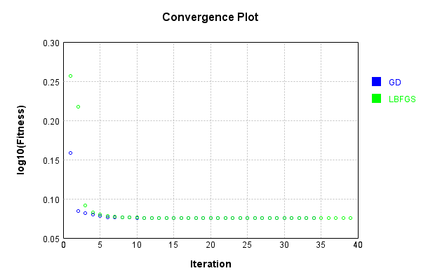
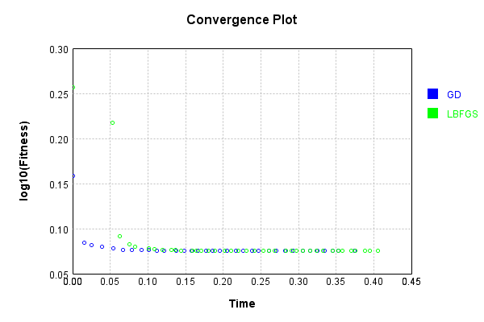

# ProductLayer
## Float
### Json Serialization
Code from [JsonTest.java:36](../../../../../../../../src/main/java/com/simiacryptus/mindseye/test/unit/JsonTest.java#L36) executed in 0.00 seconds: 
```java
    JsonObject json = layer.getJson();
    NNLayer echo = NNLayer.fromJson(json);
    if ((echo == null)) throw new AssertionError("Failed to deserialize");
    if ((layer == echo)) throw new AssertionError("Serialization did not copy");
    if ((!layer.equals(echo))) throw new AssertionError("Serialization not equal");
    return new GsonBuilder().setPrettyPrinting().create().toJson(json);
```

Returns: 

```
    {
      "class": "com.simiacryptus.mindseye.layers.cudnn.ProductLayer",
      "id": "6cdab9f7-1427-46a6-b694-2994968d2d41",
      "isFrozen": false,
      "name": "ProductLayer/6cdab9f7-1427-46a6-b694-2994968d2d41"
    }
```


### Example Input/Output Pair
Code from [ReferenceIO.java:68](../../../../../../../../src/main/java/com/simiacryptus/mindseye/test/unit/ReferenceIO.java#L68) executed in 0.00 seconds: 
```java
    SimpleEval eval = SimpleEval.run(layer, inputPrototype);
    return String.format("--------------------\nInput: \n[%s]\n--------------------\nOutput: \n%s\n--------------------\nDerivative: \n%s",
      Arrays.stream(inputPrototype).map(t -> t.prettyPrint()).reduce((a, b) -> a + ",\n" + b).get(),
      eval.getOutput().prettyPrint(),
      Arrays.stream(eval.getDerivative()).map(t -> t.prettyPrint()).reduce((a, b) -> a + ",\n" + b).get());
```

Returns: 

```
    --------------------
    Input: 
    [[
    	[ [ -1.832 ], [ -1.148 ] ],
    	[ [ 0.24 ], [ 0.88 ] ]
    ],
    [
    	[ [ 1.704 ], [ -0.532 ] ],
    	[ [ 0.84 ], [ -1.268 ] ]
    ]]
    --------------------
    Output: 
    [
    	[ [ -3.121728 ], [ 0.610736 ] ],
    	[ [ 0.20159999999999997 ], [ -1.11584 ] ]
    ]
    --------------------
    Derivative: 
    [
    	[ [ 1.704 ], [ -0.532 ] ],
    	[ [ 0.84 ], [ -1.268 ] ]
    ],
    [
    	[ [ -1.832 ], [ -1.148 ] ],
    	[ [ 0.24 ], [ 0.88 ] ]
    ]
```


[GPU Log](etc/cuda.log)

### Batch Execution
Code from [BatchingTester.java:66](../../../../../../../../src/main/java/com/simiacryptus/mindseye/test/unit/BatchingTester.java#L66) executed in 0.01 seconds: 
```java
    return test(reference, inputPrototype);
```

Returns: 

```
    ToleranceStatistics{absoluteTol=0.0000e+00 +- 0.0000e+00 [0.0000e+00 - 0.0000e+00] (120#), relativeTol=0.0000e+00 +- 0.0000e+00 [0.0000e+00 - 0.0000e+00] (120#)}
```


Code from [SingleDerivativeTester.java:77](../../../../../../../../src/main/java/com/simiacryptus/mindseye/test/unit/SingleDerivativeTester.java#L77) executed in 0.02 seconds: 
```java
    return test(component, inputPrototype);
```
Logging: 
```
    Inputs: [
    	[ [ -0.712 ], [ -1.368 ] ],
    	[ [ 1.188 ], [ 1.244 ] ]
    ],
    [
    	[ [ -1.856 ], [ -0.12 ] ],
    	[ [ 1.164 ], [ -1.968 ] ]
    ]
    Inputs Statistics: {meanExponent=0.0395507280052321, negative=2, min=1.244, max=1.244, mean=0.08799999999999997, count=4.0, positive=2, stdDev=1.151767337616413, zeros=0},
    {meanExponent=-0.0730656769150849, negative=3, min=-1.968, max=-1.968, mean=-0.6950000000000001, count=4.0, positive=1, stdDev=1.2995149094950778, zeros=0}
    Output: [
    	[ [ 1.321472 ], [ 0.16416 ] ],
    	[ [ 1.3828319999999998 ], [ -2.448192 ] ]
    ]
    Outputs Statistics: {meanExponent=-0.03351494890985279, negative=1, min=-2.448192, max=-2.448192, mean=0.10506799999999983, count=4.0, positive=3, stdDev=1.5520106332573884, zeros=0}
    Feedback for input 0
    Inputs Values: [
    	[ [ -0.712 ], [ -1.368 ] ],
    	[ [ 1.188 ], [ 1.244 ] ]
    ]
    Value Statistics: {meanExponent=0.0395507280052321, negative=2, min=1.244, max=1.244, mean=0.08799999999999997, count=4.0, positive=2, stdDev=1.151767337616413, zeros=0}
    Implemented Feedback: [ [ -
```
...[skipping 1618 bytes](etc/165.txt)...
```
    , positive=2, stdDev=0.5771429632248842, zeros=12}
    Measured Feedback: [ [ -0.7119999999998239, 0.0, 0.0, 0.0 ], [ 0.0, 1.1879999999999669, 0.0, 0.0 ], [ 0.0, 0.0, -1.368000000000008, 0.0 ], [ 0.0, 0.0, 0.0, 1.244000000000245 ] ]
    Measured Statistics: {meanExponent=0.039550728005224245, negative=2, min=1.244000000000245, max=1.244000000000245, mean=0.022000000000023737, count=16.0, positive=2, stdDev=0.5771429632248996, zeros=12}
    Feedback Error: [ [ 1.7608137170554983E-13, 0.0, 0.0, 0.0 ], [ 0.0, -3.3084646133829665E-14, 0.0, 0.0 ], [ 0.0, 0.0, -7.993605777301127E-15, 0.0 ], [ 0.0, 0.0, 0.0, 2.4491519923230953E-13 ] ]
    Error Statistics: {meanExponent=-13.235725407292684, negative=2, min=2.4491519923230953E-13, max=2.4491519923230953E-13, mean=2.3744894939170536E-14, count=16.0, positive=2, stdDev=7.207872226300454E-14, zeros=12}
    Finite-Difference Derivative Accuracy:
    absoluteTol: 2.7183e-14 +- 6.6636e-14 [0.0000e+00 - 2.5224e-13] (32#)
    relativeTol: 5.3399e-14 +- 4.1310e-14 [2.9216e-15 - 1.2365e-13] (8#)
    
```

Returns: 

```
    ToleranceStatistics{absoluteTol=2.7183e-14 +- 6.6636e-14 [0.0000e+00 - 2.5224e-13] (32#), relativeTol=5.3399e-14 +- 4.1310e-14 [2.9216e-15 - 1.2365e-13] (8#)}
```


### Performance
Now we execute larger-scale runs to benchmark performance:

Code from [PerformanceTester.java:66](../../../../../../../../src/main/java/com/simiacryptus/mindseye/test/unit/PerformanceTester.java#L66) executed in 0.01 seconds: 
```java
    test(component, inputPrototype);
```
Logging: 
```
    100 batches
    Input Dimensions:
    	[2, 2, 1]
    	[2, 2, 1]
    Performance:
    	Evaluation performance: 0.000406s +- 0.000200s [0.000260s - 0.000797s]
    	Learning performance: 0.000227s +- 0.000015s [0.000202s - 0.000244s]
    
```

### Input Learning
In this test, we use a network to learn this target input, given it's pre-evaluated output:

Code from [LearningTester.java:127](../../../../../../../../src/main/java/com/simiacryptus/mindseye/test/unit/LearningTester.java#L127) executed in 0.00 seconds: 
```java
    return Arrays.stream(input_target).map(x -> x.prettyPrint()).reduce((a, b) -> a + "\n" + b).orElse("");
```

Returns: 

```
    [
    	[ [ 0.24 ], [ 1.552 ] ],
    	[ [ 1.068 ], [ -1.484 ] ]
    ]
    [
    	[ [ 1.46 ], [ -0.984 ] ],
    	[ [ -1.46 ], [ -1.108 ] ]
    ]
```


First, we use a conjugate gradient descent method, which converges the fastest for purely linear functions.

Code from [LearningTester.java:300](../../../../../../../../src/main/java/com/simiacryptus/mindseye/test/unit/LearningTester.java#L300) executed in 0.44 seconds: 
```java
    return new IterativeTrainer(trainable)
      .setLineSearchFactory(label -> new QuadraticSearch())
      .setOrientation(new GradientDescent())
      .setMonitor(monitor)
      .setTimeout(30, TimeUnit.SECONDS)
      .setMaxIterations(250)
      .setTerminateThreshold(0)
      .run();
```
Logging: 
```
    Constructing line search parameters: GD
    F(0.0) = LineSearchPoint{point=PointSample{avg=7.498223385984001}, derivative=-68.84937199867815}
    New Minimum: 7.498223385984001 > 7.498223379099062
    F(1.0E-10) = LineSearchPoint{point=PointSample{avg=7.498223379099062}, derivative=-68.84937194039388}, delta = -6.884938841267285E-9
    New Minimum: 7.498223379099062 > 7.498223337789439
    F(7.000000000000001E-10) = LineSearchPoint{point=PointSample{avg=7.498223337789439}, derivative=-68.84937159068832}, delta = -4.819456123072996E-8
    New Minimum: 7.498223337789439 > 7.498223048622085
    F(4.900000000000001E-9) = LineSearchPoint{point=PointSample{avg=7.498223048622085}, derivative=-68.84936914274952}, delta = -3.373619152924334E-7
    New Minimum: 7.498223048622085 > 7.498221024450884
    F(3.430000000000001E-8) = LineSearchPoint{point=PointSample{avg=7.498221024450884}, derivative=-68.84935200717965}, delta = -2.3615331166126907E-6
    New Minimum: 7.498221024450884 > 7.4982068552665835
    F(2.4010000000000004E-7) = LineSearchPoint{poi
```
...[skipping 44013 bytes](etc/166.txt)...
```
    Converged to left
    Iteration 34 complete. Error: 1.190899054656 Total: 249635878197391.1600; Orientation: 0.0000; Line Search: 0.0212
    Low gradient: 2.9506894394094857E-8
    F(0.0) = LineSearchPoint{point=PointSample{avg=1.190899054656}, derivative=-8.706568167842664E-16}
    F(0.7719407022914222) = LineSearchPoint{point=PointSample{avg=1.1908990546560003}, derivative=9.399061605833522E-16}, delta = 2.220446049250313E-16
    F(0.05938005402241709) = LineSearchPoint{point=PointSample{avg=1.190899054656}, derivative=-7.313827468036938E-16}, delta = 0.0
    F(0.41566037815691964) = LineSearchPoint{point=PointSample{avg=1.190899054656}, derivative=1.0426172271264025E-16}, delta = 0.0
    1.190899054656 <= 1.190899054656
    F(0.37120797999820615) = LineSearchPoint{point=PointSample{avg=1.190899054656}, derivative=1.1605780531008481E-23}, delta = 0.0
    Right bracket at 0.37120797999820615
    Converged to right
    Iteration 35 failed, aborting. Error: 1.190899054656 Total: 249635887059364.1200; Orientation: 0.0000; Line Search: 0.0076
    
```

Returns: 

```
    1.190899054656
```


This training run resulted in the following regressed input:

Code from [LearningTester.java:144](../../../../../../../../src/main/java/com/simiacryptus/mindseye/test/unit/LearningTester.java#L144) executed in 0.00 seconds: 
```java
    return Arrays.stream(input_gd).map(x -> x.prettyPrint()).reduce((a, b) -> a + "\n" + b).orElse("");
```

Returns: 

```
    [
    	[ [ 0.591945928545104 ], [ -9.300696958663678E-19 ] ],
    	[ [ 3.3399368750195526E-18 ], [ 1.2822916967454427 ] ]
    ]
    [
    	[ [ 1.46 ], [ -0.984 ] ],
    	[ [ -1.46 ], [ -1.108 ] ]
    ]
```


Next, we run the same optimization using L-BFGS, which is nearly ideal for purely second-order or quadratic functions.

Code from [LearningTester.java:324](../../../../../../../../src/main/java/com/simiacryptus/mindseye/test/unit/LearningTester.java#L324) executed in 0.45 seconds: 
```java
    return new IterativeTrainer(trainable)
      .setLineSearchFactory(label -> new ArmijoWolfeSearch())
      .setOrientation(new LBFGS())
      .setMonitor(monitor)
      .setTimeout(30, TimeUnit.SECONDS)
      .setMaxIterations(250)
      .setTerminateThreshold(0)
      .run();
```
Logging: 
```
    LBFGS Accumulation History: 1 points
    Constructing line search parameters: GD
    th(0)=7.498223385984001;dx=-68.84937199867815
    Armijo: th(2.154434690031884)=7873.555134246665; dx=16404.624980487333 delta=-7866.0569108606815
    Armijo: th(1.077217345015942)=304.18093188590706; dx=1392.7063861798704 delta=-296.6827084999231
    New Minimum: 7.498223385984001 > 1.8067726351219493
    WOLF (strong): th(0.3590724483386473)=1.8067726351219493; dx=13.012936416876098 delta=5.691450750862051
    END: th(0.08976811208466183)=3.260623992270218; dx=-29.649998157939248 delta=4.237599393713783
    Iteration 1 complete. Error: 1.8067726351219493 Total: 249635921153324.1000; Orientation: 0.0000; Line Search: 0.0276
    LBFGS Accumulation History: 1 points
    th(0)=3.260623992270218;dx=-12.832517573904438
    New Minimum: 3.260623992270218 > 1.6509210981959646
    END: th(0.1933995347338658)=1.6509210981959646; dx=-4.701165519864847 delta=1.6097028940742533
    Iteration 2 complete. Error: 1.6509210981959646 Total: 249635973362220.1000; Orientation: 0.00
```
...[skipping 16591 bytes](etc/167.txt)...
```
     dx=-6.796395302680923E-16 delta=6.661338147750939E-16
    Iteration 38 complete. Error: 1.1908990546560003 Total: 249636315399837.7000; Orientation: 0.0001; Line Search: 0.0040
    LBFGS Accumulation History: 1 points
    th(0)=1.1908990546560003;dx=-4.338171476911978E-16
    New Minimum: 1.1908990546560003 > 1.190899054656
    WOLF (strong): th(1.2617623663269213)=1.190899054656; dx=1.5857614211284737E-17 delta=2.220446049250313E-16
    END: th(0.6308811831634606)=1.190899054656; dx=-2.0897977228088403E-16 delta=2.220446049250313E-16
    Iteration 39 complete. Error: 1.190899054656 Total: 249636325608903.7000; Orientation: 0.0000; Line Search: 0.0080
    LBFGS Accumulation History: 1 points
    th(0)=1.190899054656;dx=-1.5209007630533826E-16
    WOLF (strong): th(1.3591923062957185)=1.190899054656; dx=7.498423447686215E-17 delta=0.0
    END: th(0.6795961531478593)=1.190899054656; dx=-3.8552920154626004E-17 delta=0.0
    Iteration 40 failed, aborting. Error: 1.190899054656 Total: 249636337895176.7000; Orientation: 0.0001; Line Search: 0.0093
    
```

Returns: 

```
    1.190899054656
```


This training run resulted in the following regressed input:

Code from [LearningTester.java:154](../../../../../../../../src/main/java/com/simiacryptus/mindseye/test/unit/LearningTester.java#L154) executed in 0.00 seconds: 
```java
    return Arrays.stream(input_lbgfs).map(x -> x.prettyPrint()).reduce((a, b) -> a + "\n" + b).orElse("");
```

Returns: 

```
    [
    	[ [ 0.5919459349990296 ], [ -6.494922353127832E-25 ] ],
    	[ [ -6.230705083216402E-26 ], [ 1.2822917002990086 ] ]
    ]
    [
    	[ [ 1.46 ], [ -0.984 ] ],
    	[ [ -1.46 ], [ -1.108 ] ]
    ]
```


Code from [LearningTester.java:96](../../../../../../../../src/main/java/com/simiacryptus/mindseye/test/unit/LearningTester.java#L96) executed in 0.00 seconds: 
```java
    return TestUtil.compare(runs);
```

Returns: 




Code from [LearningTester.java:99](../../../../../../../../src/main/java/com/simiacryptus/mindseye/test/unit/LearningTester.java#L99) executed in 0.00 seconds: 
```java
    return TestUtil.compareTime(runs);
```

Returns: 




