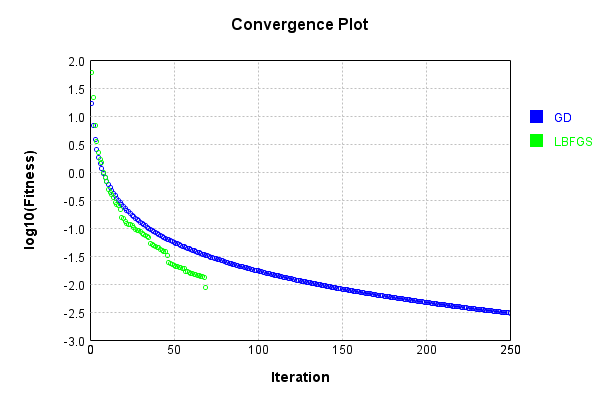
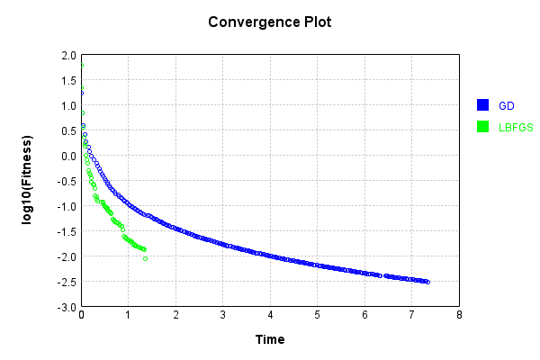
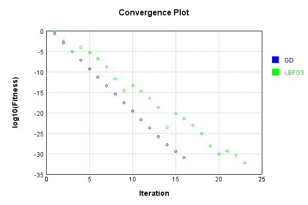
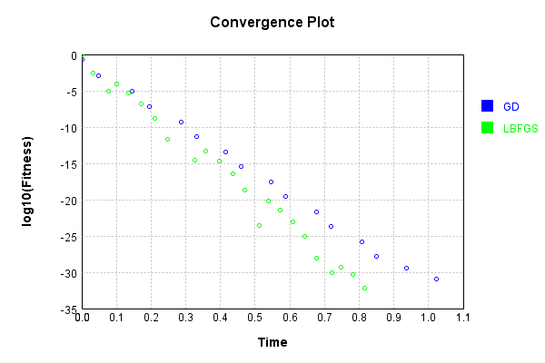
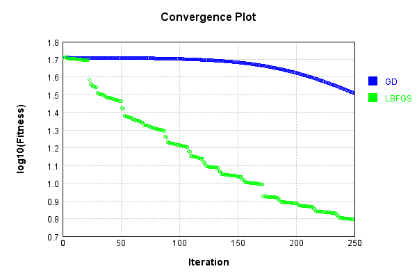
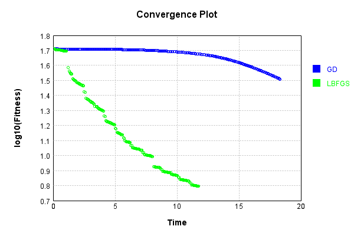

# SimpleConvolutionLayer
## Image
### Json Serialization
Code from [JsonTest.java:36](../../../../../../../../src/main/java/com/simiacryptus/mindseye/test/unit/JsonTest.java#L36) executed in 0.00 seconds: 
```java
    JsonObject json = layer.getJson();
    NNLayer echo = NNLayer.fromJson(json);
    if ((echo == null)) throw new AssertionError("Failed to deserialize");
    if ((layer == echo)) throw new AssertionError("Serialization did not copy");
    if ((!layer.equals(echo))) throw new AssertionError("Serialization not equal");
    return new GsonBuilder().setPrettyPrinting().create().toJson(json);
```

Returns: 

```
    {
      "class": "com.simiacryptus.mindseye.layers.cudnn.SimpleConvolutionLayer",
      "id": "61754e48-f7b0-47dc-86ed-dcffcb10db1b",
      "isFrozen": false,
      "name": "SimpleConvolutionLayer/61754e48-f7b0-47dc-86ed-dcffcb10db1b",
      "filter": [
        [
          [
            1.44,
            1.964,
            -1.304
          ],
          [
            -0.916,
            -0.764,
            -0.076
          ],
          [
            1.048,
            -0.096,
            -1.732
          ]
        ],
        [
          [
            0.228,
            -1.24,
            -0.972
          ],
          [
            0.116,
            1.016,
            1.236
          ],
          [
            -1.364,
            -0.016,
            0.928
          ]
        ],
        [
          [
            -0.552,
            1.064,
            0.388
          ],
          [
            1.588,
            -1.692,
            -0.3
          ],
          [
            -0.808,
            -1.312,
            1.796
          ]
        ],
        [
          [
            -0.128,
            -0.092,
            -0.988
          ],
          [
            -0.644,
            -0.38,
            0.312
          ],
          [
            -1.328,
            0.66,
            -0.092
          ]
     
```
...[skipping 55 bytes](etc/177.txt)...
```
         -0.836
          ],
          [
            -0.988,
            -1.576,
            1.228
          ],
          [
            0.988,
            -0.28,
            -0.916
          ]
        ],
        [
          [
            -1.308,
            -1.48,
            -1.452
          ],
          [
            -0.784,
            1.128,
            1.496
          ],
          [
            1.548,
            1.724,
            1.396
          ]
        ],
        [
          [
            -0.768,
            1.82,
            1.464
          ],
          [
            1.964,
            0.084,
            1.316
          ],
          [
            -0.552,
            1.772,
            0.244
          ]
        ],
        [
          [
            0.284,
            -1.848,
            -1.784
          ],
          [
            1.72,
            -1.524,
            -0.812
          ],
          [
            -1.784,
            0.592,
            -1.064
          ]
        ],
        [
          [
            1.644,
            -1.816,
            1.576
          ],
          [
            1.644,
            1.612,
            1.004
          ],
          [
            -1.68,
            -1.528,
            -0.216
          ]
        ]
      ],
      "strideX": 1,
      "strideY": 1,
      "simple": false,
      "precision": "Double"
    }
```


### Example Input/Output Pair
Code from [ReferenceIO.java:68](../../../../../../../../src/main/java/com/simiacryptus/mindseye/test/unit/ReferenceIO.java#L68) executed in 0.00 seconds: 
```java
    SimpleEval eval = SimpleEval.run(layer, inputPrototype);
    return String.format("--------------------\nInput: \n[%s]\n--------------------\nOutput: \n%s\n--------------------\nDerivative: \n%s",
      Arrays.stream(inputPrototype).map(t -> t.prettyPrint()).reduce((a, b) -> a + ",\n" + b).get(),
      eval.getOutput().prettyPrint(),
      Arrays.stream(eval.getDerivative()).map(t -> t.prettyPrint()).reduce((a, b) -> a + ",\n" + b).get());
```

Returns: 

```
    --------------------
    Input: 
    [[
    	[ [ -1.58, -0.688, 0.464 ], [ -0.048, -1.7, -1.996 ], [ 1.612, -0.436, 1.84 ] ],
    	[ [ -1.764, -1.232, -1.096 ], [ 1.972, -1.22, 0.528 ], [ -1.364, 0.976, -1.732 ] ],
    	[ [ -0.036, -0.56, -1.476 ], [ -1.78, 1.504, -0.588 ], [ 1.816, 1.628, -1.132 ] ]
    ]]
    --------------------
    Output: 
    [
    	[ [ 1.6155359999999992, 11.350511999999998, -0.03556799999999926 ], [ 5.72736, -1.9685119999999994, 1.9841600000000004 ], [ -0.22092799999999943, -2.5815039999999994, 2.0776960000000004 ] ],
    	[ [ 3.6974880000000003, 6.192112, 0.9765120000000002 ], [ -0.8751200000000001, -10.842208000000001, 3.9814880000000015 ], [ -8.904976, 2.1243040000000004, 7.915424000000002 ] ],
    	[ [ -6.271247999999999, -7.0156480000000006, -3.005888 ], [ 4.460575999999999, -2.5843839999999987, -0.41180800000000023 ], [ 1.3304639999999996, -7.287263999999999, -8.179904 ] ]
    ]
    --------------------
    Derivative: 
    [
    	[ [ 1.2480000000000002, -1.1880000000000002, 5.1080000000000005 ], [ 4.112, -9.12, 3.3879999999999995 ], [ 3.3560000000000003, -8.363999999999999, 1.528 ] ],
    	[ [ 0.8199999999999998, -2.5000000000000004, 6.616 ], [ 4.228, -11.384, 4.68 ], [ 4.304, -8.468, 3.76 ] ],
    	[ [ 0.8480000000000001, -3.1000000000000005, 1.44 ], [ 5.084, -8.392000000000001, -1.0080000000000005 ], [ 3.58, -6.5280000000000005, 1.0479999999999996 ] ]
    ]
```


[GPU Log](etc/cuda.log)

### Batch Execution
Code from [BatchingTester.java:66](../../../../../../../../src/main/java/com/simiacryptus/mindseye/test/unit/BatchingTester.java#L66) executed in 0.01 seconds: 
```java
    return test(reference, inputPrototype);
```

Returns: 

```
    ToleranceStatistics{absoluteTol=2.7961e-17 +- 2.0392e-16 [0.0000e+00 - 1.7764e-15] (540#), relativeTol=1.8059e-18 +- 1.2808e-17 [0.0000e+00 - 1.0584e-16] (540#)}
```


Code from [SingleDerivativeTester.java:77](../../../../../../../../src/main/java/com/simiacryptus/mindseye/test/unit/SingleDerivativeTester.java#L77) executed in 0.16 seconds: 
```java
    return test(component, inputPrototype);
```
Logging: 
```
    Inputs: [
    	[ [ -0.708, -1.536, -1.168 ], [ 0.468, -0.54, 0.628 ], [ 0.44, 1.572, -1.96 ] ],
    	[ [ -1.072, 1.284, 0.32 ], [ 1.072, -0.824, 1.26 ], [ -1.26, 0.688, -1.492 ] ],
    	[ [ 1.64, 0.26, 0.184 ], [ 0.184, 0.24, -1.536 ], [ -0.976, 1.856, -1.824 ] ]
    ]
    Inputs Statistics: {meanExponent=-0.09319015105928707, negative=12, min=-1.824, max=-1.824, mean=-0.1037037037037037, count=27.0, positive=15, stdDev=1.1371652479289867, zeros=0}
    Output: [
    	[ [ 5.51288, -0.33220799999999984, 2.751088 ], [ -6.558368, 3.6519839999999992, 2.1838080000000004 ], [ 3.811071999999999, -2.2986239999999993, -10.950912 ] ],
    	[ [ 4.701568000000001, -6.787392, 2.807999999999999 ], [ -16.431231999999998, 3.626800000000001, -6.108383999999998 ], [ 4.0763679999999995, -0.8743039999999997, -5.857568 ] ],
    	[ [ -1.4062400000000004, 0.6516799999999999, 5.611968 ], [ -1.3194239999999997, 3.0244960000000005, -5.7167200000000005 ], [ 8.746608, -6.570640000000001, -5.8843200000000015 ] ]
    ]
    Outputs Statistics: {meanExponent=0.5494240948012616, neg
```
...[skipping 6753 bytes](etc/178.txt)...
```
    .065858760782248E-12, -4.1806558215284895E-12, -1.6904255772942633E-12, 1.567806995339538E-11, 2.1944224215530994E-11, 8.501532811067136E-13, -6.701861288149757E-13, 1.5154544286133387E-12, ... ], [ 0.0, -4.815925436219004E-12, -4.1806558215284895E-12, 0.0, -2.0854984406071253E-12, -2.602362769721367E-13, 0.0, -6.701861288149757E-13, ... ], [ 0.0, 0.0, 0.0, 1.3582912572474015E-11, 1.607314281670824E-11, 0.0, 4.1806558215284895E-12, 8.501532811067136E-13, ... ], [ 0.0, 0.0, 0.0, 4.065858760782248E-12, 1.3582912572474015E-11, -1.6904255772942633E-12, -2.0854984406071253E-12, 4.1806558215284895E-12, ... ], ... ]
    Error Statistics: {meanExponent=-11.749534762856326, negative=190, min=7.366329768387914E-12, max=7.366329768387914E-12, mean=1.3484199277657906E-13, count=2187.0, positive=251, stdDev=2.347177613343869E-12, zeros=1746}
    Finite-Difference Derivative Accuracy:
    absoluteTol: 1.0416e-12 +- 2.6025e-12 [0.0000e+00 - 2.6886e-11] (2916#)
    relativeTol: 4.1600e-12 +- 1.7802e-11 [2.4328e-15 - 2.9193e-10] (882#)
    
```

Returns: 

```
    ToleranceStatistics{absoluteTol=1.0416e-12 +- 2.6025e-12 [0.0000e+00 - 2.6886e-11] (2916#), relativeTol=4.1600e-12 +- 1.7802e-11 [2.4328e-15 - 2.9193e-10] (882#)}
```


### Reference Implementation
Code from [EquivalencyTester.java:61](../../../../../../../../src/main/java/com/simiacryptus/mindseye/test/unit/EquivalencyTester.java#L61) executed in 0.00 seconds: 
```java
    System.out.println(new GsonBuilder().setPrettyPrinting().create().toJson(this.reference.getJson()));
```
Logging: 
```
    {
      "class": "com.simiacryptus.mindseye.layers.aparapi.ConvolutionLayer",
      "id": "6a298f2c-7b2e-4dd4-85c9-bc3968b5991b",
      "isFrozen": false,
      "name": "ConvolutionLayer/6a298f2c-7b2e-4dd4-85c9-bc3968b5991b",
      "filter": [
        [
          [
            1.44,
            1.964,
            -1.304
          ],
          [
            -0.916,
            -0.764,
            -0.076
          ],
          [
            1.048,
            -0.096,
            -1.732
          ]
        ],
        [
          [
            -0.128,
            -0.092,
            -0.988
          ],
          [
            -0.644,
            -0.38,
            0.312
          ],
          [
            -1.328,
            0.66,
            -0.092
          ]
        ],
        [
          [
            -0.768,
            1.82,
            1.464
          ],
          [
            1.964,
            0.084,
            1.316
          ],
          [
            -0.552,
            1.772,
            0.244
          ]
        ],
        [
          [
            0.228,
            -1.24,
            -0.972
          ],
          [
            0.116,
            1.016,
            1.236
          ],
          [
            -1.364,
            -0.016,
            0.928
          ]
        ],
        [
```
...[skipping 28 bytes](etc/179.txt)...
```
        -1.252,
            -0.836
          ],
          [
            -0.988,
            -1.576,
            1.228
          ],
          [
            0.988,
            -0.28,
            -0.916
          ]
        ],
        [
          [
            0.284,
            -1.848,
            -1.784
          ],
          [
            1.72,
            -1.524,
            -0.812
          ],
          [
            -1.784,
            0.592,
            -1.064
          ]
        ],
        [
          [
            -0.552,
            1.064,
            0.388
          ],
          [
            1.588,
            -1.692,
            -0.3
          ],
          [
            -0.808,
            -1.312,
            1.796
          ]
        ],
        [
          [
            -1.308,
            -1.48,
            -1.452
          ],
          [
            -0.784,
            1.128,
            1.496
          ],
          [
            1.548,
            1.724,
            1.396
          ]
        ],
        [
          [
            1.644,
            -1.816,
            1.576
          ],
          [
            1.644,
            1.612,
            1.004
          ],
          [
            -1.68,
            -1.528,
            -0.216
          ]
        ]
      ],
      "skip": [
        [
          0.0
        ]
      ],
      "simple": true
    }
    
```

Code from [EquivalencyTester.java:64](../../../../../../../../src/main/java/com/simiacryptus/mindseye/test/unit/EquivalencyTester.java#L64) executed in 0.01 seconds: 
```java
    return test(subject, inputPrototype);
```
Logging: 
```
    Inputs: [
    	[ [ -1.084, 0.088, 1.94 ], [ 1.368, -0.176, -0.42 ], [ 0.152, 1.136, 0.396 ] ],
    	[ [ 1.216, 1.184, 0.092 ], [ -0.772, -0.088, 1.22 ], [ 1.344, -0.372, 0.74 ] ],
    	[ [ -1.308, -0.168, -1.824 ], [ 1.716, -0.6, 0.288 ], [ 0.612, 1.252, 0.796 ] ]
    ]
    Error: [
    	[ [ 0.0, 0.0, 0.0 ], [ 0.0, 0.0, 0.0 ], [ 0.0, 0.0, 0.0 ] ],
    	[ [ 0.0, 0.0, 0.0 ], [ 0.0, 0.0, 0.0 ], [ 0.0, 0.0, 0.0 ] ],
    	[ [ 0.0, 0.0, 0.0 ], [ 0.0, 0.0, 0.0 ], [ 0.0, 0.0, 0.0 ] ]
    ]
    Accuracy:
    absoluteTol: 0.0000e+00 +- 0.0000e+00 [0.0000e+00 - 0.0000e+00] (27#)
    relativeTol: 0.0000e+00 +- 0.0000e+00 [0.0000e+00 - 0.0000e+00] (27#)
    
```

Returns: 

```
    ToleranceStatistics{absoluteTol=0.0000e+00 +- 0.0000e+00 [0.0000e+00 - 0.0000e+00] (27#), relativeTol=0.0000e+00 +- 0.0000e+00 [0.0000e+00 - 0.0000e+00] (27#)}
```


### Performance
Now we execute larger-scale runs to benchmark performance:

Code from [PerformanceTester.java:66](../../../../../../../../src/main/java/com/simiacryptus/mindseye/test/unit/PerformanceTester.java#L66) executed in 0.87 seconds: 
```java
    test(component, inputPrototype);
```
Logging: 
```
    100 batches
    Input Dimensions:
    	[100, 100, 3]
    Performance:
    	Evaluation performance: 0.032900s +- 0.006058s [0.023885s - 0.040652s]
    	Learning performance: 0.109091s +- 0.027983s [0.084134s - 0.144586s]
    
```

### Input Learning
In this test, we use a network to learn this target input, given it's pre-evaluated output:

Code from [LearningTester.java:127](../../../../../../../../src/main/java/com/simiacryptus/mindseye/test/unit/LearningTester.java#L127) executed in 0.01 seconds: 
```java
    return Arrays.stream(input_target).map(x -> x.prettyPrint()).reduce((a, b) -> a + "\n" + b).orElse("");
```

Returns: 

```
    [
    	[ [ -0.908, 0.832, -0.588 ], [ 0.492, -1.672, -1.668 ], [ -0.268, -1.796, -1.58 ], [ -1.968, -1.284, -0.344 ], [ 1.992, 0.64, 1.136 ], [ -1.236, -0.832, 1.516 ], [ -0.52, -0.92, 1.888 ], [ 0.348, -0.384, 1.288 ], ... ],
    	[ [ -0.444, -1.044, 0.096 ], [ 1.548, -1.364, -1.252 ], [ 1.588, -1.48, -1.676 ], [ -0.324, -0.728, -1.804 ], [ 1.428, 1.88, -0.708 ], [ 0.776, 1.388, 0.612 ], [ 0.408, 1.812, -1.528 ], [ 1.916, 0.648, 1.408 ], ... ],
    	[ [ -0.644, 1.064, -1.392 ], [ 1.428, 1.86, 1.472 ], [ -1.28, -0.656, -1.64 ], [ -0.024, -1.956, -0.808 ], [ 0.028, -1.98, 0.808 ], [ 1.544, -1.164, -0.58 ], [ 0.136, -0.948, -1.752 ], [ 1.532, -1.408, 1.104 ], ... ],
    	[ [ 1.44, 1.672, -1.504 ], [ 1.48, -1.728, 1.572 ], [ 1.264, 0.464, 0.148 ], [ 0.992, 1.452, 1.896 ], [ 1.556, 1.192, 0.2 ], [ -1.316, 1.56, 0.28 ], [ 1.916, -1.056, -1.112 ], [ 0.88, -0.292, 0.616 ], ... ],
    	[ [ -1.116, -0.492, 1.804 ], [ -0.104, -0.836, 1.576 ], [ -1.392, -0.56, -0.176 ], [ 1.128, 1.904, -1.58 ], [ -0.864, -0.76, -1.936 ], [ 0.324, -1.056, -1.148 ], [ -0.144, 0.308, -0.332 ], [ -0.46, -0.428, 1.348 ], ... ],
    	[ [ -1.408, 0.428, -0.716 ], [ 0.724, -1.992, -0.3 ], [ 0.364, -1.252, 0.568 ], [ 0.564, 1.956, 1.324 ], [ -1.724, 1.664, -1.448 ], [ -1.196, 1.4, -0.832 ], [ 0.324, 0.128, 1.008 ], [ -1.016, 0.396, -0.504 ], ... ],
    	[ [ 0.38, 0.112, -0.096 ], [ 1.128, 0.092, -1.132 ], [ -0.228, -1.076, 0.6 ], [ 0.608, 0.668, 0.832 ], [ -1.076, -1.6, -1.984 ], [ 0.476, 0.688, -1.252 ], [ 1.72, 1.076, -0.064 ], [ -0.004, 1.7, -1.384 ], ... ],
    	[ [ -1.352, -1.38, 1.312 ], [ 0.124, 0.792, -1.776 ], [ -1.72, 0.08, 1.564 ], [ -1.12, 0.7, -1.284 ], [ 1.684, 1.936, 0.36 ], [ 0.936, 1.916, -1.024 ], [ -0.216, -0.908, -1.168 ], [ -1.976, -0.336, -0.324 ], ... ],
    	...
    ]
```


First, we use a conjugate gradient descent method, which converges the fastest for purely linear functions.

Code from [LearningTester.java:300](../../../../../../../../src/main/java/com/simiacryptus/mindseye/test/unit/LearningTester.java#L300) executed in 7.43 seconds: 
```java
    return new IterativeTrainer(trainable)
      .setLineSearchFactory(label -> new QuadraticSearch())
      .setOrientation(new GradientDescent())
      .setMonitor(monitor)
      .setTimeout(30, TimeUnit.SECONDS)
      .setMaxIterations(250)
      .setTerminateThreshold(0)
      .run();
```
Logging: 
```
    Constructing line search parameters: GD
    F(0.0) = LineSearchPoint{point=PointSample{avg=103.68448313658607}, derivative=-0.9749872563839043}
    New Minimum: 103.68448313658607 > 103.6844831364885
    F(1.0E-10) = LineSearchPoint{point=PointSample{avg=103.6844831364885}, derivative=-0.9749872563833595}, delta = -9.757172847457696E-11
    New Minimum: 103.6844831364885 > 103.68448313590375
    F(7.000000000000001E-10) = LineSearchPoint{point=PointSample{avg=103.68448313590375}, derivative=-0.9749872563800903}, delta = -6.82319978295709E-10
    New Minimum: 103.68448313590375 > 103.6844831318087
    F(4.900000000000001E-9) = LineSearchPoint{point=PointSample{avg=103.6844831318087}, derivative=-0.9749872563572064}, delta = -4.777362505592464E-9
    New Minimum: 103.6844831318087 > 103.68448310314305
    F(3.430000000000001E-8) = LineSearchPoint{point=PointSample{avg=103.68448310314305}, derivative=-0.974987256197019}, delta = -3.344301546803763E-8
    New Minimum: 103.68448310314305 > 103.68448290249214
    F(2.4010000000000004E-7) = LineSea
```
...[skipping 279788 bytes](etc/180.txt)...
```
     = LineSearchPoint{point=PointSample{avg=0.0030290436059909856}, derivative=-9.892279337165213E-8}, delta = -1.639361156532222E-5
    F(844.5306615506179) = LineSearchPoint{point=PointSample{avg=0.0031179536295712702}, derivative=3.445701465494266E-7}, delta = 7.251641201496241E-5
    F(64.96389704235523) = LineSearchPoint{point=PointSample{avg=0.0030355017717254257}, derivative=-1.3303763490404282E-7}, delta = -9.935445830882173E-6
    F(454.74727929648657) = LineSearchPoint{point=PointSample{avg=0.003030186806536898}, derivative=1.0576625582269211E-7}, delta = -1.5250411019409986E-5
    0.003030186806536898 <= 0.003045437217556308
    New Minimum: 0.0030220896998930814 > 0.0030210573234875863
    F(282.11219869765426) = LineSearchPoint{point=PointSample{avg=0.0030210573234875863}, derivative=6.461136845220109E-23}, delta = -2.4379894068721555E-5
    Right bracket at 282.11219869765426
    Converged to right
    Iteration 250 complete. Error: 0.0030210573234875863 Total: 249664529973148.5000; Orientation: 0.0008; Line Search: 0.0337
    
```

Returns: 

```
    0.0030210573234875863
```


This training run resulted in the following regressed input:

Code from [LearningTester.java:144](../../../../../../../../src/main/java/com/simiacryptus/mindseye/test/unit/LearningTester.java#L144) executed in 0.01 seconds: 
```java
    return Arrays.stream(input_gd).map(x -> x.prettyPrint()).reduce((a, b) -> a + "\n" + b).orElse("");
```

Returns: 

```
    [
    	[ [ -0.11550367961762731, 0.3436868670761887, -0.4701113765086974 ], [ 0.66484892160505, -1.2706779894693958, -1.8020180730755797 ], [ 0.04326072695023202, -2.57273188764621, -1.723371560911628 ], [ -1.9060722764754074, -1.379083230333715, -0.03678564385605795 ], [ 1.7133531455028932, 0.5716610262394519, 1.005693314197708 ], [ -1.1382625220924751, -1.0704136855352675, 2.051496884065977 ], [ -0.5361694837139617, -0.3816727020587931, 1.5908257799315695 ], [ 0.567042167544682, -0.7957958358582674, 0.9306580214851982 ], ... ],
    	[ [ -0.5726867819347089, -0.9771335620240436, 0.41952343205157805 ], [ 1.3079391253653416, -1.0706667587031211, -1.2863667166838793 ], [ 1.7718981737349278, -1.608466996575352, -1.7782098575617848 ], [ -0.2731624967870447, -0.9805537998608914, -1.7919596319845392 ], [ 1.556444797980439, 1.763895270305931, -0.7906563684975003 ], [ 0.8279160664255998, 1.61400277705894, 0.5581370430750562 ], [ 0.1733535317835166, 1.5758501898267065, -1.4872152287014946 ], [ 1.8316303217742242, 0.9543816786
```
...[skipping 2218 bytes](etc/181.txt)...
```
    567935053132409 ], [ 1.4355916992208542, 0.2485650823883667, -1.3625673012407011 ], [ 0.1792447120661302, -1.3008606736764, 0.46438389544351216 ], [ 0.3668510112771826, 0.7628890374401012, 0.8884514483967448 ], [ -0.9341839778794909, -1.5481066070816678, -2.0060938253945637 ], [ 0.2695013279297922, 0.7100076927497806, -1.1035205303451368 ], [ 1.666097616165921, 0.9885181300607124, 0.01258736771290872 ], [ 0.21061659268408942, 1.7896648685791101, -1.3397574609607914 ], ... ],
    	[ [ -1.1085029285080554, -0.7033668703970224, 0.46758047622831095 ], [ -0.03553310610484465, 0.10287055149243675, -1.5967558052654443 ], [ -2.0056245181715235, 0.5772145242196556, 1.772102375934331 ], [ -1.0431993447054075, 0.612654504063514, -1.4297649758211926 ], [ 1.7410074497070482, 1.6316501845285643, 0.6041915832060183 ], [ 0.952238359817487, 2.2855593364075064, -1.2208820012072576 ], [ -0.024522379804546832, -1.296929721673966, -1.1725473922775491 ], [ -2.1603926374360065, -0.11453505518100249, -0.2577917094329967 ], ... ],
    	...
    ]
```


Next, we run the same optimization using L-BFGS, which is nearly ideal for purely second-order or quadratic functions.

Code from [LearningTester.java:324](../../../../../../../../src/main/java/com/simiacryptus/mindseye/test/unit/LearningTester.java#L324) executed in 1.42 seconds: 
```java
    return new IterativeTrainer(trainable)
      .setLineSearchFactory(label -> new ArmijoWolfeSearch())
      .setOrientation(new LBFGS())
      .setMonitor(monitor)
      .setTimeout(30, TimeUnit.SECONDS)
      .setMaxIterations(250)
      .setTerminateThreshold(0)
      .run();
```
Logging: 
```
    LBFGS Accumulation History: 1 points
    Constructing line search parameters: GD
    th(0)=103.68448313658607;dx=-0.9749872563839043
    New Minimum: 103.68448313658607 > 101.59658173631274
    WOLFE (weak): th(2.154434690031884)=101.59658173631274; dx=-0.963248708655296 delta=2.0879014002733243
    New Minimum: 101.59658173631274 > 99.53397027047494
    WOLFE (weak): th(4.308869380063768)=99.53397027047494; dx=-0.9515101609266878 delta=4.150512866111129
    New Minimum: 99.53397027047494 > 91.53642375149983
    WOLFE (weak): th(12.926608140191302)=91.53642375149983; dx=-0.9045559700122547 delta=12.148059385086242
    New Minimum: 91.53642375149983 > 60.55487143465406
    END: th(51.70643256076521)=60.55487143465406; dx=-0.693262110897306 delta=43.129611701932006
    Iteration 1 complete. Error: 60.55487143465406 Total: 249664588307939.4700; Orientation: 0.0014; Line Search: 0.0254
    LBFGS Accumulation History: 1 points
    th(0)=60.55487143465406;dx=-0.4995800521415632
    New Minimum: 60.55487143465406 > 21.031789109339257
    END: th(111.3981320067
```
...[skipping 33629 bytes](etc/182.txt)...
```
    8
    WOLFE (weak): th(281.7077756895601)=0.013066503805154398; dx=-7.978779026207905E-7 delta=2.2640624343168818E-4
    New Minimum: 0.013066503805154398 > 0.01284337323014781
    WOLFE (weak): th(563.4155513791202)=0.01284337323014781; dx=-7.86250007660407E-7 delta=4.4953681843827586E-4
    New Minimum: 0.01284337323014781 > 0.011983607614374078
    WOLFE (weak): th(1690.2466541373606)=0.011983607614374078; dx=-7.397384278188734E-7 delta=0.0013093024342120084
    New Minimum: 0.011983607614374078 > 0.008763244691590108
    END: th(6760.986616549442)=0.008763244691590108; dx=-5.304363185319723E-7 delta=0.004529665356995978
    Iteration 69 complete. Error: 0.008763244691590108 Total: 249665954883051.0600; Orientation: 0.0015; Line Search: 0.0234
    LBFGS Accumulation History: 1 points
    th(0)=0.008763244691590108;dx=-2.373725535072561E-6
    MAX ALPHA: th(0)=0.008763244691590108;th'(0)=-2.373725535072561E-6;
    Iteration 70 failed, aborting. Error: 0.008763244691590108 Total: 249665968363099.0300; Orientation: 0.0014; Line Search: 0.0083
    
```

Returns: 

```
    0.008763244691590108
```


This training run resulted in the following regressed input:

Code from [LearningTester.java:154](../../../../../../../../src/main/java/com/simiacryptus/mindseye/test/unit/LearningTester.java#L154) executed in 0.01 seconds: 
```java
    return Arrays.stream(input_lbgfs).map(x -> x.prettyPrint()).reduce((a, b) -> a + "\n" + b).orElse("");
```

Returns: 

```
    [
    	[ [ -0.07303669342610711, 0.27338346894374754, -0.6047594588470181 ], [ 0.6496616088621308, -1.2730682944196015, -1.7834517513262627 ], [ -0.008491719649255512, -2.6266066871727087, -1.7185520770029747 ], [ -1.8680712714621581, -1.2604711341969075, -0.06109721123419553 ], [ 1.6786115167980884, 0.6233948532266929, 0.834953443239378 ], [ -1.2208874876548528, -1.195561204436093, 2.124150760506435 ], [ -0.575379348691922, -0.23596639134361178, 1.6677221401826026 ], [ 0.548686900580951, -0.8068506009597743, 0.8847881545004358 ], ... ],
    	[ [ -0.5184555342772303, -0.8319341291382083, 0.3551434445037526 ], [ 1.313691341212261, -1.07966401066436, -1.3885387830412876 ], [ 1.8538757123595266, -1.6545888003645066, -1.7528978330671212 ], [ -0.4039289997125135, -0.9344233772471827, -1.733228926892124 ], [ 1.5886409559555337, 1.7489788073082106, -0.8323461355684975 ], [ 0.8856500338259375, 1.6848489697731608, 0.5393563437229043 ], [ 0.14594775930282464, 1.488592240124596, -1.4510373670414398 ], [ 1.8309713119463011, 1.01
```
...[skipping 2237 bytes](etc/183.txt)...
```
    717577198 ], [ 1.4339283669680778, 0.2780439644250437, -1.350229110912047 ], [ 0.20609761145433983, -1.3658794665975031, 0.41590728113279374 ], [ 0.3590303551939639, 0.8199100367659428, 0.8587377800141635 ], [ -1.0031708668244455, -1.608569451949878, -2.0160903235227328 ], [ 0.2311493399146047, 0.7529254979169937, -1.0736660746349813 ], [ 1.6248377914632828, 1.0276214442253695, -0.036657587396563766 ], [ 0.27068058760207814, 1.7585640350837888, -1.2950982608786754 ], ... ],
    	[ [ -1.0791649876319702, -0.721000724614061, 0.45952444578298857 ], [ -0.001733820915785429, 0.13401939807733318, -1.6053155691278314 ], [ -2.0418272096841186, 0.48974572713098413, 1.7379022289439938 ], [ -1.0354903156969735, 0.6603890706385017, -1.453278667705655 ], [ 1.720370001719919, 1.6431491298991054, 0.5452960706936454 ], [ 0.9417701270301059, 2.2748690743947972, -1.2162276983700737 ], [ -0.08138117835295505, -1.2611919469145105, -1.121659415961032 ], [ -2.1565612489859456, -0.06516941730946434, -0.2449726787599061 ], ... ],
    	...
    ]
```


Code from [LearningTester.java:96](../../../../../../../../src/main/java/com/simiacryptus/mindseye/test/unit/LearningTester.java#L96) executed in 0.00 seconds: 
```java
    return TestUtil.compare(runs);
```

Returns: 




Code from [LearningTester.java:99](../../../../../../../../src/main/java/com/simiacryptus/mindseye/test/unit/LearningTester.java#L99) executed in 0.00 seconds: 
```java
    return TestUtil.compareTime(runs);
```

Returns: 




### Model Learning
In this test, attempt to train a network to emulate a randomized network given an example input/output. The target state is:

Code from [LearningTester.java:176](../../../../../../../../src/main/java/com/simiacryptus/mindseye/test/unit/LearningTester.java#L176) executed in 0.00 seconds: 
```java
    return network_target.state().stream().map(Arrays::toString).reduce((a, b) -> a + "\n" + b).orElse("");
```

Returns: 

```
    [0.244, 1.964, -0.836, 1.82, 1.644, 0.928, -1.064, -0.644, -0.092, 1.064, 1.496, -0.916, -0.128, -1.816, -0.808, 0.66, 1.612, -1.692, -1.576, 1.548, -0.092, 1.228, 0.084, -0.216, 0.388, -1.528, 0.592, 1.128, -0.076, 1.724, -0.764, -1.304, -1.464, 0.988, -1.524, -0.768, 1.316, -1.732, 1.016, -0.28, -0.784, 1.772, -0.552, 0.228, 1.588, -0.38, -1.68, -1.308, -0.3, 1.236, 1.644, -0.988, 1.396, 0.312, -1.848, 1.464, -1.784, -1.364, -0.096, 1.44, -1.48, 1.004, 1.576, 0.116, -0.016, -0.972, -1.312, -1.784, 1.72, -0.552, 1.796, -0.988, 1.048, -0.916, 0.284, -1.328, -0.812, -1.452, 1.964, -1.24, -1.252]
```


First, we use a conjugate gradient descent method, which converges the fastest for purely linear functions.

Code from [LearningTester.java:300](../../../../../../../../src/main/java/com/simiacryptus/mindseye/test/unit/LearningTester.java#L300) executed in 1.25 seconds: 
```java
    return new IterativeTrainer(trainable)
      .setLineSearchFactory(label -> new QuadraticSearch())
      .setOrientation(new GradientDescent())
      .setMonitor(monitor)
      .setTimeout(30, TimeUnit.SECONDS)
      .setMaxIterations(250)
      .setTerminateThreshold(0)
      .run();
```
Logging: 
```
    Constructing line search parameters: GD
    F(0.0) = LineSearchPoint{point=PointSample{avg=96.37870280615}, derivative=-168.37969292899072}
    New Minimum: 96.37870280615 > 96.37870278931182
    F(1.0E-10) = LineSearchPoint{point=PointSample{avg=96.37870278931182}, derivative=-168.37969291424682}, delta = -1.683818595665798E-8
    New Minimum: 96.37870278931182 > 96.37870268828334
    F(7.000000000000001E-10) = LineSearchPoint{point=PointSample{avg=96.37870268828334}, derivative=-168.37969282578285}, delta = -1.1786666220814368E-7
    New Minimum: 96.37870268828334 > 96.3787019810897
    F(4.900000000000001E-9) = LineSearchPoint{point=PointSample{avg=96.3787019810897}, derivative=-168.3796922065364}, delta = -8.250602974158028E-7
    New Minimum: 96.3787019810897 > 96.37869703072724
    F(3.430000000000001E-8) = LineSearchPoint{point=PointSample{avg=96.37869703072724}, derivative=-168.37968787180955}, delta = -5.775422764031646E-6
    New Minimum: 96.37869703072724 > 96.37866237819031
    F(2.4010000000000004E-7) = LineSearchPoint{point=Poi
```
...[skipping 19377 bytes](etc/184.txt)...
```
    -6.648460156135484E-31
    F(2.332456902703563) = LineSearchPoint{point=PointSample{avg=3.213273055238993E-30}, derivative=2.568247668305583E-30}, delta = -3.5289949577579497E-32
    3.213273055238993E-30 <= 3.2485630048165724E-30
    F(1.1587077173229656) = LineSearchPoint{point=PointSample{avg=1.0856492775576773E-31}, derivative=3.478092613465644E-33}, delta = -3.139998077060805E-30
    Right bracket at 1.1587077173229656
    Converged to right
    Iteration 16 complete. Error: 1.0675886769111915E-31 Total: 249667334675459.7500; Orientation: 0.0001; Line Search: 0.0776
    Zero gradient: 9.007642770275997E-17
    F(0.0) = LineSearchPoint{point=PointSample{avg=1.0856492775576773E-31}, derivative=-8.113762827690543E-33}
    New Minimum: 1.0856492775576773E-31 > 0.0
    F(1.1587077173229656) = LineSearchPoint{point=PointSample{avg=0.0}, derivative=0.0}, delta = -1.0856492775576773E-31
    0.0 <= 1.0856492775576773E-31
    Converged to right
    Iteration 17 complete. Error: 0.0 Total: 249667360051645.6600; Orientation: 0.0001; Line Search: 0.0169
    
```

Returns: 

```
    0.0
```


Training Converged

Next, we run the same optimization using L-BFGS, which is nearly ideal for purely second-order or quadratic functions.

Code from [LearningTester.java:324](../../../../../../../../src/main/java/com/simiacryptus/mindseye/test/unit/LearningTester.java#L324) executed in 0.90 seconds: 
```java
    return new IterativeTrainer(trainable)
      .setLineSearchFactory(label -> new ArmijoWolfeSearch())
      .setOrientation(new LBFGS())
      .setMonitor(monitor)
      .setTimeout(30, TimeUnit.SECONDS)
      .setMaxIterations(250)
      .setTerminateThreshold(0)
      .run();
```
Logging: 
```
    LBFGS Accumulation History: 1 points
    Constructing line search parameters: GD
    th(0)=108.17339303793594;dx=-188.71336886416788
    New Minimum: 108.17339303793594 > 85.13073103450239
    WOLF (strong): th(2.154434690031884)=85.13073103450239; dx=167.3224563337977 delta=23.04266200343355
    New Minimum: 85.13073103450239 > 0.7700704486416048
    END: th(1.077217345015942)=0.7700704486416048; dx=-10.695456265184967 delta=107.40332258929433
    Iteration 1 complete. Error: 0.7700704486416048 Total: 249667406233818.6200; Orientation: 0.0001; Line Search: 0.0257
    LBFGS Accumulation History: 1 points
    th(0)=0.7700704486416048;dx=-1.2647637462608892
    New Minimum: 0.7700704486416048 > 0.6366999021727513
    WOLF (strong): th(2.3207944168063896)=0.6366999021727513; dx=1.1498284934844896 delta=0.1333705464688535
    New Minimum: 0.6366999021727513 > 0.0029136517990366513
    END: th(1.1603972084031948)=0.0029136517990366513; dx=-0.05746762638819934 delta=0.7671567968425681
    Iteration 2 complete. Error: 0.0029136517990366513 Total: 2496674397
```
...[skipping 10625 bytes](etc/185.txt)...
```
    400; Orientation: 0.0001; Line Search: 0.0266
    LBFGS Accumulation History: 1 points
    th(0)=4.919287042264083E-31;dx=-1.3355073315082113E-31
    New Minimum: 4.919287042264083E-31 > 4.295799204155216E-31
    WOLF (strong): th(2.185957559473853)=4.295799204155216E-31; dx=1.2128252192125184E-31 delta=6.23487838108867E-32
    New Minimum: 4.295799204155216E-31 > 7.402144827323828E-33
    END: th(1.0929787797369266)=7.402144827323828E-33; dx=-3.8277940119778095E-34 delta=4.845265593990845E-31
    Iteration 23 complete. Error: 7.402144827323828E-33 Total: 249668223370308.8000; Orientation: 0.0000; Line Search: 0.0260
    LBFGS Accumulation History: 1 points
    th(0)=7.402144827323828E-33;dx=-1.6676108133840157E-34
    Armijo: th(2.354751398533952)=7.587855832094608E-33; dx=1.4782264624515816E-34 delta=-1.8571100477077994E-34
    New Minimum: 7.402144827323828E-33 > 0.0
    END: th(1.177375699266976)=0.0; dx=0.0 delta=7.402144827323828E-33
    Iteration 24 complete. Error: 0.0 Total: 249668258067567.7800; Orientation: 0.0001; Line Search: 0.0254
    
```

Returns: 

```
    0.0
```


Training Converged

Code from [LearningTester.java:96](../../../../../../../../src/main/java/com/simiacryptus/mindseye/test/unit/LearningTester.java#L96) executed in 0.00 seconds: 
```java
    return TestUtil.compare(runs);
```

Returns: 




Code from [LearningTester.java:99](../../../../../../../../src/main/java/com/simiacryptus/mindseye/test/unit/LearningTester.java#L99) executed in 0.00 seconds: 
```java
    return TestUtil.compareTime(runs);
```

Returns: 




### Composite Learning
In this test, attempt to train a network to emulate a randomized network given an example input/output. The target state is:

Code from [LearningTester.java:219](../../../../../../../../src/main/java/com/simiacryptus/mindseye/test/unit/LearningTester.java#L219) executed in 0.00 seconds: 
```java
    return network_target.state().stream().map(Arrays::toString).reduce((a, b) -> a + "\n" + b).orElse("");
```

Returns: 

```
    [0.388, -1.064, 1.964, -0.096, 1.016, -0.38, 1.464, -0.016, -0.28, -0.092, -0.784, 1.724, 1.316, 1.82, 0.284, 1.796, -0.768, -0.128, 1.048, 1.548, 1.396, 1.964, -0.092, 1.236, -0.988, 0.116, -1.304, -0.972, 1.228, -1.24, 1.72, 0.66, -1.784, 1.496, -0.644, 0.592, 0.228, -0.764, -0.916, -0.836, 1.612, -1.252, -1.784, -1.68, 1.772, -0.3, 1.128, -1.364, -1.308, -0.916, -1.692, -1.48, -0.216, -0.808, 0.928, -1.464, 1.644, 1.004, -0.552, -0.076, 1.644, -1.576, 0.084, 0.988, 0.244, -1.312, -1.328, -1.452, 1.44, 1.576, -0.988, -1.816, -1.848, -0.552, 0.312, -0.812, 1.064, -1.524, -1.528, -1.732, 1.588]
```


We simultaneously regress this target input:

Code from [LearningTester.java:223](../../../../../../../../src/main/java/com/simiacryptus/mindseye/test/unit/LearningTester.java#L223) executed in 0.01 seconds: 
```java
    return Arrays.stream(testInput).map(x -> x.prettyPrint()).reduce((a, b) -> a + "\n" + b).orElse("");
```

Returns: 

```
    [
    	[ [ 1.972, -0.196, 0.968 ], [ 1.14, 0.428, 1.164 ], [ 0.52, 1.892, -0.908 ], [ -0.008, -1.56, -0.036 ], [ -1.196, 0.84, 0.24 ], [ 1.4, -1.552, 1.684 ], [ 1.796, 0.872, 0.256 ], [ -0.48, 1.168, 1.964 ], ... ],
    	[ [ -1.448, -1.736, -1.604 ], [ 0.376, 0.496, -1.372 ], [ 0.32, -1.06, 0.3 ], [ 0.252, -0.712, 1.448 ], [ -1.784, 0.224, -1.892 ], [ -0.628, 1.956, -0.112 ], [ -0.632, 1.1, 1.284 ], [ 0.832, 1.428, -1.108 ], ... ],
    	[ [ -0.632, 0.372, -0.568 ], [ 0.836, 1.416, -1.064 ], [ 0.212, 0.192, -1.592 ], [ 1.904, 1.952, -0.236 ], [ 0.724, -1.312, 0.312 ], [ 0.068, 1.572, -1.56 ], [ -0.316, 0.232, 1.624 ], [ 1.716, -0.768, 1.08 ], ... ],
    	[ [ 0.736, -1.884, 1.368 ], [ 0.908, -0.264, -1.62 ], [ -1.58, 0.276, 1.496 ], [ 1.008, 1.264, 1.196 ], [ 0.836, -1.632, -1.88 ], [ 0.62, -1.468, 0.768 ], [ -0.912, -0.864, -1.484 ], [ 1.292, 0.44, -1.92 ], ... ],
    	[ [ 1.884, 0.808, -1.064 ], [ 1.884, 1.864, -1.076 ], [ -0.6, 1.508, 1.264 ], [ -1.944, 0.676, -1.136 ], [ 1.548, -1.664, 1.336 ], [ -0.652, -0.148, -0.508 ], [ -1.02, 0.088, 0.08 ], [ -1.708, -0.844, 0.236 ], ... ],
    	[ [ 0.844, 0.212, 0.672 ], [ 0.484, -0.492, 0.288 ], [ -0.356, 0.9, 0.376 ], [ 1.452, 1.6, -0.76 ], [ 1.224, 0.864, 0.492 ], [ -0.548, 0.48, -1.86 ], [ -0.764, 1.88, 1.596 ], [ -0.5, 0.796, -1.616 ], ... ],
    	[ [ -0.024, 0.092, -0.384 ], [ -1.044, -1.008, -1.788 ], [ -1.04, -1.232, -1.624 ], [ -1.364, -0.856, -0.004 ], [ 0.252, -0.848, -1.792 ], [ -1.272, 1.688, 1.264 ], [ 1.536, 0.492, 0.436 ], [ 1.868, -0.524, 0.452 ], ... ],
    	[ [ 1.756, -1.924, 0.652 ], [ -0.532, -0.676, -1.064 ], [ -0.748, -1.608, -0.996 ], [ -1.188, -1.888, 1.052 ], [ 0.092, -0.656, -1.2 ], [ 0.488, 1.512, -1.488 ], [ 1.136, 0.2, -1.584 ], [ -0.62, 1.7, 1.756 ], ... ],
    	...
    ]
```


Which produces the following output:

Code from [LearningTester.java:230](../../../../../../../../src/main/java/com/simiacryptus/mindseye/test/unit/LearningTester.java#L230) executed in 0.01 seconds: 
```java
    return Stream.of(targetOutput).map(x -> x.prettyPrint()).reduce((a, b) -> a + "\n" + b).orElse("");
```

Returns: 

```
    [
    	[ [ -4.822288, 3.702784, 3.547440000000001 ], [ -6.575679999999999, 2.0838400000000004, -7.538831999999999 ], [ 8.660319999999999, 5.5722879999999995, -6.7488319999999975 ], [ -5.969824000000001, -4.230896, 3.4205599999999996 ], [ -2.3116639999999995, 7.5962239999999985, -3.9616959999999994 ], [ -1.2801600000000006, -4.3424320000000005, -3.344671999999998 ], [ 13.152928000000001, -3.66792, -2.357312 ], [ 1.7970239999999995, -6.328816000000001, -6.9586879999999995 ], ... ],
    	[ [ -3.889008000000001, -12.879167999999996, 5.183423999999999 ], [ 4.283232, 3.5933120000000005, 5.965344000000001 ], [ -2.840256000000001, 1.4068800000000001, 19.505424 ], [ 3.089728000000001, 4.700752000000001, -2.455152 ], [ 5.694591999999998, -3.0198560000000017, 19.758512 ], [ 9.729712, 1.340063999999999, -5.696576000000004 ], [ 7.179216, -20.583840000000006, 5.60824 ], [ 3.215792, 2.2436319999999985, -5.158368000000001 ], ... ],
    	[ [ -6.991024, 8.46376, 4.212960000000001 ], [ -5.760944, 8.0776, -1.3812799999999998 ], [ 5.859776, 
```
...[skipping 1564 bytes](etc/186.txt)...
```
    99984, -2.818736 ], [ -1.2518080000000007, -5.32232, 2.2348800000000013 ], [ -8.408896, 11.423472, -5.884608 ], ... ],
    	[ [ -2.2931840000000006, -1.036896, 7.0819519999999985 ], [ -8.660432000000002, 2.597184, 0.43171200000000026 ], [ 0.3799359999999995, 0.1203359999999992, 7.322672 ], [ -5.973472000000001, -3.9541280000000008, 11.263919999999999 ], [ -11.44184, 6.947296000000001, -1.8375360000000005 ], [ -0.39790400000000037, 10.827647999999998, 5.249408000000002 ], [ 7.244784, 7.311695999999998, -6.492608000000001 ], [ 12.677775999999996, 0.6819199999999997, -1.9747359999999983 ], ... ],
    	[ [ -7.694432, 3.272048000000001, 2.72672 ], [ -4.567392, 5.808496000000001, -7.086895999999999 ], [ -3.8258719999999995, 3.6187840000000007, 5.227360000000001 ], [ -4.348207999999999, 7.711696, 12.855775999999999 ], [ -4.609408, 9.029999999999996, 4.068176 ], [ 8.377936, 1.9562719999999996, -2.727808 ], [ 0.8910239999999997, -0.4606400000000003, 5.529344 ], [ 5.442863999999999, -4.772623999999999, 1.26816 ], ... ],
    	...
    ]
```


First, we use a conjugate gradient descent method, which converges the fastest for purely linear functions.

Code from [LearningTester.java:300](../../../../../../../../src/main/java/com/simiacryptus/mindseye/test/unit/LearningTester.java#L300) executed in 18.51 seconds: 
```java
    return new IterativeTrainer(trainable)
      .setLineSearchFactory(label -> new QuadraticSearch())
      .setOrientation(new GradientDescent())
      .setMonitor(monitor)
      .setTimeout(30, TimeUnit.SECONDS)
      .setMaxIterations(250)
      .setTerminateThreshold(0)
      .run();
```
Logging: 
```
    Constructing line search parameters: GD
    F(0.0) = LineSearchPoint{point=PointSample{avg=104.86585791021052}, derivative=-96.24474987994425}
    New Minimum: 104.86585791021052 > 104.86585790058547
    F(1.0E-10) = LineSearchPoint{point=PointSample{avg=104.86585790058547}, derivative=-96.2447498711705}, delta = -9.625054531170463E-9
    New Minimum: 104.86585790058547 > 104.8658578428394
    F(7.000000000000001E-10) = LineSearchPoint{point=PointSample{avg=104.8658578428394}, derivative=-96.24474981852848}, delta = -6.737111846177868E-8
    New Minimum: 104.8658578428394 > 104.8658574386111
    F(4.900000000000001E-9) = LineSearchPoint{point=PointSample{avg=104.8658574386111}, derivative=-96.24474945003439}, delta = -4.7159942084817885E-7
    New Minimum: 104.8658574386111 > 104.86585460901563
    F(3.430000000000001E-8) = LineSearchPoint{point=PointSample{avg=104.86585460901563}, derivative=-96.24474687057563}, delta = -3.301194894334003E-6
    New Minimum: 104.86585460901563 > 104.86583480184835
    F(2.4010000000000004E-7) = LineSearchPo
```
...[skipping 276404 bytes](etc/187.txt)...
```
    4}, delta = 2.925959676470832
    F(0.9440558380921595) = LineSearchPoint{point=PointSample{avg=32.37346571626541}, derivative=-0.09768401797587756}, delta = -0.12080713067410898
    F(6.6083908666451165) = LineSearchPoint{point=PointSample{avg=32.85405807674939}, derivative=0.2681280176892368}, delta = 0.35978522980987293
    F(0.5083377589727013) = LineSearchPoint{point=PointSample{avg=32.42212021051007}, derivative=-0.1256420776816597}, delta = -0.07215263642944336
    F(3.558364312808909) = LineSearchPoint{point=PointSample{avg=32.33785151327464}, derivative=0.07059181968948668}, delta = -0.15642133366487343
    32.33785151327464 <= 32.494272846939516
    New Minimum: 32.31544883958957 > 32.29921922819024
    F(2.4606007273145285) = LineSearchPoint{point=PointSample{avg=32.29921922819024}, derivative=-1.8053590407232645E-4}, delta = -0.1950536187492773
    Left bracket at 2.4606007273145285
    Converged to left
    Iteration 250 complete. Error: 32.29921922819024 Total: 249686910275932.2000; Orientation: 0.0009; Line Search: 0.0836
    
```

Returns: 

```
    32.29921922819024
```


This training run resulted in the following configuration:

Code from [LearningTester.java:245](../../../../../../../../src/main/java/com/simiacryptus/mindseye/test/unit/LearningTester.java#L245) executed in 0.00 seconds: 
```java
    return network_gd.state().stream().map(Arrays::toString).reduce((a, b) -> a + "\n" + b).orElse("");
```

Returns: 

```
    [-0.5067544592874009, -2.0443224698775033, 0.22557776022474965, -1.4579767824055099, 0.5996571062373959, -1.0618556412159195, 0.5075621511338473, -0.41746192217540173, 0.08349730462616113, 0.30183223699984985, 0.20362098165637296, 0.7550229638727038, 0.8472300690562509, -0.22307657120995203, -0.5313097725019548, -0.1979018316643453, -0.6766912972412548, -0.04823995938987002, -0.18310791834330534, 0.9911114480817895, 0.3697741576485946, 0.7275872329610303, 0.1439751344440704, 0.30726844820118165, -0.03707927704965037, -0.2835416073723295, -0.053603080070906084, -0.42066810137265837, 0.22920463336049207, 0.4932526092039328, 0.8161474983876021, 1.7084354726918212, -0.1069490728929262, 1.1055459050395404, -1.056497136308536, 1.535406043586222, -0.14553426261394165, 0.6570940285538993, -0.599863811202023, -0.6078981325496424, 0.14792729787445189, -0.2817765546119555, -0.7294562486102625, 0.08845666709791025, 0.7143717953923124, 0.3719570906091402, -0.058627981442178845, -0.4119982067828391, -0.04504162864538856, -
```
...[skipping 522767 bytes](etc/188.txt)...
```
    236319999999997, -5.06088, 3.9580159999999993, 4.334719999999999, 0.8691040000000004, 17.307871999999996, -7.41352, -10.231711999999998, 13.272288000000001, -0.15145599999999987, -11.877392, 5.40688, 3.348608000000001, 6.663792000000001, -15.469072, -2.6732319999999983, 10.268864000000004, -9.161248000000002, -11.390784, -1.0755519999999996, 8.901424, 2.7155520000000006, 7.337135999999999, 2.1521440000000007, -10.225871999999999, 0.32524800000000026, 5.5892479999999995, -1.2999839999999998, 4.777824000000001, -7.868976, 2.9256960000000016, 7.7535359999999995, 4.915168000000001, 0.2739679999999996, -11.56496, 11.610832000000002, 15.225312, -2.643087999999999, 4.292256, 6.5855999999999995, -12.515264, -3.2802879999999988, -0.13400000000000012, 5.61928, -4.869552000000001, -6.279408, -0.5666079999999991, 8.12968, -3.841504, -6.890912, -2.1392799999999985, 9.896752000000001, 4.963935999999998, -5.428559999999999, -4.901264, -4.958112, -11.244144, 5.887584000000001, 0.6858400000000006, 6.524768, 9.318703999999999]
```


And regressed input:

Code from [LearningTester.java:249](../../../../../../../../src/main/java/com/simiacryptus/mindseye/test/unit/LearningTester.java#L249) executed in 0.01 seconds: 
```java
    return Arrays.stream(input_gd).map(x -> x.prettyPrint()).reduce((a, b) -> a + "\n" + b).orElse("");
```

Returns: 

```
    [
    	[ [ -0.16443750242643992, -0.9521713018687273, -1.2565198553652521 ], [ -0.7603961973381217, -0.6054975319260023, 1.591039332244483 ], [ 1.266956230056233, 1.6667684820090682, 0.343199712718263 ], [ -0.09528001670010924, 0.1638317688300465, 1.3877998901102138 ], [ -0.5125795693655827, 1.270837969877232, 0.77824548281107 ], [ -1.6075095057829019, 0.6188080602080599, 1.5553929653474425 ], [ 1.7548802488267765, -1.0363364266550967, 0.9241219251321071 ], [ -1.7007562969902246, 0.7904744332109399, -0.798413748768445 ], ... ],
    	[ [ 0.4531950209768959, -1.2527238054201026, 1.2795591384230325 ], [ -0.3142913514697264, -1.8267195418187345, 0.5411515775487237 ], [ -0.3203309956676763, 1.2506680178789624, 0.12263280547718014 ], [ -1.6167383833803362, -1.3491606731851038, -1.9679840177764172 ], [ 1.5441595555184018, 1.216689921572285, -0.6177031971540625 ], [ 0.7013493636263743, -1.9963872181606794, 0.6781300381661168 ], [ -0.5451130300224314, -0.15708741228804413, -0.46065714161460175 ], [ -0.5781441232363376, 1.9657
```
...[skipping 2241 bytes](etc/189.txt)...
```
    028418304 ], [ -1.5941477621939921, -1.288339133321651, -0.9476650412359017 ], [ -0.7080191863264068, -1.8625088308626947, -0.968764935123434 ], [ 0.3253662015290379, 0.7309002302399369, -0.35510573249112753 ], [ 1.0942050405076673, -1.2243588790819244, 0.6224267895687038 ], [ -1.2645868488375132, 1.3268089909153413, -1.6274731089219814 ], [ -1.227118725966983, 0.4401268562813635, -1.6392904838805071 ], [ -0.6041221485511109, -1.857781172620675, 0.06031750974901041 ], ... ],
    	[ [ -0.3839528091231804, 0.9789208535393116, 0.7487711902750985 ], [ 2.2768098954088756, 2.1067649822117676, -0.5726858703787651 ], [ -0.7155237401554388, -0.6971522433138939, 0.3667442264222764 ], [ -0.11271278374495713, -0.41265421259285995, -1.3423684439295351 ], [ 1.2275888785573545, -0.943460597756876, 0.0693953829952766 ], [ 0.8024711760669065, -0.5491540463503662, -0.243293786965424 ], [ -0.22569794564754717, 0.854546212958325, -0.3780390000821793 ], [ -0.5830196280413916, -0.8330082023617835, -0.24870179754747532 ], ... ],
    	...
    ]
```


Which produces the following output:

Code from [LearningTester.java:256](../../../../../../../../src/main/java/com/simiacryptus/mindseye/test/unit/LearningTester.java#L256) executed in 0.00 seconds: 
```java
    return Stream.of(regressedOutput).map(x -> x.prettyPrint()).reduce((a, b) -> a + "\n" + b).orElse("");
```

Returns: 

```
    [ 32.29921922819024 ]
```


Next, we run the same optimization using L-BFGS, which is nearly ideal for purely second-order or quadratic functions.

Code from [LearningTester.java:324](../../../../../../../../src/main/java/com/simiacryptus/mindseye/test/unit/LearningTester.java#L324) executed in 11.82 seconds: 
```java
    return new IterativeTrainer(trainable)
      .setLineSearchFactory(label -> new ArmijoWolfeSearch())
      .setOrientation(new LBFGS())
      .setMonitor(monitor)
      .setTimeout(30, TimeUnit.SECONDS)
      .setMaxIterations(250)
      .setTerminateThreshold(0)
      .run();
```
Logging: 
```
    LBFGS Accumulation History: 1 points
    Constructing line search parameters: GD
    th(0)=104.86585791021052;dx=-96.24474987994425
    New Minimum: 104.86585791021052 > 96.45248720116071
    WOLF (strong): th(2.154434690031884)=96.45248720116071; dx=86.28592876198185 delta=8.413370709049815
    New Minimum: 96.45248720116071 > 51.50601181047522
    END: th(1.077217345015942)=51.50601181047522; dx=-3.3680058509345576 delta=53.3598460997353
    Iteration 1 complete. Error: 51.50601181047522 Total: 249686990951605.0600; Orientation: 0.0014; Line Search: 0.0318
    LBFGS Accumulation History: 1 points
    th(0)=51.50601181047522;dx=-0.41736894240675015
    New Minimum: 51.50601181047522 > 51.46099676359038
    WOLF (strong): th(2.3207944168063896)=51.46099676359038; dx=0.3784926214184718 delta=0.045015046884842036
    New Minimum: 51.46099676359038 > 51.25262546229926
    END: th(1.1603972084031948)=51.25262546229926; dx=-0.01937551332774093 delta=0.2533863481759653
    Iteration 2 complete. Error: 51.25262546229926 Total: 249687030431656.0000; Orientat
```
...[skipping 137334 bytes](etc/190.txt)...
```
    67575621184552
    WOLF (strong): th(1.706653812156371)=6.267575621184552; dx=0.0011469955534015065 delta=0.006847524062196797
    END: th(0.5688846040521237)=6.270184054533844; dx=-0.005732000234197342 delta=0.004239090712904847
    Iteration 249 complete. Error: 6.267575621184552 Total: 249698695721390.3800; Orientation: 0.0016; Line Search: 0.0665
    LBFGS Accumulation History: 1 points
    th(0)=6.270184054533844;dx=-0.005111695743246741
    New Minimum: 6.270184054533844 > 6.264067784245704
    WOLFE (weak): th(1.2256247255949482)=6.264067784245704; dx=-0.004868953370277588 delta=0.00611627028813988
    New Minimum: 6.264067784245704 > 6.258249055786033
    WOLFE (weak): th(2.4512494511898963)=6.258249055786033; dx=-0.0046261607479909485 delta=0.011934998747810788
    New Minimum: 6.258249055786033 > 6.237950797723779
    END: th(7.353748353569689)=6.237950797723779; dx=-0.003654484008837213 delta=0.0322332568100645
    Iteration 250 complete. Error: 6.237950797723779 Total: 249698750941083.3000; Orientation: 0.0018; Line Search: 0.0426
    
```

Returns: 

```
    6.237950797723779
```


This training run resulted in the following configuration:

Code from [LearningTester.java:266](../../../../../../../../src/main/java/com/simiacryptus/mindseye/test/unit/LearningTester.java#L266) executed in 0.00 seconds: 
```java
    return network_lbfgs.state().stream().map(Arrays::toString).reduce((a, b) -> a + "\n" + b).orElse("");
```

Returns: 

```
    [-0.9991768865074647, -2.3362797196018263, 0.0407279410087897, -1.9482192521044717, 0.6697923321707683, -1.2719930039900171, 0.8829341355287021, -0.34775020027388404, 0.24397012491210812, 0.9047058388897093, 0.33841513986581706, 1.3895438412413739, 1.4035112146814768, -0.5264795252537804, -0.3987265024696065, 0.09637771393990502, -0.9290628779632305, -0.3019990455944477, 0.20653498520902525, 0.8561531770208949, 0.631433463354337, 0.33219916915202197, 0.20063556515882366, 0.29374632115667343, -0.2950795306488154, -0.7361428200104603, -0.42332173113794996, 0.06314769613438533, -0.20245477341159532, -0.08189695698939246, 1.8426982410636374, 2.0237147584399504, 0.010556137543793968, 1.6818273612230217, -1.2109569840534333, 1.604275891209042, -0.3505371976831787, 1.2193683014692225, -0.9302197533254731, -1.2842089413517708, 0.9457163527727729, -0.05935714205589586, -0.9189427942547117, 0.12020938115363636, 1.0437844535474208, 0.16246614383436989, 0.12661662687442102, -0.49258326827441223, -0.045164358773088185, -1
```
...[skipping 522761 bytes](etc/191.txt)...
```
    236319999999997, -5.06088, 3.9580159999999993, 4.334719999999999, 0.8691040000000004, 17.307871999999996, -7.41352, -10.231711999999998, 13.272288000000001, -0.15145599999999987, -11.877392, 5.40688, 3.348608000000001, 6.663792000000001, -15.469072, -2.6732319999999983, 10.268864000000004, -9.161248000000002, -11.390784, -1.0755519999999996, 8.901424, 2.7155520000000006, 7.337135999999999, 2.1521440000000007, -10.225871999999999, 0.32524800000000026, 5.5892479999999995, -1.2999839999999998, 4.777824000000001, -7.868976, 2.9256960000000016, 7.7535359999999995, 4.915168000000001, 0.2739679999999996, -11.56496, 11.610832000000002, 15.225312, -2.643087999999999, 4.292256, 6.5855999999999995, -12.515264, -3.2802879999999988, -0.13400000000000012, 5.61928, -4.869552000000001, -6.279408, -0.5666079999999991, 8.12968, -3.841504, -6.890912, -2.1392799999999985, 9.896752000000001, 4.963935999999998, -5.428559999999999, -4.901264, -4.958112, -11.244144, 5.887584000000001, 0.6858400000000006, 6.524768, 9.318703999999999]
```


And regressed input:

Code from [LearningTester.java:270](../../../../../../../../src/main/java/com/simiacryptus/mindseye/test/unit/LearningTester.java#L270) executed in 0.01 seconds: 
```java
    return Arrays.stream(input_lbgfs).map(x -> x.prettyPrint()).reduce((a, b) -> a + "\n" + b).orElse("");
```

Returns: 

```
    [
    	[ [ -0.36036286148150615, -0.06610960882912303, -0.23451626639857615 ], [ -0.13434293884542237, -0.3215143260573539, 1.2472380804511656 ], [ 1.9589679444582533, 1.8152389588020026, -0.002467131876992523 ], [ -1.005932034517719, -0.018948525980896472, 1.4924737669244867 ], [ 0.927826140604464, 2.094314232748484, 0.8879016553104121 ], [ -2.158872034634281, -0.3291589453845073, 1.6107793672945603 ], [ 0.3715666066420682, -1.3913365312049886, 1.6594692398731372 ], [ -1.8398939988663796, 1.522935159928083, -0.40303867226550993 ], ... ],
    	[ [ -0.08391066366650217, -1.7291072676453527, 1.2456184457721298 ], [ 0.657410699904139, -2.880901072879509, 0.0693367806647188 ], [ -0.6070326990910071, 1.1945332402042022, 0.2652914503072075 ], [ -1.2907979493329524, -1.4538999324507245, -2.3022765698666636 ], [ 1.618024688328868, -0.2347131508029707, -1.5264407312053228 ], [ 0.6986153062584647, -1.4522258125023957, 1.26806663431655 ], [ -2.7206570362122386, 0.49721399676350636, 0.7623548832026559 ], [ -0.17141316262240483, 
```
...[skipping 2251 bytes](etc/192.txt)...
```
    341 ], [ -0.6026979196491318, -1.1064495051135166, -0.7093246145858222 ], [ 0.8967209095095566, -0.8757412168720207, -0.6788687077855191 ], [ 0.5353446915448454, -0.2847972193781975, -0.10140041816284297 ], [ 0.6336472654548564, -1.0867682042403282, 1.1775603777946029 ], [ -1.5441789259812915, 0.2873335993761374, -1.301364220968614 ], [ -0.6042728341943795, 1.101809415001742, -1.8279949931200992 ], [ 0.03402408998732703, -1.7988060377729653, 0.3884490085232653 ], ... ],
    	[ [ 0.6449924476812521, 0.5882602165965716, 0.29534254357729317 ], [ 1.7954742164720086, 1.3794206447833783, -0.20762713358784948 ], [ 0.027454358415882167, -1.3193785224298957, -0.293091983408513 ], [ -1.2285795953473153, -0.34993160758063213, -0.18618562350499654 ], [ 1.8021896373122939, -0.7543259095695387, -0.5738028160083608 ], [ 1.7874720271072004, -1.2059045199480736, -0.04425249437970685 ], [ -1.4715433582397683, 0.2632559727967346, 0.03757497184923601 ], [ -2.1862006367674276, -0.11011721165215912, 1.2413148180393685 ], ... ],
    	...
    ]
```


Which produces the following output:

Code from [LearningTester.java:277](../../../../../../../../src/main/java/com/simiacryptus/mindseye/test/unit/LearningTester.java#L277) executed in 0.00 seconds: 
```java
    return Stream.of(regressedOutput).map(x -> x.prettyPrint()).reduce((a, b) -> a + "\n" + b).orElse("");
```

Returns: 

```
    [ 6.237950797723779 ]
```


Code from [LearningTester.java:96](../../../../../../../../src/main/java/com/simiacryptus/mindseye/test/unit/LearningTester.java#L96) executed in 0.00 seconds: 
```java
    return TestUtil.compare(runs);
```

Returns: 




Code from [LearningTester.java:99](../../../../../../../../src/main/java/com/simiacryptus/mindseye/test/unit/LearningTester.java#L99) executed in 0.00 seconds: 
```java
    return TestUtil.compareTime(runs);
```

Returns: 




