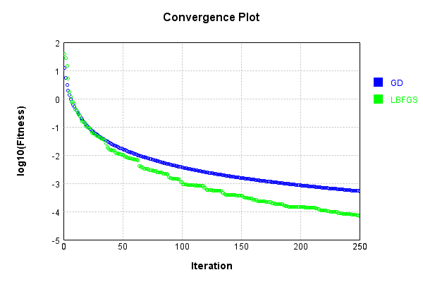
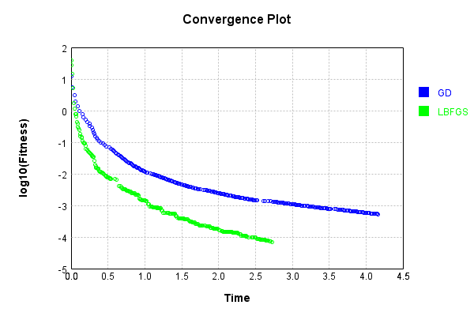
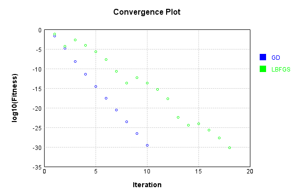
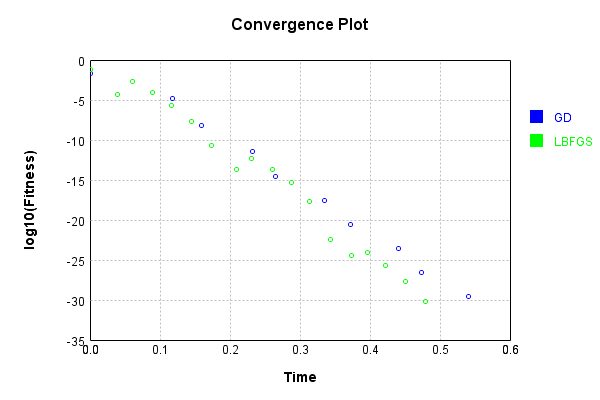
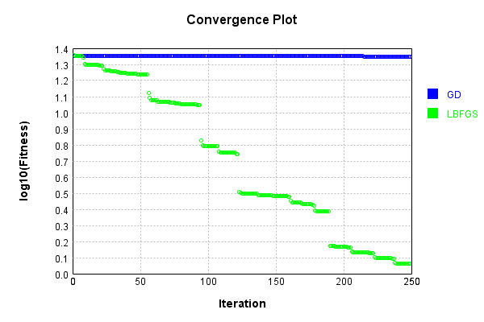
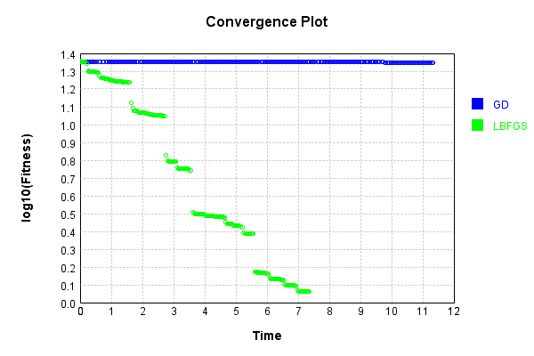

# SimpleConvolutionLayer
## Matrix
### Json Serialization
Code from [JsonTest.java:36](../../../../../../../../src/main/java/com/simiacryptus/mindseye/test/unit/JsonTest.java#L36) executed in 0.00 seconds: 
```java
    JsonObject json = layer.getJson();
    NNLayer echo = NNLayer.fromJson(json);
    if ((echo == null)) throw new AssertionError("Failed to deserialize");
    if ((layer == echo)) throw new AssertionError("Serialization did not copy");
    if ((!layer.equals(echo))) throw new AssertionError("Serialization not equal");
    return new GsonBuilder().setPrettyPrinting().create().toJson(json);
```

Returns: 

```
    {
      "class": "com.simiacryptus.mindseye.layers.cudnn.SimpleConvolutionLayer",
      "id": "675ca4a8-f1dc-4af2-9be7-d85463f3add2",
      "isFrozen": false,
      "name": "SimpleConvolutionLayer/675ca4a8-f1dc-4af2-9be7-d85463f3add2",
      "filter": [
        [
          [
            -1.576,
            1.18,
            -1.76
          ],
          [
            -0.7,
            -1.296,
            1.624
          ],
          [
            0.972,
            1.676,
            1.28
          ]
        ]
      ],
      "strideX": 1,
      "strideY": 1,
      "simple": false,
      "precision": "Double"
    }
```


### Example Input/Output Pair
Code from [ReferenceIO.java:68](../../../../../../../../src/main/java/com/simiacryptus/mindseye/test/unit/ReferenceIO.java#L68) executed in 0.00 seconds: 
```java
    SimpleEval eval = SimpleEval.run(layer, inputPrototype);
    return String.format("--------------------\nInput: \n[%s]\n--------------------\nOutput: \n%s\n--------------------\nDerivative: \n%s",
      Arrays.stream(inputPrototype).map(t -> t.prettyPrint()).reduce((a, b) -> a + ",\n" + b).get(),
      eval.getOutput().prettyPrint(),
      Arrays.stream(eval.getDerivative()).map(t -> t.prettyPrint()).reduce((a, b) -> a + ",\n" + b).get());
```

Returns: 

```
    --------------------
    Input: 
    [[
    	[ [ 0.312 ], [ 1.928 ], [ -1.496 ] ],
    	[ [ -1.804 ], [ -0.804 ], [ -0.512 ] ],
    	[ [ -1.632 ], [ -1.964 ], [ 0.252 ] ]
    ]]
    --------------------
    Output: 
    [
    	[ [ 4.400592 ], [ -4.1248320000000005 ], [ 4.747056 ] ],
    	[ [ 2.7403360000000005 ], [ 2.9690560000000006 ], [ -2.7310240000000006 ] ],
    	[ [ -1.7171040000000004 ], [ -2.606224 ], [ -5.478864 ] ]
    ]
    --------------------
    Derivative: 
    [
    	[ [ 3.284 ], [ 2.7039999999999997 ], [ -0.252 ] ],
    	[ [ 3.556 ], [ 1.3999999999999997 ], [ -2.5280000000000005 ] ],
    	[ [ 0.6519999999999999 ], [ 0.256 ], [ -2.392 ] ]
    ]
```


[GPU Log](etc/cuda.log)

### Batch Execution
Code from [BatchingTester.java:66](../../../../../../../../src/main/java/com/simiacryptus/mindseye/test/unit/BatchingTester.java#L66) executed in 0.01 seconds: 
```java
    return test(reference, inputPrototype);
```

Returns: 

```
    ToleranceStatistics{absoluteTol=2.8372e-17 +- 9.9386e-17 [0.0000e+00 - 4.4409e-16] (180#), relativeTol=2.1949e-17 +- 8.6406e-17 [0.0000e+00 - 4.3368e-16] (180#)}
```


Code from [SingleDerivativeTester.java:77](../../../../../../../../src/main/java/com/simiacryptus/mindseye/test/unit/SingleDerivativeTester.java#L77) executed in 0.03 seconds: 
```java
    return test(component, inputPrototype);
```
Logging: 
```
    Inputs: [
    	[ [ -1.108 ], [ 1.108 ], [ 1.572 ] ],
    	[ [ 1.812 ], [ 1.492 ], [ -1.1 ] ],
    	[ [ 0.556 ], [ -0.392 ], [ -0.556 ] ]
    ]
    Inputs Statistics: {meanExponent=-0.01752362063239414, negative=4, min=-0.556, max=-0.556, mean=0.3760000000000001, count=9.0, positive=5, stdDev=1.112827829350874, zeros=0}
    Output: [
    	[ [ -0.876384 ], [ 1.012448 ], [ 2.03992 ] ],
    	[ [ -4.108672 ], [ -0.8892000000000001 ], [ 7.905536000000001 ] ],
    	[ [ -0.8663679999999997 ], [ 7.462176 ], [ 0.18694399999999992 ] ]
    ]
    Outputs Statistics: {meanExponent=0.20006577464182185, negative=4, min=0.18694399999999992, max=0.18694399999999992, mean=1.318488888888889, count=9.0, positive=5, stdDev=3.7557013080835575, zeros=0}
    Feedback for input 0
    Inputs Values: [
    	[ [ -1.108 ], [ 1.108 ], [ 1.572 ] ],
    	[ [ 1.812 ], [ 1.492 ], [ -1.1 ] ],
    	[ [ 0.556 ], [ -0.392 ], [ -0.556 ] ]
    ]
    Value Statistics: {meanExponent=-0.01752362063239414, negative=4, min=-0.556, max=-0.556, mean=0.3760000000000001, count=9.0, positive=5, stdDev=1.112827829350874, zer
```
...[skipping 6812 bytes](etc/196.txt)...
```
    6534350973634E-12, -4.4497738826976274E-13 ], [ 0.0, 1.4455103780619538E-12, -7.527312106958561E-14, 0.0, 2.9953817204386723E-12, 7.149836278586008E-13, 0.0, 3.015365734881925E-12, -5.448974604860268E-13 ], [ 0.0, 0.0, 0.0, 1.034949903555571E-12, 4.4497738826976274E-13, 0.0, 7.149836278586008E-13, 2.0504709041802016E-12, 0.0 ], [ 0.0, 0.0, 0.0, -7.749356711883593E-13, -7.527312106958561E-14, 4.885869486770389E-12, -1.4455103780619538E-12, 7.149836278586008E-13, -1.6997514507011147E-13 ], [ 0.0, 0.0, 0.0, 0.0, 3.352873534367973E-13, -7.846834293445681E-12, 0.0, -1.4455103780619538E-12, -3.9523939676655573E-13 ] ]
    Error Statistics: {meanExponent=-11.871453931919678, negative=22, min=-3.9523939676655573E-13, max=-3.9523939676655573E-13, mean=-9.888112276852845E-14, count=81.0, positive=27, stdDev=2.2832271039526718E-12, zeros=32}
    Finite-Difference Derivative Accuracy:
    absoluteTol: 1.2333e-12 +- 1.8363e-12 [0.0000e+00 - 7.8468e-12] (162#)
    relativeTol: 1.0341e-12 +- 1.3286e-12 [2.0771e-14 - 8.7134e-12] (98#)
    
```

Returns: 

```
    ToleranceStatistics{absoluteTol=1.2333e-12 +- 1.8363e-12 [0.0000e+00 - 7.8468e-12] (162#), relativeTol=1.0341e-12 +- 1.3286e-12 [2.0771e-14 - 8.7134e-12] (98#)}
```


### Reference Implementation
Code from [EquivalencyTester.java:61](../../../../../../../../src/main/java/com/simiacryptus/mindseye/test/unit/EquivalencyTester.java#L61) executed in 0.00 seconds: 
```java
    System.out.println(new GsonBuilder().setPrettyPrinting().create().toJson(this.reference.getJson()));
```
Logging: 
```
    {
      "class": "com.simiacryptus.mindseye.layers.aparapi.ConvolutionLayer",
      "id": "d39cae97-557f-4f61-8322-3742c3b1c37b",
      "isFrozen": false,
      "name": "ConvolutionLayer/d39cae97-557f-4f61-8322-3742c3b1c37b",
      "filter": [
        [
          [
            -1.576,
            1.18,
            -1.76
          ],
          [
            -0.7,
            -1.296,
            1.624
          ],
          [
            0.972,
            1.676,
            1.28
          ]
        ]
      ],
      "skip": [
        [
          0.0
        ]
      ],
      "simple": true
    }
    
```

Code from [EquivalencyTester.java:64](../../../../../../../../src/main/java/com/simiacryptus/mindseye/test/unit/EquivalencyTester.java#L64) executed in 0.01 seconds: 
```java
    return test(subject, inputPrototype);
```
Logging: 
```
    Inputs: [
    	[ [ -1.612 ], [ -0.664 ], [ 0.296 ] ],
    	[ [ -1.012 ], [ -0.036 ], [ 0.764 ] ],
    	[ [ -0.288 ], [ 1.424 ], [ -0.656 ] ]
    ]
    Error: [
    	[ [ 0.0 ], [ 0.0 ], [ 0.0 ] ],
    	[ [ 0.0 ], [ 0.0 ], [ 0.0 ] ],
    	[ [ 0.0 ], [ 0.0 ], [ 0.0 ] ]
    ]
    Accuracy:
    absoluteTol: 0.0000e+00 +- 0.0000e+00 [0.0000e+00 - 0.0000e+00] (9#)
    relativeTol: 0.0000e+00 +- 0.0000e+00 [0.0000e+00 - 0.0000e+00] (9#)
    
```

Returns: 

```
    ToleranceStatistics{absoluteTol=0.0000e+00 +- 0.0000e+00 [0.0000e+00 - 0.0000e+00] (9#), relativeTol=0.0000e+00 +- 0.0000e+00 [0.0000e+00 - 0.0000e+00] (9#)}
```


### Performance
Now we execute larger-scale runs to benchmark performance:

Code from [PerformanceTester.java:66](../../../../../../../../src/main/java/com/simiacryptus/mindseye/test/unit/PerformanceTester.java#L66) executed in 0.44 seconds: 
```java
    test(component, inputPrototype);
```
Logging: 
```
    100 batches
    Input Dimensions:
    	[100, 100, 1]
    Performance:
    	Evaluation performance: 0.013955s +- 0.003174s [0.009603s - 0.017195s]
    	Learning performance: 0.056823s +- 0.021830s [0.037856s - 0.092401s]
    
```

### Input Learning
In this test, we use a network to learn this target input, given it's pre-evaluated output:

Code from [LearningTester.java:127](../../../../../../../../src/main/java/com/simiacryptus/mindseye/test/unit/LearningTester.java#L127) executed in 0.01 seconds: 
```java
    return Arrays.stream(input_target).map(x -> x.prettyPrint()).reduce((a, b) -> a + "\n" + b).orElse("");
```

Returns: 

```
    [
    	[ [ -1.252 ], [ 1.436 ], [ -0.036 ], [ -1.576 ], [ 0.292 ], [ -0.9 ], [ 1.832 ], [ -2.0 ], ... ],
    	[ [ -0.744 ], [ -1.072 ], [ 0.848 ], [ -1.112 ], [ -1.708 ], [ -1.296 ], [ 1.1 ], [ 1.592 ], ... ],
    	[ [ -0.996 ], [ -0.58 ], [ -0.384 ], [ 0.036 ], [ -0.068 ], [ -0.932 ], [ 0.304 ], [ -0.976 ], ... ],
    	[ [ 0.016 ], [ 0.964 ], [ -1.82 ], [ -1.476 ], [ -0.124 ], [ -0.456 ], [ -1.812 ], [ 1.832 ], ... ],
    	[ [ 0.024 ], [ 0.852 ], [ -0.456 ], [ -0.728 ], [ 1.628 ], [ -0.876 ], [ 0.352 ], [ 0.42 ], ... ],
    	[ [ 0.3 ], [ 0.112 ], [ -1.868 ], [ -1.592 ], [ -1.232 ], [ -0.196 ], [ 0.1 ], [ -1.896 ], ... ],
    	[ [ 0.188 ], [ -1.944 ], [ 1.952 ], [ -1.944 ], [ 0.732 ], [ 1.928 ], [ -1.368 ], [ -0.404 ], ... ],
    	[ [ -1.916 ], [ 1.012 ], [ 0.128 ], [ -1.228 ], [ 0.888 ], [ -0.948 ], [ 0.404 ], [ 0.384 ], ... ],
    	...
    ]
```


First, we use a conjugate gradient descent method, which converges the fastest for purely linear functions.

Code from [LearningTester.java:300](../../../../../../../../src/main/java/com/simiacryptus/mindseye/test/unit/LearningTester.java#L300) executed in 4.24 seconds: 
```java
    return new IterativeTrainer(trainable)
      .setLineSearchFactory(label -> new QuadraticSearch())
      .setOrientation(new GradientDescent())
      .setMonitor(monitor)
      .setTimeout(30, TimeUnit.SECONDS)
      .setMaxIterations(250)
      .setTerminateThreshold(0)
      .run();
```
Logging: 
```
    Constructing line search parameters: GD
    F(0.0) = LineSearchPoint{point=PointSample{avg=45.42985724669291}, derivative=-0.5617890956895387}
    New Minimum: 45.42985724669291 > 45.429857246636665
    F(1.0E-10) = LineSearchPoint{point=PointSample{avg=45.429857246636665}, derivative=-0.5617890956890602}, delta = -5.624656296276953E-11
    New Minimum: 45.429857246636665 > 45.42985724629948
    F(7.000000000000001E-10) = LineSearchPoint{point=PointSample{avg=45.42985724629948}, derivative=-0.561789095686189}, delta = -3.9343461821772507E-10
    New Minimum: 45.42985724629948 > 45.42985724394025
    F(4.900000000000001E-9) = LineSearchPoint{point=PointSample{avg=45.42985724394025}, derivative=-0.5617890956660903}, delta = -2.752663874616701E-9
    New Minimum: 45.42985724394025 > 45.4298572274236
    F(3.430000000000001E-8) = LineSearchPoint{point=PointSample{avg=45.4298572274236}, derivative=-0.5617890955253995}, delta = -1.926931503248852E-8
    New Minimum: 45.4298572274236 > 45.42985711180732
    F(2.4010000000000004E-7) = LineSearchPoin
```
...[skipping 286815 bytes](etc/197.txt)...
```
    .301339508499797E-4}, derivative=-7.773248607471122E-8}, delta = -2.3598650920404925E-6
    F(174.61432628704415) = LineSearchPoint{point=PointSample{avg=5.336498600441746E-4}, derivative=1.24714817331425E-7}, delta = 1.156044102154424E-6
    F(13.43187125284955) = LineSearchPoint{point=PointSample{avg=5.311185329649704E-4}, derivative=-9.330535556749123E-8}, delta = -1.3752829770498527E-6
    New Minimum: 5.301339508499797E-4 > 5.27991568165219E-4
    F(94.02309876994686) = LineSearchPoint{point=PointSample{avg=5.27991568165219E-4}, derivative=1.570473088196682E-8}, delta = -4.502247776801225E-6
    5.27991568165219E-4 <= 5.324938159420202E-4
    New Minimum: 5.27991568165219E-4 > 5.279003981371784E-4
    F(82.41258105707266) = LineSearchPoint{point=PointSample{avg=5.279003981371784E-4}, derivative=6.776721596986861E-22}, delta = -4.593417804841832E-6
    Right bracket at 82.41258105707266
    Converged to right
    Iteration 250 complete. Error: 5.279003981371784E-4 Total: 249703843352160.2000; Orientation: 0.0003; Line Search: 0.0160
    
```

Returns: 

```
    5.279003981371784E-4
```


This training run resulted in the following regressed input:

Code from [LearningTester.java:144](../../../../../../../../src/main/java/com/simiacryptus/mindseye/test/unit/LearningTester.java#L144) executed in 0.00 seconds: 
```java
    return Arrays.stream(input_gd).map(x -> x.prettyPrint()).reduce((a, b) -> a + "\n" + b).orElse("");
```

Returns: 

```
    [
    	[ [ -1.1349266452933393 ], [ 1.5639745578668496 ], [ 0.13743618425708454 ], [ -1.6150657827839616 ], [ 0.03922433903755261 ], [ -1.1846625465575629 ], [ 1.8113713746190674 ], [ -1.7340069833386738 ], ... ],
    	[ [ -0.8042343188868633 ], [ -1.1302136819804796 ], [ 0.9117847178523129 ], [ -0.8435776696790572 ], [ -1.449539862365535 ], [ -1.2853434455443182 ], [ 0.8299645778436411 ], [ 1.2883988061058702 ], ... ],
    	[ [ -1.0278084973849797 ], [ -0.5028140848397121 ], [ -0.5574364311752109 ], [ -0.14413220411117206 ], [ -0.10725512766690327 ], [ -0.7045286443019994 ], [ 0.553324908355596 ], [ -0.9356379976637053 ], ... ],
    	[ [ -0.11526165090585813 ], [ 0.999474490557792 ], [ -1.610168691212544 ], [ -1.3692445499546873 ], [ -0.23367974220643142 ], [ -0.6323205812549816 ], [ -1.8447829561075035 ], [ 2.060552425089075 ], ... ],
    	[ [ 0.13999949293716712 ], [ 0.5055813716165234 ], [ -0.6299812952933302 ], [ -0.7374902917953722 ], [ 1.8055044967035185 ], [ -0.8287882250314883 ], [ 0.2146872088343531 ], [ 0.19267023879204004 ], ... ],
    	[ [ 0.6942805973834392 ], [ 0.4456272211749424 ], [ -1.8623649410092373 ], [ -1.8001266129178424 ], [ -1.338191143953984 ], [ -0.12609963520142362 ], [ 0.3125377966117263 ], [ -1.7682990745582108 ], ... ],
    	[ [ -0.32257354996865845 ], [ -1.7664027760259557 ], [ 2.1764271236098445 ], [ -1.7551796439251892 ], [ 0.6083067361263429 ], [ 1.6897498319018533 ], [ -1.5459695847858848 ], [ -0.45276213823242445 ], ... ],
    	[ [ -2.2220305221618943 ], [ 0.6228637502063029 ], [ -0.03964027580168653 ], [ -1.0229672152009488 ], [ 1.1511230734506197 ], [ -0.7579351945640372 ], [ 0.39080016860665434 ], [ 0.30816731140432163 ], ... ],
    	...
    ]
```


Next, we run the same optimization using L-BFGS, which is nearly ideal for purely second-order or quadratic functions.

Code from [LearningTester.java:324](../../../../../../../../src/main/java/com/simiacryptus/mindseye/test/unit/LearningTester.java#L324) executed in 2.75 seconds: 
```java
    return new IterativeTrainer(trainable)
      .setLineSearchFactory(label -> new ArmijoWolfeSearch())
      .setOrientation(new LBFGS())
      .setMonitor(monitor)
      .setTimeout(30, TimeUnit.SECONDS)
      .setMaxIterations(250)
      .setTerminateThreshold(0)
      .run();
```
Logging: 
```
    LBFGS Accumulation History: 1 points
    Constructing line search parameters: GD
    th(0)=45.42985724669291;dx=-0.5617890956895387
    New Minimum: 45.42985724669291 > 44.2306252613539
    WOLFE (weak): th(2.154434690031884)=44.2306252613539; dx=-0.5514792627226621 delta=1.1992319853390114
    New Minimum: 44.2306252613539 > 43.0536051378072
    WOLFE (weak): th(4.308869380063768)=43.0536051378072; dx=-0.5411694297557854 delta=2.3762521088857085
    New Minimum: 43.0536051378072 > 38.56764326154284
    END: th(12.926608140191302)=38.56764326154284; dx=-0.4999300978882789 delta=6.8622139851500705
    Iteration 1 complete. Error: 38.56764326154284 Total: 249703881449496.1600; Orientation: 0.0005; Line Search: 0.0103
    LBFGS Accumulation History: 1 points
    th(0)=38.56764326154284;dx=-0.44637843939481975
    New Minimum: 38.56764326154284 > 27.531059709344024
    END: th(27.849533001676672)=27.531059709344024; dx=-0.3462081760815922 delta=11.036583552198817
    Iteration 2 complete. Error: 27.531059709344024 Total: 249703889642625.1200; Orientation
```
...[skipping 145121 bytes](etc/198.txt)...
```
    603969913243486E-7
    Iteration 249 complete. Error: 7.234216399722995E-5 Total: 249706589396800.4400; Orientation: 0.0005; Line Search: 0.0129
    LBFGS Accumulation History: 1 points
    th(0)=7.234216399722995E-5;dx=-1.431057401778595E-9
    New Minimum: 7.234216399722995E-5 > 7.214503014624276E-5
    WOLFE (weak): th(138.888888888889)=7.214503014624276E-5; dx=-1.4076700524258335E-9 delta=1.971338509871906E-7
    New Minimum: 7.214503014624276E-5 > 7.19511445382222E-5
    WOLFE (weak): th(277.777777777778)=7.19511445382222E-5; dx=-1.3842827030730694E-9 delta=3.910194590077458E-7
    New Minimum: 7.19511445382222E-5 > 7.120808453579607E-5
    WOLFE (weak): th(833.3333333333339)=7.120808453579607E-5; dx=-1.2907333056620138E-9 delta=1.134079461433872E-6
    New Minimum: 7.120808453579607E-5 > 6.850746663207784E-5
    END: th(3333.3333333333358)=6.850746663207784E-5; dx=-8.697610173122356E-10 delta=3.834697365152106E-6
    Iteration 250 complete. Error: 6.850746663207784E-5 Total: 249706602901641.4000; Orientation: 0.0006; Line Search: 0.0107
    
```

Returns: 

```
    6.850746663207784E-5
```


This training run resulted in the following regressed input:

Code from [LearningTester.java:154](../../../../../../../../src/main/java/com/simiacryptus/mindseye/test/unit/LearningTester.java#L154) executed in 0.00 seconds: 
```java
    return Arrays.stream(input_lbgfs).map(x -> x.prettyPrint()).reduce((a, b) -> a + "\n" + b).orElse("");
```

Returns: 

```
    [
    	[ [ -1.2174195563234989 ], [ 1.4366767612160845 ], [ 0.06023626886259881 ], [ -1.6258703598825017 ], [ 0.09757907843112731 ], [ -1.0870387148852043 ], [ 1.890646569597233 ], [ -1.6881525367055645 ], ... ],
    	[ [ -0.708102496341949 ], [ -1.1171361890914469 ], [ 0.8684173398822278 ], [ -0.956492356566101 ], [ -1.5521192032363926 ], [ -1.3486330369560033 ], [ 0.8315802231155354 ], [ 1.3442449119648059 ], ... ],
    	[ [ -1.0134617777899133 ], [ -0.4558158648255285 ], [ -0.5049858124920218 ], [ -0.1261732360431591 ], [ -0.10863618842440781 ], [ -0.7477862539644166 ], [ 0.5209553596795827 ], [ -0.9564187477560036 ], ... ],
    	[ [ -0.19177875235380346 ], [ 1.0001013730081607 ], [ -1.6155656210364464 ], [ -1.3599390597438816 ], [ -0.25013275943738794 ], [ -0.6756399933435734 ], [ -1.8886588247882843 ], [ 2.001237433249508 ], ... ],
    	[ [ 0.12448696903143698 ], [ 0.4973221159806119 ], [ -0.6370818983347516 ], [ -0.6829291072647292 ], [ 1.846517580892075 ], [ -0.7868202251888256 ], [ 0.2157643836637041 ], [ 0.16483403505591232 ], ... ],
    	[ [ 0.7556874015528822 ], [ 0.4182701189332591 ], [ -1.904713205992421 ], [ -1.8429814259975623 ], [ -1.3652679703379382 ], [ -0.10201340817788193 ], [ 0.3184509910381858 ], [ -1.759978936660748 ], ... ],
    	[ [ -0.2757785500299404 ], [ -1.72892838442923 ], [ 2.2464887039516523 ], [ -1.7487893014247025 ], [ 0.6127578149330132 ], [ 1.6966612561650904 ], [ -1.5261726811752327 ], [ -0.40733601472893993 ], ... ],
    	[ [ -2.2936436972213947 ], [ 0.5915480407519185 ], [ -0.03731129030169589 ], [ -1.0278860852388094 ], [ 1.1686762122489507 ], [ -0.7898574540300282 ], [ 0.3754611720052027 ], [ 0.31478895953286706 ], ... ],
    	...
    ]
```


Code from [LearningTester.java:96](../../../../../../../../src/main/java/com/simiacryptus/mindseye/test/unit/LearningTester.java#L96) executed in 0.00 seconds: 
```java
    return TestUtil.compare(runs);
```

Returns: 




Code from [LearningTester.java:99](../../../../../../../../src/main/java/com/simiacryptus/mindseye/test/unit/LearningTester.java#L99) executed in 0.00 seconds: 
```java
    return TestUtil.compareTime(runs);
```

Returns: 




### Model Learning
In this test, attempt to train a network to emulate a randomized network given an example input/output. The target state is:

Code from [LearningTester.java:176](../../../../../../../../src/main/java/com/simiacryptus/mindseye/test/unit/LearningTester.java#L176) executed in 0.00 seconds: 
```java
    return network_target.state().stream().map(Arrays::toString).reduce((a, b) -> a + "\n" + b).orElse("");
```

Returns: 

```
    [-1.576, -1.296, 1.676, 1.624, 0.972, -0.7, 1.18, 1.28, -1.76]
```


First, we use a conjugate gradient descent method, which converges the fastest for purely linear functions.

Code from [LearningTester.java:300](../../../../../../../../src/main/java/com/simiacryptus/mindseye/test/unit/LearningTester.java#L300) executed in 0.77 seconds: 
```java
    return new IterativeTrainer(trainable)
      .setLineSearchFactory(label -> new QuadraticSearch())
      .setOrientation(new GradientDescent())
      .setMonitor(monitor)
      .setTimeout(30, TimeUnit.SECONDS)
      .setMaxIterations(250)
      .setTerminateThreshold(0)
      .run();
```
Logging: 
```
    Constructing line search parameters: GD
    F(0.0) = LineSearchPoint{point=PointSample{avg=34.956111444107975}, derivative=-185.88332831925516}
    New Minimum: 34.956111444107975 > 34.95611142551955
    F(1.0E-10) = LineSearchPoint{point=PointSample{avg=34.95611142551955}, derivative=-185.88332826980488}, delta = -1.858842324509169E-8
    New Minimum: 34.95611142551955 > 34.956111313989744
    F(7.000000000000001E-10) = LineSearchPoint{point=PointSample{avg=34.956111313989744}, derivative=-185.8833279731026}, delta = -1.30118230856624E-7
    New Minimum: 34.956111313989744 > 34.95611053327981
    F(4.900000000000001E-9) = LineSearchPoint{point=PointSample{avg=34.95611053327981}, derivative=-185.88332589618554}, delta = -9.108281631142745E-7
    New Minimum: 34.95611053327981 > 34.95610506831019
    F(3.430000000000001E-8) = LineSearchPoint{point=PointSample{avg=34.95610506831019}, derivative=-185.88331135776792}, delta = -6.375797788393811E-6
    New Minimum: 34.95610506831019 > 34.956066813535315
    F(2.4010000000000004E-7) = LineSearchPo
```
...[skipping 12888 bytes](etc/199.txt)...
```
    t=PointSample{avg=2.6778987754691173E-27}, derivative=1.4168769797538474E-26}, delta = -5.312514877097062E-29
    2.6778987754691173E-27 <= 2.731023924240088E-27
    New Minimum: 4.127798001081114E-30 > 3.1473864267443432E-30
    F(0.38128114644980315) = LineSearchPoint{point=PointSample{avg=3.1473864267443432E-30}, derivative=-1.8204883768864172E-29}, delta = -2.7278765378133437E-27
    Left bracket at 0.38128114644980315
    Converged to left
    Iteration 10 complete. Error: 3.1473864267443432E-30 Total: 249707471251598.6000; Orientation: 0.0000; Line Search: 0.0599
    Zero gradient: 3.791218245389802E-15
    F(0.0) = LineSearchPoint{point=PointSample{avg=3.1473864267443432E-30}, derivative=-1.4373335784176527E-29}
    New Minimum: 3.1473864267443432E-30 > 0.0
    F(0.38128114644980315) = LineSearchPoint{point=PointSample{avg=0.0}, derivative=0.0}, delta = -3.1473864267443432E-30
    0.0 <= 3.1473864267443432E-30
    Converged to right
    Iteration 11 complete. Error: 0.0 Total: 249707495005686.5300; Orientation: 0.0001; Line Search: 0.0150
    
```

Returns: 

```
    0.0
```


Training Converged

Next, we run the same optimization using L-BFGS, which is nearly ideal for purely second-order or quadratic functions.

Code from [LearningTester.java:324](../../../../../../../../src/main/java/com/simiacryptus/mindseye/test/unit/LearningTester.java#L324) executed in 0.55 seconds: 
```java
    return new IterativeTrainer(trainable)
      .setLineSearchFactory(label -> new ArmijoWolfeSearch())
      .setOrientation(new LBFGS())
      .setMonitor(monitor)
      .setTimeout(30, TimeUnit.SECONDS)
      .setMaxIterations(250)
      .setTerminateThreshold(0)
      .run();
```
Logging: 
```
    LBFGS Accumulation History: 1 points
    Constructing line search parameters: GD
    th(0)=37.30898080487429;dx=-199.50597377188086
    Armijo: th(2.154434690031884)=845.779495212419; dx=950.0235161677264 delta=-808.4705144075447
    Armijo: th(1.077217345015942)=131.97096171607626; dx=375.2587711979212 delta=-94.66198091120197
    New Minimum: 37.30898080487429 > 0.06891304359315223
    END: th(0.3590724483386473)=0.06891304359315223; dx=-7.917725448613401 delta=37.24006776128114
    Iteration 1 complete. Error: 0.06891304359315223 Total: 249707541023997.5000; Orientation: 0.0001; Line Search: 0.0283
    LBFGS Accumulation History: 1 points
    th(0)=0.06891304359315223;dx=-0.3639579901470018
    Armijo: th(0.7735981389354633)=0.07502705766516957; dx=0.37976468296152105 delta=-0.0061140140720173375
    New Minimum: 0.06891304359315223 > 5.224115405335788E-5
    WOLF (strong): th(0.3867990694677316)=5.224115405335788E-5; dx=0.007903346407258769 delta=0.06886080243909887
    END: th(0.12893302315591054)=0.0299777073412063; dx=-0.24000421129558214 d
```
...[skipping 8121 bytes](etc/200.txt)...
```
    : 1 points
    th(0)=1.975579165430342E-28;dx=-1.013613782262369E-27
    New Minimum: 1.975579165430342E-28 > 1.7331868982749653E-28
    WOLF (strong): th(0.7535204475308646)=1.7331868982749653E-28; dx=9.490940451877874E-28 delta=2.4239226715537674E-29
    New Minimum: 1.7331868982749653E-28 > 6.425073702240869E-31
    END: th(0.3767602237654323)=6.425073702240869E-31; dx=-3.7295124996532553E-29 delta=1.969154091728101E-28
    Iteration 18 complete. Error: 6.425073702240869E-31 Total: 249708020826723.0000; Orientation: 0.0001; Line Search: 0.0229
    LBFGS Accumulation History: 1 points
    th(0)=6.425073702240869E-31;dx=-1.6372754092486147E-30
    New Minimum: 6.425073702240869E-31 > 6.285978612018351E-31
    WOLF (strong): th(0.8117052959044223)=6.285978612018351E-31; dx=1.6119710017157913E-30 delta=1.3909509022251808E-32
    New Minimum: 6.285978612018351E-31 > 0.0
    END: th(0.40585264795221115)=0.0; dx=0.0 delta=6.425073702240869E-31
    Iteration 19 complete. Error: 0.0 Total: 249708047350801.9700; Orientation: 0.0001; Line Search: 0.0215
    
```

Returns: 

```
    0.0
```


Training Converged

Code from [LearningTester.java:96](../../../../../../../../src/main/java/com/simiacryptus/mindseye/test/unit/LearningTester.java#L96) executed in 0.00 seconds: 
```java
    return TestUtil.compare(runs);
```

Returns: 




Code from [LearningTester.java:99](../../../../../../../../src/main/java/com/simiacryptus/mindseye/test/unit/LearningTester.java#L99) executed in 0.00 seconds: 
```java
    return TestUtil.compareTime(runs);
```

Returns: 




### Composite Learning
In this test, attempt to train a network to emulate a randomized network given an example input/output. The target state is:

Code from [LearningTester.java:219](../../../../../../../../src/main/java/com/simiacryptus/mindseye/test/unit/LearningTester.java#L219) executed in 0.00 seconds: 
```java
    return network_target.state().stream().map(Arrays::toString).reduce((a, b) -> a + "\n" + b).orElse("");
```

Returns: 

```
    [1.18, -0.7, 1.624, 0.972, -1.296, 1.676, 1.28, -1.576, -1.76]
```


We simultaneously regress this target input:

Code from [LearningTester.java:223](../../../../../../../../src/main/java/com/simiacryptus/mindseye/test/unit/LearningTester.java#L223) executed in 0.00 seconds: 
```java
    return Arrays.stream(testInput).map(x -> x.prettyPrint()).reduce((a, b) -> a + "\n" + b).orElse("");
```

Returns: 

```
    [
    	[ [ -0.024 ], [ 0.556 ], [ 1.112 ], [ 0.332 ], [ 1.668 ], [ 0.948 ], [ 1.836 ], [ -0.056 ], ... ],
    	[ [ 0.296 ], [ -0.54 ], [ 1.196 ], [ -0.676 ], [ 1.032 ], [ -1.236 ], [ 0.232 ], [ -1.916 ], ... ],
    	[ [ 1.772 ], [ 1.204 ], [ 0.436 ], [ -0.748 ], [ 1.824 ], [ 0.644 ], [ 1.82 ], [ -1.388 ], ... ],
    	[ [ 1.156 ], [ -1.972 ], [ -0.02 ], [ -0.272 ], [ -0.516 ], [ 1.916 ], [ 0.12 ], [ -1.724 ], ... ],
    	[ [ -1.264 ], [ -1.244 ], [ 1.372 ], [ -0.896 ], [ -0.216 ], [ 1.42 ], [ 0.488 ], [ -0.364 ], ... ],
    	[ [ 0.792 ], [ -1.896 ], [ -1.688 ], [ 0.352 ], [ -1.4 ], [ 0.216 ], [ 0.248 ], [ 1.172 ], ... ],
    	[ [ -0.276 ], [ 1.672 ], [ 0.016 ], [ -1.944 ], [ -0.508 ], [ -1.772 ], [ 0.988 ], [ 1.276 ], ... ],
    	[ [ -1.332 ], [ -0.672 ], [ -1.644 ], [ 0.916 ], [ -0.7 ], [ 1.3 ], [ 0.068 ], [ -1.92 ], ... ],
    	...
    ]
```


Which produces the following output:

Code from [LearningTester.java:230](../../../../../../../../src/main/java/com/simiacryptus/mindseye/test/unit/LearningTester.java#L230) executed in 0.00 seconds: 
```java
    return Stream.of(targetOutput).map(x -> x.prettyPrint()).reduce((a, b) -> a + "\n" + b).orElse("");
```

Returns: 

```
    [
    	[ [ -0.707584 ], [ -0.19587200000000024 ], [ -2.8761760000000005 ], [ -1.2588160000000002 ], [ -4.6692160000000005 ], [ -4.749248 ], [ -7.45176 ], [ -4.693872 ], ... ],
    	[ [ 4.000208 ], [ 6.129055999999999 ], [ 2.2808160000000006 ], [ 1.5602880000000008 ], [ 5.919312 ], [ 6.5561440000000015 ], [ 5.261696000000001 ], [ -1.590112 ], ... ],
    	[ [ -4.723504 ], [ -4.602656 ], [ -2.946448 ], [ -3.4553599999999998 ], [ 0.6874399999999996 ], [ -7.150864 ], [ -2.4146560000000004 ], [ -3.5559520000000004 ], ... ],
    	[ [ 2.110864 ], [ -0.8530239999999994 ], [ -0.5948799999999995 ], [ 2.316768 ], [ 5.4943360000000006 ], [ 0.7504640000000006 ], [ -0.44315200000000016 ], [ -5.576112 ], ... ],
    	[ [ -0.2235840000000005 ], [ -5.549215999999999 ], [ 0.15284800000000004 ], [ -5.579008000000001 ], [ 2.768160000000001 ], [ 1.183344 ], [ -6.685888 ], [ -1.2554400000000001 ], ... ],
    	[ [ -2.1332640000000005 ], [ 6.049232 ], [ 7.824944 ], [ -3.5516320000000006 ], [ -0.44358399999999965 ], [ 4.098672 ], [ -3.556816 ], [ 2.6722720000000004 ], ... ],
    	[ [ -4.652080000000001 ], [ -13.354128 ], [ -1.592736 ], [ 2.097072 ], [ 4.373456000000001 ], [ 6.082128 ], [ 2.0223360000000006 ], [ -5.209264000000001 ], ... ],
    	[ [ 7.227151999999999 ], [ 9.742896 ], [ -2.3116960000000004 ], [ -1.079776 ], [ 0.08737599999999934 ], [ 2.4707040000000005 ], [ 6.411311999999999 ], [ 6.425104000000001 ], ... ],
    	...
    ]
```


First, we use a conjugate gradient descent method, which converges the fastest for purely linear functions.

Code from [LearningTester.java:300](../../../../../../../../src/main/java/com/simiacryptus/mindseye/test/unit/LearningTester.java#L300) executed in 11.51 seconds: 
```java
    return new IterativeTrainer(trainable)
      .setLineSearchFactory(label -> new QuadraticSearch())
      .setOrientation(new GradientDescent())
      .setMonitor(monitor)
      .setTimeout(30, TimeUnit.SECONDS)
      .setMaxIterations(250)
      .setTerminateThreshold(0)
      .run();
```
Logging: 
```
    Constructing line search parameters: GD
    F(0.0) = LineSearchPoint{point=PointSample{avg=46.06285305598761}, derivative=-127.19801206674576}
    New Minimum: 46.06285305598761 > 46.06285304326796
    F(1.0E-10) = LineSearchPoint{point=PointSample{avg=46.06285304326796}, derivative=-127.1980120320748}, delta = -1.2719652886516997E-8
    New Minimum: 46.06285304326796 > 46.062852966948945
    F(7.000000000000001E-10) = LineSearchPoint{point=PointSample{avg=46.062852966948945}, derivative=-127.19801182404906}, delta = -8.903866444143205E-8
    New Minimum: 46.062852966948945 > 46.06285243271729
    F(4.900000000000001E-9) = LineSearchPoint{point=PointSample{avg=46.06285243271729}, derivative=-127.19801036786994}, delta = -6.232703171349385E-7
    New Minimum: 46.06285243271729 > 46.06284869309609
    F(3.430000000000001E-8) = LineSearchPoint{point=PointSample{avg=46.06284869309609}, derivative=-127.1980001746155}, delta = -4.362891516507261E-6
    New Minimum: 46.06284869309609 > 46.06282251575498
    F(2.4010000000000004E-7) = LineSearchPoin
```
...[skipping 281005 bytes](etc/201.txt)...
```
     complete. Error: 22.21108852139346 Total: 249719638161719.4000; Orientation: 0.0003; Line Search: 0.0462
    F(0.0) = LineSearchPoint{point=PointSample{avg=22.21108852139346}, derivative=-0.005999946839280093}
    New Minimum: 22.21108852139346 > 22.208829283686274
    F(0.4129551466054353) = LineSearchPoint{point=PointSample{avg=22.208829283686274}, derivative=-0.004941801584803833}, delta = -0.002259237707185946
    New Minimum: 22.208829283686274 > 22.2044568802107
    F(2.890686026238047) = LineSearchPoint{point=PointSample{avg=22.2044568802107}, derivative=0.0014146437509827128}, delta = -0.006631641182760717
    22.2044568802107 <= 22.21108852139346
    New Minimum: 22.2044568802107 > 22.204067193644224
    F(2.339166576406123) = LineSearchPoint{point=PointSample{avg=22.204067193644224}, derivative=-1.3931074287478959E-6}, delta = -0.007021327749235695
    Left bracket at 2.339166576406123
    Converged to left
    Iteration 250 complete. Error: 22.204067193644224 Total: 249719672142257.3800; Orientation: 0.0003; Line Search: 0.0283
    
```

Returns: 

```
    22.204067193644224
```


This training run resulted in the following configuration:

Code from [LearningTester.java:245](../../../../../../../../src/main/java/com/simiacryptus/mindseye/test/unit/LearningTester.java#L245) executed in 0.00 seconds: 
```java
    return network_gd.state().stream().map(Arrays::toString).reduce((a, b) -> a + "\n" + b).orElse("");
```

Returns: 

```
    [-0.1317693651110021, 0.08863956372125037, -0.23478291923746403, -0.21219072020822324, 0.17126014863001493, -0.1900645682534457, -0.08725825100405263, 0.28459193003375904, -0.258323607504153]
    [-0.707584, 4.000208, -4.723504, 2.110864, -0.2235840000000005, -2.1332640000000005, -4.652080000000001, 7.227151999999999, -3.9056, 2.535888, 5.5706880000000005, -2.6984320000000004, 2.2316000000000003, 0.02016000000000057, -5.682176000000001, -2.1271519999999997, -2.8454560000000004, -5.10264, -2.746032, -4.307488, -3.3802399999999997, 2.6094720000000002, -6.203504, -0.4186079999999994, 1.0776799999999997, -9.847088, 5.621376, -3.910815999999999, 0.8738880000000001, 2.447424, -2.806912, 1.744992, -1.268608, -0.6702400000000005, -2.5923679999999996, 0.9870079999999999, -3.4619999999999993, -0.22928000000000007, 1.1388319999999994, 1.9367039999999998, -0.09331200000000044, -0.5061439999999999, 2.49792, -2.44512, -1.820208, 1.8340799999999997, 2.7440000000000007, 0.24195199999999953, -0.47777600000000037, 3.512352, 2.4085
```
...[skipping 161752 bytes](etc/202.txt)...
```
    344160000000002, 12.333103999999999, -3.880560000000001, -0.564944, 6.092288000000001, -5.150576, 3.466688000000001, 2.2514720000000006, 2.5108800000000002, 4.406624, -3.1636800000000003, 2.9356959999999996, -6.611712, 1.31944, 0.6614880000000004, 3.1329439999999997, 3.624416, 4.390912000000001, -5.464832, -3.6751199999999993, 5.388672000000001, -9.286544000000001, -1.1607040000000004, -5.077824000000001, 6.523104000000001, -1.4172159999999991, 3.1236639999999998, -2.415472, 6.267168, 3.381072, -8.307072, 2.0121119999999997, -4.804304, 5.848192000000001, -0.5840640000000004, -6.6584639999999995, 3.282048, 0.9978720000000001, -1.4887999999999995, 6.317279999999999, -10.570704000000001, 2.0143199999999997, -2.437008, -4.065136, 6.107888, -1.8972959999999999, -0.8463839999999997, 0.13591999999999999, -0.9452479999999998, -0.9170399999999997, 2.2166399999999995, 1.3509279999999997, -1.411728, -1.9060000000000001, -6.7969919999999995, 0.6798880000000003, 0.8691999999999998, -0.3391839999999999, 0.3736319999999999]
```


And regressed input:

Code from [LearningTester.java:249](../../../../../../../../src/main/java/com/simiacryptus/mindseye/test/unit/LearningTester.java#L249) executed in 0.00 seconds: 
```java
    return Arrays.stream(input_gd).map(x -> x.prettyPrint()).reduce((a, b) -> a + "\n" + b).orElse("");
```

Returns: 

```
    [
    	[ [ -1.3387573954292473 ], [ 1.6187550507002026 ], [ 0.45839312441889973 ], [ 0.5471743005654067 ], [ 0.07384886266741496 ], [ 1.1359415949210394 ], [ 0.23686302877927787 ], [ -0.581465754278022 ], ... ],
    	[ [ -1.647672561881371 ], [ 1.8139940603089018 ], [ -0.18834461213028555 ], [ 1.4903747121437965 ], [ 1.9532492920406368 ], [ -1.6709441304647297 ], [ -1.344030332917502 ], [ 1.451286165631628 ], ... ],
    	[ [ 1.1508322583717525 ], [ -2.0014987327979985 ], [ -1.0705236223586774 ], [ -0.04998629126038497 ], [ -0.7115175684510214 ], [ 0.8320173343262425 ], [ 0.9213697986373482 ], [ -1.5738031995582025 ], ... ],
    	[ [ -0.024584786708236283 ], [ 0.4584669290391301 ], [ -1.5681662433125862 ], [ -1.46759204671486 ], [ -1.0530260352120335 ], [ 1.1860317014456514 ], [ 0.7267547867013427 ], [ -0.8529344745335069 ], ... ],
    	[ [ -1.805220418079156 ], [ -0.7964732791127396 ], [ 0.33561873950027393 ], [ 0.7408677681957656 ], [ 1.793785103678385 ], [ -0.6281447632179137 ], [ -1.739336303406556 ], [ -1.1207278603700348 ], ... ],
    	[ [ 1.9475373831940157 ], [ -1.4633620804810188 ], [ -0.6485718248691612 ], [ -1.1298866678225556 ], [ -1.4003505597224433 ], [ -1.951025728043608 ], [ 0.9567312397152272 ], [ -0.5918390158451643 ], ... ],
    	[ [ -1.6296495785105853 ], [ 1.763748932127356 ], [ 0.8840668929865753 ], [ 1.2387111760724696 ], [ -1.3769324092559738 ], [ 0.5208175142605095 ], [ 0.198331538047276 ], [ -1.6520398577633826 ], ... ],
    	[ [ 0.1715485178997392 ], [ -1.1503596301588508 ], [ 1.473872147647082 ], [ 0.727756414684434 ], [ 1.4678857493188302 ], [ -1.6649638025959814 ], [ -0.5714095518681165 ], [ -0.3561069321719372 ], ... ],
    	...
    ]
```


Which produces the following output:

Code from [LearningTester.java:256](../../../../../../../../src/main/java/com/simiacryptus/mindseye/test/unit/LearningTester.java#L256) executed in 0.00 seconds: 
```java
    return Stream.of(regressedOutput).map(x -> x.prettyPrint()).reduce((a, b) -> a + "\n" + b).orElse("");
```

Returns: 

```
    [ 22.204067193644224 ]
```


Next, we run the same optimization using L-BFGS, which is nearly ideal for purely second-order or quadratic functions.

Code from [LearningTester.java:324](../../../../../../../../src/main/java/com/simiacryptus/mindseye/test/unit/LearningTester.java#L324) executed in 7.42 seconds: 
```java
    return new IterativeTrainer(trainable)
      .setLineSearchFactory(label -> new ArmijoWolfeSearch())
      .setOrientation(new LBFGS())
      .setMonitor(monitor)
      .setTimeout(30, TimeUnit.SECONDS)
      .setMaxIterations(250)
      .setTerminateThreshold(0)
      .run();
```
Logging: 
```
    LBFGS Accumulation History: 1 points
    Constructing line search parameters: GD
    th(0)=46.06285305598761;dx=-127.19801206674576
    Armijo: th(2.154434690031884)=556.999318781087; dx=592.513474277732 delta=-510.9364657250994
    Armijo: th(1.077217345015942)=107.72739023255897; dx=239.4046835465341 delta=-61.664537176571365
    New Minimum: 46.06285305598761 > 22.648557632495425
    END: th(0.3590724483386473)=22.648557632495425; dx=-3.4734090986305692 delta=23.414295423492185
    Iteration 1 complete. Error: 22.648557632495425 Total: 249719746558664.3000; Orientation: 0.0007; Line Search: 0.0282
    LBFGS Accumulation History: 1 points
    th(0)=22.648557632495425;dx=-0.3231894764925226
    New Minimum: 22.648557632495425 > 22.647484418264007
    WOLF (strong): th(0.7735981389354633)=22.647484418264007; dx=0.3204089923961312 delta=0.0010732142314182624
    New Minimum: 22.647484418264007 > 22.58578520334215
    END: th(0.3867990694677316)=22.58578520334215; dx=-0.0013858319490250618 delta=0.06277242915327363
    Iteration 2 complete. Error: 22.5
```
...[skipping 140992 bytes](etc/203.txt)...
```
    551527940863797 Total: 249727049037285.0000; Orientation: 0.0006; Line Search: 0.0287
    LBFGS Accumulation History: 1 points
    th(0)=1.1551869447462346;dx=-0.0021020903711098356
    New Minimum: 1.1551869447462346 > 1.1543873262480122
    END: th(0.5878388075093998)=1.1543873262480122; dx=-6.184654186862878E-4 delta=7.996184982224097E-4
    Iteration 249 complete. Error: 1.1543873262480122 Total: 249727068994036.9400; Orientation: 0.0006; Line Search: 0.0136
    LBFGS Accumulation History: 1 points
    th(0)=1.1543873262480122;dx=-0.004799670392846532
    Armijo: th(1.266460319045226)=1.1644052029348109; dx=0.02061949722624443 delta=-0.010017876686798655
    Armijo: th(0.633230159522613)=1.1553722187587674; dx=0.007910251229252242 delta=-9.848925107551754E-4
    New Minimum: 1.1543873262480122 > 1.1538213649207698
    END: th(0.21107671984087098)=1.1538213649207698; dx=-5.629546447692639E-4 delta=5.659613272424036E-4
    Iteration 250 complete. Error: 1.1538213649207698 Total: 249727102697860.9400; Orientation: 0.0005; Line Search: 0.0272
    
```

Returns: 

```
    1.1538213649207698
```


This training run resulted in the following configuration:

Code from [LearningTester.java:266](../../../../../../../../src/main/java/com/simiacryptus/mindseye/test/unit/LearningTester.java#L266) executed in 0.00 seconds: 
```java
    return network_lbfgs.state().stream().map(Arrays::toString).reduce((a, b) -> a + "\n" + b).orElse("");
```

Returns: 

```
    [-0.565753145612952, -0.639037350134761, -0.8130558480264753, -1.019438319159235, 0.0040693053827285195, -0.850009459486409, 0.6242204736919, 2.021528390869971, -1.832700521604274]
    [-0.707584, 4.000208, -4.723504, 2.110864, -0.2235840000000005, -2.1332640000000005, -4.652080000000001, 7.227151999999999, -3.9056, 2.535888, 5.5706880000000005, -2.6984320000000004, 2.2316000000000003, 0.02016000000000057, -5.682176000000001, -2.1271519999999997, -2.8454560000000004, -5.10264, -2.746032, -4.307488, -3.3802399999999997, 2.6094720000000002, -6.203504, -0.4186079999999994, 1.0776799999999997, -9.847088, 5.621376, -3.910815999999999, 0.8738880000000001, 2.447424, -2.806912, 1.744992, -1.268608, -0.6702400000000005, -2.5923679999999996, 0.9870079999999999, -3.4619999999999993, -0.22928000000000007, 1.1388319999999994, 1.9367039999999998, -0.09331200000000044, -0.5061439999999999, 2.49792, -2.44512, -1.820208, 1.8340799999999997, 2.7440000000000007, 0.24195199999999953, -0.47777600000000037, 3.512352, 2.408592, 2.18422
```
...[skipping 161741 bytes](etc/204.txt)...
```
    344160000000002, 12.333103999999999, -3.880560000000001, -0.564944, 6.092288000000001, -5.150576, 3.466688000000001, 2.2514720000000006, 2.5108800000000002, 4.406624, -3.1636800000000003, 2.9356959999999996, -6.611712, 1.31944, 0.6614880000000004, 3.1329439999999997, 3.624416, 4.390912000000001, -5.464832, -3.6751199999999993, 5.388672000000001, -9.286544000000001, -1.1607040000000004, -5.077824000000001, 6.523104000000001, -1.4172159999999991, 3.1236639999999998, -2.415472, 6.267168, 3.381072, -8.307072, 2.0121119999999997, -4.804304, 5.848192000000001, -0.5840640000000004, -6.6584639999999995, 3.282048, 0.9978720000000001, -1.4887999999999995, 6.317279999999999, -10.570704000000001, 2.0143199999999997, -2.437008, -4.065136, 6.107888, -1.8972959999999999, -0.8463839999999997, 0.13591999999999999, -0.9452479999999998, -0.9170399999999997, 2.2166399999999995, 1.3509279999999997, -1.411728, -1.9060000000000001, -6.7969919999999995, 0.6798880000000003, 0.8691999999999998, -0.3391839999999999, 0.3736319999999999]
```


And regressed input:

Code from [LearningTester.java:270](../../../../../../../../src/main/java/com/simiacryptus/mindseye/test/unit/LearningTester.java#L270) executed in 0.00 seconds: 
```java
    return Arrays.stream(input_lbgfs).map(x -> x.prettyPrint()).reduce((a, b) -> a + "\n" + b).orElse("");
```

Returns: 

```
    [
    	[ [ -1.3158628470534177 ], [ -0.7760067613404567 ], [ -0.3553744542288161 ], [ -0.759241892001517 ], [ -1.8030762965870146 ], [ -2.4444951224314546 ], [ -0.5903576721931614 ], [ -0.8232794122647119 ], ... ],
    	[ [ 1.538230460245172 ], [ 0.5346245916456231 ], [ 0.36250654919828346 ], [ 0.02086507142441898 ], [ 1.984466703719779 ], [ 0.29091476687594875 ], [ 0.7667103440147885 ], [ 0.04013424446491792 ], ... ],
    	[ [ -0.05220153169661285 ], [ -0.17958397037164678 ], [ -0.2503570987386695 ], [ 0.1702627854317229 ], [ -1.005724948464634 ], [ -0.1178484100188916 ], [ 0.242976078058167 ], [ 1.742116840950837 ], ... ],
    	[ [ 0.14634159014472645 ], [ -0.042044457285608974 ], [ 1.193118498635678 ], [ 1.269780933075593 ], [ -0.3679847585661738 ], [ 0.3485065076883525 ], [ -0.3057790998595852 ], [ 0.616683339723318 ], ... ],
    	[ [ -1.509646201092134 ], [ -0.5619319205693887 ], [ -0.5984797999941355 ], [ 1.041650067585528 ], [ -0.3483182789817933 ], [ -0.7881054084042634 ], [ -0.7732678753290427 ], [ 0.6308977104628076 ], ... ],
    	[ [ 2.4527705960179245 ], [ 2.551969808078981 ], [ -1.1346107057866943 ], [ -0.5211727431171408 ], [ -0.46449548212213293 ], [ -3.0952233736777033 ], [ 0.5690201712811022 ], [ 2.152850919494325 ], ... ],
    	[ [ -4.139563350537733 ], [ 0.8802572895198973 ], [ -0.23802637710594662 ], [ 0.2796621677551274 ], [ 0.699071496683382 ], [ -1.268595623467984 ], [ -2.5615845070516197 ], [ -1.7169038826686558 ], ... ],
    	[ [ 2.0473400952700507 ], [ -0.4538038182462555 ], [ -0.053825037902517206 ], [ 0.14300454353653458 ], [ -0.011372384542367532 ], [ 0.2439219476798334 ], [ 1.0890897591450792 ], [ -1.3064083667363127 ], ... ],
    	...
    ]
```


Which produces the following output:

Code from [LearningTester.java:277](../../../../../../../../src/main/java/com/simiacryptus/mindseye/test/unit/LearningTester.java#L277) executed in 0.00 seconds: 
```java
    return Stream.of(regressedOutput).map(x -> x.prettyPrint()).reduce((a, b) -> a + "\n" + b).orElse("");
```

Returns: 

```
    [ 1.1538213649207698 ]
```


Code from [LearningTester.java:96](../../../../../../../../src/main/java/com/simiacryptus/mindseye/test/unit/LearningTester.java#L96) executed in 0.00 seconds: 
```java
    return TestUtil.compare(runs);
```

Returns: 




Code from [LearningTester.java:99](../../../../../../../../src/main/java/com/simiacryptus/mindseye/test/unit/LearningTester.java#L99) executed in 0.00 seconds: 
```java
    return TestUtil.compareTime(runs);
```

Returns: 




