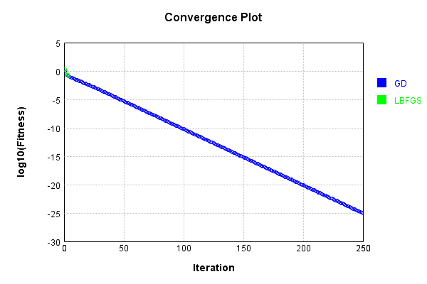
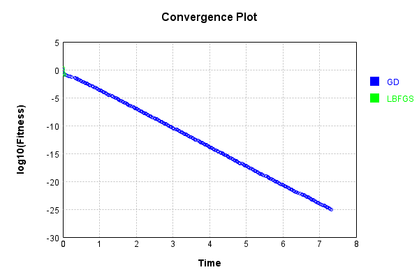
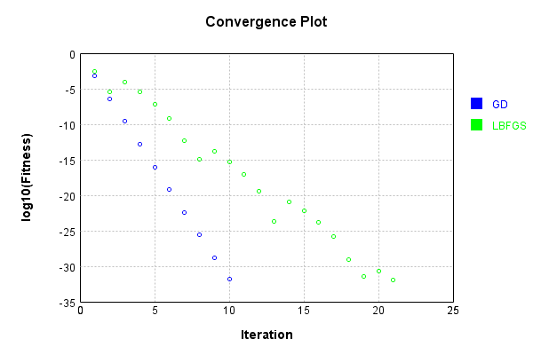
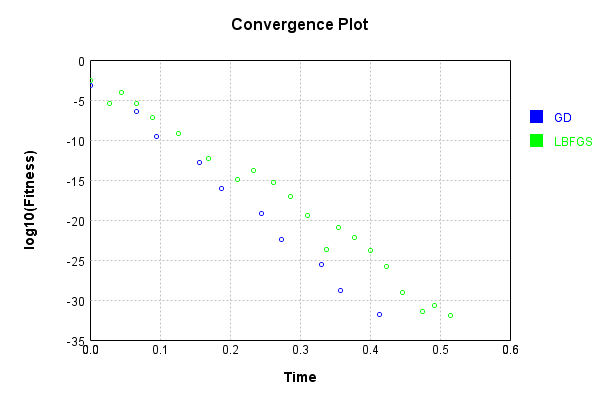
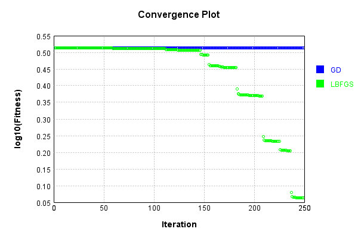
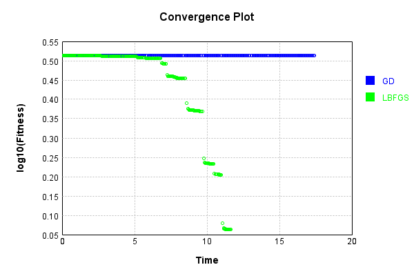

# SimpleConvolutionLayer
## MultiBand
### Json Serialization
Code from [JsonTest.java:36](../../../../../../../../src/main/java/com/simiacryptus/mindseye/test/unit/JsonTest.java#L36) executed in 0.00 seconds: 
```java
    JsonObject json = layer.getJson();
    NNLayer echo = NNLayer.fromJson(json);
    if ((echo == null)) throw new AssertionError("Failed to deserialize");
    if ((layer == echo)) throw new AssertionError("Serialization did not copy");
    if ((!layer.equals(echo))) throw new AssertionError("Serialization not equal");
    return new GsonBuilder().setPrettyPrinting().create().toJson(json);
```

Returns: 

```
    {
      "class": "com.simiacryptus.mindseye.layers.cudnn.SimpleConvolutionLayer",
      "id": "160a6696-8687-4e1c-a33a-566290dcad23",
      "isFrozen": false,
      "name": "SimpleConvolutionLayer/160a6696-8687-4e1c-a33a-566290dcad23",
      "filter": [
        [
          [
            0.152
          ]
        ],
        [
          [
            0.484
          ]
        ],
        [
          [
            -0.856
          ]
        ],
        [
          [
            -0.5
          ]
        ],
        [
          [
            -0.752
          ]
        ],
        [
          [
            0.868
          ]
        ],
        [
          [
            -0.908
          ]
        ],
        [
          [
            -1.192
          ]
        ],
        [
          [
            -1.604
          ]
        ]
      ],
      "strideX": 1,
      "strideY": 1,
      "simple": false,
      "precision": "Double"
    }
```


### Example Input/Output Pair
Code from [ReferenceIO.java:68](../../../../../../../../src/main/java/com/simiacryptus/mindseye/test/unit/ReferenceIO.java#L68) executed in 0.00 seconds: 
```java
    SimpleEval eval = SimpleEval.run(layer, inputPrototype);
    return String.format("--------------------\nInput: \n[%s]\n--------------------\nOutput: \n%s\n--------------------\nDerivative: \n%s",
      Arrays.stream(inputPrototype).map(t -> t.prettyPrint()).reduce((a, b) -> a + ",\n" + b).get(),
      eval.getOutput().prettyPrint(),
      Arrays.stream(eval.getDerivative()).map(t -> t.prettyPrint()).reduce((a, b) -> a + ",\n" + b).get());
```

Returns: 

```
    --------------------
    Input: 
    [[
    	[ [ 1.236, 0.164, 0.628 ] ]
    ]]
    --------------------
    Output: 
    [
    	[ [ -0.27032, -0.19622399999999998, -2.325088 ] ]
    ]
    --------------------
    Derivative: 
    [
    	[ [ -1.256, -1.46, -1.592 ] ]
    ]
```


[GPU Log](etc/cuda.log)

### Batch Execution
Code from [BatchingTester.java:66](../../../../../../../../src/main/java/com/simiacryptus/mindseye/test/unit/BatchingTester.java#L66) executed in 0.01 seconds: 
```java
    return test(reference, inputPrototype);
```

Returns: 

```
    ToleranceStatistics{absoluteTol=0.0000e+00 +- 0.0000e+00 [0.0000e+00 - 0.0000e+00] (60#), relativeTol=0.0000e+00 +- 0.0000e+00 [0.0000e+00 - 0.0000e+00] (60#)}
```


Code from [SingleDerivativeTester.java:77](../../../../../../../../src/main/java/com/simiacryptus/mindseye/test/unit/SingleDerivativeTester.java#L77) executed in 0.02 seconds: 
```java
    return test(component, inputPrototype);
```
Logging: 
```
    Inputs: [
    	[ [ -1.868, 0.208, -1.58 ] ]
    ]
    Inputs Statistics: {meanExponent=-0.0706342353962471, negative=2, min=-1.58, max=-1.58, mean=-1.08, count=3.0, positive=1, stdDev=0.9183114939931877, zeros=0}
    Output: [
    	[ [ 1.169216, -0.593856, 3.9825280000000003 ] ]
    ]
    Outputs Statistics: {meanExponent=0.14724491212250124, negative=1, min=3.9825280000000003, max=3.9825280000000003, mean=1.519296, count=3.0, positive=2, stdDev=1.8846289880086922, zeros=0}
    Feedback for input 0
    Inputs Values: [
    	[ [ -1.868, 0.208, -1.58 ] ]
    ]
    Value Statistics: {meanExponent=-0.0706342353962471, negative=2, min=-1.58, max=-1.58, mean=-1.08, count=3.0, positive=1, stdDev=0.9183114939931877, zeros=0}
    Implemented Feedback: [ [ 0.152, -0.5, -0.908 ], [ 0.484, -0.752, -1.192 ], [ -0.856, 0.868, -1.604 ] ]
    Implemented Statistics: {meanExponent=-0.16084036086178463, negative=6, min=-1.604, max=-1.604, mean=-0.47866666666666663, count=9.0, positive=3, stdDev=0.7684813306486733, zeros=0}
    Measured Feedback: [ [ 0.15199999999992997, -0.499
```
...[skipping 1624 bytes](etc/205.txt)...
```
    , 0.20800000000154029 ], [ 0.0, 0.0, -1.5799999999988046 ] ]
    Measured Statistics: {meanExponent=-0.0706342353960426, negative=6, min=-1.5799999999988046, max=-1.5799999999988046, mean=-0.35999999999982546, count=27.0, positive=3, stdDev=0.7350501116701962, zeros=18}
    Gradient Error: [ [ -4.247713292215849E-13, 0.0, 0.0 ], [ -6.801503804609865E-13, 0.0, 0.0 ], [ -1.0249578963339445E-12, 0.0, 0.0 ], [ 0.0, 6.854516954035716E-13, 0.0 ], [ 0.0, 4.3007264416417E-13, 0.0 ], [ 0.0, 1.1954881529163686E-12, 0.0 ], [ 0.0, 0.0, 1.7956747200287282E-12 ], [ 0.0, 0.0, 1.5402956687893266E-12 ], [ 0.0, 0.0, 1.1954881529163686E-12 ] ]
    Error Statistics: {meanExponent=-12.051343649262712, negative=3, min=1.1954881529163686E-12, max=1.1954881529163686E-12, mean=1.745404232667414E-13, count=27.0, positive=6, stdDev=6.080078279778662E-13, zeros=18}
    Finite-Difference Derivative Accuracy:
    absoluteTol: 4.3081e-13 +- 6.3587e-13 [0.0000e+00 - 2.7557e-12] (36#)
    relativeTol: 6.7415e-13 +- 8.5740e-13 [5.5067e-14 - 3.7026e-12] (18#)
    
```

Returns: 

```
    ToleranceStatistics{absoluteTol=4.3081e-13 +- 6.3587e-13 [0.0000e+00 - 2.7557e-12] (36#), relativeTol=6.7415e-13 +- 8.5740e-13 [5.5067e-14 - 3.7026e-12] (18#)}
```


### Reference Implementation
Code from [EquivalencyTester.java:61](../../../../../../../../src/main/java/com/simiacryptus/mindseye/test/unit/EquivalencyTester.java#L61) executed in 0.00 seconds: 
```java
    System.out.println(new GsonBuilder().setPrettyPrinting().create().toJson(this.reference.getJson()));
```
Logging: 
```
    {
      "class": "com.simiacryptus.mindseye.layers.aparapi.ConvolutionLayer",
      "id": "bcae7e0f-c151-4425-a459-fe97b046d816",
      "isFrozen": false,
      "name": "ConvolutionLayer/bcae7e0f-c151-4425-a459-fe97b046d816",
      "filter": [
        [
          [
            0.152
          ]
        ],
        [
          [
            -0.5
          ]
        ],
        [
          [
            -0.908
          ]
        ],
        [
          [
            0.484
          ]
        ],
        [
          [
            -0.752
          ]
        ],
        [
          [
            -1.192
          ]
        ],
        [
          [
            -0.856
          ]
        ],
        [
          [
            0.868
          ]
        ],
        [
          [
            -1.604
          ]
        ]
      ],
      "skip": [
        [
          0.0
        ]
      ],
      "simple": true
    }
    
```

Code from [EquivalencyTester.java:64](../../../../../../../../src/main/java/com/simiacryptus/mindseye/test/unit/EquivalencyTester.java#L64) executed in 0.01 seconds: 
```java
    return test(subject, inputPrototype);
```
Logging: 
```
    Inputs: [
    	[ [ 0.42, -1.916, -0.936 ] ]
    ]
    Error: [
    	[ [ 0.0, 0.0, 0.0 ] ]
    ]
    Accuracy:
    absoluteTol: 0.0000e+00 +- 0.0000e+00 [0.0000e+00 - 0.0000e+00] (3#)
    relativeTol: 0.0000e+00 +- 0.0000e+00 [0.0000e+00 - 0.0000e+00] (3#)
    
```

Returns: 

```
    ToleranceStatistics{absoluteTol=0.0000e+00 +- 0.0000e+00 [0.0000e+00 - 0.0000e+00] (3#), relativeTol=0.0000e+00 +- 0.0000e+00 [0.0000e+00 - 0.0000e+00] (3#)}
```


### Performance
Now we execute larger-scale runs to benchmark performance:

Code from [PerformanceTester.java:66](../../../../../../../../src/main/java/com/simiacryptus/mindseye/test/unit/PerformanceTester.java#L66) executed in 0.78 seconds: 
```java
    test(component, inputPrototype);
```
Logging: 
```
    100 batches
    Input Dimensions:
    	[100, 100, 3]
    Performance:
    	Evaluation performance: 0.021772s +- 0.001531s [0.019365s - 0.023508s]
    	Learning performance: 0.113496s +- 0.033551s [0.085853s - 0.164804s]
    
```

### Input Learning
In this test, we use a network to learn this target input, given it's pre-evaluated output:

Code from [LearningTester.java:127](../../../../../../../../src/main/java/com/simiacryptus/mindseye/test/unit/LearningTester.java#L127) executed in 0.01 seconds: 
```java
    return Arrays.stream(input_target).map(x -> x.prettyPrint()).reduce((a, b) -> a + "\n" + b).orElse("");
```

Returns: 

```
    [
    	[ [ 1.612, 0.448, 1.144 ], [ -1.748, -1.712, 1.18 ], [ 1.304, -0.536, -1.092 ], [ 0.04, 0.84, -0.768 ], [ -0.596, 0.936, 0.228 ], [ 1.464, -1.348, -1.42 ], [ -1.952, 1.152, -0.064 ], [ 1.836, -1.636, -1.816 ], ... ],
    	[ [ -0.768, -0.972, 0.724 ], [ 0.668, 0.22, 1.272 ], [ 1.072, -0.556, 0.18 ], [ -0.088, 0.004, -0.82 ], [ -1.948, -1.48, 1.448 ], [ 0.488, 0.792, 1.664 ], [ 1.704, 1.66, 0.772 ], [ -0.056, -1.188, 1.84 ], ... ],
    	[ [ -1.912, 1.996, -0.944 ], [ 0.728, -1.076, -1.168 ], [ -1.012, 0.888, -0.98 ], [ 1.632, -1.928, -0.556 ], [ 0.892, 1.728, 0.896 ], [ 1.968, -0.3, 0.06 ], [ -1.892, 1.208, 0.196 ], [ 0.188, 1.996, 1.596 ], ... ],
    	[ [ 0.148, -0.888, 0.852 ], [ -1.596, 1.788, -1.116 ], [ 0.16, -1.712, 0.464 ], [ -0.272, 0.9, 0.772 ], [ 1.48, 1.024, -1.856 ], [ 0.86, -0.828, 1.708 ], [ -1.648, -1.436, 0.876 ], [ -1.528, 0.572, 1.404 ], ... ],
    	[ [ -0.628, -1.492, -1.52 ], [ -1.172, -1.06, 0.224 ], [ 1.564, 1.248, 0.736 ], [ 1.18, -0.052, 0.144 ], [ 1.14, 0.936, 0.176 ], [ -1.22, -0.1, -0.084 ], [ 0.252, -0.888, -1.436 ], [ -1.82, -0.708, 1.768 ], ... ],
    	[ [ 1.988, -0.052, 0.836 ], [ 1.896, -0.92, -0.048 ], [ -1.184, 0.044, -1.964 ], [ 0.532, 0.224, -1.792 ], [ 1.48, -1.52, -1.72 ], [ 0.336, -0.872, 0.012 ], [ -1.924, 0.436, -0.62 ], [ -0.652, -0.52, 1.272 ], ... ],
    	[ [ -1.112, -0.724, 1.228 ], [ -0.444, -0.264, -0.324 ], [ -1.244, -0.676, 1.676 ], [ 1.228, 1.656, -0.8 ], [ -1.156, -1.648, 1.276 ], [ 0.436, 1.84, -0.572 ], [ -1.048, 0.5, -1.228 ], [ -1.316, 1.628, 0.996 ], ... ],
    	[ [ -1.152, 1.972, 0.116 ], [ 0.76, -0.22, 0.612 ], [ 0.772, -0.512, -1.36 ], [ 0.236, -0.736, -0.044 ], [ -0.496, 1.76, -1.34 ], [ 0.716, 1.0, -0.16 ], [ -1.66, 0.568, 1.008 ], [ -0.068, 0.732, -1.044 ], ... ],
    	...
    ]
```


First, we use a conjugate gradient descent method, which converges the fastest for purely linear functions.

Code from [LearningTester.java:300](../../../../../../../../src/main/java/com/simiacryptus/mindseye/test/unit/LearningTester.java#L300) executed in 7.40 seconds: 
```java
    return new IterativeTrainer(trainable)
      .setLineSearchFactory(label -> new QuadraticSearch())
      .setOrientation(new GradientDescent())
      .setMonitor(monitor)
      .setTimeout(30, TimeUnit.SECONDS)
      .setMaxIterations(250)
      .setTerminateThreshold(0)
      .run();
```
Logging: 
```
    Constructing line search parameters: GD
    F(0.0) = LineSearchPoint{point=PointSample{avg=6.467774833413736}, derivative=-0.003672395851314927}
    New Minimum: 6.467774833413736 > 6.467774833413368
    F(1.0E-10) = LineSearchPoint{point=PointSample{avg=6.467774833413368}, derivative=-0.0036723958513148066}, delta = -3.6770586575585185E-13
    New Minimum: 6.467774833413368 > 6.467774833411132
    F(7.000000000000001E-10) = LineSearchPoint{point=PointSample{avg=6.467774833411132}, derivative=-0.003672395851314085}, delta = -2.604139126560767E-12
    New Minimum: 6.467774833411132 > 6.467774833395664
    F(4.900000000000001E-9) = LineSearchPoint{point=PointSample{avg=6.467774833395664}, derivative=-0.003672395851309034}, delta = -1.8071766305638448E-11
    New Minimum: 6.467774833395664 > 6.467774833287703
    F(3.430000000000001E-8) = LineSearchPoint{point=PointSample{avg=6.467774833287703}, derivative=-0.003672395851273675}, delta = -1.2603251775544777E-10
    New Minimum: 6.467774833287703 > 6.467774832532011
    F(2.4010000000000004E-7) 
```
...[skipping 300325 bytes](etc/206.txt)...
```
    earchPoint{point=PointSample{avg=9.882564188907257E-26}, derivative=-2.9485795795850326E-30}, delta = -1.569698267766004E-26
    F(27076.418530184266) = LineSearchPoint{point=PointSample{avg=1.848987126417121E-25}, derivative=1.0365838239489742E-29}, delta = 7.037608807497949E-26
    F(2082.80142539879) = LineSearchPoint{point=PointSample{avg=1.0500348436279413E-25}, derivative=-3.97263316051617E-30}, delta = -9.519140203938487E-27
    F(14579.60997779153) = LineSearchPoint{point=PointSample{avg=1.0015481077258353E-25}, derivative=3.196562440302601E-30}, delta = -1.4367813794149083E-26
    1.0015481077258353E-25 <= 1.1452262456673262E-25
    New Minimum: 9.882564188907257E-26 > 9.124859260174177E-26
    F(9007.6504933198) = LineSearchPoint{point=PointSample{avg=9.124859260174177E-26}, derivative=5.230899885622557E-35}, delta = -2.3274031964990842E-26
    Right bracket at 9007.6504933198
    Converged to right
    Iteration 250 complete. Error: 9.124859260174177E-26 Total: 249735492597306.5300; Orientation: 0.0009; Line Search: 0.0260
    
```

Returns: 

```
    9.124859260174177E-26
```


Training Converged

Next, we run the same optimization using L-BFGS, which is nearly ideal for purely second-order or quadratic functions.

Code from [LearningTester.java:324](../../../../../../../../src/main/java/com/simiacryptus/mindseye/test/unit/LearningTester.java#L324) executed in 0.11 seconds: 
```java
    return new IterativeTrainer(trainable)
      .setLineSearchFactory(label -> new ArmijoWolfeSearch())
      .setOrientation(new LBFGS())
      .setMonitor(monitor)
      .setTimeout(30, TimeUnit.SECONDS)
      .setMaxIterations(250)
      .setTerminateThreshold(0)
      .run();
```
Logging: 
```
    LBFGS Accumulation History: 1 points
    Constructing line search parameters: GD
    th(0)=6.467774833413736;dx=-0.003672395851314927
    New Minimum: 6.467774833413736 > 6.459865687562135
    WOLFE (weak): th(2.154434690031884)=6.459865687562135; dx=-0.003669804762336981 delta=0.00790914585160074
    New Minimum: 6.459865687562135 > 6.451962124042509
    WOLFE (weak): th(4.308869380063768)=6.451962124042509; dx=-0.003667213673359035 delta=0.01581270937122703
    New Minimum: 6.451962124042509 > 6.420403693283746
    WOLFE (weak): th(12.926608140191302)=6.420403693283746; dx=-0.003656849317447251 delta=0.04737114012998944
    New Minimum: 6.420403693283746 > 6.279496056601296
    WOLFE (weak): th(51.70643256076521)=6.279496056601296; dx=-0.003610209715844224 delta=0.18827877681243965
    New Minimum: 6.279496056601296 > 5.5585351815506066
    WOLFE (weak): th(258.53216280382605)=5.5585351815506066; dx=-0.0033614651739614114 delta=0.9092396518631292
    New Minimum: 5.5585351815506066 > 2.218120629709003
    END: th(1551.1929768229563)=2.2181206297090
```
...[skipping 622 bytes](etc/207.txt)...
```
    nimum: 0.587664692700034 > 0.22198613376198764
    WOLF (strong): th(7200.000000000001)=0.22198613376198764; dx=1.7069099536916597E-5 delta=0.36567855893804635
    END: th(3600.0000000000005)=0.28268139433004974; dx=-5.0788688741395156E-5 delta=0.3049832983699842
    Iteration 3 complete. Error: 0.22198613376198764 Total: 249735578449896.4400; Orientation: 0.0015; Line Search: 0.0132
    LBFGS Accumulation History: 1 points
    th(0)=0.28268139433004974;dx=-3.549269827082019E-5
    New Minimum: 0.28268139433004974 > 0.1317093965247149
    END: th(7755.964884114783)=0.1317093965247149; dx=-3.4378539070382024E-6 delta=0.15097199780533485
    Iteration 4 complete. Error: 0.1317093965247149 Total: 249735592535523.4000; Orientation: 0.0017; Line Search: 0.0093
    LBFGS Accumulation History: 1 points
    th(0)=0.1317093965247149;dx=-8.98737413905382E-6
    MAX ALPHA: th(0)=0.1317093965247149;th'(0)=-8.98737413905382E-6;
    Iteration 5 failed, aborting. Error: 0.1317093965247149 Total: 249735605042369.4000; Orientation: 0.0015; Line Search: 0.0082
    
```

Returns: 

```
    0.1317093965247149
```


This training run resulted in the following regressed input:

Code from [LearningTester.java:154](../../../../../../../../src/main/java/com/simiacryptus/mindseye/test/unit/LearningTester.java#L154) executed in 0.01 seconds: 
```java
    return Arrays.stream(input_lbgfs).map(x -> x.prettyPrint()).reduce((a, b) -> a + "\n" + b).orElse("");
```

Returns: 

```
    [
    	[ [ 1.5639017951518983, 0.19602730869717713, 1.3268915713099387 ], [ -1.6251702863153874, -0.9755844911602524, 0.6367519783573307 ], [ 1.1062554549229988, -1.5446441591029902, -0.328449726709559 ], [ 0.18821523126474943, 1.6695492996021524, -1.4787573810758623 ], [ -0.6681044001675285, 0.6298363660802975, 0.5728839037385995 ], [ 1.4015204974581599, -1.8194139789841246, -1.2052422921169814 ], [ -1.9208780880833884, 1.0877763952338613, -0.06991607894003174 ], [ 1.9843489203769693, -0.7892519838609482, -2.7132391793723114 ], ... ],
    	[ [ -0.7104355366241163, -0.7686333866177948, 0.542832260977708 ], [ 0.7661115738380844, 0.9013859422516625, 0.8123270832899747 ], [ 1.1326303444343098, -0.07628457199991305, -0.19961352049783104 ], [ -0.2051930519953521, -0.8381855174891479, -0.1542868835959023 ], [ -1.646200835410394, 0.08440173022387956, 0.15199297138948903 ], [ 0.5529882783632072, 1.3709189612234634, 1.3483786728715659 ], [ 1.7075398753505562, 1.9271611764673515, 0.6268481399091229 ], [ 0.21141165911304946, 0.
```
...[skipping 2249 bytes](etc/208.txt)...
```
    851168327 ], [ -0.629579204887631, -1.5242274193633074, 0.7336160330766154 ], [ -1.1136158562900103, -0.11694712251741665, 1.1731368275143546 ], [ 0.8990224869188886, -0.3544003769680139, 0.901851435362691 ], [ -1.0257830715651788, -0.9627961295158427, 0.6467102345203898 ], [ 0.203345480056962, 0.3922925265642223, 0.6213410995165538 ], [ -1.2862111357097916, -1.1019157137807467, 0.1351775063760952 ], [ -1.1071561749442638, 2.8326948444473468, 0.08709524131853807 ], ... ],
    	[ [ -1.1060339521226397, 2.0574953829651084, 0.06208032372248996 ], [ 0.7352025845993686, -0.41017728104059964, 0.8451145750662201 ], [ 0.8523535518241757, -0.1617372871685951, -1.7380549395091316 ], [ 0.2710215161711624, -0.5251245061515986, -0.16030656563360857 ], [ -0.5593702942734844, 1.1499327686138343, -0.8671295316028365 ], [ 0.7051894487172444, 0.8500979659010584, -0.03308984239479211 ], [ -1.709936570686561, 0.20594592490871694, 1.4351332758615272 ], [ -0.24859198325908438, -0.16371922753873636, -0.2130149382408976 ], ... ],
    	...
    ]
```


Code from [LearningTester.java:96](../../../../../../../../src/main/java/com/simiacryptus/mindseye/test/unit/LearningTester.java#L96) executed in 0.01 seconds: 
```java
    return TestUtil.compare(runs);
```

Returns: 




Code from [LearningTester.java:99](../../../../../../../../src/main/java/com/simiacryptus/mindseye/test/unit/LearningTester.java#L99) executed in 0.00 seconds: 
```java
    return TestUtil.compareTime(runs);
```

Returns: 




### Model Learning
In this test, attempt to train a network to emulate a randomized network given an example input/output. The target state is:

Code from [LearningTester.java:176](../../../../../../../../src/main/java/com/simiacryptus/mindseye/test/unit/LearningTester.java#L176) executed in 0.00 seconds: 
```java
    return network_target.state().stream().map(Arrays::toString).reduce((a, b) -> a + "\n" + b).orElse("");
```

Returns: 

```
    [-0.752, -0.856, -0.908, 0.868, -1.192, 0.484, -0.5, -1.604, 0.152]
```


First, we use a conjugate gradient descent method, which converges the fastest for purely linear functions.

Code from [LearningTester.java:300](../../../../../../../../src/main/java/com/simiacryptus/mindseye/test/unit/LearningTester.java#L300) executed in 0.54 seconds: 
```java
    return new IterativeTrainer(trainable)
      .setLineSearchFactory(label -> new QuadraticSearch())
      .setOrientation(new GradientDescent())
      .setMonitor(monitor)
      .setTimeout(30, TimeUnit.SECONDS)
      .setMaxIterations(250)
      .setTerminateThreshold(0)
      .run();
```
Logging: 
```
    Constructing line search parameters: GD
    F(0.0) = LineSearchPoint{point=PointSample{avg=4.580245749345511}, derivative=-8.11555597838719}
    New Minimum: 4.580245749345511 > 4.58024574853396
    F(1.0E-10) = LineSearchPoint{point=PointSample{avg=4.58024574853396}, derivative=-8.115555977668109}, delta = -8.115508265404969E-10
    New Minimum: 4.58024574853396 > 4.5802457436646
    F(7.000000000000001E-10) = LineSearchPoint{point=PointSample{avg=4.5802457436646}, derivative=-8.11555597335354}, delta = -5.6809108528455E-9
    New Minimum: 4.5802457436646 > 4.580245709579281
    F(4.900000000000001E-9) = LineSearchPoint{point=PointSample{avg=4.580245709579281}, derivative=-8.115555943151726}, delta = -3.976622942047925E-8
    New Minimum: 4.580245709579281 > 4.580245470981932
    F(3.430000000000001E-8) = LineSearchPoint{point=PointSample{avg=4.580245470981932}, derivative=-8.115555731738837}, delta = -2.7836357840982373E-7
    New Minimum: 4.580245470981932 > 4.580243800800728
    F(2.4010000000000004E-7) = LineSearchPoint{point=PointSampl
```
...[skipping 12694 bytes](etc/209.txt)...
```
    int=PointSample{avg=1.4017823915702233E-29}, derivative=2.5061289350654024E-29}, delta = -6.400463209169758E-31
    1.4017823915702233E-29 <= 1.465787023661921E-29
    New Minimum: 5.047143056810331E-32 > 1.3937633622672933E-32
    F(1.1447607678390108) = LineSearchPoint{point=PointSample{avg=1.3937633622672933E-32}, derivative=6.105453764614722E-32}, delta = -1.4643932602996537E-29
    Right bracket at 1.1447607678390108
    Converged to right
    Iteration 10 complete. Error: 1.3937633622672933E-32 Total: 249736256402656.8000; Orientation: 0.0000; Line Search: 0.0501
    Zero gradient: 1.0073452628984341E-16
    F(0.0) = LineSearchPoint{point=PointSample{avg=1.3937633622672933E-32}, derivative=-1.0147444786839155E-32}
    New Minimum: 1.3937633622672933E-32 > 0.0
    F(1.1447607678390108) = LineSearchPoint{point=PointSample{avg=0.0}, derivative=0.0}, delta = -1.3937633622672933E-32
    0.0 <= 1.3937633622672933E-32
    Converged to right
    Iteration 11 complete. Error: 0.0 Total: 249736274084140.7500; Orientation: 0.0001; Line Search: 0.0117
    
```

Returns: 

```
    0.0
```


Training Converged

Next, we run the same optimization using L-BFGS, which is nearly ideal for purely second-order or quadratic functions.

Code from [LearningTester.java:324](../../../../../../../../src/main/java/com/simiacryptus/mindseye/test/unit/LearningTester.java#L324) executed in 0.57 seconds: 
```java
    return new IterativeTrainer(trainable)
      .setLineSearchFactory(label -> new ArmijoWolfeSearch())
      .setOrientation(new LBFGS())
      .setMonitor(monitor)
      .setTimeout(30, TimeUnit.SECONDS)
      .setMaxIterations(250)
      .setTerminateThreshold(0)
      .run();
```
Logging: 
```
    LBFGS Accumulation History: 1 points
    Constructing line search parameters: GD
    th(0)=3.61151195216798;dx=-6.546087616682967
    New Minimum: 3.61151195216798 > 3.279210102763588
    WOLF (strong): th(2.154434690031884)=3.279210102763588; dx=6.23760590596608 delta=0.33230184940439234
    New Minimum: 3.279210102763588 > 0.0026569284744315594
    END: th(1.077217345015942)=0.0026569284744315594; dx=-0.15424085535844276 delta=3.6088550236935486
    Iteration 1 complete. Error: 0.0026569284744315594 Total: 249736306363642.7200; Orientation: 0.0001; Line Search: 0.0173
    LBFGS Accumulation History: 1 points
    th(0)=0.0026569284744315594;dx=-0.0047210014688934335
    Armijo: th(2.3207944168063896)=0.003002187975532408; dx=0.005018537087387344 delta=-3.452595011008484E-4
    New Minimum: 0.0026569284744315594 > 4.1248870211170594E-6
    WOLF (strong): th(1.1603972084031948)=4.1248870211170594E-6; dx=1.4876780924695477E-4 delta=0.0026528035874104424
    END: th(0.3867990694677316)=0.001144786536858992; dx=-0.00309774504284664 delta=0.00151214193
```
...[skipping 9574 bytes](etc/210.txt)...
```
    ation: 0.0001; Line Search: 0.0117
    LBFGS Accumulation History: 1 points
    th(0)=2.0942680744593977E-31;dx=-3.3261155362492015E-31
    New Minimum: 2.0942680744593977E-31 > 8.702017827588448E-32
    WOLF (strong): th(1.8838011188271613)=8.702017827588448E-32; dx=1.9588274294790333E-31 delta=1.2240662917005528E-31
    New Minimum: 8.702017827588448E-32 > 1.2103756106440492E-32
    END: th(0.9419005594135806)=1.2103756106440492E-32; dx=-3.2870051570216977E-32 delta=1.9732305133949927E-31
    Iteration 21 complete. Error: 1.2103756106440492E-32 Total: 249736821815170.2000; Orientation: 0.0000; Line Search: 0.0173
    LBFGS Accumulation History: 1 points
    th(0)=1.2103756106440492E-32;dx=-6.879288353101535E-33
    Armijo: th(2.0292632397610557)=1.5553866463386408E-32; dx=9.03972240480838E-33 delta=-3.450110356945916E-33
    New Minimum: 1.2103756106440492E-32 > 0.0
    END: th(1.0146316198805279)=0.0; dx=0.0 delta=1.2103756106440492E-32
    Iteration 22 complete. Error: 0.0 Total: 249736843973095.2000; Orientation: 0.0000; Line Search: 0.0168
    
```

Returns: 

```
    0.0
```


Training Converged

Code from [LearningTester.java:96](../../../../../../../../src/main/java/com/simiacryptus/mindseye/test/unit/LearningTester.java#L96) executed in 0.00 seconds: 
```java
    return TestUtil.compare(runs);
```

Returns: 




Code from [LearningTester.java:99](../../../../../../../../src/main/java/com/simiacryptus/mindseye/test/unit/LearningTester.java#L99) executed in 0.00 seconds: 
```java
    return TestUtil.compareTime(runs);
```

Returns: 




### Composite Learning
In this test, attempt to train a network to emulate a randomized network given an example input/output. The target state is:

Code from [LearningTester.java:219](../../../../../../../../src/main/java/com/simiacryptus/mindseye/test/unit/LearningTester.java#L219) executed in 0.00 seconds: 
```java
    return network_target.state().stream().map(Arrays::toString).reduce((a, b) -> a + "\n" + b).orElse("");
```

Returns: 

```
    [0.152, 0.868, -1.604, -0.908, 0.484, -1.192, -0.5, -0.752, -0.856]
```


We simultaneously regress this target input:

Code from [LearningTester.java:223](../../../../../../../../src/main/java/com/simiacryptus/mindseye/test/unit/LearningTester.java#L223) executed in 0.01 seconds: 
```java
    return Arrays.stream(testInput).map(x -> x.prettyPrint()).reduce((a, b) -> a + "\n" + b).orElse("");
```

Returns: 

```
    [
    	[ [ -0.972, 1.224, -1.84 ], [ -1.544, -1.712, -0.244 ], [ -1.88, -1.172, -1.524 ], [ 1.672, -1.036, 0.612 ], [ 1.196, -0.228, 0.792 ], [ 1.424, 1.996, -1.256 ], [ -1.208, -0.528, 1.472 ], [ -1.304, 0.752, 1.928 ], ... ],
    	[ [ 0.628, 1.124, -0.412 ], [ 1.24, 1.836, 1.124 ], [ -0.576, 1.724, 1.032 ], [ 0.556, -1.752, 0.644 ], [ -1.616, -0.292, 0.352 ], [ -1.396, 0.292, 1.908 ], [ 0.064, -0.688, 1.056 ], [ -0.708, 0.996, 1.684 ], ... ],
    	[ [ 1.728, -0.424, -0.316 ], [ -0.384, 1.428, 1.404 ], [ 0.124, 0.264, 0.64 ], [ -1.412, -0.548, -1.176 ], [ 1.064, -1.836, -0.24 ], [ 0.608, 0.916, -1.24 ], [ 0.048, 0.572, 1.064 ], [ -1.172, -1.54, 1.68 ], ... ],
    	[ [ -1.668, -0.82, -1.636 ], [ -0.192, 1.004, 1.696 ], [ 0.372, -0.148, 0.212 ], [ -1.888, -1.876, 1.604 ], [ -1.216, -0.792, -1.836 ], [ -0.576, 0.144, 1.532 ], [ 0.116, 1.836, 1.684 ], [ 1.34, 1.068, -1.3 ], ... ],
    	[ [ -1.524, 0.016, 0.852 ], [ -0.824, -1.16, 1.468 ], [ 1.392, 0.688, -1.108 ], [ 0.104, 0.848, 0.376 ], [ -0.536, -0.184, -1.384 ], [ 1.136, -0.136, 1.86 ], [ 1.688, -1.456, 0.248 ], [ -0.592, -0.492, 1.304 ], ... ],
    	[ [ 1.788, -1.308, -1.756 ], [ -0.016, 1.948, 0.18 ], [ 0.94, -0.572, 0.968 ], [ -0.188, 1.868, -0.956 ], [ 0.42, 1.464, -1.924 ], [ -0.176, -0.116, -1.616 ], [ -0.136, 0.156, -1.024 ], [ 1.288, 1.136, 0.148 ], ... ],
    	[ [ 1.928, -0.548, 1.2 ], [ -0.364, 0.052, -0.976 ], [ 0.06, -1.392, -1.232 ], [ -0.708, -0.288, -0.552 ], [ 0.972, 0.916, 0.8 ], [ -1.5, 0.976, 0.216 ], [ -1.06, 0.556, 1.096 ], [ -0.728, -1.604, -1.124 ], ... ],
    	[ [ 0.232, 1.136, 0.716 ], [ -0.756, 1.168, -1.324 ], [ -1.984, -1.112, -0.464 ], [ -0.376, -0.876, -1.336 ], [ -1.2, 0.704, -1.792 ], [ -1.248, -1.34, -0.244 ], [ -1.396, -1.908, 1.172 ], [ -0.8, -0.728, -1.564 ], ... ],
    	...
    ]
```


Which produces the following output:

Code from [LearningTester.java:230](../../../../../../../../src/main/java/com/simiacryptus/mindseye/test/unit/LearningTester.java#L230) executed in 0.01 seconds: 
```java
    return Stream.of(targetOutput).map(x -> x.prettyPrint()).reduce((a, b) -> a + "\n" + b).orElse("");
```

Returns: 

```
    [
    	[ [ 3.866048, 3.668272, 1.140592 ], [ -1.329328, 0.8641920000000001, 2.268288 ], [ 1.1414400000000002, 2.9564, 3.1258879999999998 ], [ -1.626752, -2.749104, -0.5807999999999999 ], [ -1.28648, -2.140384, -1.104496 ], [ 3.9636, 1.170224, -1.1378559999999998 ], [ -3.0030080000000003, -0.9133119999999998, -0.258976 ], [ -2.637984, -0.7501759999999997, -1.563872 ], ... ],
    	[ [ 1.7319360000000001, 0.4648959999999999, -0.8065760000000001 ], [ -0.020768000000000345, -1.577104, -2.962816 ], [ -0.24644800000000022, 0.12727999999999998, -1.89184 ], [ -2.4692, -2.120464, 0.48824 ], [ -1.063696, 0.9064160000000003, 0.726272 ], [ -3.019168, -0.8654399999999999, -1.1548319999999999 ], [ -2.28128, -1.649856, -0.41856000000000004 ], [ -1.944224, -0.8824, -1.836496 ], ... ],
    	[ [ 0.40148800000000007, -1.3975680000000001, -0.27465599999999996 ], [ -1.07088, -0.6337439999999998, -2.0836799999999998 ], [ -0.77856, -0.747696, -0.808368 ], [ 1.196016, 2.418656, 2.124752 ], [ -1.0469600000000001, -1.5686560000000003, 1.054112 ], 
```
...[skipping 1136 bytes](etc/211.txt)...
```
    3.126272, 2.214368, -0.49240000000000017 ], [ 4.420688, 2.620624, 0.33601600000000004 ], [ 2.464624, 2.029936, 1.5585280000000001 ], [ 1.7572320000000001, 1.4196, 0.827232 ], [ 0.9444319999999999, -0.7960960000000001, -1.62496 ], ... ],
    	[ [ -2.107408, -3.4462559999999995, -1.5791039999999998 ], [ 1.555312, 1.519072, 0.978352 ], [ 0.7769920000000001, 0.740336, 2.071376 ], [ 0.5278080000000002, 1.161456, 1.043088 ], [ -0.3403680000000001, -1.392832, -1.8596320000000002 ], [ 0.27270399999999995, 1.576912, -0.16884799999999997 ], [ -1.4364960000000002, -0.07484799999999982, -0.826288 ], [ 0.29996800000000023, 1.224496, 2.532352 ], ... ],
    	[ [ -0.12715200000000002, -0.514304, -1.583168 ], [ 3.022608, 2.829968, 0.6330080000000001 ], [ -0.5225280000000001, 1.816352, 2.2254080000000003 ], [ 1.3254240000000002, 1.509936, 1.990368 ], [ 3.30304, 3.5664, 1.604544 ], [ -0.96144, 0.7754719999999999, 1.840544 ], [ -3.748224, -1.0529279999999999, 1.1295840000000001 ], [ 1.7551520000000003, 2.238336, 2.28624 ], ... ],
    	...
    ]
```


First, we use a conjugate gradient descent method, which converges the fastest for purely linear functions.

Code from [LearningTester.java:300](../../../../../../../../src/main/java/com/simiacryptus/mindseye/test/unit/LearningTester.java#L300) executed in 17.59 seconds: 
```java
    return new IterativeTrainer(trainable)
      .setLineSearchFactory(label -> new QuadraticSearch())
      .setOrientation(new GradientDescent())
      .setMonitor(monitor)
      .setTimeout(30, TimeUnit.SECONDS)
      .setMaxIterations(250)
      .setTerminateThreshold(0)
      .run();
```
Logging: 
```
    Constructing line search parameters: GD
    F(0.0) = LineSearchPoint{point=PointSample{avg=6.595114800643636}, derivative=-5.965464321144309}
    New Minimum: 6.595114800643636 > 6.595114800047239
    F(1.0E-10) = LineSearchPoint{point=PointSample{avg=6.595114800047239}, derivative=-5.9654643206104865}, delta = -5.963975979739189E-10
    New Minimum: 6.595114800047239 > 6.595114796467825
    F(7.000000000000001E-10) = LineSearchPoint{point=PointSample{avg=6.595114796467825}, derivative=-5.965464317407431}, delta = -4.175811696427445E-9
    New Minimum: 6.595114796467825 > 6.595114771412912
    F(4.900000000000001E-9) = LineSearchPoint{point=PointSample{avg=6.595114771412912}, derivative=-5.9654642949860435}, delta = -2.923072450755626E-8
    New Minimum: 6.595114771412912 > 6.595114596028281
    F(3.430000000000001E-8) = LineSearchPoint{point=PointSample{avg=6.595114596028281}, derivative=-5.965464138036299}, delta = -2.0461535576998813E-7
    New Minimum: 6.595114596028281 > 6.59511336833582
    F(2.4010000000000004E-7) = LineSearchPoint{po
```
...[skipping 273381 bytes](etc/212.txt)...
```
    oint{point=PointSample{avg=3.2590214099788457}, derivative=-1.1197521452817674E-15}, delta = -1.7840548229841602E-6
    Left bracket at 2.4443972409310963
    Converged to left
    Iteration 249 complete. Error: 3.2590214099788457 Total: 249754511426664.6000; Orientation: 0.0008; Line Search: 0.0799
    F(0.0) = LineSearchPoint{point=PointSample{avg=3.2590214099788457}, derivative=-1.7720007163808768E-6}
    New Minimum: 3.2590214099788457 > 3.2590197035748796
    F(2.4443972409310963) = LineSearchPoint{point=PointSample{avg=3.2590197035748796}, derivative=3.758250401710806E-7}, delta = -1.7064039661285335E-6
    3.2590197035748796 <= 3.2590214099788457
    New Minimum: 3.2590197035748796 > 3.2590196232011226
    F(2.0166783310220353) = LineSearchPoint{point=PointSample{avg=3.2590196232011226}, derivative=4.611208189578601E-16}, delta = -1.7867777231117543E-6
    Right bracket at 2.0166783310220353
    Converged to right
    Iteration 250 complete. Error: 3.2590196232011226 Total: 249754558368305.5000; Orientation: 0.0009; Line Search: 0.0362
    
```

Returns: 

```
    3.2590196232011226
```


This training run resulted in the following configuration:

Code from [LearningTester.java:245](../../../../../../../../src/main/java/com/simiacryptus/mindseye/test/unit/LearningTester.java#L245) executed in 0.00 seconds: 
```java
    return network_gd.state().stream().map(Arrays::toString).reduce((a, b) -> a + "\n" + b).orElse("");
```

Returns: 

```
    [-0.0013585082880837576, 0.04062197143027051, 0.009996086542871261, -4.013242527220655E-4, 0.024066713253548044, 0.021437233602606607, -0.0022814995965120717, -0.01313009386535576, 0.013320009867256214]
    [3.866048, 1.7319360000000001, 0.40148800000000007, 1.658848, -1.584368, 1.9530560000000001, -2.107408, -0.12715200000000002, 0.24286399999999997, 1.565888, -2.017712, -3.137408, 2.2769280000000003, 0.7772480000000002, 1.9296, 3.636368, -0.39760000000000006, 1.2626239999999997, -2.4842400000000002, -0.3193599999999999, -1.8027840000000002, -2.1898720000000003, -1.36616, -2.9154720000000003, -0.7272000000000001, 3.4413120000000004, -2.635904, 0.39484800000000003, 2.773056, -1.976496, -0.40393600000000013, 4.4879359999999995, -1.1442080000000001, -0.4494879999999999, 0.49856000000000006, 1.3298400000000001, 4.022, 0.4489920000000001, 1.978528, -1.651024, -1.715136, -0.2406079999999998, 1.16928, 3.02784, 0.63736, -1.770576, 1.210592, -1.7677919999999998, 1.8585440000000002, -0.660848, 0.81224, 3.984816, -1.829248
```
...[skipping 452671 bytes](etc/213.txt)...
```
    4, -0.6234559999999998, 1.298496, 0.7608479999999999, 1.986976, -0.9088159999999998, 0.257616, 0.9443839999999999, 0.24000000000000007, -1.013872, -0.8018080000000001, 1.1088, 1.2684000000000002, -2.391712, -0.76088, -0.793488, -0.14679999999999999, 0.16252800000000003, -0.609216, -1.6270719999999999, -0.14652800000000005, 1.6386399999999999, -0.6595199999999999, -0.640112, -1.002912, -0.759568, 0.03831999999999999, 0.24079999999999993, 1.1549599999999998, -0.7428959999999999, -2.479136, 3.631472, 1.057264, 0.2812959999999999, -0.864592, 1.5065439999999999, -1.433872, -0.07004799999999999, -0.7915999999999999, 1.6247840000000002, 0.02736000000000001, 1.4432159999999998, 1.9862239999999998, 1.03856, 0.06271999999999991, -2.432448, -0.8922559999999999, 1.87696, -1.6321919999999999, -1.192512, 0.4716, 2.3350079999999998, 0.804336, 1.4356639999999998, 2.933104, -1.145616, 1.9324639999999997, -1.548208, -0.253888, 0.710624, 0.2796639999999999, -1.8339039999999998, -1.913712, 1.0902560000000001, 0.9882719999999999]
```


And regressed input:

Code from [LearningTester.java:249](../../../../../../../../src/main/java/com/simiacryptus/mindseye/test/unit/LearningTester.java#L249) executed in 0.01 seconds: 
```java
    return Arrays.stream(input_gd).map(x -> x.prettyPrint()).reduce((a, b) -> a + "\n" + b).orElse("");
```

Returns: 

```
    [
    	[ [ 0.35125992532897354, -1.2882981765657726, 1.7476026246078198 ], [ 0.6355903841099743, 1.101275533026623, 0.4609738215749408 ], [ -1.3839115638124944, -1.2853230754491838, -0.6762220054548496 ], [ 1.5359311334817942, 0.8156464282803108, -0.40654508032804304 ], [ -0.10779358376709702, 1.3769215153635528, -0.12223334585046787 ], [ -1.2121749253741352, 1.6389592414906273, -1.7463640471785444 ], [ 0.7439438148004717, 1.8987639834034058, -1.049406809089097 ], [ 1.5758344755538192, 1.1880917494962484, -1.3376872076481794 ], ... ],
    	[ [ -1.6517288918550603, -0.07658450395336207, 0.4364507466744229 ], [ -0.4353444716873849, -1.2353034047194318, -1.7698317433270145 ], [ 0.2879115648942344, 0.8924875237862597, -0.6246684353091422 ], [ -1.2354852884689629, 0.6346683219977304, 1.9458455843658606 ], [ -0.7317015424026977, -1.7768421890796897, 1.6284679067081596 ], [ 0.7639954964093284, 1.2433045326609444, -0.11387207009960613 ], [ 1.5441157088865387, -0.7762256508866656, -1.0537104563941433 ], [ 0.21637451040957742,
```
...[skipping 2245 bytes](etc/214.txt)...
```
    3963613730527913 ], [ -0.2244924763202906, 1.906474454244976, -0.20224377383388017 ], [ -0.7118480873033506, -1.051060328979098, -0.418321687497869 ], [ 0.6836516542496707, 0.1249861706542592, -0.7425882447829224 ], [ -0.8073621037211637, -1.932117598704736, 1.1261795806894472 ], [ -0.7119085642001521, -1.246117194020392, 1.4529032638831159 ], [ 1.7359262231300665, -1.6215760988279002, -0.4126886822370436 ], [ 0.7118235373475661, -1.7996759217829612, -0.09004391632093506 ], ... ],
    	[ [ -0.44357833587349466, -1.9553696052329177, 1.2308933313250692 ], [ -0.5444341721542374, 0.9939670755725212, -1.5808203501176123 ], [ 0.711387452617651, 0.6071488954238752, 1.933550235514593 ], [ -0.7439488524981388, -0.6577153275656342, -1.4175344259068188 ], [ 0.4312469053378815, -0.09355471856605009, -0.37209933815384333 ], [ 0.4316037715650588, 1.525904761637185, 0.12488988514369255 ], [ 1.0480920554332576, 0.737146151680721, -1.832959653240797 ], [ 0.9671302495119873, 1.5905552696099456, -0.7171587963645524 ], ... ],
    	...
    ]
```


Which produces the following output:

Code from [LearningTester.java:256](../../../../../../../../src/main/java/com/simiacryptus/mindseye/test/unit/LearningTester.java#L256) executed in 0.00 seconds: 
```java
    return Stream.of(regressedOutput).map(x -> x.prettyPrint()).reduce((a, b) -> a + "\n" + b).orElse("");
```

Returns: 

```
    [ 3.2590196232011226 ]
```


Next, we run the same optimization using L-BFGS, which is nearly ideal for purely second-order or quadratic functions.

Code from [LearningTester.java:324](../../../../../../../../src/main/java/com/simiacryptus/mindseye/test/unit/LearningTester.java#L324) executed in 11.69 seconds: 
```java
    return new IterativeTrainer(trainable)
      .setLineSearchFactory(label -> new ArmijoWolfeSearch())
      .setOrientation(new LBFGS())
      .setMonitor(monitor)
      .setTimeout(30, TimeUnit.SECONDS)
      .setMaxIterations(250)
      .setTerminateThreshold(0)
      .run();
```
Logging: 
```
    LBFGS Accumulation History: 1 points
    Constructing line search parameters: GD
    th(0)=6.595114800643636;dx=-5.965464321144309
    New Minimum: 6.595114800643636 > 6.118353745459488
    WOLF (strong): th(2.154434690031884)=6.118353745459488; dx=5.516408039115341 delta=0.4767610551841486
    New Minimum: 6.118353745459488 > 3.264616713519138
    END: th(1.077217345015942)=3.264616713519138; dx=-0.2196752479994348 delta=3.3304980871244982
    Iteration 1 complete. Error: 3.264616713519138 Total: 249754647137363.4000; Orientation: 0.0016; Line Search: 0.0319
    LBFGS Accumulation History: 1 points
    th(0)=3.264616713519138;dx=-0.009242073086304542
    Armijo: th(2.3207944168063896)=3.2651742250781535; dx=0.009722509440775346 delta=-5.57511559015289E-4
    New Minimum: 3.264616713519138 > 3.259393857143273
    WOLF (strong): th(1.1603972084031948)=3.259393857143273; dx=2.4022758426023414E-4 delta=0.00522285637586517
    END: th(0.3867990694677316)=3.261653179567117; dx=-0.006081304105186379 delta=0.0029635339520210913
    Iteration 2 complete. Err
```
...[skipping 139475 bytes](etc/215.txt)...
```
    94907)=1.1555849650781704; dx=1.5615098586962696E-5 delta=4.469127509389992E-4
    END: th(0.24449203522789814)=1.155867934662536; dx=-5.943053381991017E-4 delta=1.6394316657342145E-4
    Iteration 248 complete. Error: 1.1555849650781704 Total: 249766211663013.8400; Orientation: 0.0014; Line Search: 0.0576
    LBFGS Accumulation History: 1 points
    th(0)=1.155867934662536;dx=-4.8219559190752586E-4
    New Minimum: 1.155867934662536 > 1.15566071254404
    END: th(0.5267421221314812)=1.15566071254404; dx=-3.0461132315745163E-4 delta=2.0722211849610872E-4
    Iteration 249 complete. Error: 1.15566071254404 Total: 249766239065110.7800; Orientation: 0.0015; Line Search: 0.0192
    LBFGS Accumulation History: 1 points
    th(0)=1.15566071254404;dx=-2.2831820728478372E-4
    New Minimum: 1.15566071254404 > 1.155441686307048
    END: th(1.1348315006210743)=1.155441686307048; dx=-1.5768860280801974E-4 delta=2.1902623699188162E-4
    Iteration 250 complete. Error: 1.155441686307048 Total: 249766270684603.7500; Orientation: 0.0016; Line Search: 0.0201
    
```

Returns: 

```
    1.155441686307048
```


This training run resulted in the following configuration:

Code from [LearningTester.java:266](../../../../../../../../src/main/java/com/simiacryptus/mindseye/test/unit/LearningTester.java#L266) executed in 0.00 seconds: 
```java
    return network_lbfgs.state().stream().map(Arrays::toString).reduce((a, b) -> a + "\n" + b).orElse("");
```

Returns: 

```
    [-0.04640999791248227, 1.2742273873687173, 0.6656301587480274, -0.04061143686925791, 1.055813408131033, 0.6241552631360489, -0.026947022878066062, 0.4420188686848739, 0.33951364297250963]
    [3.866048, 1.7319360000000001, 0.40148800000000007, 1.658848, -1.584368, 1.9530560000000001, -2.107408, -0.12715200000000002, 0.24286399999999997, 1.565888, -2.017712, -3.137408, 2.2769280000000003, 0.7772480000000002, 1.9296, 3.636368, -0.39760000000000006, 1.2626239999999997, -2.4842400000000002, -0.3193599999999999, -1.8027840000000002, -2.1898720000000003, -1.36616, -2.9154720000000003, -0.7272000000000001, 3.4413120000000004, -2.635904, 0.39484800000000003, 2.773056, -1.976496, -0.40393600000000013, 4.4879359999999995, -1.1442080000000001, -0.4494879999999999, 0.49856000000000006, 1.3298400000000001, 4.022, 0.4489920000000001, 1.978528, -1.651024, -1.715136, -0.2406079999999998, 1.16928, 3.02784, 0.63736, -1.770576, 1.210592, -1.7677919999999998, 1.8585440000000002, -0.660848, 0.81224, 3.984816, -1.829248, -1.330016, -2
```
...[skipping 452656 bytes](etc/216.txt)...
```
    4, -0.6234559999999998, 1.298496, 0.7608479999999999, 1.986976, -0.9088159999999998, 0.257616, 0.9443839999999999, 0.24000000000000007, -1.013872, -0.8018080000000001, 1.1088, 1.2684000000000002, -2.391712, -0.76088, -0.793488, -0.14679999999999999, 0.16252800000000003, -0.609216, -1.6270719999999999, -0.14652800000000005, 1.6386399999999999, -0.6595199999999999, -0.640112, -1.002912, -0.759568, 0.03831999999999999, 0.24079999999999993, 1.1549599999999998, -0.7428959999999999, -2.479136, 3.631472, 1.057264, 0.2812959999999999, -0.864592, 1.5065439999999999, -1.433872, -0.07004799999999999, -0.7915999999999999, 1.6247840000000002, 0.02736000000000001, 1.4432159999999998, 1.9862239999999998, 1.03856, 0.06271999999999991, -2.432448, -0.8922559999999999, 1.87696, -1.6321919999999999, -1.192512, 0.4716, 2.3350079999999998, 0.804336, 1.4356639999999998, 2.933104, -1.145616, 1.9324639999999997, -1.548208, -0.253888, 0.710624, 0.2796639999999999, -1.8339039999999998, -1.913712, 1.0902560000000001, 0.9882719999999999]
```


And regressed input:

Code from [LearningTester.java:270](../../../../../../../../src/main/java/com/simiacryptus/mindseye/test/unit/LearningTester.java#L270) executed in 0.01 seconds: 
```java
    return Arrays.stream(input_lbgfs).map(x -> x.prettyPrint()).reduce((a, b) -> a + "\n" + b).orElse("");
```

Returns: 

```
    [
    	[ [ 0.2710257836308438, 0.9101428497568507, 2.992718438517664 ], [ 0.6450857471648626, 0.48318644226365787, 0.26757673964332507 ], [ -1.4721732141984996, 0.6870911456818899, 0.6046207381603917 ], [ 1.5864533880265776, -0.5704984204870251, -1.2160632452053493 ], [ -0.04718004880482913, -0.1619497312810695, -1.0433208949253354 ], [ -1.2384198494737555, 2.6649126354617243, -1.302468950051879 ], [ 0.8036921853082324, 0.21888672819647736, -1.9401295512648058 ], [ 1.6266234816400722, -0.040741726781823744, -2.041100171167482 ], ... ],
    	[ [ -1.66095422980474, 0.370400507933825, 0.6096827457886806 ], [ -0.4356157650907869, -0.8329117655481604, -1.7015692377918747 ], [ 0.31452925666437626, 0.4687126587201653, -0.9419840386697022 ], [ -1.168669885755391, -1.3341227092746237, 0.8815592607695535 ], [ -0.7480578564160457, -1.4523783028704733, 1.8834677028765068 ], [ 0.8294391866170915, -0.4407262659999799, -1.05125573664647 ], [ 1.5578240388354885, -1.2112550809929452, -1.2805081596443137 ], [ 0.24440535408576688, -2.1
```
...[skipping 2237 bytes](etc/217.txt)...
```
    6963181913086994 ], [ -0.22916947929567566, 1.975336566458132, -0.13346868206216886 ], [ -0.7645050785233792, 0.06809350993194856, 0.3036445768925115 ], [ 0.6549232883565139, 0.7681422577508773, -0.3225174368338669 ], [ -0.7983951308276667, -1.923978178853406, 1.0250471009531559 ], [ -0.7313491727316365, -0.6387776380545854, 1.8011011794465275 ], [ 1.7248451872122488, -1.2594991344889024, -0.20767402843269486 ], [ 0.6456849673198514, -0.39684113663558834, 0.8339467202770267 ], ... ],
    	[ [ -0.44537543796062873, -1.6724656892161485, 1.3064129710514052 ], [ -0.5992735969761975, 2.518632717979339, -0.719524899036473 ], [ 0.7123021146114075, 0.2899689763279998, 1.8967555223060864 ], [ -0.8102862324062649, 0.8678206152725346, -0.4684797284890741 ], [ 0.3524767823655256, 1.954182543669201, 0.8308830806336288 ], [ 0.4459250405202389, 0.8535905371246476, -0.12952621011595053 ], [ 1.07642277528176, -0.3623898729243241, -2.309937013328824 ], [ 0.9323981633617012, 2.2743719796275603, -0.23086477816202605 ], ... ],
    	...
    ]
```


Which produces the following output:

Code from [LearningTester.java:277](../../../../../../../../src/main/java/com/simiacryptus/mindseye/test/unit/LearningTester.java#L277) executed in 0.00 seconds: 
```java
    return Stream.of(regressedOutput).map(x -> x.prettyPrint()).reduce((a, b) -> a + "\n" + b).orElse("");
```

Returns: 

```
    [ 1.155441686307048 ]
```


Code from [LearningTester.java:96](../../../../../../../../src/main/java/com/simiacryptus/mindseye/test/unit/LearningTester.java#L96) executed in 0.00 seconds: 
```java
    return TestUtil.compare(runs);
```

Returns: 




Code from [LearningTester.java:99](../../../../../../../../src/main/java/com/simiacryptus/mindseye/test/unit/LearningTester.java#L99) executed in 0.00 seconds: 
```java
    return TestUtil.compareTime(runs);
```

Returns: 




